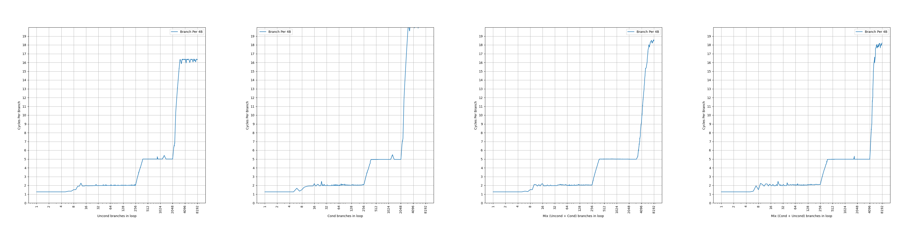
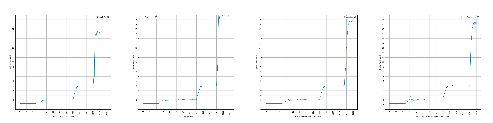
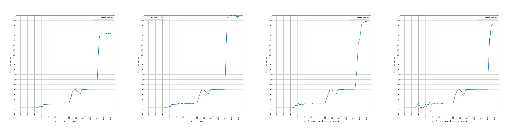
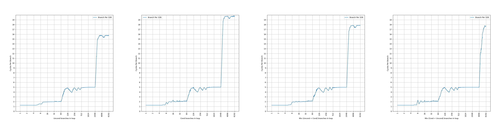
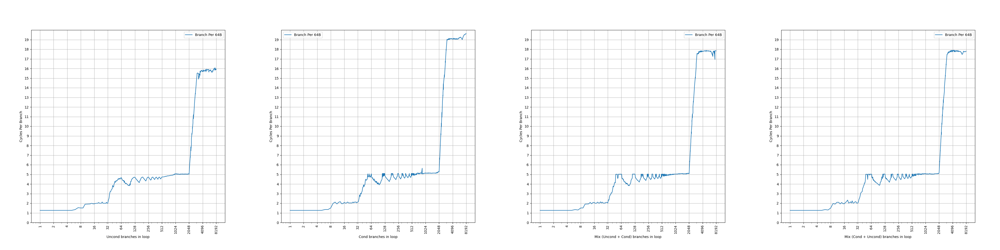
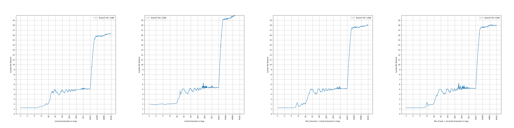

# AMD Zen 1 的 BTB 结构分析

## 背景

AMD Zen 1 是 AMD 的 Zen 系列的第一代微架构。在之前，我们分析了 ARM Neoverse [N1](./arm-neoverse-n1-btb.md) 和 [V1](./arm-neoverse-v1-btb.md) 的 BTB，那么现在也把视线转到 AMD 上，看看 AMD 的 Zen 系列的 BTB 是如何演进的。

<!-- more -->

## 官方信息

AMD 在 [Software Optimization Guide for AMD Family 17h Processors (Publication No. 55723)](https://www.amd.com/content/dam/amd/en/documents/processor-tech-docs/software-optimization-guides/55723_3_01_0.zip) 中有如下的表述：

> The branch target buffer (BTB) is a three-level structure accessed using the fetch address of the current fetch block.

Zen 1 的 BTB 有三级，是用当前 fetch block 的地址去查询。

> Each BTB entry includes information for branches and their targets. Each BTB entry can hold up to two branches if the branches reside in the same 64-byte aligned cache line and the first branch is a conditional branch.

Zen 1 的 BTB entry 有一定的压缩能力，一个 entry 最多保存两条分支，前提是两条分支在同一个 64B 缓存行中，并且第一条分支是条件分支。这样，如果第二条分支是无条件分支，分支预测的时候，可以根据第一条分支的方向预测的结果，决定要用哪条分支的目的地址作为下一个 fetch block 的地址。虽然有压缩能力，但是没有提到单个周期预测两条分支，所以只是扩大了等效 BTB 容量。

例如，有这么一段代码：

```asm
# fetch block entrypoint
entrypoint:
# do something
jnz targetA
# do something
jmp targetB
```

那么 jnz 和 jmp 指令可以放到同一个 entry 当中，一次读出来，然后对 jnz 指令进行分支方向预测：

- 如果 jnz 预测为跳转，那么当前 fetch block 从 entrypoint 开始，到 jnz 结束；下一个 fetch block 从 targetA 开始
- 如果 jnz 预测为不跳转，那么当前 fetch block 从 entrypoint 开始，到 jmp 结束；下一个 fetch block 从 targetB 开始

> L0BTB holds 4 forward taken branches and 4 backward taken branches, and predicts with zero bubbles.

Zen 1 的第一级 BTB 可以保存 4 条前向分支和 4 条后向分支，预测不会带来流水线气泡，也就是说每个周期都可以预测一次。

> L1BTB has 256 entries and creates one bubble if prediction differs from L0BTB.

Zen 1 的第二级 BTB 可以保存 256 个 entry，但不确定这个 entry 是否可以保存两条分支，也不确定这个 entry 数量代表了实际的 entry 数量还是分支数量，后续会做实验证实；预测会产生单个气泡，意味着它的延迟是两个周期。

> L2BTB has 4096 entries and creates four bubbles if its prediction differs from L1BTB.

Zen 1 的第三级 BTB 可以保存 4096 个 entry，但不确定这个 entry 是否可以保存两条分支，也不确定这个 entry 数量代表了实际的 entry 数量还是分支数量，后续会做实验证实；预测会产生四个气泡，意味着它的延迟是五个周期。

简单整理一下官方信息，大概有三级 BTB：

- (4+4)-entry L0 BTB, 1 cycle latency
- 256-entry L1 BTB, 2 cycle latency
- 4096-entry L2 BTB, 5 cycle latency

下面结合微架构测试，进一步研究它的内部结构。

## 微架构测试

在之前的博客里，我们已经测试了各种处理器的 BTB，在这里也是一样的：按照一定的 stride 分布无条件直接分支，构成一个链条，然后测量 CPI。

考虑到 Zen 1 的 BTB 可能出现一个 entry 保存两条分支的情况，并且还对分支的类型有要求，因此下面的测试都会进行四组，分别对应四种分支模式：

- uncond：所有分支都是无条件分支：uncond, uncond, uncond, uncond, ...
- cond：所有分支都是条件分支：cond, cond, cond, cond, ...
- mix (uncond + cond)：条件分支和无条件分支轮流出现，但 uncond 在先：uncond, cond, uncond, cond, ...
- mix (cond + uncond)：条件分支和无条件分支轮流出现，但 cond 在先：cond, uncond, cond, uncond, ...

### stride=4B

首先是 stride=4B 的情况：



可以看到，图像上出现了三个比较显著的台阶：

- 所有分支模式下，第一个台阶都是到 4 条分支，CPI=1.25，比 1 周期略高，猜测是因为循环体比较小，循环结束的操作的开销没有平摊造成的；4 对应了 4-entry 的 L0 BTB
- 所有分支模式下，第二个台阶都是到 256 条分支，CPI=2，对应了 256-entry 的 L1 BTB，意味着 L1 BTB 没有做一个 BTB entry 记录两条分支的优化，实际上就是 256 个 entry 保存 256 条分支
- 在 uncond 和 cond 模式下，第三个台阶到 2048 条分支，CPI=5，对应 L2 BTB，没有显现出完整的 4096 的大小，意味着 L2 BTB 实际上只有 2048 个 entry，每个 entry 最多保存两条分支，而 uncond 和 cond 模式下，不满足每个 entry 保存两条分支的条件，所以只保存了 2048 条分支
- 在 mix (uncond + cond) 模式下，第三个台阶一直延伸到了 3072，超出了 2048，意味着出现了两条分支保存在一个 entry 的情况，但并没有体现出完整的 4096 条分支的大小
- 在 mix (cond + uncond) 模式下，第三个台阶延伸到了 4096，体现出完整的 4096 的 L2 BTB 大小

可以观察到，过了 L2 BTB 容量以后，性能骤降到十多个 cycle，此时还没有超出 L1 ICache 容量，这么长的延迟，大概对应了后端执行分支再回滚，但实际上，在译码的时候就应该可以发现分支并进行静态预测，这样即使超出了 BTB 容量，延迟也不会一下子提高那么多。

### stride=8B

接下来观察 stride=8B 的情况：



现象和 stride=4B 基本相同，各级 BTB 显现出来的大小没有变化。

### stride=16B

继续观察 stride=16B 的情况：



相比 stride=4B/8B，L0 BTB 的行为没有变化；L1 BTB 的容量减半到了 128，意味着 L1 BTB 采用了组相连，此时有一半的 set 不能被用上。此外，比较特别的是，从 stride=16B 开始，CPI=5 的平台出现了波动，CPI 从 5 变到 4 再变到了 5，猜测此时 L1 BTB 也有一定的比例会介入。L2 BTB 在 mix (uncond + cond) 模式下，拐点从 3072 前移到 2560。

### stride=32B

继续观察 stride=32B 的情况：



相比 stride=16B，L0 BTB 的行为没有变化；L1 BTB 的容量进一步减到了 64，符合组相连的预期；L2 BTB 在 mix (uncond + cond) 模式下不再能体现出 3072 的容量，而是 2048：此时在一个 64B cacheline 中只有两条分支，第一条分支是 uncond，第二条分支是 cond，不满足 entry 共享的条件（必须 cond + uncond，不能是 uncond + cond），此时 uncond 和 cond 分别保存在两个 entry 中，每个 entry 只保存一条分支，因此 L2 BTB 只能体现出 2048 的容量。而 mix (cond + uncond) 模式依然满足 entry 共享的条件，所以依然体现出 4096 的容量。

### stride=64B

继续观察 stride=64B 的情况：



相比 stride=32B，L0 BTB 的行为没有变化；L1 BTB 的容量进一步减到了 32，符合组相连的预期；L2 BTB 在  mix (cond + uncond) 模式下只能体现出 2048 的容量，此时每个 64B cacheline 都只有一条分支，不满足两条分支共享一个 entry 的条件。

### stride=128B

继续观察 stride=128B 的情况：



相比 stride=64B，L0 BTB 的行为没有变化；L1 BTB 的容量进一步减到了 16，符合组相连的预期；L2 BTB 的容量减半到了 1024，意味着 L2 BTB 也是组相连结构。

## 小结

测试到这里就差不多了，更大的 stride 得到的也是类似的结果，总结一下前面的发现：

- L0 BTB 是 (4+4)-entry，1 cycle latency，不随着 stride 变化，全相连
- L1 BTB 是 256-entry，2 cycle latency，容量随着 stride 变化，大概率是 PC[n:3] 这一段被用于 index，使得 stride=16B 开始容量不断减半
- L2 BTB 是 2048-entry，5 cycle latency，容量随着 stride 变化，大概率是 PC[n:6] 这一段被用于 index，使得 stride=128B 开始容量不断减半；每个 entry 最多保存两条分支，前提是这两条分支在同一个 cacheline 当中，并且第一条是 cond，第二条是 uncond；因此最多保存 4096 个分支

也总结一下前面发现了各种没有解释的遗留问题：

- stride=4B/8B/16B 且为 mix (uncond + cond) 模式时，L2 BTB 体现出 3072/3072/2560 的容量，而非 4096：解析见后
- L2 BTB 对应的 CPI=5 的台阶出现比较明显的，在 4-5 之间的波动：暂无解释

接下来尝试解析一下这些遗留问题背后的原理。部分遗留问题，并没有被解释出来，欢迎读者提出猜想。

## 解析遗留问题

### stride=4B/8B/16B 且为 mix (uncond + cond) 模式时，L2 BTB 体现出 3072/3072/2560 的容量，而非 4096

前面测试出来，观察到两个奇怪的容量：3072 和 2560，分别有 3 和 5 的因子。下面通过进一步的实验，观察它的来源。

#### stride=16B 对应 2560 的 L2 BTB 容量

首先针对这个 2560 的拐点，做了一系列测试，在 stride=16B 的情况下，测试不同的 uncond/cond 分支的组合，下面是 64B cacheline 内四条分支的类型的不同组合（U 代表 Uncond，C 代表 Cond），以及该组合对应的容量：

- CCCC: 2048（即 cond 模式）
- CCCU: 2560
- CCUC: 2560
- CCUU: 2560
- CUCC: 2560
- CUCU: 4096（即 mix (cond + uncond) 模式）
- CUUC: 2560
- CUUU: 2560
- UCCC: 2048
- UCCU: 2560
- UCUC: 2560（即 mix (uncond + cond) 模式）
- UCUU: 2560
- UUCC: 2048
- UUCU: 2560
- UUUC: 2048
- UUUU: 2048（即 uncond 模式）

可以观察到，如果没有出现连续的 CU（CCCC/UCCC/UUCC/UUUC/UUUU），容量是 2048；如果出现了一组 CU（CC**CU**/C**CU**C/C**CU**U/**CU**CC/**CU**UC/**CU**UU/UC**CU**/U**CU**C/U**CU**U/UU**CU**），容量是 2560；出现了两组 CU（**CUCU**），就是 mix (cond + uncond) 模式，容量是 4096。

一种可能的猜想：

- 如果没有出现连续的 CU，那么每个 branch 占用一个 entry，那么容量就是 2048 个 branch
- 如果出现了一组 CU，那么一个 64B cacheline 里的 4 个 branch 对应 3 个 entry，那么前 2048 个 branch 对应 1536 个 entry，还剩下 512 个 entry，这些 entry 每个 entry 只放 1 个 branch（讨论见后），所以最后容量是 `2048+512=2560` 个 branch
- 如果出现了两组 CU，那么每一组 CU 的两个 branch 对应一个 entry，容量是 4096 个 branch

但是也遗留了一个问题，就是只有一组 CU 的情况下，为啥剩下的 512 个 entry 只放 512 个 branch，而不能放 1024 个 branch，按理说是可能再次出现 cond + uncond 合并？这个问题暂时还没有解释。

由此可以看出，2560 的来源是 4 路组相连，然后其中一路发生了 cond + uncond 的合并，所以最终是 5 个分支保存到 4 路当中，再来一条分支就会放不下。

#### stride=4B/8B 对应 3072 的 L2 BTB 容量

带着上面的分析，再去观察 stride=4B/8B 时的 3072：3072 有 3 的因子，所以大概率是从 2 路组相连得来，其中一路出现了 cond + uncond 的合并，所以出现了 3 个 branch 占用 2 个 entry 的情况，最后体现出来就是 3072 的 L2 BTB 容量。

似乎到这里，3072 和 2560 分别的 3 和 5 的因子都能解释了，剩下的就是解析具体的组相连的结构。

#### 组相连分析

那么到底是 2 路组相连，还是 4 路组相连呢，另外这个组相连的 set 是怎么构成的呢？

首先回忆一下，在 [ARM Neoverse N1](./arm-neoverse-n1-btb.md) 中，连续的 32B 内能放 6 个分支，但是 stride=8B 的时候，一次就会往同一个 set 里增加 4 个分支，于是一个 set 内的分支数从 0 变到 4 再变到 8，拐点出现在 4 个分支，而不是 6 个分支。因此为了达到前面出现的 3072 和 2560 的拐点，新增的分支也得均匀地分到各个 set 当中。

前面根据 L2 BTB 的容量分析到，L2 BTB 的 Index 可能是 PC[n:6]，但肯定不是简单的这么取，否则也会出现 ARM Neoverse N1 类似的问题。只能说明 PC[6] 往上有若干个 bit 是单独出现在 L2 BTB 的 Index 当中的，而 PC[5] 以下的 bit，可能以某种哈希函数的形式，参与到 Index 当中。

所以，L2 BTB 可能是以 PC[n:6] 作为 Index 去访问，然后内部有多个 bank，每个 bank 内部是 2 路组相连。bank index 是通过 PC 经过哈希计算得来，使得在 stride=4B/8B 的时候，体现出 2 路组相连，而在 stride=16B 的时候，体现出 4 路组相连。同时，分支还能够均匀地分布到各个 bank 当中，避免了和 ARM Neoverse N1 类似的情况的发生。
