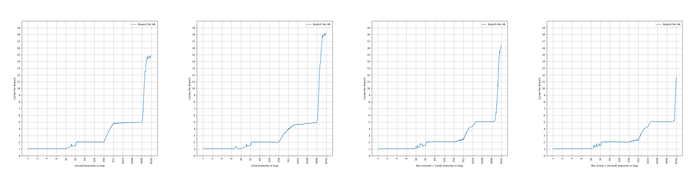
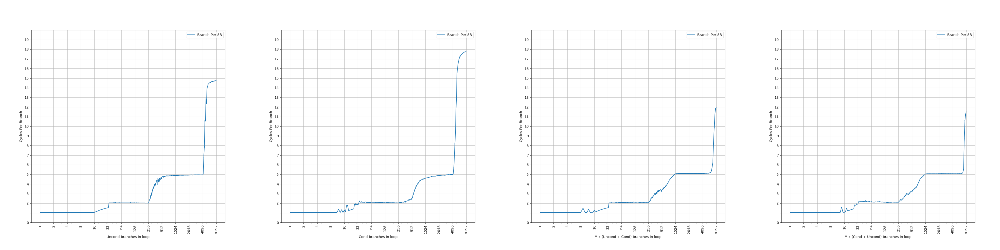
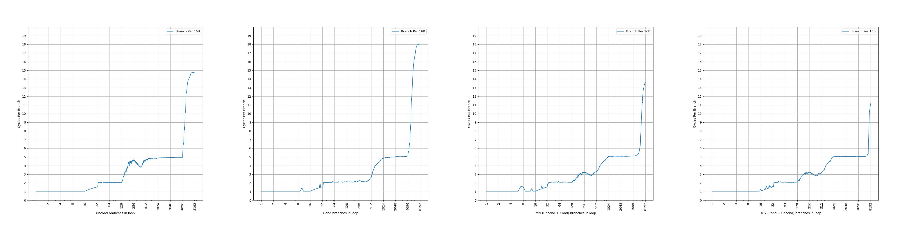
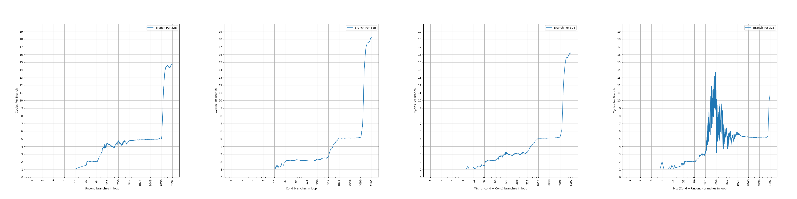
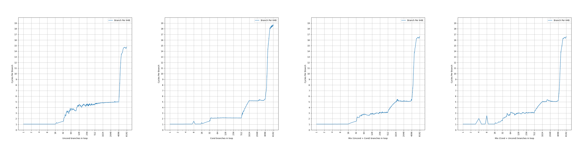

# AMD Zen 2 的 BTB 结构分析

## 背景

在之前，我们分析了 [AMD Zen 1](./amd-zen-1-btb.md) 的 BTB，接下来分析它的下一代微架构：2019 年发布的 AMD Zen 2 的 BTB，看看 AMD 的 Zen 系列的 BTB 是如何演进的。

<!-- more -->

## 官方信息

AMD 在 [Software Optimization Guide for AMD EPYC™ 7002 Processors (Publication No. 56305)](https://www.amd.com/content/dam/amd/en/documents/epyc-technical-docs/software-optimization-guides/56305.zip) 中有如下的表述：

> The branch target buffer (BTB) is a three-level structure accessed using the fetch address of the current fetch block.

Zen 2 的 BTB 有三级，是用当前 fetch block 的地址去查询，和 Zen 1 一样。

> Each BTB entry includes information for branches and their targets. Each BTB
entry can hold up to two branches if the branches reside in the same 64-byte aligned cache line and the first branch is a conditional branch.

Zen 2 的 BTB entry 有一定的压缩能力，一个 entry 最多保存两条分支，前提是两条分支在同一个 64B 缓存行中，并且第一条分支是条件分支。这样，如果第二条分支是无条件分支，分支预测的时候，可以根据第一条分支的方向预测的结果，决定要用哪条分支的目的地址作为下一个 fetch block 的地址。虽然有压缩能力，但是没有提到单个周期预测两条分支，所以只是扩大了等效 BTB 容量。和 Zen 1 一样。

> L0BTB holds 8 forward taken branches and 8 backward taken branches, and predicts with zero bubbles

Zen 2 的第一级 BTB 可以保存 8 条前向分支和 8 条后向分支，预测不会带来流水线气泡，也就是说每个周期都可以预测一次。相比 Zen 1 容量翻倍。

> L1BTB has 512 entries and creates one bubble if prediction differs from L0BTB

Zen 2 的第二级 BTB 可以保存 512 个 entry，但不确定这个 entry 是否可以保存两条分支，也不确定这个 entry 数量代表了实际的 entry 数量还是分支数量，后续会做实验证实；预测会产生单个气泡，意味着它的延迟是两个周期。相比 Zen 1 容量翻倍。

> L2BTB has 7168 entries and creates four bubbles if its prediction differs from L1BTB.

Zen 2 的第三级 BTB 可以保存 7168 个 entry，但不确定这个 entry 是否可以保存两条分支，也不确定这个 entry 数量代表了实际的 entry 数量还是分支数量，后续会做实验证实；预测会产生四个气泡，意味着它的延迟是五个周期。

简单整理一下官方信息，大概有三级 BTB：

- (8+8)-entry L0 BTB, 1 cycle latency
- 512-entry L1 BTB, 2 cycle latency
- 7168-entry L2 BTB, 5 cycle latency

从表述来看，除了容量以外基本和 Zen 1 一致，猜测是在 Zen 1 的基础上扩大了容量。

下面结合微架构测试，进一步研究它的内部结构。

## 微架构测试

在之前的博客里，我们已经测试了各种处理器的 BTB，在这里也是一样的：按照一定的 stride 分布无条件直接分支，构成一个链条，然后测量 CPI。

考虑到 Zen 2 的 BTB 可能出现一个 entry 保存两条分支的情况，并且还对分支的类型有要求，因此下面的测试都会进行四组，分别对应四种分支模式：

- uncond：所有分支都是无条件分支：uncond, uncond, uncond, uncond, ...
- cond：所有分支都是条件分支：cond, cond, cond, cond, ...
- mix (uncond + cond)：条件分支和无条件分支轮流出现，但 uncond 在先：uncond, cond, uncond, cond, ...
- mix (cond + uncond)：条件分支和无条件分支轮流出现，但 cond 在先：cond, uncond, cond, uncond, ...

### stride=4B

首先是 stride=4B 的情况：

可以看到，图像上出现了三个比较显著的台阶：

- 所有分支模式下，第一个台阶都是到 8 条分支，CPI=1，8 对应了 8-entry 的 L0 BTB
- 所有分支模式下，第二个台阶都是到 256 条分支，CPI=2，对应了 512-entry 的 L1 BTB，只体现出了一半的容量；但在 mix (uncond + cond) 和 mix (cond + uncond) 模式下，分支从 256 到 512 时 CPI 缓慢上升，意味着 L1 BTB 的 512-entry 还是可以完整访问，只是带来了一定的开销：CPI 从 2 增加到了 2.5
- 在 uncond 和 cond 模式下，第三个台阶到 4096 条分支，CPI=5，对应 L2 BTB，没有显现出完整的 7168 的大小
- 在 mix (uncond + cond) 模式下，第三个台阶延伸到了 5120，超出了 4096，依然没有显现出完整的 7168 的大小
- 在 mix (cond + uncond) 模式下，第三个台阶延伸到了 7168，显现出完整的 7168 的大小

和 Zen 1 不同，Zen 2 的 L1 BTB 出现了不同模式下容量不同的情况，原因未知，后续还会看到类似的情况。

Zen 2 的 L2 BTB 依然是带有压缩的，只有在 mix (cond + uncond) 模式下才可以尽可能地用上所有的容量，而其余的三种模式都有容量上的损失。

### stride=8B

接下来观察 stride=8B 的情况：

现象和 stride=4B 基本相同，L1 BTB 从 256 到 512 部分的变化斜率有所不同，其余部分一致。

### stride=16B

继续观察 stride=16B 的情况：

相比 stride=4B/8B，L0 BTB 和 L2 BTB 的行为没有变化；除了 cond 模式以外，L1 BTB 的容量减半到了 128，意味着 L1 BTB 采用了组相连，此时有一半的 set 不能被用上。此外，比较特别的是，从 stride=16B 开始，CPI=5 的平台出现了波动，uncond 模式下 CPI 从 5 变到 4 再变到了 5，猜测此时 L1 BTB 也有一定的比例会介入。

### stride=32B

继续观察 stride=32B 的情况：

相比 stride=16B，L0 BTB 的行为没有变化；除了 cond 模式以外，L1 BTB 的容量进一步减到了 64，符合组相连的预期；L2 BTB 在 mix (uncond + cond) 模式下不再能体现出 5120 的容量，而是 4096：此时在一个 64B cacheline 中只有两条分支，第一条分支是 uncond，第二条分支是 cond，不满足 entry 共享的条件（必须 cond + uncond，不能是 uncond + cond），此时 uncond 和 cond 分别保存在两个 entry 中，每个 entry 只保存一条分支，因此 L2 BTB 只能体现出 4096 的容量。而 mix (cond + uncond) 模式依然满足 entry 共享的条件，所以依然体现出 7168 的容量。特别地，在 mix (cond + uncond) 模式下出现了非常剧烈的 CPI 抖动，可能出现了一些预期之外的性能问题。

### stride=64B

继续观察 stride=64B 的情况：

相比 stride=32B，L0 BTB 的行为没有变化；除了 cond 模式以外，L1 BTB 的容量进一步减到了 32，符合组相连的预期，但 cond 模式下依然保持了 512 的容量；L2 BTB 在 mix (cond + uncond) 模式下只能体现出 4096 的容量，此时每个 64B cacheline 都只有一条分支，不满足两条分支共享一个 entry 的条件。

### stride=128B

继续观察 stride=128B 的情况：

相比 stride=64B，L0 BTB 的行为没有变化；除了 cond 模式以外，L1 BTB 的容量进一步减到了 16，符合组相连的预期，而 cond 模式下 L1 BTB 容量也减少到了 256；L2 BTB 的容量减半到了 2048，意味着 L2 BTB 也是组相连结构。

## 小结

测试到这里就差不多了，更大的 stride 得到的也是类似的结果，总结一下前面的发现：

- L0 BTB 是 (8+8)-entry，1 cycle latency，不随着 stride 变化，全相连
- L1 BTB 是 512-entry，2 cycle latency，容量随着 stride 变化，大概率是 PC[n:3] 这一段被用于 index，使得 stride=16B 开始容量不断减半；但 cond 模式下的行为和其余几种模式不同，直到 stride=128B 才开始容量减半
- L2 BTB 是 4096-entry，5 cycle latency，容量随着 stride 变化，大概率是 PC[n:6] 这一段被用于 index，使得 stride=128B 开始容量不断减半；其中有 3072 个 entry 最多保存两条分支，前提是这两条分支在同一个 cacheline 当中，并且第一条是 cond，第二条是 uncond；因此最多保存 7168 条分支

## Zen 1 和 Zen 2 的 BTB 的对比

下面是对比表格：

| uArch                   | AMD Zen 1    | AMD Zen 2    |
|-------------------------|--------------|--------------|
| L0 BTB size             | 4+4 branches | 8+8 branches |
| L0 BTB latency          | 1 cycle      | 1 cycle      |
| L1 BTB size             | 256 branches | 512 branches |
| L1 BTB latency          | 2 cycles     | 2 cycles     |
| L2 BTB size w/o sharing | 2K branches  | 4K branches  |
| L2 BTB size w/ sharing  | 4K branches  | 7K branches  |
| L2 BTB latency          | 5 cycles     | 5 cycles     |
| Technology Node         | 14nm         | 7nm          |
| Release Year            | 2017         | 2019         |

可见 Zen 2 在容量上做了一定的扩展，但机制上比较类似；特别地，可能是观察到 cond + uncond 的压缩能够生效的比例没有那么高，所以只允许其中一部分 entry 被压缩，例如 4 路组相连，只有前 3 个 way 是可以保存两条分支；剩下的一个 way 只能保存一条分支。

## AMD Zen 2 和 ARM Neoverse N1 的 BTB 的对比

AMD Zen 2 和 ARM Neoverse N1 都是在 2019 发布的处理器，下面对它们进行一个对比：

| uArch                        | AMD Zen 2    | ARM Neoverse N1 |
|------------------------------|--------------|-----------------|
| L0/Nano BTB size             | 8+8 branches | 16 branches     |
| L0/Nano BTB latency          | 1 cycle      | 1 cycle         |
| L1/Micro BTB size            | 512 branches | 64 branches     |
| L1/Micro BTB latency         | 2 cycles     | 2 cycles        |
| L2/Main BTB size w/o sharing | 4K branches  | 3K*2 branches   |
| L2/Main BTB size w/ sharing  | 7K branches  | 3K*2 branches   |
| L2/Main BTB latency          | 5 cycles     | 2-3 cycles      |
| Technology Node              | 7nm          | 7nm             |

可见 AMD Zen 2 在 BTB 容量上有优势，但是延迟要更长；两者都在最后一级 BTB 上做了压缩，但是压缩的方法和目的不同：

- AMD Zen 2 的压缩方法是，把同一个 64B cacheline 内一条 cond 和一条 uncond 指令放在同一个 entry 当中。这样做的好处是，当预测到 cond 分支不跳转的时候，可以直接根据 uncond 指令的信息，得到下一个 fetch block 的地址；但是也对代码的结构有要求，必须是在同一个 cacheline 中，依次出现一个 cond 和一个 uncond
- ARM Neoverse N1 的压缩方法是，根据立即数范围对分支进行分类，如果分支的立即数范围比较小，就只占用一个 entry 的一半也就是 41 bit；如果分支的立即数范围过大，就占用一个完整的 82 bit 的 entry；这主要是一个减少 SRAM 占用的优化，避免了所有的分支都要记录完整的 82 bit 信息；对代码的结构要求比较小，只要是跳转距离不太远的分支，都可以存到 41 bit 内

二者都没有实现一个周期预测两条分支，即 two taken（ARM 的说法是 two predicted branches per cycle）。这要等到 2020 年的 ARM Neoverse N2/V1，或者 2022 年的 AMD Zen 4 才被实现。

注意到 AMD 的 [Software Optimization Guide for AMD EPYC™ 7002 Processors (Publication No. 56305)](https://www.amd.com/content/dam/amd/en/documents/epyc-technical-docs/software-optimization-guides/56305.zip) 文档里，有这么一段表述：

> Branches whose target crosses a half-megabyte aligned boundary are unable to be installed in the L0 BTB or to share BTB entries with other branches.

也就是说，如果两个分支要共享一个 BTB entry，那么它们的目的地址不能跨越 512KB 边界，也就是和分支地址的偏移量不超过 19 位。按 48 位虚拟地址计算，如果 BTB entry 只记录一条分支，最多需要记录目的地址的完整 48 位地址；如果现在 BTB entry 要存两条分支，这两条分支的目的地址都只需要记录 19 位，加起来也就 38 位，还可以空余 10 位的信息用来维护 BTB sharing 所需的额外信息。

所以说到底，无论是 AMD 还是 ARM，做的事情都是对一个固定长度的 entry 设置了不同的格式，一个格式保存的地址位数多，但是只能保存一个分支；另一个格式保存的地址位数少，但是可以保存两个分支。区别就是 AMD 对两个分支的类型和位置有要求，而 ARM 允许这两个分支毫无关系。这就是不同厂商的取舍了。
