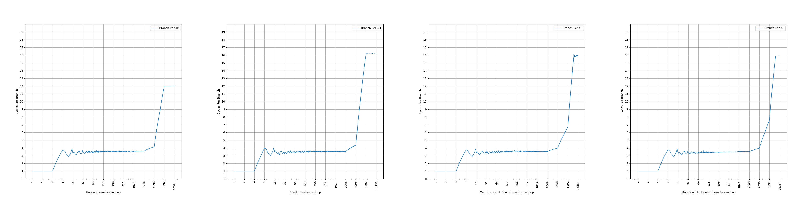
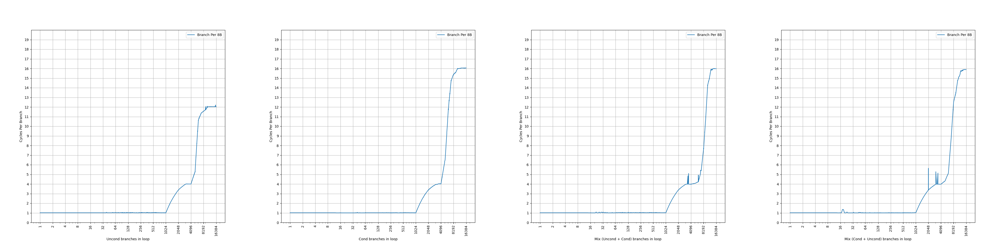
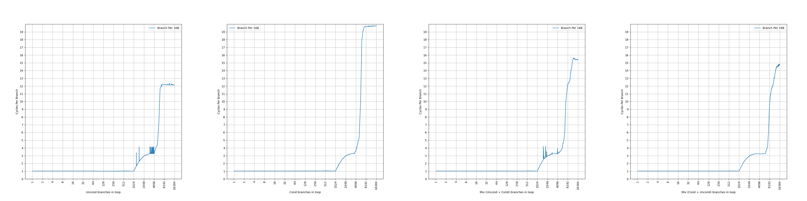
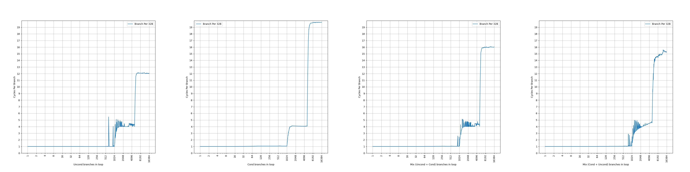
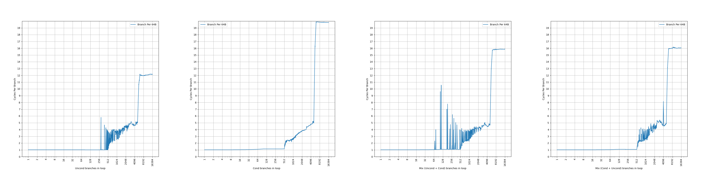
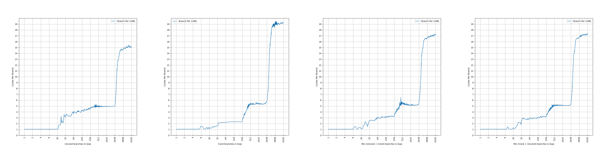

# AMD Zen 3 的 BTB 结构分析

## 背景

在之前，我们分析了 [AMD Zen 1](./amd-zen-1-btb.md) 和 [AMD Zen 2](./amd-zen-2-btb.md) 的 BTB，接下来分析它的再下一代微架构：AMD Zen 3 的 BTB，看看 AMD 的 Zen 系列的 BTB 是如何演进的。

<!-- more -->

## 官方信息

AMD 在 [Software Optimization Guide for AMD EPYC™ 7003 Processors (Publication No. 56665)](https://www.amd.com/content/dam/amd/en/documents/epyc-technical-docs/software-optimization-guides/56665.zip) 中有如下的表述：

> The branch target buffer (BTB) is a two-level structure accessed using the fetch address of the previous fetch block.

Zen 3 的 BTB 有两级，相比 Zen 1 和 Zen 2 少了一级。BTB 是用之前 fetch block 的地址去查询，而不再是当前 fetch block 的地址。用当前 fetch block 的地址查询 BTB 很好理解，要寻找某个地址开始的第一个分支，就用这个地址去查询 BTB，Zen 1 和 Zen 2 都是如此；用之前 fetch block 的地址，则是用更早的信息，去获取当前 fetch block 的信息，例如：

```asm
entrypoint1:
    jmp entrypoint2

entrypoint2:
    # what's the first branch after entrypoint2?
```

在查询从 entrypoint2 开始的第一条分支指令的时候，如果使用当前 fetch block，就是用 entrypoint2 的地址去查询，那就必须等到前面 `jmp entrypoint2` 指令的目的地址被计算得出；如果使用之前 fetch block，就是用 entrypoint1 的地址去查询，不用等到 `jmp entrypoint2` 指令的目的地址被计算得出。因此，如果用之前 fetch block，可以更早地进行 BTB 的访问，从而减少 BTB 的延迟，或者在相同延迟下获得更大的容量。但是，代价是：

- 从 entrypoint1 跳转到的 fetch block 可能有多个，例如最后一条是间接分支指令，那就需要找到正确的分支的信息
- 可能会从不同的地址跳转到 entrypoint2 这个 fetch block，因此它的信息可能会保存多份

> Each BTB entry can hold up to two branches if the last bytes of the branches reside in the same 64-byte aligned cache line and the first branch is a conditional branch.

Zen 3 的 BTB entry 有一定的压缩能力，一个 entry 最多保存两条分支，前提是两条分支在同一个 64B 缓存行中，并且第一条分支是条件分支。这样，如果第二条分支是无条件分支，分支预测的时候，可以根据第一条分支的方向预测的结果，决定要用哪条分支的目的地址作为下一个 fetch block 的地址。虽然有压缩能力，但是没有提到单个周期预测两条分支，所以只是扩大了等效 BTB 容量。和 Zen 1、Zen 2 一样。

> L1BTB has 1024 entries and predicts with zero bubbles for conditional and unconditional direct branches, and one cycle for calls, returns and indirect branches.

Zen 3 的第一级 BTB 可以保存 1024 个 entry，但不确定这个 entry 是否可以保存两条分支，也不确定这个 entry 数量代表了实际的 entry 数量还是分支数量，后续会做实验证实；针对条件和无条件直接分支的预测不产生气泡，意味着它的延迟是一个周期。相比 Zen 2 容量翻倍，且延迟降低一个周期，猜测和使用 previous fetch block 有关。

> L2BTB has 6656 entries and creates three bubbles if its prediction differs from L1BTB.

Zen 3 的第二级 BTB 可以保存 6656 个 entry，但不确定这个 entry 是否可以保存两条分支，也不确定这个 entry 数量代表了实际的 entry 数量还是分支数量，后续会做实验证实；预测会产生三个气泡，意味着它的延迟是四个周期。

简单整理一下官方信息，大概有两级 BTB：

- 1024-entry L1 BTB, 1 cycle latency
- 6656-entry L2 BTB, 4 cycle latency

相比 Zen 1 和 Zen 2 有比较大的不同：去掉了原来很小的 L0 BTB，扩大了 L1 BTB，同时延迟缩短了一个周期；虽然 L2 BTB 有所缩小，但是延迟也变短了一个周期。

下面结合微架构测试，进一步研究它的内部结构。

## 微架构测试

在之前的博客里，我们已经测试了各种处理器的 BTB，在这里也是一样的：按照一定的 stride 分布无条件直接分支，构成一个链条，然后测量 CPI。

考虑到 Zen 3 的 BTB 可能出现一个 entry 保存两条分支的情况，并且还对分支的类型有要求，因此下面的测试都会进行四组，分别对应四种分支模式：

- uncond：所有分支都是无条件分支：uncond, uncond, uncond, uncond, ...
- cond：所有分支都是条件分支：cond, cond, cond, cond, ...
- mix (uncond + cond)：条件分支和无条件分支轮流出现，但 uncond 在先：uncond, cond, uncond, cond, ...
- mix (cond + uncond)：条件分支和无条件分支轮流出现，但 cond 在先：cond, uncond, cond, uncond, ...

虽然 Zen 3 使用 previous fetch block 来访问 BTB，但在这几种分支模式中，使用 previous fetch block 还是访问 current fetch block，结果都是唯一的，所以并不会对结果带来影响。

### stride=4B

首先是 stride=4B 的情况：



可以看到，图像上出现了三个比较显著的拐点：

- 第一个拐点是 4 条分支，CPI=1，对应 L1 BTB，没有达到完整容量，可能是因为分支太过密集
- 第二个拐点是 2048 条分支，CPI=3.6；第三个拐点是 4096 条分支，CPI=4/4.2/4.4

Zen 3 在 stride=4B 的情况下 L1 BTB 表现比较一般，应该是牺牲了高密度分支下的性能；而主要命中的是 L2 BTB，在不同的分支模式下，测出来差不多的结果。

### stride=8B

接下来观察 stride=8B 的情况：



- 第一个台阶在所有分支模式下都是 1024 个分支，CPI=1，对应 1024-entry 的 L1 BTB
- 第二个台阶不太明显，但是在 4096 附近在所有分支模式下都是一个拐点，CPI=4，对应 L2 BTB；在 mix (uncond + cond) 模式下，超过 4096 分支后 CPI 缓慢上升，到 6144 条分支 CPI=4.25，到 6656 条分支 CPI=4.85，之后 CPI 快速上升；在 mix (cond + uncond) 模式下，到 5888 条分支 CPI=5。

L2 BTB 的容量不太确定，超过 4096 后需要一个 entry 保存两条分支才能获得更多容量，但也带来了一定的额外的延迟。

### stride=16B

继续观察 stride=16B 的情况：



相比 stride=8B，L1 BTB 的行为没有变化。4096 对应的 CPI 有所下降，可能是 L1 BTB 起了一定的作用。在 mix (cond + uncond) 模式下，直到 5632 条分支还维持了 CPI=3.25，之后 CPI 缓慢上升，到 6656 条分支时 CPI=3.75，到 6912 条分支时 CPI=4。

CPI=3.25 可能是来自于 1 和 4 的加权平均：25% 的时候是 1 周期，75% 的时候是 4 周期，平均下来就是 `1*0.25+4*0.75=3.25`。这意味着 L1 BTB 还要保持 25% 的命中率。依此类推，CPI=3.75 来自于 1/12 的时候是 1 周期，11/12 的时候是 4 周期，那么 `1*1/12+4*11/12=3.75`。

### stride=32B

继续观察 stride=32B 的情况：



相比 stride=16B，L1 BTB 的行为没有变化，但是出现了一些性能波动。所有分支模式下，L2 BTB 的拐点都出现在 5120，但性能波动比较大，mix (cond + uncond) 模式下的 CPI 达到了 4.6。

### stride=64B

继续观察 stride=64B 的情况：



相比 stride=32B，L1 BTB 的容量减半，达到了 512。之后出现了比较明显的性能波动，但四种分支模式下，拐点依然都是出现在 5120 条分支的位置。

### stride=128B

继续观察 stride=128B 的情况：



相比 stride=64B，L1 BTB 的容量进一步减小，达到了 256；L2 BTB 的性能依然波动剧烈，但四种分支模式下，拐点依然都是出现在 5120 条分支的位置。

考虑到 5120 这个拐点频繁出现，认为 L2 BTB 在不考虑 BTB entry sharing 的情况下，实际容量应该是 5120。那么剩下的 1536 个分支就是来自于压缩。

## 小结

测试到这里就差不多了，更大的 stride 得到的也是类似的结果，总结一下前面的发现：

- L1 BTB 是 1024-entry，1 cycle latency，容量随着 stride 变化，大概率是 PC[n:5] 这一段被用于 index，使得 stride=64B 开始容量不断减半
- L2 BTB 是 5120-entry，4 cycle latency；其中有 1536 个 entry 最多保存两条分支，前提是这两条分支在同一个 cacheline 当中，并且第一条是 cond，第二条是 uncond

## Zen 1 到 Zen 3 的 BTB 的对比

下面是对比表格：

| uArch                   | AMD Zen 1    | AMD Zen 2    | AMD Zen 3     |
|-------------------------|--------------|--------------|---------------|
| L0 BTB size             | 4+4 branches | 8+8 branches | N/A           |
| L0 BTB latency          | 1 cycle      | 1 cycle      | N/A           |
| L1 BTB size             | 256 branches | 512 branches | 1024 branches |
| L1 BTB latency          | 2 cycles     | 2 cycles     | 1 cycle       |
| L2 BTB size w/o sharing | 2K branches  | 4K branches  | 5K branches   |
| L2 BTB size w/ sharing  | 4K branches  | 7K branches  | 6.5K branches |
| L2 BTB latency          | 5 cycles     | 5 cycles     | 4 cycles      |
| Technology Node         | 14nm         | 7nm          | 7nm           |
| Release Year            | 2017         | 2019         | 2020          |

Zen 3 在 Zen 2 的基础上，没有更换制程，而是通过 previous fetch block 的方式，减少 L1 BTB 的延迟到 1 cycle，顺带去掉了 L0 BTB。L2 BTB 的大小进行了调整，减少了共享的部分，而增加了不限制分支类型的 BTB entry 数量，同时减少了一个周期的延迟，不确定这个延迟是单纯通过优化容量实现的，还是说也依赖了 previous fetch block 的方法来减少周期，更倾向于是后者，因为 L1 和 L2 BTB 都减少了一个周期的延迟。

如果按照 Intel 的 tick-tock 说法，那么 Zen 2 相比 Zen 1 是一次 tick，更换制程，微架构上做少量改动；Zen 3 相比 Zen 2 是一次 tock，不更换制程，但是在微架构上做较多改动。

## AMD Zen 3 和 ARM Neoverse V1 的 BTB 的对比

AMD Zen 3 和 ARM Neoverse V1 都是在 2020 发布的处理器，下面对它们进行一个对比：

| uArch                        | AMD Zen 3     | ARM Neoverse V1 |
|------------------------------|---------------|-----------------|
| L1/Nano BTB size             | 1024 branches | 48*2 branches   |
| L1/Nano BTB latency          | 1 cycle       | 1 cycle         |
| L1/Nano BTB throughput       | 1 branch      | 1-2 branches    |
| L2/Main BTB size w/o sharing | 5K branches   | 4K*2 branches   |
| L2/Main BTB size w/ sharing  | 6.5K branches | 4K*2 branches   |
| L2/Main BTB latency          | 4 cycles      | 2 cycles        |
| L2/Main BTB throughput       | 1 branch      | 1-2 branches    |
| Technology Node              | 7nm           | 5nm             |

虽然 AMD Zen 3 通过 previous fetch block 优化，实现了 1 cycle 下更大的 L1 BTB，但这一点在 2022 年发布的 ARM Neoverse V2 上被追赶：ARM Neoverse V2 的 L1/Nano BTB 也做到了 1024 的容量。

在 L2 BTB 方面，ARM Neoverse V1 占据了领先，无论是延迟还是容量；当然了，ARM Neoverse V1 的制程也要更加领先，ARM 采用的 5nm 对比 AMD 采用的 7nm。

更进一步，ARM Neoverse V1 实现了一个周期预测两条分支，即 two taken（ARM 的说法是 two predicted branches per cycle），在 2 cycle 的 Main BTB 上可以实现接近 AMD Zen 3 的 L1 BTB 的预测吞吐。AMD 也不甘示弱，在 2022 年发布的 AMD Zen 4 处理器上，实现了 two taken。
