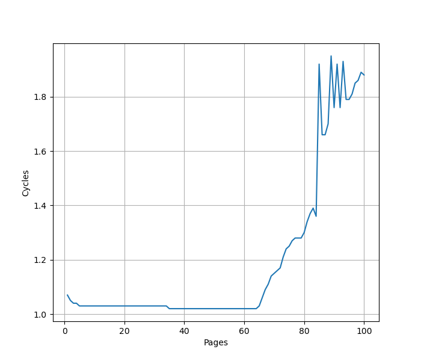
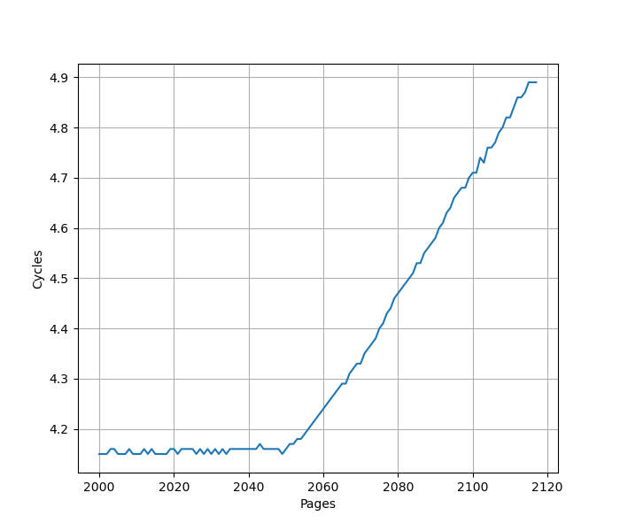
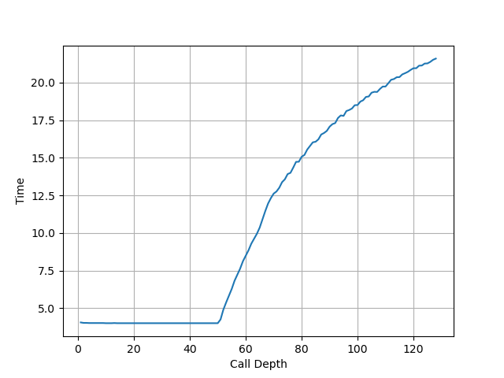
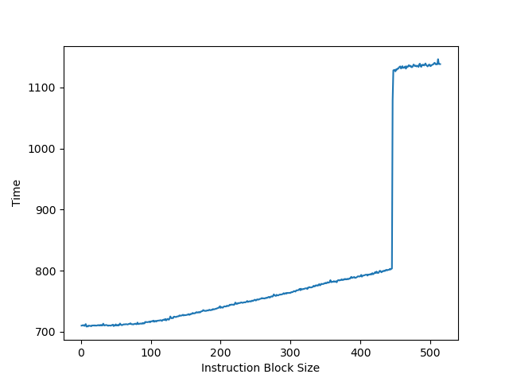
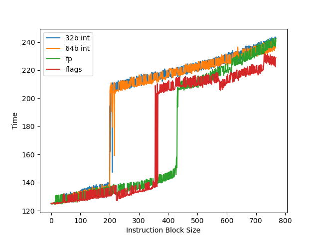
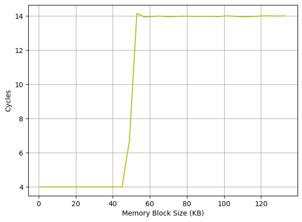
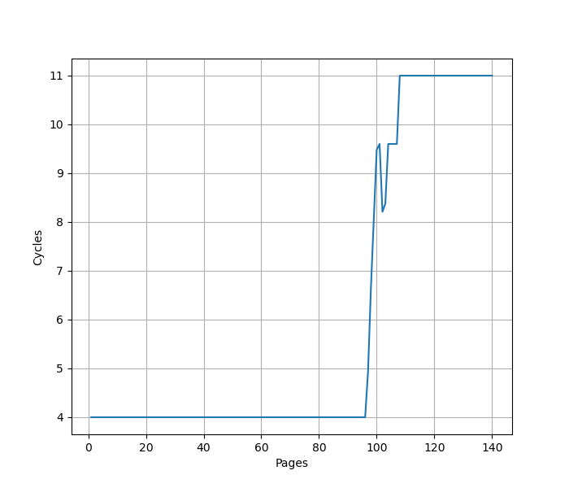

# AMD Zen 5 微架构评测

## 背景

Zen 5 是 AMD 最新的一代微架构，在很多地方和之前不同，因此测试一下这个微架构在各个方面的表现。

<!-- more -->

## 官方信息

AMD 一向公开得比较大方，关于 Zen 5 的信息有：

- [Software Optimization Guide for the AMD Zen5 Microarchitecture](https://www.amd.com/content/dam/amd/en/documents/processor-tech-docs/software-optimization-guides/58455.zip)
- [5TH GEN AMD EPYC™ PROCESSOR ARCHITECTURE](https://www.amd.com/content/dam/amd/en/documents/epyc-business-docs/white-papers/5th-gen-amd-epyc-processor-architecture-white-paper.pdf)

## 现有评测

网上已经有较多针对 Zen 5 微架构的评测和分析，建议阅读：

- [AMD Reveals More Zen 5 CPU Core Details](https://www.phoronix.com/review/amd-zen-5-core)
- [Zen 5’s 2-Ahead Branch Predictor Unit: How a 30 Year Old Idea Allows for New Tricks](https://chipsandcheese.com/2024/07/26/zen-5s-2-ahead-branch-predictor-unit-how-30-year-old-idea-allows-for-new-tricks/)
- [Zen 5’s Leaked Slides](https://chipsandcheese.com/2023/10/08/zen-5s-leaked-slides/)
- [AMD’s Strix Point: Zen 5 Hits Mobile](https://chipsandcheese.com/2024/08/10/amds-strix-point-zen-5-hits-mobile/)
- [AMD’s Ryzen 9950X: Zen 5 on Desktop](https://chipsandcheese.com/2024/08/14/amds-ryzen-9950x-zen-5-on-desktop/)
- [Discussing AMD’s Zen 5 at Hot Chips 2024](https://chipsandcheese.com/2024/09/15/discussing-amds-zen-5-at-hot-chips-2024/)
- [Zen 5 补充测试 (1/2): 更多微架构细节](https://blog.hjc.im/zen-5-more-details-1.html)
- [Zen5's AVX512 Teardown + More...](http://www.numberworld.org/blogs/2024_8_7_zen5_avx512_teardown/)

下面分各个模块分别记录官方提供的信息，以及实测的结果。读者可以对照已有的第三方评测理解。官方信息与实测结果一致的数据会加粗。

## Benchmark

AMD Zen 5 的性能测试结果见 [SPEC](../../../benchmark.md)。

## MOP vs uOP

MOP = Macro operation, uOP = Micro operation

AMD 的文档里是这么说的：

> The processor implements AMD64 instruction set by means of macro-ops (the primary units of
work managed by the processor) and micro-ops (the primitive operations executed in the
processor's execution units).
> Instructions are marked as fast path single (one macro-op), fast path double (two macro-ops), or
microcode (greater than two macro-ops). Macro ops can normally contain up to two micro-ops.

一条指令可以分成若干个 MOP（比如 REP MOVS 会拆成很多个 MOP），一个 MOP 可以继续细分为 uOP（比如 store 拆分成 store data 和 store address；把内存的值加到寄存器上的 add 指令拆分成 load 和 add）。Dispatch 的单位是 MOP，ROB 保存的也是 MOP。与 Zen3/Zen4 不同，Op Cache 保存的不是 MOP，而是 Fused Instructions，这个 Fusion 来自于 Branch Fusion 或 MOV + ALU Fusion。Fusion 相当于把多条指令合成了一个，减少了 MOP 的数量。

MOP 到 uOP 的拆分需要等到 Scheduler 中才进行，Scheduler 输入 MOP，输出 uOP，也就是说最终给到执行单元的是 uOP。

和 ARM 公版核的 MOP/uOP 对比，其实是很类似的：uOP 是执行单元看到的指令粒度，MOP 是维护精确异常的指令粒度。

## 前端

### Op Cache

官方信息：64 set, 16 way, **1024 entry**, **6 (fused) inst/entry**, 供指 **2 entry/cycle**

#### 开启/关闭

AMD 在 UEFI 固件中提供了关闭 Op Cache 的设置，因此我们可以测试在 Op Cache 开启/关闭不同情况下的性能。通过进一步研究，发现固件的 Op Cache 关闭设置，实际上对应了 MSR[0xc0011021] 的 bit 5：初始情况下，MSR[0xc0011021] 的值为 0x20000000000040，如果进入固件关闭 Op Cache，可以观察到 MSR[0xc0011021] 变成了 0x20000000000060。实际上，Op Cache 可以在进入 Linux 后动态开启/关闭（感谢 David Huang 在博客中提供的信息）：

```shell
sudo modprobe msr
# Disable Op Cache for Core 0
sudo wrmsr -p 0 0xc0011021 0x20000000000060
# Enable Op Cache for Core 0
sudo wrmsr -p 0 0xc0011021 0x20000000000040
```

因此开关 Op Cache 不需要重启进固件了。

#### 容量

Zen 5 的 Op Cache 每个 entry 是 6 (fused) inst，为了测出 Op Cache 的容量，以及确认保存的是 fused inst，利用 MOV + ALU Fusion 来构造指令序列：

```asm
# rsi = rdi
mov %rdi, %rsi
# rsi += rdx
add %rdx, %rsi
```

这两条指令满足 Zen 5 的 MOV + ALU Fusion 要求，硬件上融合成一个 `rsi = rdx + rdi` 的操作。做这个融合也是因为 x86 指令集缺少 3 地址指令，当然未来 APX 会补上这个缺失。实测发现，这样的指令序列可以达到 12 的 IPC，正好 Zen 5 的 ALU 有 6 个，也就是每周期执行 6 条融合后的指令，和 12 IPC 是吻合的。12 的 IPC 可以一直维持到 36KB 的 footprint，这里的 mov 和 add 指令都是 3 字节，换算下来 36KB 对应 `36*1024/6=6144` 个 fused instruction，正好 `64*16*6=6144`，对上了。关掉 Op Cache 后，性能下降到 4 IPC，对应了 Decode 宽度，同时也说明 Decode 的 4 Wide 对应的是指令，而不是融合后的指令。

#### 吞吐

接下来要测试 Op Cache 能否单周期给单个线程提供 2 个 entry 的吞吐。由于每个 entry 最多可以有 6 (fused) inst，加起来是 12，而 dispatch 只有 8 MOP/cycle，因此退而求其次，不要求用完 entry 的 6 条指令，而是用 jmp 指令来提前结束 entry：

```asm
# rsi = rdi
mov %rdi, %rsi
jmp 2f
2:
```

重复上述指令，发现在 5KB 之前都可以达到 4 的 IPC，之后则下降到 2 IPC，说明 5KB 时用满了 Op Cache。这里的 mov 指令是 3 字节，jmp 指令是 2 字节，也就是说 5KB 对应上述指令模式重复了 1024 次，此时 Op Cache 用满了容量，正好 Op Cache 也是 `64*16=1024` 个 entry，印证了 Op Cache 的 entry 会被 jmp 提前结束，在上述的指令模式下，entry 不会跨越 jmp 指令记录后面的指令，每个 entry 只有两条指令。那么 4 IPC 证明了 Op Cache 可以每周期提供 2 entry，相比 Decode 只能每周期给单线程提供 4 条指令明显要快。

### 取指

官方信息：每周期共 64B，可以取**两个** 32B 对齐的指令块

为了测试取指，需要关掉 Op Cache，但由于 Decode 瓶颈太明显，不容易测出取指的性能，例如是否一个周期可以给单线程取两个 32B 对齐的指令块。目前通过实测可以知道，在关闭 Op Cache 的情况下，测试循环体跨越 64B 缓存行边界的情况，指令模式见下：

```asm
1:
dec %rdi
# 64B cache line boundary here
jne 1b
```

循环一次需要 1.5 个周期。如果 Fetch 每周期只能取一个 32B/64B 对齐的指令块，那么一次循环需要 2 个周期来取指，但如果 Fetch 每周期可以取两个 32B 对齐的指令块，那么一次循环只需要 1 个周期取指，但实际测出来又是 1.5 个周期，目前还没有找到合理的解释，但大概率 Fetch 还是可以给单线程每周期提供两个 32B 指令块。

### Decode

官方信息：2x **4-wide** decode pipeline, **one pipeline per thread**

AMD Zen 5 的 Decode 虽然有两个 Pipe，但是每个逻辑线程只能用一个，意味着单线程情况下，无法做到 8-wide Decode，而 4-wide Decode 又太窄了点，因此 Op Cache 的命中率就显得很重要。

为了测试 Decode，需要首先按照上面的方法关闭 Op Cache，然后构造不同的指令序列以观察 IPC，得到的结果如下：

- 重复 1-4 字节 nop：4 IPC
- 重复 5 字节 nop：3.2 IPC
- 重复 6 字节 nop：2.67 IPC
- 重复 7 字节 nop：2.3 IPC
- 重复 8 字节 nop：2 IPC
- 重复 9 字节 nop：1.78 IPC
- 重复 10 字节 nop：1.6 IPC
- 重复 11-15 字节 nop：1 IPC

上述 nop 的编码取自 Software Optimization Guide 的 Encodings for NOP Instructions 1 to 15 表格。

首先可以看到 Zen5 4-wide Decode 的限制，其次可以发现重复 5-10 字节的 nop，每周期的 Decode 吞吐都是 16B。11 字节以上则是撞到了 Decode 的限制：`Only the first decode slot (of four) can decode instructions greater than 10 bytes in length`。

比较有意思的是这个 16B 的限制，考虑移动窗口的译码设计，每周期可以对两个连续 16B 的窗口译码（`IBQ entries hold 16 byte-aligned fetch windows of the instruction byte stream. The decode pipes each scan two IBQ entries.`），在 5 字节的 nop 模式下，每个周期的 Decode 应该是：

- Cycle 0: Window 0-31, Decode 0, 5, 10, 15
- Cycle 1: Window 16-47, Decode 20, 25, 30, 35
- Cycle 2: Window 32-63, Decode 40, 45, 50, 55
- Cycle 3: Window 48-79, Decode 60, 65, 70, 75
- Cycle 4: Window 80-111, Decode 80, 85, 90, 95

按这个理想的方法来看，应该可以做到 4 的 IPC，但实际上没有。一个猜测是，滑动窗口每次只能移动 1 个 16B，而不能从 48 跳到 80，那么从 Cycle 4 开始会出现性能损失：

- Cycle 4: Window 64-95, Decode 80, 85, 90
- Cycle 5: Window 80-111, Decode 95, 100, 105
- Cycle 6: Window 96-127, Decode 110, 115, 120
- Cycle 7: Window 112-143, Decode 125, 130, 135
- Cycle 8: Window 128-159, Decode 140, 145, 150, 155

这个规律延续下去，平均下来就是 3.2 IPC。

根据这个猜想，Decode 从两个连续的 IBQ entry 译码最多四条指令，是没有 16B 的限制的，但 IBQ 每周期只能弹出一个 entry，而不允许每周期弹出两个，这才导致了 16B 的吞吐。总之，4-wide 以及 16B 的限制，应该说是很小的。

### L1 ICache

官方信息：**32KB**, 8-way set associative

为了测试 L1 ICache 的容量，需要关闭 Op Cache，但由于 Decode 的限制，即使 footprint 大于 L1 ICache 容量，IPC 依然没有变化，针对这个现象，猜测 L1 ICache 的预取在起作用，并且 L2 Cache 到 L1 ICache 的 Refill 带宽不小于 Decode 带宽，导致瓶颈在 Decode。

因此，为了测试 L1 ICache 的容量，构造一个 jmp 序列，以 4B 位间距排布，观察到在关闭 Op Cache 的情况下，在 8192 条 jmp 指令之前可以做到 1 CPI，之后逐渐提升到 1.5 CPI，正好 8192 对应了 `8192*4=32768` 也就是 32KB L1 ICache 的容量限制。

### L1 ITLB

官方信息：**64-entry**, fully associative

为了测试 L1 ITLB 的容量，构造 jmp 序列，每个 jmp 在一个单独的页中，在关闭 Op Cache 的情况下观察 jmp 的性能：



可以看到明显的 64 pages 的拐点，对应了 64 entry 的 L1 ITLB。

### L2 ITLB

官方信息：**2048-entry**, 8-way set associative L2 ITLB

继续沿用测试 L1 ITLB 的方式，把页的数量提高到 2000+，在关闭 Op Cache 的情况下得到以下测试结果：



可以看到明显的 2048 pages 的拐点，对应了 2048 entry 的 L2 ITLB。

### BTB

官方信息：16K-entry L1 BTB, 8K-entry L2 BTB

因为 L1 ICache 只有 32KB，而 L1 BTB 有 16K entry，每个 entry 最多能保存两条分支指令，因此多数情况下，首先遇到的是 L1 ICache 的瓶颈，而不是 L1 BTB 的瓶颈。

### Return Address Stack

官方信息：**52-entry** per thread

构造不同深度的调用链，测试每次调用花费的时间，在关闭 Op Cache 的情况下得到如下测试结果：



可以看到 52 的拐点，对应的就是 Return Address Stack 的大小。

### Indirect Target Predictor

官方信息：3072-entry Indirect Target Array

### Move Elimination (Zero Cycle Move) and Zeroing/Ones Idiom

官方信息：支持 xor/sub/cmp/sbb/vxorp/vandnp/vpcmpgt/vpandn/vpxor/vpsub 的 Zeroing Idiom，支持 pcmpeq/vpcmpeq 的 Ones Idiom，支持 mov/movsxd/xchg/(v)vmovap/(v)movdp/(v)movup 的 Zero Cycle Move。

实测下来，以下指令序列的 IPC 为：

- 有依赖链的 mov r, r：7 IPC
- 没有依赖的 mov r, r：7 IPC
- xor r, r, r：7 IPC
- sub r, r, r：7 IPC
- 有依赖链的 mov vr, vr：6 IPC
- 没有依赖的 mov vr, vr：6 IPC
- xor vr, vr, vr：6 IPC
- mov r, imm：6 IPC

其中 r 表示整数寄存器，vr 表示浮点/向量寄存器。总体来说还是做的比较完善的。

### Dispatch

官方信息：8 MOP/cycle, up to 2 taken branches/cycle

## 后端

### ROB

官方信息：**224-entry per thread**, 1-2 MOP per entry

把两个独立的 long latency pointer chasing load 放在循环的头和尾，中间用 NOP 填充，当 NOP 填满了 ROB，第二个 pointer chasing load 无法提前执行，导致性能下降。测试结果如下：



当 NOP 指令达到 446 条时出现性能突变，此时应该是触发了 Zen 5 的每个 entry 保存两个 MOP 的条件，因此 446 条 NOP 指令对应 223 个 entry，加上循环开头的 load 指令，正好把循环尾部的 load 拦在了 ROB 外面，导致性能下降。

说明单线程可以访问到的 ROB 容量是 224 entry。

### Register File

官方信息：240-entry(40 per thread for architectural) integer physical register file, 192-entry flag physical register file, 384-entry 512b vector register file

为了测试物理寄存器堆大小，构造一个循环，循环开头和结尾各是一个长延迟的操作，由于 Zen 5 没有实现 temporal prefetcher，使用的是 pointer chasing load。然后在两个长延迟的操作中间穿插不同的指令类型，从而测出对应的物理寄存器堆可供预测执行的寄存器数量：



整数方面使用 lea 指令来消耗整数物理寄存器而不消耗 flags 寄存器，此时无论是 32 位还是 64 位寄存器，供预测执行的寄存器数都有 200 个，和官方的信息吻合：`200+40=240`，说明超线程在没有负载的时候，不会占用整数物理寄存器堆，这在 AMD 的文档中叫做 Watermarked：`Resource entries are assigned on demand`。356 个 flags 寄存器超过了官方宣传的 192 的大小，猜测做了一些优化，测到的并非 flags 寄存器堆大小。

浮点方面，测得 430 个供预测执行的浮点寄存器，超过了官方宣传的 384 个 512 位浮点寄存器。考虑到 Zen5 引入了在 Rename 之前的 96-entry Non-Scheduling Queue(NSQ)，在 NSQ 中的指令还没有经过重命名，因此不消耗物理寄存器：`384+96=480`，再去掉至少 32 个架构寄存器 zmm0-zmm31，和观察到的 430 是比较接近的。

针对浮点寄存器，Zen5 的不同平台的设计不完全一样，上面的测试是在 9950X 上进行的，其他平台的测试以及分析见 [Zen5's AVX512 Teardown + More...](http://www.numberworld.org/blogs/2024_8_7_zen5_avx512_teardown/#vector_register_file)。

### L1 DCache

官方信息：**48KB**, 12-way set associative, index 是 VA[11:6]

使用不同 footprint 的随机的 pointer chasing load，测试性能，得到如下结果：



可以观察到明显的 48KB 的拐点，命中 L1 DCache 时 load to use latency 是 4 cycle，命中 L2 时增大到了 14 cycle。

### Load Store Unit

官方信息：每周期最多四个内存操作。每周期最多四个读，其中最多两个 128b/256b/512b 读；每周期最多两个写，其中最多一个 512b 写。load to use latency，整数是 4-5 个周期，浮点是 7-8 个周期。跨越 64B 边界的读会有额外的一个周期的延迟。支持 Store to load forwarding，要求先前的 store 包括了 load 的所有字节，不要求对齐。

#### 吞吐

实测 Zen 5 每个周期可以完成如下的访存操作：

- 4x 32b Load: 1 cycle
- 4x 64b Load: 1 cycle
- 2x 128b Load: 1 cycle
- 2x 256b Load: 1 cycle
- 2x 32b Store: 1 cycle
- 2x 64b Store: 1 cycle
- 2x 128b Store: 1 cycle
- 2x 256b Store: 1 cycle
- 1x 64b Load + 2x 64b Store: 1 cycle
- 2x 64b Load + 2x 64b Store: 1 cycle
- 3x 64b Load + 1x 64b Store: 1 cycle
- 1x 128b Load + 2x 128b Store: 1 cycle
- 2x 128b Load + 1x 128b Store: 1 cycle

简单来说，每周期支持 4 个 64b 的 Load/Store，其中 Store 最多两条。一个 128b 的 Load 相当于两个 64b，对应 IPC 减半。

#### 延迟

构造串行的 load 链，观察到多数情况下 load to use latency 是 4 个周期，在跨越 64B 边界时，会增加一个周期变成 5 个周期。此外，如果涉及到 index 计算（即 `offset(base, index, shift)`），也会增加一个周期。

#### Store to Load Forwarding

经过实际测试，如下的情况可以成功转发：

对地址 x 的 Store 转发到对地址 y 的 Load 成功时 y-x 的取值范围：

| Store\Load | 8b Load | 16b Load | 32b Load | 64b Load |
|------------|---------|----------|----------|----------|
| 8b Store   | {0}     | {}       | {}       | {}       |
| 16b Store  | [0,1]   | {0}      | {}       | {}       |
| 32b Store  | [0,3]   | [0,2]    | {0}      | {}       |
| 64b Store  | [0,7]   | [0,6]    | [0,4]    | {0}      |

可以看到，Zen 5 在 Store 完全包含 Load 的情况下都可以转发，没有额外的对齐要求。但当 Load 和 Store 只有部分重合时，就无法转发。两个连续的 32 位的 Store 和一个 64 位的 Load 重合也不能转发。

可见 Zen 5 的 Store to Load Forwarding 实现比较粗暴，只允许 Load 从单个完全包含 Load 的 Store 中转发数据。和 [Neoverse V2](./arm_neoverse_v2.md) 相比，Zen 5 对 Load 在 Store 内的偏移没有要求，但也不允许 Load 和 Store 只有一部分覆盖，也不支持一个 Load 从两个或更多的 Store 中获取数据。

成功转发时 8 cycle，有 Overlap 但转发失败时 14-15 cycle。

小结：Zen 5 的 Store to Load Forwarding：

- 1 ld + 1 st: 要求 st 包含 ld
- 1 ld + 2+ st: 不支持

### L1 DTLB

官方信息：96-entry, fully associative

使用不同 footprint 的随机的 pointer chasing load 且每次 load 都在单独的页内，测试性能，得到如下结果：



可以观察到明显的 96 page 的拐点，命中 L1 DTLB 时 load to use latency 是 4 cycle，命中 L2 DTLB 时增大到了 11 cycle。

### L2 DTLB

官方信息：4096-entry, 16-way set associative

### L2 Cache

官方信息：16-way set associative, inclusive, 1MB, **>= 14 cycle load to use latency**

### L3 Cache

官方信息：16-way set associative, exclusive

### 执行单元

官方信息：Zen 5 的后端有 6 条 ALU 流水线，4 条访存流水线，4 条 512 位宽向量流水线（其中 2 条支持 FMA），2 条向量访存流水线

实测发现 Zen 5 每周期最多可以执行 2 条 AVX512 的浮点 FMA 指令，也就是说，每周期浮点峰值性能：

- 单精度：`512/32*2*2=64` FLOP per cycle
- 双精度：`512/64*2*2=32` FLOP per cycle

通过 512 位的浮点 datapath，终于达到了第一梯队的浮点峰值性能。
