# Ampere Skylark 微架构评测

## 背景

Ampere eMAG 采用的是 Ampere Skylark 微架构，虽然是 2018 年的处理器了，但也顺带评测一下。其前身是 AppliedMicro 的 X-Gene 3 微架构，用在 Ampere eMAG 芯片上，用的是 TSMC 16nm FinFET+ 工艺。

<!-- more -->

## 官方信息

只找到了 X-Gene 2，即 Skylark 更早一代的信息：[AppliedMicro X-Gene2](https://old.hotchips.org/wp-content/uploads/hc_archives/hc26/HC26-11-day1-epub/HC26.11-4-ARM-Servers-epub/HC26.11.430-X-Gene-Singh-AppMicro-HotChips-2014-v5.pdf)

## 前端

### 取指带宽

为了测试实际的 Fetch 宽度，参考 [如何测量真正的取指带宽（I-fetch width） - JamesAslan](https://zhuanlan.zhihu.com/p/720136752) 构造了测试，实验结果如下：

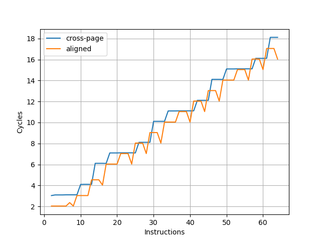

可见取指带宽是每周期四条指令，并且很多时候并不能打满。

[测试过程详见测试代码](https://github.com/jiegec/cpu-micro-benchmarks/blob/master/src/if_width_gen.cpp)。

### L1 ICache

为了测试 L1 ICache 容量，构造一个具有巨大指令 footprint 的循环，由大量的 nop 和最后的分支指令组成。观察在不同 footprint 大小下的 IPC：

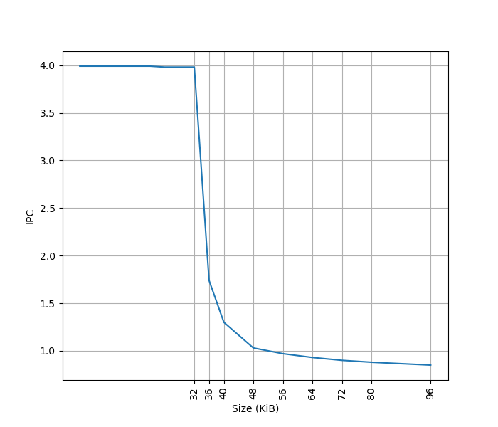

可以看到 footprint 在 32 KB 之前时可以达到 4 IPC，这对应了 32KB 的 L1 ICache。

[测试过程详见测试代码](https://github.com/jiegec/cpu-micro-benchmarks/blob/master/src/fetch_bandwidth_gen.cpp)。

### BTB

构造大量的无条件分支指令（B 指令），BTB 需要记录这些指令的目的地址，那么如果分支数量超过了 BTB 的容量，性能会出现明显下降。当把大量 B 指令紧密放置，也就是每 4 字节一条 B 指令时：

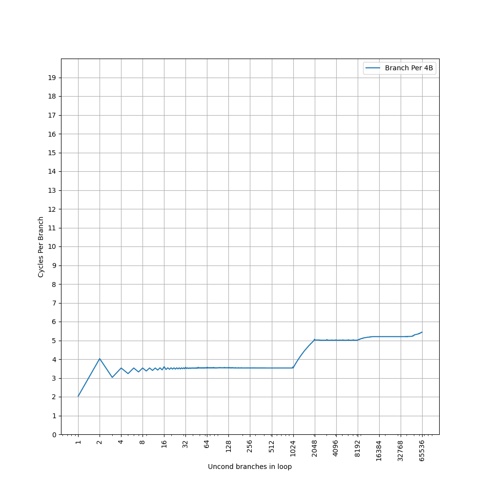

可见 Skylark 的 BTB 对分支紧密放置的情况支持不是很好，在 1024 个分支之内的 CPI 达到了 3.5，这一点在较早的处理器上比较常见，比如 [Neoverse N1 的 BTB](./arm-neoverse-n1-btb.md)，不过稍微新一些的处理器，随着设计的改进，类似的情况比较少见了。之后到 8192 个分支，CPI 达到了 5。接着降低分支指令的密度，在 B 指令之间插入 NOP 指令，使得每 8 个字节有一条 B 指令，得到如下结果：

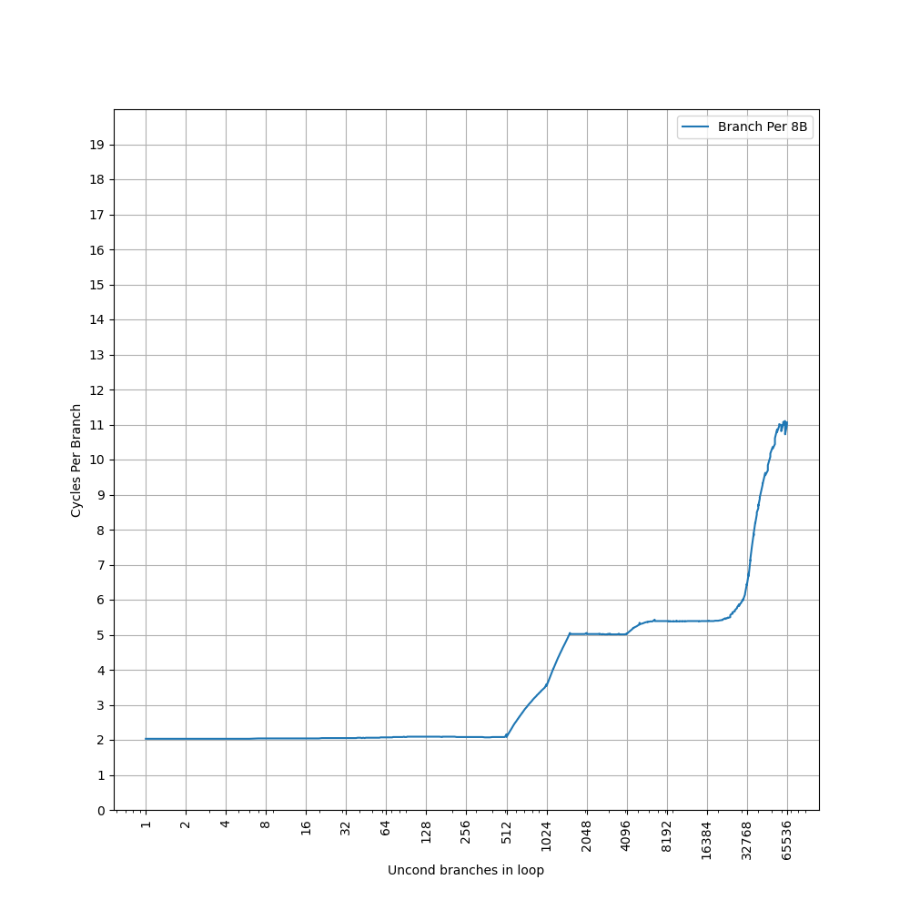

这个图像就比较正常了，CPI=2 持续到了 512 个分支，对应上面 1024 个分支的拐点前移，之后 CPI=5 的拐点在 4096，对应了上面 8192 的拐点。考虑到它的 L1 ICache 是 32 KB，正好对应 8192 的拐点，可以认为 Skylark 的 BTB 是：

- 1024-entry, 2 cycle latency 的 L1 BTB
- 32 KB 的 L1 ICache 作为 L2 BTB

[测试过程详见测试代码](https://github.com/jiegec/cpu-micro-benchmarks/blob/master/src/btb_size_basic_gen.cpp)。

### L1 ITLB

构造一系列的 B 指令，使得 B 指令分布在不同的 page 上，使得 ITLB 成为瓶颈：

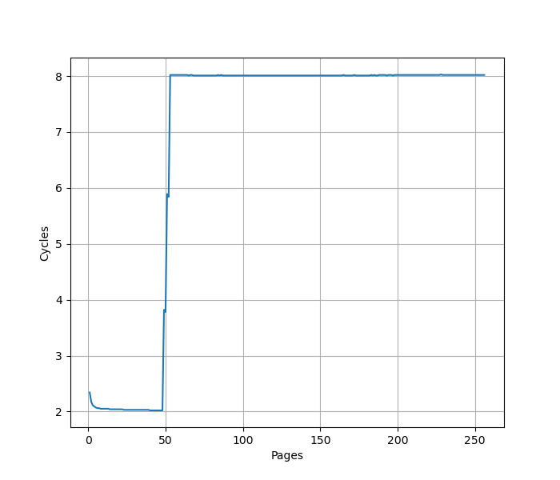

在 48 个页时，CPI 从 2 提升到了 8，意味着 L1 ITLB 容量是 48。

[测试过程详见测试代码](https://github.com/jiegec/cpu-micro-benchmarks/blob/master/src/itlb_size_lib.cpp)。

### Return Stack

构造不同深度的调用链，测试每次调用花费的平均时间，得到下面的图：

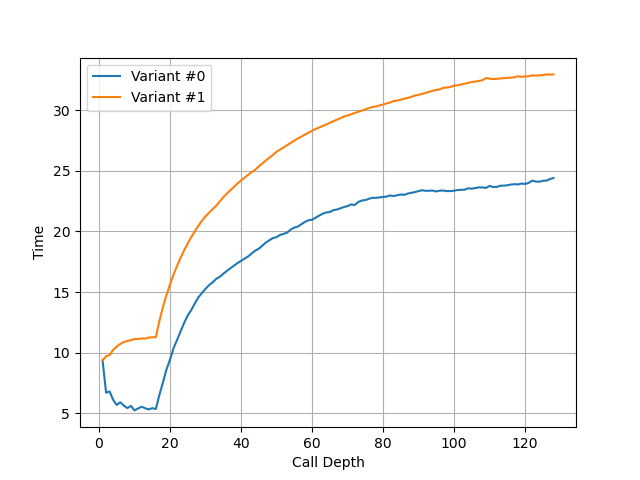

可以看到调用链深度超过 16 时性能突然变差，因此 Skylark 的 Return Stack 深度为 16。

[测试过程详见测试代码](https://github.com/jiegec/cpu-micro-benchmarks/blob/master/src/ras_size_gen.cpp)。

## 后端

### Load Store Unit + L1 DCache

#### L1 DCache 容量

构造不同大小 footprint 的 pointer chasing 链，测试不同 footprint 下每条 load 指令耗费的时间：

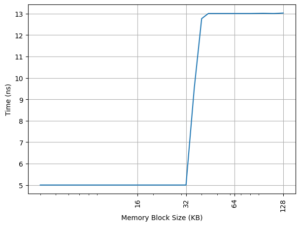

可以看到 32KB 出现了拐点，对应的就是 32KB 的 L1 DCache 容量，和官方信息一致，访存延迟从 5 cycle 增加到 13 cycle。

[测试过程详见测试代码](https://github.com/jiegec/cpu-micro-benchmarks/blob/master/src/memory_latency.cpp)。

#### L1 DTLB 容量

用类似的方法测试 L1 DTLB 容量，只不过这次 pointer chasing 链的指针分布在不同的 page 上，使得 DTLB 成为瓶颈：

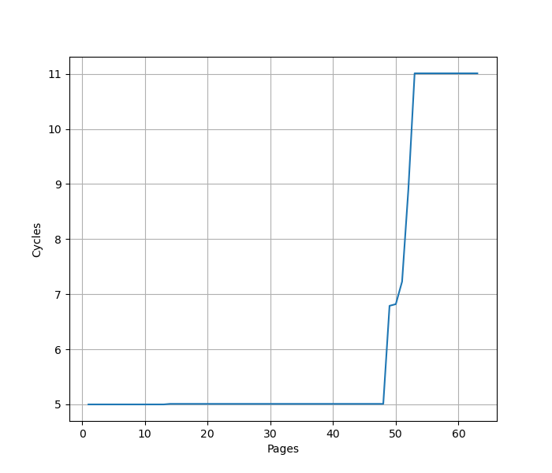

从 48 个页开始性能下降，认为 Skylark 的 L1 DTLB 有 48 项，访存延迟从 5 cycle 增加到 11 cycle。

[测试过程详见测试代码](https://github.com/jiegec/cpu-micro-benchmarks/blob/master/src/dtlb_size.cpp)。

#### Load/Store 带宽

针对 Load Store 带宽，实测 Skylark 每个周期可以完成：

- 1x 64b Load
- 1x 64b Load + 1x 64b Store
- 1x 64b Store

如果把每条指令的访存位宽从 64b 改成 128b，读写带宽不变，指令吞吐减半。也就是说最大的读带宽是 8B/cyc，最大的写带宽是 8B/cyc，可以同时达到。

#### Store to Load Forwarding

经过实际测试，Skylark 上如下的情况可以成功转发，对地址 x 的 Store 转发到对地址 y 的 Load 成功时 y-x 的取值范围：

| Store\Load | 8b Load | 16b Load | 32b Load | 64b Load |
|------------|---------|----------|----------|----------|
| 8b Store   | {0}     | {}       | {}       | {}       |
| 16b Store  | [0,1]   | {0}      | {}       | {}       |
| 32b Store  | [0,3]   | [0,2]    | {0}      | {}       |
| 64b Store  | [0,7]   | [0,6]    | [0,4]    | {0}      |

转发的性能分以下几种情况：

1. 满足上表中情况，即 Store 完全包括了 Load，则可以成功转发，4.5 Cycle，支持跨 64B 缓存行边界
2. 特别地，如果 Load 跨越了对齐的 8B 边界，则延迟提高到 12 Cycle
3. 特别地，如果 Store 没有完全包含 Load，但在某个对齐的 8B 块内，Store 完全包含了 Load，则延迟提高到 9 Cycle
4. 否则，转发失败，27 Cycle

从这个现象，大概可以猜到，Skylark 是以 4B 为粒度，检查 Store 和 Load 的覆盖情况，如果 Store 可以完全覆盖 Load，就进行转发。

特别地，即使访问的范围没有重合，也就是不需要 Forwarding 的情况，如果 Load 和 Store 在同一个对齐的 4B 块内，或者 Store 跨越了对齐的 8B 边界，也会多一个周期。

一个 Load 需要转发两个、四个甚至八个 Store 的数据时，不能转发。

小结：Skylark 的 Store to Load Forwarding：

- 1 ld + 1 st: 要求 Store 覆盖 Load
- 1 ld + 2/4/8 st: 不支持

Forwarding 能力和 AMD Zen 5 比较类似。

#### Load to use latency

实测 Skylark 在下列的场景下可以达到 5 cycle:

- `ldr x0, [x0]`: load 结果转发到基地址，无偏移
- `ldr x0, [x0, 8]`：load 结果转发到基地址，有立即数偏移
- `ldr x0, [x0, x1]`：load 结果转发到基地址，有寄存器偏移
- `ldr x0, [sp, x0, lsl #3]`：load 结果转发到 index
- `ldp x0, x1, [x0]`：load pair 的第一个目的寄存器转发到基地址，无偏移
- load 的目的寄存器作为 alu 的源寄存器（下称 load to alu latency）

下列情况需要 6 cycle：

- `ldp x1, x0, [x0]`：load pair 的第二个目的寄存器转发到基地址，无偏移
- 访存跨越 64B 边界

#### Virtual Address UTag/Way-Predictor

Linear Address UTag/Way-Predictor 是 AMD 的叫法，但使用相同的测试方法，也可以在 Ampere Skylark 上观察到类似的现象，猜想它也用了类似的基于虚拟地址的 UTag/Way Predictor 方案，并测出来它的 UTag 也有 12 bit：

- VA[12] xor VA[24] xor VA[36]
- VA[13] xor VA[25] xor VA[37]
- VA[14] xor VA[26] xor VA[38]
- VA[15] xor VA[27] xor VA[39]
- VA[16] xor VA[28] xor VA[40]
- VA[17] xor VA[29] xor VA[41]
- VA[18] xor VA[30] xor VA[43]
- VA[19] xor VA[31] xor VA[44]
- VA[20] xor VA[32]
- VA[21] xor VA[33] xor VA[46]
- VA[22] xor VA[34]
- VA[23] xor VA[35]

### 执行单元

想要测试有多少个执行单元，每个执行单元可以运行哪些指令，首先要测试各类指令在无依赖情况下的 IPC，通过 IPC 来推断有多少个能够执行这类指令的执行单元；但由于一个执行单元可能可以执行多类指令，于是进一步需要观察在混合不同类的指令时的 IPC，从而推断出完整的结果。测试如下各类指令的延迟和每周期吞吐：

| 指令               | 延迟 | 吞吐  |
|--------------------|------|-------|
| asimd int add      | 3    | 0.5   |
| asimd aesd/aese    | 5    | 0.25  |
| asimd aesimc/aesmc | 2    | 0.5   |
| asimd fabs         | 2    | 0.5   |
| asimd fadd         | 5/6  | 0.5   |
| asimd fdiv 64b     | 22   | 1/lat |
| asimd fdiv 32b     | 22   | 1/lat |
| asimd fmax         | 3    | 0.5   |
| asimd fmin         | 3    | 0.5   |
| asimd fmla         | 6    | 0.5   |
| asimd fmul         | 6    | 0.5   |
| asimd fneg         | 2    | 0.5   |
| asimd frecpe       | 3    | 0.5   |
| asimd frsqrte      | 5    | 0.5   |
| asimd fsqrt 64b    | 76   | 1/lat |
| asimd fsqrt 32b    | 48   | 1/lat |
| fp fabs            | 2    | 1     |
| fp fadd            | 5/6  | 1     |
| fp fdiv 64b        | 17   | 1/11  |
| fp fdiv 32b        | 17   | 1/11  |
| fp fmax            | 3    | 1     |
| fp fmin            | 3    | 1     |
| fp fmul            | 6    | 1     |
| fp fneg            | 2    | 1     |
| fp frecpe          | 3    | 1     |
| fp frecpx          | 3    | 1     |
| fp frsqrte         | 5    | 1     |
| fp fsqrt 64b       | 44   | 1/38  |
| fp fsqrt 32b       | 28   | 1/22  |
| int add            | 1    | 2     |
| int addi           | 1    | 2     |
| int bfm            | 2    | 1     |
| int crc            | 2    | 1     |
| int csel           | 1    | 2     |
| int madd (addend)  | 2    | 0.5   |
| int madd (others)  | 6    | 0.5   |
| int mrs nzcv       | -    | 1     |
| int mul            | 5    | 0.5   |
| int nop            | -    | 4     |
| int sbfm           | 2    | 1     |
| int sdiv           | 7    | 1/lat |
| int smull          | 4    | 1     |
| int ubfm           | 2    | 1     |
| int udiv           | 7    | 1/lat |
| not taken branch   | -    | 1     |
| taken branch       | -    | 0.3   |

可见它的执行单元不多，只有 2x ALU，1x Branch，1x Load，1x Store，1x FP，其中 ASIMD 拆成两个 64b 的部分分别计算，即 FP 的 datapath 只有 64b 宽。

### Reorder Buffer

用 NOP 指令测试 Skylark 的 ROB 大小：

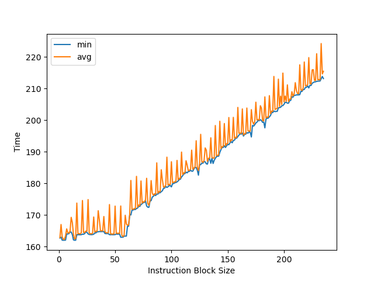

可以看到拐点是 60 条指令。

### L2 Cache

构造不同大小 footprint 的 pointer chasing 链，测试不同 footprint 下每条 load 指令耗费的时间，这次把容量扩充到 L2 Cache 的范围：

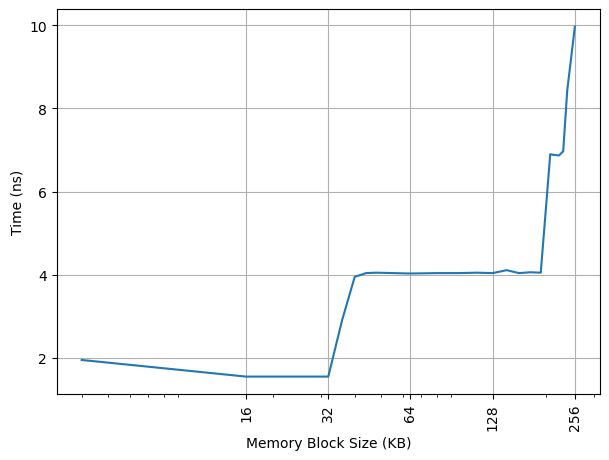

可以看到 192KB 出现了拐点，对应 13 Cycle。`lscpu -C` 报告的实际容量为 256KB，意味着对单个核心的数据占用的 L2 Cache 容量有限制。

[测试过程详见测试代码](https://github.com/jiegec/cpu-micro-benchmarks/blob/master/src/memory_latency.cpp)。

### L2 TLB

沿用 L1 DTLB 的测试，继续扩大测试的范围，找到新的拐点：

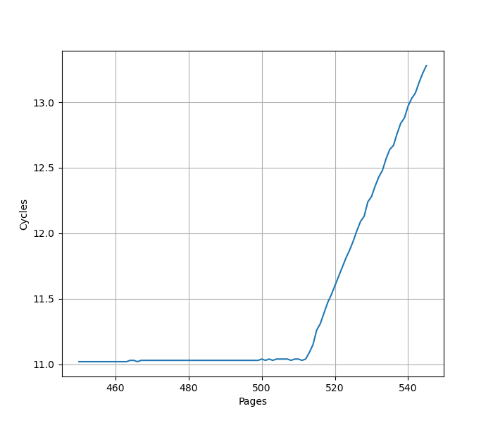

意味着 L2 TLB 容量是 512。

## 总结

Skylark 是比较早期的 ARM server core，配置如下：

- 4-wide
- 32 KB L1 ICache/DCache
- 1024-entry BTB
- 48-entry L1 ITLB/DTLB
- 16-entry RAS
- 60-entry ROB
- 执行单元只有 2 ALU + 1 Branch + 1 Load + 1 Store + 1 FP
