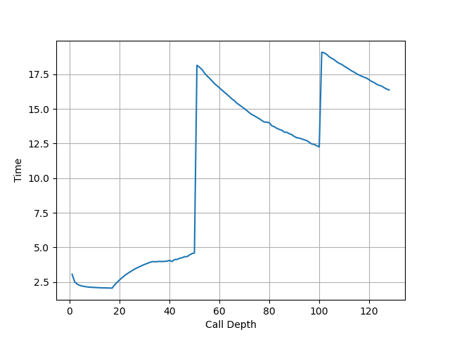
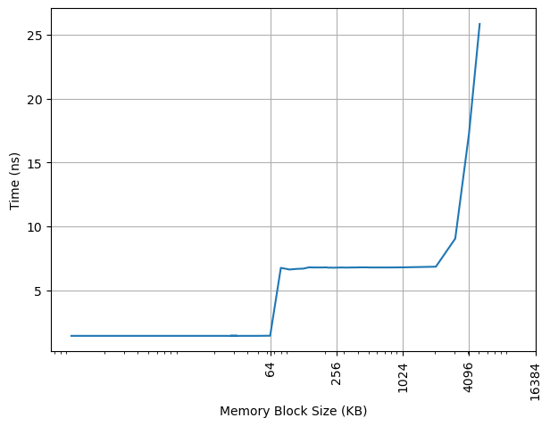
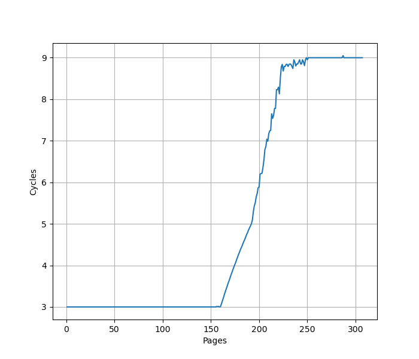

# Apple M1 (Firestorm & Icestorm) 微架构评测

## 背景

虽然 Apple M1 已经是 2020 年的处理器，但它对苹果自研芯片来说是一个里程碑，考虑到 X Elite 处理器的 Oryon 微架构和 Apple M1 性能核 Firestorm 微架构的相似性，还是测试一下这个 Firestorm + Icestorm 微架构在各个方面的表现。Apple A14 采用了和 Apple M1 一样的微架构。

<!-- more -->

## 官方信息

Apple M1 的官方信息乏善可陈，关于微架构的信息几乎为零，但能从操作系统汇报的硬件信息中找到一些内容。

## 现有评测

网上已经有较多针对 Apple M1 微架构的评测和分析，建议阅读：

- [Apple Microarchitecture Research by Dougall Johnson](https://dougallj.github.io/applecpu/firestorm.html)
- [Apple Announces The Apple Silicon M1: Ditching x86 - What to Expect, Based on A14 - Anandtech](https://www.anandtech.com/show/16226/apple-silicon-m1-a14-deep-dive)
- [Exploration of Apple CPUs](https://github.com/name99-org/AArch64-Explore)
- [Apple M1 Icestorm 微架构评测（上）:重铸小核荣光](https://zhuanlan.zhihu.com/p/611213899)
- [Apple M1 Icestorm 微架构（下）:重铸小核荣光](https://zhuanlan.zhihu.com/p/613097964)
- [苹果的黑魔法？Apple M1 的栈操作消除（上）](https://zhuanlan.zhihu.com/p/595582920)
- [苹果的黑魔法？（下）Apple M1 的栈操作消除](https://zhuanlan.zhihu.com/p/600349467)
- [Apple Firestorm/Icestorm CPU microarchitecture docs](https://github.com/dougallj/applecpu)
- [The 2020 Mac Mini Unleashed: Putting Apple Silicon M1 To The Test](https://www.anandtech.com/show/16252/mac-mini-apple-m1-tested)
- [Exploration of Apple CPUs](https://github.com/name99-org/AArch64-Explore)

下面分各个模块分别记录官方提供的信息，以及实测的结果。读者可以对照已有的第三方评测理解。官方信息与实测结果一致的数据会加粗。

## Benchmark

Apple Firestorm/Icestorm 的性能测试结果见 [SPEC](../../../benchmark.md)。

## 环境准备

Apple M1 预装的是 macOS，macOS 的绑核只能绑到 P 或者 E，不能具体到某一个核上；在 macOS 上可以读取 PMU，需要使用 kpep 的私有框架，代码可以在[这里](https://github.com/jiegec/cpu-micro-benchmarks)找到。

如果想更方便地进行测试，建议安装 Asahi Linux 的各种发行版，此时可以在 Linux 下自由地绑核，也可以用标准的方式使用 PMU。

## 前端

### 取指带宽

#### Firestorm

为了测试实际的 Fetch 宽度，参考 [如何测量真正的取指带宽（I-fetch width） - JamesAslan](https://zhuanlan.zhihu.com/p/720136752) 构造了测试。

其原理是当 Fetch 要跨页的时候，由于两个相邻页可能映射到不同的物理地址，如果要支持单周期跨页取指，需要查询两次 ITLB，或者 ITLB 需要把相邻两个页的映射存在一起。这个场景一般比较少，处理器很少会针对这种特殊情况做优化，但也不是没有。经过测试，把循环放在两个页的边界上，发现 Firestorm 微架构遇到跨页的取指时确实会拆成两个周期来进行。

在此基础上，构造一个循环，循环的第一条指令放在第一个页的最后四个字节，其余指令放第二个页上，那么每次循环的取指时间，就是一个周期（读取第一个页内的指令）加上第二个页内指令需要 Fetch 的周期数，多的这一个周期就足以把 Fetch 宽度从后端限制中区分开，实验结果如下：


图中蓝线（cross-page）表示的就是上面所述的第一条指令放一个页，其余指令放第二个页的情况，横坐标是第二个页内的指令数，那么一次循环的指令数等于横坐标 +1。纵坐标是运行很多次循环的总 cycle 数除以循环次数，也就是平均每次循环耗费的周期数。可以看到每 16 条指令会多一个周期，因此 Firestorm 的前端取指宽度确实是 16 条指令。

为了确认这个瓶颈是由取指造成的，又构造了一组实验，把循环的所有指令都放到一个页中，这个时候 Fetch 不再成为瓶颈（图中 aligned），两个曲线的对比可以明确地得出上述结论。

随着指令数进一步增加，最终瓶颈在每周期执行的 NOP 指令数，因此两条线重合。

#### Icestorm

用相同的方式测试 Icestorm，结果如下：


可以看到每 8 条指令会多一个周期，意味着 Icestorm 的前端取指宽度为 8 条指令。

### L1 ICache

官方信息：通过 sysctl 可以看到，Firestorm 具有 192KB L1 ICache，Icestorm 具有 128KB L1 ICache：

```
hw.perflevel0.l1icachesize: 196608
hw.perflevel1.l1icachesize: 131072
```

#### Firestorm

为了测试 L1 ICache 容量，构造一个具有巨大指令 footprint 的循环，由大量的 nop 和最后的分支指令组成。观察在不同 footprint 大小下 Firestorm 的 IPC：


可以看到 footprint 在 192 KB 之前时可以达到 8 IPC，之后则快速降到 2.22 IPC，这里的 192 KB 就对应了 Firestorm 的 L1 ICache 的容量。虽然 Fetch 可以每周期 16 条指令，也就是一条 64B 的缓存行，由于后端的限制，只能观察到 8 的 IPC。

#### Icestorm

用相同的方式测试 Icestorm，结果如下：


可以看到 footprint 在 128 KB 之前时可以达到 4 IPC，之后则快速降到 2.10 IPC，这里的 128 KB 就对应了 Icestorm 的 L1 ICache 的容量。虽然 Fetch 可以每周期 8 条指令，由于后端的限制，只能观察到 4 的 IPC。

### BTB

#### Firestorm

构造大量的无条件分支指令（B 指令），BTB 需要记录这些指令的目的地址，那么如果分支数量超过了 BTB 的容量，性能会出现明显下降。当把大量 B 指令紧密放置，也就是每 4 字节一条 B 指令时：


可见在 1024 个分支之内可以达到 1 的 CPI，超过 1024 个分支，出现了 3 CPI 的平台，一直延续到 49152 个分支。超出 BTB 容量以后，分支预测时，无法从 BTB 中得到哪些指令是分支指令的信息，只能等到取指甚至译码后才能后知后觉地发现这是一条分支指令，这样就出现了性能损失，出现了 3 CPI 的情况。第二个拐点 49152，对应的是指令 footprint 超出 L1 ICache 的情况：L1 ICache 是 192KB，按照每 4 字节一个 B 指令计算，最多可以存放 49152 条 B 指令。

降低分支指令的密度，在 B 指令之间插入 NOP 指令，使得每 8 个字节有一条 B 指令，得到如下结果：


可以看到 CPI=1 的拐点前移到 1024 个分支，同时 CPI=3 的平台的拐点也前移到了 24576。拐点的前移，意味着 BTB 采用了组相连的结构，当 B 指令的 PC 的部分低位总是为 0 时，组相连的 Index 可能无法取到所有的 Set，导致表现出来的 BTB 容量只有部分 Set，例如此处容量减半，说明只有一半的 Set 被用到了。

如果进一步降低 B 指令的密度，使得它的低若干位都等于 0，最终 CPI=1 的拐点定格在 2 条分支，此时分支的间距大于或等于 2048B；CPI=3 的拐点定格在 6 条分支，此时分支的间距大于或等于 32KB。根据这个信息，可以认为 Firestorm 的 BTB 是 512 Set 2 Way 的结构，Index 是 PC[10:2]；同时也侧面佐证了 192KB L1 ICache 是 512 Set 6 Way，Index 是 PC[14:6]。

#### Icestorm

用相同的方式测试 Icestorm，首先用 4B 的间距：


可以看到 1024 的拐点，1024 之前是 1 IPC，之后增加到 3 IPC。比较奇怪的是，没有看到第二个拐点，第二个拐点在 8B 的间距下显现：


第一个拐点前移到 512，第二个拐点出现在 16384，而 Icestorm 的 L1 ICache 容量是 128KB，8B 间距下正好可以保存 16384 个分支。

用 16B 间距测试：


第一个拐点前移到 256，然后出现了一个 2 CPI 的新平台，2 CPI 的平台的拐点出现在 2048，第三个拐点出现在 8192，对应 L1 ICache 容量。

用 32B 间距测试：


第一个拐点在 1024，第二个拐点出现在 4096，对应 L1 ICache 容量，没有观察到 2 CPI。

用 64B 间距测试：


第一个拐点在 512，第二个拐点出现在 2048，对应 L1 ICache 容量。

Icestorm 的 BTB 测试结果并不像 Firestorm 那样有规律，根据这个现象，给出一些猜测：

1. 可能只有一级 BTB，但它的 Index 函数进行了一些 Hash 而非直接取 PC 某几位，使得随着分支的间距增大，CPI=1 的拐点并非单调递减；但这无法解释为何 16B 间距时会出现 2 CPI 的平台
2. 可能有两级 BTB，它们并非简单地级联，而是通过不同的组织方式，在不同的区间内发挥作用

针对 4B 间距没有出现 CPI>3 的情况，给出一些猜测：

1. 测试规模不够大，把分支数量继续增大，才能出现 CPI>3 的情况
2. 指令预取器在工作，当 footprint 大于 128KB L1 ICache 时，能提前把指令取进来

### L1 ITLB

#### Firestorm

构造一系列的 B 指令，使得 B 指令分布在不同的 page 上，使得 ITLB 成为瓶颈，在 Firestorm 上进行测试：


从 1 Cycle 到 3 Cycle 的增加是由于 L1 BTB 的冲突缺失，之后在 192 个页时从 3 Cycle 快速增加到 13 Cycle，则对应了 192 项的 L1 ITLB 容量。

#### Icestorm

在 Icestorm 上重复实验：


只有一个拐点，在 128 个页时，性能从 1 Cycle 下降到 8 Cycle，意味 L1 ITLB 容量是 128 项。

### Decode

从前面的测试来看，Firestorm 最大观察到 8 IPC，Icestorm 最大观察到 4 IPC，那么 Decode 宽度也至少是这么多，暂时也不能排除有更大的 Decode 宽度。

### Return Stack

#### Firestorm

构造不同深度的调用链，测试每次调用花费的平均时间，在 Firestorm 上得到下面的图：



可以看到调用链深度为 50 时性能突然变差，因此 Firestorm 的 Return Stack 深度为 50。

#### Icestorm

在 Icestorm 上测试：


可以看到调用链深度为 32 时性能突然变差，因此 Icestorm 的 Return Stack 深度为 32。

### Conditional Branch Predictor

参考 [Dissecting Conditional Branch Predictors of Apple Firestorm and Qualcomm Oryon for Software Optimization and Architectural Analysis](https://arxiv.org/abs/2411.13900) 论文的方法，可以测出 Firestorm 的分支预测器采用的历史更新方式为：

1. 使用 100 位的 Path History Register for Target(PHRT) 以及 28 位的 Path History Register for Branch(PHRB)，每次执行 taken branch 时更新
2. 更新方式为：`PHRTnew = (PHRTold << 1) xor T[31:2], PHRBnew = (PHRBold << 1) xor B[5:2]`，其中 B 代表分支指令的地址，T 代表分支跳转的目的地址

Icestorm 的分支预测器采用的历史更新方式为：

1. 使用 60 位的 Path History Register for Target(PHRT) 以及 16 位的 Path History Register for Branch(PHRB)，每次执行 taken branch 时更新
2. 更新方式为：`PHRTnew = (PHRTold << 1) xor T[47:2], PHRBnew = (PHRBold << 1) xor B[5:2]`，其中 B 代表分支指令的地址，T 代表分支跳转的目的地址

各厂商处理器的 PHR 更新规则见 [jiegec/cpu](https://jia.je/cpu/cbp.html)。

## 后端

### 物理寄存器堆

#### Firestorm

为了测试物理寄存器堆的大小，一般会用两个依赖链很长的操作放在开头和结尾，中间填入若干个无关的指令，并且用这些指令来耗费物理寄存器堆。Firestorm 测试结果见下图：


- 32b/64b int：测试 speculative 32/64 位整数寄存器的数量，拐点在 362
- 32b fp：测试 speculative 32 位浮点寄存器的数量，拐点在 382
- flags：测试 speculative NZCV 寄存器的数量，拐点在 123

#### Icestorm

Icestorm 测试结果如下：


- 32b/64b int：测试 speculative 32/64 位整数寄存器的数量，拐点在 78
- 32b fp：测试 speculative 32 位浮点寄存器的数量，拐点在 382
- flags：测试 speculative NZCV 寄存器的数量，拐点在 75

注意这里测试的都是能够用于预测执行的寄存器数量，实际的物理寄存器堆还需要保存架构寄存器。但具体保存多少个架构寄存器不确定，但至少 32 个整数通用寄存器和浮点寄存器是一定有的，但可能还有一些额外的需要重命名的状态也要算进来。

### Load Store Unit + L1 DCache

#### L1 DCache 容量

官方信息：通过 sysctl 可以看到，Firestorm 具有 128KB L1 DCache，Icestorm 具有 64KB L1 DCache：

```
hw.perflevel0.l1dcachesize: 131072
hw.perflevel1.l1dcachesize: 65536
```

构造不同大小 footprint 的 pointer chasing 链，测试不同 footprint 下每条 load 指令耗费的时间，Firestorm 上的结果：


可以看到 128KB 出现了明显的拐点，对应的就是 128KB 的 L1 DCache 容量。L1 DCache 范围内延迟是 3 cycle，之后提升到 16 cycle。

Icestorm 上的结果：



可以看到 64KB 出现了明显的拐点，对应的就是 64KB 的 L1 DCache 容量。L1 DCache 范围内延迟是 3 cycle，之后提升到 14 cycle。

#### L1 DTLB 容量

##### Firestorm

用类似的方法测试 L1 DTLB 容量，只不过这次 pointer chasing 链的指针分布在不同的 page 上，使得 DTLB 成为瓶颈，在 Firestorm 上：



从 160 个页开始性能下降，到 250 个页时性能稳定在 9 CPI，认为 Firestorm 的 L1 DTLB 有 160 项。9 CPI 包括了 L1 DTLB miss L2 TLB hit 带来的额外延迟。

如果每两个页放一个指针，则拐点前移到 80；每四个页放一个指针，拐点变成 40；每八个页放一个指针，拐点变成 20；每 16 个页一个指针，拐点是 10；每 32 个页一个指针，拐点变成 5；每 64 个页一个指针，拐点依然是 5。说明 Firestorm 的 L1 DTLB 是 5 路组相连，32 个 Set，Index 是 VA[18:14]，注意页表大小是 16KB。

##### Icestorm

Icestorm:


从 128 个页开始性能下降，到 160 个页时性能稳定在 10 CPI，认为 Icestorm 的 L1 DTLB 有 128 项。10 CPI 包括了 L1 DTLB miss L2 TLB hit 带来的额外延迟。

如果每两个页放一个指针，则拐点前移到 64；每四个页放一个指针，拐点变成 32；每八个页放一个指针，拐点变成 16；每 16 个页一个指针，拐点是 8；每 32 个页一个指针，拐点变成 4；每 64 个页一个指针，拐点依然是 4。说明 Icestorm 的 L1 DTLB 是 4 路组相连，32 个 Set，Index 是 VA[18:14]。

#### Load/Store 带宽

##### Firestorm

针对 Load Store 带宽，实测 Firestorm 每个周期可以完成：

- 3x 128b Load + 1x 128b Store
- 2x 128b Load + 2x 128b Store
- 1x 128b Load + 2x 128b Store
- 2x 128b Store

如果把每条指令的访存位宽从 128b 改成 256b，读写带宽不变，指令吞吐减半。也就是说最大的读带宽是 48B/cyc，最大的写带宽是 32B/cyc，二者不能同时达到。

##### Icestorm

实测 Icestorm 每个周期可以完成：

- 2x 128b Load
- 1x 128b Load + 1x 128b Store
- 1x 128b Store

如果把每条指令的访存位宽从 128b 改成 256b，读写带宽不变，指令吞吐减半。也就是说最大的读带宽是 32B/cyc，最大的写带宽是 16B/cyc，二者不能同时达到。

#### Memory Dependency Predictor

为了预测执行 Load，需要保证 Load 和之前的 Store 访问的内存没有 Overlap，那么就需要有一个预测器来预测 Load 和 Store 之前在内存上的依赖。参考 [Store-to-Load Forwarding and Memory Disambiguation in x86 Processors](https://blog.stuffedcow.net/2014/01/x86-memory-disambiguation/) 的方法，构造两个指令模式，分别在地址和数据上有依赖：

- 数据依赖，地址无依赖：`str x3, [x1]` 和 `ldr x3, [x2]`
- 地址依赖，数据无依赖：`str x2, [x1]` 和 `ldr x1, [x2]`

初始化时，`x1` 和 `x2` 指向同一个地址，重复如上的指令模式，观察到多少条 `ldr` 指令时会出现性能下降，在 Firestorm 上测试：


数据依赖没有明显的阈值，但从 84 开始出现了一个小的增长，且斜率不为零；地址依赖的阈值是 70。

Icestorm:


数据依赖和地址依赖的阈值都是 13。

#### Store to Load Forwarding

##### Firestorm

经过实际测试，Firestorm 上如下的情况可以成功转发，对地址 x 的 Store 转发到对地址 y 的 Load 成功时 y-x 的取值范围：

| Store\Load | 8b Load | 16b Load | 32b Load | 64b Load |
|------------|---------|----------|----------|----------|
| 8b Store   | {0}     | [-1,0]   | [-3,0]   | [-7,0]   |
| 16b Store  | [0,1]   | [-1,1]   | [-3,1]   | [-7,1]   |
| 32b Store  | [0,3]   | [-1,3]   | [-3,3]   | [-7,3]   |
| 64b Store  | [0,7]   | [-1,7]   | [-3,7]   | [-7,7]   |

从上表可以看到，所有 Store 和 Load Overlap 的情况，无论地址偏移，都能成功转发。甚至在 Load 或 Store 跨越 64B 缓存行边界时，也可以成功转发，代价是多一个周期。

一个 Load 需要转发两个、四个甚至八个 Store 的数据时，如果数据跨越缓存行，则不能转发，但其他情况下，无论地址偏移，都可以转发，只是比从单个 Store 转发需要多耗费 1-4 个周期。

成功转发时 7.5 cycle，跨缓存行且转发失败时 28+ cycle。

小结：Apple Firestorm 的 Store to Load Forwarding：

- 1 ld + 1 st: 支持
- 1 ld + 2 st: 支持，要求不跨越 64B 边界
- 1 ld + 4 st: 支持，要求不跨越 64B 边界
- 1 ld + 8 st: 支持，要求不跨越 64B 边界

##### Icestorm

在 Icestorm 上，如果 Load 和 Store 访问范围出现重叠，则需要 10 Cycle，无论是和几个 Store 重叠，也无论是否跨缓存行。

#### Load to use latency

##### Firestorm

实测 Firestorm 的 Load to use latency 针对 pointer chasing 场景做了优化，在下列的场景下可以达到 3 cycle:

- `ldr x0, [x0]`: load 结果转发到基地址，无偏移
- `ldr x0, [x0, 8]`：load 结果转发到基地址，有立即数偏移
- `ldr x0, [x0, x1]`：load 结果转发到基地址，有寄存器偏移
- `ldp x0, x1, [x0]`：load pair 的第一个目的寄存器转发到基地址，无偏移

如果访存跨越了 8B 边界，则退化到 4 cycle。

在下列场景下 Load to use latency 则是 4 cycle：

- load 的目的寄存器作为 alu 的源寄存器（下称 load to alu latency）
- `ldr x0, [sp, x0, lsl #3]`：load 结果转发到 index
- `ldp x1, x0, [x0]`：load pair 的第二个目的寄存器转发到基地址，无偏移

##### Icestorm

实测 Icestorm 的 Load to use latency 针对 pointer chasing 场景做了优化，在下列的场景下可以达到 3 cycle:

- `ldr x0, [x0]`: load 结果转发到基地址，无偏移
- `ldr x0, [x0, 8]`：load 结果转发到基地址，有立即数偏移
- `ldr x0, [x0, x1]`：load 结果转发到基地址，有寄存器偏移
- `ldp x0, x1, [x0]`：load pair 的第一个目的寄存器转发到基地址，无偏移

如果访存跨越了 8B/16B/32B 边界，依然是 3 cycle；跨越了 64B 边界则退化到 7 cycle。

在下列场景下 Load to use latency 则是 4 cycle：

- load 的目的寄存器作为 alu 的源寄存器（下称 load to alu latency）
- `ldr x0, [sp, x0, lsl #3]`：load 结果转发到 index
- `ldp x1, x0, [x0]`：load pair 的第二个目的寄存器转发到基地址，无偏移

#### Virtual Address UTag/Way-Predictor

Linear Address UTag/Way-Predictor 是 AMD 的叫法，但使用相同的测试方法，也可以在 Apple M1 上观察到类似的现象，猜想它也用了类似的基于虚拟地址的 UTag/Way Predictor 方案，并测出来它的 UTag 也有 8 bit，Firestorm 和 Icestorm 都是相同的：

- VA[14] xor VA[22] xor VA[30] xor VA[38] xor VA[46]
- VA[15] xor VA[23] xor VA[31] xor VA[39] xor VA[47]
- VA[16] xor VA[24] xor VA[32] xor VA[40]
- VA[17] xor VA[25] xor VA[33] xor VA[41]
- VA[18] xor VA[26] xor VA[34] xor VA[42]
- VA[19] xor VA[27] xor VA[35] xor VA[43]
- VA[20] xor VA[28] xor VA[36] xor VA[44]
- VA[21] xor VA[29] xor VA[37] xor VA[45]

一共有 8 bit，由 VA[47:14] 折叠而来。

### 执行单元

想要测试有多少个执行单元，每个执行单元可以运行哪些指令，首先要测试各类指令在无依赖情况下的的 IPC，通过 IPC 来推断有多少个能够执行这类指令的执行单元；但由于一个执行单元可能可以执行多类指令，于是进一步需要观察在混合不同类的指令时的 IPC，从而推断出完整的结果。

#### Firestorm

在 Firestorm 上测试如下各类指令的延迟和每周期吞吐：

| 指令               | 延迟 | 吞吐 |
|--------------------|------|------|
| asimd int add      | 2    | 4    |
| asimd aesd/aese    | 3    | 4    |
| asimd aesimc/aesmc | 2    | 4    |
| asimd fabs         | 2    | 4    |
| asimd fadd         | 3    | 4    |
| asimd fdiv 64b     | 10   | 1    |
| asimd fdiv 32b     | 8    | 1    |
| asimd fmax         | 2    | 4    |
| asimd fmin         | 2    | 4    |
| asimd fmla         | 4    | 4    |
| asimd fmul         | 4    | 4    |
| asimd fneg         | 2    | 4    |
| asimd frecpe       | 3    | 1    |
| asimd frsqrte      | 3    | 1    |
| asimd fsqrt 64b    | 13   | 0.5  |
| asimd fsqrt 32b    | 10   | 0.5  |
| fp cvtf2i (fcvtzs) | -    | 2    |
| fp cvti2f (scvtf)  | -    | 3    |
| fp fabs            | 2    | 4    |
| fp fadd            | 3    | 4    |
| fp fdiv 64b        | 10   | 1    |
| fp fdiv 32b        | 8    | 1    |
| fp fjcvtzs         | -    | 1    |
| fp fmax            | 2    | 4    |
| fp fmin            | 2    | 4    |
| fp fmov f2i        | -    | 2    |
| fp fmov i2f        | -    | 3    |
| fp fmul            | 4    | 4    |
| fp fneg            | 2    | 4    |
| fp frecpe          | 3    | 1    |
| fp frecpx          | 3    | 1    |
| fp frsqrte         | 3    | 1    |
| fp fsqrt 64b       | 13   | 0.5  |
| fp fsqrt 32b       | 10   | 0.5  |
| int add            | 1    | 4.6  |
| int addi           | 1    | 6    |
| int bfm            | 1    | 1    |
| int crc            | 3    | 1    |
| int csel           | 1    | 3    |
| int madd (addend)  | 1    | 1    |
| int madd (others)  | 3    | 1    |
| int mrs nzcv       | -    | 2    |
| int mul            | 3    | 2    |
| int nop            | -    | 8    |
| int sbfm           | 1    | 4.7  |
| int sdiv           | 7    | 0.5  |
| int smull          | 3    | 2    |
| int ubfm           | 1    | 4.7  |
| int udiv           | 7    | 0.5  |
| not taken branch   | -    | 2    |
| taken branch       | -    | 1    |
| mem asimd load     | -    | 3    |
| mem asimd store    | -    | 2    |
| mem int load       | -    | 3    |
| mem int store      | -    | 2    |

从上面的结果可以初步得到的信息：

1. 标量浮点和 ASIMD 吞吐最大都是 4，意味着有 4 个浮点/ASIMD 执行单元，但并非完全对称，例如 fdiv/frecpe/frecpx/frsqrte/fsqrt/fjcvtzs 由于吞吐不超过 1，大概率只能在一个执行单元内执行。但这些指令是不是都只能在同一个执行单元内执行，还需要进一步的测试
2. 浮点和整数之间的 move 或 convert 指令，fmov i2f/cvti2f 吞吐是 3，fmov f2i/cvtf2i 吞吐是 2，那么这些指令是在哪个执行单元里实现的，是否需要同时占用整数执行单元和浮点执行单元，需要进一步测试
3. 整数方面，根据吞吐，推断出如下几类指令对应的执行单元数量：
    1. ALU: 6
    2. CSEL: 3
    3. Mul/Br/MRS NZCV: 2
    4. CRC/BFM/MAdd/Div: 1
4. 虽然 Br 的吞吐可以达到 2，但是每周期只能有一个 taken branch；目前一些架构可以做到每周期超过一个 taken branch，此时 Br 的吞吐一般会给到 3
5. 访存方面，每周期最多 3 Load 或者 2 Store

首先来看浮点和 ASIMD 单元，根据上面的信息，认为至少有 4 个执行单元，每个执行单元都可以做这些操作：asimd int add/aes/fabs/fadd/fmax/fmin/fmla/fmul/fneg，下面把这些指令称为 basic fp/asimd ops + aes。接下来要判断，fmov f2i/fmov i2f/fdiv/frecpe/frecpx/frsqrte/fsqrt 由哪些执行单元负责执行，方法是把这些指令混合起来测试吞吐（此处的吞吐不代表 CPI，而是每周能够执行多少次指令组合，例如用 2 条指令的组合测试，那么吞吐等于 CPI 除以 2）：

| 指令                  | 吞吐        |
|-----------------------|-------------|
| fp fdiv + fp frecpe   | 0.5         |
| fp fdiv + fp frecpx   | 0.5         |
| fp fdiv + fp frsqrte  | 0.5         |
| fp fdiv + fp fsqrt    | 0.33=1/3    |
| fp fdiv + fmov f2i    | 1           |
| fp fdiv + 2x fmov f2i | 0.67=1/1.50 |
| fp fdiv + 3x fmov i2f | 1           |
| fp fdiv + 4x fmov i2f | 0.75=1/1.33 |
| fmov i2f + 4x fp fadd | 1           |
| fmov f2i + 4x fp fadd | 0.67=1/1.50 |

根据以上测试结果，可以得到如下的推论：

1. fp fdiv/frecpe/frecpx/frsqrte 混合的时候，吞吐只有一半，IPC 不变，说明这些指令在同一个执行单元中，混合并不能带来更高的 IPC
2. fp fdiv 和 fp fsqrt 混合时，吞吐下降到 0.33 一个不太整的数字，猜测是因为它们属于同一个执行单元内的不同流水线，抢占寄存器堆写口
3. fp fdiv + fmov f2i 的时候吞吐是 1，而 fdiv + 2x fmov f2i 时吞吐下降到 0.67，IPC 维持在 2，说明有两个执行单元，都可以执行 fmov f2i，但只有其中一个可以执行 fp fdiv，导致 fdiv + 2x fmov f2i 的时候会抢执行单元
4. fp fdiv + 3x fmov i2f 的时候吞吐是 1，而 fdiv + 4x fmov i2f 时吞吐下降到 0.75，此时每周期还是执行 3 条 fmov i2f 指令，意味着 fdiv 没有抢占 fmov i2f 的执行单元，它们用的执行单元是独立的
5. fmov i2f + 4x fp fadd 的时候吞吐是 1，说明 fmov i2f 没有抢占 fp fadd 的执行单元

推断这四个执行单元支持的操作：

1. basic fp/asimd ops + aes + fdiv + frecpe + frecpx + frsqrte + fsqrt + fmov f2i + cvtf2i
2. basic fp/asimd ops + aes + fmov f2i + cvtf2i
3. basic fp/asimd ops + aes
4. basic fp/asimd ops + aes

当然还有很多指令没有测，不过原理是一样的。

访存部分，前面已经在测 LSU 的时候测过了，每周期 Load + Store 不超过 4 个，其中 Load 不超过 3 个，Store 不超过 2 个。虽然从 IPC 的角度来看 LSU 的 Load/Store Pipe 未必准确，比如可能它发射和提交的带宽是不同的，但先暂时简化为如下的执行单元：

1. load + store
2. load
3. load
4. store

最后是整数部分。从 addi 的指令来看，有 6 个 ALU，能够执行基本的整数指令（add/ubfm/sbfm 的吞吐有时候测出来 4.6-4.7，有时候测出来 6，怀疑是进入了什么低功耗模式）。但其他很多指令可能只有一部分执行单元可以执行：bfm/crc/csel/madd/mrs nzcv/mul/div/branch/fmov i2f。为了测试这些指令使用的执行单元是否重合，进行一系列的混合指令测试，吞吐的定义和上面相同：

| 指令                              | 吞吐        |
|-----------------------------------|-------------|
| 3x int csel + 3x fmov i2f         | 1           |
| 3x int csel + 2x fmov f2i         | 0.75=1/1.33 |
| 3x int csel + int bfm             | 1           |
| 3x int csel + int crc             | 1           |
| 3x int csel + int madd            | 1           |
| 3x int csel + int mul             | 1           |
| 3x int csel + int sdiv            | 0.5         |
| 3x int csel + mrs nzcv            | 0.75=1/1.33 |
| 3x int csel + not taken branch    | 0.75=1/1.33 |
| mrs nzcv + not taken branch       | 1           |
| mrs nzcv + 2x not taken branch    | 0.67=1/1.50 |
| 2x fmov f2i + 2x not taken branch | 1           |
| 2x fmov f2i + 2x int mul          | 1           |
| int madd + 2x int mul             | 0.67=1/1.50 |
| int madd + int sdiv               | 0.5         |
| int madd + int crc                | 0.5         |

根据上述结果分析：

1. 吞吐与不混合时相同，代表混合的指令对应的执行单元不重合
2. 3x int csel + 2x fmov f2i 的 IPC 等于 4，意味着有四个执行单元，其中有三个可以执行 int csel，两个可以执行 fmov f2i，也就意味着其中有一个执行单元可以执行 int csel 和 fmov f2i，即有这样的四个执行单元：
    1. alu + csel
    2. alu + csel
    3. alu + csel + fmov f2i
    4. alu + fmov f2i
3. 3x int csel + mrs nzcv/not taken branch 的 IPC 等于 3，说明它们的执行单元是重合的；又因为 2x fmov f2i + 2x not taken branch 的吞吐是 1，说明它们的执行单元不重合，那么上述四个执行单元只能是：
    1. alu + csel + branch
    2. alu + csel + branch
    3. alu + csel + fmov f2i
    4. alu + fmov f2i
4. mrs nzcv + 2x not taken branch 的 IPC 等于 2，说明它们的执行单元是重合的，那么上述四个执行单元是：
    1. alu + csel + branch + mrs nzcv
    2. alu + csel + branch + mrs nzcv
    3. alu + csel + fmov f2i
    4. alu + fmov f2i
5. csel 和 mul 不重合，f2i 和 mul 也不重合，说明 mul 在剩下的两个执行单元内：
    1. alu + csel + branch + mrs nzcv
    2. alu + csel + branch + mrs nzcv
    3. alu + csel + fmov f2i
    4. alu + fmov f2i
    5. alu + mul
    6. alu + mul
6. madd 和 mul 重合，madd 和 crc 重合，那么：
    1. alu + csel + branch + mrs nzcv
    2. alu + csel + branch + mrs nzcv
    3. alu + csel + fmov f2i
    4. alu + fmov f2i
    5. alu + mul + madd + crc
    6. alu + mul

得到初步的结果：

1. alu + csel + branch + mrs nzcv
2. alu + csel + branch + mrs nzcv
3. alu + csel + fmov f2i
4. alu + fmov f2i
5. alu + mul + madd + crc
6. alu + mul

还有很多其他的指令没有测试，不过方法是类似的。从上面的结果里，可以看到一些值得一提的点：

1. fmov f2i 同时占用了浮点执行单元和整数执行单元，这主要是为了复用寄存器堆读写口：fmov f2i 需要读浮点寄存器堆，又需要写整数寄存器堆，那就在浮点侧读寄存器，在整数侧写寄存器。
2. fmov i2f 既不在浮点，也不在整数，那只能在访存了：而正好访存执行单元需要读整数，写整数或浮点，那就可以复用它的寄存器堆写口来实现 fmov i2f 的功能。
3. 可见整数/浮点/访存执行单元并不是完全隔离的，例如一些微架构，整数和浮点是直接放在一起的。

小结：Firestorm 的执行单元如下：

1. alu + csel + branch + mrs nzcv
2. alu + csel + branch + mrs nzcv
3. alu + csel + fmov f2i
4. alu + fmov f2i
5. alu + mul + madd + crc
6. alu + mul
7. load + store
8. load
9. load
10. store
11. basic fp/asimd ops + aes + fdiv + frecpe + frecpx + frsqrte + fsqrt + fmov f2i + cvtf2i
12. basic fp/asimd ops + aes + fmov f2i + cvtf2i
13. basic fp/asimd ops + aes
14. basic fp/asimd ops + aes

#### Icestorm

接下来用类似的方法测试 Icestorm：

| 指令               | 延迟 | 吞吐      |
|--------------------|------|-----------|
| asimd int add      | 2    | 2         |
| asimd aesd/aese    | 3    | 2         |
| asimd aesimc/aesmc | 2    | 2         |
| asimd fabs         | 2    | 2         |
| asimd fadd         | 3    | 2         |
| asimd fdiv 64b     | 11   | 0.5       |
| asimd fdiv 32b     | 9    | 0.5       |
| asimd fmax         | 2    | 2         |
| asimd fmin         | 2    | 2         |
| asimd fmla         | 4    | 2         |
| asimd fmul         | 4    | 2         |
| asimd fneg         | 2    | 2         |
| asimd frecpe       | 4    | 0.5       |
| asimd frsqrte      | 4    | 0.5       |
| asimd fsqrt 64b    | 15   | 0.5       |
| asimd fsqrt 32b    | 12   | 0.5       |
| fp cvtf2i (fcvtzs) | -    | 1         |
| fp cvti2f (scvtf)  | -    | 2         |
| fp fabs            | 2    | 2         |
| fp fadd            | 3    | 2         |
| fp fdiv 64b        | 10   | 1         |
| fp fdiv 32b        | 8    | 1         |
| fp fjcvtzs         | -    | 0.5       |
| fp fmax            | 2    | 2         |
| fp fmin            | 2    | 2         |
| fp fmov f2i        | -    | 1         |
| fp fmov i2f        | -    | 2         |
| fp fmul            | 4    | 2         |
| fp fneg            | 2    | 2         |
| fp frecpe          | 3    | 1         |
| fp frecpx          | 3    | 1         |
| fp frsqrte         | 3    | 1         |
| fp fsqrt 64b       | 13   | 0.5       |
| fp fsqrt 32b       | 10   | 0.5       |
| int add            | 1    | 3         |
| int addi           | 1    | 3         |
| int bfm            | 1    | 1         |
| int crc            | 3    | 1         |
| int csel           | 1    | 3         |
| int madd (addend)  | 1    | 1         |
| int madd (others)  | 3    | 1         |
| int mrs nzcv       | -    | 3         |
| int mul            | 3    | 1         |
| int nop            | -    | 4         |
| int sbfm           | 1    | 3         |
| int sdiv           | 7    | 0.125=1/8 |
| int smull          | 3    | 1         |
| int ubfm           | 1    | 3         |
| int udiv           | 7    | 0.125=1/8 |
| not taken branch   | -    | 2         |
| taken branch       | -    | 1         |
| mem asimd load     | -    | 2         |
| mem asimd store    | -    | 1         |
| mem int load       | -    | 2         |
| mem int store      | -    | 1         |

从上面的结果可以初步得到的信息：

1. 标量浮点和 ASIMD 吞吐最大都是 2，意味着有 2 个浮点/ASIMD 执行单元，但并非完全对称，例如 fdiv/frecpe/frecpx/frsqrte/fsqrt/fjcvtzs 由于吞吐不超过 1，大概率只能在一个执行单元内执行。但这些指令是不是都只能在同一个执行单元内执行，还需要进一步的测试
2. 整数方面，根据吞吐，推断出如下几类指令对应的执行单元数量：
    1. ALU/CSEL/MRS NZCV/SBFM/UBFM: 3
    2. Br: 2
    3. Mul/CRC/BFM/MAdd/Div: 1
3. 虽然 Br 的吞吐可以达到 2，但是每周期只能有一个 taken branch
4. 访存方面，每周期最多 2 Load 或者 1 Store

还是先看浮点，基本指令 add/aes/fabs/fadd/fmax/fmin/fmla/fmul/fneg 都能做到 2 的吞吐，也就是这两个执行单元都能执行这些基本指令。接下来测其余指令的混合吞吐（吞吐定义见上）：

| 指令                  | 吞吐        |
|-----------------------|-------------|
| fp fdiv + fp frecpe   | 0.5         |
| fp fdiv + fp frecpx   | 0.5         |
| fp fdiv + fp frsqrte  | 0.5         |
| fp fdiv + fp fsqrt    | 0.31=1/3.25 |
| fp fdiv + fmov f2i    | 0.5         |
| fp fdiv + 2x fmov i2f | 1           |
| fp fdiv + 3x fmov i2f | 0.67=1/1.50 |

可见 fdiv/frecpe/frecpx/frsqrte/fsqrt/fmov f2i 都在同一个执行单元内：

1. basic fp/asimd ops + aes + fdiv + frecpe + frecpx + frsqrte + fsqrt + fmov f2i
2. basic fp/asimd ops + aes

还有很多指令没有测，不过原理是一样的。访存在前面测 LSU 的时候已经测过了：

1. load + store
2. load

最后是整数部分。从 addi 的指令来看，有 3 个 ALU，能够执行基本的整数指令。但其他很多指令可能只有一部分执行单元可以执行：bfm/crc/csel/madd/mul/div/branch。为了测试这些指令使用的执行单元是否重合，进行一系列的混合指令测试，吞吐的定义和上面相同：

| 指令                           | 吞吐 |
|--------------------------------|------|
| int madd + int mul             | 0.5  |
| int madd + int crc             | 0.5  |
| int madd + 2x not taken branch | 1    |

由此可见，madd/mul/crc 是一个执行单元，和 branch 的两个执行单元不重合，因此整数侧的执行单元有：

1. alu + csel + mrs nzcv + branch
2. alu + csel + mrs nzcv + branch
3. alu + csel + mrs nzcv + madd + mul + crc

小结：Icestorm 的执行单元如下：

1. alu + csel + mrs nzcv + branch
2. alu + csel + mrs nzcv + branch
3. alu + csel + mrs nzcv + madd + mul + crc
4. load + store
5. load
6. basic fp/asimd ops + aes + fdiv + frecpe + frecpx + frsqrte + fsqrt + fmov f2i
7. basic fp/asimd ops + aes

### Scheduler

为了测试 Scheduler 的大小和组织方式（分布式还是集中式），测试方法是：首先用长延迟的操作堵住 ROB，接着用若干条依赖长延迟操作的指令堵住 Scheduler，当指令塞不进去的时候，就说明 Scheduler 满了。更进一步，由于现在很多处理器会引入 Non Scheduling Queue，里面的指令不会直接调度进执行单元，也不检查它依赖的操作数是否已经准备好，此时为了区分可调度部分和不可调度部分，在依赖长延迟操作的指令后面，添加若干条不依赖长延迟操作的指令，这样测出来的就是可调度部分的深度。

#### Firestorm

在 Firestorm 上测试，结果如下：

| 指令     | 可调度 + 不可调度 | 可调度 |
|----------|-------------------|--------|
| ld       | 58                | 48     |
| st       | 58                | 43     |
| alu      | 158               | 134    |
| fp       | 156               | 144    |
| crc      | 40                | 28     |
| idiv     | 40                | 28     |
| bfm      | 40                | 28     |
| fjcvtzs  | 42                | 36     |
| fmov f2i | 84                | 72     |
| csel     | 76                | 64     |
| mrs nzcv | 62                | 50     |

首先看浮点：

1. 可调度部分 fp 是 144，fmov f2i 是 72，fjcvtzs 是 36，有明显的 4:2:1 的关系
2. fp/fmov f2i/fjcvtzs 吞吐刚好也是 4:2:1 的关系
3. 因此四个执行单元前面各有一个独立的 36 entry 的 Scheduler
4. 不可调度部分，156-144=12，84-72=12，42-36=6，猜测有两个 Non Scheduling Queue，每个 Non Scheduling Queue 6 entry，分别对应两个 Scheduler

下面是访存部分，load 和 store 总数一样但 Scheduler 差了 5，不确定是测试误差还是什么问题，暂且考虑为一个统一的 Scheduler 和同一个 Non Scheduling Queue。

最后是整数部分，由于有 6 个整数执行单元，情况会比较复杂：

1. 可调度部分 alu 一共是 134，其中 csel 是 64，crc/idiv/bfm 都是 28，mrs nzcv 是 50，结合六个整数执行单元，可以得到这六个执行单元对应的 Scheduler 大小关系：
    1. alu + csel + branch + mrs nzcv: x entries
    2. alu + csel + branch + mrs nzcv: 50-x entries
    3. alu + csel + fmov f2i: 14 entries
    4. alu + fmov f2i: y entries
    5. alu + mul + madd + crc: 28 entries
    6. alu + mul: 42-y entries
2. alu 不可调度部分是 158-134=24，crc/idiv/bfm/csel/mrs nzcv 不可调度部分都是 12，考虑到 csel 对应前三个执行单元，并且和 mrs nzcv 一样多，说明前三个执行单元共享一个 12 entry 的 Non Scheduling Queue；剩下三个执行单元共享剩下的 12 entry 的 Non Scheduling Queue
3. 最后只差 x 和 y 的取值没有求出来，可以通过进一步测试来更加精确地求出

#### Icestorm

在 Icestorm 上测试，结果如下：

| 指令     | 可调度 + 不可调度 | 可调度 |
|----------|-------------------|--------|
| ld       | 24                | 10     |
| st       | 24                | 4      |
| alu      | 36                | 28     |
| crc      | 16                | 8      |
| idiv     | 16                | 8      |
| bfm      | 16                | 8      |
| csel     | 32                | 24     |
| mrs nzcv | 32                | 24     |

访存部分，load 和 store 总数一样但 Scheduler 差了 6，不确定是测试误差还是什么问题，暂且考虑为一个统一的 Scheduler 和同一个 Non Scheduling Queue。

整数部分，由于有 3 个整数执行单元，情况会比较复杂：

1. 可调度部分 alu 一共是 28（多出来的 4 个不确定是什么原因），其中 csel/mrs nzcv 是 24，crc/idiv/bfm 都是 8，结合 3 个整数执行单元，可以得到这 3 个执行单元对应的 Scheduler 大小关系：
    1. alu + csel + mrs nzcv + branch: x entries
    2. alu + csel + mrs nzcv + branch: 16-x entries
    3. alu + csel + mrs nzcv + madd + mul + crc: 8 entries
2. alu 不可调度部分是 36-28=8，crc/idiv/bfm/csel/mrs nzcv 不可调度部分都是 8，应该是 3 个整数执行单元共享一个 8 entry 的 Non Scheduling Queue

### Reorder Buffer

#### Firestorm

Firestorm 的 ROB 采用的是比较特别的方案，它的 entry 地位不是等同的，而是若干个 entry 组合在一起，成为一个 group，每个 group 有若干个 entry，一个 group 对 group 内指令的类型和数量有要求，这就导致用传统方法测 Firestorm 的 ROB，可能会测到特别巨大的数：2200+，也可能测到比较小的数：320+，这就和指令类型有关系。为什么对指令的类型和位置有要求呢，这是为了方便处理有副作用的指令。很多指令是没有副作用的，也不会抛异常，这些指令可以比较随意地放置；但是对于有副作用的指令，retire 时是需要特殊处理的，因此一个合理的设计就是，让这些指令只能放在 group 的开头。

经过测试，发现 Firestorm 上 pointer chasing 的延迟波动比较大，目测是 prefetcher 做了针对性的优化，因此用 fsqrt chain 来做延迟，Firestorm 上一条双精度 fsqrt 的延迟是 13 个周期。构造一个循环，循环包括 M 个串行的 sqrt 和 N 个 nop，如果没有触碰到 ROB 的瓶颈，那么当 N 比较小的时候，瓶颈在串行 fsqrt 上，每次循环的周期数应该为 `M*13`；当 N 比较大的时候，瓶颈在每个周期执行 8 个 NOP 上（NOP 被 eliminate 了，不用进 ALU，可以打满 8 的发射宽度），每次循环的周期数应该为 `N/8` 再加上一个常数。

但当 N 很大的时候，可能会撞上 ROB 大小的限制。下面给出了不同的 M 取值情况下，可以保证循环周期数在 `M*13` 左右的最大的 N 取值：

- M=21, N <= 2109, cycle=273.74, M*13=273
- M=22, N <= 2205, cycle=286.75, M*13=286
- M=23, N <= 2269, cycle=299.76, M*13=299
- M=24, N <= 2277, cycle=312.77, M*13=312
- M=25, N <= 2275, cycle=325.77, M*13=325
- M=26, N <= 2274, cycle=338.77, M*13=338

可以看到 N 最大在 2277 附近就不能再增加了，说明遇到了 ROB 的瓶颈，预计 ROB 的所有 group 的 entry 个数加起来大概是 2277 左右。

而如果把填充的指令改成 load/store，inflight 的 load 和 store 最多都是 325 个，并且这和 load/store queue 大小无关，而 load/store 又是有副作用的，很可能是因为它们只能在 ROB 每个 group 里只能放一条，于是看起来 ROB 的容量比 2277 小了很多，只表现出 325。按照这个猜想，对二者进行除法，发现商和 7 十分接近，这大概率意味着 Firestorm 的 ROB 有 325 左右个 group，每个 group 内有 7 个 entry，每个 entry 可以放一条指令（uop）。测试里开头的 20 个 sqrt 也要占用 ROB，实际的 ROB group 数量可能比 325 略多。

结论：Firestorm 的 ROB 有大约 330 个 group，每个 group 最多保存 7 个 uop。

#### Icestorm

首先用 NOP 指令测试 Icestorm 的 ROB 大小：


可以看到拐点是 413 条指令。改成用 load/store 指令，可以测到拐点在 57 左右，根据上面的分析，认为 group 数量在 57 左右，每个 group 最多保存 7 个 uop。由于 `413 / 7 = 59`，认为有 59 个 group。

结论：Icestorm 的 ROB 有 59 个 group，每个 group 最多保存 7 个 uop。

### L2 Cache

官方信息：通过 sysctl 可以看到，4 个 Firestorm 核心共享一个 12MB L2 Cache，4 个 Icestorm 核心共享一个 4MB L2 Cache：

```
hw.perflevel0.l2cachesize: 12582912
hw.perflevel0.cpusperl2: 4
hw.perflevel1.l2cachesize: 4194304
hw.perflevel1.cpusperl2: 4
```

### L2 TLB

#### Firestorm

从苹果提供的性能计数器来看，L1 TLB 分为指令和数据，而 L2 TLB 是 Unified，不区分指令和数据。沿用之前测试 L1 DTLB 的方法，把规模扩大到 L2 Unified TLB 的范围，就可以测出来 L2 Unified TLB 的容量，下面是 Firestorm 上的测试结果：


可以看到拐点是 3072 个 Page，说明 Firestorm 的 L2 TLB 容量是 3072 项。

把指针的跨度增大：

- 如果每 32 个页一个指针，L2 TLB 拐点前移到 96，L2 TLB 缺失时 CPI 为 36.5
- 如果每 64 个页一个指针，L2 TLB 拐点前移到 48，L2 TLB 缺失时 CPI 为 36.5
- 如果每 128 个页一个指针，L2 TLB 拐点前移到 24，L2 TLB 缺失时 CPI 为 36.5
- 如果每 256 个页一个指针，L2 TLB 拐点前移到 12，L2 TLB 缺失时 CPI 为 35
- 如果每 512 个页一个指针，L2 TLB 拐点依然在 12，L2 TLB 缺失时 CPI 为 35
- 观察到命中 L1 DTLB 时 CPI 是 3，命中 L2 TLB 时 CPI 是 9，L2 TLB 缺失时 CPI 是 35-36.5，此时缓存缺失率为 0

认为 Firestorm 的 L2 TLB 是 12 Way，256 Set，Index 位是 VA[21:14]。

#### Icestorm

在 Icestorm 上测试：


可以看到拐点是 1024 个 Page，说明 Icestorm 的 L2 TLB 容量是 1024 项。

把指针的跨度增大：

- 如果每 32 个页一个指针，L2 TLB 拐点前移到 32，L2 TLB 缺失时 CPI 为 33
- 如果每 64 个页一个指针，L2 TLB 拐点前移到 16，L2 TLB 缺失时 CPI 为 32
- 如果每 128 个页一个指针，L2 TLB 拐点前移到 8，L2 TLB 缺失时 CPI 为 32
- 如果每 256 个页一个指针，L2 TLB 拐点前移到 4 和 L1 DTLB 拐点重合，一旦 L1 DTLB 缺失，L2 TLB 也缺失，L2 TLB 缺失时 CPI 为 32
- 观察到命中 L1 DTLB 时 CPI 是 3，命中 L2 TLB 时 CPI 是 10，L2 TLB 缺失时 CPI 是 32-33，此时缓存缺失率为 0

由于 Icestorm 的 L1 DTLB 就是 4 Way，不确定 Icestorm 的 L2 TLB 组相连是 1/2/4 Way 的哪一种，假如是 4 Way，那么 Icestorm 的 L2 TLB 是 4 Way，256 Set，Index 位是 VA[21:14]。
