# Apple M2 (Avalanche & Blizzard) 微架构评测

## 背景

之前分析过 [M1](./apple-m1.md) 和 [M4](./apple-m4.md)，趁着机会，也评测一下 M2 的微架构，给出一个从 M1 到 M2 再到 M4 的发展脉络。

<!-- more -->

## 官方信息

苹果发布了 [Apple Silicon CPU Optimization Guide](https://developer.apple.com/download/apple-silicon-cpu-optimization-guide/)，包括了一些 M2 的微架构信息。

## 现有评测

网上已经有针对 Apple M2 微架构的评测和分析，建议阅读：

- [我们找到了Windows电脑续航差的原因！苹果M2深度分析](https://www.bilibili.com/video/BV18B4y1b7gj/)
- [不为人知的角落，Apple M2的小小努力（其一）](https://zhuanlan.zhihu.com/p/662561990)
- [Apple M2 Blizzard微架构评测(上)：阳春白雪](https://zhuanlan.zhihu.com/p/675322260)
- [Apple M2 Blizzard微架构评测(中)：阳春白雪](https://zhuanlan.zhihu.com/p/678983061)

下面分各个模块分别记录官方提供的信息，以及实测的结果。读者可以对照已有的第三方评测理解。官方信息与实测结果一致的数据会加粗。

## Benchmark

Apple M2 Avalanche/Blizzard 的性能测试结果见 [SPEC](../../../benchmark/index.md)。

## 前端

### 取指带宽

#### Avalanche

为了测试实际的 Fetch 宽度，参考 [如何测量真正的取指带宽（I-fetch width） - JamesAslan](https://zhuanlan.zhihu.com/p/720136752) 构造了测试，实验结果如下：

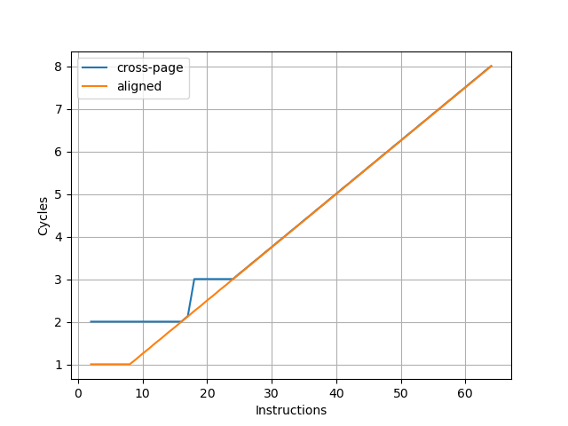

可以看到每 16 条指令会多一个周期，因此 Avalanche 的前端取指宽度确实是 16 条指令，与 Apple M1 Firestorm 和 Apple M4 P-Core 都相同。

#### Blizzard

用相同的方式测试 Blizzard，结果如下：

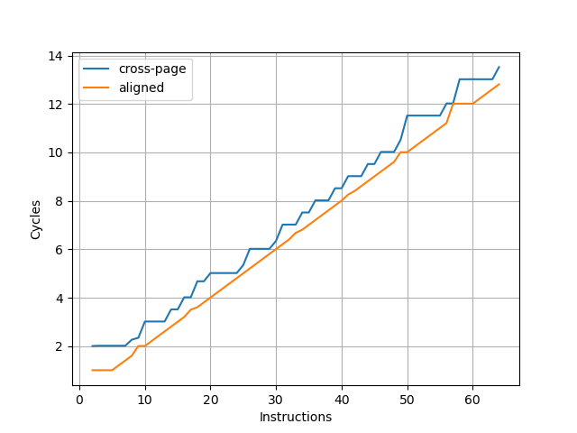

可以看到每 8 条指令会多一个周期，意味着 Blizzard 的前端取指宽度为 8 条指令，和 Apple M1 Icestorm 相同，不过表现在图像上不太一样。

[测试过程详见测试代码](https://github.com/jiegec/cpu-micro-benchmarks/blob/master/src/if_width_gen.cpp)。

### L1 ICache

官方信息：根据 Apple Silicon CPU Optimization Guide，从 M1 Family 到 M4 Family，A14 Bionic 到 A18 Family，P-Core 的 L1 ICache 的配置都是 192KiB, 6-way, 64B lines；对应处理器的 E-Core 的 L1 ICache 都是 128KiB, 64B lines，其中 M1 Family 和 A14 Bionic 是 8-way，其余处理器（M2 Family 和 A15 Bionic 开始）是 4-way。

容量和 Apple M1 相同。

#### Avalanche

为了测试 L1 ICache 容量，构造一个具有巨大指令 footprint 的循环，由大量的 nop 和最后的分支指令组成。观察在不同 footprint 大小下 Avalanche 的 IPC：

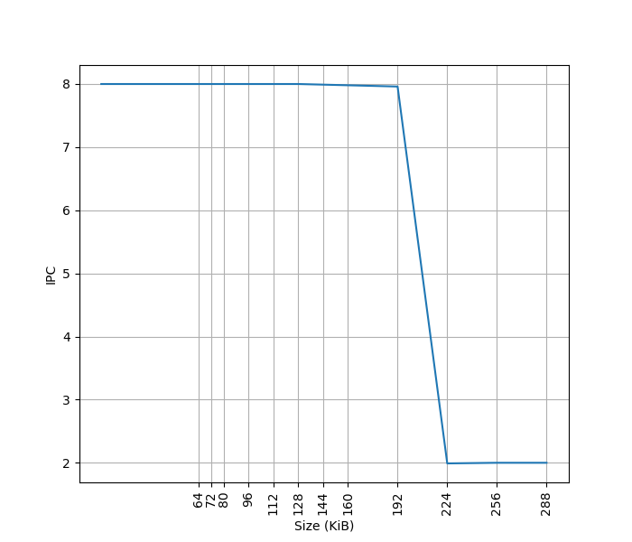

可以看到 footprint 在 192 KB 之前时可以达到 8 IPC，之后则快速降到 2 IPC，这里的 192 KB 就对应了 Avalanche 的 L1 ICache 的容量，和官方信息一致。虽然 Fetch 可以每周期 16 条指令，也就是一条 64B 的缓存行，由于后端的限制，只能观察到 8 的 IPC。IPC 与 Apple M1 Firestorm 相同，不及 Apple M4 P-Core 的 10 IPC。

#### Blizzard

用相同的方式测试 Blizzard，结果如下：

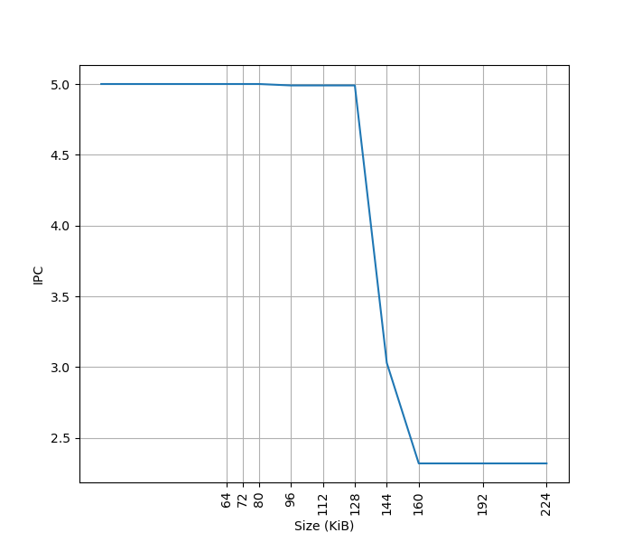

可以看到 footprint 在 128 KB 之前时可以达到 5 IPC，之后则快速降到 2.32 IPC，这里的 128 KB 就对应了 Blizzard 的 L1 ICache 的容量，和官方信息一致。虽然 Fetch 可以每周期 8 条指令，由于后端的限制，只能观察到 5 的 IPC。相比 Apple M1 Icestorm，IPC 从 4 增加到了 5，与 Apple M4 E-Core 相同。

[测试过程详见测试代码](https://github.com/jiegec/cpu-micro-benchmarks/blob/master/src/fetch_bandwidth_gen.cpp)。

### BTB

#### Avalanche

构造大量的无条件分支指令（B 指令），BTB 需要记录这些指令的目的地址，那么如果分支数量超过了 BTB 的容量，性能会出现明显下降。当把大量 B 指令紧密放置，也就是每 4 字节一条 B 指令时：

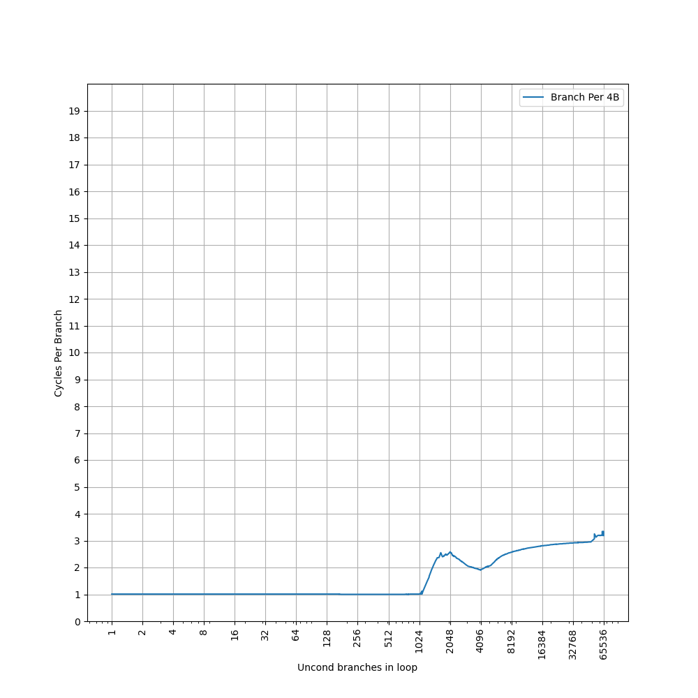

可见在 1024 个分支之内可以达到 1 的 CPI，超过 1024 个分支，CPI 先升后降，在 4096 个分支时 CPI 等于 2，此后 CPI 逐渐上升，到 49152 个分支 CPI 等于 3。49152 的拐点，对应的是指令 footprint 超出 L1 ICache 的情况：L1 ICache 是 192KB，按照每 4 字节一个 B 指令计算，最多可以存放 49152 条 B 指令。

降低分支指令的密度，在 B 指令之间插入 NOP 指令，使得每 8 个字节有一条 B 指令，得到如下结果：

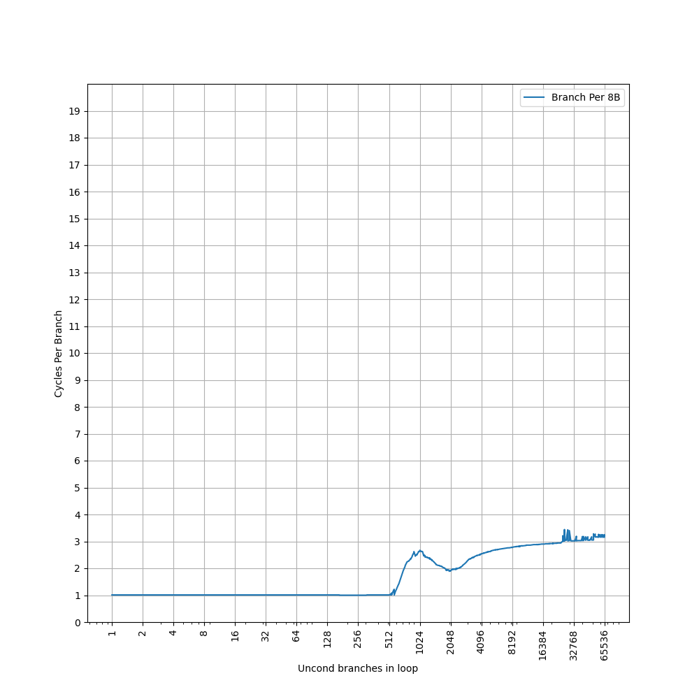

可以看到 CPI=1 的拐点前移到 512 个分支，同时 CPI=3 的拐点也前移到了 24576。拐点的前移，意味着 BTB 采用了组相连的结构，当 B 指令的 PC 的部分低位总是为 0 时，组相连的 Index 可能无法取到所有的 Set，导致表现出来的 BTB 容量只有部分 Set，例如此处容量减半，说明只有一半的 Set 被用到了。

相比 Apple M1 Firestorm，Avalanche 在 L1 和 L1 ICache 之间多加了一级 BTB，从而能够在更大的范围内，实现小于 3 的 CPI。相比 Apple M4 P-Core，Avalanche 在容量和延迟上都有差距。

#### Blizzard

用相同的方式测试 Blizzard，首先用 4B 的间距：

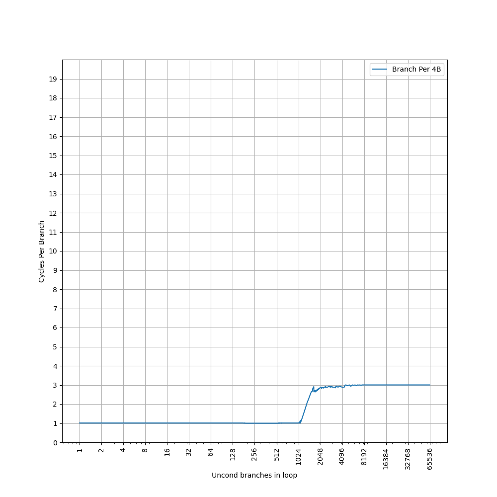

可以看到 1024 的拐点，1024 之前是 1 IPC，之后增加到 3 IPC。比较奇怪的是，没有看到第二个拐点，第二个拐点在 8B 的间距下显现：

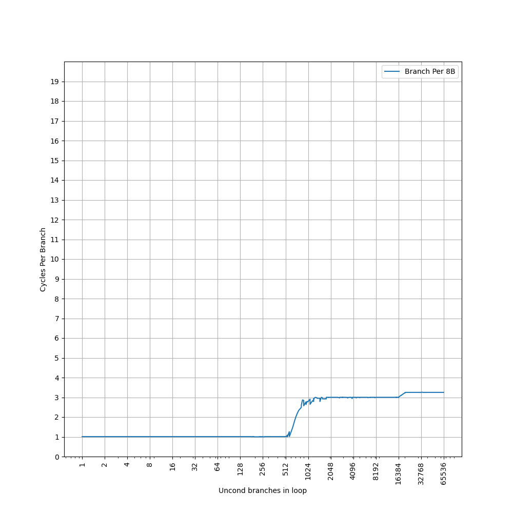

第一个拐点前移到 512，第二个拐点出现在 16384，而 Blizzard 的 L1 ICache 容量是 128KB，8B 间距下正好可以保存 16384 个分支。

用 16B 间距测试：

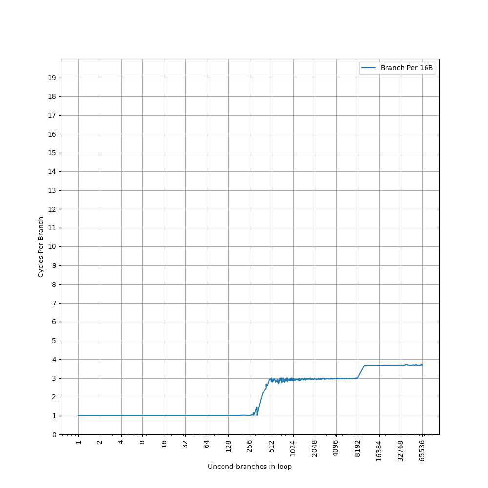

第一个拐点前移到 256，第二个拐点出现在 8192，对应 L1 ICache 容量。

从 BTB 容量来看，Blizzard 与 Apple M1 Icestorm 以及 Apple M4 E-Core 相同。

[测试过程详见测试代码](https://github.com/jiegec/cpu-micro-benchmarks/blob/master/src/btb_size_basic_gen.cpp)。

### L1 ITLB

官方信息：根据 Apple Silicon CPU Optimization Guide，从 M1 Family 到 M4 Family，A14 Bionic 到 A18 Family，其 P-Core 的 L1 ITLB 配置都是一样的：192 entries，考虑到每个页是 16 KiB，对应 3 MiB 的内存；E-Core 的话，M1 Family 和 A14 Bionic 的 L1 ITLB 是 128 entries，之后的处理器（M2 Family 和 A15 Bionic 开始）则 E-Core 也是 192 entries。

因此，M2 Avalanche L1 ITLB 是 192 entries，Blizzard L1 ITLB 是 192 entries。

#### Avalanche

构造一系列的 B 指令，使得 B 指令分布在不同的 page 上，使得 ITLB 成为瓶颈，在 Avalanche 上进行测试：

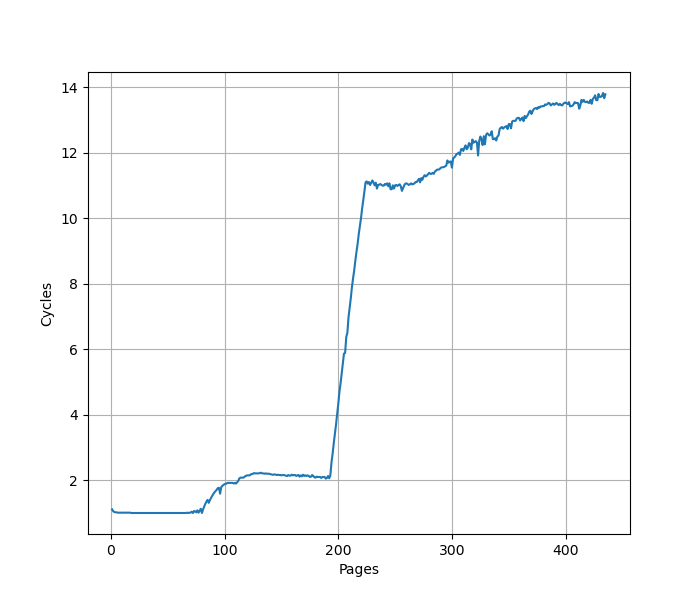

在 192 个页时从 2 Cycle 快速增加到 11 Cycle，对应了 192 项的 L1 ITLB 容量，和官方信息一致。

#### Blizzard

在 Blizzard 上重复实验：

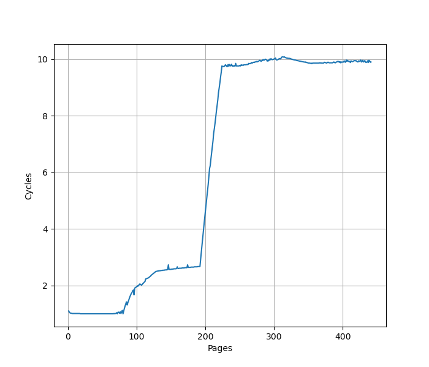

在 192 个页时，性能从 1 Cycle 下降到 10 Cycle，意味 L1 ITLB 容量是 192 项，和官方信息一致。

[测试过程详见测试代码](https://github.com/jiegec/cpu-micro-benchmarks/blob/master/src/itlb_size_lib.cpp)。

### Decode

官方信息：根据 Apple Silicon CPU Optimization Guide，M1 Family 的 Sustained uops Per Cycle 最大值，P-Core 是 8，E-Core 是 4；M2 Family 的 P-Core 不变还是 **8**，E-Core 提升到了 **5**；M3 Family 的 P-Core 提升到了 9，E-Core 和 M2 持平；M4 Family 的 P-Core 进一步提升到了 10，E-Core 继续和 M2 持平。

从前面的测试来看，Avalanche 最大观察到 8 IPC，Blizzard 最大观察到 5 IPC，那么 Decode 宽度也至少是这么多，暂时也不能排除有更大的 Decode 宽度，和官方信息一致。

### Return Stack

#### Avalanche

构造不同深度的调用链，测试每次调用花费的平均时间，在 Avalanche 上得到下面的图：

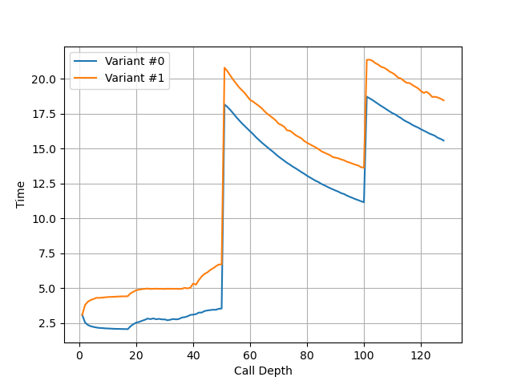

可以看到调用链深度为 50 时性能突然变差，因此 Avalanche 的 Return Stack 深度为 50。和 Apple M1 Firestorm 相同，比 Apple M4 P-Core 的 60 要小。

#### Blizzard

在 Blizzard 上测试：

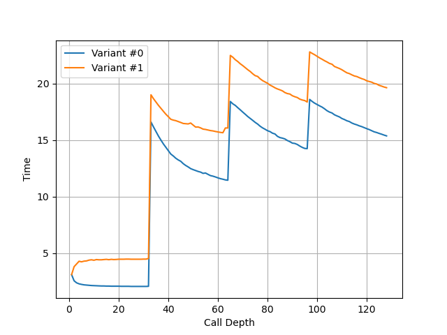

可以看到调用链深度为 32 时性能突然变差，因此 Blizzard 的 Return Stack 深度为 32。与 Apple M1 Icestorm 相同，比 Apple M4 E-Core 的 40 要小。

[测试过程详见测试代码](https://github.com/jiegec/cpu-micro-benchmarks/blob/master/src/ras_size_gen.cpp)。

### Conditional Branch Predictor

参考 [Dissecting Conditional Branch Predictors of Apple Firestorm and Qualcomm Oryon for Software Optimization and Architectural Analysis](https://arxiv.org/abs/2411.13900) 论文的方法，可以测出 Avalanche 的分支预测器与 Apple M1 Firestorm 相同，采用的历史更新方式为：

1. 使用 100 位的 Path History Register for Target(PHRT) 以及 28 位的 Path History Register for Branch(PHRB)，每次执行 taken branch 时更新
2. 更新方式为：`PHRTnew = (PHRTold << 1) xor T[31:2], PHRBnew = (PHRBold << 1) xor B[5:2]`，其中 B 代表分支指令的地址，T 代表分支跳转的目的地址

Blizzard 的分支预测器与 Apple M1 Icestorm 相同，采用的历史更新方式为：

1. 使用 60 位的 Path History Register for Target(PHRT) 以及 16 位的 Path History Register for Branch(PHRB)，每次执行 taken branch 时更新
2. 更新方式为：`PHRTnew = (PHRTold << 1) xor T[47:2], PHRBnew = (PHRBold << 1) xor B[5:2]`，其中 B 代表分支指令的地址，T 代表分支跳转的目的地址

各厂商处理器的 PHR 更新规则见 [jiegec/cpu](https://jia.je/cpu/cbp.html)。

## 后端

### 物理寄存器堆

#### Avalanche

为了测试物理寄存器堆的大小，一般会用两个依赖链很长的操作放在开头和结尾，中间填入若干个无关的指令，并且用这些指令来耗费物理寄存器堆。Firestorm 测试结果见下图：

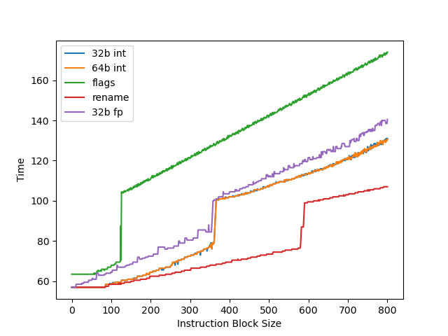

- 32b/64b int：测试 speculative 32/64 位整数寄存器的数量，拐点在 362
- 32b fp：测试 speculative 32 位浮点寄存器的数量，拐点在 356
- flags：测试 speculative NZCV 寄存器的数量，拐点在 123

Avalanche 寄存器堆容量和 Firestorm 类似，没有 M4 的双倍 32b int 寄存器优化。

#### Blizzard

Blizzard 测试结果如下：

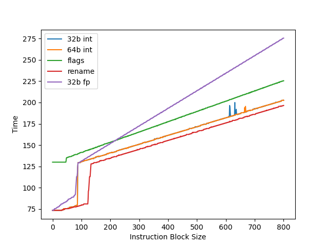

- 32b/64b int：测试 speculative 32/64 位整数寄存器的数量，拐点在 86
- 32b fp：测试 speculative 32 位浮点寄存器的数量，拐点在 80
- flags：测试 speculative NZCV 寄存器的数量，拐点在 46

相比 M1 Icestorm 有少量的扩容。

注意这里测试的都是能够用于预测执行的寄存器数量，实际的物理寄存器堆还需要保存架构寄存器。但具体保存多少个架构寄存器不确定，但至少 32 个整数通用寄存器和浮点寄存器是一定有的，但可能还有一些额外的需要重命名的状态也要算进来。

[测试过程详见测试代码](https://github.com/jiegec/cpu-micro-benchmarks/blob/master/src/register_file_size_gen.cpp)。

### Load Store Unit + L1 DCache

#### L1 DCache 容量

官方信息：根据 Apple Silicon CPU Optimization Guide，从 M1 Family 到 M4 Family，从 A14 Bionic 到 A18 Family，P-Core 的 L1 DCache 都是 128KiB, 8-way, 64B lines 的配置，E-Core 的 L1 DCache 都是 64KiB, 8-way, 64B lines 的配置。

##### Avalanche

构造不同大小 footprint 的 pointer chasing 链，测试不同 footprint 下每条 load 指令耗费的时间，Avalanche 上的结果：

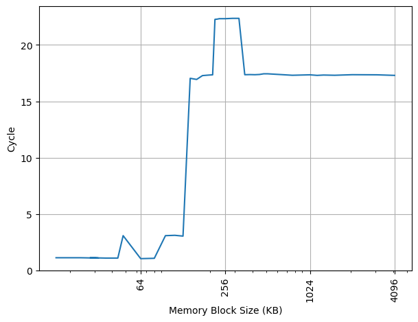

可以看到 128KB 出现了拐点，对应的就是 128KB 的 L1 DCache 容量，和官方信息一致。当 footprint 比较小的时候，由于 Load Address Predictor 的介入，打破了依赖链，所以出现了 latency 小于正常 load to use 的 3 cycle latency 的情况。

##### Blizzard

Blizzard 上的结果：

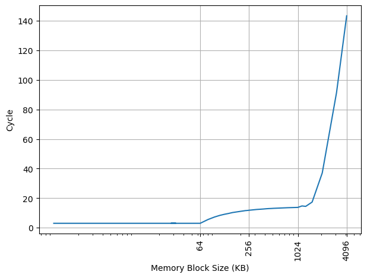

可以看到 64KB 出现了明显的拐点，对应的就是 64KB 的 L1 DCache 容量，和官方信息一致。L1 DCache 范围内延迟是 3 cycle。由此可见 Blizzard 没有 Load Address Predictor，不能打断依赖链。

[测试过程详见测试代码](https://github.com/jiegec/cpu-micro-benchmarks/blob/master/src/memory_latency.cpp)。

#### L1 DTLB 容量

官方信息：根据 Apple Silicon CPU Optimization Guide，对于 P-Core 来说，除了 M2 Family、A14 Bionic 和 A15 Bionic 的 L1 DTLB 是 256 entries 以外，其余的 M1 Family、M3 Family 到 M4 Family，A16 Bionic 到 A18 Family 的 L1 DTLB 都是 160 entries。对于 E-Core 来说，除了 M1 Family 和 A14 Bionic 是 129 entries，其余的从 M2 Family 到 M4 Family，A15 Bionic 到 A18 Family 都是 192 entries。

因此，Avalanche L1 DTLB 容量是 256，Blizzard L1 DTLB 容量是 192。

##### Avalanche

用类似的方法测试 L1 DTLB 容量，只不过这次 pointer chasing 链的指针分布在不同的 page 上，使得 DTLB 成为瓶颈，在 Avalanche 上：

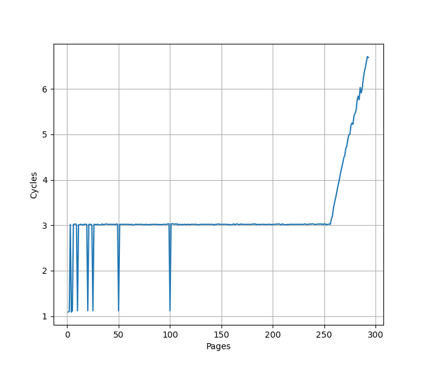

从 256 个页开始性能下降，认为 Avalanche 的 L1 DTLB 有 256 项，和官方信息一致。性能出现波动，有时候能实现 1 cycle 的 CPI，主要来自于 Load Address Predictor。

##### Blizzard

Blizzard:

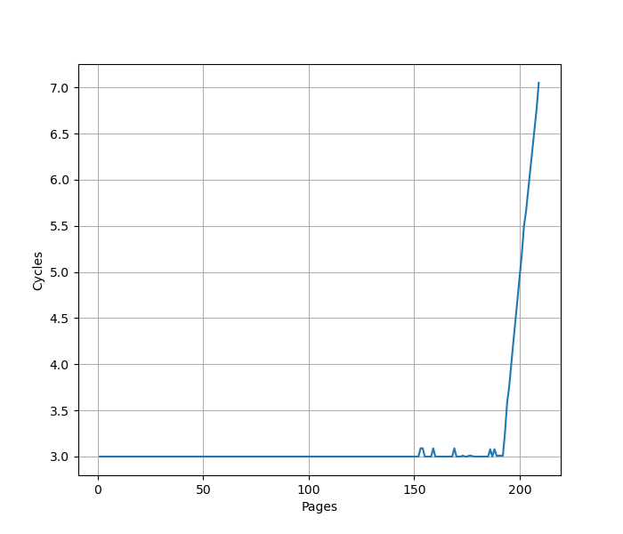

从 192 个页开始性能下降，认为 Blizzard 的 L1 DTLB 有 192 项，和官方信息一致。

[测试过程详见测试代码](https://github.com/jiegec/cpu-micro-benchmarks/blob/master/src/dtlb_size.cpp)。

#### Load/Store 带宽

##### Avalanche

针对 Load Store 带宽，实测 Avalanche 每个周期可以完成：

- 3x 128b Load + 1x 128b Store
- 2x 128b Load + 2x 128b Store
- 1x 128b Load + 2x 128b Store
- 2x 128b Store

如果把每条指令的访存位宽从 128b 改成 256b，读写带宽不变，指令吞吐减半。也就是说最大的读带宽是 48B/cyc，最大的写带宽是 32B/cyc，二者不能同时达到。和 M1/M4 的 P-Core 相同。

##### Blizzard

实测 Blizzard 每个周期可以完成：

- 2x 128b Load
- 1x 128b Load + 1x 128b Store
- 1x 128b Store

如果把每条指令的访存位宽从 128b 改成 256b，读写带宽不变，指令吞吐减半。也就是说最大的读带宽是 32B/cyc，最大的写带宽是 16B/cyc，二者不能同时达到。和 M1/M4 的 E-Core 相同。

#### Memory Dependency Predictor

为了预测执行 Load，需要保证 Load 和之前的 Store 访问的内存没有 Overlap，那么就需要有一个预测器来预测 Load 和 Store 之前在内存上的依赖。参考 [Store-to-Load Forwarding and Memory Disambiguation in x86 Processors](https://blog.stuffedcow.net/2014/01/x86-memory-disambiguation/) 的方法，构造两个指令模式，分别在地址和数据上有依赖：

- 数据依赖，地址无依赖：`str x3, [x1]` 和 `ldr x3, [x2]`
- 地址依赖，数据无依赖：`str x2, [x1]` 和 `ldr x1, [x2]`

初始化时，`x1` 和 `x2` 指向同一个地址，重复如上的指令模式，观察到多少条 `ldr` 指令时会出现性能下降。

##### Avalanche

在 Avalanche 上测试：

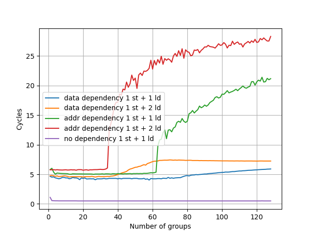

数据依赖没有明显的阈值，但从 77 开始出现了一个小的增长，且斜率不为零；地址依赖的阈值是 62。相比 M1 P-Core Firestorm 有所减小。

##### Blizzard

Blizzard:

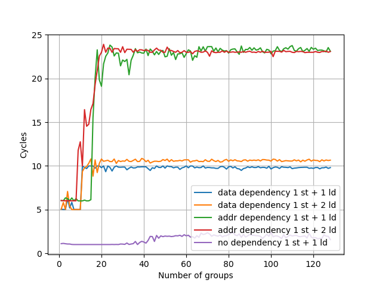

数据依赖的阈值是 10，地址依赖的阈值是 16。和 Icestorm 差不多。

#### Store to Load Forwarding

##### Avalanche

经过实际测试，Avalanche 上如下的情况可以成功转发，对地址 x 的 Store 转发到对地址 y 的 Load 成功时 y-x 的取值范围：

| Store\Load | 8b Load | 16b Load | 32b Load | 64b Load |
|------------|---------|----------|----------|----------|
| 8b Store   | {0}     | [-1,0]   | [-3,0]   | [-7,0]   |
| 16b Store  | [0,1]   | [-1,1]   | [-3,1]   | [-7,1]   |
| 32b Store  | [0,3]   | [-1,3]   | [-3,3]   | [-7,3]   |
| 64b Store  | [0,7]   | [-1,7]   | [-3,7]   | [-7,7]   |

从上表可以看到，所有 Store 和 Load Overlap 的情况，无论地址偏移，都能成功转发。甚至在 Load 或 Store 跨越 64B 缓存行边界时，也可以成功转发，代价是多一个周期。

一个 Load 需要转发两个、四个甚至八个 Store 的数据时，如果数据跨越缓存行，则不能转发，但其他情况下，无论地址偏移，都可以转发，只是比从单个 Store 转发需要多耗费 1-4 个周期。

成功转发时 7.3 cycle，跨缓存行且转发失败时 26+ cycle。和 Firestorm 具有相同的性能。

小结：Apple Avalanche 的 Store to Load Forwarding：

- 1 ld + 1 st: 支持
- 1 ld + 2 st: 支持，要求不跨越 64B 边界
- 1 ld + 4 st: 支持，要求不跨越 64B 边界
- 1 ld + 8 st: 支持，要求不跨越 64B 边界

##### Blizzard

在 Blizzard 上，如果 Load 和 Store 访问范围出现重叠，则需要 10 Cycle，无论是和几个 Store 重叠，也无论是否跨缓存行。和 Icestorm 行为相同。

#### Load to use latency

官方信息：根据 Apple Silicon CPU Optimization Guide，Apple 实现了 fast pointer chasing with a 3-cycle latency，要求后一个 load 的 base register 和前一个 load 的 destination register 相同。

##### Avalanche

实测 Avalanche 的 Load to use latency 针对 pointer chasing 场景做了优化，在下列的场景下可以达到 3 cycle:

- `ldr x0, [x0]`: load 结果转发到基地址，无偏移
- `ldr x0, [x0, 8]`：load 结果转发到基地址，有立即数偏移
- `ldr x0, [x0, x1]`：load 结果转发到基地址，有寄存器偏移
- `ldp x0, x1, [x0]`：load pair 的第一个目的寄存器转发到基地址，无偏移

如果访存跨越了 8B 边界，则退化到 4 cycle。

在下列场景下 Load to use latency 则是 4 cycle：

- load 的目的寄存器作为 alu 的源寄存器（下称 load to alu latency）
- `ldr x0, [sp, x0, lsl #3]`：load 结果转发到 index
- `ldp x1, x0, [x0]`：load pair 的第二个目的寄存器转发到基地址，无偏移

注意由于 Load Address Predictor 的存在，测试的时候需要排除预测器带来的影响。延迟方面，和 M1/M4 P-Core 相同。

##### Blizzard

实测 Blizzard 的 Load to use latency 针对 pointer chasing 场景做了优化，在下列的场景下可以达到 3 cycle:

- `ldr x0, [x0]`: load 结果转发到基地址，无偏移
- `ldr x0, [x0, 8]`：load 结果转发到基地址，有立即数偏移
- `ldr x0, [x0, x1]`：load 结果转发到基地址，有寄存器偏移
- `ldp x0, x1, [x0]`：load pair 的第一个目的寄存器转发到基地址，无偏移

如果访存跨越了 8B/16B/32B 边界，依然是 3 cycle；跨越了 64B 边界则退化到 7 cycle。

在下列场景下 Load to use latency 则是 4 cycle：

- load 的目的寄存器作为 alu 的源寄存器（下称 load to alu latency）
- `ldr x0, [sp, x0, lsl #3]`：load 结果转发到 index
- `ldp x1, x0, [x0]`：load pair 的第二个目的寄存器转发到基地址，无偏移

延迟方面，和 M1/M4 E-Core 相同。

#### Virtual Address UTag/Way-Predictor

Linear Address UTag/Way-Predictor 是 AMD 的叫法，但使用相同的测试方法，也可以在 Apple M2 上观察到类似的现象，猜想它也用了类似的基于虚拟地址的 UTag/Way Predictor 方案，并测出来它的 UTag 也有 8 bit，Avalanche 和 Blizzard 都是相同的：

- VA[14] xor VA[22] xor VA[30] xor VA[38] xor VA[46]
- VA[15] xor VA[23] xor VA[31] xor VA[39] xor VA[47]
- VA[16] xor VA[24] xor VA[32] xor VA[40]
- VA[17] xor VA[25] xor VA[33] xor VA[41]
- VA[18] xor VA[26] xor VA[34] xor VA[42]
- VA[19] xor VA[27] xor VA[35] xor VA[43]
- VA[20] xor VA[28] xor VA[36] xor VA[44]
- VA[21] xor VA[29] xor VA[37] xor VA[45]

一共有 8 bit，由 VA[47:14] 折叠而来。和 Apple M1/M4 相同。

### 执行单元

想要测试有多少个执行单元，每个执行单元可以运行哪些指令，首先要测试各类指令在无依赖情况下的 IPC，通过 IPC 来推断有多少个能够执行这类指令的执行单元；但由于一个执行单元可能可以执行多类指令，于是进一步需要观察在混合不同类的指令时的 IPC，从而推断出完整的结果。

官方信息：根据 Apple Silicon CPU Optimization Guide，M2 Family 的 P-Core Avalanche 包括如下计算单元：

1. ALU/f, BRc/i
2. ALU/f, BRc
3. ALU/f
4. ALU, MUL, MAC, MISC
5. ALU, MUL, DIV
6. ALU
7. GENERAL, MOVE2GPR, FCMPf, FCSELf, FDIV, MUL, SHA
8. GENERAL, MOVE2GPR, FCSELf, MUL
9. GENERAL, MUL
10. GENERAL, MUL

P-Core Avalanche 访存：

- Burst: 3 load uops, 2 store uops (address part), and 2 store uops (data part)
    - 即 3 load, 2 sta, 2 std
- Sustained: 4 uops, 2 write into the cache

M2 Family 的 E-Core Blizzard 包括如下计算单元：

1. ALU/f, MUL, MAC, MISC
2. ALU/f, BRi, DIV
3. ALU/f, BRc
4. ALU/f
5. GENERAL, MOVE2GPR, FCMPf, FCSELf, FDIV, MUL, SHA
6. GENERAL, FCSELf, MUL

E-Core Blizzard 访存：

- Burst: 2 load uops, or 2 store uops (address part), or 1 of each, along with 2 store uops (data part)
    - 即 2 load，或者 2 sta，或者 1 load + 1 std，或者 1 sta + 1 std
- Sustained: 2 uops, 1 write into the cache

和 M1 一样。

#### Avalanche

在 Avalanche 上测试如下各类指令的延迟和每周期吞吐：

| 指令               | 延迟 | 吞吐 |
|--------------------|------|------|
| asimd int add      | 2    | 4    |
| asimd aesd/aese    | 3    | 4    |
| asimd aesimc/aesmc | 2    | 4    |
| asimd fabs         | 2    | 4    |
| asimd fadd         | 3    | 4    |
| asimd fdiv 64b     | 10   | 1    |
| asimd fdiv 32b     | 8    | 1    |
| asimd fmax         | 2    | 4    |
| asimd fmin         | 2    | 4    |
| asimd fmla         | 4    | 4    |
| asimd fmul         | 4    | 4    |
| asimd fneg         | 2    | 4    |
| asimd frecpe       | 3    | 1    |
| asimd frsqrte      | 3    | 1    |
| asimd fsqrt 64b    | 13   | 0.5  |
| asimd fsqrt 32b    | 10   | 0.5  |
| fp cvtf2i (fcvtzs) | -    | 2    |
| fp cvti2f (scvtf)  | -    | 3    |
| fp fabs            | 2    | 4    |
| fp fadd            | 3    | 4    |
| fp fdiv 64b        | 10   | 1    |
| fp fdiv 32b        | 8    | 1    |
| fp fjcvtzs         | -    | 1    |
| fp fmax            | 2    | 4    |
| fp fmin            | 2    | 4    |
| fp fmov f2i        | -    | 2    |
| fp fmov i2f        | -    | 3    |
| fp fmul            | 4    | 4    |
| fp fneg            | 2    | 4    |
| fp frecpe          | 3    | 1    |
| fp frecpx          | 3    | 1    |
| fp frsqrte         | 3    | 1    |
| fp fsqrt 64b       | 13   | 0.5  |
| fp fsqrt 32b       | 10   | 0.5  |
| int add            | 1    | 4.4  |
| int addi           | 1    | 6    |
| int bfm            | 1    | 1    |
| int crc            | 3    | 1    |
| int csel           | 1    | 3    |
| int madd (addend)  | 1    | 1    |
| int madd (others)  | 3    | 1    |
| int mrs nzcv       | -    | 2    |
| int mul            | 3    | 2    |
| int nop            | -    | 9.5  |
| int sbfm           | 1    | 4.5  |
| int sdiv           | 7/8  | 0.5  |
| int smull          | 3    | 2    |
| int ubfm           | 1    | 4.6  |
| int udiv           | 7/8  | 0.5  |
| not taken branch   | -    | 2    |
| taken branch       | -    | 1    |
| mem asimd load     | -    | 3    |
| mem asimd store    | -    | 2    |
| mem int load       | -    | 3    |
| mem int store      | -    | 2    |

测试结果与 [M1 Firestorm](./apple-m1.md) 基本一样，这里就不再进行深入分析。

#### Blizzard

接下来用类似的方法测试 Blizzard：

| 指令               | 延迟 | 吞吐      |
|--------------------|------|-----------|
| asimd int add      | 2    | 2         |
| asimd aesd/aese    | 3    | 2         |
| asimd aesimc/aesmc | 2    | 2         |
| asimd fabs         | 2    | 2         |
| asimd fadd         | 3    | 2         |
| asimd fdiv 64b     | 11   | 0.5       |
| asimd fdiv 32b     | 9    | 0.5       |
| asimd fmax         | 2    | 2         |
| asimd fmin         | 2    | 2         |
| asimd fmla         | 4    | 2         |
| asimd fmul         | 4    | 2         |
| asimd fneg         | 2    | 2         |
| asimd frecpe       | 4    | 0.5       |
| asimd frsqrte      | 4    | 0.5       |
| asimd fsqrt 64b    | 15   | 0.5       |
| asimd fsqrt 32b    | 12   | 0.5       |
| fp cvtf2i (fcvtzs) | -    | 1         |
| fp cvti2f (scvtf)  | -    | 2         |
| fp fabs            | 2    | 2         |
| fp fadd            | 3    | 2         |
| fp fdiv 64b        | 10   | 1         |
| fp fdiv 32b        | 8    | 1         |
| fp fjcvtzs         | -    | 0.5       |
| fp fmax            | 2    | 2         |
| fp fmin            | 2    | 2         |
| fp fmov f2i        | -    | 1         |
| fp fmov i2f        | -    | 2         |
| fp fmul            | 4    | 2         |
| fp fneg            | 2    | 2         |
| fp frecpe          | 3    | 1         |
| fp frecpx          | 3    | 1         |
| fp frsqrte         | 3    | 1         |
| fp fsqrt 64b       | 13   | 0.5       |
| fp fsqrt 32b       | 10   | 0.5       |
| int add            | 1    | 4         |
| int addi           | 1    | 4         |
| int bfm            | 1    | 1         |
| int crc            | 3    | 1         |
| int csel           | 1    | 4         |
| int madd (addend)  | 1    | 1         |
| int madd (others)  | 3    | 1         |
| int mrs nzcv       | -    | 4         |
| int mul            | 3    | 1         |
| int nop            | -    | 5         |
| int sbfm           | 1    | 4         |
| int sdiv           | 7    | 0.125=1/8 |
| int smull          | 3    | 1         |
| int ubfm           | 1    | 4         |
| int udiv           | 7    | 0.125=1/8 |
| not taken branch   | -    | 2         |
| taken branch       | -    | 1         |
| mem asimd load     | -    | 2         |
| mem asimd store    | -    | 1         |
| mem int load       | -    | 2         |
| mem int store      | -    | 1         |

测试结果与 [M1 Icestorm](./apple-m1.md) 基本一样，只是多了一个 ALU，所以部分整数指令的 IPC 加一，其他则基本一样，这里就不再进行深入分析。

### Reorder Buffer

#### Avalanche

首先用不同数量的 fsqrt 依赖链加 NOP 指令测试 Avalanche 的 ROB 大小：

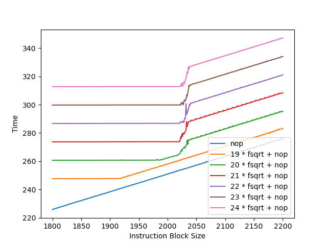

可以看到当 fsqrt 数量足够多的时候，出现了统一的拐点，在 2022 条指令左右。

为了测 Coalesced ROB 的大小，改成用 load/store 指令，可以测到拐点在 292 左右：

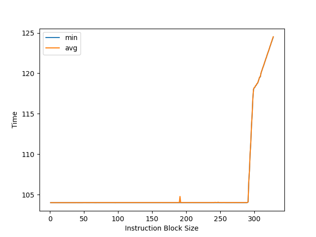

2022 除以 292 约等于 7，意味着每个 group 可以保存 7 条指令，一共有 289 左右个 group。相比 M1 P-Core Firestorm，Group 数量有所减少。

#### Blizzard

首先用 NOP 指令测试 Blizzard 的 ROB 大小：

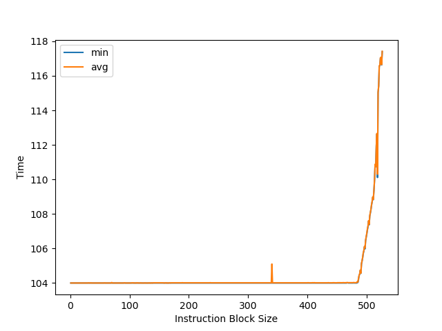

可以看到拐点是 486 条指令。

为了测 Coalesced ROB 的大小，改成用 load/store 指令，可以测到拐点在 74 左右：

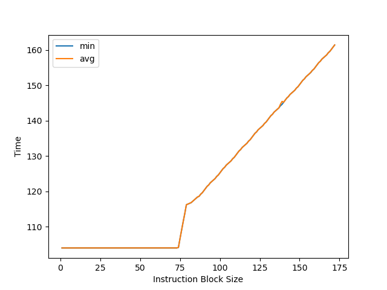

但是 486 除以 74 是 6.57，离 6 或者 7 都有一段距离，比较奇怪，不确定每个 group 可以放多少条指令。容量上比 M1 E-Core 有提升。

### L2 Cache

官方信息：根据 Apple Silicon CPU Optimization Guide，L2 Cache 配置如下：

- M1 Family/A14 Bionic: P-Core cluster 12MiB, 12-way, 128B lines; E-Core cluster 4MiB, 16-way, 128B lines
- M2/M3/M4 Family/A16 Bionic/A17 Pro/A18 Pro: P-Core cluster 16MiB, 16-way, 128B lines; E-Core cluster 4MiB, 16-way, 128B lines
- A14 Bionic/A18: P-Core cluster 8MiB, 16-way, 128B lines; E-Core cluster 4MiB, 16-way, 128B lines

### Memory Cache

官方信息：根据 Apple Silicon CPU Optimization Guide，Memory Cache（在别的处理器也叫 System Level Cache，就是 Last Level Cache）的配置如下：

- M1/M2/M3/M4: 8MiB, 16-way, 128B lines
- M3 Pro/A18: 12MiB, 16-way, 128B lines
- A14 Bionic: 16MiB, 16-way, 128B lines
- M1 Pro/M2 Pro/M4 Pro/A16 Bionic/A17 Pro/A18 Pro: 24MiB, 12-way, 128B lines
- A15 Bionic: 32MiB, 16-way, 128B lines
- M1 Max/M2 Max/M3 Max/M4 Max: 48MiB, 12-way, 128B lines
- M1 Ultra/M2 Ultra/M3 Ultra: 96MiB, 12-way, 128B lines

### L2 TLB

官方信息：根据 Apple Silicon CPU Optimization Guide，P-Core 的 L2 TLB 容量，从 M1 Family 到 M4 Family，从 A14 Bionic 到 A18 Family，都是 3072 entries；E-Core 的 L2 TLB 容量，M1 Family 和 A14 Bionic 是 1024 entries，M2 Family 到 M4 Family 和 A15 Bionic 到 A18 Family 都是 2048 entries。

## 总结

M2 相比 M1，在很多方面做了迭代：

1. P-Core 的前端改进了 BTB，多加了一级 BTB
2. E-Core 的宽度从 4 提升到 5，整数执行单元增加
3. 引入了 Load Address Predictor（P-Core）
4. 缓存和 TLB 容量增加

指令集扩展方面，M2 增加了 i8mm bf16 bti ecv 的 feature。在 SPEC CPU 2017 Rate-1 上，M2 P-Core 相比 M1 P-Core 有 16% 的整数性能提升和 9% 的浮点性能提升，而 M2 E-Core 相比 M1 E-Core 有 33% 的整数性能提升和 31% 的浮点性能提升。
