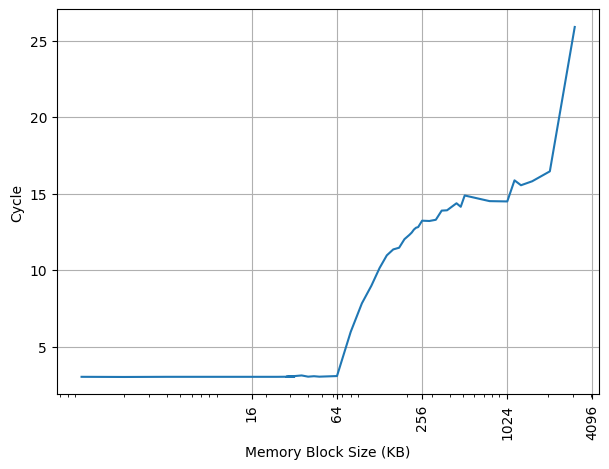

# Apple M4 微架构评测

## 背景

最近拿到了 Apple M4 的环境，借此机会测试一下 Apple M4 的微架构，和之前[分析的 Apple M1 的微架构](./apple-m1.md)做比较。由于 Asahi Linux 尚不支持 Apple M4，所以这里的测试都在 macOS 上进行。

<!-- more -->

## 官方信息

Apple M4 的官方信息乏善可陈，关于微架构的信息几乎为零，但能从操作系统汇报的硬件信息中找到一些内容。

UPDATE: 后来苹果发布了 [Apple Silicon CPU Optimization Guide](https://developer.apple.com/download/apple-silicon-cpu-optimization-guide/)，算是为数不多的官方信息了。

## 现有评测

网上已经有针对 Apple M4 微架构的评测和分析，建议阅读：

- [苹果 M4 性能分析：尽力了，但芯片工艺快到头了！](https://www.bilibili.com/video/BV1NJ4m1w7zk/)

下面分各个模块分别记录官方提供的信息，以及实测的结果。读者可以对照已有的第三方评测理解。官方信息与实测结果一致的数据会加粗。

## 前端

### 取指带宽

#### P-Core

为了测试实际的 Fetch 宽度，参考 [如何测量真正的取指带宽（I-fetch width） - JamesAslan](https://zhuanlan.zhihu.com/p/720136752) 构造了测试。

其原理是当 Fetch 要跨页的时候，由于两个相邻页可能映射到不同的物理地址，如果要支持单周期跨页取指，需要查询两次 ITLB，或者 ITLB 需要把相邻两个页的映射存在一起。这个场景一般比较少，处理器很少会针对这种特殊情况做优化，但也不是没有。经过测试，把循环放在两个页的边界上，发现 M4 P-Core 微架构遇到跨页的取指时确实会拆成两个周期来进行。

在此基础上，构造一个循环，循环的第一条指令放在第一个页的最后四个字节，其余指令放第二个页上，那么每次循环的取指时间，就是一个周期（读取第一个页内的指令）加上第二个页内指令需要 Fetch 的周期数，多的这一个周期就足以把 Fetch 宽度从后端限制中区分开，实验结果如下：


图中蓝线（cross-page）表示的就是上面所述的第一条指令放一个页，其余指令放第二个页的情况，横坐标是第二个页内的指令数，那么一次循环的指令数等于横坐标 +1。纵坐标是运行很多次循环的总 cycle 数除以循环次数，也就是平均每次循环耗费的周期数。可以看到每 16 条指令会多一个周期，因此 M4 P-Core 的前端取指宽度确实是 16 条指令，和 Apple M1 的 P-Core 是相同的。

为了确认这个瓶颈是由取指造成的，又构造了一组实验，把循环的所有指令都放到一个页中，这个时候 Fetch 不再成为瓶颈（图中 aligned），两个曲线的对比可以明确地得出上述结论。

随着指令数进一步增加，最终瓶颈在每周期执行的 NOP 指令数，因此两条线重合。

#### E-Core

用相同的方式测试 M4 E-Core，结果如下：


由于两个曲线汇合的点太前（NOP 指令执行得不够快），无法确定 M4 E-Core 的取指宽度，但可以确认的是它每周期取值不少于 10 条指令，比 Apple M1 的 E-Core 要更快。如果读者想到什么办法来确认 M4 E-Core 的取指宽度，欢迎在评论区给出。

### L1 ICache

官方信息：通过 sysctl 可以看到，P-Core 具有 192KB L1 ICache，E-Core 具有 128KB L1 ICache：

```
hw.perflevel0.l1icachesize: 196608
hw.perflevel1.l1icachesize: 131072
```

根据 Apple Silicon CPU Optimization Guide，从 M1 Family 到 M4 Family，A14 Bionic 到 A18 Family，P-Core 的 L1 ICache 的配置都是 192KiB, 6-way, 64B lines；对应处理器的 E-Core 的 L1 ICache 都是 192KiB, 64B lines，其中 M1 Family 和 A14 Bionic 是 8-way，其余处理器（M2 Family 和 A15 Bionic 开始）是 4-way。

延续了从 Apple M1 以来的大小。

#### P-Core

为了测试 L1 ICache 容量，构造一个具有巨大指令 footprint 的循环，由大量的 nop 和最后的分支指令组成。观察在不同 footprint 大小下 M4 P-Core 的 IPC：


可以看到 footprint 在 192 KB 之前时可以达到 10 IPC，之后则快速降到 2.5 IPC，这里的 192 KB 就对应了 M4 P-Core 的 L1 ICache 的容量，和官方信息一致。虽然 Fetch 可以每周期 16 条指令，也就是一条 64B 的缓存行，由于后端的限制，只能观察到 10 的 IPC。

#### E-Core

用相同的方式测试 M4 E-Core，结果如下：


可以看到 footprint 在 128 KB 之前时可以达到 5 IPC，之后则快速降到 2.0 IPC，这里的 128 KB 就对应了 M4 E-Core 的 L1 ICache 的容量，和官方信息一致。

### BTB

[Apple M1](./apple-m1.md) 的 BTB 设计相对比较简单：1024 项的组相连 L1 BTB，接着是以 192KB L1 ICache 作为兜底的 3 周期的等效 BTB。但是 M4 上的 BTB 测试图像变化很大，下面进行仔细的分析。

#### P-Core

构造大量的无条件分支指令（B 指令），BTB 需要记录这些指令的目的地址，那么如果分支数量超过了 BTB 的容量，性能会出现明显下降。当把大量 B 指令紧密放置，也就是每 4 字节一条 B 指令时：


可以看到最低的 CPI 能达到接近 0.5（实际值在 0.55），说明 Apple M4 有了一定的每周期执行 2 taken branches 的能力，后面会着重讨论这一点。在经过 CPI 最低点之后，性能出现了先下降后上升再下降的情况，最终在 2048 个分支开始稳定在 2 左右（实际值在 2.10）的 CPI。

这个 2 左右的 CPI 一直稳定维持，一直延续到 49152 个分支。超出 BTB 容量以后，分支预测时，无法从 BTB 中得到哪些指令是分支指令的信息，只能等到取指甚至译码后才能后知后觉地发现这是一条分支指令，这样就出现了性能损失，出现了 2 CPI 的情况。49152 这个拐点，对应的是指令 footprint 超出 L1 ICache 的情况：L1 ICache 是 192KB，按照每 4 字节一个 B 指令计算，最多可以存放 49152 条 B 指令。

这个 2 CPI 的平台在 Apple M1 中是 3 CPI，这是一个巨大的优化，在大多数情况下，通过 L1 ICache 能以每 2 周期一条无条件分支的性能兜底。

接下来降低分支指令的密度，在 B 指令之间插入 NOP 指令，使得每 8 个字节有一条 B 指令，得到如下结果：


图像基本就是 4 字节间距情况下，整体左移的结果，说明各级 BTB 结构大概是组相连，当间距为 8 字节，PC[2] 恒为 0 的时候，只有一半的组可以被用到。

继续降低分支指令的密度，在 B 指令之间插入 NOP 指令，使得每 16 个字节有一条 B 指令，得到如下结果：


每 32 个字节有一条 B 指令：


从间距为 4 字节到间距为 32 字节，整个的图像都是类似的，只是不断在左移。但是当每 64 个字节有一条 B 指令的时候，情况就不同了：


整体的 CPI 有比较明显的下降，最低的 CPI 也在 2 以上，这和 Apple M1 上依然是在 4 字节间距的图像的基础上左移有显著的不同。

前面提到，Apple M4 P-Core 出现了每周期 2 taken branches，但是当分支不在同一个 64B 内的时候，性能会有明显下降；另一方面，以 ARM Neoverse V2 为例，它实现的每周期 2 taken branches，即使分支不在同一个 64B 内，也是可以做到的，下面是在 64B 间距下 ARM Neoverse V2 的测试结果：


根据这些现象，找到了 Apple 的一篇专利 [Using a Next Fetch Predictor Circuit with Short Branches and Return Fetch Groups](https://patents.google.com/patent/US20240028339A1/en)，它提到了一种符合上述现象的实现 2 taken branches 的方法：如果在一个 fetch group（在这里是 64B）内，有一条分支，它的目的地址还在这个 fetch group 内，由于 fetch group 的指令都已经取出来了，所以同一个周期内，可以从这条分支的目的地址开始，继续获取指令。下面是一个例子：

```asm
# the beginning of a fetch group
nop
# the branch
b target
# some instructions are skipped between branch and its target
svc #0
# the branch target resides in the same fetch group
target:
# some instructions after the branch target
add x3, x2, x1
ret
```

那么在传统的设计里，这段代码会被分成两个周期去取指，第一个周期取 `nop` 和 `b target`，第二个周期取 `add x3, x2, x1` 和 `ret`；按照这个专利的说法，可以在一个周期内取出所有指令，然后把中间被跳过的 `svc #0` 指令跳过去，不去执行它。当然了，分支预测器那边也需要做修改，能够去预测第二个分支的目的地址，用于下一个周期。

如果是这种实现方法，是可能在一个 Coupled 前端内，实现这种有限场景的每周期执行 2 taken branches，核心是每周期依然只访问一次 ICache。

#### E-Core

另一方面，M4 E-Core 的 BTB 设计和 Apple M1 的 E-Core 十分接近，当分支间距是 4 字节时：


可以看到 1024 的拐点，1024 之前是 1 IPC，之后增加到 3 IPC。比较奇怪的是，没有看到第二个拐点。

8B 的间距：


拐点前移到 512。

16B 的间距：


第一个拐点前移到 256，第二个拐点出现在 8192，而 M4 E-Core 的 L1 ICache 容量是 128KB，16B 间距下正好可以保存 8192 个分支。

可见 M4 E-Core 的前端设计和 M4 P-Core 有较大的不同。

### L1 ITLB

官方信息：根据 Apple Silicon CPU Optimization Guide，从 M1 Family 到 M4 Family，A14 Bionic 到 A18 Family，其 P-Core 的 L1 ITLB 配置都是一样的：192 entries，考虑到每个页是 16 KiB，对应 3 MiB 的内存；E-Core 的话，M1 Family 和 A14 Bionic 的 L1 ITLB 是 128 entries，之后的处理器（M2 Family 和 A15 Bionic 开始）则 E-Core 也是 192 entries。

因此，M4 的 P-Core L1 ITLB 是 192 entries，E-Core L1 ITLB 也是 192 entries。

#### P-Core

构造一系列的 B 指令，使得 B 指令分布在不同的 page 上，使得 ITLB 成为瓶颈，在 M4 P-Core 上进行测试：


第一个拐点是由于 L1 BTB 的冲突缺失，之后在 192 个页时从 3 Cycle 快速增加到 12 Cycle，则对应了 192 项的 L1 ITLB 容量，和官方信息一致。这和 M1 P-Core 是一样的。

#### E-Core

在 M4 E-Core 上重复实验：


第一个拐点是由于 L1 BTB 的冲突缺失，之后在 192 个页时从 3 Cycle 快速增加到 10 Cycle，则对应了 192 项的 L1 ITLB 容量，和官方信息一致。相比 M1 E-Core 的 128 项，容量变大了，和 M4 P-Core 看齐。

### Decode

官方信息：根据 Apple Silicon CPU Optimization Guide，M1 Family 的 Sustained uops Per Cycle 最大值，P-Core 是 8，E-Core 是 4；M2 Family 的 P-Core 不变，E-Core 提升到了 5；M3 Family 的 P-Core 提升到了 9，E-Core 和 M2 持平；M4 Family 的 P-Core 进一步提升到了 10，E-Core 继续和 M2 持平。

从前面的测试来看，M4 P-Core 最大观察到 10 IPC，M4 E-Core 最大观察到 5 IPC，那么 Decode 宽度也至少是这么多，暂时也不能排除有更大的 Decode 宽度，和官方信息一致。相比 M1 的 P-Core 8 IPC，E-Core 4 IPC 都有拓宽。

### Return Stack

#### P-Core

构造不同深度的调用链，测试每次调用花费的平均时间，在 M4 P-Core 上得到下面的图：


可以看到调用链深度为 60 时性能突然变差，因此 M4 P-Core 的 Return Stack 深度为 60，比 M1 P-Core 的 50 要更大。这里测试的两个 Variant，对应的是 Return 的目的地址不变还是会变化。

#### E-Core

在 M4 E-Core 上测试：


可以看到调用链深度为 40 时性能突然变差，因此 M4 E-Core 的 Return Stack 深度为 40，比 M1 E-Core 的 32 要更大。

## 后端

### 物理寄存器堆

#### P-Core

为了测试物理寄存器堆的大小，一般会用两个依赖链很长的操作放在开头和结尾，中间填入若干个无关的指令，并且用这些指令来耗费物理寄存器堆。M4 P-Core 测试结果见下图：


- 32b int：测试 speculative 32 位整数寄存器的数量，拐点在 720 左右
- 64b int：测试 speculative 64 位整数寄存器的数量，拐点在 360 左右，只有 32b 的一半，可见实际的物理寄存器堆有 360 左右个 64 位整数寄存器，但是可以分成两半分别当成 32 位整数寄存器用，这一个优化在 M1 是没有的，即用 32b 或者用 64b 整数，测出来的整数寄存器数量相同
- flags：测试 speculative NZCV 寄存器的数量，拐点在 175 左右
- 32b fp：测试 speculative 32 位浮点寄存器的数量，没有观察到明显的拐点

寄存器堆大小和 M1 P-Core 比较类似，但是多了 32 位整数寄存器的优化。

#### E-Core

在 M4 E-Core 上复现相同的测试，发现性能非常不稳定，不确定是什么原因。

### Load Store Unit + L1 DCache

#### L1 DCache 容量

官方信息：通过 sysctl 可以看到，M4 P-Core 具有 128KB L1 DCache，M4 E-Core 具有 64KB L1 DCache：

```
hw.perflevel0.l1dcachesize: 131072
hw.perflevel1.l1dcachesize: 65536
```

根据 Apple Silicon CPU Optimization Guide，从 M1 Family 到 M4 Family，从 A14 Bionic 到 A18 Family，P-Core 的 L1 DCache 都是 128KiB, 8-way, 64B lines 的配置，E-Core 的 L1 DCache 都是 64KiB, 8-way, 64B lines 的配置。

和 M1 相同。

##### P-Core

构造不同大小 footprint 的 pointer chasing 链，在每个页的开头放一个指针，测试不同 footprint 下每条 load 指令耗费的时间，M4 P-Core 上的结果：


可以看到 128KB 出现了拐点，对应的就是 128KB 的 L1 DCache 容量，和官方信息一致。当 footprint 比较小的时候，由于 Load Address/Value Predictor 的介入，打破了依赖链，所以出现了 latency 小于正常 load to use 的 3 cycle latency 的情况。

##### E-Core

M4 E-Core 上的结果：


可以看到 128KB 出现了明显的拐点，但实际上 M4 E-Core 的 L1 DCache 只有 64KB。猜测这是因为在测试的时候，是在每个 16KB 页的开头放一个指针，但如果 L1 DCache 的 Index 并非都在 16KB 内部，就会导致实际测出来的不是 L1 DCache 的大小。修改测试，使得每 8 字节一个指针，此时测出来的结果就是正确的 64KB 大小：



此时 64KB 对应的就是 64KB 的 L1 DCache 容量，和官方信息一致。L1 DCache 范围内延迟是 3 cycle，之后提升到 14+ cycle。由此可见 M4 E-Core 没有 Load Address/Value Predictor，不能打断依赖链。

#### L1 DTLB 容量

官方信息：根据 Apple Silicon CPU Optimization Guide，对于 P-Core 来说，除了 M2 Family、A14 Bionic 和 A15 Bionic 的 L1 DTLB 是 256 entries 以外，其余的 M1 Family、M3 Family 到 M4 Family，A16 Bionic 到 A18 Family 的 L1 DTLB 都是 160 entries。对于 E-Core 来说，除了 M1 Family 和 A14 Bionic 是 129 entries，其余的从 M2 Family 到 M4 Family，A15 Bionic 到 A18 Family 都是 192 entries。

因此，M4 的 P-Core L1 DTLB 容量是 160，E-Core L1 DTLB 容量是 192。

##### P-Core

用类似的方法测试 L1 DTLB 容量，只不过这次 pointer chasing 链的指针分布在不同的 page 的不同 cache line 上，使得 DTLB 成为瓶颈，在 M4 P-Core 上：


从 160 个页开始性能下降，到 200 个页时性能稳定在 9 CPI，认为 M4 P-Core 的 L1 DTLB 有 160 项，大小和 M1 P-Core 相同，和官方信息一致。9 CPI 包括了 L1 DTLB miss L2 TLB hit 带来的额外延迟。中间有时性能特别快，是 Load Address/Value Predictor 的功劳。

##### E-Core

M4 E-Core 测试结果：


从 192 个页开始性能下降，到 224 个页时性能稳定在 9 CPI，认为 M4 E-Core 的 L1 DTLB 有 192 项，和官方信息一致，比 M1 E-Core 的 128 项更大，甚至大过了 P-Core。9 CPI 包括了 L1 DTLB miss L2 TLB hit 带来的额外延迟，比 M1 E-Core 少了一个周期。

#### Load/Store 带宽

##### P-Core

针对 Load Store 带宽，实测 M4 P-Core 每个周期可以完成：

- 3x 128b Load + 1x 128b Store
- 2x 128b Load + 2x 128b Store
- 1x 128b Load + 2x 128b Store
- 2x 128b Store

如果把每条指令的访存位宽从 128b 改成 256b，读写带宽不变，指令吞吐减半。也就是说最大的读带宽是 48B/cyc，最大的写带宽是 32B/cyc，二者不能同时达到。和 M1 P-Core 相同。

##### E-Core

实测 M4 E-Core 每个周期可以完成：

- 2x 128b Load
- 1x 128b Load + 1x 128b Store
- 1x 128b Store

如果把每条指令的访存位宽从 128b 改成 256b，读写带宽不变，指令吞吐减半。也就是说最大的读带宽是 32B/cyc，最大的写带宽是 16B/cyc，二者不能同时达到。和 M1 E-Core 相同。

#### Memory Dependency Predictor

为了预测执行 Load，需要保证 Load 和之前的 Store 访问的内存没有 Overlap，那么就需要有一个预测器来预测 Load 和 Store 之前在内存上的依赖。参考 [Store-to-Load Forwarding and Memory Disambiguation in x86 Processors](https://blog.stuffedcow.net/2014/01/x86-memory-disambiguation/) 的方法，构造两个指令模式，分别在地址和数据上有依赖：

- 数据依赖，地址无依赖：`str x3, [x1]` 和 `ldr x3, [x2]`
- 地址依赖，数据无依赖：`str x2, [x1]` 和 `ldr x1, [x2]`

初始化时，`x1` 和 `x2` 指向同一个地址，重复如上的指令模式，观察到多少条 `ldr` 指令时会出现性能下降。

##### P-Core

在 M4 P-Core 上测试：


数据依赖没有明显的阈值，但从 72 开始出现了一个小的增长，且斜率不为零；地址依赖的阈值是 39。相比 M1 P-Core 有所减小。

##### E-Core

M4 E-Core:


数据依赖的阈值是 20，地址依赖的阈值是 14。比 M1 E-Core 略大。

#### Store to Load Forwarding

##### P-Core

经过实际测试，M4 P-Core 上如下的情况可以成功转发，对地址 x 的 Store 转发到对地址 y 的 Load 成功时 y-x 的取值范围：

| Store\Load | 8b Load | 16b Load | 32b Load | 64b Load |
|------------|---------|----------|----------|----------|
| 8b Store   | {0}     | [-1,0]   | [-3,0]   | [-7,0]   |
| 16b Store  | [0,1]   | [-1,1]   | [-3,1]   | [-7,1]   |
| 32b Store  | [0,3]   | [-1,3]   | [-3,3]   | [-7,3]   |
| 64b Store  | [0,7]   | [-1,7]   | [-3,7]   | [-7,7]   |

从上表可以看到，所有 Store 和 Load Overlap 的情况，无论地址偏移，都能成功转发。甚至在 Load 或 Store 跨越 64B 缓存行边界时，也可以成功转发，代价是多一个周期。

一个 Load 需要转发两个、四个甚至八个 Store 的数据时，也可以成功转发。即使数据跨越缓存行，也可以转发，只是多耗费 1-2 个周期。但在跨 64B 缓存行的时候，代价可能多于一个周期。相比 M1 P-Core，M4 P-Core 在跨越缓存行的情况下也可以得到比较好的性能。

成功转发时 7 cycle 左右。

小结：Apple M4 P-Core 的 Store to Load Forwarding：

- 1 ld + 1 st: 支持
- 1 ld + 2 st: 支持
- 1 ld + 4 st: 支持
- 1 ld + 8 st: 支持
- 跨 64B 缓存行边界时，性能略微下降

##### E-Core

在 M4 E-Core 上，如果 Load 和 Store 访问范围出现重叠，当需要转发一个到两个 Store 的数据时，需要 7 Cycle，无论是否跨缓存行。如果需要转发四个 Store 的数据，则需要 8 Cycle；转发八个 Store 的数据需要 11 Cycle。相比 M1 E-Core，多数情况下获得了性能提升。

#### Load to use latency

官方信息：根据 Apple Silicon CPU Optimization Guide，Apple 实现了 fast pointer chasing with a 3-cycle latency，要求后一个 load 的 base register 和前一个 load 的 destination register 相同。

##### P-Core

实测 M4 P-Core 的 Load to use latency 针对 pointer chasing 场景做了优化，在下列的场景下可以达到 3 cycle:

- `ldr x0, [x0]`: load 结果转发到基地址，无偏移
- `ldr x0, [x0, 8]`：load 结果转发到基地址，有立即数偏移
- `ldr x0, [x0, x1]`：load 结果转发到基地址，有寄存器偏移
- `ldp x0, x1, [x0]`：load pair 的第一个目的寄存器转发到基地址，无偏移

如果访存跨越了 8B 边界，则退化到 4 cycle。

在下列场景下 Load to use latency 则是 4 cycle：

- load 的目的寄存器作为 alu 的源寄存器（下称 load to alu latency）
- `ldr x0, [sp, x0, lsl #3]`：load 结果转发到 index
- `ldp x1, x0, [x0]`：load pair 的第二个目的寄存器转发到基地址，无偏移

注意由于 Load Address/Value Predictor 的存在，测试的时候需要排除预测器带来的影响。延迟方面，和 M1 P-Core 相同。

##### E-Core

实测 M4 E-Core 的 Load to use latency 针对 pointer chasing 场景做了优化，在下列的场景下可以达到 3 cycle:

- `ldr x0, [x0]`: load 结果转发到基地址，无偏移
- `ldr x0, [x0, 8]`：load 结果转发到基地址，有立即数偏移
- `ldr x0, [x0, x1]`：load 结果转发到基地址，有寄存器偏移
- `ldp x0, x1, [x0]`：load pair 的第一个目的寄存器转发到基地址，无偏移

如果访存跨越了 8B/16B/32B 边界，依然是 3 cycle；跨越了 64B 边界则退化到 7 cycle。

在下列场景下 Load to use latency 则是 4 cycle：

- load 的目的寄存器作为 alu 的源寄存器（下称 load to alu latency）
- `ldr x0, [sp, x0, lsl #3]`：load 结果转发到 index
- `ldp x1, x0, [x0]`：load pair 的第二个目的寄存器转发到基地址，无偏移

延迟方面，和 M1 E-Core 相同。

#### Virtual Address UTag/Way-Predictor

Linear Address UTag/Way-Predictor 是 AMD 的叫法，但使用相同的测试方法，也可以在 Apple M1 上观察到类似的现象，猜想它也用了类似的基于虚拟地址的 UTag/Way Predictor 方案，并测出来它的 UTag 也有 8 bit，M4 P-Core 和 M4 E-Core 都是相同的：

- VA[14] xor VA[22] xor VA[30] xor VA[38] xor VA[46]
- VA[15] xor VA[23] xor VA[31] xor VA[39] xor VA[47]
- VA[16] xor VA[24] xor VA[32] xor VA[40]
- VA[17] xor VA[25] xor VA[33] xor VA[41]
- VA[18] xor VA[26] xor VA[34] xor VA[42]
- VA[19] xor VA[27] xor VA[35] xor VA[43]
- VA[20] xor VA[28] xor VA[36] xor VA[44]
- VA[21] xor VA[29] xor VA[37] xor VA[45]

一共有 8 bit，由 VA[47:14] 折叠而来。和 Apple M1 相同。

#### Load Address/Value Predictor

Apple 从 M2 开始引入 Load Address Predictor，从 M3 开始引入 Load Value Predictor，相关的信息如下：

- Load Address Predictor：支持 Constant 和 Striding Address 两种模式，专利是 [Early load execution via constant address and stride prediction](https://patents.google.com/patent/US11829763B2/)
- Load Value Predictor（也称 Load Output Predictor）：只支持 Constant Value，专利是 [Shared learning table for load value prediction and load address prediction](https://patents.google.com/patent/US12067398B1/en)

这两个 Predictor 会对已有的基于 Load 的各种 microbenchmark 带来深刻的影响。

网上已有针对这两个 Predictor 的逆向和攻击：[SLAP: Data Speculation Attacks via Load Address Prediction on Apple Silicon;FLOP Breaking the Apple M3 CPU via False Load Output Predictions](https://predictors.fail/)。

苹果还有一个后续的专利：[Managing table accesses for tagged geometric length (TAGE) load value prediction](https://patents.google.com/patent/US12159142B1/)，暗示了苹果可能会使用 VTAGE 算法来实现 load value prediction，只是不知道会不会实装，会在哪代处理器上实装，是不是已经实装在已经发布的处理器上了。

##### P-Core

构造依赖链，但是实际测试可以观察到打破依赖链的情况，比串行执行要更快。测试下来，大概可以跟踪 60 条 Load 指令的地址并实现预测。

##### E-Core

M4 E-Core 没有实现 Load Address/Value Predictor。

### 执行单元

官方信息：根据 Apple Silicon CPU Optimization Guide，M4 Family 的 P-Core 包括如下计算单元：

1. ALU/f, BRc/i
2. ALU/f, BRc
3. ALU/f
4. ALU/f, PRED/f
5. ALU, MUL, MISC
6. ALU, DIV
7. ALU, MUL
8. ALU, MUL
10. GENERAL, MOVE2GPR, FCMPf, FCSELf, FDIV, MUL, SHA
11. GENERAL, MOVE2GPR, FCSELf, MUL
12. GENERAL, MUL
13. GENERAL, MUL

从 M3 开始，P-Core 整数计算单元从 6 个增加到 8 个。浮点部分没有变化。

P-Core 访存：

- Burst: 3 load uops, 2 store uops (address part), and 2 store uops (data part)
    - 即 3 load, 2 sta, 2 std
- Sustained: 4 uops, 2 write into the cache

和 M1 E-Core 相同。

M4 Family 的 E-Core 包括如下计算单元：

1. ALU/f, MUL, MAC, MISC, PRED/f
2. ALU/F, BRi, DIV
3. ALU/f, BRc
4. ALU/f
5. GENERAL, MOVE2GPR, FCMPf, FCSELf, FDIV, MUL, SHA
6. GENERAL, MOVE2GPR, FCMPf, FCSELf, MUL
7. GENERAL

从 M3 开始，E-Core 整数计算单元从 3 个增加到 4 个。从 M3 Max/M4 Family 开始，E-Core 浮点单元从 2 个增加到 3 个。注意 M3/M3 Pro 的 E-Core 依然是 2 个浮点单元。

E-Core 访存：

- Burst: 3 load uops, 2 store uops (address part), and 2 store uops (data part)
    - 即 3 load, 2 sta, 2 std
- Sustained: 4 uops, 2 write into the cache

和 M1 E-Core 相同。

#### P-Core

在 M4 P-Core 上测试如下各类指令的延迟和每周期吞吐：

| Instruction        | Latency | Throughput |
|--------------------|---------|------------|
| asimd int add      | 2       | 4          |
| asimd aesd/aese    | 2/3     | 4          |
| asimd aesimc/aesmc | 2       | 4          |
| asimd fabs         | 2       | 4          |
| asimd fadd         | 3       | 4          |
| asimd fdiv 64b     | 10      | 1          |
| asimd fdiv 32b     | 8       | 1          |
| asimd fmax         | 2       | 4          |
| asimd fmin         | 2       | 4          |
| asimd fmla         | 3       | 4          |
| asimd fmul         | 3       | 4          |
| asimd fneg         | 2       | 4          |
| asimd frecpe       | 3       | 1          |
| asimd frsqrte      | 3       | 1          |
| asimd fsqrt 64b    | 13      | 0.5        |
| asimd fsqrt 32b    | 10      | 0.5        |
| fp cvtf2i (fcvtzs) | -       | 2          |
| fp cvti2f (scvtf)  | -       | 3          |
| fp fabs            | 2       | 4          |
| fp fadd            | 2       | 4          |
| fp fdiv 64b        | 10      | 1          |
| fp fdiv 32b        | 8       | 1          |
| fp fjcvtzs         | -       | 1          |
| fp fmax            | 2       | 4          |
| fp fmin            | 2       | 4          |
| fp fmov f2i        | -       | 2          |
| fp fmov i2f        | -       | 3          |
| fp fmul            | 4       | 4          |
| fp fneg            | 2       | 4          |
| fp frecpe          | 3       | 1          |
| fp frecpx          | 3       | 1          |
| fp frsqrte         | 3       | 1          |
| fp fsqrt 64b       | 13      | 0.5        |
| fp fsqrt 32b       | 10      | 0.5        |
| int add            | 1       | 7.5        |
| int addi           | 1       | 8          |
| int bfm            | 1       | 1          |
| int crc            | 3       | 1          |
| int csel           | 1       | 4          |
| int madd (addend)  | 1       | 2.8        |
| int madd (others)  | 4       | 2.8        |
| int mrs nzcv       | -       | 2          |
| int mul            | 3       | 3          |
| int nop            | -       | 10         |
| int sbfm           | 1       | 8          |
| int sdiv           | 7       | 0.5        |
| int smull          | 3       | 3          |
| int ubfm           | 1       | 8          |
| int udiv           | 7       | 0.5        |
| not taken branch   | -       | 2          |
| taken branch       | -       | 1-2        |
| mem asimd load     | -       | 3          |
| mem asimd store    | -       | 2          |
| mem int load       | -       | 3          |
| mem int store      | -       | 2          |

从上面的结果可以初步得到的信息：

1. 标量浮点和 ASIMD 吞吐最大都是 4，意味着有 4 个浮点/ASIMD 执行单元，但并非完全对称，例如 fdiv/frecpe/frecpx/frsqrte/fsqrt/fjcvtzs 由于吞吐不超过 1，大概率只能在一个执行单元内执行。但这些指令是不是都只能在同一个执行单元内执行，还需要进一步的测试；这部分和 M1 P-Core 相同，但浮点乘法 fmla/fmul 的延迟从 4 周期降低到了 3 周期
2. 浮点和整数之间的 move 或 convert 指令，fmov i2f/cvti2f 吞吐是 3，fmov f2i/cvtf2i 吞吐是 2，那么这些指令是在哪个执行单元里实现的，是否需要同时占用整数执行单元和浮点执行单元，需要进一步测试；这部分和 M1 P-Core 相同
3. 整数方面，根据吞吐，推断出如下几类指令对应的执行单元数量：
    1. ALU: 8
    2. CSEL: 4
    3. Mul/MAdd: 3
    3. Br/MRS NZCV: 2
    4. CRC/BFM/Div: 1
    5. ALU/CSEL/Mul/MAdd 的执行单元相比 M1 P-Core 有扩充
4. 访存方面，每周期最多 3 Load 或者 2 Store；这部分和 M1 P-Core 相同

首先来看浮点和 ASIMD 单元，根据上面的信息，认为至少有 4 个执行单元，每个执行单元都可以做这些操作：asimd int add/aes/fabs/fadd/fmax/fmin/fmla/fmul/fneg，下面把这些指令称为 basic fp/asimd ops + aes。接下来要判断，fmov f2i/fmov i2f/fdiv/frecpe/frecpx/frsqrte/fsqrt 由哪些执行单元负责执行，方法是把这些指令混合起来测试吞吐（此处的吞吐不代表 CPI，而是每周能够执行多少次指令组合，例如用 2 条指令的组合测试，那么吞吐等于 CPI 除以 2）：

| 指令                  | 吞吐        |
|-----------------------|-------------|
| fp fdiv + fp frecpe   | 0.5         |
| fp fdiv + fp frecpx   | 0.5         |
| fp fdiv + fp frsqrte  | 0.5         |
| fp fdiv + fp fsqrt    | 0.33=1/3    |
| fp fdiv + fmov f2i    | 0.5         |
| fp fdiv + 2x fmov f2i | 0.33=1/3    |
| fp fdiv + 3x fmov i2f | 1           |
| fp fdiv + 4x fmov i2f | 0.75=1/1.33 |
| fmov i2f + 4x fp fadd | 1           |
| fmov f2i + 4x fp fadd | 0.75=1/1.33 |

根据以上测试结果，可以得到如下的推论：

1. fp fdiv/frecpe/frecpx/frsqrte 混合的时候，吞吐只有一半，IPC 不变，说明这些指令在同一个执行单元中，混合并不能带来更高的 IPC；这部分和 M1 P-Core 相同
2. fp fdiv 和 fp fsqrt 混合时，吞吐下降到 0.33 一个不太整的数字，猜测是因为它们属于同一个执行单元内的不同流水线，抢占寄存器堆写口；这部分和 M1 P-Core 相同
3. fp fdiv + fmov f2i 的时候吞吐是 0.5，而 fdiv + 2x fmov f2i 时吞吐下降到 0.33，IPC 维持在 1，说明有 1 个执行单元执行 fdiv 或 fmov f2i，但奇怪的是单独执行 fmov f2i 可以达到 2 的 IPC；这部分吞吐比 M1 P-Core 要差
4. fp fdiv + 3x fmov i2f 的时候吞吐是 1，而 fdiv + 4x fmov i2f 时吞吐下降到 0.75，此时每周期还是执行 3 条 fmov i2f 指令，意味着 fdiv 没有抢占 fmov i2f 的执行单元，它们用的执行单元是独立的；这部分和 M1 P-Core 相同
5. fmov i2f + 4x fp fadd 的时候吞吐是 1，说明 fmov i2f 没有抢占 fp fadd 的执行单元；这部分和 M1 P-Core 相同

推断这四个执行单元支持的操作：

1. basic fp/asimd ops + aes + fdiv + frecpe + frecpx + frsqrte + fsqrt + fmov f2i + cvtf2i
2. basic fp/asimd ops + aes + fmov f2i + cvtf2i
3. basic fp/asimd ops + aes
4. basic fp/asimd ops + aes

当然还有很多指令没有测，不过原理是一样的。这部分和 M1 P-Core 相同。

访存部分，前面已经在测 LSU 的时候测过了，每周期 Load + Store 不超过 4 个，其中 Load 不超过 3 个，Store 不超过 2 个。虽然从 IPC 的角度来看 LSU 的 Load/Store Pipe 未必准确，比如可能它发射和提交的带宽是不同的，但先暂时简化为如下的执行单元：

1. load + store
2. load
3. load
4. store

这部分和 M1 P-Core 相同。

最后是整数部分。从 addi 的指令来看，有 8 个 ALU，能够执行基本的整数指令。但其他很多指令可能只有一部分执行单元可以执行：bfm/crc/csel/madd/mrs nzcv/mul/div/branch/fmov i2f。为了测试这些指令使用的执行单元是否重合，进行一系列的混合指令测试，吞吐的定义和上面相同：

| 指令                              | 吞吐        |
|-----------------------------------|-------------|
| 4x int csel + 3x fmov i2f         | 1           |
| int csel + 2x fmov f2i            | 1           |
| 2x int csel + 2x fmov f2i         | 0.80=1/1.25 |
| 3x int csel + int bfm             | 1           |
| 4x int csel + int bfm             | 0.80=1/1.25 |
| 4x int csel + int crc             | 1           |
| 3x int csel + int madd            | 1.33=1/0.75 |
| 4x int csel + int madd            | 1           |
| 4x int csel + 2x int madd         | 1           |
| 4x int csel + 3x int madd         | 0.75=1/1.33 |
| 4x int csel + int mul             | 1           |
| 3x int csel + int sdiv            | 0.5         |
| 4x int csel + int sdiv            | 0.45=1/2.23 |
| 3x int csel + mrs nzcv            | 1           |
| 4x int csel + mrs nzcv            | 0.80=1/1.25 |
| 3x int csel + not taken branch    | 1           |
| 4x int csel + not taken branch    | 0.80=1/1.25 |
| mrs nzcv + not taken branch       | 1           |
| mrs nzcv + 2x not taken branch    | 0.67=1/1.50 |
| 2x fmov f2i + 2x not taken branch | 1           |
| 2x fmov f2i + 2x int mul          | 1           |
| 2x int madd + int crc             | 1           |
| 3x int madd + int crc             | 0.75=1/1.33 |
| 2x int madd + int mul             | 1           |
| 3x int madd + int mul             | 0.75        |
| 2x int madd + int sdiv            | 0.5         |
| 3x int madd + int sdiv            | 0.5         |
| 3x int madd + mrs nzcv            | 1           |

根据上述结果分析：

1. 吞吐与不混合时相同，代表混合的指令对应的执行单元不重合
2. 2x int madd + int mul 的 IPC 是 3，3x int add + int mul 的 IPC 也是 3，说明有三个执行单元可以执行 madd 和 mul：
    1. alu + madd + mul
    2. alu + madd + mul
    3. alu + madd + mul
3. 2x int madd + int crc 的 IPC 是 3，3x int madd + int crc 的 IPC 也是 3，说明其中一个执行单元可以执行 crc：
    1. alu + madd + mul + crc
    2. alu + madd + mul
    3. alu + madd + mul
4. 4x int csel + 2x int madd 的吞吐是 1，4x int csel + 3x int madd 的吞吐是 0.75，说明它们有一个重合的执行单元，并且由于 4x int csel + int crc 的吞吐是 1，所以重合的执行单元不是 crc 的那一个：
    1. alu + madd + mul + crc
    2. alu + madd + mul + csel
    3. alu + madd + mul
    4. alu + csel
    5. alu + csel
    6. alu + csel
5. 4x int csel + mrs nzcv 的 IPC 等于 4，说明 mrs nzcv 的执行单元被包括在能执行 csel 的四个执行单元当中；而 3x int madd + mrs nzcv 的吞吐等于 1，说明 mrs nzcv 的执行单元和 int madd 不重合：
    1. alu + madd + mul + crc
    2. alu + madd + mul + csel
    3. alu + madd + mul
    4. alu + csel + mrs nzcv
    5. alu + csel + mrs nzcv
    6. alu + csel
6. 因为 mrs nzcv + 2x not taken branch 的吞吐是 0.67，此时 IPC 等于 2，说明它们的执行单元重合：
    1. alu + madd + mul + crc
    2. alu + madd + mul + csel
    3. alu + madd + mul
    4. alu + csel + mrs nzcv + branch
    5. alu + csel + mrs nzcv + branch
    6. alu + csel

得到初步的结果：

1. alu + madd + mul + crc
2. alu + madd + mul + csel
3. alu + madd + mul
4. alu + csel + mrs nzcv + branch
5. alu + csel + mrs nzcv + branch
6. alu + csel
7. alu
8. alu

还有很多其他的指令没有测试，不过方法是类似的。从上面的结果里，可以看到一些值得一提的点：

1. fmov f2i 同时占用了浮点执行单元和整数执行单元，这主要是为了复用寄存器堆读写口：fmov f2i 需要读浮点寄存器堆，又需要写整数寄存器堆，那就在浮点侧读寄存器，在整数侧写寄存器。
2. fmov i2f 既不在浮点，也不在整数，那只能在访存了：而正好访存执行单元需要读整数，写整数或浮点，那就可以复用它的寄存器堆写口来实现 fmov i2f 的功能。
3. 可见整数/浮点/访存执行单元并不是完全隔离的，例如一些微架构，整数和浮点是直接放在一起的。

小结：M4 P-Core 的执行单元如下：

1. alu + madd + mul + crc
2. alu + madd + mul + csel
3. alu + madd + mul
4. alu + csel + mrs nzcv + branch
5. alu + csel + mrs nzcv + branch
6. alu + csel
7. alu
8. alu
9. load + store
10. load
11. load
12. store
13. basic fp/asimd ops + aes + fdiv + frecpe + frecpx + frsqrte + fsqrt + fmov f2i + cvtf2i
14. basic fp/asimd ops + aes + fmov f2i + cvtf2i
15. basic fp/asimd ops + aes
16. basic fp/asimd ops + aes

相比 M1 P-Core，只在整数方面有扩充。和官方的信息，除了 store data/address 部分没有探测出来以外都一致。

#### E-Core

接下来用类似的方法测试 M4 E-Core：

| Instruction        | Latency | Throughput |
|--------------------|---------|------------|
| asimd int add      | 2       | 3          |
| asimd aesd/aese    | 2.5/3   | 3          |
| asimd aesimc/aesmc | 2       | 3          |
| asimd fabs         | 2       | 3          |
| asimd fadd         | 2.5     | 3          |
| asimd fdiv 64b     | 11      | 0.5        |
| asimd fdiv 32b     | 9       | 0.5        |
| asimd fmax         | 2       | 3          |
| asimd fmin         | 2       | 3          |
| asimd fmla         | 4       | 2          |
| asimd fmul         | 4       | 2          |
| asimd fneg         | 2       | 3          |
| asimd frecpe       | 4       | 0.5        |
| asimd frsqrte      | 4       | 0.5        |
| asimd fsqrt 64b    | 15      | 0.5        |
| asimd fsqrt 32b    | 12      | 0.5        |
| fp cvtf2i (fcvtzs) | -       | 2          |
| fp cvti2f (scvtf)  | -       | 1.5        |
| fp fabs            | 2       | 3          |
| fp fadd            | 2.5     | 3          |
| fp fdiv 64b        | 10      | 1          |
| fp fdiv 32b        | 8       | 1          |
| fp fjcvtzs         | -       | 2          |
| fp fmax            | 2       | 3          |
| fp fmin            | 2       | 3          |
| fp fmov f2i        | -       | 2          |
| fp fmov i2f        | -       | 2          |
| fp fmul            | 4       | 2          |
| fp fneg            | 2       | 3          |
| fp frecpe          | 3       | 1          |
| fp frecpx          | 3       | 1          |
| fp frsqrte         | 3       | 1          |
| fp fsqrt 64b       | 13      | 0.5        |
| fp fsqrt 32b       | 10      | 0.5        |
| int add            | 1       | 4          |
| int addi           | 1       | 3          |
| int bfm            | 1       | 1          |
| int crc            | 3       | 1          |
| int csel           | 1       | 3          |
| int madd (addend)  | 1       | 1          |
| int madd (others)  | 3       | 1          |
| int mrs nzcv       | -       | 3          |
| int mul            | 3       | 1          |
| int nop            | -       | 5          |
| int sbfm           | 1       | 3          |
| int sdiv           | 7       | 0.125=1/8  |
| int smull          | 3       | 1          |
| int ubfm           | 1       | 3          |
| int udiv           | 7       | 0.125=1/8  |
| not taken branch   | -       | 2          |
| taken branch       | -       | 1          |
| mem asimd load     | -       | 2          |
| mem asimd store    | -       | 1          |
| mem int load       | -       | 2          |
| mem int store      | -       | 1          |

从上面的结果可以初步得到的信息：

1. 标量浮点和 ASIMD 吞吐最大都是 3，意味着有 3 个浮点/ASIMD 执行单元，但并非完全对称，例如 fdiv/frecpe/frecpx/frsqrte/fsqrt 由于吞吐不超过 1，大概率只能在一个执行单元内执行；fmla/fmul 的吞吐只有 2，只能在其中两个执行单元内执行。但这些指令是不是都只能在同一个执行单元内执行，还需要进一步的测试；相比 M1 E-Core，添加了一个浮点/ASIMD 执行单元
2. 整数方面，根据吞吐，推断出如下几类指令对应的执行单元数量：
    1. ALU: 4
    2. CSEL/MRS NZCV/SBFM/UBFM: 3
    3. Br: 2
    4. Mul/CRC/BFM/MAdd/Div: 1
    5. 相比 M1 E-Core 增加了 ALU 的数量
3. 虽然 Br 的吞吐可以达到 2，但是每周期只能有一个 taken branch，和 M1 E-Core 相同
4. 访存方面，每周期最多 2 Load 或者 1 Store，和 M1 E-Core 相同

还是先看浮点，基本指令 add/aes/fabs/fadd/fmax/fmin/fneg 都能做到 3 的吞吐，也就是这三个执行单元都能执行这些基本指令。接下来测其余指令的混合吞吐（吞吐定义见上）：

| 指令                  | 吞吐        |
|-----------------------|-------------|
| fp fdiv + fp frecpe   | 0.5         |
| fp fdiv + fp frecpx   | 0.5         |
| fp fdiv + fp frsqrte  | 0.5         |
| fp fdiv + fp fsqrt    | 0.31=1/3.25 |
| fp fdiv + fmov f2i    | 0.5         |
| fp fdiv + 2x fmov f2i | 0.66=1/1.50 |
| fp fdiv + 2x fmov i2f | 1           |
| fp fdiv + 3x fmov i2f | 0.67=1/1.50 |
| fp fdiv + fp fmul     | 1           |
| fp fdiv + 2x fp fmul  | 0.6         |
| fp fmul + fmov f2i    | 1           |
| 2x fp fmul + fmov f2i | 0.67=1/1.50 |

可见 fdiv/frecpe/frecpx/frsqrte/fsqrt 都在同一个执行单元内：

1. basic fp/asimd ops + aes + fdiv + frecpe + frecpx + frsqrte + fsqrt
2. basic fp/asimd ops + aes
3. basic fp/asimd ops + aes

由于 fp fdiv + 2x fmov f2i 的 IPC 是 2，说明它们有重合的执行单元：

1. basic fp/asimd ops + aes + fdiv + frecpe + frecpx + frsqrte + fsqrt + fmov f2i
2. basic fp/asimd ops + aes + fmov f2i
3. basic fp/asimd ops + aes

因为 2x fp fmul + fmov f2i 的 IPC 也只有 2，说明 fp fmul 和 fmov f2i 是重合的：

1. basic fp/asimd ops + aes + fdiv + frecpe + frecpx + frsqrte + fsqrt + fmov f2i + fmul
2. basic fp/asimd ops + aes + fmov f2i + fmul
3. basic fp/asimd ops + aes

还有很多指令没有测，不过原理是一样的。访存在前面测 LSU 的时候已经测过了：

1. load + store
2. load

最后是整数部分。从 add 的指令来看，有 4 个 ALU，能够执行基本的整数指令。但其他很多指令可能只有一部分执行单元可以执行：bfm/crc/csel/madd/mul/div/branch。为了测试这些指令使用的执行单元是否重合，进行一系列的混合指令测试，吞吐的定义和上面相同：

| 指令                           | 吞吐 |
|--------------------------------|------|
| int madd + int mul             | 0.5  |
| int madd + int crc             | 0.5  |
| int madd + 2x not taken branch | 1    |

由此可见，madd/mul/crc 是一个执行单元，和 branch 的两个执行单元不重合，因此整数侧的执行单元有：

1. alu + csel + mrs nzcv + branch
2. alu + csel + mrs nzcv + branch
3. alu + csel + mrs nzcv + madd + mul + crc
4. alu

小结：M4 E-Core 的执行单元如下：

1. alu + csel + mrs nzcv + branch
2. alu + csel + mrs nzcv + branch
3. alu + csel + mrs nzcv + madd + mul + crc
4. alu
5. load + store
6. load
7. basic fp/asimd ops + aes + fdiv + frecpe + frecpx + frsqrte + fsqrt + fmov f2i + fmul
8. basic fp/asimd ops + aes + fmov f2i + fmul
9. basic fp/asimd ops + aes

相比 M1 E-Core，整数和浮点方面都有扩充。和官方的信息，除了 store data/address 部分没有探测出来以外都一致，更具体来说，应该更接近：

1. load + sta
2. load + sta + std

### Scheduler

#### P-Core

在 M4 P-Core 上测试，结果如下：

| 指令     | 可调度 + 不可调度 | 可调度 |
|----------|-------------------|--------|
| ld       | 66                | 51     |
| st addr  | 66                | 51     |
| st data  | 86                | 70     |
| alu      | 198               | 175    |
| fp       | 266               | 243    |
| crc      | 36                | 23     |
| idiv     | 36                | 23     |
| bfm      | 31                | 18     |
| fjcvtzs  | 72                | 60     |
| fmov f2i | 144               | 121    |
| csel     | 98                | 85     |
| mrs nzcv | 60                | 47     |

首先看浮点：

1. 可调度部分 fp 是 243，fmov f2i 是 121，fjcvtzs 是 60，有明显的 4:2:1 的关系
2. fp/fmov f2i/fjcvtzs 吞吐刚好也是 4:2:1 的关系
3. 因此四个执行单元前面各有一个独立的 60 entry 的 Scheduler
4. 不可调度部分，266-243=23，144-121=23，72-60=12，猜测有两个 Non Scheduling Queue，每个 Non Scheduling Queue 12 entry，分别对应两个 Scheduler

相比 M1 P-Core 有比较大的扩充：Scheduler 大小从 36 扩大到 60，Non Scheduling Queue 从 6 扩大到了 12。

下面是访存部分，load 和 store addr 一样，但 store data 要更多，可能做了不同的处理。

最后是整数部分，由于有 8 个整数执行单元，情况会比较复杂：

1. 可调度部分 alu 一共是 175，其中 csel 是 85，crc/idiv 都是 23，bfm 是 18，mrs nzcv 是 47，结合 8 个整数执行单元，可以得到这 8 个执行单元对应的 Scheduler 大小关系：
    1. alu + madd + mul + crc: 23 entries
    2. alu + madd + mul + csel: a entries
    3. alu + madd + mul: b entries
    4. alu + csel + mrs nzcv + branch: c entries
    5. alu + csel + mrs nzcv + branch: 47-c entries
    6. alu + csel: 38-a entries
    7. alu: d entries
    8. alu: 67-b-d entries
2. alu 不可调度部分是 198-175=23，crc/idiv/bfm/csel/mrs nzcv 不可调度部分都是 13，应该是其中四个执行单元共享一个 12 entry 的 Non Scheduling Queue；另外四个执行单元共享剩下的 12 entry 的 Non Scheduling Queue
3. 最后只差 a 到 d 的取值没有求出来，可以通过进一步测试来更加精确地求出

Scheduler 大小相比 M1 P-Core 有比较大的扩充，Non Scheduling Queue 没有变化。

#### E-Core

在 M4 E-Core 上测试，结果很不稳定，需要进一步研究。

### Reorder Buffer

#### P-Core

首先用不同数量的 fsqrt 依赖链加 NOP 指令测试 M4 P-Core 的 ROB 大小：


可以看到当 fsqrt 数量足够多的时候，出现了统一的拐点，在 3184 条指令左右。

为了测 Coalesced ROB 的大小，改成用 load/store 指令，可以测到拐点在 313 左右：


3184 除以 313 约等于 10，意味着每个 group 可以保存 10 条指令，一共有 313 左右个 group。相比 M1 P-Core，Group 数量差不多，但是能保存的指令数量有了很大的提升。

#### E-Core

首先用 NOP 指令测试 M4 E-Core 的 ROB 大小：


可以看到拐点是 513 条指令。

为了测 Coalesced ROB 的大小，改成用 load/store 指令，可以测到拐点在 121 左右：


但是 513 除以 121 是 4.24，离 4 或者 5 都有一段距离，比较奇怪，不确定每个 group 可以放多少条指令。容量上比 M1 E-Core 有明显提升。

### L2 Cache

官方信息：通过 sysctl 可以看到，4 个 M4 P-Core 核心共享一个 16MB L2 Cache，6 个 M4 E-Core 核心共享一个 4MB L2 Cache：

```
hw.perflevel0.l2cachesize: 16777216
hw.perflevel0.cpusperl2: 4
hw.perflevel1.l2cachesize: 4194304
hw.perflevel1.cpusperl2: 6
```

根据 Apple Silicon CPU Optimization Guide，L2 Cache 配置如下：

- M1 Family/A14 Bionic: P-Core cluster 12MiB, 12-way, 128B lines; E-Core cluster 4MiB, 16-way, 128B lines
- M2/M3/M4 Family/A16 Bionic/A17 Pro/A18 Pro: P-Core cluster 16MiB, 16-way, 128B lines; E-Core cluster 4MiB, 16-way, 128B lines
- A14 Bionic/A18: P-Core cluster 8MiB, 16-way, 128B lines; E-Core cluster 4MiB, 16-way, 128B lines

### Memory Cache

官方信息：根据 Apple Silicon CPU Optimization Guide，Memory Cache（在别的处理器也叫 System Level Cache，就是 Last Level Cache）的配置如下：

- M1/M2/M3/M4: 8MiB, 16-way, 128B lines
- M3 Pro/A18: 12MiB, 16-way, 128B lines
- A14 Bionic: 16MiB, 16-way, 128B lines
- M1 Pro/M2 Pro/M4 Pro/A16 Bionic/A17 Pro/A18 Pro: 24MiB, 12-way, 128B lines
- A15 Bionic: 32MiB, 16-way, 128B lines
- M1 Max/M2 Max/M3 Max/M4 Max: 48MiB, 12-way, 128B lines
- M1 Ultra/M2 Ultra/M3 Ultra: 96MiB, 12-way, 128B lines

### L2 TLB

官方信息：根据 Apple Silicon CPU Optimization Guide，P-Core 的 L2 TLB 容量，从 M1 Family 到 M4 Family，从 A14 Bionic 到 A18 Family，都是 3072 entries；E-Core 的 L2 TLB 容量，M1 Family 和 A14 Bionic 是 1024 entries，M2 Family 到 M4 Family 和 A15 Bionic 到 A18 Family 都是 2048 entries。

#### P-Core

沿用之前测试 L1 DTLB 的方法，把规模扩大到 L2 Unified TLB 的范围，就可以测出来 L2 Unified TLB 的容量，下面是 M4 P-Core 上的测试结果：


可以看到拐点是 3072 个 Page，说明 M4 P-Core 的 L2 TLB 容量是 3072 项，和官方信息一致。这和 M1 P-Core 是一样的。

#### E-Core

在 M4 E-Core 上测试：


可以看到拐点是 1024 个 Page，说明 M4 E-Core 的 L2 TLB 容量是 1024 项，和官方信息不一致，官方信息写的是 2048 项。这和 M1 E-Core 测出来是一样的。

## 总结

M4 相比 M1，在很多方面做了迭代：

1. P-Core 的前端有较大改进，尤其是 BTB 部分
2. 各种结构相比 M1 有了容量的增加
3. 寄存器堆增加了对 32 位整数寄存器的优化
4. 引入了 Load Address/Value Predictor
5. 扩充了执行单元，P-Core 主要扩充了整数，E-Core 则是整数和浮点都做了扩充
6. 添加了 SME 指令集

但也有一些遗憾，例如访存方面没有每周期带宽上的增加，P-Core 的浮点也没有增加。
