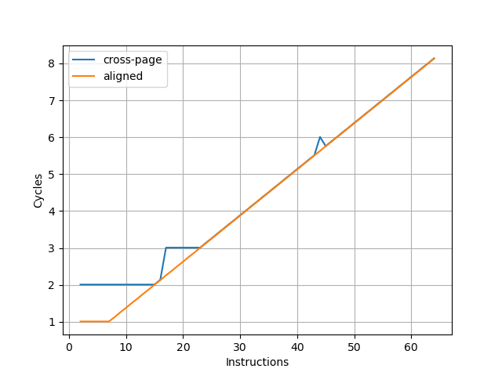
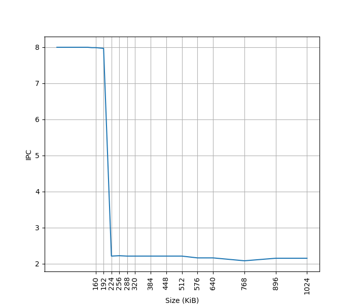
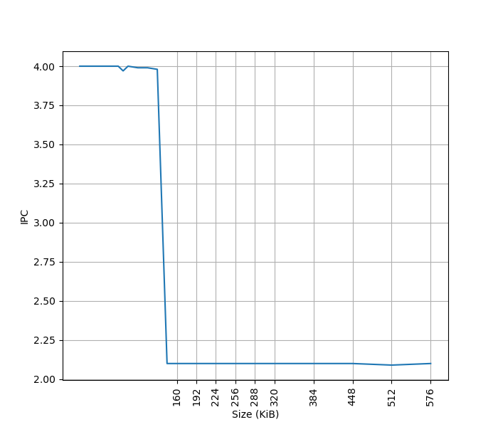

# Apple M1 微架构评测

## 背景

虽然 Apple M1 已经是 2020 年的处理器，但它对苹果自研芯片来说是一个里程碑，考虑到 X Elite 处理器的 Oryon 微架构和 Apple M1 性能核 Firestorm 微架构的相似性，还是测试一下这个 Firestorm+Icestorm 微架构在各个方面的表现。

<!-- more -->

## 官方信息

Apple M1 的官方信息乏善可陈，关于微架构的信息几乎为零，但能从操作系统汇报的硬件信息中找到一些内容。

## 现有评测

网上已经有较多针对 Apple M1 微架构的评测和分析，建议阅读：

- [Apple Microarchitecture Research by Dougall Johnson](https://dougallj.github.io/applecpu/firestorm.html)
- [Apple Announces The Apple Silicon M1: Ditching x86 - What to Expect, Based on A14 - Anandtech](https://www.anandtech.com/show/16226/apple-silicon-m1-a14-deep-dive)
- [Exploration of Apple CPUs](https://github.com/name99-org/AArch64-Explore)
- [Apple M1 Icestorm 微架构评测（上）:重铸小核荣光](https://zhuanlan.zhihu.com/p/611213899)
- [Apple M1 Icestorm 微架构（下）:重铸小核荣光](https://zhuanlan.zhihu.com/p/613097964)
- [苹果的黑魔法？Apple M1 的栈操作消除（上）](https://zhuanlan.zhihu.com/p/595582920)
- [苹果的黑魔法？（下）Apple M1 的栈操作消除](https://zhuanlan.zhihu.com/p/600349467)
- [Apple Firestorm/Icestorm CPU microarchitecture docs](https://github.com/dougallj/applecpu)
- [The 2020 Mac Mini Unleashed: Putting Apple Silicon M1 To The Test](https://www.anandtech.com/show/16252/mac-mini-apple-m1-tested)
- [Exploration of Apple CPUs](https://github.com/name99-org/AArch64-Explore)

下面分各个模块分别记录官方提供的信息，以及实测的结果。读者可以对照已有的第三方评测理解。官方信息与实测结果一致的数据会加粗。

## Benchmark

Apple Firestorm 的性能测试结果见 [SPEC](../../../benchmark.md)。Apple Icestorm 尚未进行性能测试。

## 前端

### 取指

为了测试实际的 Fetch 宽度，参考 [如何测量真正的取指带宽（I-fetch width） - JamesAslan](https://zhuanlan.zhihu.com/p/720136752) 构造了测试。其原理是当 Fetch 要跨页的时候，由于两个相邻页可能映射到不同的物理地址，如果要支持单周期跨页取指，需要查询两次 ITLB，或者 ITLB 需要把相邻两个页的映射存在一起。这个场景一般比较少，处理器很少会针对这种特殊情况做优化，但也不是没有。经过测试，把循环放在两个页的边界上，发现 Firestorm 微架构遇到跨页的取指时确实会拆成两个周期来进行。在此基础上，构造一个循环，循环的第一条指令放在第一个页的最后四个字节，其余指令放第二个页上，那么每次循环的取指时间，就是一个周期（读取第一个页内的指令）加上第二个页内指令需要 Fetch 的周期数，多的这一个周期就足以把 Fetch 宽度从后端限制中区分开，实验结果如下：



图中蓝线（cross-page）表示的就是上面所述的第一条指令放一个页，其余指令放第二个页的情况，横坐标是第二个页内的指令数，那么一次循环的指令数等于横坐标 +1。纵坐标是运行很多次循环的总 cycle 数除以循环次数，也就是平均每次循环耗费的周期数。可以看到每 16 条指令会多一个周期，因此 Firestorm 的前端取指宽度确实是 16 条指令。为了确认这个瓶颈是由取指造成的，又构造了一组实验，把循环的所有指令都放到一个页中，这个时候 Fetch 不再成为瓶颈（图中 aligned），两个曲线的对比可以明确地得出上述结论。

用相同的方式测试 Icestorm，结果如下：


可以看到每 8 条指令会多一个周期，意味着 Icestorm 的前端取指宽度为 8 条指令。

### L1 ICache

官方信息：通过 sysctl 可以看到，Firestorm 具有 192KB L1 ICache，Icestorm 具有 128KB L1 ICache：

```
hw.perflevel0.l1icachesize: 196608
hw.perflevel1.l1icachesize: 131072
```

为了测试 L1 ICache 容量，构造一个具有巨大指令 footprint 的循环，由大量的 nop 和最后的分支指令组成。观察在不同 footprint 大小下的 IPC：



可以看到 footprint 在 192 KB 之前时可以达到 8 IPC，之后则快速降到 2.22 IPC，这里的 192 KB 就对应了 Firestorm 的 L1 ICache 的容量。虽然 Fetch 可以每周期 16 条指令，也就是一条 64B 的缓存行，由于后端的限制，只能观察到 8 的 IPC。

用相同的方式测试 Icestorm，结果如下：



可以看到 footprint 在 128 KB 之前时可以达到 4 IPC，之后则快速降到 2.10 IPC，这里的 128 KB 就对应了 Icestorm 的 L1 ICache 的容量。虽然 Fetch 可以每周期 8 条指令，由于后端的限制，只能观察到 4 的 IPC。

### L1 ITLB

### Decode

### Return Stack

### Branch Predictor

### BTB

### Branch Mispredict Latency

## 后端

### 物理寄存器堆

### Reservation Stations

### 执行单元

### Reorder Buffer

### Load Store Unit + L1 DCache

#### L1 DCache 容量

官方信息：通过 sysctl 可以看到，Firestorm 具有 128KB L1 DCache，Icestorm 具有 64KB L1 DCache：

```
hw.perflevel0.l1dcachesize: 131072
hw.perflevel1.l1dcachesize: 65536
```

#### L1 DTLB 容量

#### Load/Store 带宽

#### L1 DCache 分 Bank

#### VIPT

#### Memory Dependency Predictor

#### Store to Load Forwarding

#### Load to use latency

### MMU

### L2 Cache

官方信息：通过 sysctl 可以看到，Firestorm 具有 12MB L2 Cache，Icestorm 具有 4MB L2 Cache：

```
hw.perflevel0.l2cachesize: 12582912
hw.perflevel1.l2cachesize: 4194304
```

### Memory
