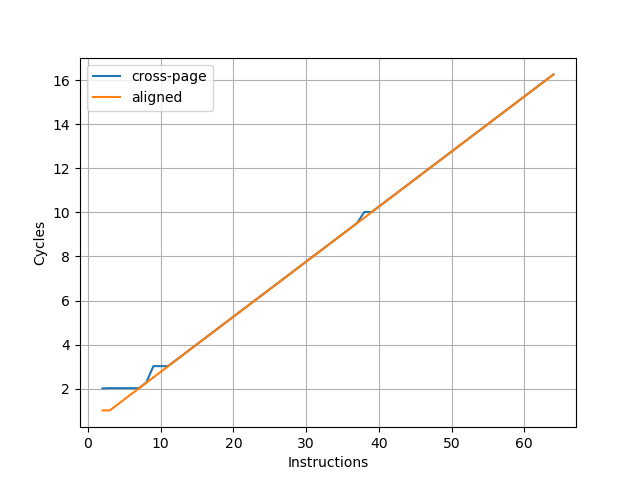
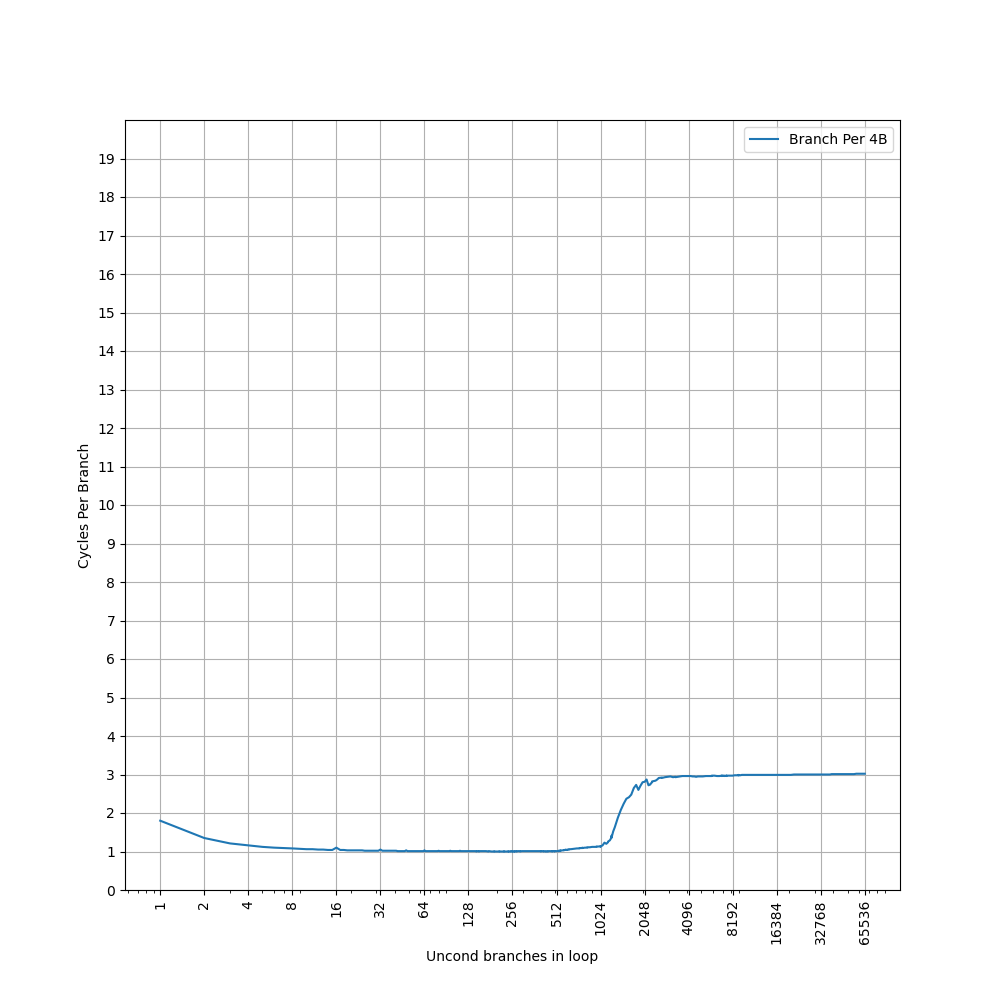

# Apple M1 微架构评测

## 背景

虽然 Apple M1 已经是 2020 年的处理器，但它对苹果自研芯片来说是一个里程碑，考虑到 X Elite 处理器的 Oryon 微架构和 Apple M1 性能核 Firestorm 微架构的相似性，还是测试一下这个 Firestorm + Icestorm 微架构在各个方面的表现。

<!-- more -->

## 官方信息

Apple M1 的官方信息乏善可陈，关于微架构的信息几乎为零，但能从操作系统汇报的硬件信息中找到一些内容。

## 现有评测

网上已经有较多针对 Apple M1 微架构的评测和分析，建议阅读：

- [Apple Microarchitecture Research by Dougall Johnson](https://dougallj.github.io/applecpu/firestorm.html)
- [Apple Announces The Apple Silicon M1: Ditching x86 - What to Expect, Based on A14 - Anandtech](https://www.anandtech.com/show/16226/apple-silicon-m1-a14-deep-dive)
- [Exploration of Apple CPUs](https://github.com/name99-org/AArch64-Explore)
- [Apple M1 Icestorm 微架构评测（上）:重铸小核荣光](https://zhuanlan.zhihu.com/p/611213899)
- [Apple M1 Icestorm 微架构（下）:重铸小核荣光](https://zhuanlan.zhihu.com/p/613097964)
- [苹果的黑魔法？Apple M1 的栈操作消除（上）](https://zhuanlan.zhihu.com/p/595582920)
- [苹果的黑魔法？（下）Apple M1 的栈操作消除](https://zhuanlan.zhihu.com/p/600349467)
- [Apple Firestorm/Icestorm CPU microarchitecture docs](https://github.com/dougallj/applecpu)
- [The 2020 Mac Mini Unleashed: Putting Apple Silicon M1 To The Test](https://www.anandtech.com/show/16252/mac-mini-apple-m1-tested)
- [Exploration of Apple CPUs](https://github.com/name99-org/AArch64-Explore)

下面分各个模块分别记录官方提供的信息，以及实测的结果。读者可以对照已有的第三方评测理解。官方信息与实测结果一致的数据会加粗。

## Benchmark

Apple Firestorm 的性能测试结果见 [SPEC](../../../benchmark.md)。Apple Icestorm 尚未进行性能测试。

## 前端

### 取指

为了测试实际的 Fetch 宽度，参考 [如何测量真正的取指带宽（I-fetch width） - JamesAslan](https://zhuanlan.zhihu.com/p/720136752) 构造了测试。其原理是当 Fetch 要跨页的时候，由于两个相邻页可能映射到不同的物理地址，如果要支持单周期跨页取指，需要查询两次 ITLB，或者 ITLB 需要把相邻两个页的映射存在一起。这个场景一般比较少，处理器很少会针对这种特殊情况做优化，但也不是没有。经过测试，把循环放在两个页的边界上，发现 Firestorm 微架构遇到跨页的取指时确实会拆成两个周期来进行。在此基础上，构造一个循环，循环的第一条指令放在第一个页的最后四个字节，其余指令放第二个页上，那么每次循环的取指时间，就是一个周期（读取第一个页内的指令）加上第二个页内指令需要 Fetch 的周期数，多的这一个周期就足以把 Fetch 宽度从后端限制中区分开，实验结果如下：


图中蓝线（cross-page）表示的就是上面所述的第一条指令放一个页，其余指令放第二个页的情况，横坐标是第二个页内的指令数，那么一次循环的指令数等于横坐标 +1。纵坐标是运行很多次循环的总 cycle 数除以循环次数，也就是平均每次循环耗费的周期数。可以看到每 16 条指令会多一个周期，因此 Firestorm 的前端取指宽度确实是 16 条指令。为了确认这个瓶颈是由取指造成的，又构造了一组实验，把循环的所有指令都放到一个页中，这个时候 Fetch 不再成为瓶颈（图中 aligned），两个曲线的对比可以明确地得出上述结论。

用相同的方式测试 Icestorm，结果如下：



可以看到每 8 条指令会多一个周期，意味着 Icestorm 的前端取指宽度为 8 条指令。

### L1 ICache

官方信息：通过 sysctl 可以看到，Firestorm 具有 192KB L1 ICache，Icestorm 具有 128KB L1 ICache：

```
hw.perflevel0.l1icachesize: 196608
hw.perflevel1.l1icachesize: 131072
```

为了测试 L1 ICache 容量，构造一个具有巨大指令 footprint 的循环，由大量的 nop 和最后的分支指令组成。观察在不同 footprint 大小下 Firestorm 的 IPC：


可以看到 footprint 在 192 KB 之前时可以达到 8 IPC，之后则快速降到 2.22 IPC，这里的 192 KB 就对应了 Firestorm 的 L1 ICache 的容量。虽然 Fetch 可以每周期 16 条指令，也就是一条 64B 的缓存行，由于后端的限制，只能观察到 8 的 IPC。

用相同的方式测试 Icestorm，结果如下：


可以看到 footprint 在 128 KB 之前时可以达到 4 IPC，之后则快速降到 2.10 IPC，这里的 128 KB 就对应了 Icestorm 的 L1 ICache 的容量。虽然 Fetch 可以每周期 8 条指令，由于后端的限制，只能观察到 4 的 IPC。

### BTB

#### Firestorm

构造大量的无条件分支指令（B 指令），BTB 需要记录这些指令的目的地址，那么如果分支数量超过了 BTB 的容量，性能会出现明显下降。当把大量 B 指令紧密放置，也就是每 4 字节一条 B 指令时：


可见在 1024 个分支之内可以达到 1 的 CPI，超过 1024 个分支，出现了 3 CPI 的平台，一直延续到 49152 个分支。超出 BTB 容量以后，分支预测时，无法从 BTB 中得到哪些指令是分支指令的信息，只能等到取指甚至译码后才能后知后觉地发现这是一条分支指令，这样就出现了性能损失，出现了 3 CPI 的情况。第二个拐点 49152，对应的是指令 footprint 超出 L1 ICache 的情况：L1 ICache 是 192KB，按照每 4 字节一个 B 指令计算，最多可以存放 49152 条 B 指令。

降低分支指令的密度，在 B 指令之间插入 NOP 指令，使得每 8 个字节有一条 B 指令，得到如下结果：


可以看到 CPI=1 的拐点前移到 1024 个分支，同时 CPI=3 的平台的拐点也前移到了 24576。拐点的前移，意味着 BTB 采用了组相连的结构，当 B 指令的 PC 的部分低位总是为 0 时，组相连的 Index 可能无法取到所有的 Set，导致表现出来的 BTB 容量只有部分 Set，例如此处容量减半，说明只有一半的 Set 被用到了。

如果进一步降低 B 指令的密度，使得它的低若干位都等于 0，最终 CPI=1 的拐点定格在 2 条分支，此时分支的间距大于或等于 2048B；CPI=3 的拐点定格在 6 条分支，此时分支的间距大于或等于 32KB。根据这个信息，可以认为 Firestorm 的 BTB 是 512 Set 2 Way 的结构，Index 是 PC[10:2]；同时也侧面佐证了 192KB L1 ICache 是 512 Set 6 Way，Index 是 PC[14:6]。

#### Icestorm

用相同的方式测试 Icestorm，首先用 4B 的间距：



可以看到 1024 的拐点，1024 之前是 1 IPC，之后增加到 3 IPC。比较奇怪的是，没有看到第二个拐点，第二个拐点在 8B 的间距下显现：


第一个拐点前移到 512，第二个拐点出现在 16384，而 Icestorm 的 L1 ICache 容量是 128KB，8B 间距下正好可以保存 16384 个分支。

用 16B 间距测试：


第一个拐点前移到 256，然后出现了一个 2 CPI 的新平台，2 CPI 的平台的拐点出现在 2048，第三个拐点出现在 8192，对应 L1 ICache 容量。

用 32B 间距测试：


第一个拐点在 1024，第二个拐点出现在 4096，对应 L1 ICache 容量，没有观察到 2 CPI。

用 64B 间距测试：


第一个拐点在 512，第二个拐点出现在 2048，对应 L1 ICache 容量。

Icestorm 的 BTB 测试结果并不像 Firestorm 那样有规律，根据这个现象，给出一些猜测：

1. 可能只有一级 BTB，但它的 Index 函数进行了一些 Hash 而非直接取 PC 某几位，使得随着分支的间距增大，CPI=1 的拐点并非单调递减；但这无法解释为何 16B 间距时会出现 2 CPI 的平台
2. 可能有两级 BTB，它们并非简单地级联，而是通过不同的组织方式，在不同的区间内发挥作用

针对 4B 间距没有出现 CPI>3 的情况，给出一些猜测：

1. 测试规模不够大，把分支数量继续增大，才能出现 CPI>3 的情况
2. 指令预取器在工作，当 footprint 大于 128KB L1 ICache 时，能提前把指令取进来

### L1 ITLB

构造一系列的 B 指令，使得 B 指令分布在不同的 page 上，使得 ITLB 成为瓶颈，在 Firestorm 上进行测试：


从 1 Cycle 到 3 Cycle 的增加是由于 L1 BTB 的冲突缺失，之后在 192 个页时从 3 Cycle 快速增加到 13 Cycle，则对应了 192 项的 L1 ITLB 容量。

在 Icestorm 上重复实验：


只有一个拐点，在 128 个页时，性能从 1 Cycle 下降到 8 Cycle，意味 L1 ITLB 容量是 128 项。

### Decode

### Return Stack

### Branch Predictor

### Branch Mispredict Latency

## 后端

### 物理寄存器堆

### Reservation Stations

### 执行单元

### Reorder Buffer

### Load Store Unit + L1 DCache

#### L1 DCache 容量

官方信息：通过 sysctl 可以看到，Firestorm 具有 128KB L1 DCache，Icestorm 具有 64KB L1 DCache：

```
hw.perflevel0.l1dcachesize: 131072
hw.perflevel1.l1dcachesize: 65536
```

#### L1 DTLB 容量

#### Load/Store 带宽

#### L1 DCache 分 Bank

#### VIPT

#### Memory Dependency Predictor

#### Store to Load Forwarding

#### Load to use latency

### MMU

### L2 Cache

官方信息：通过 sysctl 可以看到，4 个 Firestorm 核心共享一个 12MB L2 Cache，4 个 Icestorm 核心共享一个 4MB L2 Cache：

```
hw.perflevel0.l2cachesize: 12582912
hw.perflevel0.cpusperl2: 4
hw.perflevel1.l2cachesize: 4194304
hw.perflevel1.cpusperl2: 4
```

### Memory
