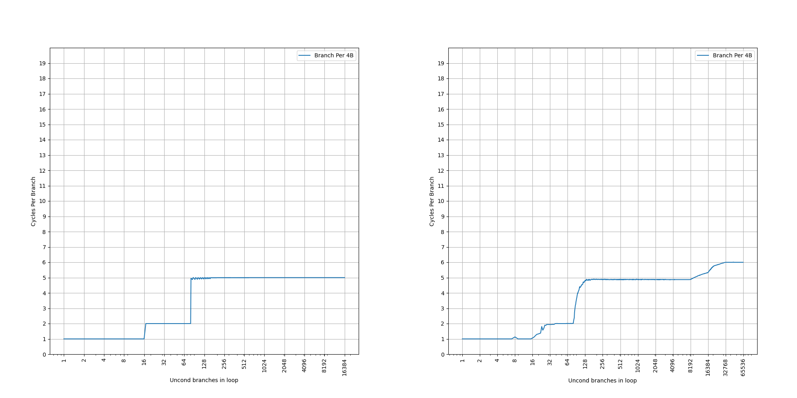
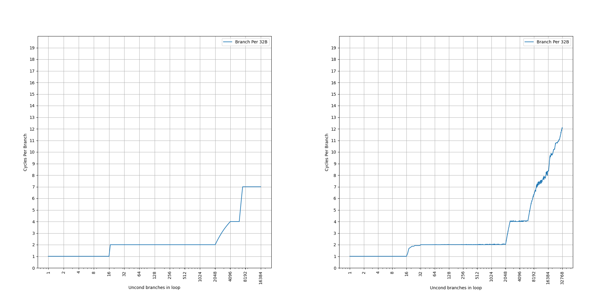

# ARM Neoverse N1 (代号 Ares) 的 BTB 结构分析

## 背景

ARM Neoverse N1 是比较早的一代 ARM 服务器的处理器，它在很多地方都和 Cortex-A76 类似。它的 BTB 结构比较有意思，所以在这里对它的 BTB 做一些分析。

<!-- more -->

## 官方信息

首先收集了一些 ARM Neoverse N1 的 BTB 结构的官方信息：

- [Arm Neoverse N2: Arm’s 2nd generation high performance infrastructure CPUs and system IPs](https://hc33.hotchips.org/assets/program/conference/day1/20210818_Hotchips_NeoverseN2.pdf) 中对 Neoverse N1 的介绍：
    - Branch Prediction Width: 8 instrs
    - Nano BTB (0 cyc taken-branch bubble): 16 entry
    - Main BTB: 6K entry
- [The Arm Neoverse N1 Platform: Building Blocks for the Next-Gen Cloud-to-Edge Infrastructure SoC](https://www.arm.com/-/media/global/solutions/infrastructure/arm-neoverse-n1-platform.pdf) 的介绍：
    - 6K entry Main BTB, 3 cycle access latency
    - 64-entry Micro BTB
    - 16-entry Nano BTB
    - 4-way set associative 64KB L1 ICache

简单整理一下官方信息，大概有三级 BTB：

- 16-entry Nano BTB, 1 cycle latency (0 cycle bubble)
- 64-entry Micro BTB
- 6K-entry Main BTB, 3 cycle latency

但是很多细节是缺失的，因此下面结合微架构测试，进一步研究它的内部结构。

## 微架构测试

在之前的博客里，我们已经测试了各种处理器的 BTB，在这里也是一样的：按照一定的 stride 分布无条件直接分支，构成一个链条，然后测量 CPI。

### stride=4B

首先是 stride=4B 的情况：


可以看到，图像上出现了三个比较显著的台阶：

- 第一个台阶到 16 条分支，CPI=1，对应了 16-entry 的 Nano BTB
- 第二个台阶到 80 条分支，CPI=2，其中 `80=16+64`，多出来的部分对应了 64-entry 的 Micro BTB
- 第三个台阶到 8192 条分支，CPI=5，大于 Main BTB 的 3 cycle latency，说明此时没有命中 Main BTB，而是要等到取指和译码后，计算出正确的目的地址再回滚，导致了 5 cycle latency；8192 的性能下降原因还需要进一步研究，16384 的性能下降对应了 64KB 的 ICache，因为 `4B*16384=64KB`

那么 stride=4B 的情况下就遗留了两个问题：为什么没有命中 Main BTB；8192 处为什么出现了性能下降。

### stride=8B

接下来观察 stride=8B 的情况：


可以看到，图像上出现了三个比较显著的台阶：

- 第一个台阶到 16 条分支，CPI=1，对应了 16-entry 的 Nano BTB，和之前一样
- 第二个台阶到 80 条分支，CPI=2，其中 `80=16+64`，多出来的部分对应了 64-entry 的 Micro BTB，和之前一样
- 第三个台阶到 4096 条分支，CPI=2.75，约等于 Main BTB 的 3 cycle latency，说明此时命中的是 Main BTB，但是它并没有达到宣称的 6144-entry 的 Main BTB 容量；8192 还有一个性能下降，这对应了 64KB 的 ICache：`8B*8192=64KB`

相比 stride=4B，Nano BTB 和 Micro BTB 的行为没有变化；而 Main BTB 开始能够命中，这代表 Main BTB 在分支特别密集的情况下，会出现性能问题。

那么 stride=8B 的情况下遗留了两个问题：为什么 CPI=2.75 而不是 3？为什么只观察到了 4K 的 Main BTB 容量，而不是 6K？

### stride=16B

继续观察 stride=16B 的情况：


可以看到，图像上出现了四个比较显著的台阶：

- 第一个台阶到 16 条分支，CPI=1，对应了 16-entry 的 Nano BTB，和之前一样
- 第二个台阶到 80 条分支，CPI=2，其中 `80=16+64`，多出来的部分对应了 64-entry 的 Micro BTB，和之前一样
- 第三个台阶到 4096 条分支，CPI=2.5，比 Main BTB 的 3 cycle latency 略小，但是大于 2，说明此时命中的是 Main BTB，此时遇到了 64KB ICache 的瓶颈：`4096*16B=64KB`
- 第四个台阶到 6144 条分支，CPI=3.5，比 Main BTB 的 3 cycle latency 略大，是因为 64KB ICache 出现了缺失，但这个时候终于显现了宣传的 Main BTB 的 6144 的容量

相比 stride=8B，Nano BTB 和 Micro BTB 的行为没有变化；Main BTB 的 6144 容量开始显现，并且出现地比 64KB ICache 更晚。

那么 stride=16B 的情况下遗留了一个问题：为什么出现了 CPI=2.5 的平台？

### stride=32B

继续观察 stride=32B 的情况：


可以看到，图像上出现了三个比较显著的台阶：

- 第一个台阶到 16 条分支，CPI=1，对应了 16-entry 的 Nano BTB，和之前一样
- 第二个台阶到 2048 条分支，CPI=2，此时遇到了 64KB ICache 的瓶颈：`2048*32B=64KB`，但是这个时候已经超出了 Micro BTB 的容量，而 Main BTB 有 3 cycle 的 latency，为何还能保持 CPI=2 呢
- 第三个台阶到 6144 条分支，CPI=4，比 Main BTB 的 3 cycle latency 略大，是因为 64KB ICache 出现了缺失，显现的是宣传的 Main BTB 的 6144 的容量，更加说明第二个台阶内 Main BTB 是命中的

那么 stride=32B 的情况下遗留了一个问题：为什么在 Main BTB 的范围内出现了 CPI=2 的平台？

### stride=64B

继续观察 stride=64B 的情况：


可以看到，图像上出现了三个比较显著的台阶：

- 第一个台阶到 16 条分支，CPI=1，对应了 16-entry 的 Nano BTB，和之前一样
- 第二个台阶到 1024 条分支，CPI=2，此时遇到了 64KB ICache 的瓶颈：`1024*64B=64KB`，和之前一样
- 第三个台阶到 3122 条分支，CPI=6，比 Main BTB 的 3 cycle latency 大，是因为 64KB ICache 出现了缺失，此时 Main BTB 的容量砍半

stride=64B 相比 stride=32B 的 Main BTB 容量砍半，这是组相连的表现：如果 PC[5] 在组相连的 index 当中，那么当 stride=64B 时，PC[5] 恒等于 0，意味着只有一半的 set 可以被用到，那也就只有一半的容量了。

Nano BTB 和 Micro BTB 容量没有变小，意味着它们大概率是全相连的：这也和它们的大小相吻合。

那么 stride=64B 的情况下遗留的问题和 stride=32B 一样：为什么在 Main BTB 的范围内出现了 CPI=2 的平台？

### stride=128B

继续观察 stride=128B 的情况：


可以看到，图像上出现了三个比较显著的台阶：

- 第一个台阶到 16 条分支，CPI=1，对应了 16-entry 的 Nano BTB，和之前一样
- 第二个台阶到 512 条分支，CPI=2，此时遇到了 64KB ICache 的瓶颈：`512*128B=64KB`，和之前一样
- 第三个台阶到 1536 条分支，CPI=6.x，比 Main BTB 的 3 cycle latency 大，是因为 64KB ICache 出现了缺失，此时 Main BTB 的容量进一步砍半

stride=128B 相比 stride=64B 的 Main BTB 容量进一步砍半，也是组相连的表现，意味着 PC[6] 也在组相连的 idnex 当中，只有四分之一的 set 可以被用到。

那么 stride=128B 的情况下遗留的问题和 stride=32B 一样：为什么在 Main BTB 的范围内出现了 CPI=2 的平台？

### 小结

测试到这里就差不多了，更大的 stride 得到的也是类似的结果，总结一下前面的发现：

- Nano BTB 是 16-entry，1 cycle latency，不随着 stride 变化
- Micro BTB 是 64-entry，2 cycle latency，也不随着 stride 变化
- Main BTB 是 6K-entry，3 cycle latency，容量随着 stride 变化，大概率是 PC[n:5] 这一段被用于 index，使得 stride=64B 开始容量不断减半
- 64KB ICache 很多时候会比 Main BTB 更早成为瓶颈

也总结一下前面发现了各种没有解释的遗留问题：

- stride=4B 的情况下，Main BTB 没有像预期那样工作：解释见后
- stride=4B 的情况下，8192 条分支处出现了性能下降：暂无解释
- stride=8B 的情况下，只观察到 4096 的 Main BTB 容量，而不是 6144：解释见后
- stride=8B 的情况下，在 Main BTB 命中的范围内，CPI=2.75：解释见后
- stride=16B 的情况下，在 Main BTB 命中的范围内，CPI=2.5：解释见后
- stride=32B 或 64B 或 128B 的情况下，在 Main BTB 命中的范围内，CPI=2：解释见后

接下来尝试解析一下这些遗留问题背后的原理。部分遗留问题，并没有被解释出来，欢迎读者提出猜想。

## 解析遗留问题

### stride=4B 的情况下，Main BTB 没有像预期那样工作

对于这种类似 Cache 的结构，当它看起来总是没有命中的时候，其实就是每一个 Set 内要访问的数据超出了 Way，导致每次新访问的都会缺失。上面分析到，Main BTB 的 Index 大概是 PC[n:5] 这一段，那么一个对齐的 32B 范围内，分支指令都会被映射到同一个 set 内。当 stride=4B 的时候，对齐的 32B 范围内有 8 条指令；而 stride=8B 的时候，只有 4 条指令。8 条指令不行，4 条指令可以，暗示了中间跨越了 Way 的数量。

首先来回顾一下 Main BTB 的 6144-entry 是怎么来的：虽然它没说是几路组相连，但因为 6144 有一个 3 的因子，它不是二的幂次，所以一定是在 Way 数量上产生的。这就导致了至少这样几种可能：

- 3-way set associative, 2048 sets
- 6-way set associative, 1024 sets
- 12-way set associative, 512 sets

回顾前面的分析：4 条指令没有超过 Way 数量，8 条指令超过了，那么只能是上述可能里的 6-way set associative，1024 sets 的情况。

翻阅 [Arm® Neoverse™ N1 Core Technical Reference Manual](https://developer.arm.com/documentation/100616/latest/)，它是这么说的：

L1 BTB data location encoding:

- `[31:24]`: RAMID = 0x02
- `[23:20]`: Reserved
- `[19:18]`: Way
- `[17:15]`: Reserved
- `[14:5]`: Index `[14:5]`
- `[4:0]`: Reserved

它暗示了 L1 BTB（也就是 Main BTB）的 Index 是 PC[14:5]，这和我们之前的观察一致。这样算出来有 `2^(14-5+1)=1024` 个 set，和我们前面的 6-way set associative，1024 sets 的猜测是一致的。

但是，这时候又出现一个问题：`[19:18]` 只能记录两位的 Way 编号，也就是说不能超过 4 个 Way，但实际上有 6 个 Way。这似乎又出现了矛盾。

继续去阅读文档里对从 BTB 读出来的数据的描述：

L1 BTB cache format:

- Instruction Register 0 [63:0]: Data [63:0]
- Instruction Register 1 [17:0]: Data [81:64]

这暗示了给定一个 Index 和一个 Way，可以读出来 82 bit 的数据，这不太寻常：一个分支的信息，通常不需要这么多 bit 的数据。一个 BTB Entry，通常需要这些信息：

- valid
- branch type: conditional or unconditional, direct or indirect, call or return, etc.
- tag
- replacement policy
- part of target address

除非保存了完整的 target address 和 tag，是达不到 82 bit 这么多的。但是这样又显得很浪费，可能还有其他的可能写。

考虑到上面出现的两位的 Way 编号，并且有 3 的素数因子，只能是 3-way 组相连了。如果按 3-way 组相连，1024 个 set 来算，只有 3072 个 entry，距离 Main BTB 的容量 6144 个 entry 刚好只有一半。一个想法诞生了：如果一个 BTB entry 可以保存两个分支的信息呢？82 bit 正好是 2 的倍数，除以二是 41 bit，每个分支存 41 bit 的数据是比较合理的数据。这样，就可以推导出来，它 Main BTB 的组织方式是：

- Index: PC[14:5]，有 1024 个 set
- 3-Way 组相连
- 每个 Entry 是 82 bit，可以记录两条分支的信息

所以 BTB 的 Entry 怎么计算其实会比较复杂，到底是按实际的 Entry 数，还是按分支数，需要深入分析才能理解。

那么，为什么要把两条分支保存在一个 BTB Entry 里呢？Neoverse N1 并没有实现 two taken，似乎并没有放在一起的必要。而且虽然是 3-Way 组相连，匹配的时候还是 6-Way 的，那么这样做的好处是什么呢？

这时候就要提到很多处理器实现的一个优化了：大多数分支，它的目的地址距离它自己是很短的，即使考虑指令支持的最大范围，比如 AArch64 指令里面，B 指令的立即数是 26 位，B.cond 和 CBNZ 的立即数是 19 位，也比完整的虚拟地址空间小很多。针对多数的跳转距离比较短的分支，可以用一个更压缩的表示来保存，使得 BTB 可以保存更多的分支；同时，也保留针对跳转距离比较长的分支的支持。这和前面的这个设计就对上了：对于跳转距离短的分支，每 41 bit 可以保存一条分支的信息；对于跳转距离远的分支，再用 82 bit 来保存一条分支的信息。从另外一个角度来说，41 bit 也确实保存不下完整的虚拟地址，所以需要有一个方案给跳转距离远的分支兜底。

那么如果跳转距离比较远，Main BTB 的容量将会只有一半。感兴趣的读者可以设计实验来验证这一点。

小结：Main BTB 是 1024 set，3 way set associative 的结构，一共 3072 个 entry，每个 entry 可以保存两条分支，Index 是 PC[14:5]。stride=4B 的情况下，会出现一个 set 内 8 条分支的情况，无法在 3 个 entry 内放下，所以总是会出现缺失。

### stride=8B 的情况下，只观察到 4096 的 Main BTB 容量，而不是 6144

在 stride=8B 的情况下，只观察到 4096 的 Main BTB 容量，实际上，用刚才分析的 Main BTB 结构，就可以分析出来。

首先，这个测试的构造方法是，给定分支数和 stride，按照这个 stride 在连续的一段虚拟地址上分布这些分支。以 stride=8B 为例，那么分支 i 的地址就是 `8*i`（实际情况下高位不是 0，但是所有的分支的高位是相同的，例如 `0x100000000+8*i`，但这不影响分析）。我们来观察一下前几个分支的信息：

- Branch 0: addr=0x00, index=0
- Branch 1: addr=0x08, index=0
- Branch 2: addr=0x10, index=0
- Branch 3: addr=0x18, index=0
- Branch 4: addr=0x20, index=1

可以看到从分支 5 开始，到了一个新的 set，第一个 set 内出现了 4 条分支，小于一个 set 内可以保存的最多 6 条分支。接下来看从分支 4096 开始的几个分支：

- Branch 4096: addr=0x8000, index=0
- Branch 4097: addr=0x8008, index=0
- Branch 4098: addr=0x8010, index=0
- Branch 4099: addr=0x8018, index=0
- Branch 4100: addr=0x8020, index=1

可以看到，index=0 这个 set 出现了 8 个 Branch：Branch 0-3 和 Branch 4096-4099，已经大于一个 set 内可以保存的最多 6 条分支。虽然 Main BTB 容量是 6144，但由于分支的排布方式，会首先在一个 set 里出现溢出。然后随着分支继续增加，产生溢出的 set 的比例逐渐上升，直到 8192 条分支的时候，每个 set 都完全溢出了。此时也恰好遇到了 64KB ICache 的瓶颈，如果 ICache 更大，应该会在 8192 的地方观察到一个平台，此时 Main BTB 完全缺失。

继续增加 stride，就没有了这个问题。以 stride=16B 为例子，Branch i 地址是 `i*16`，那么这些分支的地址是：

- Branch 0: addr=0x00, index=0
- Branch 1: addr=0x10, index=0
- Branch 2: addr=0x20, index=1
- Branch 3: addr=0x30, index=1
- ... 
- Branch 2048: addr=0x8000, index=0
- Branch 2049: addr=0x8010, index=0
- Branch 2050: addr=0x8020, index=1
- Branch 2051: addr=0x8030, index=1
- ... 
- Branch 4096: addr=0x10000, index=0
- Branch 4097: addr=0x10010, index=0
- Branch 4098: addr=0x10020, index=1
- Branch 4099: addr=0x10030, index=1
- ... 
- Branch 6144: addr=0x18000, index=0
- Branch 6145: addr=0x18010, index=0
- Branch 6146: addr=0x18020, index=1
- Branch 6147: addr=0x18030, index=1

这个时候，每个 set 会以两个 branch 的粒度来增加，由于 6 是 2 的倍数，所以从 4096 开始，set 逐渐被填满，会等到 6144 条分支才会产生溢出。

小结：由于 Main BTB 的 Index 是 PC[14:5]，所以在 stride=8B 的情况下，每个 set 内以 4 个 branch 的粒度来增加，会有部分 set 已经出现溢出（只能存 6 个分支，但需要存 8 个分支），而另一部分 set 还没有满的情况（能存 6 个分支，但只存了 4 个分支）。这个拐点就是 4096 条分支。

### stride=8B 的情况下，在 Main BTB 命中的范围内，CPI=2.75；stride=16B 的情况下，在 Main BTB 命中的范围内，CPI=2.5；stride=32B 或 64B 或 128B 的情况下，在 Main BTB 命中的范围内，CPI=2

前面提到，命中 Main BTB 的时候，其实 CPI 并不是 3，而是 2 到 3 之间的一个数，这似乎意味着 Main BTB 并非总是 3 周期提供一个预测。考虑到 Main BTB 容量比较大，很难单周期提供一个预测，猜测 Main BTB 可以两周期或者三周期提供一个预测。那么为什么会在不同的延迟下给出预测结果呢？

首先来分析一下 Main BTB 是如何做预测的：它首先会用传入的 VA 访问 SRAM，得到 3 个 82-bit 的数据，里面最多可以存 6 条分支指令的信息。得到这些数据以后，进行 tag 比较，筛选出其中匹配的部分。如果没有匹配的，或者只有一个匹配的分支，那都好说。但是，如果有多条匹配的分支呢？

例如，这是一个对齐的 32B 块，里面有 8 条 4 字节的指令：

```
0     4     8     12    16    20    24    28  
+-----+-----+-----+-----+-----+-----+-----+-----+
| NOP | NOP | Br  | NOP | NOP | NOP | Br  | NOP |
+-----+-----+-----+-----+-----+-----+-----+-----+
```

假如要从地址 4 处开始执行，那么 Main BTB 应该要得到的是位于地址 8 的分支的信息；假如要从地址 16 处开始执行，那么 Main BTB 应该要得到的是位于地址 24 的分支的信息。为了实现这个事情，硬件上应该：

- 首先找到在同一个 32B 块内的所有分支：通过 tag 比对，找到这个 set 内的在该 32B 内的所有分支
- 接着，找到比输入的 VA **大于或者等于**的**第一个**分支

这个逻辑是比较复杂的，首先要筛选出地址大于或等于输入的 VA 的分支，其次要找到其中 VA 最小的分支。一个思路是保证 BTB 里面的 VA 是排好序的，但是硬件上排序并不好做，而且即使排序了，也需要做类似二分搜索的事情。另一个思路就是不管顺序，用组合逻辑把所有可能性都考虑到，计算出要找的分支。

但是这个组合逻辑比较复杂，本质上就是一个 filter+min 操作，需要比较大的延迟。三个周期能做下来，但是两个周期内，就做不下这么复杂的组合逻辑了。那怎么办呢？

观察一下 CPI 比 3 小的情况：

- stride=8B 的 CPI=2.75
- stride=16B 的 CPI=2.5
- stride=32B 或 64B 或 128B 的 CPI=2

可以看到，随着 stride 增加，CPI 逐渐减少，到 stride=32B 的时候，能够稳定地达到 CPI=2 的情况。设想 Main BTB 有一个 2 周期出结果的 fast path，那么它此时可以稳定地触发；而 stride=16B 只有一半的时候可以触发 fast path：`0.5*2+0.5*3=2.5`；stride=8B 只有四分之一的时候可以触发 fast path：`0.25*2+0.75*3=2.75`。这样这些 CPI 都说得通了，其实就是有多大的概率能够触发 fast path。那么 fast path 生效的比例是：

- stride=8B 有四分之一的概率走 fast path
- stride=16B 有二分之一的概率走 fast path
- stride=32B 或 64B 或 128B 一定可以走 fast path

此时你可能已经发现了一些规律：`32/4=8`，然后 `32/2=16`。也就是说，当对齐的 32B 块里，有四条分支的时候，平均只有一条分支可以走 fast path；有两条分支的时候，平均也是一条分支可以走 fast path；只有一条分支的时候，它总是可以走 fast path。

再回想一下前面的匹配逻辑：

1. 找到该 32B 块内所有的分支：这一步免不了
2. 找到大于或等于输入 VA 地址的所有分支：这一步也免不了
3. 找到第一个满足要求的分支：如果只有一条分支，那就不用寻找最小值了，这就是 fast path 的条件

这就解释了前面的现象：当 stride=8B 的时候，对齐的 32B 块内部是：

```
0     4     8     12    16    20    24    28  
+-----+-----+-----+-----+-----+-----+-----+-----+
| Br  | NOP | Br  | NOP | Br  | NOP | Br  | NOP |
+-----+-----+-----+-----+-----+-----+-----+-----+
```

分支预测的时候，用的地址分别是 0、8、16 和 24。当用 0、8 和 16 的输入 VA 查询的时候，分别能找到 4、3 和 2 条 VA 大于或等于输入 VA 的分支。只有在用 24 的输入 VA 查询的时候，只能找到一条分支，不需要再求 min。

stride=16B 的情况类似，在预测第二条分支的时候，只有一条分支满足要求，可以走 fast path。

stride=32B 或更大的时候，对齐的 32B 块内都只有一条分支，满足走 fast path 的条件。

这就解释了前面看到的各种奇怪的 CPI 现象。

那么，为什么只有 Main BTB 会出现这种现象呢，理论上来说，Nano BTB 和 Micro BTB 也可以做类似的优化？这就涉及到了 BTB 的不同的组织方式：

1. 一种是 Main BTB 这种，每条分支只保存一份，那么为了找到某个 VA 开始的第一条分支，就需要把满足要求的分支都找出来，再寻找地址最小的那一个；具体实现上，也有两种情况：
    1. 对于每个可能出现分支指令的地址，都进行一次 BTB 查询（这种结构叫 Instruction BTB）
    2. 对于每个对齐的块，记录这个块内的有限条分支的信息（这种结构叫 Region BTB），Main BTB 采用的就是这种，每个对齐的 32B 块内最多保存六条分支
2. 另一种结构，则是直接记录从某个 VA 开始的第一条分支，即给定 VA，查询 BTB 后，匹配到的 entry 里记录的就是从这个 VA 开始的第一条分支（这种结构叫做 Block BTB）；这样一条分支可能会出现在多个 entry 内，此时就不会涉及到上面所述的 fast path 优化

详细的 BTB 设计分析，可以参考 [浅谈乱序执行 CPU（三：前端）](./brief-into-ooo-3.md) 的相关内容。

小结：Main BTB 可以在 2 或 3 周期提供预测，其中 2 周期预测的条件是，只找到一条 VA 大于或等于输入 VA 的分支，此时可以跳过求 min 的组合逻辑，在第二个周期给出预测。

## 模拟

既然已经知道了它的 BTB 结构，就写了一段程序来模拟它的工作过程：

```cpp
// Cortex-A76/Neoverse-N1 BTB model
// 16-entry Nano BTB, fully associative, 1 cycle latency.
// 64-entry Micro BTB, fully associative, 2 cycle latency.
// 3072-entry Main BTB, 3-way set associative, 2-3 cycle latency, each entry at
// most 2 branches, index PC[14:5].

#include <cassert>
#include <set>
#include <stdint.h>
#include <stdio.h>
#include <utility>
#include <vector>

struct BTBEntry {
  bool valid;
  uint64_t pc;
  uint64_t target;
};

typedef BTBEntry NanoBTBEntry;
typedef BTBEntry MicroBTBEntry;
typedef BTBEntry MainBTBEntry;

struct BTB {
  NanoBTBEntry nanoBTB[16];
  MicroBTBEntry microBTB[64];
  // pretend as 6-way
  MainBTBEntry mainBTB[1024][6];

  // return latency
  // use pc to predict a branch at pc, i.e. pva = pc
  int match(uint64_t pc, uint64_t target) {
    int result = 5; // miss penalty
    // Nano BTB at P1
    for (int i = 0; i < 16; i++) {
      if (nanoBTB[i].pc == pc && nanoBTB[i].target == target) {
        // Nano BTB hit
        // LRU: move it to head
        for (int j = i; j > 0; j--) {
          nanoBTB[j] = nanoBTB[j - 1];
        }
        nanoBTB[0].pc = pc;
        nanoBTB[0].target = target;
        result = 1;
        goto main_btb;
      }
    }

    // Nano BTB miss, check Micro BTB at P1
    // like victim cache
    for (int i = 0; i < 64; i++) {
      if (microBTB[i].pc == pc && microBTB[i].target == target) {
        // Micro BTB hit
        // Move to Nano BTB
        for (int j = i; j > 0; j--) {
          microBTB[j] = microBTB[j - 1];
        }
        microBTB[0].pc = nanoBTB[16 - 1].pc;
        microBTB[0].target = nanoBTB[16 - 1].target;

        for (int j = 16 - 1; j > 0; j--) {
          nanoBTB[j] = nanoBTB[j - 1];
        }
        nanoBTB[0].pc = pc;
        nanoBTB[0].target = target;
        result = 2;
        goto main_btb;
      }
    }

    // Micro BTB miss
    for (int j = 64 - 1; j > 0; j--) {
      microBTB[j] = microBTB[j - 1];
    }
    microBTB[0].pc = nanoBTB[16 - 1].pc;
    microBTB[0].target = nanoBTB[16 - 1].target;

    for (int j = 16 - 1; j > 0; j--) {
      nanoBTB[j] = nanoBTB[j - 1];
    }
    nanoBTB[0].pc = pc;
    nanoBTB[0].target = target;

  main_btb:
    // check Main BTB
    // PC[4:2]
    uint64_t offset = pc & 0x1c;
    // PC[14:5]
    uint64_t index = (pc & 0x7fe0) >> 5;
    assert(index < 1024);
    // PC[n:15]
    uint64_t tag = pc >> 15;
    uint64_t min_offset = -1;
    int min_i = -1;
    int matches = 0;
    for (int i = 0; i < 6; i++) {
      // find matches
      if ((mainBTB[index][i].pc >> 15) == tag && mainBTB[index][i].valid) {
        // check offset
        if ((mainBTB[index][i].pc & 0x1c) >= offset) {
          if (min_i == -1) {
            min_i = i;
            min_offset = mainBTB[index][i].pc & 0x1c;
          } else if ((mainBTB[index][i].pc & 0x1c) < min_offset) {
            min_i = i;
            min_offset = mainBTB[index][i].pc & 0x1c;
          }
          matches++;
        }
      }
    }

    // hit
    if (min_offset == offset) {
      if (matches != 0) {
        // LRU
        MainBTBEntry temp = mainBTB[index][min_i];
        for (int i = min_i; i > 0; i--) {
          mainBTB[index][i] = mainBTB[index][i - 1];
        }
        mainBTB[index][0] = temp;
      }

      if (matches == 1) {
        // fast path
        if (result == 5) {
          result = 2;
          goto end;
        }
      } else if (matches > 1) {
        // slow path
        if (result == 5) {
          result = 3;
          goto end;
        }
      }
    }

    // miss
    for (int i = 6 - 1; i > 0; i--) {
      mainBTB[index][i] = mainBTB[index][i - 1];
    }
    mainBTB[index][0].pc = pc;
    mainBTB[index][0].target = target;
    mainBTB[index][0].valid = true;

  end:
    // BTB miss
    return result;
  }
};

int main() {
  FILE *fp = fopen("btb_size.csv", "w");
  int min_size = 2;
  int max_size = 8192;
  int max_product = 1048576;
  std::vector<int> mults = {1,  3,  5,  7,  9,  11, 13, 15, 17, 19,
                            21, 23, 25, 27, 29, 31, 33, 35, 37, 39};

  fprintf(fp, "pattern,size,stride,min,avg,max\n");
  for (int stride = 4; stride <= 128; stride *= 2) {
    std::set<int> sizes;
    for (uint64_t size_base = min_size; size_base <= max_product / stride;
         size_base *= 2) {
      for (uint64_t mult : mults) {
        for (uint64_t size = size_base * mult - 1;
             size <= size_base * mult + 1 && size * stride <= max_product &&
             size <= max_size;
             size++) {
          sizes.insert(size);
        }
      }
    }

    for (int size : sizes) {
      BTB btb;
      memset(&btb, 0, sizeof(btb));
      int cycles = 0;
      int branch_count = 1000 * size;
      // warmup
      for (int i = 0; i < branch_count; i++) {
        uint64_t pc = ((i % size) * stride);
        uint64_t target = (((i + 1) % size) * stride);
        btb.match(pc, target);
      }

      // test
      for (int i = 0; i < branch_count; i++) {
        uint64_t pc = ((i % size) * stride);
        uint64_t target = (((i + 1) % size) * stride);
        cycles += btb.match(pc, target);
      }
      float cpi = (float)cycles / branch_count;
      fprintf(fp, "0,%d,%d,%.2f,%.2f,%.2f\n", size, stride, cpi, cpi, cpi);
      fflush(fp);
    }
  }
  return 0;
}
```

这个模型只评估了 BTB 的性能影响，没有考虑 ICache。下面是模拟和实际的对比图，左边是模拟，右边是实际：

stride=4B：



stride=8B：


stride=16B：


stride=32B：



stride=64B：


stride=128B：


可以看到模型和实际的表现是非常一致的。

## 总结

最后总结一下 Neoverse N1 的 BTB：

- 16-entry Nano BTB, fully associative, 1 cycle latency
- 64-entry Micro BTB, fully associative, 2 cycle latency
- 3072-entry Main BTB, 3-way set associative, 2-3 cycle latency, each entry at most 2 branches, index PC[14:5]
