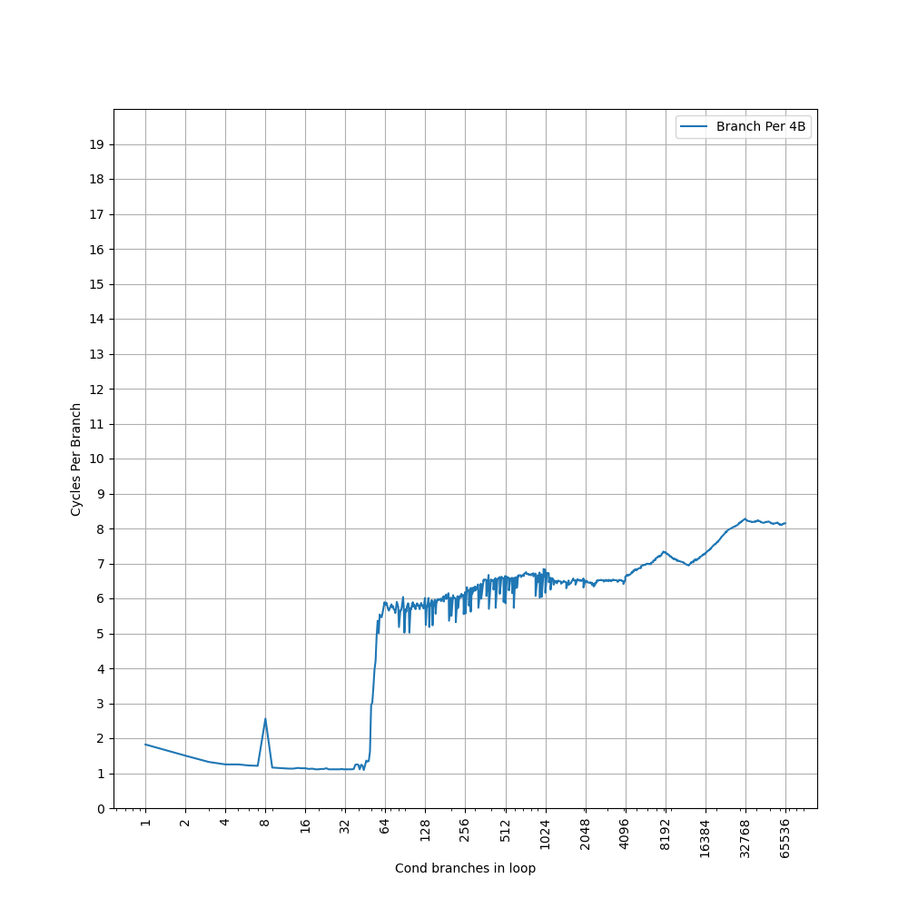
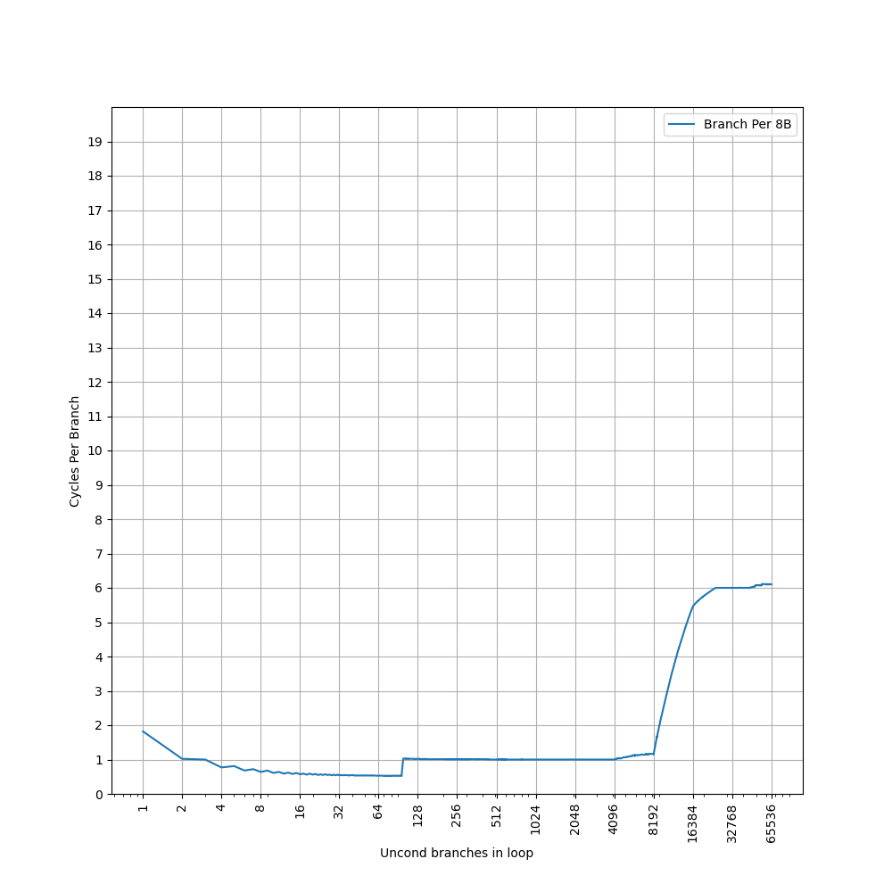
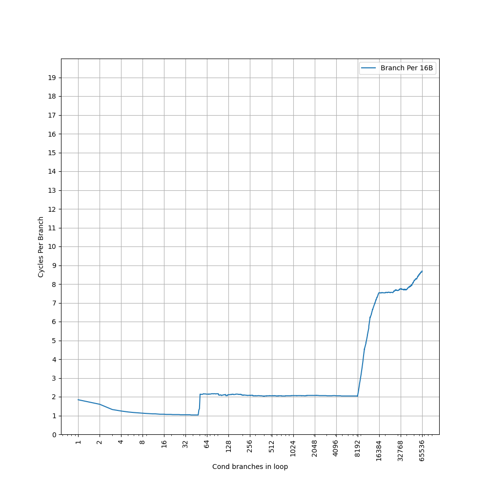
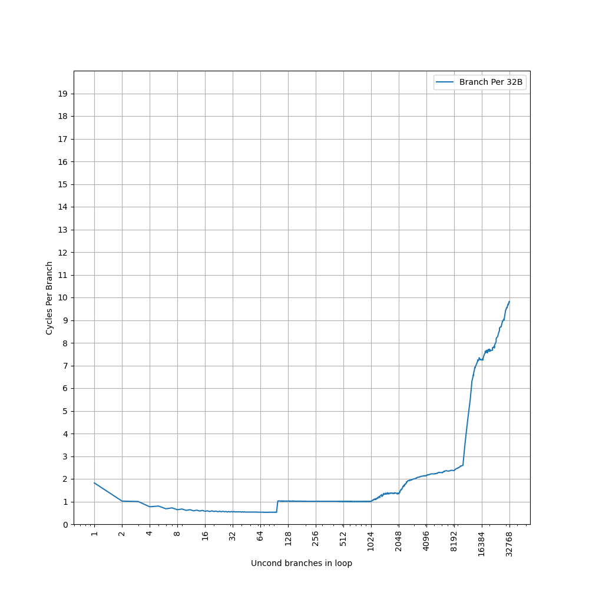
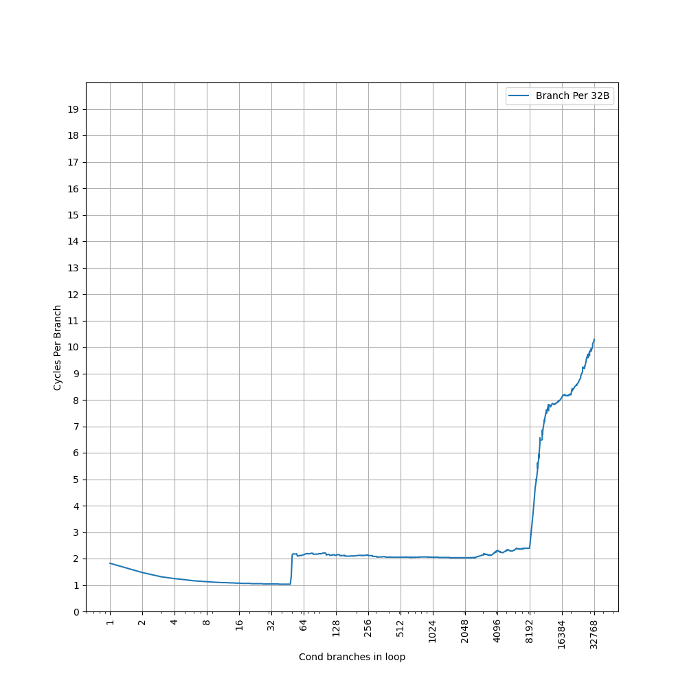
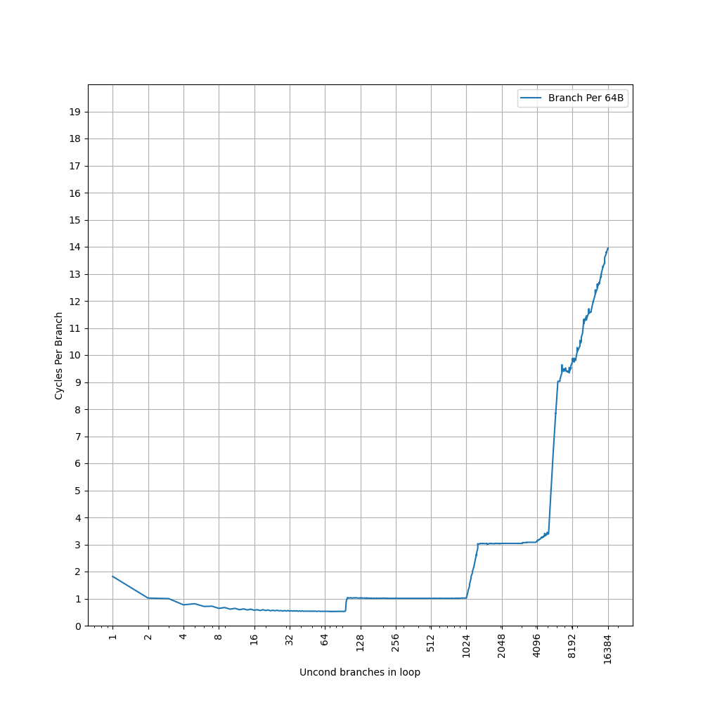
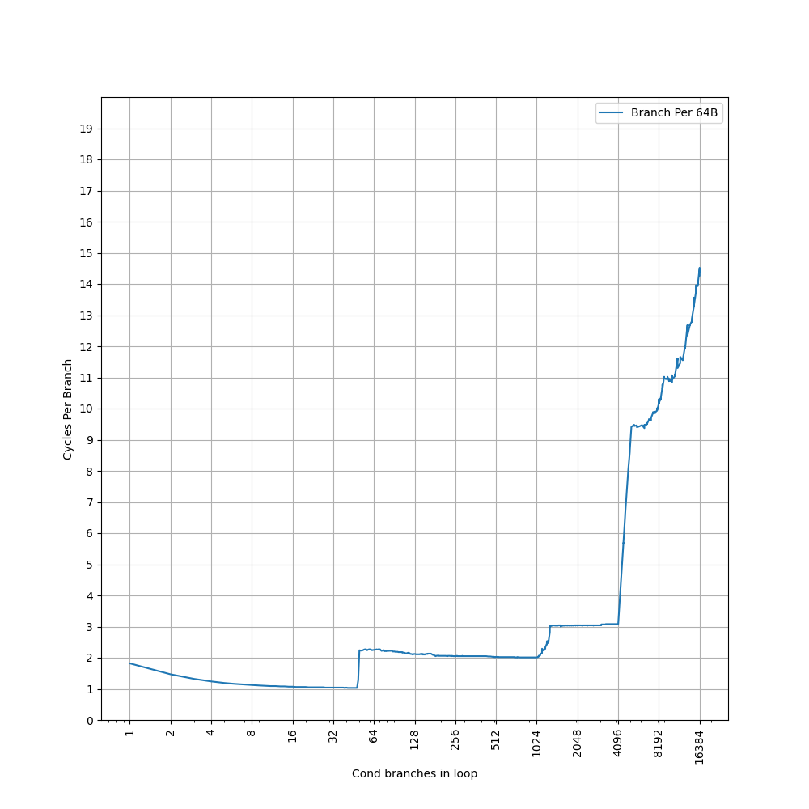

# ARM Neoverse V1 (代号 Zeus) 的 BTB 结构分析

## 背景

ARM Neoverse V1 是 ARM Neoverse N1 的下一代服务器 CPU，在 2020 年发布。此前我们分析过 [Neoverse N1 的 BTB 设计](./arm-neoverse-n1-btb.md)。而 ARM Neoverse V1 在很多地方都和 Cortex-X1 类似，相比 Neoverse N1/Cortex-A76 有了一些改进，在这里对它的 BTB 做一些分析。

<!-- more -->

## 官方信息

首先收集了一些 ARM Neoverse V1 的 BTB 结构的官方信息：

- [SW defined cars: HPC, from the cloud to the dashboard for an amazing driver experience](https://teratec.eu/library/pdf/forum/2021/A05-03.pdf)
    - 64KB L1 ICache, 2x32B bandwidth
    - 8K-entry main BTB
    - 96-entry nano BTB, 0 cycle bubble
    - 2 stage prediction pipeline: P1 & P2，大概率 nano BTB 在 P1，main BTB 在 P2
- [Arm Neoverse V2 platform: Leadership Performance and Power Efficiency for Next-Generation Cloud Computing, ML and HPC Workloads](https://hc2023.hotchips.org/assets/program/conference/day1/CPU1/HC2023.Arm.MagnusBruce.v04.FINAL.pdf)
    - 2 predicted branches per cycle，每周期最多预测两条分支

简单整理一下官方信息，大概有两级 BTB：

- 96-entry nano BTB, 1 cycle latency (0 cycle bubble)
- 8K-entry main BTB
- 2 predicted branches per cycle

但是很多细节是缺失的，因此下面结合微架构测试，进一步研究它的内部结构。

## 微架构测试

在之前的博客里，我们已经测试了各种处理器的 BTB，在这里也是一样的：按照一定的 stride 分布无条件（uncond）或总是跳转的有条件（cond）直接分支，构成一个链条，然后测量 CPI。在先前的 [Neoverse N1 测试](./arm-neoverse-n1-btb.md) 里，我们只测试了无条件分支，但实际上，在 Neoverse N1 上用条件分支测出来的结果也是一样的，但在 Neoverse V1 上就不同了，所以在这里要分开讨论。

### stride=4B uncond

首先是 stride=4B uncond 的情况：


可以看到，图像上出现了如下比较显著的台阶：

- 第一个台阶到接近 64 条分支，CPI=1，对应了 96-entry 的 nano BTB，但是没有体现出完整的 96 的容量
- 第二个台阶到 16384 条分支，CPI 在 5 到 6 之间，大于 main BTB 的 2 cycle latency，说明此时没有命中 main BTB，而是要等到取指和译码后，计算出正确的目的地址再回滚，导致了 5+ cycle latency；16384 对应 64KB L1 ICache 容量

那么 stride=4B uncond 的情况下就遗留了如下问题：

1. nano BTB 没表现出 96 的容量，只表现出接近 64 的容量
2. 没有观察到 2 predicted branches per cycle
3. 没有命中 main BTB

### stride=4B cond

stride=4B cond 的情况：



可以看到，图像上出现了如下比较显著的台阶：

- 第一个台阶到 48 条分支，CPI=1，对应了 96-entry 的 nano BTB，但是没有体现出完整的 96 的容量
- 之后没有明显的分界点，性能波动剧烈，没有观察到 main BTB 的台阶

nano BTB 只表现出 48 的容量，刚好是 96 的一半；同时没有观察到 2 predicted branches per cycle。考虑这两点，可以认为 nano BTB 的组织方式和分支类型有关，当分支过于密集（stride=4B）或者用条件分支（cond）时，不能得到完整的 96-entry 的大小，此时也会回落到 CPI=1 的情况。

那么 stride=4B cond 的情况下就遗留了如下问题：

1. 没有命中 main BTB

### stride=8B uncond

stride=8B uncond 的情况：



可以看到，图像上出现了如下比较显著的台阶：

- 第一个台阶到 96 条分支，CPI=0.5，对应了 96-entry 的 nano BTB，体现了 2 predicted branches per cycle
- 第二个台阶到 8192 条分支，CPI=1，对应 main BTB，此时也对应了 64KB L1 ICache；此外，从 4096 开始有略微的上升

此时 nano BTB 完整地表现出了它的 96-entry 容量，并且实现了 CPI=0.5 的效果。main BTB 也实现了 CPI=1，考虑到它的容量不太可能单周期给出一个分支的结果，大概率是两个周期预测两条分支指令。

那么 stride=8B uncond 的情况下就遗留了如下问题：

1. 从 4096 条分支开始性能有略微的下降

### stride=8B cond

stride=8B cond 的情况：


可以看到，图像上出现了如下比较显著的台阶：

- 第一个台阶到 48 条分支，CPI=1，对应了 96-entry 的 nano BTB，没有 2 predicted branches per cycle，容量也只有 96 的一半
- 第二个台阶到 8192 条分支，CPI=2，对应 main BTB，此时也对应了 64KB L1 ICache

和之前一样，遇到 cond 分支，nano BTB 的容量只有一半，也观察不到 2 predicted branches per cycle。另一边，main BTB 的 CPI 也到了 2，意味着此时 main BTB 也只能两个周期预测一条分支指令，和之前的分析吻合。

那么为什么用条件分支，就不能预测两条分支指令了呢？猜测是，BTB 可以一次给出两条分支的信息，但是没有时间去同时预测这两条分支的方向。所以就回落到了普通的 2 cycle BTB 情况。

### stride=16B uncond

stride=16B uncond 的情况：


可以看到，图像上出现了如下比较显著的台阶：

- 第一个台阶到 96 条分支，CPI=0.5，对应了 96-entry 的 nano BTB，体现了 2 predicted branches per cycle
- 第二个台阶到 2048 条分支，CPI=1；略微上升到 4096，此时是 64KB L1 ICache 的容量；到 8192 出现明显突变，对应 main BTB 容量

那么 stride=16B uncond 的情况下就遗留了如下问题：

1. 从 2048 条分支开始性能有略微的下降

### stride=16B cond

stride=16B cond 的情况：



可以看到，图像上出现了如下比较显著的台阶：

- 第一个台阶到 48 条分支，CPI=1，对应了 96-entry 的 nano BTB，没有 2 predicted branches per cycle，容量也只有 96 的一半
- 第二个台阶到 8192 条分支，CPI=2，对应 main BTB

预测的效果和 stride=8B cond 完全相同。

那么 stride=16B cond 的情况下就遗留了如下问题：

1. 64KB ICache 应该在 4096 条分支导致瓶颈，但是实际没有观察到

### stride=32B uncond

stride=32B uncond 的情况：



可以看到，图像上出现了如下比较显著的台阶：

- 第一个台阶到 96 条分支，CPI=0.5，对应了 96-entry 的 nano BTB，体现了 2 predicted branches per cycle
- 第二个台阶到 1024 条分支，CPI=1；略微上升到 2048，此时是 64KB L1 ICache 的容量；到 8192 右侧出现明显突变

那么 stride=32B uncond 的情况下就遗留了如下问题：

1. 从 1024 条分支开始性能有略微的下降
2. 性能明显下降的点在 8192 右侧，而不是 8192

### stride=32B cond

stride=32B cond 的情况：



可以看到，图像上出现了如下比较显著的台阶：

- 第一个台阶到 48 条分支，CPI=1，对应了 96-entry 的 nano BTB，没有 2 predicted branches per cycle，容量也只有 96 的一半
- 第二个台阶到 2048 条分支，CPI=2，对应 64KB L1 ICache 容量，之后缓慢上升，到 8192 出现性能突变，对应 main BTB 容量

基本符合预期，只是在 stride=16B cond 的基础上，引入了 64KB L1 ICache 导致的性能下降。

### stride=64B uncond

stride=64B uncond 的情况：



可以看到，图像上出现了如下比较显著的台阶：

- 第一个台阶到 96 条分支，CPI=0.5，对应了 96-entry 的 nano BTB，体现了 2 predicted branches per cycle
- 第二个台阶到 1024 条分支，CPI=1，对应 64KB L1 ICache 的容量
- 第三个台阶到 4096，CPI=3，对应 main BTB 的容量；main BTB 容量减半，意味着 main BTB 应当是个组相连结构

### stride=64B cond

stride=64B cond 的情况：



可以看到，图像上出现了如下比较显著的台阶：

- 第一个台阶到 48 条分支，CPI=1，对应了 96-entry 的 nano BTB，没有 2 predicted branches per cycle，容量也只有 96 的一半
- 第二个台阶到 1024 条分支，CPI=2，对应 64KB L1 ICache 容量，之后缓慢上升，到 4096 出现性能突变，对应 main BTB 容量；main BTB 容量只有 8192 的一半，意味着它是组相连结构

### 小结

测试到这里就差不多了，更大的 stride 得到的也是类似的结果，总结一下前面的发现：

- nano BTB 是 96-entry，1 cycle latency，对于 uncond 分支可以做到一次预测两条分支，大小不随着 stride 变化，对应全相连结构
- main BTB 是 8K-entry，2 cycle latency，对于 uncond 分支可以做到一次预测两条分支，此时可以达到 CPI=1；容量随着 stride 变化，对应组相连结构
- 64KB ICache 很多时候会比 main BTB 更早成为瓶颈

也总结一下前面发现了各种没有解释的遗留问题：

- cond 分支情况下，没有 2 predicted branches per cycle，此时两级 BTB 分别可以做到 CPI=1 和 CPI=2，同时 nano BTB 容量减半到 48：解释见后
- stride=4B uncond/cond 的情况下，main BTB 没有像预期那样工作：解释见后
- stride=8B/16B/32B uncond 的情况下，4096/2048/1024 条分支处出现了性能下降：暂无解释
- stride=32B uncond 的情况下，main BTB 导致的拐点应该在 8192，但实际上在 8192 右侧：暂无解释
- stride=16B cond 的情况下，64KB ICache 应该在 4096 条分支导致瓶颈，但是实际没有观察到：暂无解释

接下来尝试解析一下这些遗留问题背后的原理。部分遗留问题，并没有被解释出来，欢迎读者提出猜想。

## 解析遗留问题

### cond 分支情况下，没有 2 predicted branches per cycle，同时 nano BTB 只有 48 的容量

比较相同 stride 下，cond 和 uncond 的情况，可以看到，cond 情况下两级 BTB 的 CPI 都翻倍，这意味着，当遇到全是 cond 分支时，大概是因为条件分支预测器的带宽问题，不能一次性预测两个 cond 分支的方向，而只能预测第一条 cond 分支，那么第二条 cond 分支的信息，即使通过 BTB 读取出来，也不能立即使用，还得等下一次的预测。

为了验证这个猜想，额外做了一组实验：把分支按照 cond, uncond, cond, uncond, ... 的顺序排列，也就是每个 cond 分支的目的地址有一条 uncond 分支。此时测出来的结果，和 uncond 相同，也就是可以做到 2 predicted branches per cycle。此时，BTB 依然一次提供了两条分支的信息，只不过条件分支预测器只预测了第一个 cond 的方向。如果它预测为不跳转，那么下一个 PC 就是 cond 分支的下一条指令；如果它预测为跳转，那么下一个 PC 就是 uncond 分支的目的地址。

nano BTB 的容量减半，意味着 nano BTB 的 96 的容量，实际上是 48 个 entry，每个 entry 最多记录两条分支。考虑到 nano BTB 的容量不随 stride 变化，大概率是全相连，并且是根据第一条分支的地址进行全相连匹配，这样，在 cond + cond 这种情况下，就只能表现出 48 的容量。但是 stride=4B uncond 的情况下表现出介于 48 和 64 之间的容量，还不知道是什么原因。

main BTB 的容量不变，意味着它在 cond + cond 的情况下，会退化为普通的 BTB，此时所有容量都可以用来保存 cond 分支，并且都能匹配到。

那么，具体是怎么做到 2 predicted branches per cycle 呢？猜测在执行的时候，检测这种一个分支的目的地址后，跟着一条 uncond 分支的情况：如果有的话，就把第二条分支的信息，放在第一条分支的信息后面（这在 [Branch Target Buffer Organizations](https://dl.acm.org/doi/pdf/10.1145/3613424.3623774) 中被称为 MB-BTB 结构），单个周期直接从 SRAM 读取出来，然后组成两个 fetch bundle：

- prediction pc -- first branch pc
- first branch target -- second branch pc

然后下一个周期从 second branch target 开始继续预测。根据官方信息，Neoverse V1 的 L1 ICache 支持 2x32B 的带宽，这个 2x 代表了可以从两个不同的地方读取指令，也就是 L1 ICache 至少是双 bank 甚至双端口的 SRAM。考虑到前面的测试中，CPI=0.5 的范围跨越了各种 stride，认为 L1 ICache 是双 bank 的可能写比较小，不然应该会观测到 bank conflict，大概率就是双端口了。

此外，考虑到 fetch bundle 的长度限制，first branch target 到 second branch pc 不能太远。在上面的测试中，这个距离总是 0；读者如果感兴趣，可以尝试把距离拉长，看看超过 32B 以后，是不是会让 2 predicted branches per cycle 失效。类似的表述，在 [AMD Zen 4 Software Optimization Guide](https://www.amd.com/content/dam/amd/en/documents/processor-tech-docs/software-optimization-guides/57647.zip) 中也有出现：

```
The branch target buffer (BTB) is a two-level structure accessed using the fetch address of the previous fetch block.
Each BTB entry includes information for branches and their targets.
Each BTB entry can hold up to two branches, and two pair cases are supported:
• A conditional branch followed by another branch with both branches having their last byte in the same 64 byte aligned cacheline.
• A direct branch (excluding CALLs) followed by a branch ending within the 64 byte aligned cacheline containing the target of the first branch.
Predicting with BTB pairs allows two fetches to be predicted in one prediction cycle.
```

上面的第二种情况，对应了第二条分支的 pc，在第一条分支的 target 的同一个 64 字节 cacheline 内的要求。可见，ARM 和 AMD 在 BTB 的设计上是趋同的。

小结，Neoverse V1 在满足如下条件时，可以做到 2 predicted branches per cycle：

- uncond + uncond
- cond + uncond

### stride=4B uncond/cond 的情况下，main BTB 没有像预期那样工作

类似的情况，我们在分析 [Neoverse N1](./arm-neoverse-n1-btb.md) 的时候就遇到了。Neoverse N1 的情况是，每对齐的 32B 块内，由于 6 路组相连，最多记录 6 条分支，而 stride=4B 时，有 8 条分支，所以出现了性能问题。

那么 Neoverse V1 是不是还是类似的情况呢？查阅 [Neoverse V1 TRM](https://developer.arm.com/documentation/101427/latest/)，可以看到它的 L1 (main) BTB 的描述是：

- Index: [15:4]
- Data: [91:0]

回想之前 Neoverse N1 的 main BTB 容量：Index 是 [14:5]，意味着有 1024 个 set；3 个 Way，每个 Way 里面是 82 bit 的数据，每个分支占用 41 bit，所以一共可以存 `1024*3*2=6K` 条分支。

类比一下，Neoverse V1 的 main BTB 容量也就可以计算得出：Index 是 [15:4]，意味着有 4096 个 set；没有 Way，说明就是直接映射；92 bit 的数据，大概率也是每个分支占用一半也就是 46 bit，所以一共可以存 `4096*2=8K` 条分支，和官方数据吻合。在需要 2 predicted branches 的时候，就把这两个分支放到同一个 92-bit entry 内即可。一共占用 `4096*92=376832` bit 也就是 46 KB 的空间。

那么，在 stride=4B 的情况下，对齐的 16B 块内的分支会被放到同一个 set 内，而每个 set 只能放两条分支，而 stride=4B 时需要放四条分支，这就导致了 main BTB 出现性能问题。

但比较奇怪的是，main BTB 的容量，在 stride=32B 时是 8192，而 stride=64B 时是 4096，这和 Index 是 PC[15:4] 不符，这成为了新的遗留问题。有一种可能，就是 TRM 写的不准确，Index 并非 PC[15:4]。另外还有一个佐证：Neoverse N2 的 BTB 设计和 Neoverse V1 基本相同，但是它的 TRM 写的 Index 就是 [11:0]，这就肯定不是 PC[11:0] 了。

抛开 TRM，根据 JamesAslan 在 [偷懒的 BTB？ARM Cortex X1 初探](https://zhuanlan.zhihu.com/p/595585895) 中的测试，Main BTB 是四路组相连。如果按照四路组相连来考虑，那么 8K 条分支，实际上应该是 2048 个 set，2 个 way，一共是 4K 个 entry，每个 entry 最多保存两条分支。此时 Index 应该有 11 个 bit。在 2 way 每 way 两条分支等效为 4 way 的情况下，stride=4B 出现分支数比 way 数量更多的情况，stride=8B 则不会，意味着参与到 Index 的最低的 PC 应该是 PC[5]，即每个对齐的 32B 块内，最多放四条分支（Neoverse N1 上是每个对齐的 32B 块内最多放六条分支）。这样的话，Index 可能实际上是 PC[15:5]。

## 总结

最后总结一下 Neoverse V1 的 BTB：

- 48-entry(96 branches) nano BTB, at most 2 branches per entry, 1 cycle latency, at most 2 predicted branches every 1 cycle, fully associative
- 4K-entry(8K branches) main BTB, at most 2 branches per entry, 2 cycle latency, at most 2 predicted branches every 2 cycles, 2-way(4-branch-way) set-associative, index PC[15:5]

当 uncond + uncond 或者 cond + uncond 时，可以实现每次预测两条分支；对于 cond + cond，每次只能预测一条分支。

2 predicted branches per cycle 通常也被称为 2 taken branches per cycle，简称 2 taken。

## 附录

### Neoverse N2（代号 Perseus）的 BTB 结构分析

根据官方信息，Neoverse N2 和 Neoverse V1 的 BTB 配置十分类似，从数字来看只有 nano BTB 缩小到了 32-entry(64 branches)，其余是相同的，例如 main BTB 容量也是 8K branches。实测下来，BTB 测试图像和 Neoverse V1 基本一样，只有 nano BTB 容量的区别。因此本文也可以认为是对 Neoverse N2 的 BTB 结构分析。考虑到 Neoverse N2 和 Neoverse V1 的发布时间相同，可以认为它们用的就是相同的前端设计，只是改了一下参数。

至于为啥 Neoverse N2 比 Neoverse V1 出的更晚但 nano BTB 还更小，可能是因为它是 N 系列而不是 V 系列，基于 Cortex-A710，所以容量上做了一些取舍。

### 各代 Neoverse 处理器的 BTB 结构对比

比较一下 Neoverse V1 和 Neoverse N1 的设计：

- Neoverse N1 设计了三级 BTB（16+64+6K），分别对应 1-3 的周期的延迟，特别地，main BTB 设计了 fastpath 来实现一定情况下的 2 周期延迟
- Neoverse V1 设计了两级 BTB（96+8K），分别对应 1-2 的周期的延迟，并且都支持 2 taken

Neoverse V1 相比 Neoverse N1，在容量和延迟上都有比较明显的提升，还额外给两级 BTB 都引入了 2 taken 的支持，进一步提升了吞吐。

Neoverse N1 是基于 Cortex A76 设计的，Neoverse V1 是基于 Cortex X1 设计的，中间还隔了一代 Cortex A77，根据[官方信息](https://www.smartprix.com/bytes/cortex-a77-vs-cortex-a76-cores/)，它的 1-cycle latency L1 BTB（即 Nano BTB）容量从 Cortex A76 的 16 变成了 64，main BTB 从 6K 扩到了 8K，而没有提 Micro BTB。同时也没有提到 two taken 的事情。由此推断，Cortex A77 扩大了 Nano BTB 和 Main BTB 的容量，去掉了 Micro BTB，因为 Nano BTB 的容量已经和原来 Neoverse N1 的 Micro BTB 一样大了，其他应该没有变化。再结合 [Arm® Cortex®‑A77 Core Technical Reference Manual](https://developer.arm.com/documentation/101111/0101) 可知它的 BTB index 是 `[15:4]`，每个 entry 是 82 bits，位宽和 Neoverse N1 一致，所以应该只是扩了容量。

再往前找 Cortex A73 和 Cortex A75，根据 [Chips and Cheese](https://chipsandcheese.com/p/arms-cortex-a73-resource-limits-what-are-those) 的实验数据，Cortex A73 有两级 BTB，第一级 BTB 是 48-entry 2-cycle latency（奇怪的是，[官方信息](https://www.theregister.com/2016/06/01/arm_cortex_a73/) 中声称是 64 entry Micro BTAC，容量对不上，但还是更加相信实验数据），第二级 BTB 是 3K-entry 3-cycle latency。根据 [Chips and Cheese](https://chipsandcheese.com/p/inside-sifives-p550-microarchitecture) 的实验数据，Cortex A75 有两级 BTB，第一级 BTB 是 32-entry 1-cycle latency，第二级 BTB 是 3K-entry 3-cycle latency。

下面是一个对比表格：

| uArch                | Cortex A73  | Cortex A75  | Neoverse N1   | Cortex A77    | Neoverse V1   | Neoverse N2   |
|----------------------|-------------|-------------|---------------|---------------|---------------|---------------|
| Nano BTB size        | N/A         | 32 branches | 16 branches   | 64 branches   | 48*2 branches | 32*2 branches |
| Nano BTB latency     | N/A         | 1 cycle     | 1 cycle       | 1 cycle       | 1 cycle       | 1 cycle       |
| Nano BTB throughput  | N/A         | 1 branch    | 1 branch      | 1 branch      | 1-2 branches  | 1-2 branches  |
| Micro BTB size       | 48 branches | N/A         | 64 branches   | N/A           | N/A           | N/A           |
| Micro BTB latency    | 2 cycles    | N/A         | 2 cycles      | N/A           | N/A           | N/A           |
| Micro BTB throughput | 1 branch    | N/A         | 1 branch      | N/A           | N/A           | N/A           |
| Main BTB size        | 3K branches | 3K branches | 3K*2 branches | 4K*2 branches | 4K*2 branches | 4K*2 branches |
| Main BTB latency     | 3 cycles    | 3 cycles    | 2-3 cycles    | 2-3 cycles    | 2 cycle       | 2 cycle       |
| Main BTB throughput  | 1 branch    | 1 branch    | 1 branch      | 1 branch      | 1-2 branches  | 1-2 branches  |
| Main BTB area (bits) | ?           | ?           | 3K*82=251904  | 4K*82=335872  | 4K*92=376832  | 4K*92=376832  |
| Main BTB area (KiB)  | ?           | ?           | 30.75         | 41            | 46            | 46            |
| Technology Node      | 10nm        | 10nm        | 7nm           | 7nm           | 5nm           | 5nm           |

由此可以看出 ARM 在 BTB 上的优化脉络：

- Cortex A75 相比 Cortex A73：
    - 降低第一级 BTB 的延迟，从 2 周期的 Micro BTB 变成 1 周期的 Nano BTB，从而降低无条件分支的延迟，代价是容量变小了一些
- Neoverse N1 相比 Cortex A75：
    - 把 Nano BTB 拆分成 Nano 和 Micro 两级，从而增加容量
    - 通过引入 BTB 压缩优化（即一个 Entry 可以保存 1-2 条分支），使得 Main BTB 能容纳更多的分支
    - 针对 Main BTB 引入 fast path，当只有一个 way 匹配时，只需要 2 周期即可提供预测
- Cortex A77 相比 Neoverse N1：
    - 通过扩大 Nano BTB，去掉了 Micro BTB，让更多分支可以享受 1 周期的延迟
    - 继续扩大 Main BTB
- Neoverse V1 相比 Cortex A77：
    - 在 Nano 和 Main BTB 上引入 two taken 预测，增加吞吐
    - 减少 Main BTB 延迟，从 2-3 周期变成固定 2 周期

注：各代 Cortex 与 Neoverse 对应关系以及代号：

- Cortex-A73(Artemis)
- Cortex-A75(Prometheus)
- Cortex-A76(Enyo)/Neoverse-N1(Ares)
- Cortex-A77(Deimos)
- Cortex-A78(Hercules)/Cortex-X1(Hera)/Neoverse-V1(Zeus, based on Cortex-X1)
- Cortex-A710(Matterhorn)/Cortex-X2(Matterhorn ELP)/Neoverse-N2(Perseus, based on Cortex-A710)
