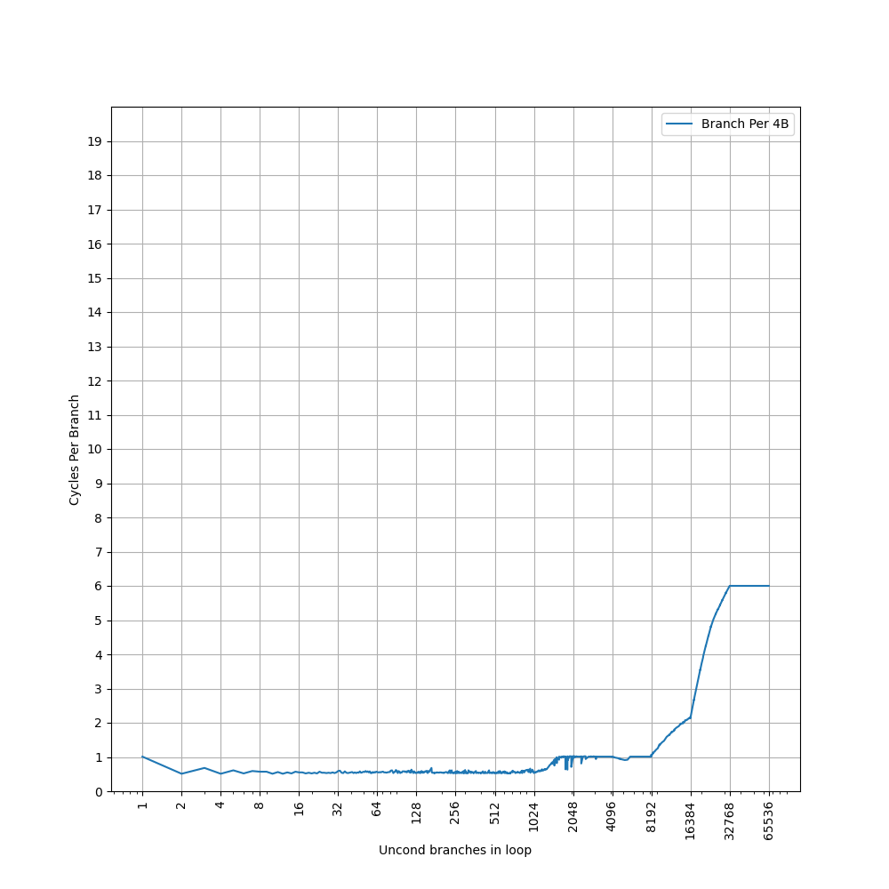
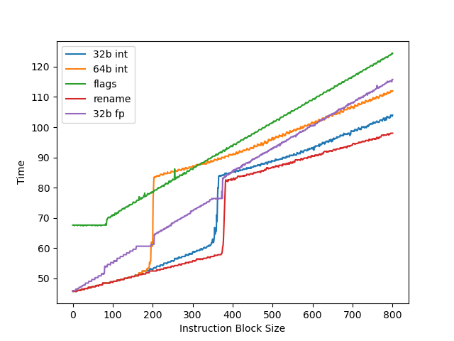

# ARM Neoverse V3 (代号 Poseidon) 微架构评测

## 背景

使用 ARM Neoverse V3 核心的 AWS Graviton 5 最近[上线](https://aws.amazon.com/cn/blogs/aws/now-available-amazon-ec2-m9g-and-m9gd-instances-powered-by-new-aws-graviton5-processors/)了，相比之前的 [Neoverse V2](./arm-neoverse-v2.md) 应该有一些改进，所以测试一下这个微架构在各个方面的表现。

<!-- more -->

## 官方信息

ARM 关于 Neoverse V3 微架构有如下公开信息：

- [Arm® Neoverse V3 Core Technical Reference Manual](https://developer.arm.com/documentation/107734/0002/)
- [Arm Neoverse V3 Software Optimization Guide](https://developer.arm.com/documentation/109678/300/)

Neoverse V3 与 Cortex X4 高度相似，这里也列出 Cortex X4 的相关信息：

- [Arm Unveils 2023 Mobile CPU Core Designs: Cortex-X4, A720, and A520 - the Armv9.2 Family](https://web.archive.org/web/20250530071135/https://www.anandtech.com/show/18871/arm-unveils-armv92-mobile-architecture-cortex-x4-a720-and-a520-64bit-exclusive/2)
- [Arm Cortex-X4 advances frontiers of CPU performance](https://developer.arm.com/community/arm-community-blogs/b/announcements/posts/cortex-x4-cpu-performance)
- [Arm® Cortex‑X4 Core Technical Reference Manual](https://developer.arm.com/documentation/102484/0003/)

下面分模块记录官方信息和实测结果。官方信息与实测结果一致的数据会加粗。

## 现有评测

网上已经有 Neoverse V3 微架构的评测和分析，建议阅读：

- [最强 Arm 处理器 AWS Graviton5 架构剖析](https://mp.weixin.qq.com/s/pd6j1PwtUW9pgTNvCEzJwg)
- [Neoverse V3 微架构](https://mp.weixin.qq.com/s/W6gWoe9OTP4DX_9dfBMgHA)

下面分各个模块分别记录官方提供的信息，以及实测的结果。读者可以对照已有的第三方评测理解。官方信息与实测结果一致的数据会加粗。

## Benchmark

Neoverse V3 (AWS Graviton 5) 的性能测试结果见 [SPEC](../../../benchmark/index.md)。

## 前端

### L1 ICache

官方信息：**64KB**, 4-way set associative, VIPT behaving as PIPT, 64B cacheline, PLRU replacement policy

测试 L1 ICache 容量，构造一个具有巨大指令 footprint 的循环，由大量 nop 和最后的分支指令组成，观察不同 footprint 下的 IPC：


起始 IPC 为 9。Neoverse V3 删除了 MOP Cache，不像 Neoverse V2 那样可以把两条 NOP 合并为一条 MOP 来提高 IPC。虽然是 10-wide Decode，IPC 只能到 9，应该是遇到了其他瓶颈。

超出 64KB L1 ICache 后，IPC 降到 4，说明 L2 Cache 可以提供每周期 16 字节的取指带宽。

L1 ICache 和 Neoverse V2 相同，只是去掉了 MOP Cache，增加了 Decode 宽度。

### L1 ITLB

官方信息：Caches entries at the 4KB, 16KB, 64KB, or 2MB granularity, Fully associative, 48 entries

构造一组 B 指令，分布在不同的 page 上，让 ITLB 成为瓶颈：


48 Page 处出现拐点，对应 48 项的 L1 ITLB 容量。之后性能降到 7 CPI，对应 L2 Unified TLB 的延迟。

进一步增加 Page 数量，大约 1000 个页的时候，耗时从 7 cycle 逐渐上升：


L2 Unified TLB 一共 2048 个 Entry，猜测 ITLB 能使用的 L2 TLB 容量只有一半，也就是 1024 项。超出后需要 Page Table Walker 做地址翻译。测试时要注意避免 Huge Page 的影响。

L1 ITLB 和 Neoverse V2 行为相同。

### Decode

官方信息：10-wide Decode

Neoverse V3 只有一个 Decode 路径，从 ICache 过来，不再有 Neoverse V2 的 MOP Cache。

### Return Stack

Return Stack 记录最近的函数调用链，call 时压栈，return 时弹栈，用于预测 return 指令的目的地址。构造不同深度的调用链，发现 Neoverse V3 的 Return Stack 深度为 32：


大小和 Neoverse V2 相同。

### BTB

构造大量 B 指令，BTB 需要记录它们的目的地址。分支数量超过 BTB 容量时，性能就会下降。将 B 指令紧密放置（每 4 字节一条）：



1024 条分支之前 CPI 约 0.5，说明 Neoverse V3 继承了 Neoverse V2 的 two taken 能力。之后到 8192 条分支之前 CPI 约 1，到 16384 条分支时 CPI 为 2，到 32768 条分支时 CPI 为 6。

性能曲线和 Neoverse V2 相同。Neoverse V2 的 [BTB 官方描述](https://hc2023.hotchips.org/assets/program/conference/day1/CPU1/HC2023.Arm.MagnusBruce.v04.FINAL.pdf)是：

- 10x larger nanoBTB（注：Neoverse V1 的 nanoBTB 是 96 entry）
- Split main BTB into two levels with 50% more entries（注：Neoverse V1 的 main BTB 是 8K entry）

据此推算 Neoverse V2 和 V3 有相同的三级 BTB 结构：

- Nano BTB: 1024 branches, two taken, 1 cycle latency
- L1 Main BTB: 8192 branches, two taken, 2 cycle latency
- L2 Main BTB: 4096 branches (?)

主要疑点是 16384 条分支时如何实现 CPI 2，目前还缺少解释。

### Conditional Branch Prediction

利用我们的[逆向方法](https://arxiv.org/abs/2411.13900)，观察分支地址对 PHR 的贡献：


- B[2-3]: shift 263 次
- B[4-5]: shift 262 次
- B[6-7,12-13]: shift 261 次
- B[8-9,14-15]: shift 260 次
- B[10-11,16-17]: shift 259 次

分支目的地址的贡献：


- T[7-8]: shift 263 次
- T[5,9-10]: shift 262 次
- T[2,11]: shift 261 次
- T[3-4]: shift 260 次
- T[6]: shift 259 次

找到对应位的异或关系后，推断出 PHR 共有 264*2=528 位，每个 taken branch 左移 2 位，footprint 从低位到高位如下：

- B[2] xor T[7]
- B[3] xor T[8]
- B[4] xor T[9]
- B[5] xor T[10]
- B[6] xor B[12] xor T[11]
- B[7] xor B[13] xor T[2]
- B[8] xor B[14] xor T[3]
- B[9] xor B[15] xor T[4]
- B[10] xor B[16]
- B[11] xor B[17] xor T[6]

其中 T[5] 没有找到异或关系。和 Neoverse V2 的 PHR 构造只有很小的区别：Neoverse V2 中，T[5] shift 次数是 259。

## 后端

### Dispatch

官方信息：up to 10 MOPs per cycle and up to 20 uOPs per cycle, with the following limitations on the number of µOPs of each type that may be simultaneously dispatched:

- Up to 4 µOPs utilizing the S or B pipelines
- Up to 4 µOPs utilizing the M pipelines
- Up to 2 µOPs utilizing the M0 pipelines
- Up to 2 µOPs utilizing the V0 pipeline
- Up to 2 µOPs utilizing the V1 pipeline
- Up to 6 µOPs utilizing the L pipelines

Dispatch 宽度和 Decode 对齐，不过限制不少，实际很难跑满。

### 物理寄存器堆

测试物理寄存器堆大小，用两个依赖链很长的操作放在开头和结尾，中间填入若干无关指令来耗费物理寄存器堆：



- 32b int：speculative 32 位整数寄存器，拐点约 355
- 64b int：speculative 64 位整数寄存器，拐点约 192，只有 32b 的一半。猜测实际物理寄存器堆有 400 左右个 64 位寄存器，但可以分成两半各自当 32 位寄存器用
- flags：speculative NZCV 寄存器，拐点约 82
- 32b fp：speculative 32 位浮点寄存器，观察到两次拐点，第一次和 32b int 接近，第二次和 64b int 接近

### Store to Load Forwarding

官方信息：

The Neoverse V3 core allows data to be forwarded from store instructions to a load instruction with the restrictions mentioned below:

- Load start address should align with the start or middle address of the older store
- Loads of size greater than or equal to 8 bytes can get the data forwarded from a maximum of 2 stores. If there are 2 stores, then each store should forward to either first or second half of the load
- Loads of size less than or equal to 4 bytes can get their data forwarded from only 1 store

描述和 Neoverse V2 相同。实测以下情况可以成功转发：

对地址 x 的 Store 转发到对地址 y 的 Load 成功时 y-x 的取值范围：

| Store\Load | 8b Load | 16b Load | 32b Load | 64b Load |
|------------|---------|----------|----------|----------|
| 8b Store   | {0}     | {}       | {}       | {}       |
| 16b Store  | {0,1}   | {0}      | {}       | {}       |
| 32b Store  | {0,2}   | {0,2}    | {0}      | {-4,0}   |
| 64b Store  | {0,4}   | {0,4}    | {0,4}    | {-4,0,4} |

一个 Load 需要转发两个 Store 的数据的情况：对地址 x 的 32b Store 和对地址 x+4 的 32b Store 转发到对地址 y 的 64b Load，在 Overlap 的情况下，要求 y=x，前半来自第一个 Store，后半来自第二个 Store。

和官方描述比较吻合，支持全部转发、转发前半、转发后半三种场景。针对常见的 64b Load，支持 y-x=-4。前半和后半也可以来自两个不同的 Store。对地址的对齐没有要求，跨缓存行边界也可以转发，只对 Load 和 Store 的相对位置有要求。转发成功时 5.3 Cycle，有 Overlap 但无法转发时 10.5 Cycle。

小结：ARM Neoverse V3 的 Store to Load Forwarding：

- 1 ld + 1 st: 要求 ld 和 st 地址相同或差出半个 st 宽度
- 1 ld + 2 st: 要求 ld 和 st 地址相同
- 1 ld + 4 st: 不支持

和 Neoverse V2 相同。

### 计算单元

官方信息：8x ALU, **3x Branch**, **4x 128b SIMD**

实测以下指令的吞吐：

- int add: 6 IPC，只用到了 6 个 Single Cycle 单元，理论上两个 Multi Cycle 单元也能用上，但实际 IPC 达不到 8
- int mul: 2 IPC，对应两个 Multi Cycle 单元
- int not taken branch: 3 IPC，对应三个 Branch 单元
- asimd fadd double: 4 IPC，对应四个 FP/ASIMD 单元

### Load Store Unit

官方信息：**1 Load/Store Pipe + 2 Load Pipe + 1 Store Pipe**

一个周期内最多可以完成如下 Load/Store：

- 3x 64b Load
- 2x 64b Load + 2x 64b Store
- 1x 64b Load + 2x 64b Store
- 2x 64b Store

符合 1 LS + 2 LD + 1 ST pipe 的设计。相比 Neoverse V2 的 2 LS + 1 LD，同时 Load 和 Store 时性能更高。

每周期通过 load/store pair 指令可以完成的 128b 访存：

- 2x 128b Load
- 2x 128b Load + 2x 128b Store
- 1x 128b Load + 2x 128b Store
- 2x 128b Store

Load 没有跨越缓存行时，load to use 延迟 4 cycle；跨过 64B 缓存行边界时，增加到 5 cycle。与 Neoverse V2 相同。

### Memory Dependency Predictor

为了预测执行 Load，需要确保它和之前的 Store 访问的内存没有 Overlap，所以需要一个预测器来预测这种依赖。参考 [Store-to-Load Forwarding and Memory Disambiguation in x86 Processors](https://blog.stuffedcow.net/2014/01/x86-memory-disambiguation/) 的方法，构造两种指令模式，分别测试数据和地址上的依赖：

- 数据依赖，地址无依赖：`str x3, [x1]` 和 `ldr x3, [x2]`
- 地址依赖，数据无依赖：`str x2, [x1]` 和 `ldr x1, [x2]`

初始化时 `x1` 和 `x2` 指向同一个地址，重复上述模式，观察性能下降时 `ldr` 指令的数量：


地址依赖的阈值是 56，数据依赖没有阈值。相比 Neoverse V2 有所增加。

### Reorder Buffer

把两个串行的 fsqrt 序列放在循环的头和尾，中间用 NOP 填充。如果 ROB 足够大，执行开头串行 fsqrt 序列时可以同时执行结尾的，性能最优。ROB 不够大时则会出现性能下降。

测试发现大约 768 条 NOP 时出现性能下降。Neoverse V3 实现了 Instruction Fusion，两条 NOP 算做一条 uOP 和一条 MOP，所以 768 条 NOP 对应 384 MOP 的 ROB 大小。极限下 384 MOP 可以存 768 uOP，但实际很难达到，容易受限于其他结构。相比 Neoverse V2 的 320 MOP 有所增加。


### L1 DCache

官方信息：**64KB**, 4-way set associative, **VIPT behaving as PIPT**, 64B cacheline, ECC protected, RRIP replacement policy, **4×64-bit read paths** and **4×64-bit write** paths for the integer execute pipeline, **3×128-bit read paths** and **2×128-bit** write paths for the vector execute pipeline

无论官方信息还是下面的实测结果，都和 Neoverse V2 相同。

#### 容量

构造不同大小 footprint 的 pointer chasing 链，测试每条 load 指令的耗时：


64KB 处出现拐点，对应 L1 DCache 容量。之后延迟先上升后下降，与 ARM 采用的 Correlated Miss Caching (CMC) 预取器记住了 pointer chasing 的历史有关，详见 [Arm Neoverse N2: Arm's 2nd generation high performance infrastructure CPUs and system IPs](https://hc33.hotchips.org/assets/program/conference/day1/20210818_Hotchips_NeoverseN2.pdf)。

#### 延迟

L1 DCache 的 load to use latency 是 4 cycle，没有针对 pointer chasing 做 3 cycle 优化。

#### 吞吐

用 FP/ASIMD 128b Load 可以达到 3 IPC，对应 3x128b read paths；用 2x64b 整数 LDP 只能到 2 IPC，对应 4x64b read paths。要达到峰值读取性能，必须用 FP/ASIMD 指令。向量 128b Store 可以达到 2 IPC，对应 2x128b write paths；2x64b 整数 STP 也能到 2 IPC，对应 4x64b write paths。

#### VIPT

4KB page 下，64KB 4-way 的 L1 DCache 不满足 VIPT 的 Index 全在页内偏移的条件（详见 [VIPT 与缓存大小和页表大小的关系](./vipt-l1-cache-page-size.md)）。此时要么用 PIPT，要么在 VIPT 基础上处理 alias 问题。参考 [浅谈现代处理器实现超大 L1 Cache 的方式](https://blog.cyyself.name/why-the-big-l1-cache-is-so-hard/) 的测试方法，用 shm 构造两个 4KB 虚拟页映射到同一个物理页，然后在两个虚拟页之间 copy，发现相比同一个虚拟页内 copy 有显著的性能下降，并产生了大量 L1 DCache Refill：

```
copy from aliased page = 8778731053 cycles, 55305 refills
baseline = 5298206743 cycles, 31413 refills
slowdown = 1.66x
```

这验证了 L1 DCache 采用的是 VIPT，并在正确性上做了 alias 处理。如果是 PIPT，L1 DCache 会发现两个页对应相同物理地址，性能不会下降，也不需要频繁 refill。

#### 构造

为了支持每周期 3 条 Load，L1 DCache 通常会分 Bank，每个 Bank 有自己的读口。Load 分布到不同 Bank 上时可以同时读取；命中相同 Bank 但访问不同地址，就只能等下个周期。为了测试 Bank 构造，设计了一系列以不同固定 stride 间隔的 Load 指令：

- Stride=1B/2B/4B/8B/16B/32B: IPC=3
- Stride=64B: IPC=2
- Stride=128B/256B/512B: IPC=1

Stride=64B 时出现 Bank Conflict，Stride=128B 时所有 Load 命中同一个 Bank，只能串行读取。根据这个现象，认为 Neoverse V3 的 L1 DCache 组织方式是：

- 一共有两个 Bank，Bank Index 是 VA[6]
- 每个 Bank 每周期可以从一个缓存行读取数据
- 支持多个 Load 访问同一个缓存行
- 多个 Load 访问同一个 Bank 的不同缓存行，只能一个周期完成一个 Load

这里讨论的是缓存行级别的 Bank。缓存行内部也会做 Bank 划分，但主要是为了功耗，比如从 64B 缓存行读 8B 数据，不需要把整个 64B 都读出来。

### L1 DTLB

官方信息：Caches entries at the 4KB, 16KB, 64KB, 2MB or 512MB granularity, Fully associative, **96** entries.

用 pointer chasing 测试 L1 DTLB 容量，指针分布在不同的 page 上，让 DTLB 成为瓶颈：


96 Page 处出现拐点，对应 96 项的 L1 DTLB 容量。超出后需要额外 6 cycle 访问 L2 Unified TLB。容量相比 Neoverse V2 翻番。测试时注意避免 Huge Page 的影响。

### L2 Unified TLB

官方信息：Shared by instructions and data, 8-way set associative, 2048 entries

### L2 Cache

官方信息：2MB or 3MB, 8-way(2MB) or 12-way(3MB) set associative, 4 banks, PIPT, ECC protected, 64B cacheline

### SVE

官方信息：128b SVE vector length

Linux 下查看 `/proc/sys/abi/sve_default_vector_length`，SVE 宽度为 16 字节，即 128b。

Neoverse V3 每周期最多执行 4 条 ASIMD 或 SVE 浮点 FMA 指令，浮点峰值性能：

- 单精度：`128/32*2*4=32` FLOP per cycle
- 双精度：`128/64*2*4=16` FLOP per cycle

与 Neoverse V2、Zen 2-4、Oryon、Firestorm、LA464、Haswell 等微架构看齐，但不及 Zen 5、Skylake 等通过 AVX512 提供的峰值浮点性能。

## 总结

Neoverse V3 相比 Neoverse V2 改动不算很大，主要变化：

- Decode 宽度从 8-wide 增加到 10-wide，但去掉了 MOP Cache
- ROB 从 320 MOP 增加到 384 MOP
- LSU 从 2 LS + 1 LD 改为 1 LS + 2 LD + 1 ST
- L1 DTLB 从 48 项翻倍到 96 项
- Memory Dependency Predictor 从 40 增加到 56

整体上是一次稳健的迭代升级。
