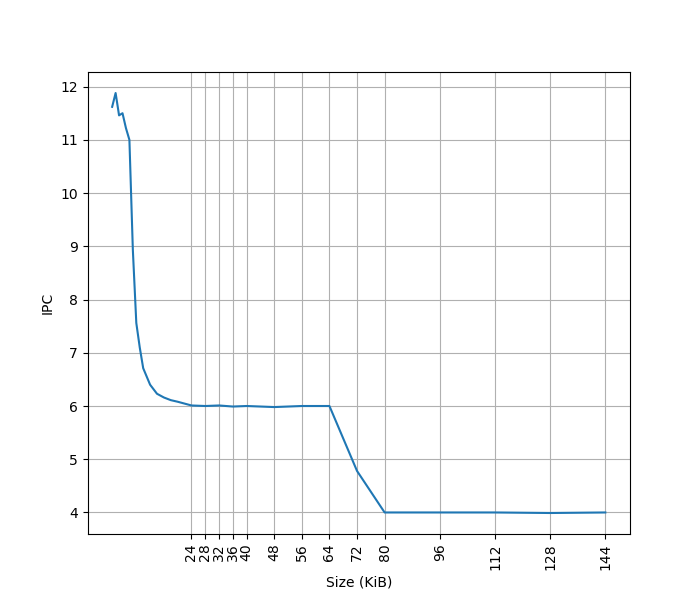
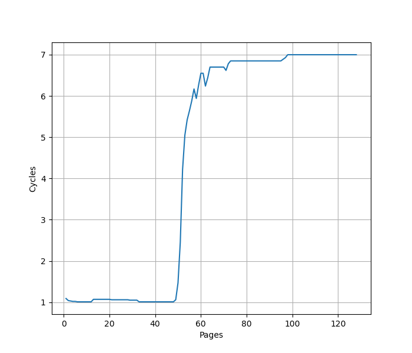
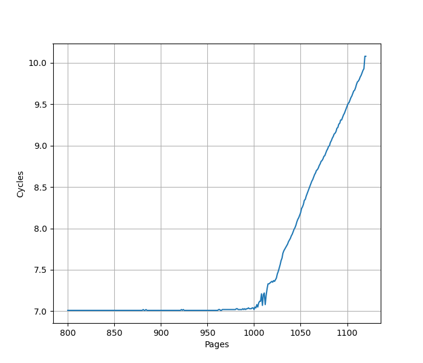

# ARM Neoverse V2 微架构评测

## 背景

ARM Neoverse V2 是目前（2024 年）在服务器上能用到的最新的 ARM 公版核平台（AWS Graviton 4），测试一下这个微架构在各个方面的表现。

<!-- more -->

## 官方信息

ARM 关于 Neoverse V2 微架构有如下公开信息：

- [Arm Neoverse V2 platform: Leadership Performance and Power Efficiency for Next-Generation Cloud Computing, ML and HPC Workloads](https://hc2023.hotchips.org/assets/program/conference/day1/CPU1/HC2023.Arm.MagnusBruce.v04.FINAL.pdf)
- [Arm® Neoverse™ V2 Core Technical Reference Manual](https://developer.arm.com/documentation/102375/latest/)
- [Arm Neoverse V2 Software Optimization Guide](https://developer.arm.com/documentation/109898/latest/)

考虑到 Neoverse V2 与 Cortex X3 的高度相似性，这里也列出 Cortex X3 的相关信息：

- [Arm Unveils Next-Gen Flagship Core: Cortex-X3](https://fuse.wikichip.org/news/6855/arm-unveils-next-gen-flagship-core-cortex-x3/)
- [Arm® Cortex‑X3 Core Technical Reference Manual](https://developer.arm.com/documentation/101593/latest/)

## 现有评测

网上已经有 Neoverse V2 微架构的评测和分析，建议阅读：

- [Hot Chips 2023: Arm’s Neoverse V2](https://chipsandcheese.com/p/hot-chips-2023-arms-neoverse-v2)

下面分各个模块分别记录官方提供的信息，以及实测的结果。读者可以对照已有的第三方评测理解。官方信息与实测结果一致的数据会加粗。

## Benchmark

Neoverse V2 (AWS Graviton 4) 的性能测试结果见 [SPEC](../../../benchmark.md)。

## MOP vs uOP

MOP = Macro operation, uOP = Micro operation

ARM 公版核微架构既有 MOP 的概念，又有 uOP 的概念。uOP 主要是针对后端，执行单元处理的是 uOP。MOP 出现在 MOP Cache 以及 ROB 当中。他们和指令都并不是一一对应的关系。

例如 Instruction Fusion 特性，可以把多条指令合并到一条 uOP 当中，例如 CMP + CSET，合并成一个 uOP 以后，只需要一个 ALU 就可以完成整个操作。另一方面，一条指令也可能拆成多个 uOP，例如 128b Load Pair 指令，一条指令被拆成两个 uOP，可以独立执行，但为了保证精确异常，在 ROB 中还是同一个 MOP。

当然了，如果不考虑这些细节，大多数情况下，一条指令对应一个 MOP 对应一个 uOP 也是成立的。

## 前端

### Branch Predictor

官方信息：Two predicted branches per cycle, nanoBTB + two level main BTB, 8 table 2 way TAGE direction predictor

### L1 ICache

官方信息：**64KB**, 4-way set associative, VIPT behaving as PIPT, 64B cacheline, PLRU replacement policy

为了测试 L1 ICache 容量，构造一个具有巨大指令 footprint 的循环，由大量的 nop 和最后的分支指令组成。观察在不同 footprint 大小下的 IPC：

开始有一段 IPC 接近 12，此时指令由 MOP Cache 提供，由于连续的两条 NOP 可以被融合成一个 uOP，因此可以突破 8 的限制，但为什么是 12 还需要进一步研究。

当指令超出 MOP Cache 容量后，指令走 ICache + Decode，此时可以达到 6 的 IPC，与 6-wide 的 Decode Width 吻合。当 footprint 超出 64 KB 时，IPC 下降，对应了 64KB 的 L1 ICache 容量。

超出 L1 ICache 容量后，可以达到 4 的 IPC，说明 L2 Cache 可以提供每周期 16 字节的取指带宽。

### MOP Cache

官方信息：1536 macro-operations, 4-way skewed associative, VIVT behaving as PIPT, NRU replacement policy, 8 MOP/cycle

### L1 ITLB

官方信息：Caches entries at the 4KB, 16KB, 64KB, or 2MB granularity, Fully associative, 48 entries

构造一系列的 B 指令，使得 B 指令分布在不同的 page 上，使得 ITLB 成为瓶颈：

可以看到 48 Page 出现了明显的拐点，对应的就是 48 的 L1 ITLB 容量。此后性能降低到 7 CPI，此时对应了 L2 Unified TLB 的延迟。

进一步增加 Page 数量，发现在大约 1000 个页的时候，时间从 7 cycle 逐渐上升：

考虑到 L2 Unified TLB 一共有 2048 个 Entry，猜测它限制了 ITLB 能使用的 L2 TLB 的容量只有 2048 的一半，也就是 1024 项。超出 1024 项以后，需要 Page Table Walker 进行地址翻译。

### Decode

官方信息：6-wide Decode

## 后端

### Dispatch

官方信息：up to 8 MOPs per cycle and up to 16 uOPs per cycle

### Store to Load Forwarding

官方信息：

> The Neoverse V2 core allows data to be forwarded from store instructions to a load instruction with the restrictions mentioned below:
> • Load start address should align with the start or middle address of the older store
> • Loads of size greater than or equal to 8 bytes can get the data forwarded from a maximum of 2 stores. If there are 2 stores, then each store should forward to either first or second half of the load
> • Loads of size less than or equal to 4 bytes can get their data forwarded from only 1 store

经过实际测试，如下的情况可以成功转发：

- 对地址 x 的 64b Store 转发到对地址 y 的 64b Load，要求 y=x-4 或 y=x 或 y=x+4
- 对地址 x 的 64b Store 转发到对地址 y 的 32b Load，要求 y=x 或 y=x+4
- 对地址 x 的 32b Store 转发到对地址 y 的 64b Load，要求 y=x 或 y=x-4
- 对地址 x 的 32b Store 和对地址 x+4 的 32b Store 转发到对地址 y 的 64b Load，要求 y=x-4 或 y=x-4 或 y=x+4
- 不支持 16b Store 转发到 64b Load
- 不支持 8b Store 转发到 64b Load

和官方的描述是比较符合的，只考虑了全部转发、转发前半和转发后半的场景。对地址本身的对齐没有要求，甚至在跨缓存行边界时也可以转发，只是对 Load 和 Store 的相对位置有要求。

### 计算单元

官方信息：6x ALU, 2x Branch, 4x 128b SIMD

### Load Store Unit

官方信息：2 Load/Store Pipe + 1 Load Pipe, Reduce bandwidth or incur additional latency for:

1. Load operations that cross a cache-line (64-byte) boundary.
2. Quad-word load operations that are not 4B aligned.
3. Store operations that cross a 32B boundary.

### Move Elimination

官方信息：特定情况下这些指令可以被优化：mov reg, 0; mov reg, zero; mov vreg, 0; mov reg, reg;mov vreg, vreg

### Reorder Buffer

官方信息：320 MOP ROB, 8-wide retire

### L1 DCache

官方信息：64KB, 4-way set associative, VIPT behaving as PIPT, 64B cacheline, ECC protected, RRIP replacement policy, 4×64-bit read paths and 4×64-bit write paths for the integer execute pipeline, 3×128-bit read paths and 2×128-bit write paths for the vector execute pipeline

### L1 DTLB

官方信息：Caches entries at the 4KB, 16KB, 64KB, 2MB or 512MB granularity, Fully associative, 48 entries

### L2 Unified TLB

官方信息：Shared by instructions and data, 8-way set associative, 2048 entries

### L2 Cache

官方信息：1MB or 2MB, 8-way set associative, 4 banks, PIPT, ECC protected, 64B cacheline, 10 cycle load-to-use, 128 B/cycle

### SVE

官方信息：128b SVE vector length