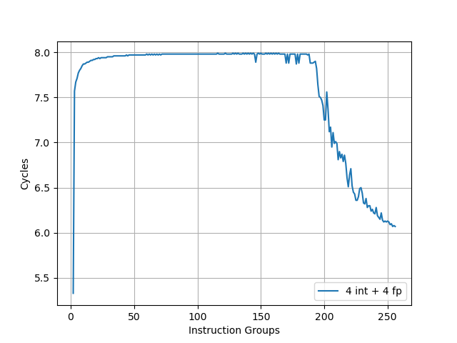

# ARM Neoverse V2 微架构评测

## 背景

ARM Neoverse V2 是目前（2024 年）在服务器上能用到的最新的 ARM 公版核平台（AWS Graviton 4），测试一下这个微架构在各个方面的表现。

<!-- more -->

## 官方信息

ARM 关于 Neoverse V2 微架构有如下公开信息：

- [Arm Neoverse V2 platform: Leadership Performance and Power Efficiency for Next-Generation Cloud Computing, ML and HPC Workloads](https://hc2023.hotchips.org/assets/program/conference/day1/CPU1/HC2023.Arm.MagnusBruce.v04.FINAL.pdf)
- [Arm® Neoverse™ V2 Core Technical Reference Manual](https://developer.arm.com/documentation/102375/latest/)
- [Arm Neoverse V2 Software Optimization Guide](https://developer.arm.com/documentation/109898/latest/)

考虑到 Neoverse V2 与 Cortex X3 的高度相似性，这里也列出 Cortex X3 的相关信息：

- [Arm Unveils Next-Gen Flagship Core: Cortex-X3](https://fuse.wikichip.org/news/6855/arm-unveils-next-gen-flagship-core-cortex-x3/)
- [Arm® Cortex‑X3 Core Technical Reference Manual](https://developer.arm.com/documentation/101593/latest/)

## 现有评测

网上已经有 Neoverse V2 微架构的评测和分析，建议阅读：

- [Hot Chips 2023: Arm’s Neoverse V2](https://chipsandcheese.com/p/hot-chips-2023-arms-neoverse-v2)

下面分各个模块分别记录官方提供的信息，以及实测的结果。读者可以对照已有的第三方评测理解。官方信息与实测结果一致的数据会加粗。

## Benchmark

Neoverse V2 (AWS Graviton 4) 的性能测试结果见 [SPEC](../../../benchmark.md)。

## MOP vs uOP

MOP = Macro operation, uOP = Micro operation

ARM 公版核微架构既有 MOP 的概念，又有 uOP 的概念。uOP 主要是针对后端，执行单元处理的是 uOP。MOP 出现在 MOP Cache 以及 ROB 当中。他们和指令都并不是一一对应的关系。

例如 Instruction Fusion 特性，可以把多条指令合并到一条 uOP 当中，例如 CMP + CSET，合并成一个 uOP 以后，只需要一个 ALU 就可以完成整个操作。另一方面，一条指令也可能拆成多个 uOP，例如 128b Load Pair 指令，一条指令被拆成两个 uOP，可以独立执行，但为了保证精确异常，在 ROB 中还是同一个 MOP。

当然了，如果不考虑这些细节，大多数情况下，一条指令对应一个 MOP 对应一个 uOP 也是成立的。

## 前端

### Branch Predictor

官方信息：Two predicted branches per cycle, nanoBTB + two level main BTB, 8 table 2 way TAGE direction predictor

### L1 ICache

官方信息：**64KB**, 4-way set associative, VIPT behaving as PIPT, 64B cacheline, PLRU replacement policy

为了测试 L1 ICache 容量，构造一个具有巨大指令 footprint 的循环，由大量的 nop 和最后的分支指令组成。观察在不同 footprint 大小下的 IPC：


开始有一段 IPC 接近 12，此时指令由 MOP Cache 提供，由于连续的两条 NOP 可以被融合成一个 uOP，因此可以突破 8 的限制，但为什么是 12 还需要进一步研究。

当指令超出 MOP Cache 容量后，指令走 ICache + Decode，此时可以达到 6 的 IPC，与 6-wide 的 Decode Width 吻合。当 footprint 超出 64 KB 时，IPC 下降，对应了 64KB 的 L1 ICache 容量。

超出 L1 ICache 容量后，可以达到 4 的 IPC，说明 L2 Cache 可以提供每周期 16 字节的取指带宽。

### MOP Cache

官方信息：**1536 macro-operations**, 4-way skewed associative, VIVT behaving as PIPT, NRU replacement policy, **8 MOP/cycle**

因为 MOP Cache 的带宽比 Decode 高，为了测试出 MOP Cache 的规格，需要构造指令序列，使其可以达到 8 MOP/cycle 的 IPC，如果走的是 Instruction Fetch + Decode，则达不到这个 IPC。但是 Neoverse V2 的 Dispatch 有比较明确的限制：

The dispatch stage can process up to 8 MOPs per cycle and dispatch up to 16 µOPs per cycle, with the following limitations on the number of µOPs of each type that may be simultaneously dispatched.

- Up to 4 µOPs utilizing the S（单周期整数）or B（分支）pipelines
- Up to 4 µOPs utilizing the M（多周期整数）pipelines
- Up to 2 µOPs utilizing the M0（多周期整数）pipelines
- Up to 2 µOPs utilizing the V0（浮点/向量） pipeline
- Up to 2 µOPs utilizing the V1（浮点/向量） pipeline
- Up to 6 µOPs utilizing the L（访存）pipelines

考虑到这个限制，使用 4 条 add 指令，4 条 fadd 指令为一组，不断重复。通过测试，这样的指令序列确实可以达到 8 的 IPC。当指令个数增加到超出 MOP Cache 容量时，将会观察到性能的下降：



拐点出现在 192 个指令组，此时达到 MOP Cache 的容量瓶颈，`192*8=1536`，正好是 MOP Cache 的容量。

### L1 ITLB

官方信息：Caches entries at the 4KB, 16KB, 64KB, or 2MB granularity, Fully associative, 48 entries

构造一系列的 B 指令，使得 B 指令分布在不同的 page 上，使得 ITLB 成为瓶颈：


可以看到 48 Page 出现了明显的拐点，对应的就是 48 的 L1 ITLB 容量。此后性能降低到 7 CPI，此时对应了 L2 Unified TLB 的延迟。

进一步增加 Page 数量，发现在大约 1000 个页的时候，时间从 7 cycle 逐渐上升：


考虑到 L2 Unified TLB 一共有 2048 个 Entry，猜测它限制了 ITLB 能使用的 L2 TLB 的容量只有 2048 的一半，也就是 1024 项。超出 1024 项以后，需要 Page Table Walker 进行地址翻译。

### Decode

官方信息：6-wide Decode

### Return Stack

Return Stack 记录了最近的函数调用链，call 时压栈，return 时弹栈，从而实现 return 指令的目的地址的预测。构造不同深度的调用链，发现 Neoverse V2 的 Return Stack 深度为 32：


## 后端

### Dispatch

官方信息：up to 8 MOPs per cycle and up to 16 uOPs per cycle

### Store to Load Forwarding

官方信息：

The Neoverse V2 core allows data to be forwarded from store instructions to a load instruction with the restrictions mentioned below:

- Load start address should align with the start or middle address of the older store
- Loads of size greater than or equal to 8 bytes can get the data forwarded from a maximum of 2 stores. If there are 2 stores, then each store should forward to either first or second half of the load
- Loads of size less than or equal to 4 bytes can get their data forwarded from only 1 store

经过实际测试，如下的情况可以成功转发：

对地址 x 的 Store 转发到对地址 y 的 Load 成功时 y-x 的取值范围：

| Store\Load | 8b Load | 16b Load | 32b Load | 64b Load |
|------------|---------|----------|----------|----------|
| 8b Store   | {0}     | {}       | {}       | {}       |
| 16b Store  | {0,1}   | {0}      | {}       | {}       |
| 32b Store  | {0,2}   | {0,2}    | {0}      | {-4,0}   |
| 64b Store  | {0,4}   | {0,4}    | {0,4}    | {-4,0,4} |

一个 Load 需要转发两个 Store 的数据的情况：对地址 x 的 32b Store 和对地址 x+4 的 32b Store 转发到对地址 y 的 64b Load，在 Overlap 的情况下，要求 y=x，也就是恰好前半来自第一个 Store，后半来自第二个 Store。

和官方的描述是比较符合的，只考虑了全部转发、转发前半和转发后半的三种场景。特别地，针对常见的 64b Load，支持 y-x=-4。同时也支持前半和后半来自两个不同的 Store。对地址本身的对齐没有要求，甚至在跨缓存行边界时也可以转发，只是对 Load 和 Store 的相对位置有要求。

和 [Zen 5](./amd_zen5.md) 相比，Neoverse V2 对 Store 和 Load 的相对位置有额外的要求（开头或正中央），但支持了 Store 和 Load 只有一部分覆盖的情况，也允许一个 Load 从两个 Store 中取得数据。

从性能上，可以转发时 5 Cycle，有 Overlap 但无法转发时 10.5 Cycle。

### 计算单元

官方信息：6x ALU, **2x Branch**, **4x 128b SIMD**

实测以下指令的吞吐：

- int add: 4 IPC，受到 Dispatch 限制：`Up to 4 µOPs utilizing the S（单周期整数）or B（分支）pipelines`
- int mul: 2 IPC，对应两个 Multi Cycle 单元
- int not taken branch: 2 IPC，对应两个 Branch 单元
- asimd fadd double: 4 IPC，对应四个 FP/ASIMD 单元

### Load Store Unit

官方信息：**2 Load/Store Pipe + 1 Load Pipe**, Reduce bandwidth or **incur additional latency** for:

1. Load operations that cross a cache-line (64-byte) boundary.
2. Quad-word load operations that are not 4B aligned.
3. Store operations that cross a 32B boundary.

经过测试，一个周期内可以最多完成如下的 Load/Store 指令：

- 3x 64b Load
- 2x 64b Load + 1x 64b Store
- 1x 64b Load + 2x 64b Store
- 2x 64b Store

这个性能符合 2 LS + 1 LD pipe 的设计。

经过测试，当 Load 指令没有跨越缓存行时，load to use 延迟是 4 cycle；当 Load 指令跨过 64B 缓存行边界时，load to use 延迟增加到 5 cycle。

### Memory Dependency Predictor

为了预测执行 Load，需要保证 Load 和之前的 Store 访问的内存没有 Overlap，那么就需要有一个预测器来预测 Load 和 Store 之前在内存上的依赖。参考 [Store-to-Load Forwarding and Memory Disambiguation in x86 Processors](https://blog.stuffedcow.net/2014/01/x86-memory-disambiguation/) 的方法，构造两个指令模式，分别在地址和数据上有依赖：

- 数据依赖，地址无依赖：`str x3, [x1]` 和 `ldr x3, [x2]`
- 地址依赖，数据无依赖：`str x2, [x1]` 和 `ldr x1, [x2]`

初始化时，`x1` 和 `x2` 指向同一个地址，重复如上的指令模式，观察到多少条 `ldr` 指令时会出现性能下降：


有意思的是，地址依赖的阈值是 40，而数据依赖没有阈值。

### Move Elimination

官方信息：特定情况下这些指令可以被优化：mov reg, 0; mov reg, zero; mov vreg, 0; mov reg, reg;mov vreg, vreg

实际测试，各种模式的 IPC 如下：

- mov reg, 0: IPC 6
- mov vreg, 0: IPC 6
- mov reg, reg: 无依赖链时 IPC 4
- mov vreg, vreg: 无依赖链时 IPC 3.6

虽然做了优化，但算不上很快。

### Reorder Buffer

官方信息：**320 MOP** ROB, 8-wide retire

把两个串行的 fsqrt 序列放在循环的头和尾，中间用 NOP 填充，如果 ROB 足够大，可以在执行开头串行的 fsqrt 序列时，同时执行结尾串行的 fsqrt 序列，此时性能是最优的。如果 ROB 不够大，那么会观察到性能下降。由于 Neoverse V2 执行 NOP 可以达到接近 12 的 IPC，所以只需要很少的 fsqrt 就足够生成足够的延迟。

通过测试，发现在大约 640 条 NOP 时出现性能下降，而 Neoverse V2 实现了 Instruction Fusion，两条 NOP 指令算做一条 uOP，同时也是一条 MOP，因此 640 条 NOP 对应 320 MOP 的 ROB 大小。极限情况下，320 MOP 可以存 640 uOP，但是实际上比较难达到，很容易受限于其他结构。

### L1 DCache

官方信息：**64KB**, 4-way set associative, **VIPT behaving as PIPT**, 64B cacheline, ECC protected, RRIP replacement policy, **4×64-bit read paths** and **4×64-bit write** paths for the integer execute pipeline, **3×128-bit read paths** and **2×128-bit** write paths for the vector execute pipeline

#### 容量

构造不同大小 footprint 的 pointer chasing 链，测试不同 footprint 下每条 load 指令耗费的时间：


可以看到 64KB 出现了明显的拐点，对应的就是 64KB 的 L1 DCache 容量。之后延迟先上升后下降，与 ARM 采用的 Correlated Miss Caching(CMC) 预取器记住了 pointer chasing 的历史有关，详细可以阅读 [Arm Neoverse N2: Arm’s 2nd generation high performance infrastructure CPUs and system IPs](https://hc33.hotchips.org/assets/program/conference/day1/20210818_Hotchips_NeoverseN2.pdf)。

#### 延迟

经过测试，L1 DCache 的 load to use latency 是 4 cycle，没有针对 pointer chasing 做 3 cycle 的优化。

#### 吞吐

使用 FP/ASIMD 128b Load 可以达到 3 IPC，对应了 3x128b read paths；而如果使用 2x64b 整数 LDP，则只能达到 2 IPC，对应 4x64b read paths。也就是说，要达到峰值的读取性能，必须用 FP/ASIMD 指令。写入方面，向量 128b Store 可以达到 2 IPC，对应了 2x128b write paths；类似地，2x64b 整数 STP 能达到 2 IPC，对应 4x64b write paths。

#### VIPT

在 4KB page 的情况下，64KB 4-way 的 L1 DCache 不满足 VIPT 的 Index 全在页内偏移的条件（详见 [VIPT 与缓存大小和页表大小的关系](./vipt-l1-cache-page-size.md)），此时要么改用 PIPT，要么在 VIPT 的基础上处理 alias 的问题。为了测试这一点，参考 [浅谈现代处理器实现超大 L1 Cache 的方式](https://blog.cyyself.name/why-the-big-l1-cache-is-so-hard/) 的测试方法，用 shm 构造出两个 4KB 虚拟页映射到同一个物理页的情况，然后在两个虚拟页之间 copy，发现相比在同一个虚拟页内 copy 有显著的性能下降，并且产生了大量的 L1 DCache Refill：

```
copy from aliased page = 3261121467 cycles, 285103870 refills
baseline = 1520692165 cycles, 1200 refills
slowdown = 2.14x
```

因此验证了 L1 DCache 采用的是 VIPT，并做了针对 alias 的正确性处理。如果是 PIPT，那么 L1 DCache 会发现这两个页对应的是相同的物理地址，性能不会下降，也不需要频繁的 refill。

#### 构造

进一步尝试研究 Neoverse V2 的 L1 DCache 的构造，为了支持每周期 3 条 Load 指令，L1 DCache 通常会分 Bank，每个 Bank 都有自己的读口。如果 Load 分布到不同的 Bank 上，各 Bank 可以同时读取，获得更高的性能；如果 Load 命中相同的 Bank，但是访问的 Bank 内地址不同，就只能等到下一个周期再读取。为了测试 Bank 的构造，设计一系列以不同的固定 stride 间隔的 Load 指令，观察 Load 的 IPC：

- Stride=1B/2B/4B/8B/16B/32B: IPC=3
- Stride=64B: IPC=2
- Stride=128B/256B/512B: IPC=1

Stride=64B 时出现性能下降，说明此时出现了 Bank Conflict，进一步到 Stride=128B 时，只能达到 1 的 IPC，说明此时所有的 Load 都命中了同一个 Bank，并且是串行读取。根据这个现象，认为 Neoverse V2 的 L1 DCache 组织方式是：

- 一共有两个 Bank，Bank Index 是 VA[6]
- 每个 Bank 每周期可以从一个缓存行读取数据，支持多个 Load 访问同一个缓存行
- 如果多个 Load 访问同一个 Bank 的不同缓存行，只能一个周期完成一个 Load

### L1 DTLB

官方信息：Caches entries at the 4KB, 16KB, 64KB, 2MB or 512MB granularity, Fully associative, **48** entries. A miss in the L1 data TLB and a hit in the L2 TLB has a 6-cycle penalty compared to a hit in the L1 data TLB.

用 pointer chasing 的方法测试 L1 DTLB 容量，指针分布在不同的 page 上，使得 DTLB 成为瓶颈：


可以看到 48 Page 出现了明显的拐点，对应的就是 48 的 L1 DTLB 容量。超出容量后，需要额外的 5 cycle 的 latency 访问 L2 Unified TLB。

### L2 Unified TLB

官方信息：Shared by instructions and data, 8-way set associative, 2048 entries

### L2 Cache

官方信息：1MB or 2MB, 8-way set associative, 4 banks, PIPT, ECC protected, 64B cacheline, 10 cycle load-to-use, 128 B/cycle

### SVE

官方信息：128b SVE vector length

在 Linux 下查看 `/proc/sys/abi/sve_default_vector_length` 的内容，得到 SVE 宽度为 16 字节，也就是 128b。

实测发现 Neoverse V2 每周期最多可以执行 4 条 ASIMD 或 SVE 的浮点 FMA 指令，也就是说，每周期浮点峰值性能：

- 单精度：`128/32*2*4=32` FLOP per cycle
- 双精度：`128/64*2*4=16` FLOP per cycle

与 Zen 2-4、Oryon、Firestorm、LA464、Haswell 等微架构看齐，但不及 Zen 5、Skylake 等通过 AVX512 提供的峰值浮点性能。
