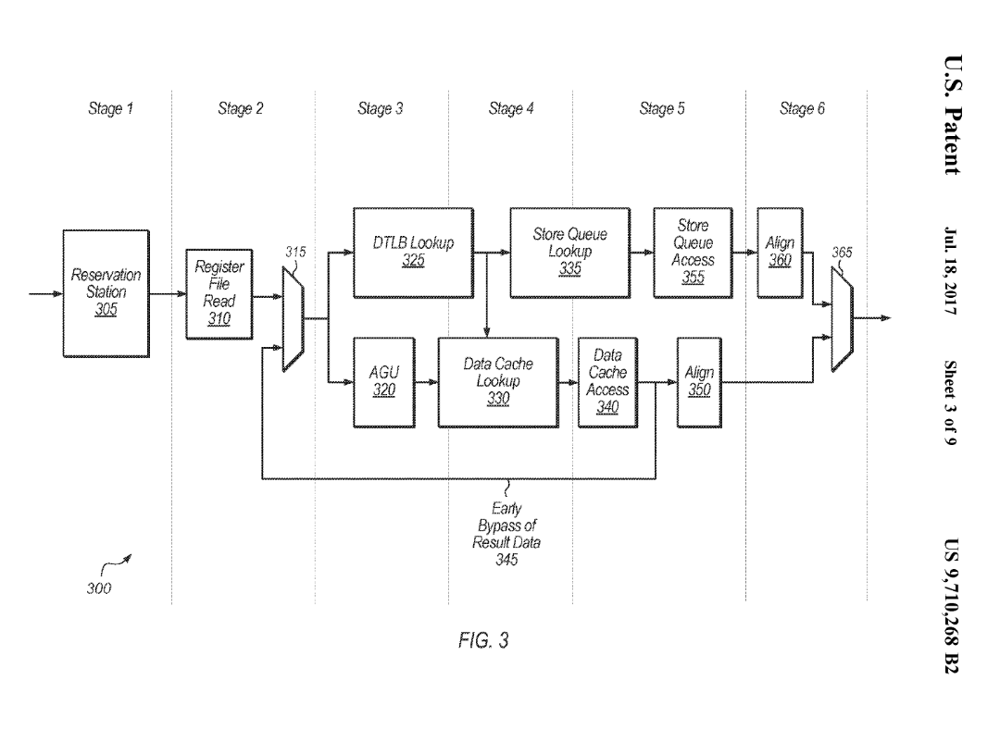
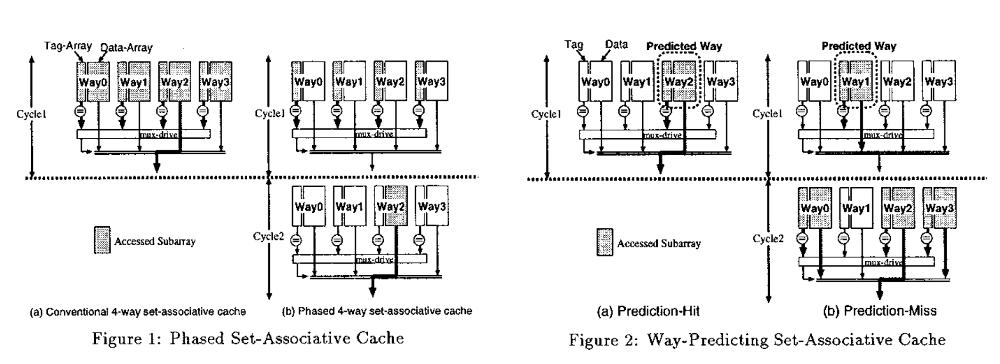

# 浅谈乱序执行 CPU（二：访存）

本文的内容已经整合到[知识库](/kb/hardware/ooo_cpu.html)中。

## 背景

之前写过一个[浅谈乱序执行 CPU](brief-into-ooo.md)，随着学习的深入，内容越来越多，页面太长，因此把后面的一部分内容独立出来，变成了这篇博客文章。

本文主要讨论访存的部分。

本系列的所有文章：

- [浅谈乱序执行 CPU（一：乱序）](./brief-into-ooo.md)
- [浅谈乱序执行 CPU（二：访存）](./brief-into-ooo-2.md)
- [浅谈乱序执行 CPU（三：前端）](./brief-into-ooo-3.md)

<!-- more -->

## 内存访问

内存访问是一个比较复杂的操作，它涉及到缓存、页表、内存序等问题。在乱序执行中，要尽量优化内存访问对其他指令的延迟的影响，同时也要保证正确性。这里参考的是 [BOOM 的 LSU 设计](https://docs.boom-core.org/en/latest/sections/load-store-unit.html)。

首先是正确性。一般来说可以认为，Load 是没有副作用的（实际上，Load 会导致 Cache 加载数据，这也引发了以 Meltdown 为首的一系列漏洞），因此可以很激进地预测执行 Load。但是，Store 是有副作用的，写出去的数据就没法还原了。因此，Store 指令只有在 ROB Head 被 Commit 的时候，才会写入到 Cache 中。

其次是性能，我们希望 Load 指令可以尽快地完成，这样可以使得后续的计算指令可以尽快地开始进行。当 Load 指令的地址已经计算好的时候，就可以去取数据，这时候，首先要去 Store Queue 里面找，如果有 Store 指令要写入的地址等于 Load 的地址，说明后面的 Load 依赖于前面的 Store，如果 Store 的数据已经准备好了，就可以直接把数据转发过来，就不需要从 Cache 中获取，如果数据还没准备好，就需要等待这一条 Store 完成；如果没有找到匹配的 Store 指令，再从内存中取。不过，有一种情况就是，当 Store 指令的地址迟迟没有计算出来，而后面的 Load 已经提前从 Cache 中获取数据了，这时候就会出现错误，所以当 Store 计算出地址的时候，需要检查后面的 Load 指令是否出现地址重合，如果出现了，就要把这条 Load 以及依赖这条 Load 指令的其余指令重新执行。[POWER8 处理器微架构论文](http://ieeexplore.ieee.org/abstract/document/7029183/)中对此也有类似的表述：

	The POWER8 IFU also implements mechanisms to mitigate performance
	degradation associated with pipeline hazards. A Store-Hit-Load (SHL) is
	an out-of-order pipeline hazard condition, where an older store executes
	after a younger overlapping load, thus signaling that the load received
	stale data. The POWER8 IFU has logic to detect when this condition
	exists and provide control to avoid the hazard by flushing the load
	instruction which received stale data (and any following instructions).
	When a load is flushed due to detection of a SHL, the fetch address of
	the load is saved and the load is marked on subsequent fetches allowing
	the downstream logic to prevent the hazard. When a marked load
	instruction is observed, the downstream logic introduces an explicit
	register dependency for the load to ensure that it is issued after the
	store operation.

下面再详细讨论一下 LSU 的设计。

## Load Store Unit

LSU 是很重要的一个执行单元，负责 Load/Store/Atomic 等指令的实现。最简单的实现方法是按顺序执行，但由于 pipeline 会被清空，Store/Atomic/Uncached Load 这类有副作用（当然了，如果考虑 Meltdown 类攻击的话，Cached Load 也有副作用，这里就忽略了），需要等到 commit 的时候再执行。这样 LSU 很容易成为瓶颈，特别是在访存指令比较多的时候。

为了解决这个问题，很重要的是让读写也乱序起来，具体怎么乱序，受到实现的影响和 Memory Order/Program Order 的要求。从性能的角度上来看，我们肯定希望 Load 可以尽快执行，因为可能有很多指令在等待 Load 的结果。那么，需要提前执行 Load，但是怎么保证正确性呢？在 Load 更早的时候，可能还有若干个 Store 指令尚未执行，一个思路是等待所有的 Store 执行完毕，但是这样性能不好；另一个思路是用地址来搜索 Store 指令，看看是否出现对同一个地址的 Store 和 Load，如果有，直接转发数据，就不需要从 Cache 获取了，不过这种方法相当于做了一个全相连的 Buffer，面积大，延迟高，不好扩展等问题接踵而至。

为了解决 Store Queue 需要相连搜索的问题，[A high-bandwidth load-store unit for single-and multi-threaded processors](https://repository.upenn.edu/cgi/viewcontent.cgi?article=1001&context=cis_reports) 的解决思路是，把 Store 指令分为两类，一类是需要转发的，一类是不需要的，那么可以设计一个小的相连存储器，只保存这些需要转发的 Store 指令；同时还有一个比较大的，保存所有 Store 指令的队列，因为不需要相连搜索，所以可以做的比较大。

仔细想想，这里还有一个问题：Load 在执行前，更早的 Store 的地址可能还没有就绪，这时候去搜索 Store Queue 得到的结果可能是错的，这时候要么等待所有的 Store 地址都就绪，要么就先执行，再用一些机制来修复这个问题，显然后者 IPC 要更好。

修复 Load Store 指令相关性问题，一个方法是当一个 Store 提交的时候，检查是否有地址冲突的 Load 指令（那么 Load Queue 也要做成相连搜索的），是否转发了错误的 Store 数据，这也是 [Boom LSU](https://docs.boom-core.org/en/latest/sections/load-store-unit.html#memory-ordering-failures) 采用的方法。另一个办法是 Commit 的时候（或者按顺序）重新执行 Load 指令，如果 Load 结果和之前不同，要把后面依赖的刷新掉，这种方式的缺点是每条 Load 指令都要至少访问两次 Cache。[Store Vulnerability Window (SVW): Re-Execution Filtering for Enhanced Load Optimization](https://repository.upenn.edu/cgi/viewcontent.cgi?article=1228&context=cis_papers) 属于重新执行 Load 指令的方法，通过 Bloom filter 来减少一些没有必要重复执行的 Load。还有一种办法，就是预测 Load 指令和哪一条 Store 指令有依赖关系，然后直接去访问那一项，如果不匹配，就认为没有依赖。[Scalable Store-Load Forwarding via Store Queue Index Prediction](https://ieeexplore.ieee.org/document/1540957) 把 Load 指令分为三类，一类是不确定依赖哪条 Store 指令（Difficult Loads），一类是基本确定依赖哪一条 Store 指令，一类是不依赖 Store 指令。这个有点像 Cache 里面的 Way Prediction 机制。

分析完了上述一些优化方法，我们也来看一些 CPU 设计采用了哪种方案。首先来分析一下 [IBM POWER8](https://ieeexplore.ieee.org/abstract/document/7029183) 的 LSU，首先，可以看到它设计了比较多项目的 virtual STAG/LTAG，然后再转换成比较少项目的 physical STAG/LTAG，这样 LSQ 可以做的比较小，原文：

	A virtual STAG/LTAG scheme is used to minimize dispatch holds due to
	running out of physical SRQ/LRQ entries. When a physical entry in the
	LRQ is freed up, a virtual LTAG will be converted to a real LTAG. When a
	physical entry in the SRQ is freed up, a virtual STAG will be converted
	to a real STAG. Virtual STAG/LTAGs are not issued to the LSU until they
	are subsequently marked as being real in the UniQueue. The ISU can
	assign up to 128 virtual LTAGs and 128 virtual STAGs to each thread.

这个思路在 2007 年的论文 [Late-Binding: Enabling Unordered Load-Store Queues](https://people.csail.mit.edu/emer/papers/2007.06.isca.late_binding.pdf) 里也可以看到，也许 POWER8 参考了这篇论文的设计。可以看到，POWER8 没有采用那些免除 CAM 的方案：

	The SRQ is a 40-entry, real address based CAM structure. Similar to the
	SRQ, the LRQ is a 44-entry, real address based, CAM structure. The LRQ
	keeps track of out-of-order loads, watching for hazards. Hazards
	generally exist when a younger load instruction executes out-of-order
	before an older load or store instruction to the same address (in part
	or in whole). When such a hazard is detected, the LRQ initiates a flush
	of the younger load instruction and all its subsequent instructions from
	the thread, without impacting the instructions from other threads. The
	load is then re-fetched from the I-cache and re-executed, ensuring
	proper load/store ordering.

而是在传统的两个 CAM 设计的基础上，做了减少物理 LSQ 项目的优化。比较有意思的是，POWER7 和 POWER8 的 L1 Cache 都是 8 路组相连，并且采用了 set-prediction 的方式（应该是通常说的 way-prediction）。

此外还有一个实现上的小细节，就是在判断 Load 和 Store 指令是否有相关性的时候，由于地址位数比较多，完整比较的延迟比较大，可以牺牲精度的前提下，选取地址的一部分进行比较。[POWER9 论文](https://ieeexplore.ieee.org/document/8409955) 提到了这一点：

	POWER8 and prior designs matched the effective address (EA) bits 48:63
	between the younger load and the older store queue entry. In POWER9,
	through a combination of outright matches for EA bits 32:63 and hashed
	EA matches for bits 0:31, false positive avoidance is greatly improved.
	This reduces the number of flushes, which are compulsory for false
	positives.

这里又是一个精确度和时序上的一个 tradeoff。

具体到 Load/Store Queue 的大小，其实都不大：

1. [Zen 2](https://ieeexplore.ieee.org/document/9000513) Store Queue 48
2. [Intel Skylake](https://en.wikichip.org/wiki/intel/microarchitectures/skylake_(client)#Memory_subsystem) Store Buffer 56 Load Buffer 72
3. [POWER 8](https://ieeexplore.ieee.org/document/7029183?arnumber=7029183) Store Queue 40 Load Queue 44 (Virtual 128+128)
4. [Alpha 21264](http://ieeexplore.ieee.org/document/755465/) Store Queue 32 Load Queue 32

### Load Pipeline

下面来举例分析 LSU 中 Load Pipeline 每一拍需要做些什么。

以[香山雁栖湖](https://raw.githubusercontent.com/OpenXiangShan/XiangShan-doc/main/slides/20210625-RVWC-%E8%AE%BF%E5%AD%98%E6%B5%81%E6%B0%B4%E7%BA%BF%E7%9A%84%E8%AE%BE%E8%AE%A1%E4%B8%8E%E5%AE%9E%E7%8E%B0.pdf)微架构为例，它的 Load Pipeline 分为三级流水线：

1. 第一级：计算虚拟地址（基地址 + 立即数偏移），把虚拟地址送进 DTLB 和 L1 DCache（因为 VIPT，虚拟地址作为 index 访问 L1 DCache），从 DTLB 读取物理地址，从 L1 DCache Tag Array 读取各路的 Tag
2. 第二级：从 DTLB 得到了物理地址，根据物理地址计算出 Tag，和 L1 DCache 读出的 Tag 做比较，找到匹配的 Way，从 L1 DCache 的 Data Array 读取对应 Way 的数据；把物理地址送到 Store Queue，查找匹配的 Store
3. 第三级：根据从 L1 DCache 读取的数据和 Store to Load Forwarding 得到的数据，得到最终的读取结果，写回

以[香山南湖](https://raw.githubusercontent.com/OpenXiangShan/XiangShan-doc/main/slides/20220825-RVSC-%E5%8D%97%E6%B9%96%E6%9E%B6%E6%9E%84%E8%AE%BF%E5%AD%98%E5%AD%90%E7%B3%BB%E7%BB%9F%E7%9A%84%E8%AE%BE%E8%AE%A1%E4%B8%8E%E5%AE%9E%E7%8E%B0.pdf)微架构为例，它的 Load Pipeline 分为四级流水线：

1. 第一级：计算虚拟地址（基地址 + 立即数偏移），把虚拟地址送进 DTLB 和 L1 DCache（因为 VIPT，虚拟地址作为 index 访问 L1 DCache），从 DTLB 读取物理地址，从 L1 DCache Tag Array 读取各路的 Tag
2. 第二级：从 DTLB 得到了物理地址，根据物理地址计算出 Tag，和 L1 DCache 读出的 Tag 做比较，找到匹配的 Way，从 L1 DCache 的 Data Array 读取对应 Way 的数据；把物理地址送到 Store Queue，查找匹配的 Store
3. 第三级：由于 L1 DCache 容量较大，需要的延迟比较高，在这一级完成数据的读取和 Store to Load Forwarding
4. 第四级：根据从 L1 DCache 读取的数据和 Store to Load Forwarding 得到的数据，得到最终的读取结果，写回

可见香山南湖相比雁栖湖的主要区别就是留给 L1 DCache 读取的时间更长了，4 周期也是一个比较常见的 Load to use latency。

为了减少额外的 1 个周期对 pointer chasing 场景的性能影响，南湖架构针对 pointer chasing 做了优化：pointer chasing 场景下，读取的数据会成为后续 load 指令的地址。为了优化它，南湖架构在流水线的第四级上做了前传，直接传递到下一条 load 指令的由虚拟地址计算出的 index，这样的话可以做到 3 cycle 的 load to use latency。为了优化时序，前传的时候，假设基地址加上 imm 以后，不会影响 index，这样预测的时候就不用加上 imm，时序上会好一些，不过这也限制了优化可以生效的 imm 范围。

注：PPT 里绘制的是第三级前传，但是如果是这样的话，就是 2 cycle 的 load to use latency 了，和描述不符。

类似的优化在商用处理器上也可以看到，正常的 load to use latency 是 4 周期，load to load 则可以 3 周期。例如苹果的专利 [Reducing latency for pointer chasing loads](https://patents.google.com/patent/US9710268B2) 提到了它的 LSU 流水线设计以及前传的做法：

和香山南湖类似，它的 Load Pipeline 也是四级流水线（对应图中 Stage 3-6），功能也类似。不过它的 3 周期 load to load 前传的实现方法则不同。

这个专利的前传是从第三级前传到读寄存器的阶段，这样也可以实现 3 周期的的 load to load latency。这样的好处是，AGU 阶段保留，这对于 AGU 阶段比较复杂的 ARM 架构是比较好的，因为 ARM 架构下 AGU 阶段可能涉及到加法和移位，而 RISCV 只有立即数加法。不过这样也要求 Load 不命中 Store Queue，而是从 L1 DCache 获得，因为 Store to Load Forwarding 的合并操作是在第四级流水线，为了能在第三级流水线前传，只能预测它不命中 Store Queue，数据完全从 L1 DCache 中取得。

图中把 AGU 和 DTLB Lookup 并着画可能有一些问题，应该是先由 AGU 计算出虚拟地址，再走 DTLB Lookup。

## Memory Dependence Predictor

在 Load 指令要执行时，在它之前的 Store 指令可能还没有执行，此时如果要提前执行 Load，可能会读取到错误的数据。但是如果要等待 Load 之前的所有 Store 指令都就绪再执行 Load，性能会受限。因此处理器可以设计一个 Memory Dependence Predictor，预测 Load 和哪些 Store 会有数据依赖，如果有依赖，那就要等待依赖的 Store 完成，再去执行 Load；如果没有依赖，那就可以大胆提前执行 Load，当然了，为了保证正确性，Store 执行的时候，也要去看是否破坏了提前执行的 Load。总之，Memory Dependency Predictor 的目的是，找到一个尽量早的时间去执行 Load 指令，同时避免回滚。

[Alpha 21264](https://ieeexplore.ieee.org/document/755465) 使用了一种简单的方法 Load Wait Table 来解决这个问题：对于那些出现过顺序违例的 Load 指令，打上一个标记，那么未来这个 Load 都要等到在它之前的所有 Store 执行才能执行。这个标记的方法也很简单，维护 Load 指令的 PC 到单 bit 的映射。香山处理器有对应的[实现](https://github.com/OpenXiangShan/XiangShan/blob/dd16cea72b92bcf8a87750b14458be82fda5cfff/src/main/scala/xiangshan/mem/mdp/WaitTable.scala#L27)。

另一个实现方法叫做 [Store Set](https://dl.acm.org/doi/pdf/10.1145/279361.279378)。Store Set 是相对 Load 说的，指的是一个 Load 依赖过的所有的 Store 的集合。如果一个 Load 的 Store Set 内的所有的 Store 都执行完了，那么这个 Load 就可以提前执行了，不用考虑别的 Store 指令。

当然了，一开始并不知道 Load 依赖哪些 Store，所以 Store Set 是空的，此时 Load 可能会提前执行。当发现执行顺序错误，需要回滚时，就把导致回滚的 Store 添加到对应 Load 的 Store Set 当中。

具体到硬件实现上，怎么去维护 Store Set 就是一个问题，因为 Store Set 可能会很大，同一个 Store 也可能会出现在很多个 Load 的 Store Set 当中。上述论文提出了一种硬件上的简化方式：

1. 每个 Store 只能出现在一个 Store Set 当中，这个 Store Set 可以由多个 Load 共享。
2. 执行 Load 之前，为了保证 Store Set 中的 Store 指令都完成执行，要求这些 Store 指令按照一定的顺序完成，那么 Load 只用等待 Store Set 内的最后一条 Store 指令，而不用考虑 Store Set 内所有 Store 指令完成。

具体到硬件上，有两个表来维护这些信息：首先是 Store Set Identifier Table (SSIT)，这个表实现了 Load/Store 指令 PC 到 Store Set ID 的映射。通过 SSIT，就可以知道 Load 的 Store Set 是哪个 ID，哪些 Store 在这个 Store Set 当中。第二个表是 Last Fetched Store Table (LFST)，它记录了这个 Store Set 中最晚被取指的 Store 指令。

前面提到，为了简化依赖的检查，同一个 Store Set 内的 Store 指令需要按照顺序执行，那么 Load 只需要依赖 Store Set 的最后一条 Store 指令。这个就是通过 LFST 来实现的：

- 每个 Store 首先根据 SSIT 找到自己的 Store Set ID，再用 Store Set ID 访问 LFST，如果里面已经有更早的 Store，那就要依赖这个更早的 Store；同时也会更新 LFST，把自己写进去。
- 同理 Load 也会根据 SSIT 找到 Store ID，用 Store Set ID 反问 LFST，去依赖最晚的 Store。
- 如果 Store 已经被执行（准确地说，Issue），自然后续的 Load 也不用等待它了，如果 LFST 记录的还是这条 Store，它就可以从 LFST 中清除掉。

下面引用论文中的一个例子。假如一开始 SSIT 和 LFST 都是空的，此时所有的 Load 指令的 Store Set 都是空的，预测为提前执行。此时一条 Load 指令和一条 Store 指令出现了执行顺序错误，这时候硬件会分配一个 Store Set ID，写入到 SSIT 中分别对应 Load 和 Store 的位置，这样就把 Load 和 Store 关联到了同一个 Store Set 当中。

未来 Store 再次被取指时，Store 通过 SSIT 找到自己的 Store Set ID，再读取 LFST，发现同一个 Store Set 内没有更早的 Store 指令，那么不创建额外的依赖，只是把自己写入到 LFST 当中。当 Load 再次被取指时，通过 SSIT 找到 Load 的 Store Set ID，再读取 LFST，发现 LFST 记录了 Store 指令的信息，那么在调度时，这个 Load 就要依赖这个 Store。

如果是一条 Load 依赖两条 Store，那么按照上面的规律，三条指令在 SSIT 中都映射到同一个 Store Set ID，第二条 Store 依赖第一条 Store，Load 依赖第二条 Store。

这个机制自然支持了多个 Load 依赖同一个 Store Set，只要给它们设置相同的 Store Set ID 即可。但缺点是，每条 Store 都只能在一个 Store Set 当中，有时候会出现这么一种情况：

- Load A 的 Store Set 是 Store X, Store Y
- Load B 的 Store Set 是 Store Z

此时出现了 Load A 和 Store Z 之间的顺序错误，但是 Store Z 和 Load A 属于不同的 Store Set。为了解决这个问题，需要引入 Store Set 合并机制：如果一条 Store 要同时出现在两个 Store Set 当中，那就把这两个 Store Set 合并成一个：Load A、Load B 的 Store Set 都是 Store X、Store Y 和 Store Z。代价是可能引入了一些假的依赖。

香山处理器也[实现](https://github.com/OpenXiangShan/XiangShan/blob/dd16cea72b92bcf8a87750b14458be82fda5cfff/src/main/scala/xiangshan/mem/mdp/StoreSet.scala)了 Store Set 算法的变种，其区别可以参考香山的[访存依赖预测](https://docs.xiangshan.cc/zh-cn/latest/memory/mdp/mdp/)文档。

## Store to Load Forwarding

对于那些依赖之前的 Store 的 Load 指令，如果 Store 还没有写进缓存，那么 Load 在执行的时候，就需要从 Store 要写入的数据里获取数据，这就是 Store to Load Forwarding。但实际情况可能会比较复杂，例如 Load 和 Store 只有一部分的重合，不重合的部分要从缓存中获取；或者 Load 和多个 Store 重合，要从多个 Store 分别取数据合并起来；或者前后有对同一个地址的 Store，那么要选取最晚的那一个。

首先来看看 Intel 在 Intel® 64 and IA-32 Architectures Optimization Reference Manual 中对 Core（不是 Core 系列 CPU）微架构的表述：

1. 尽量通过寄存器传递函数参数，而不是栈；虽然通过栈传参数，比较容易享受到 Store to Load Forwarding 的优化，但浮点的转发还是比较慢。
2. 转发时，Load 的起始地址和 Store 相同。Load 的读取范围要包含在 Store 的写入范围之内。
3. 如果要从 Store 写入范围的中间而不是开头读取数据，直接从中间开始读无法享受 Store to Load Forwarding，想要更好的性能，需要先从头开始读，满足转发条件，再通过位运算提取出想要的部分。

当然了，这是很老的微架构了。

再看看 ARM 的公版核，从 ARM Cortex-X925 Core Software Optimization Guide 中可以看到这样的描述：

> Load start address should align with the start or middle address of the older store.

Load 的起始地址等于 Store 的起始地址或者正好在中间。

> Loads of size greater than 8 bytes can get the data forwarded from a maximum of 2 stores. If there are 2 stores, then each store should forward to either first or second half of the load.

大于 8 字节的 Load 最多可以从两个 Store 中转发数据，此时每个 Store 分别贡献一半，例如两个 Store 分别写入 8 个字节，然后 Load 把 16 个字节读出来。

> Loads of size less than or equal to 4 bytes can get their data forwarded from only 1 store

小于或等于 4 字节的 Load 只能从一个 Store 中获取数据。

再看看更早的 ARM 核心，ARM Cortex-A78 Core Software Optimization Guide 中的描述：

> Load start address should align with the start or middle address of the older store. This does not apply to LDPs that load 2 32b registers or LDRDs
> Loads of size greater than 8 bytes can get the data forwarded from a maximum of 2 stores. If
there are 2 stores, then each store should forward to either first or second half of the load.
> Loads of size less than or equal to 8 bytes can get their data forwarded from only 1 store.

因此 X925 相比 A78 的主要区别是，8 bytes Load 也可以从多个 Store 中转发数据了。

下面是在几款处理器上实测 Store to Load Forwarding 在各种访存模式下能否转发以及转发的条件：

| uArch                                   | 1 ld + 1 st | 1 ld + 2 st | 1 ld + 4 st | 1 ld + 8 st |
|-----------------------------------------|-------------|-------------|-------------|-------------|
| [AMD Zen5](./amd_zen5.md)               | Yes [1]     | No          | No          | No          |
| [ARM Neoverse V2](./arm_neoverse_v2.md) | Yes [2]     | Yes [3]     | No          | No          |
| [Qualcomm Oryon](./qualcomm_oryon.md)   | Yes [4]     | Yes [5]     | No          | No          |
| [Apple Firestorm](./apple_m1.md)        | Yes         | Yes [6]     | Yes [6]     | Yes [6]     |

- [1]: 要求 st 完全包含 ld
- [2]: 要求 ld 和 st 地址相同或差出半个 st 宽度
- [3]: 要求 ld 和 st 地址相同
- [4]: 要求不跨越 64B 边界
- [5]: 要求 ld 对齐到 4B 边界且不跨越 64B 边界
- [6]: 要求不跨越 64B 边界

## Memory Renaming

Register Renaming 把物理寄存器重命名为架构寄存器，那么 [Memory Renaming: Fast, Early and Accurate Processing of Memory Communication](https://link.springer.com/article/10.1023/A:1018734923512) 类似地把内存重命名为寄存器。具体地，如果发现某个 Load 的数据总是来自于某个 Store，按照先前的做法，要等 Store 先执行，然后 Load 从 Store Queue 中拿到 Store 的结果，更进一步，不如直接把 Load 的目的寄存器复制为 Store 的源数据寄存器，相当于把内存重命名成了寄存器，Load 变成了简单的寄存器的 Move。

具体做法是，在 Memory Dependency Predictor 的基础上，还把 Store 写入的数据保存到 Value File 当中。当预测 Load 会从某个 Store 取数据时，就从 Value File 中取出对应的数据，提早执行依赖 Load 结果的指令。

这个优化在苹果的专利中被称为 Zero cycle load：[Zero cycle load](https://patentimages.storage.googleapis.com/5a/65/51/67a1261bfaea1d/US9996348.pdf) 和 [Zero cycle load bypass](https://patentimages.storage.googleapis.com/a5/70/5d/34916db6fc4244/US20210173654A1.pdf):

> a destination operand of the load is renamed with a same
> physical register identifier used for a source operand of the
> store. Also, the data of the store is bypassed to the load.

## Load Address Prediction

Prefetch 是一个常见的优化手段，根据访存模式，提前把数据预取到缓存当中。不过最终数据还是要通过访存指令把数据从缓存中读取到寄存器中，那么能否更进一步，把数据预取到寄存器中呢？这实际上就相当于，我需要预测 Load 指令要读取的地址，这样才能提前把数据读到寄存器当中。

在 1993 年的论文 [A load-instruction unit for pipelined processors](https://ieeexplore.ieee.org/stamp/stamp.jsp?tp=&arnumber=5389606) 提出了类似的想法：预测 Load 指令的地址，提前把数据从缓存中读取，如果命中了，把数据存到 Load Queue 中，当 Load 指令被执行，计算出实际地址时，如果实际地址和预测的匹配，就直接从 Load Queue 中取数据，而不用读取缓存，可以节省一个周期；如果缓存缺失了，就相当于进行了一次缓存的预取。为了实现地址的预测，需要维护一个 Load Delta Table，根据 Load 指令的地址来查询，Entry 记录了最后一次访问的地址以及每次访存地址的偏移 Delta，当 Delta 为 0 时，对应 Constant Address；当 Delta 不等于 0 时，对应 Stride Address。这个设计比较简单和保守，因为它要等到 Load 的地址实际计算出来才能 Bypass。

下面来分析一个来自苹果公司的专利：[Early load execution via constant address and stride prediction](https://patents.google.com/patent/US20210049015A1)，它实现的优化是，当一条 load 指令的地址是可预测的，例如它总是访问同一个地址（`constant address`），或者访问的地址按照固定的间隔（`constant stride`）变化，那就按照这个规律去预测这条 load 指令要访问的地址，而不用等到地址真的被计算出来，这样就可以提前执行这条 load 指令。

既然是一个预测算法，首先就要看它是怎么预测的。专利里提到了两个用于预测的表：

1. Load Prediction Table，给定 PC，预测 Load 指令要访问的地址
2. Load Prediction Learning Table，用于跟踪各个 PC 下的 Load 指令的访存模式以及预测正确率

一开始，两个表都是空的，随着 Load 指令的执行，首先更新的是 Load Prediction Learning Table，它会跟踪 Load 指令的执行历史，训练预测器，计算预测器的准确率。

当 Load Prediction Learning Table 发现能够以较高的准确率预测某条 Load 指令时，就会在 Load Prediction Table 中分配一个 entry，那么之后前端（IFU）再次遇到这条 Load 指令时，通过检查 Load Prediction Table，就可以预测要访问的地址。

当 Load Prediction Learning Table 发现某条 Load 指令的预测错误次数多了，就会把对应的表项从 Load Prediction Table 和 Load Prediction Learning Table 中删除，此时就会回退到正常的执行过程，Load 指令需要等待地址计算完成才可以执行。

为了避免浪费功耗，如果 Load 指令的地址很快就可以算出来，那么预测也就没有必要了，此时即使做了预测，也不会带来很高的性能提升。判断的依据是，计算从预测地址到计算出地址耗费的周期数，如果超过一个阈值，那么优化就有效果；如果没有超过阈值，那就不预测。

那么，如果 Load 的地址需要比较长的时间去计算，但实际上又是可以预测的，那就可以通过 Load Address Prediction 的方法，来提升性能。

## Way Prediction

组相连结构在处理器的很多地方都有，例如各种缓存，那么在访问组相连结构的缓存的时候，首先需要用 Index 取出一个 Set，再进行 Way 的匹配。但缓存在硬件中通常是用 SRAM 实现的，读取有一个周期的延迟，因此读取的过程并没有这么简单，下面分析几种读取组相连缓存的设计：

第一种最简单的办法是，第一个周期根据 Index 把整个 Set 所有 Way 的 Tag 和数据都读出来，第二个周期就可以拿到所有的 Tag 和数据，比较 Tag 后得到结果。这个方法比较简单，缺点是功耗比较大，实际只命中最多一个 Way，却要把所有的 Way 和 Tag 和数据都读出来。

既然只有一个 Way 的数据需要用，一个直接的想法是把读取拆成两步：第一个周期根据 Index 把整个 Set 所有 Way 的 Tag 都读出来，只读 Tag 不读数据，比对 Tag 后，第二个周期再把 Tag 正确的那一个 Way 的数据读出来。这样省下了很多数据 SRAM 的读取功耗，Tag 的读取没有省，同时付出了多了一个周期的代价。

有没有什么办法改进呢？能否只读一个 Way 的 Tag 和数据？这就需要引入 Way Prediction，这在论文 [Way-Predicting Set-Associative Cache for High Performance and Low Energy Consumption](https://ieeexplore.ieee.org/document/799456) 中提出，它的思路是，引入一个预测器，预测这次访问会命中哪个 Way，然后第一个周期只读这一个 Way 的 Tag 和数据，如果 Tag 命中了，数据也有了，这样功耗和性能都是比较好的。不过如果预测错了，第二个周期就需要把其他几个 Way 的 Tag 和数据读出来，再比较一次：

（图源 [Way-Predicting Set-Associative Cache for High Performance and Low Energy Consumption](https://ieeexplore.ieee.org/document/799456)）

通过这样的方法，可以大大降低缓存读取的功耗。这样的设计在商用处理器中也有使用，见 [Take A Way: Exploring the Security Implications of AMD’s Cache Way Predictors](https://dl.acm.org/doi/10.1145/3320269.3384746)。

## Load Value Prediction

[Value Locality and Load Value Prediction](https://dl.acm.org/doi/pdf/10.1145/248209.237173) 提出了 Load Value Prediction，就是对 Load 得到的值进行预测。它设计了一个 Load Value Prediction Table，根据 Load 指令的地址来索引，得到预测的读取的值。然后设计一个 Load Classification Table 来记录预测准确与否的历史，记录了 saturating counter，以此来判断是否要进行预测。预测时，可以提前把结果写入到目的寄存器内，但还要验证预测的正确性。验证的方式有两种：第一是依然完成正常的访存，把读出来的数据和预测的数据做比较；第二是针对预测正确率很高的 Load，从一个小的 Constant Verification Unit 确认这个值没有变过。

如果要拿分支预测来类比，BTB 记录分支的目的地址，对应这里的 Load Value Prediction Table，记录 Load 指令得到的值；BHT 记录分支的跳转方向，对应这里的 Load Classification Table，判断 Load 的可预测性。

Constant Verification Unit 类似一个小的针对 Load Value Prediction 的 L0 Cache，只记录那些预测正确率很高的 Load 的地址-值映射关系，可以在地址计算出来后查询，判断访存是否正确预测，如果正确，就不用访问缓存了。

可见这个优化主要解决的是打破了 Load 指令带来的依赖，但缓存带宽还是要耗费的（Constant Verification Unit 可以节省一些）。

## Stable Load

论文 [Constable: Improving Performance and Power Efficiency by Safely Eliminating Load Instruction Execution](https://arxiv.org/pdf/2406.18786) 指出，很多 Load 指令总是从相同的地址取出相同的值，对于这种 Load 指令（称为 Stable Load），可以通过硬件的扩展来优化，提升性能。它是这么做的：

1. 检测这样的 Stable Load：Load 执行的时候，判断这次的 Load 地址和数据，与同一个 PC 的上一次 Load 是否相同，如果相同，就增加置信度
2. 如果一段时间内地址和数据都不变（通过置信度判断），认为这是一个可以消除的 Stable Load
3. 消除的方法是，直接把 Load 的数据复制给目的寄存器，跳过了地址计算，也不用访存
4. 在 Register Monitor Table 中记录 Stable Load 使用的源寄存器，如果这些寄存器被修改了，那么大概率地址会发生变化，不再消除这条 Stable Load
5. 在 Address Monitor Table 中记录 Stable Load 访问的地址，如果对这个地址有写入操作，或者被其他核心访问，那么大概率数据会发生变化，不再消除这条 Stable Load

这篇论文可以认为是 Load Value Prediction 的变体：缩小 Load 指令优化的范围，只考虑数据 Constant 且源地址寄存器不变的 Load，此时不再需要去读缓存来验证正确性，同时也省去了地址的重复计算（Load Value Prediction 中，因为没有跟踪寄存器的变化，所以预测时，还是需要重新计算地址，去查询缓存或者 Constant Verification Unit）。

## 数据预取

数据预取的目的是预测程序的访存模式，提前把数据准备到缓存当中，提升缓存的命中率。以 AMD Zen 5 为例，它实现了这些预取器（来源：Processor Programming Reference (PPR) for AMD Family 1Ah Model 24h, Revision B0 Processors）：

- L2 Up/Down Prefetcher: uses memory access history to determine whether to fetch the next or previous line into L2 cache for all memory accesses.
- L2 Stream Prefetcher: uses history of memory access patterns to fetch additional sequential lines into L2 cache.
- L1 Region Prefetcher: uses memory access history to fetch additional lines into L1 cache when the data access for a given instruction tends to be followed by a consistent pattern of other accesses within a localized region.
- L1 Stride Prefetcher: uses memory access history of individual instructions to fetch additional lines into L1 cache when each access is a constant distance from the previous.
- L1 Stream Prefetcher: uses history of memory access patterns to fetch additional sequential lines into L1 cache.

简单来说，Stream Prefetcher 就是取一段连续的 Cache Line，Stride Prefetcher 则是根据 Stride 去预取数据，未必是连续的 Cache Line，Up/Down Prefetcher 更好理解，就是取相邻的一个 Cache Line。Region Prefetcher 则比较复杂，属于 Spatial Prefetcher 的一种。

Intel 的处理器通过 MSR 1A4H 可以配置各个预取器：

- the L2 hardware prefetcher, which fetches additional lines of code or data into the L2 cache.
- the L2 adjacent cache line prefetcher, which fetches the cache line that comprises a cache line pair (128 bytes). 这和 AMD 的 Up/Down Prefetcher 应该是一个意思
- the L2 Adaptive Multipath Probability (AMP) prefetcher. 根据专利 [Systems and methods for adaptive multipath probability (amp) prefetcher](https://patents.google.com/patent/US20190138451) 的描述，这个应该属于 Spatial Prefetcher
- the L1 data cache prefetcher, which fetches the next cache line into L1 data cache. 这个应该属于 Next Line Prefetcher
- the L1 data cache IP prefetcher, which uses sequential load history (based on instruction pointer of previous loads) to determine whether to prefetch additional lines.

接下来介绍 Spatial Prefetching 和 Temporal Prefetching。

[Spatial Prefetching](https://www.sciencedirect.com/science/article/pii/S0065245821000784) 的思想是这样的：程序经常会访问数组，那么对数组每个元素的访问模式，应该是类似的。比如访问数组前十个元素有某种规律，那么访问接下来的十个元素应该也有类似的规律，只是地址变了而已。如果这个数组的元素的结构比较复杂，这个访存模式（例如从 0、256 和 320 三个偏移分别读取数据）可能既不满足 Stride 又不满足 Stream，此时就需要 Spatial Prefetcher 来介入。例如程序在同一个物理页内，总是会从 A、B、C 和 D 四个页内偏移读取数据，那么当程序从页内偏移 A 读取一个新的物理页的数据时，大概率新的物理页内 B、C 和 D 偏移处的数据将来会被读取，那就预取进来。

一种 Spatial Prefetcher 实现是 Spatial Memory Streaming (SMS)。它的做法是，把内存分成很多个相同大小的 Region，当缓存出现缺失时，创建一个 Region，记录这次访存指令的 PC 以及访存的地址相对 Region 的偏移，然后开始跟踪这个 Region 内哪些数据被读取了，直到这个 Region 的数据被换出 Cache，就结束记录，把信息保存下来。以上面的 0、256 和 320 为例子，访问 0 时出现缓存缺失，那就创建一个 Region，然后把 256 和 320 这两个偏移记下来。当同一条访存指令又出现缺失，并且偏移和之前一样时，根据之前保存的信息，把 Region 里曾经读过的地址预取一遍，按上面的例子，也就是 256 和 320。这里的核心是只匹配偏移而不是完整的地址，忽略了地址的高位，最后预取的时候，也是拿新的导致缓存缺失的地址去加偏移，自然而然实现了平移。从 AMD 的专利 [DATA CACHE REGION PREFETCHER](https://patentimages.storage.googleapis.com/a8/85/e2/35618e755d6ad3/US20180052779A1.pdf) 来看，AMD 的 L1 Region Prefetcher 应该采用的是 SMS 的思想，缓存缺失时，创建一个 Region，记录这个 Region 中哪些数据被访问了。

另一种 Spatial Prefetcher 实现是 Variable length delta prefetcher (VLDP)，它的思路是，对访存序列求差分，即用第 k 次访存地址减去第 k-1 次访存地址，得到 Delta 序列，然后对当前的 Delta 序列，预测下一个 Delta，那么预取的地址，就是 Delta 加上最后一次访存的地址。从 Intel 的专利 [Systems and methods for adaptive multipath probability (amp) prefetcher](https://patents.google.com/patent/US20190138451) 来看，它的 AMP Prefetcher 实现思路和 VLDP 类似，专利中给出了一个例子：

- 假如程序对某个物理页的访存模式是：0, 2, 4, 16, 15
- 求差分，得到：+2, +2, +12, -1
- 那么 AMP 预测器要做的就是：
	- 无历史时，预测第一个差分值：N/A -> +2
	- 第一个差分是 +2 时，预测第二个差分值：+2 -> +2
	- 已知前两个差分时，预测第三个差分值：+2, +2 -> +12
	- 已知前三个差分时，预测第四个差分值：+2, +2, +12 -> -1

不过 Spatial Prefetcher 遇到动态分配的不连续的数据结构就犯了难（比如链表和树），因为数据在内存里的分布比较随机，而且还有各种指针，要访问的数据之间的偏移大概率是不同的。这时候就需要 [Temporal Prefetcher](https://www.sciencedirect.com/science/article/pii/S0065245821000796)，它的思路是跟踪缓存缺失的历史，如果发现当前缺失的地址在历史中曾经出现过，那就预取在历史中紧随其后的几次缓存缺失。比如链表节点按顺序是 A、B 和 C，第一次访问时，按照 A B C 的顺序出现缓存缺失，这些缺失被记录在历史当中；未来如果再次访问 A，预取器在历史中找到 A 的位置，发现其后的缓存缺失为 B 和 C，那就对它们进行预取。就好像预取器自己存了一份链表，提前去查后继的节点，也可以说是 Record and Replay 思想的实践。

一种 Temporal Prefetch 的实现是 Sampled Temporal Memory Streaming (STMS)。它的思路是，既然要存历史，就把最近若干次 Cache Miss 的地址用一个环形数组都存下来，然后为了在缓存缺失时快速定位地址在历史中的位置，构建一个类似哈希表的结构，记录各内存地址最近一次出现在历史数组中的位置。访存时查询哈希表，如果命中了，就从历史数组中取出后续的缓存缺失的地址来预取。

ARM 公版核从 Cortex-A78/Cortex-X1/Neoverse-V1 开始引入的 Correlated Miss Caching (CMC) 预取器就是一种 Temporal Prefetcher，它可以明显降低 pointer chasing 的延迟，此时再用随机 pointer chasing 测出来的缓存容量和延迟可能就不准了。没有配备 CMC Prefetcher 的 ARM 公版核，当 footprint 超出 L2 时，随机 pointer chasing 测试可以观察到明显的延迟上升，而配备了 CMC Prefetcher 后，footprint 需要到接近 L3 才能看到明显的延迟上升。

在 Golden Cove 上进行测试，它的 L1 DCache 大小是 48KB，如果用随机的 pointer chasing 方式访存，可以观察到在 48KB 之内是 5 cycle latency，在 L2 Cache 范围内是 16 cycle latency。但如果把 pointer chasing 的访存模式改成比较有规律的模式，比如按 64B、128B、192B、256B 直至 512B 的跳步进行，可以观察到，即使超过了 L1 DCache 的容量，还是可以做到大约 5-8 cycle 的 latency。这就是 L1 Prefetcher 在起作用。

如果我们通过 `wrmsr -p 0 0x1a4 0x8` 把 `DCU_IP_PREFETCHER_DISABLE` 设为 1，关闭 L1 data cache IP prefetcher，再在 0 号核心上重新跑上面的测试，就可以看到 L2 Cache 的范围内的性能退化到了 16 Cycle，和随机 pointer chasing 一样。关闭其他的 prefetcher 则没有这个现象，说明正是 L1 data cache IP prefetcher 实现了针对 L1 的 Stride Prefetcher。

## 缓存/内存仿真模型

最后列举一下科研里常用的一些缓存/内存仿真模型：

- DRAMSim2: [论文 DRAMSim2: A Cycle Accurate Memory System Simulator](https://user.eng.umd.edu/~blj/papers/cal10-1.pdf) [代码](https://github.com/umd-memsys/DRAMSim2)
- DRAMsim3: [论文 DRAMsim3: A Cycle-Accurate, Thermal-Capable DRAM Simulator](https://ieeexplore.ieee.org/document/8999595) [代码](https://github.com/umd-memsys/DRAMsim3)
- DRAMSys4.0：[论文 DRAMSys4.0: A Fast and Cycle-Accurate SystemC/TLM-Based DRAM Simulator](https://link.springer.com/chapter/10.1007/978-3-030-60939-9_8) [4.0 代码](https://github.com/tukl-msd/DRAMSys/releases/tag/v4.0) [5.0 代码](https://github.com/tukl-msd/DRAMSys/releases/tag/v5.0)
- CACTI: [论文 CACTI 2.0: An Integrated Cache Timing and Power Model](https://www.hpl.hp.com/research/cacti/cacti2.pdf) [代码](https://github.com/HewlettPackard/cacti)
- McPAT: [论文 McPAT: An integrated power, area, and timing modeling framework for multicore and manycore architectures](https://ieeexplore.ieee.org/document/5375438) [代码](https://github.com/HewlettPackard/mcpat)
- Ramulator: [论文 Ramulator: A Fast and Extensible DRAM Simulator](https://users.ece.cmu.edu/~omutlu/pub/ramulator_dram_simulator-ieee-cal15.pdf) [代码](https://github.com/CMU-SAFARI/ramulator)
