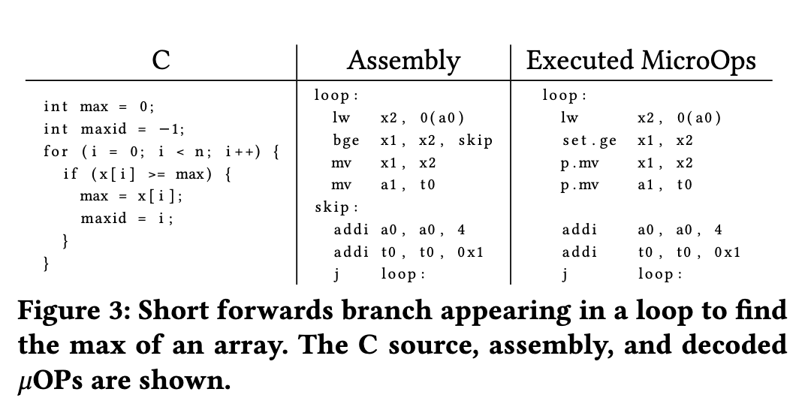
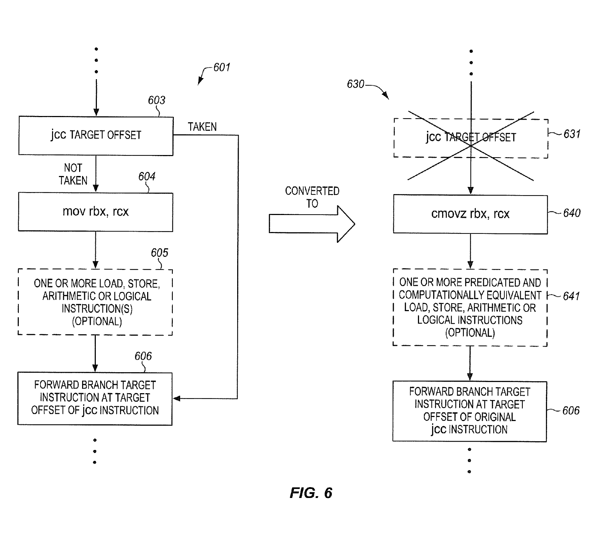
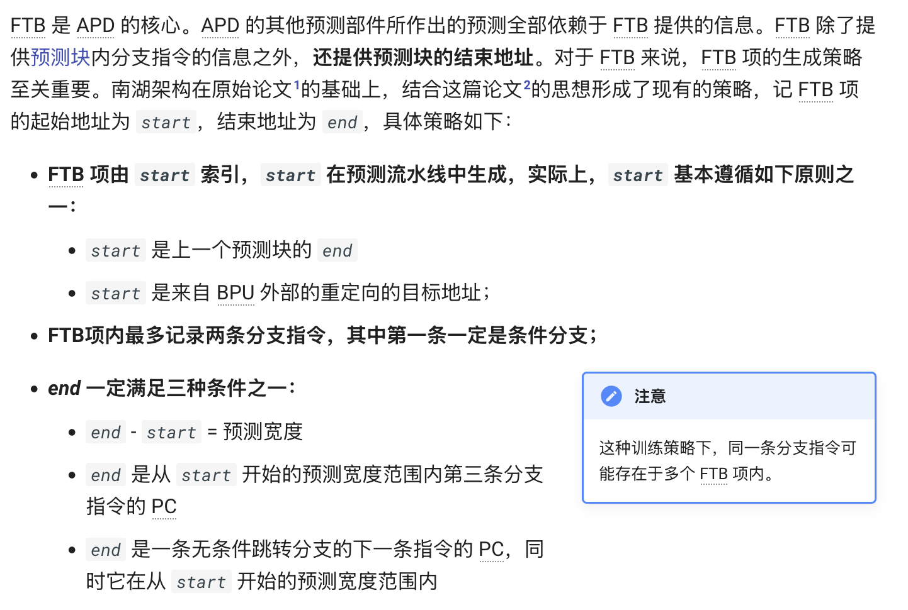
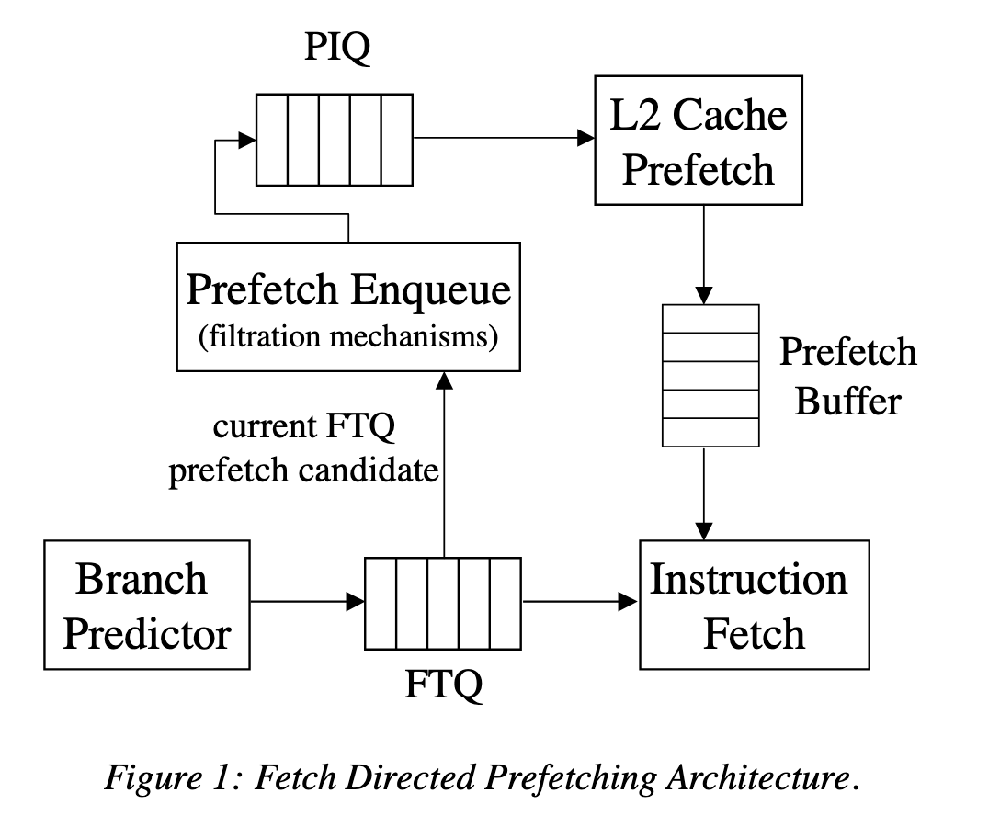

# 浅谈乱序执行 CPU（三：前端）

本文的内容已经整合到[知识库](/kb/hardware/ooo_cpu.html)中。

## 背景

这是 [浅谈乱序执行 CPU](brief-into-ooo.md) 系列博客的第三篇。

本文主要讨论处理器前端的部分。

本系列的所有文章：

- [浅谈乱序执行 CPU（一：乱序）](./brief-into-ooo.md)
- [浅谈乱序执行 CPU（二：访存）](./brief-into-ooo-2.md)
- [浅谈乱序执行 CPU（三：前端）](./brief-into-ooo-3.md)

<!-- more -->

## 处理器前端

再来分析一下乱序执行 CPU 的前端部分。以 RISC-V 为例，指令长度有 4 字节或者 2 字节两种，其中 2 字节属于压缩指令集。如何正确并高效地进行取指令译码？

首先，我们希望前端能够尽可能快地取指令，前端的取指能力要和后端匹配，比如对于一个四发射的 CPU，前端对应地需要一个周期取 `4*4=16` 字节的指令。但是，这 16 字节可能是 4 条非压缩指令，也可能是 8 条压缩指令，也可能是混合的情况。所以，这里会出现一个可能出现指令条数不匹配的情况，所以中间可以添加一个 Fetch Buffer，比如 [BOOM](https://github.com/riscv-boom/riscv-boom) 的实现中，L1 ICache 每周期读取 16 字节，然后进行预译码，出来 8 条指令，保存到 Fetch Buffer 中。这里需要考虑以下几点：首先从 ICache 读取的数据是对齐的，但是 PC 可能不是，比如中间的地址。其次，可能一个 4 字节的非压缩指令跨越了两次 Fetch，比如前 2 个字节在前一个 Fetch Bundle，后 2 个字节在后一个 Fetch Bundle；此外，每个 2 字节的边界都需要判断一下是压缩指令还是非压缩指令。一个非常特殊的情况就是，一个 4 字节的指令跨越了两个页，所以两个页都需要查询页表；如果恰好在第二个页处发生了页缺失，此时 epc 是指令的起始地址，但 tval 是第二个页的地址，这样内核才知道是哪个页发生了缺失。

其次，需要配合分支预测。如果需要保证分支预测正确的情况下，能够在循环中达到接近 100% 的性能，那么，在 Fetch 分支结尾的分支指令的同时，需要保证下一次 Fetch 已经得到了分支预测的目的地址。这个就是 BOOM 里面的 L0 BTB (1-cycle redirect)。但是，一个周期内完成的分支预测，它的面积肯定不能大，否则时序无法满足，所以 BOOM 里面还设计了 2-cycle 和 3-cycle 的比较高级的分支预测器，还有针对函数调用的 RAS（Return Address Stack）。

分支预测也有很多方法。比较简单的方法是实现一个 BHT，每个项是一个 2 位的饱和计数器，超过一半的时候增加，少于一半时减少。但是，如果遇到了跳转/不跳转/跳转/不跳转这种来回切换的情况，准确率就很低。一个复杂一些的设计，就是用 BHR，记录这个分支指令最近几次的历史，对于每种可能的历史，都对应一个 2 位的饱和计数器。这样，遇到刚才所说的情况就会很好地预测。但实践中会遇到问题：如果在写回之前，又进行了一次预测，因为预测是在取指的时候做的，但是更新 BPU 是在写回的时候完成的，这时候预测就是基于旧的状态进行预测，这时候 BHR 就会出现不准确的问题；而且写回 BPU 的时候，会按照原来的状态进行更新，这个状态可能也是错误的，导致丢失一次更新，识别的模式从跳转/不跳转/跳转/不跳转变成了跳转/跳转/跳转/不跳转，这样又会预测错误。一个解决办法是，在取指阶段，BPU 预测完就立即按照预测的结果更新 BHR，之后写回阶段会恢复到实际的 BHR 取值。论文 [The effect of speculatively updating branch history on branch prediction accuracy, revisited](https://dl.acm.org/doi/10.1145/192724.192756) 和 [Speculative Updates of Local and Global Branch History: A Quantitative Analysis](https://jilp.org/vol2/v2paper1.pdf) 讨论了这个实现方式对性能的影响。

比较容易做预测更新和恢复的是全局分支历史，可以维护两个 GHR（Global History Register），一个是目前取指令最新的，一个是提交的最新的。在预测的时候，用 GHR 去找对应的 2-bit 状态，然后把预测结果更新到 GHR 上。在预测失败的时候，把 GHR 恢复为提交的状态。如果要支持一个 Fetch Packet 中有多个分支，可以让 GHR 对应若干个 2-bit 状态，分别对应相应位置上的分支的状态，当然这样面积也会增加很多。

除了记录条件分支的跳与不跳以外，通常还可以维护 taken branch 的地址，记录这样的分支历史的 GHR 就叫做 PHR（Path History Register）。

目前比较主流的分支预测算法就是 [TAGE](https://inria.hal.science/hal-03408381/document) 了：维护多个表，每个表采取的历史长度不同，呈几何级数，使得需要比较短的历史就可以预测的分支可以更快的预热，需要比较长的历史才能预测的分支也可以有较好的准确度。比较有意思的是 TAGE 的表项分配和替换的算法，useful counter 和 altpred 的设计，以及 USE_ALT_ON_NA 的优化。为了预测间接分支，可以把目的地址放到 TAGE 的表项里，把预测方向变为预测目的地址，这种预测间接分支的 TAGE 就叫做 ITTAGE。部分实现还会给 TAGE 添加 Statistical Corrector 或者 Loop Predictor。这些算法基本统治了当今高性能的处理器设计。

我在博客 [三星 Exynos CPU 微架构学习笔记](./samsung-exynos-cpu.md) 中详细分析了 Exynos 微架构的前端设计，建议感兴趣的读者阅读。

## Short Forward Branch

论文 [SonicBOOM: The 3rd Generation Berkeley Out-of-Order Machine](https://carrv.github.io/2020/papers/CARRV2020_paper_15_Zhao.pdf) 提到了一个有意思的优化：Short Forward Branch。它面对的场景是一些小的 if 语句，在 if 的条件满足时，执行少量的指令。正常来说，这样的代码会被编译成一个 Forward 的分支，被跳过的就是 if 条件满足时要执行的代码对应的指令。如果分支比较好预测，那现有的分支预测器就可以得到很好的性能，但如果分支不好预测，例如它会依赖数据的值，并且具有一定的随机性，这时候性能就会下降。为了解决这个问题，可以用条件执行来代替分支：把分支指令替换为比较指令，然后根据比较的结果来条件执行本来可能会被跳过的指令。下面是论文中给的例子，说的比较的清晰：



比较有意思的是，这个优化是完全由硬件来做的，而不是编译器。当然了，如果编译器要做的前提是硬件支持这类标量的条件执行指令，虽然 Zicond 扩展确实提供了类似的功能，很多 RISC-V 实现还没有实现 Zicond。硬件上做的话，就不需要扩展指令集，直接在前端进行识别，当发现这种 Short Forward Branch 时，把分支指令本身改成一条 set-flag 指令，然后把分支到跳转目的地这一段的指令改为条件执行。这样就不需要进行分支预测了，无论原来的分支是否跳转，后续的这些指令都会进入流水线，看起来做了更多的事情，但很多时候反而比错误的分支预测还要快。

这个优化思路在 Intel 的专利 [Converting conditional short forward branches to computationally equivalent predicated instructions](https://patents.google.com/patent/US9367314B2/en) 也有阐述，不知道这个优化有没有实际加到 Intel 的处理器当中。专利的图 6 很好地用 X86 的指令阐述了这个优化：



Intel 在 [ISCA 2020 的论文 Auto-Predication of Critical Branches](https://ieeexplore.ieee.org/document/9138936) 中提供了一些硬件的实现思路，讨论了怎样去检测这样的化分支指令为条件执行指令的情况，如何在硬件中实现高效的条件执行，怎么避免负优化（例如去掉分支指令以后，分支预测器眼里就丢失了分支的历史；转化为条件执行以后，本来可能没有依赖的指令也变得强制有依赖了），建议有兴趣的读者阅读。

那么这样的指令序列在实际的程序里出现的多吗？论文 [The Effects of Predicated Execution on Branch Prediction](http://ieeexplore.ieee.org/document/717459/) 分析了这个问题，结论是还真不少。当然了，这篇论文主要的论点是，指令集应该引入各种条件执行指令，这样编译器就可以利用现有处理器的条件执行指令来优化，没有去讨论纯硬件的实现方法。

从 SiFive 提交给 GCC 的 [patch](https://patchwork.ozlabs.org/project/gcc/patch/20190430234741.8120-1-jimw@sifive.com/#2163277) 也可以看到，类似的优化被实装到了 SiFive 的 CPU 当中，不过这里做的会更加简单，只考虑了分支跳过一条指令的情况，这种也比较好实现，可以在现有的指令融合机制的基础上，把两条指令合成一条：

> The SiFive 7 series cores have macro fusion support to convert a branch over a
> single instruction into a conditionally executed instruction.  This adds a
> conditional move pattern, enabled only for the SiFive 7 series cores, that
> implements the initial optimization support for this feature.  This gives us
> about a 10% increase in coremark scores for this core.

SiFive 的专利 [Macro-op fusion](https://patents.google.com/patent/US10996952B2/en) 也提到了很多在 RISC-V 上实现的指令融合的优化，下面举几个例子：

```asm
    bne x1, x0, target
    add x3, x3, 1
target:
```

可以转化为：

```asm
    ifeqz_addi x3, x3, x1, 1
```

这就是上面所说的 SiFive 实现的只跳过单条指令的 Short Forward Branch，把 bne + add 指令变成了条件 add 指令，并且自带和 0 比较的逻辑：如果 x1 == 0（ifeqz，if equals to zero），就设置 x3 = x3 + 1，否则 x3 保持不变。类似地，把 add 换成 sub 也可以类似地做融合，甚至连函数调用 jal 指令也可以。

还有一个有趣的指令融合场景：

```asm
    beq x8, x9, skip
    j target
skip:
    // ...
target:
```

可以融合为：

```asm
    jne x8, x9, target
```

你可能会觉得，为什么编译器要多此一举，不直接生成一个 bne？答案是 RISC-V 的 bne 的立即数范围太小，要想跳到更大的范围，就需要用 j 指令，于是编译器只好用 beq + j 的组合来实现大范围的 bne。然后 SiFive 的处理器会识别这种模式，把它转换成一条 jne：条件分支，但又有 j 指令的 imm 跳转范围。这也挺有意思的，指令在设计的时候，不好做太多的 imm 位数，编译器因此生成了更复杂的代码，硬件再翻译回来。

苹果申请了 [Using a Next Fetch Predictor Circuit with Short Branches and Return Fetch Groups](https://patents.google.com/patent/US20240028339A1/en) 专利，它和上面提到的优化不太一样，但是有些类似。专利里提到了这么几种情况：

- 如果 Fetch Group 内有一个要跳转的分支指令会 Forward 跳转到同一个 Fetch Group 内部，原来的做法是从分支指令的目的地址再 Fetch 一次，但既然是同一个 Fetch Group，Fetch 分支指令的同时，已经把从分支的目的地址开始的指令取进来了，跳过中间的指令，把两段指令拼接起来，可以省下重新 Fetch 一次的时间。
- 如果 Fetch Group 内有一条 call 指令，在原来的做法里，call 指令之后的指令就被丢弃了，等到未来 return 回来的时候，再重新 Fetch 一次；专利里的做法是，在 call 的时候，把 call 指令之后的指令保存下来，当未来 return 回来的时候，不再重新 Fetch，而是取出保存下来的 call 指令之后的指令，这样就节省了重新 Fetch 一次的时间。

因此它的目的主要是解决重复 Fetch 的能耗问题，而不是分支预测错误率高的问题。

## Clustered Decode

推荐阅读：[解码簇二三事（一）：为什么？&加料！](https://zhuanlan.zhihu.com/p/720301269)

Intel 的 E 核从 Tremont 微架构开始实现了 Clustered Decode，从 Goldmont Plus 微架构的传统的 3-wide decode，变成了两条 3-wide decode 的流水线，加起来实现 6-wide decode 的效果。但是这两个流水线怎么协同工作呢？

Intel 在 [Software Optimization Manual](https://cdrdv2-public.intel.com/671488/248966-046A-software-optimization-manual.pdf) 中是这么描述的：

> Tremont microarchitecture has a 32B predict pipeline that feeds dual 3-wide decode clusters capable of 6 instruction decode per cycle. Each cluster can access a banked 32KB instruction cache at 16B/cycle for a maximum of 32B/cycle.

ICache 分成两个 bank，两个 bank 可以同时访问，每个 bank 提供 16B/cycle 的带宽，对应两个 decode pipeline。由于不同的 bank 可以用不同的地址的访问，这意味着这两次访问可以访问不同 cacheline 内的指令，这正好对应了指令流里有跳转的情况：

假如有一段指令（下面的指令流 A），最后一条指令会跳转到另一个地址（下面的 1: label），分支预测器在看到这个模式后，就可以让两个 decode cluster 分别处理跳转前的代码（指令流 A 内的 `dec + jne`）和跳转后的代码（指令流 B 内的 `mov`）：

```asm
# instruction stream A
dec %rsi
jne 1f

# instruction stream B
1:
mov 0(%rsp), %rdi
```

这样就在保持硬件实现比较简单的前提下，实现了比较宽的 decode width（Intel 原文：`Whereas increasing decode width in a traditional fashion for x86 requires exponential resources and triggers efficiency loss, clustering allows for x86 decode to be built with linear resources and little efficiency loss.`）。这对于 x86 来说是比较难提升的，因为指令是变长的，如果不知道指令从哪里开始，译码将会十分复杂而且串行。可以看到 ARM 阵营的高性能处理器在 decode width 上有一定的领先，也是因为 ARMv8 是定长指令集。

不过，这个方法也有一个问题：假如没有跳转的分支，怎么办？如果遇到一大段没有分支的指令，似乎就只能用上 3-wide decode，那么这很容易成为一个瓶颈。Tremont 没有解决这个问题，建议用户在这种情况下插入一些 jmp 指令。

Intel 在 Tremont 的下一代 Gracemont 微架构中缓解了这个瓶颈。既然插入一些 jmp 指令可以解决这个问题，如果由硬件自动插入一些伪 jmp 指令，也解决了同样的问题，这就是 Gracemont 的解决思路：

> Gracemont microarchitecture addresses this bottleneck by introducing a hardware load-balancer. When the hardware detects long basic blocks, additional toggle points can be created based on internal heuristics. These toggle points are added to the predictors, thus guiding the machine to toggle within the basic block.

也就是说，硬件会检测这种长的连续指令块（例如连续 32 条指令都没有一个跳转的指令），适时插入一些 toggle point（例如插到第 24 条指令后面），也就是前面说的伪 jmp 指令，这条指令并不存在，而是在分支预测器中做标记，那么未来执行的时候，就可以利用上两条 Decode Pipeline 了：

> If there are no natural toggle points (i.e., taken branches) within 32 uops, the hardware will insert a toggle point on the instruction after or corresponding to the 24th uop of the stream. As inserted toggle points consume resources in the predictor, it typically doesn't insert immediately but rather marks the location of the instruction in a table of addresses. If the same inserted toggle point is marked a second time, it allocates this location into the predictor.

此外，为了解决变长指令集的译码问题，还有一个优化：在 ICache 中标记每条指令的边界，这样译码的时候，就可以快速寻找到指令边界，从指令边界并行地进行译码，而不用先判断第一条指令有多长，再找到第二条指令在哪，再判断第二条指令有多长，再去找第三条指令。不过这个信息怎么来呢？

一种方法是在 ICache 中进行预译码（Pre-decode），当 ICache 在 refill 的时候，就进行一定的译码，把指令边界标记出来。但 x86 的指令从不同位置开始译码，得到的结果是不一样的，也因为这一点 ROP 攻击在 x86 上比较容易实现。这对于预译码也带来了困难，不知道从哪个字节开始执行。

另一种方法是等到译码的时候，先检查一下有没有指令边界的信息，如果没有，临时耗费两个周期来进行预译码的操作，把指令边界标记出来，把结果写入 ICache 中。由于此时已经从分支预测器知道了指令执行的起始地址，所以得到的结果更加精确。这个方法在 Gracemont 中采用，叫做 On Demand Instruction Length Decoder（OD-ILD），顾名思义，它的译码结果是指令的长度，也就得到了指令的边界信息：

> Instead of a second level predecode cache, the Gracemont microarchitecture introduces an “on-demand” instruction length decoder (OD-ILD). This block is typically only active when new instruction bytes are brought into the instruction cache from a miss. When this happens, two extra cycles are added to the fetch pipeline in order to generate predecode bits on the fly.

这个方法在 Intel 的专利 [Circuitry and methods for power efficient generation of length markers for a variable length instruction set](https://patents.google.com/patent/US20220100516A1/en) 有比较详细的描述。

Intel 在 Skymont 这一代 E-core 微架构在大大拓宽后端的同时，把 Decode 从两条 3-wide pipeline 改成了三条 3-wide pipeline，那么怎么把这三条 Decode pipeline 喂满，是继续延续上面的思路，只不过插入更多的 toggle point，还是有一些新的设计，让我们拭目以待。

## BTB Organization

BTB 的目的是在分支预测阶段，提供哪些指令是分支指令，以及这些分支指令的目的地址的信息。那么 BTB 是怎么保存这些信息的呢？论文 [Branch Target Buffer Organizations](https://dl.acm.org/doi/pdf/10.1145/3613424.3623774) 总结了几种常见的 BTB 组织方法：

1. 第一种方法：I-BTB，Instruction BTB，对于每个可能出现分支指令的地址，都进行一次 BTB 查询，看看这个地址是不是有分支指令。此时 BTB entry 只需要记录 tag（用于组相连的 Way 匹配）、branch type 和 branch target。以 ARMv8 为例，指令都是 4 字节，假如要对 32 字节的块进行预测，那么就要对这 32 字节的 8 个 4 字节都进行一次 BTB 查询，得到每一个位置上的分支信息。x86 的话每个字节都可能是一条分支指令，用这样的方法需要查询的次数过多。
2. 第二种方法：R-BTB，Region BTB，对于每个对齐的块，记录这个块内的有限条分支的信息，例如对每个对齐到 32 字节的块，记录最多 4 条分支。此时 BTB entry 需要记录 tag（用于组相连的 Way 匹配）、每条分支的 offset、类型 和 target。这样 BTB 查询的次数会比较少，但如果一个块内分支太多，会出现存不下的情况。
3. 第三种方法：B-BTB，Block BTB，记录的是从某个 PC 开始连续的一段指令，这段指令不能有多于 n 条分支，并且不能多于 m 条指令或 m 个字节。此时 BTB entry 需要记录 tag（用于组相连的 Way 匹配）、每条分支的 offset、类型 和 target。这种方法在分支很密集的情况下，会用多个 BTB entry 保存这些分支。此外也比较方便做 2 predictions/cycle：同时预测两个条件分支，如果第一个分支不跳转，那就用第二个分支的结果。但同一个分支可能重复保存在多个 BTB entry 中，因为入口 PC 可能不同。

下面看一些例子，例如 AMD 在 [Software Optimization Guide for AMD EPYC™ 7003 Processors](https://www.amd.com/content/dam/amd/en/documents/epyc-technical-docs/software-optimization-guides/56665.zip) 中有如下表述：

> Each BTB entry includes information for branches and their targets. Each BTB
> entry can hold up to two branches if the last bytes of the branches reside in the same 64-byte aligned
> cache line and the first branch is a conditional branch.

这和上面所说的 B-BTB 是类似的，如果两条分支在同一个 64B 对齐的 cacheline 内，并且第一条分支是条件分支，就可以保存在同一个 BTB entry 内。换句话说，一个 BTB entry 可以保存 1 到 2 条分支。

香山[南湖微架构](https://raw.githubusercontent.com/OpenXiangShan/XiangShan-doc/main/slides/20220825-RVSC-%E9%A6%99%E5%B1%B1%E5%A4%84%E7%90%86%E5%99%A8%E5%89%8D%E7%AB%AF%E5%8F%96%E6%8C%87%E6%9E%B6%E6%9E%84%E6%BC%94%E8%BF%9B.pdf)也采用了类似的[B-BTB 设计](https://docs.xiangshan.cc/zh-cn/latest/frontend/bp/)，下面是香山微架构文档的截图：



如果程序里有很多经常或者总是跳转的分支，那么上面这种 B-BTB 设计就有一些浪费，因为找不到很多条件分支 + 分支的组合，即使找到了，如果条件分支总是跳转，那么第二条分支就浪费了。为了解决这个问题，AMD 在 [Software Optimization Guide for the AMD Zen4 Microarchitecture](https://www.amd.com/content/dam/amd/en/documents/processor-tech-docs/software-optimization-guides/57647.zip) 中提到一种解决方案：

> Each BTB entry can hold up to two branches, and two pair cases are supported:
> • A conditional branch followed by another branch with both branches having their last byte in the
> same 64 byte aligned cacheline.
> • A direct branch (excluding CALLs) followed by a branch ending within the 64 byte aligned
> cacheline containing the target of the first branch.
> Predicting with BTB pairs allows two fetches to be predicted in one prediction cycle.

可以看到第一种情况就是前面 Zen 3 的模式，一个 cacheline 内，条件分支 + 分支；第二种情况就是新的设计，它可以记录两条分支指令，第二条分支指令和第一条分支指令的目的地址在同一个 cacheline 中，也就是一个 BTB 记录两条分支指令，第一条跳到第二条，第二条再跳转，在这种情况下，可以一个周期给出两个 Fetch Bundle，也就是 2 taken predictions/cycle。论文中这种设计叫做 MB-BTB。

推荐阅读：[现代分支预测：从学术界到工业界](https://blog.eastonman.com/blog/2023/12/modern-branch-prediction-from-academy-to-industry/)

## Instruction Prefetcher

随着程序的指令 footprint 增大，除了增大 L1 ICache 容量，也需要实现合理的 Instruction Prefetcher，把指令预取到 L1 ICache 当中。对于 Decoupled Frontend，目前比较常见的方法是使用 [Fetch Directed Intruction Prefetching(FDIP)](https://ieeexplore.ieee.org/document/809439)，利用 Decoupled Frontend 里分支预测可以在取指之前跑得更远的特性，使用分支预测的地址来进行预取。具体地，Decoupled Frontend 会把分支预测得到的地址写入 Fetch Target Queue(FTQ)，这些地址由 ICache 来消费。与此同时，FTQ 中的地址也会用于指令预取，结构如论文中的图 1：



对于 Coupled Frontend，预测和取指紧密相连，FDIP 的方法就不好用了，需要寻找其他的方法。

一种方法是 Call Graph Prefetching(CGP)，来自论文 [Call graph prefetching for database applications](https://ieeexplore.ieee.org/abstract/document/903270)。从名字也可以看出，它针对的是数据库场景，而这个场景下，代码的规模很大，更加容易出现 ICache Miss。

它的核心思路是，维护一个 Call Graph History Cache(CGHC) 来记录程序执行的调用图，根据历史信息来预取未来可能会执行的函数的指令，这针对的是频繁的函数调用；针对函数体比较大的情况，函数调用的比例比较小，利用 Next N-Line Prefetching，也就是在 miss 的时候把连续的几条缓存行预取进来。

那么这个 Call Graph History Cache 是怎么维护函数调用的呢？它记录了两个 Array：Tag Array 和 Data Array。Tag Array 记录的是函数的入口地址，以及在这个函数内执行到了第几个函数（Index）；Data Array 则记录了被该函数调用的函数的入口地址，最多八个。例如函数 A 会调用函数 B 和 C，那么 CGHC 会保存这么一条记录：

- Tag Array：记录函数 A 的入口地址以及 Index，Index 初始化为 1
- Data Array：记录函数 B 和 C 的地址

当前端通过分支预测，预测到要执行函数 A，那么就通过 A 的地址去查询 Tag Array，找到匹配，并且发现其 Index 等于 1；那么接着用 Index 访问 Data Array，取出第一个函数的地址，也就是 B，那就预取 B。当函数 B 被调用的时候，更新 Index 为 2，表示函数 B 已经被调用，下一个要被调用的是 C。当函数 B 返回的时候，用 Index 访问 Data Array，得到函数 C 的地址，预取 C。如果说 Call Graph 是个图，那么 Tag Array 和 Data Array 就组成了邻接表。

苹果的专利 [Callgraph Signature Prefetch](https://patentimages.storage.googleapis.com/4d/f2/31/acf69ce6f289ff/US10642618.pdf) 使用了类似的思想，不过在维护 Call Graph 的方式上不同：上面的论文是通过显式的方法记录 Call Graph，每个函数调用了哪些函数，而专利中，参考了分支预测记录分支历史的方法，把最近的 call 和 return 地址压缩记录下来，通过 hash 得到 Signature，再用 Signature 去查询 Prefetch Table，相当于在拿最近若干次调用和返回的历史来预测下一次 call 的地址。Prefetch Table 的每个 Entry 记录了这些信息：

- Signature：记录了这个 Entry 对应的 Signature，即最近函数调用的压缩表示；实际可能实现为全相连，也可能是组相连，通过 tag 匹配
- Address：要预取的指令地址；专利中还谈到了 Address 的压缩，即把 Address 的高位单独存放在一个 Address Table 中，那么 Prefetch Table 的 Entry 记录了 Address Table 的 Index 以及低位 Offset，需要预取时，再从 Address Table 读取高位，拼接起来
- Counter：给从 Address 开始的若干个缓存行维护 Saturating Counter，用来判断是否要进行预取
- Order：用来维护 Replacement Policy 所需要的信息

那么前端要做的事情就是，根据分支预测去更新 Signature，根据 Signature 查询 Prefetch Table，如果有命中，根据 Counter 的大小决定是否要预取，从 Address 开始预取哪些数据。

## Championship Branch Prediction

针对分支方向预测，曾经办过 5 届的 Championship Branch Prediction 竞赛，最后一次是 2016 年的 CBP-5，网站是 [Championship Branch Prediction (CBP-5)](https://jilp.org/cbp2016/)。其文件可以从下列地址得到：

- https://web.archive.org/web/20220814115014/http://hpca23.cse.tamu.edu/cbp2016/cbp2016.final.tar.gz
- https://web.archive.org/web/20190907061905/http://hpca23.cse.tamu.edu/cbp2016/MD5SUM.txt
- https://drive.google.com/drive/folders/1VAdmqdOEFLvnRKkQQidxvGJA_C6S2RWo 来自 https://github.com/craymichael/CBP-16-Simulation

后续还有一些论文也是在 CBP2016 的环境下进行的测试。
