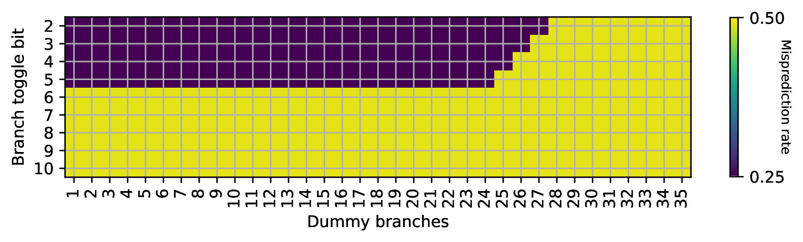
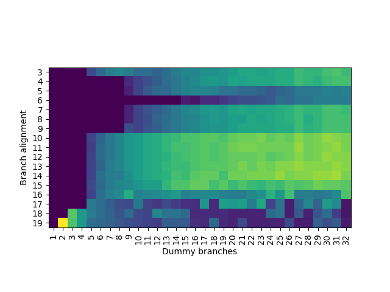

# 条件分支预测器逆向工程（以 Apple M1 Firestorm 为例）

## 背景

去年我完成了针对 Apple 和 Qualcomm 条件分支预测器（Conditional Branch Predictor）的逆向工程研究，相关论文已发表在 [arXiv](https://arxiv.org/abs/2411.13900) 上，并公开了[源代码](https://github.com/jiegec/cpu-micro-benchmarks)。考虑到许多读者对处理器逆向工程感兴趣，但可能因其复杂性而望而却步，本文将以 Apple M1 Firestorm 为例，详细介绍条件分支预测器的逆向工程方法，作为对原论文的补充说明。

<!-- more -->

## 背景知识

首先介绍一些背景知识。要逆向工程条件分支预测器，需要先了解其工作原理。条件分支预测器的基本思路是：

- 条件分支的跳转行为（跳转或不跳转）通常是高度可预测的
- 预测器的输入包括条件分支的地址，以及近期执行的若干条分支的历史记录；输出则是预测该条件分支是否跳转

为了在硬件上实现这一算法，处理器会维护一个预测表，表中每一项包含一个 2 位饱和计数器，用于预测跳转方向。查表时，系统会对条件分支地址以及近期执行的分支历史进行哈希运算，使用哈希结果作为索引读取表项，然后根据计数器的值来预测分支的跳转方向。


（图源：CMU ECE740 Computer Architecture: Branch Prediction）

目前主流处理器普遍采用 [TAGE](https://inria.hal.science/hal-03408381/document) 预测器，它在上述基础查表方法的基础上进行了重要改进：

1. 观察到不同分支的预测所需的历史长度各不相同：有些分支无需历史信息即可准确预测，有些依赖近期分支的跳转结果，而有些则需要更久远的历史信息；
2. 分支历史越长，可能的路径组合就越多，导致预测器训练过程变慢，训练期间的预测错误率较高，因此希望尽快收敛；
3. 为满足不同分支对历史长度的需求，TAGE 设计了多个预测表，每个表使用不同长度的分支历史。多个表同时进行预测，当多个表都提供预测结果时（仅在 tag 匹配时提供预测），选择使用最长历史长度的预测结果。


（图源：[Half&Half: Demystifying Intel's Directional Branch Predictors for Fast, Secure Partitioned Execution](https://cseweb.ucsd.edu/~tullsen/halfandhalf.pdf)）

因此，要逆向工程处理器的条件分支预测器，需要完成以下工作：

1. 确定分支历史的记录方式：通常涉及分支地址和目的地址，通过一系列移位和异或操作，将结果存储在寄存器中；
2. 确定 TAGE 算法的具体实现：包括表的数量、每个表的大小、索引方式以及使用的分支历史长度。

## 分支历史的逆向

第一步是逆向工程处理器记录分支历史的方式。传统教科书方法使用一个寄存器，每当遇到条件分支时记录其跳转方向（跳转记为 1，不跳转记为 0），每个分支占用 1 bit。然而，现代处理器（包括 Intel、Apple、Qualcomm、ARM 和部分 AMD）普遍采用 [Path History Register](https://ieeexplore.ieee.org/document/476809/) 方法。这种方法设计一个长度为 $n$ 的寄存器 $\mathrm{PHR}$，每当遇到跳转分支（包括条件分支和无条件分支）时，将寄存器左移，然后将当前跳转分支的地址和目的地址通过哈希函数映射，将哈希结果异或到移位寄存器中。用数学公式表示为：

$\mathrm{PHR}_{\mathrm{new}} = (\mathrm{PHR}_{\mathrm{old}} \ll \mathrm{shamt}) \oplus \mathrm{footprint}$

其中 $\mathrm{footprint}$ 是通过分支地址和目的地址计算得到的哈希值。接下来的任务是确定 $\mathrm{PHR}$ 的位宽、每次左移的位数，以及 $\mathrm{footprint}$ 的计算方法。

### 历史长度

首先分析这个更新公式：它将最近的 $\lceil n / \mathrm{shamt} \rceil$ 条跳转分支的信息压缩存储在 $n$ 位的 $\mathrm{PHR}$ 寄存器中。随着移位操作的累积，更早的分支历史信息对 $\mathrm{PHR}$ 的贡献最终会变为零。

第一个实验的目标是确定 $\mathrm{PHR}$ 能够记录多少条最近分支的历史。具体方法是构建一个分支历史序列：

1. 第一个条件分支：以 50% 的概率随机跳转或不跳转；
2. 中间插入若干条无条件分支；
3. 最后一个条件分支：跳转方向与第一个条件分支相同。

接下来分析两种情况：

1. 如果在预测最后一个条件分支时，分支历史 $\mathrm{PHR}$ 仍然包含第一个条件分支的信息，预测器应该能够准确预测最后一个条件分支的方向；
2. 如果中间的无条件分支数量足够多，使得第一个条件分支的跳转信息对预测最后一个条件分支时的 $\mathrm{PHR}$ 没有影响，预测器只能以 50% 的概率进行正确预测。

通过构造上述程序，调整中间无条件分支的数量，并使用性能计数器统计分支预测错误率，可以找到一个临界点。当无条件分支数量超过这个阈值时，第二个条件分支的错误预测率会从 0% 上升到 50%。这个临界点对应 $\mathrm{PHR}$ 能够记录的分支历史数量，即 $\lceil n / \mathrm{shamt} \rceil$。

经过[测试](https://github.com/jiegec/cpu-micro-benchmarks/blob/master/src/phr_size_gen.cpp)：


```csv
# 第一列：第二步插入的无条件分支数量加一
# 第二列到第四列：分支预测错误概率的 min/avg/max
# 第五列：每次循环的周期数
size,min,avg,max,cycles
97,0.00,0.00,0.01,216.87
98,0.00,0.00,0.01,221.02
99,0.00,0.00,0.01,225.18
100,0.00,0.00,0.01,229.17
101,0.45,0.50,0.53,331.97
102,0.47,0.50,0.54,336.27
103,0.46,0.50,0.54,339.85
```

测试结果表明阈值为 100：在 Apple M1 Firestorm 上，最多可以记录最近 100 条分支的历史信息。

??? question "分支预测错误率是怎么测量的？"

    处理器内置了性能计数器，会记录分支预测错误次数。在 Linux 上，可以用 perf 子系统来读取；在 macOS 上，可以用 kpep 私有 API 来获取。我开源的代码中对这些 API 进行了[封装](https://github.com/jiegec/cpu-micro-benchmarks/blob/master/src/utils.cpp)，可以实现跨平台的性能计数器读取。更进一步，我们还逆向了 Qualcomm Oryon 的针对条件分支的预测错误次数的隐藏性能计数器，用于后续的实验。

### 分支地址 B 的贡献

接下来需要推测 $\mathrm{footprint}$ 的计算方法，即分支地址和目的地址如何参与 $\mathrm{PHR}$ 的更新过程。约定分支地址记为 $B$（Branch 的首字母），目的地址记为 $T$（Target 的首字母），用 $B[i]$ 表示分支地址从低到高第 $i$ 位（下标从 0 开始）的值，$T[i]$ 同理。假设 $\mathrm{footprint}$ 的每一位都由若干个 $B[i]$ 和 $T[i]$ 通过异或运算得到。

??? question "分支指令本身占用了多个字节，那么分支地址指的是哪一个字节的地址呢？"

    经过测试，AMD64 架构下，分支地址用的是分支指令最后一个字节的地址，而 ARM64 架构下，分支地址用的是分支指令第一个字节的地址。这大概是因为 AMD64 架构下分支指令是变长的，并且可以跨越页的边界；ARM64 则是定长的，并且不会跨越页的边界。

设计以下程序来推测某个 $B[i]$ 如何参与 $\mathrm{footprint}$ 的计算：

1. 根据上面的分析，Apple M1 Firestorm 最多可以记录最近 100 条分支的历史信息，为了让 $\mathrm{PHR}$ 进入一个稳定的初始值，执行 100 个无条件分支；
2. 设计两条分支指令，第一条是条件分支，按 50% 的概率跳或不跳；第二条是无条件分支；这两条分支的分支地址只在 $B[i]$ 上不同，其余的位都相同，目的地址相同；
3. 执行若干条无条件分支，目的是把 $B[i]$ 对 $\mathrm{PHR}$ 的贡献向前移动；
4. 执行一条条件分支指令，其跳转方向与第二步中条件分支的方向一致。

对应的代码如下：

```c
// step 1.
// 100 jumps forward
goto jump_0;
jump_0: goto jump_1;
// ...
jump_98: goto jump_99;
jump_99:

// step 2.
int d = rand();
// the follow two branches differ in B[i]
// first conditional branch, 50% taken or not taken
if (d % 2 == 0) goto target;
// second unconditional branch
else goto target;
target:

// step 3.
// variable number of jumps forward
goto varjump_0;
varjump_0: goto varjump_1;
// ...
varjump_k: goto last;

// step 4.
// conditional branch
last:
if (d % 2 == 0) goto end;
end:
```

第二步中条件分支跳转与否，会影响分支历史中 $B[i]$ 一个位的变化，它会经过哈希函数，影响 $\mathrm{footprint}$，进而异或到 $\mathrm{PHR}$ 中。通过调整第三步执行的无条件分支个数，可以把 $B[i]$ 对 $\mathrm{PHR}$ 的影响左移到不同的位置。如果 $B[i]$ 对 $\mathrm{PHR}$ 造成了影响，就可以正确预测最后一条条件分支指令的方向。当左移次数足够多时，$B[i]$ 对 $\mathrm{PHR}$ 的贡献会变为零，此时对最后一条条件分支指令的方向预测只有 50% 的正确率。在 Apple M1 Firestorm 上[测试](https://github.com/jiegec/cpu-micro-benchmarks/blob/master/src/phr_branch_bits_location_gen.cpp)，得到如下结果：



横坐标 `Dummy branches` 指的是上面第三步插入的无条件分支的个数，纵坐标 `Branch toggle bit` 代表修改的是具体哪一个 $B[i]$，颜色对应分支预测的错误率，浅色部分对应最后一条分支只能正确预测 50%，深色部分对应最后一条分支总是可以正确预测。

从这个图可以得到什么信息呢？首先观察 $B[2]$ 对应的这一行，可以看到它确实参与到了 $\mathrm{PHR}$ 的计算中，但是仅仅经过 28 次移位，这个贡献就被移出了 $\mathrm{PHR}$，为了保留在 $\mathrm{PHR}$ 内，最多移动 27 次。类似地，在移出 $\mathrm{PHR}$ 之前，$B[3]$ 最多移动 26 次，$B[4]$ 最多移动 25 次，$B[5]$ 最多移动 24 次。

但实际上，这些 $B$ 是同时进入 $\mathrm{PHR}$ 的：这暗示它们对应 $\mathrm{footprint}$ 的不同位置。如果某个 $B[i]$ 出现在 $\mathrm{footprint}$ 更高位的地方，它也会进入 $\mathrm{PHR}$ 更高位，经过更少的移位次数就会被移出 $\mathrm{PHR}$；反之，如果 $B[i]$ 出现在 $\mathrm{footprint}$ 更低位的地方，它能够在 $\mathrm{PHR}$ 中停留更长的时间。

根据上面的实验，可见 $B[5], B[4], B[3], B[2]$ 参与到了 $\mathrm{footprint}$ 计算中，而 $B$ 的其他位则没有。但比较奇怪的是，$\mathrm{PHR}$ 理应可以记录最近 100 条分支的信息，但实际上只观察到了 28。所以一定还有其他的信息。

### 目的地址 T 的贡献

刚刚测试了 $B$，接下来测试 $T$ 各位对 $\mathrm{PHR}$ 的贡献，方法类似：

1. 为了让 $\mathrm{PHR}$ 进入一个稳定的初始值，执行 100 个无条件分支；
2. 设计一个间接分支，根据随机数，随机跳转到两个不同的目的地址，这两个目的地址只在 $T[i]$ 上不同，其余的位都相同，分支地址相同；
3. 执行若干条无条件分支，目的是把 $T[i]$ 对 $\mathrm{PHR}$ 的贡献向前移动；
4. 执行一条条件分支指令，其跳转方向取决于第二步中间接分支所使用的随机数。

对应的代码如下：

```c
// step 1.
// 100 jumps forward
goto jump_0;
jump_0: goto jump_1;
// ...
jump_98: goto jump_99;
jump_99:

// step 2.
int d = rand();
// indirect branch
// the follow two targets differ in T[i]
auto targets[2] = {target0, target1};
goto targets[d % 2];
target0:
// add many nops
target1:

// step 3.
// variable number of jumps forward
goto varjump_0;
varjump_0: goto varjump_1;
// ...
varjump_k: goto last;

// step 4.
// conditional branch
last:
if (d % 2 == 0) goto end;
end:
```

在 Apple M1 Firestorm 上[测试](https://github.com/jiegec/cpu-micro-benchmarks/blob/master/src/phr_target_bits_location_gen.cpp)，得到如下结果：


??? question "为了测试 T[31]，岂不是要插入很多个 NOP，一方面二进制很大，其次还要执行很长时间？"

    是的，所以这里在测试的时候，采用的是类似 JIT 的方法，通过 mmap `MAP_FIXED` 在内存中特定位置分配并写入代码，避免了用汇编器生成一个巨大的 ELF。同时，为了避免执行大量的 NOP，考虑到前面已经发现 $B[6]$ 或更高的位没有参与到 $\mathrm{PHR}$ 计算中，所以可以添加额外的一组无条件分支来跳过大量的 NOP，它们的目的地址相同，分支地址低位相同，因此对 PHR 不会产生影响。对应的代码如下：

    ```c
    // step 1.
    // 100 jumps forward
    goto jump_0;
    jump_0: goto jump_1;
    // ...
    jump_98: goto jump_99;
    jump_99:

    // step 2.
    int d = rand();
    // indirect branch
    // the follow two targets differ in T[i]
    auto targets[2] = {target0, target1};
    goto targets[d % 2];
    target0:
    // skip over nops, while keeping B[5:2]=0
    goto target2;
    // add many nops
    target1:
    goto target2;

    target2:

    // step 3.
    // variable number of jumps forward
    goto varjump_0;
    varjump_0: goto varjump_1;
    // ...
    varjump_k: goto last;

    // step 4.
    // conditional branch
    last:
    if (d % 2 == 0) goto end;
    end:
    ```

由此我们终于找到了分支历史最长记录 100 条分支的来源：$T[2]$ 会经过 $\mathrm{footprint}$ 被异或到 $\mathrm{PHR}$ 的最低位，然后每次执行一个跳转分支左移一次，直到移动 100 次才被移出 $\mathrm{PHR}$。类似地，$T[3]$ 只需要 99 次就能移出 $\mathrm{PHR}$，说明 $T[3]$ 被异或到了 $\mathrm{PHR}[1]$。依此类推，可以知道涉及 $T$ 的 $\mathrm{footprint} = T[31:2]$，其中 $T[31:2]$ 代表一个 30 位的数，每一位从高到低分别对应 $T[31], T[30], \cdots, T[2]$。

### 小结

那么问题来了，前面测试 $B$ 的时候，移位次数那么少，明显少于 $T$ 的移位次数。这有两种可能：

1. 硬件上只有一个 $\mathrm{PHR}$ 寄存器，$T[31:2]$ 被异或到 $\mathrm{PHR}$ 的低位，而 $B[5:2]$ 被异或到 $\mathrm{PHR}$ 的中间位置；
2. 硬件上有两个 $\mathrm{PHR}$ 寄存器，其中一个是 100 位，它的 $\mathrm{footprint} = T[31:2]$，记为 $\mathrm{PHRT}$；另一个是 28 位，它的 $\mathrm{footprint} = B[5:2]$，记为 $\mathrm{PHRB}$。

经过后续的测试，基本确认硬件实现的是第二种。用数学公式表达：

$\mathrm{PHRT}_{\mathrm{new}} = (\mathrm{PHRT}_{\mathrm{old}} \ll 1) \oplus \mathrm{T}[31:2]$

$\mathrm{PHRB}_{\mathrm{new}} = (\mathrm{PHRB}_{\mathrm{old}} \ll 1) \oplus \mathrm{B}[5:2]$

有意思的是，在我的论文发表后不久，Apple 公开的专利 [Managing table accesses for tagged geometric length (TAGE) load value prediction](https://patents.google.com/patent/US12159142B1/en) 中就出现了相关表述，证明了逆向结果的正确性。

按照这个方法，我还逆向工程了 Apple、Qualcomm、ARM 和 Intel 的多代处理器的分支历史记录方法，[并进行了公开](https://jia.je/cpu/cbp.html)，供感兴趣的读者阅读，也欢迎读者将测试代码移植到更多处理器上，并贡献逆向工程的结果。

## TAGE 表的逆向

接下来，我们将目光转向 TAGE 表的逆向工程。TAGE 表与缓存结构类似，也是一个多路组相连的结构，通过 index 访问若干路，然后对每一路进行 tag 匹配，匹配正确的那一路提供预测。TAGE 在预测时，输入是历史寄存器，即上面逆向得到的 $\mathrm{PHRT}$ 和 $\mathrm{PHRB}$，以及分支地址，目前这两个输入都是可控的。为了避免多个表同时提供预测，首先逆向工程使用分支历史最长的表的参数：它的容量是多少，index 如何计算，tag 如何计算，以及几路组相连。

如何确保使用分支历史最长的表提供预测呢？其实还是利用分支历史的特性，将随机数注入到 $PHRT$ 中，例如前面的间接分支，让两个目的地址只在 $T[2]$ 上不同：

```c
// add some unconditional jumps to reset phr to some constant value
// 100 jumps forward
goto jump_0;
jump_0: goto jump_1;
// ...
jump_98: goto jump_99;
jump_99:

// inject
int d = rand();
// indirect branch
// the follow two targets differ in T[2]
auto targets[2] = {target0, target1};
goto targets[d % 2];
target0:
// add nop here
target1:

// add some unconditional jumps to shift the injected bit left
goto varjump_0;
varjump_0: goto varjump_1;
// ...
varjump_k: goto last;
last:
```

根据前面的分析，$T[2]$ 会被异或到 $\mathrm{PHRT}$ 的最低位上，每执行一次无条件分支，就左移一位。因此，通过若干个无条件分支，可以把 `d % 2` 这个随机数注入到 $\mathrm{PHRT}$ 的任意一位上。之后我们还会很多次地进行这种随机数的注入。

把随机数注入到 $\mathrm{PHRT}$ 高位以后，再预测一个根据随机数跳转或不跳转的分支，就可以保证它只能由使用分支历史最长的表来进行预测。

### 逆向工程 PC 输入

首先，我们希望推断 PC 如何参与到 index 或 tag 计算中。通常，TAGE 只会采用一部分 PC 位参与 index 或 tag 计算。换句话说，如果两个分支在 PC 上不同的部分没有参与 index 或 tag 计算，那么 TAGE 无法区分这两条分支。如果这两个分支跳转方向相反，并且用相同的 PHR 进行预测，那么一定会出现错误的预测。思路如下：

1. 用 100 个无条件分支，保证 PHR 变成一个确定的值；
2. 注入随机数 `d % 2` 到 PHRT，并移动到高位（例如 $PHRT[99]$），使用前面所述的方法；
3. 执行两个条件分支，它们在分支地址上只有一位 $PC[i]$ 不同，它们的跳转条件相反，当第一个条件分支不跳转的时候，会执行第二个条件分支，它总是会跳转。

对应代码类似于：

```c
// step 1. inject phrt
int d = rand();
inject_phrt(d % 2, 99);

// step 2. a pair of conditional branches with different direction
// their PC differs in one bit
if (d % 2 == 0) goto end;
if (d % 2 == 1) goto end;

end:
```

经过测试，PC 的输入是 $PC[18:2]$，其余的没有。

### 逆向工程相连度和 index 函数的 PC 输入

接下来是比较复杂的一步，同时逆向工程表的相连度和 index 函数的 PC 输入。这是因为这两部分是紧密耦合的：只有知道相连度，才能知道预测出来的分支数对应几个 set；但不知道 index 函数，又无法控制分支被分配到几个 set 中。首先，为了避免 PHR 的干扰，还是只注入一个随机数到 $PHRT[99]$ 上（事实上，$PHRT[99]$ 不是随便选择的，而是需要在 index 函数中，但通过测试可以找到满足要求的位）。其次，构造一系列分支，它们的地址满足：第 i 条分支（i 从 0 开始）的分支地址是 $i2^k$，其中 $k$ 是接下来要遍历的参数。当 $k=3$ 时，分支会被放到 `0x0, 0x8, 0x10, 0x18, 0x20` 等地址，涉及的 PC 位数随着分支数的增加而增加。接下来，我们分类讨论：

- 假如涉及的 PC 位都在 tag 中，没有出现在 index 中：那么这些分支都会被映射到同一个 set 内，一旦分支数量超出相连度，就会出现预测错误。
- 假如涉及的 PC 位有一部分出现在 index 中：那么每有一个 PC 位出现在 index 中，这些分支可以被分配到的 set 数量就翻倍，直到这些 set 都满了以后，才会出现预测错误。
- 假如涉及的 PC 位有一部分超出 PC 输入的范围（如前面逆向工程得到的 $PC[18:2]$）：那么超出输入的部分地址会被忽略，使得 set 内出现冲突。

[实验](https://github.com/jiegec/cpu-micro-benchmarks/blob/master/src/pht_associativity_gen.cpp)结果如下图：



纵坐标就是上面的 $k$，横坐标是测试的条件分支数，颜色表示预测的错误率。当颜色从深色变浅，就说明出现了预测错误。观察：

- $PC[3]$ 的情况下，只能预测 4 个分支，而 $PC[4]$ 或 $PC[5]$ 可以预测 8 个分支，暗示了四路组相连，然后 $PC[4]$ 和 $PC[5]$ 对应到了两个 set，所以能够正确预测 8 个分支。
- $PC[6]$ 的情况下，可以预测 16 个分支，对应 4 个 set；后续 $PC[7]$ 和 $PC[8]$ 又可以预测 8 个分支，对应 2 个 set；意味着 $PC[6]$ 在 index 中，给 $PC[4]$ 和 $PC[5]$ 提供了两倍的 set；$PC[9]$ 在 index 中，给 $PC[6]$、$PC[7]$ 和 $PC[8]$ 提供了两倍的 set。
- 后续更高的 PC 位，没有受到 index 函数的影响，因此都是 4，直到最后超出 PC 输入范围。

这就说明它是四路组相连，PC[6] 和 PC[9] 参与到了 index 函数中。

下面给读者一个小练习，下面是在 Qualcomm Oryon 上测得的结果，可以看到噪声比较大，你能推断出它是几路组相连，有哪些 PC 参与到了 index 计算吗？


??? question "揭晓答案"

    四路组相连，$PC[6]$ 和 $PC[7]$ 参与到了 index 函数。

那么，这种测试是怎么构造的呢？即需要用相同的 PHR 去预测 $PC=i2^k$ 的多条分支。思路比较复杂：

1. 首先执行一条间接分支，目的地址是 $i2^{k-1}$，那么它对 PHRT 的贡献是 $\mathrm{PHRT}_1 = (\mathrm{PHRT}_0 \ll 1) \oplus (i2^{k-3})$；
2. 接下来，在 $i2^{k-1}$ 的位置，再执行一条直接分支，目的地址是 $i2^k$，那么它对 PHRT 的贡献是 $\mathrm{PHRT}_2 = (\mathrm{PHRT}_1 \ll 1) \oplus (i2^{k-2}) = (((\mathrm{PHRT}_0 \ll 1) \oplus (i2^{k-3})) \ll 1) \oplus (i2^{k-2}) = \mathrm{PHRT}_0 \ll 2$。

可见经过两步以后，PHRT 是保持不变的。针对 PHRB，只要 $i2^{k-1}$ 没有涉及 $PC[5:2]$，就能保证相同。那么如果 $k$ 足够小，也有办法：

1. 首先执行一条间接分支，目的地址是 $i2^{k-1}$；
2. 接下来执行大量的 NOP，使得 $B$ 的低位等于 0，然后再执行一条间接分支，目的地址是 $i2^k$。

因此我们总是可以通过两次分支，实现用相同的 PHR 预测不同 PC 上的多条分支。

### 逆向工程 tag 函数

接下来，进行 tag 函数的逆向工程。为了逆向工程 tag 函数，我们希望找到两个位在 tag 函数中有异或关系，那么如果这两个位同时设为 0，或者同时设为 1，其异或结果都等于 0，使得计算出来的 tag 函数相同，如果此时 index 还相同，那么预测器就无法区分这两种情况。

为了利用这一点，生成两个 0 到 1 的随机数 $k$ 和 $l$，分别把它们注入到 PC、PHRB 或者 PHRT 中，去预测一个条件分支，其跳转与否取决于 $k$ 的值（论文中有个小 typo）。如果 $k$ 和 $l$ 在 tag 函数中有异或关系，那么预测器总会预测错误。

实验结果大致如下，横纵坐标表示注入哪一个位，颜色代表预测错误率，深色意味着预测错误，也就是找到了一组异或关系：


其中有一些异或关系，因为对应的位在 index 中出现的缘故，导致没有显现出来。根据已知的异或关系外推，可以得到如下的 tag 计算公式：

- PC[7] xor PHRT[0,12,...,96] xor PHRB[8,21]
- PC[8] xor PHRT[1,13,...,97] xor PHRB[9,22]
- PC[9] xor PHRT[2,14,...,98] xor PHRB[10,23,24]
- PC[10] xor PHRT[3,15,...,87,99] xor PHRB[11,12,25]
- PC[11] xor PHRT[4,16,...,88] xor PHRB[0,13,26]
- PC[12] xor PHRT[5,17,...,89] xor PHRB[1,14,27]
- PC[13] xor PHRT[6,18,...,90] xor PHRB[2,15]
- PC[14] xor PHRT[7,19,...,91] xor PHRB[3,16]
- PC[15] xor PHRT[8,20,...,92] xor PHRB[4,17]
- PC[16] xor PHRT[9,21,...,93] xor PHRB[5,18]
- PC[17] xor PHRT[10,22,...,94] xor PHRB[6,19]
- PC[18] xor PHRT[11,23,...,95] xor PHRB[7,20]
- PC[2:5]: 单独出现，不和其他位异或

那么，这里是怎么实现针对 PC、PHRT 和 PHRB 的注入的呢？针对 PHRT 的注入前面已经提到过，只需要一个间接分支：

```c
// target differs in T[2]
auto targets[2] = {target0, target1};
goto targets[d % 2];
target0:
// add nop
target1:
```

PHRB 的注入就比较复杂了，例如要注入 $B[2]=k$，我们需要进行三次分支的跳转：

1. 第一次跳转，$B$ 相同，$T[2]=k$；
2. 第二次跳转，$B[2]=k$，$T[3]=k$；
3. 第三次跳转，$B[2]=B[3]=k$, $T$ 相同。

经过计算，可以发现前两次跳转对 PHRT 的抵消，第二次跳转的 $B[2]$ 与第三次跳转的 $B[3]$ 抵消，最后相当于只有最后一次跳转的 $B[2]=k$ 对 PHRB 产生了贡献。

最复杂的是 PC 的注入，这次需要分情况讨论：

第一种情况是，要注入的 PC 位比较高，具体来说，是 $PC[7]$ 或者更高的位数，此时我们可以很容易地避免引入对 PHRB 的贡献，因为它只考虑 $B[5:2]$：

1. 第一次跳转，$B$ 相同，$T[6]=k$；
2. 第二次跳转，$B[6]=k$ 但对 PHRB 没有贡献，$T[7]=k$。

那么两次跳转完以后，PHRB 不变，PHRT 的贡献被抵消掉，同时实现了 $PC[7]=k$ 的注入。

第二种情况是，要注入的正好是 $PC[6]$，继续用上面的方法会发现 PHRB 无法抵消，这时候，需要引入第三次跳转：

1. 第一次跳转，$B$ 相同，$T[3]=k$； 
2. 第二次跳转，$B[3]=k$，$T[5]=T[4]=k$；
3. 第三次跳转，$B[4]=k$，$T[6]=k$。

验算可以发现，PHRB 和 PHRT 的贡献全都被抵消，成功注入 $PC[6]=k$。

最后来看要注入的 PC 更低的情况，例如要注入 $PC[3]=k$，还是用三次跳转：

1. 第一次跳转，$B$ 相同，$T[2]=k$； 
2. 第二次跳转，$B[2]=k$，$T[2]=T[3]=k$；
3. 第三次跳转，$B[3]=k$，$T[3]=k$。

这样就成功注入 $PC[3]=k$。

那么 PC 的注入就完成了，只有 $PC[2]$ 没有找到合适的方法来注入。

### 逆向工程 index 函数

相连度和 tag 函数已知，接下来，让我们逆向工程最后的 index 函数。逆向工程的思路如下：

1. 通过前面的逆向工程，发现 $PC[5:2]$ 是独立出现在 tag 函数中，并且没有出现在 index 中，所以我们可以构造出多个分支，它们的 tag 不同；
2. 进一步，构造两组条件分支，每组都有四个条件分支，因为是四路组相连，如果这两组分别映射到两个 set 中，就可以正确预测；反之，如果被映射到同一个 set 中，就会预测错误；
3. 和之前类似，向 PC、PHRB 或 PHRT 注入两个随机数 $k$ 和 $l$，然后预测两组共八个条件分支，这些条件分支的跳转方向都是 `k xor l`；
4. 如果 $k$ 和 $l$ 注入的位同时出现在 index 函数中，但是没有异或关系，那么这八个条件分支可以正确地被预测；
5. 如果 $k$ 和 $l$ 注入的位同时出现在 index 函数中，并且有异或关系，那么这八个条件分支会被映射到同一个 set 内，最多只能正确预测其中四个分支；
6. 如果 $k$ 和 $l$ 注入的位至少出现一个在 tag 函数中，那么一个分支会在同一个 set 内占用两项，导致最多只能正确预测其中两个分支。

注入 $PC[9]$ 和 $PHRT[i]$ 的[实验](https://github.com/jiegec/cpu-micro-benchmarks/blob/master/src/pht_index_bits_xor.cpp)结果如下：


结合上面的讨论，可以知道：

- PC[9] 和 PHRT[38] 和 PHRT[88] 有异或关系
- PHRT[2]、PHRT[12]、PHRT[17]、PHRT[22]、PHRT[27]、PHRT[33]、PHRT[43]、PHRT[53]、PHRT[58]、PHRT[63]、PHRT[68]、PHRT[73]、PHRT[78]、PHRT[83]、PHRT[93] 在 index 中，但是和 PC[9] 没有异或关系

实际上还有 PHRT[7] 和 PHRT[48] 也在 index 中，但实际上测试的时候为了保证历史最长的表提供预测，还额外注入了 PHRT[99]，它与 PHRT[7] 和 PHRT[48] 有异或关系，所以在上图没有显现出来。

用类似的方法，去测试 PHRT 与 PHRT、PHRT 与 PHRB、PHRB 与 PHRB 之间的异或关系，就可以找到最终的 index 函数：

- PHRT[2] xor PHRT[43] xor PHRT[93]
- PHRT[7] xor PHRT[48] xor PHRT[99]
- PHRT[12] xor PHRT[63] xor PHRB[5]
- PHRT[17] xor PHRT[68] xor PHRB[10]
- PHRT[22] xor PHRT[73] xor PHRB[15]
- PHRT[27] xor PHRT[78] xor PHRB[20]
- PHRT[33] xor PHRT[83] xor PHRB[25]
- PHRT[38] xor PHRT[88] xor PC[9]
- PHRT[53] xor PHRT[58] xor PHRB[0]
- PC[6]

至此使用分支历史最长的表的逆向就完成了。接下来讨论一下，如何逆向工程分支历史更短的表。

### 逆向工程使用分支历史更短的 TAGE 表

前面提到，TAGE 在预测时，会选取提供预测的多个表中使用历史最长的那个表。那么，如果要测试使用历史第二长的表，应该怎么办呢？我们尝试了以下方法：

- 在使用历史更长的表里，预先插入一些表项，再去测试历史较短的表的情况，由于 TAGE 会利用它的 useful 计数器来进行新表项的分配，当历史更长的表里的表项的 useful 不为零，可以防止它被覆盖成新的内容，逼迫 TAGE 用历史更短的表来进行预测；
- 把多个表当成一个整体来考虑，比如在测试能够正常预测的分支数量的时候，得到的是多个表叠加的结果，再减去已知数量，可以得到历史比较短的表的信息；
- 在超出要测试的表的历史部分，注入大量随机数，例如要测试的一个表，只用到了历史的低 57 位，那就在更高的部分注入大量的随机数，那么历史最长的表能够提供预测的概率会非常小，从而逼迫 TAGE 用当前被测试的表来做预测。

通过这些方法，我们成功地逆向出了 Firestorm 的剩下的 TAGE 表的信息：

- [完整结果](https://github.com/jiegec/cpu-micro-benchmarks/blob/master/reports/dissecting_cbp_of_apple_firestorm_and_qualcomm_oryon/README.md)
- [代码开源](https://github.com/jiegec/cpu-micro-benchmarks/)

有兴趣的读者可以试着自己复现一下，看看能不能得到对应的实验结果，然后从结果中分析出硬件的参数。有意思的是，我们逆向出来 Qualcomm Oryon 的分支预测器的大小（6 个表一共 80KB 的空间），与官方在 Hot Chips 上公开的是一致的。

## 总结

我们通过一系列方法，实现了对 Apple M1 Firestorm 的条件分支预测器的逆向，并且成功地把它应用到了设计基本一样的 Qualcomm Oryon 处理器上，为后续的研究提供了基础。

## 引用文献

- [Dissecting Conditional Branch Predictors of Apple Firestorm and Qualcomm Oryon for Software Optimization and Architectural Analysis](https://arxiv.org/abs/2411.13900)
- [Half&Half: Demystifying Intel’s Directional Branch Predictors for Fast, Secure Partitioned Execution](https://cseweb.ucsd.edu/~tullsen/halfandhalf.pdf)
