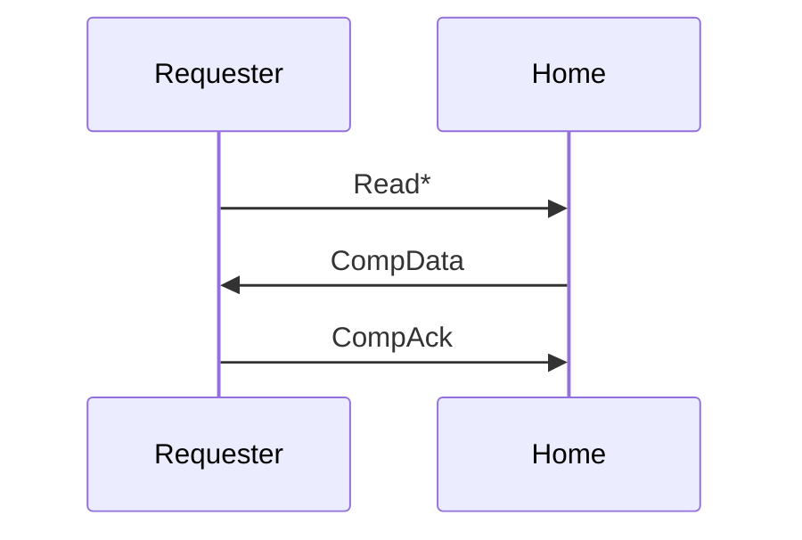
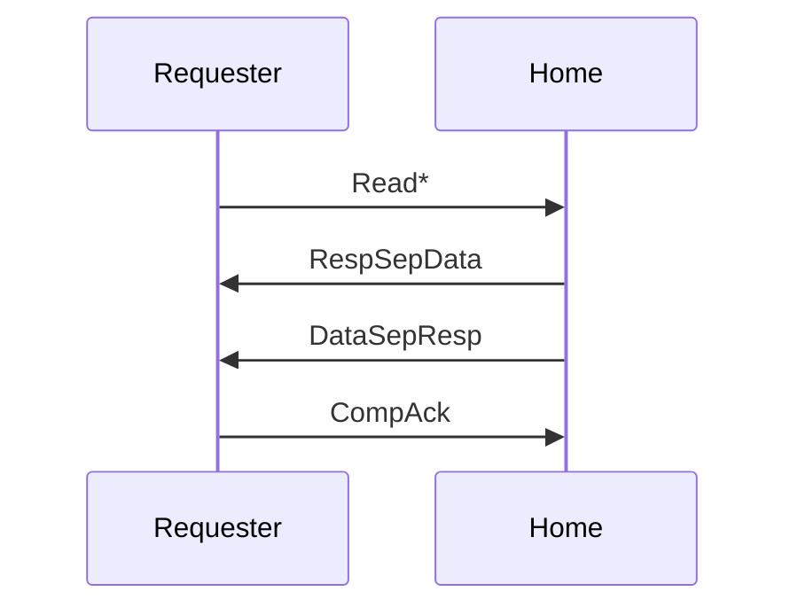
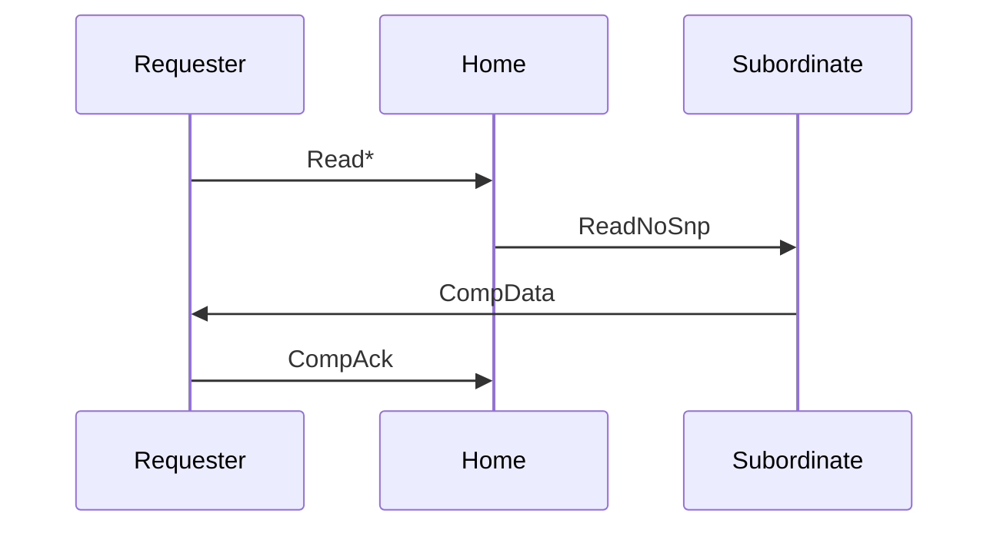
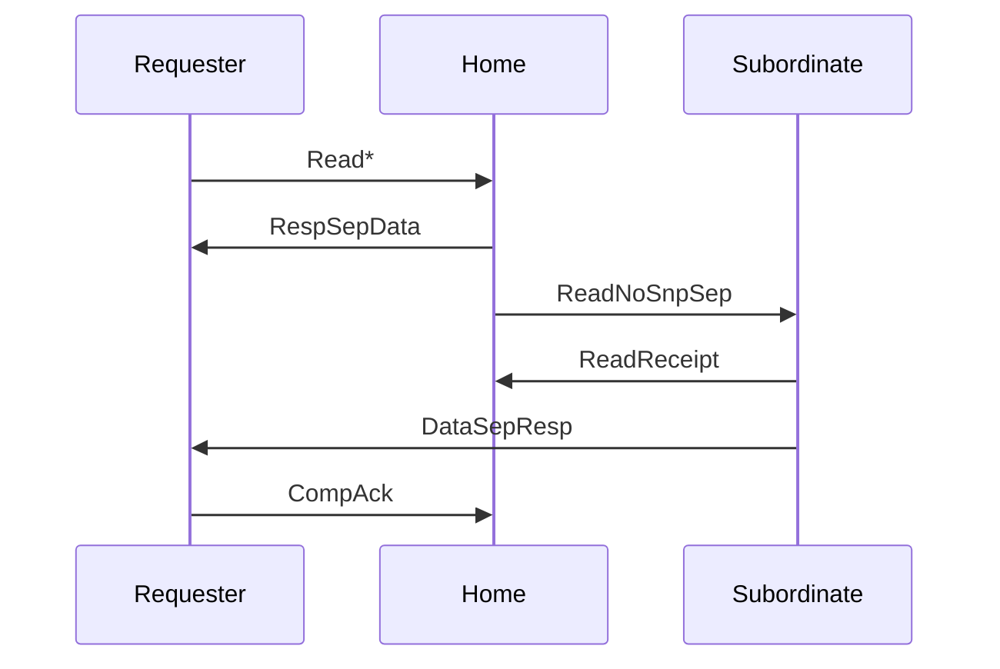
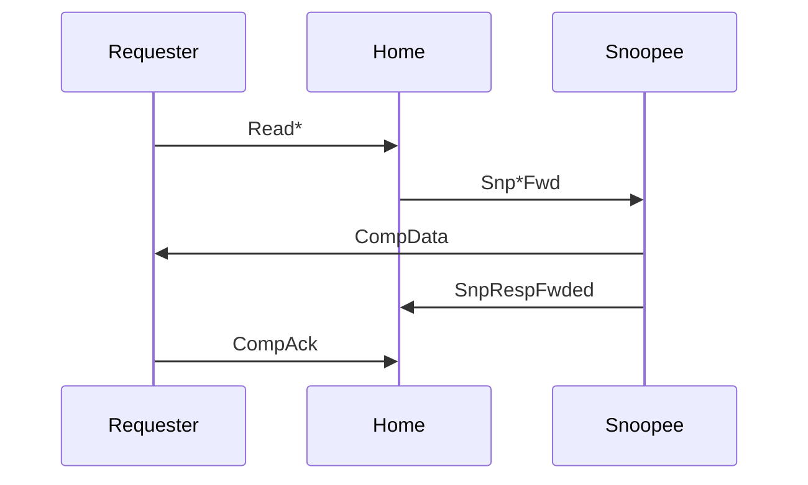
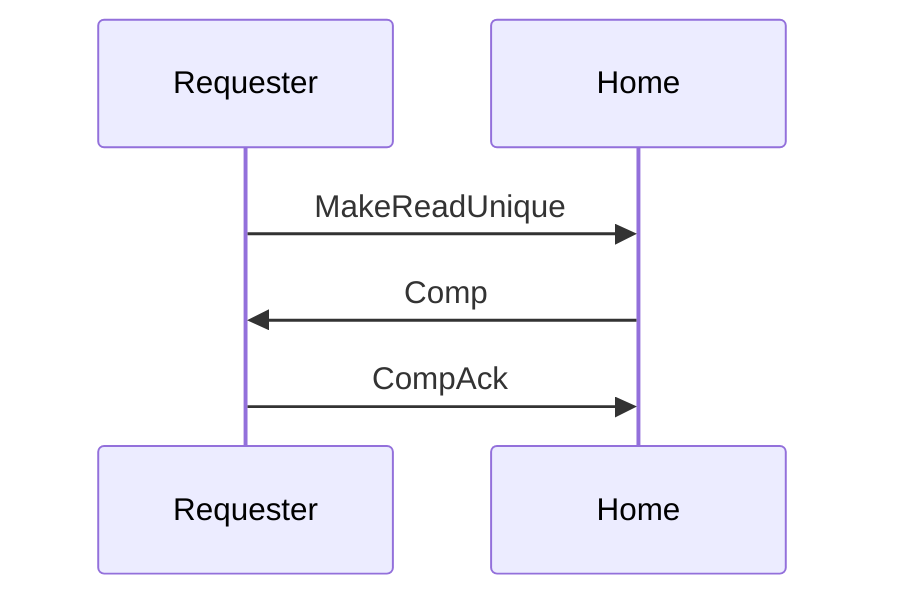
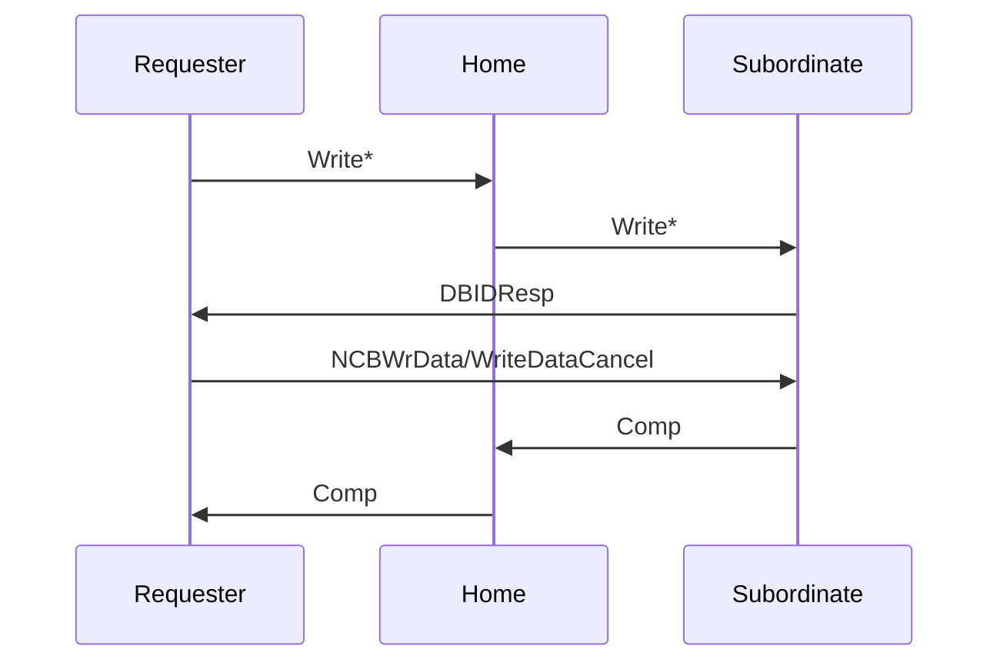
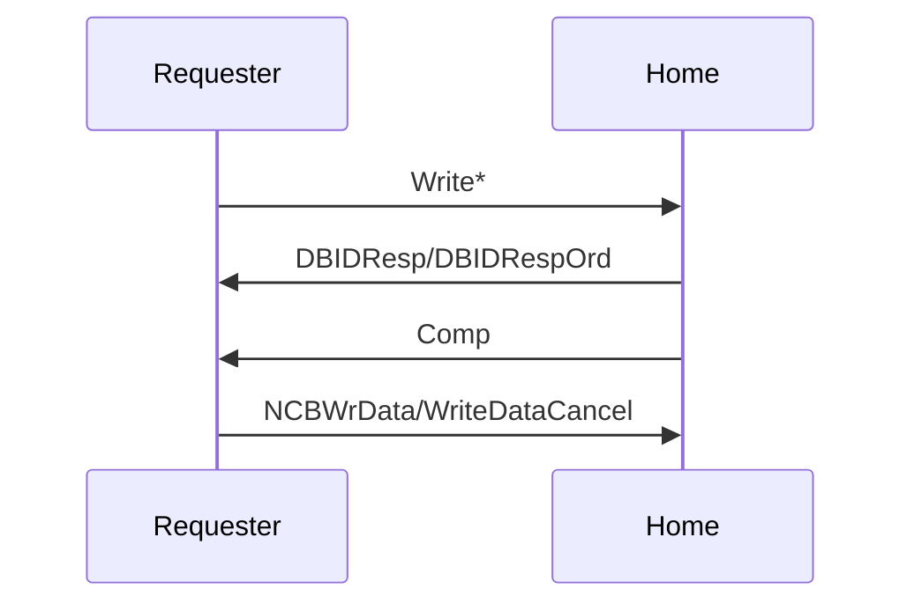
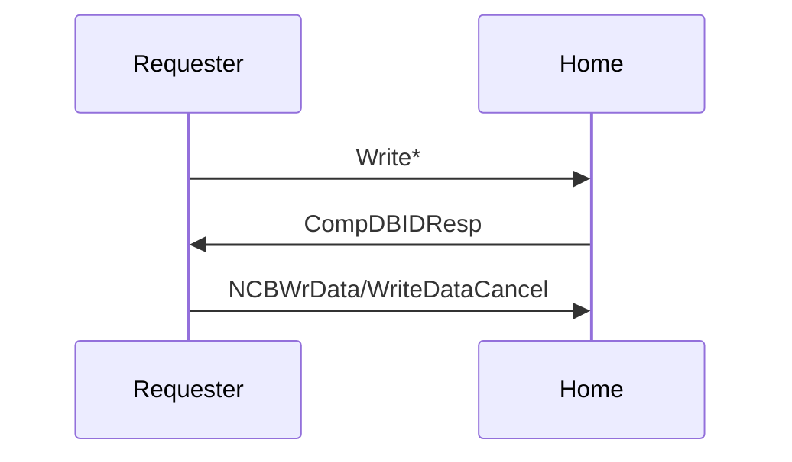

本文的内容已经整合到[知识库](/kb/hardware/cache_coherence_protocol.html)中。

## CHI 介绍

CHI 协议是 AMBA 5 标准中的缓存一致性协议，前身是 ACE 协议。最新的 CHI 标准可以从 [AMBA 5 CHI Architecture Specification](https://developer.arm.com/documentation/ihi0050/latest) 处下载。

相比 AXI，CHI 更加复杂，进行了分层：协议层，物理层和链路层。因此，CHI 适用于片上网络，支持根据 Node ID 进行路由，而不像 AXI 那样只按照物理地址进行路由。CHI 的地位就相当于 Intel 的环形总线。CHI 也可以桥接到 CCIX 上，用 CCIX 连接 SMP 的的多个 Socket，或者连接支持 CCIX 的显卡等等。

## 缓存行状态

首先回顾 ACE 的缓存行状态，共有五种，与 MOESI 相对应：

1. UniqueDirty: Modified
2. SharedDirty: Owned
3. UniqueClean: Exclusive
4. SharedClean: Shared
5. Invalid: Invalid

在此基础上，CHI 考虑缓存行只有部分字节有效的情况，即 Full，Partial 或者 Empty。因此 CHI 的缓存行状态共有七种：

1. UniqueDirty: Modified
2. UniqueDirtyPartial: 新增，可能有部分字节合法，在写回的时候，需要和下一级缓存或者内存中的合法缓存行内容进行合并
3. SharedDirty: Owned
4. UniqueClean: Exclusive
5. UniqueCleanEmpty: 新增，所有字节都不合法，但是本缓存占有该缓存行，如果要修改的话，不需要通知其他缓存
6. SharedClean: Shared
7. Invalid: Invalid

可以看到，比较特别的就是 UniqueDirtyPartial 和 UniqueCleanEmpty。CHI 标准在 4.1.1 章节给出了使用场景：如果一个 CPU 即将要写入一片内存，那么可以先转换到 UniqueCleanEmpty 状态中，把其他缓存中的数据都清空，这样后续写入的时候，不需要询问其他缓存，性能比较好。但此时因为数据还没写进去，所以就是 Empty，只更新状态，不占用缓存的空间。另一方面，如果 CPU 只写了缓存行的一部分字节，其他部分没有碰，那么引入 UniqueDirtyPartial 以后，可以把合并新旧缓存行数据这一步，下放到比较靠近内存的层级上，减少了数据搬运的次数。

## CHI 网络节点

CHI 的节点组织成一个网络，可能是片上网络，也可能是片间的连接。CHI 的节点分成三种类型：

1. Request Node：发起 CHI 请求的节点，对应 CPU 的缓存，或者是网卡等外设
2. Home Node：管理 Request Node 来的请求，对应最后一级缓存
3. Subordinate Node：处理 Home Node 来的请求，对应内存或者显存等有内存的外设

在这种设计下，Node 之间可以互相通信，因此方便做一些新的优化。例如传统的缓存层次里，请求是一级一级下去，响应再一级一级上来。但是 CHI 可能是 Request Node 发给 Home Node 的请求，响应直接由 Subordinate Node 发送回 Request Node 了。

## 读请求

CHI 提供了复杂性的同时，也带来了很多的灵活性，也意味着潜在的性能优化的可能。例如在 CHI 中实现一个读操作，可能有很多种过程（CHI 标准第 2.3.1 章节）：

第一种是 Home Node 直接提供了数据（Combined response from home）：

第二种是 Home Node 把响应拆成两份，一份表示读取结果，一份携带读取的数据（Separate data and response from Home）：

第三种是 Home Node 没有数据，转而询问 Subordinate，Subordinate 把结果直接发回给了 Requester（Combined response from Subordinate）：

第四种是 Home Node 没有数据，转而询问 Subordinate，但这次提前告诉 Requester 读取的结果，最后 Subordinate 把结果发回给了 Requester（Response from Home, Data from Subordinate）：

第五种是数据在其他的 Requester Node 中，此时 Home 负责 Snoop（Forwarding snoop）：

第六种是 MakeReadUnique，此时只更新权限，不涉及数据的传输（MakeReadUnique only）：

## 写请求

CHI 标准第 2.3.2 描述了写请求的流程。和读请求一样，写请求也有很多类型，下面进行介绍。与读请求不同的点在于，写入的时候，并不是直接把写入的地址和数据等一次性发送过去，而是先发一个写消息，对方回复可以发送数据了（DBIDResp），再把实际的数据传输过去（NCBWrData）。当然了，也可以中途反悔（WriteDataCancel）。

第一种是 Direct Write-data Transfer，意思是数据要从 Requester 直接传到 Subordinate 上：

第二种比较常规，就是把数据写给 Home Node，其中 Comp 表示读取结果，DBIDResp 表示可以发写入的内容了：

第三种是把第二种的 DBIDResp 和 Comp 合并成一个响应：

