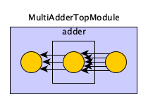
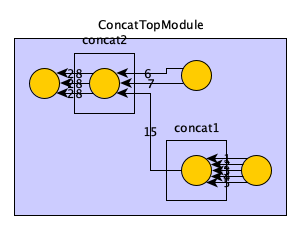

# 分析 Rocket Chip 中 Diplomacy 系统

## 概念

Diplomacy 主要实现了两个功能：

1. 把整个总线结构在代码中表现出来
2. 自动配置总线中各个端口的参数

具体来说，第一点实现了类似 Vivado Board Design 中连线的功能，第二点则是保证总线两端的参数一致，可以连接起来。

Diplomacy 为了表示总线的结构，每个模块可以对应一个 Node，Node 和 Node 之间连接形成一个图。Node 的类型主要有以下几个：

1. Client：对应 AXI 里面的 Master，发起请求
2. Manager：对应 AXI 里面的 Slave，处理请求
3. Adapter：对应 AXI Width Converter/Clock Converter/AXI4 to AXI3/AXI4 to AHB bridge 等，会修改 AXI 的参数，然后每个输入对应一个输出，不改变数量
4. Nexus：对应 AXI Crossbar，多个输入和多个输出，输入输出数量可能不同

每个 Node 可能作为 Manager 连接上游的 Client，这个叫做入边（Inward Edge）；同样地，也可以作为 Client 连接下游的 Manager，这个是出边（Outward Edge）。想象成一个 DAG，从若干个 Client 流向 Manager。

连接方式采用的是 `:=`、`:=*`、`:*=` 和 `:*=*` 操作符，左侧是 Manager（Slave），右侧是 Client（Master）。它们的区别如下：

- `:=`：在两个 Node 之间只连一条边
- `:=*`：Query 连接，意思是在两个 Node 之间连接多条边，连接的边的数量取决于右边的 Node
- `:*=`：Star 连接，意思是在两个 Node 之间连接多条边，连接的边的数量取决于左边的 Node
- `:*=*`：Flex 连接，意思是在两个 Node 之间连接多条边，连接的边的数量取决于哪边的 Node 可以确认边的数量

## 使用方法

由于各模块的硬件描述，需要等到连接图建立完成后，才能生成，因此 Diplomacy 采用了两阶段：

1. 第一个阶段发生在 LazyModule 中，通过 LazyModule 嵌套其他模块，并把 LazyModule 之间的 Node 连接起来，组成一个图，协商每一条边对应的参数
2. 第二个阶段发生在 LazyModuleImp 中，当访问 LazyModule 的 module 字段的时候，才会生成对应的硬件描述

### 引入 Diplomacy

比如一个加法器的例子，如果不使用 Diplomacy，就是直接写在 Module 当中：

```scala
import circt.stage.ChiselStage
import chisel3._

class Adder extends Module {
  val in1 = IO(Input(UInt(32.W)))
  val in2 = IO(Input(UInt(32.W)))
  val out = IO(Output(UInt(32.W)))
  out := in1 + in2
}

object Adder extends App {
  println(
    ChiselStage.emitSystemVerilog(
      new Adder(),
      firtoolOpts = Array("-disable-all-randomization", "-strip-debug-info")
    )
  )
}
```

如果想要使用 Diplomacy，就需要把连接关系的建立，和硬件描述两部分分开：

```scala
import org.chipsalliance.diplomacy.lazymodule.LazyModule
import org.chipsalliance.diplomacy.lazymodule.LazyModuleImp
import org.chipsalliance.cde.config.Parameters
import circt.stage.ChiselStage
import chisel3._

class AdderDiplomacyModule()(implicit p: Parameters) extends LazyModule {
  lazy val module = new AdderDiplomacyModuleImp(this)
}

class AdderDiplomacyModuleImp(outer: AdderDiplomacyModule)
    extends LazyModuleImp(outer) {
  val in1 = IO(Input(UInt(32.W)))
  val in2 = IO(Input(UInt(32.W)))
  val out = IO(Output(UInt(32.W)))
  out := in1 + in2
}

object AdderDiplomacy extends App {
  println(
    ChiselStage.emitSystemVerilog(
      LazyModule(new AdderDiplomacyModule()(Parameters.empty)).module,
      firtoolOpts = Array("-disable-all-randomization", "-strip-debug-info")
    )
  )
}
```

有时候，如果硬件实现部分比较简单，也可以不另起一个类，直接用 Scala 的语法写一个子类：

```scala
import org.chipsalliance.diplomacy.lazymodule.LazyModule
import org.chipsalliance.diplomacy.lazymodule.LazyModuleImp
import org.chipsalliance.cde.config.Parameters
import circt.stage.ChiselStage
import chisel3._

class AdderDiplomacyCompactModule()(implicit p: Parameters) extends LazyModule {
  lazy val module = new LazyModuleImp(this) {
    val in1 = IO(Input(UInt(32.W)))
    val in2 = IO(Input(UInt(32.W)))
    val out = IO(Output(UInt(32.W)))
    out := in1 + in2
  }
}

object AdderDiplomacyCompact extends App {
  println(
    ChiselStage.emitSystemVerilog(
      LazyModule(new AdderDiplomacyCompactModule()(Parameters.empty)).module,
      firtoolOpts = Array("-disable-all-randomization", "-strip-debug-info")
    )
  )
}
```

### 引入图的连接

接下来用 Diplomacy 做一些实际的使用。例如实现一个可以从多个 Node 输入 UInt，把求和后的结果输出到所有后继 Node 的模块，由于这里不涉及到要协商的 Bundle 的参数，所以统一用 Unit 代替，Bundle 的类型固定为 `UInt(32.W)`：

```scala
import org.chipsalliance.diplomacy.lazymodule._
import org.chipsalliance.cde.config.Parameters
import circt.stage.ChiselStage
import chisel3._
import org.chipsalliance.diplomacy.nodes._
import chisel3.experimental.SourceInfo

class MultiAdderModule()(implicit p: Parameters) extends LazyModule {
  val node = new NexusNode(MultiAdderNodeImp)(
    { _ => },
    { _ => }
  )
  lazy val module = new MultiAdderModuleImp(this)
}

class MultiAdderModuleImp(outer: MultiAdderModule)
    extends LazyModuleImp(outer) {
  // compute sum of all inward edges
  val sum = Wire(UInt(32.W))
  sum := outer.node.in.map(_._1).reduce(_ + _)

  // copy sum to all outward edges
  outer.node.out.foreach({ case (out, _) =>
    out := sum
  })
}

class MultiAdderTopModule()(implicit p: Parameters) extends LazyModule {
  val inputNodes = new SourceNode(MultiAdderNodeImp)(Seq.fill(5)(()))
  val outputNodes = new SinkNode(MultiAdderNodeImp)(Seq.fill(3)(()))
  val adder = LazyModule(new MultiAdderModule)

  outputNodes :*= adder.node
  adder.node :=* inputNodes

  lazy val module = new LazyModuleImp(this) {
    // connect input to IO
    inputNodes.out.zipWithIndex.foreach({ case ((wire, _), i) =>
      val in = IO(Input(UInt(32.W))).suggestName(s"in_${i}")
      wire := in
    })

    // connect output to IO
    outputNodes.in.zipWithIndex.foreach({ case ((wire, _), i) =>
      val out = IO(Output(UInt(32.W))).suggestName(s"out_${i}")
      out := wire
    })
  }
}

object MultiAdderNodeImp extends NodeImp[Unit, Unit, Unit, Unit, UInt] {
  override def edgeI(
      pd: Unit,
      pu: Unit,
      p: Parameters,
      sourceInfo: SourceInfo
  ): Unit = ()
  override def bundleI(ei: Unit): UInt = UInt(32.W)
  override def edgeO(
      pd: Unit,
      pu: Unit,
      p: Parameters,
      sourceInfo: SourceInfo
  ): Unit = ()
  override def bundleO(eo: Unit): UInt = UInt(32.W)
  override def render(e: Unit): RenderedEdge =
    RenderedEdge(colour = "#000000" /* black */ )
}

object MultiAdder extends App {
  val top = LazyModule(new MultiAdderTopModule()(Parameters.empty))
  println(
    ChiselStage.emitSystemVerilog(
      top.module,
      firtoolOpts = Array("-disable-all-randomization", "-strip-debug-info")
    )
  )
  os.write.over(os.pwd / "dump.graphml", top.graphML)
}
```

注意 `MultiAdderModule` 的实现，它使用了一个 NexusNode，即可以连接不定个数的入边和出边；然后在 `MultiAdderModuleImp` 中，对所有入边上的 `UInt` 进行求和，然后把结果写到所有的出边上。

接着，在 `MultiAdderTopModule` 中，建立了一个这样的图：

```
outputNodes <=3-> adder.node <=5-> inputNodes
```

其中 `inputNodes` 和 `adder.node` 之间有五条边，`outputNodes` 和 `adder.node` 之间有三条边。于是 `MultiAdderModule` 生成的 RTL 就是求五个 UInt 的和，把结果输出到三个 UInt 上：

```verilog
module MultiAdderModule(
  input  [31:0] auto_in_4,
                auto_in_3,
                auto_in_2,
                auto_in_1,
                auto_in_0,
  output [31:0] auto_out_2,
                auto_out_1,
                auto_out_0
);

  wire [31:0] _sum_T_6 = auto_in_0 + auto_in_1 + auto_in_2 + auto_in_3 + auto_in_4;
  assign auto_out_2 = _sum_T_6;
  assign auto_out_1 = _sum_T_6;
  assign auto_out_0 = _sum_T_6;
endmodule
```

这样就实现了根据图的连接，动态地生成内部逻辑的目的。

Diplomacy 提供了把图导出为 GraphML 格式的功能，只需要访问 `LazyModule` 类型的 `graphML` 字段即可。上面的连接关系会被可视化为下图：



### 参数协商

上面的例子里，没有需要协商的参数，Bundle 也是固定的。接下来，尝试用 Diplomacy 实现参数协商：实现一个 Concat 模块，它会把入边上的所有 UInt 拼接起来，输出到所有的出边。那么要协商的就是每条边上的 UInt 的宽度，Concat 模块会计算入边的 UInt 宽度之和，传递到出边上。

为了实现这一点，在生成 edge 上的 Bundle 的时候，基于 Int 类型的宽度参数，生成对应的 UInt；同时，由于宽度是从入边传递到出边，所以是从 upstream 传递到 downstream（downward flowing，下面的 `pd` 参数），所以把来自 upstream 的参数类型设置为 Int；反过来，从 downstream 到 upstream 没有要传递的信息（upward flowing，下面的 `pu` 参数），所以就用 Unit：

```scala
object ConcatNodeImp extends NodeImp[Int, Unit, Int, Int, UInt] {
  override def edgeI(
      pd: Int,
      pu: Unit,
      p: Parameters,
      sourceInfo: SourceInfo
  ): Int = pd
  override def bundleI(ei: Int): UInt = UInt(ei.W)
  override def edgeO(
      pd: Int,
      pu: Unit,
      p: Parameters,
      sourceInfo: SourceInfo
  ): Int = pd
  override def bundleO(eo: Int): UInt = UInt(eo.W)
  override def render(e: Int): RenderedEdge =
    RenderedEdge(colour = "#000000" /* black */, label = s"${e}")
}
```

在此基础上，实现一个 Concat 模块，它把入边的 UInt 拼接起来，输出到所有出边上：

```scala
import org.chipsalliance.diplomacy.lazymodule._
import org.chipsalliance.cde.config.Parameters
import circt.stage.ChiselStage
import chisel3._
import org.chipsalliance.diplomacy.nodes._
import chisel3.experimental.SourceInfo
import chisel3.util.Cat

class ConcatModule()(implicit p: Parameters) extends LazyModule {
  val node = new NexusNode(ConcatNodeImp)(
    { widths => widths.sum },
    { _ => }
  )
  lazy val module = new ConcatModuleImp(this)
}

class ConcatModuleImp(outer: ConcatModule) extends LazyModuleImp(outer) {
  // compute concatenation of all inward edges
  val cat = Wire(UInt(outer.node.in.map(_._2).sum.W))
  cat := Cat(outer.node.in.map(_._1))

  // copy concatenation to all outward edges
  outer.node.out.foreach({ case (out, _) =>
    out := cat
  })
}

class ConcatTopModule()(implicit p: Parameters) extends LazyModule {
  val inputNodes1 = new SourceNode(ConcatNodeImp)(Seq(1, 2, 3, 4, 5))
  val inputNodes2 = new SourceNode(ConcatNodeImp)(Seq(6, 7))
  val outputNodes = new SinkNode(ConcatNodeImp)(Seq.fill(3)(()))
  val concat1 = LazyModule(new ConcatModule)
  val concat2 = LazyModule(new ConcatModule)

  concat1.node :=* inputNodes1
  concat2.node := concat1.node
  concat2.node :=* inputNodes2
  outputNodes :*= concat2.node

  lazy val module = new LazyModuleImp(this) {
    // connect input to IO
    inputNodes1.out.zipWithIndex.foreach({ case ((wire, width), i) =>
      val in = IO(Input(UInt(width.W))).suggestName(s"in1_${i}")
      wire := in
    })
    inputNodes2.out.zipWithIndex.foreach({ case ((wire, width), i) =>
      val in = IO(Input(UInt(width.W))).suggestName(s"in2_${i}")
      wire := in
    })

    // connect output to IO
    outputNodes.in.zipWithIndex.foreach({ case ((wire, width), i) =>
      val out = IO(Output(UInt(width.W))).suggestName(s"out_${i}")
      out := wire
    })
  }
}

object ConcatNodeImp extends NodeImp[Int, Unit, Int, Int, UInt] {
  override def edgeI(
      pd: Int,
      pu: Unit,
      p: Parameters,
      sourceInfo: SourceInfo
  ): Int = pd
  override def bundleI(ei: Int): UInt = UInt(ei.W)
  override def edgeO(
      pd: Int,
      pu: Unit,
      p: Parameters,
      sourceInfo: SourceInfo
  ): Int = pd
  override def bundleO(eo: Int): UInt = UInt(eo.W)
  override def render(e: Int): RenderedEdge =
    RenderedEdge(colour = "#000000" /* black */, label = s"${e}")
}

object Concat extends App {
  val top = LazyModule(new ConcatTopModule()(Parameters.empty))
  println(
    ChiselStage.emitSystemVerilog(
      top.module,
      firtoolOpts = Array("-disable-all-randomization", "-strip-debug-info")
    )
  )
  os.write.over(os.pwd / "dump.graphml", top.graphML)
}
```

注意 NexusNode 初始化的时候，传入了两个函数，在这里就起到了作用：把 upstream 的参数，也就是一系列的宽度，求和后，传递到 downstream。生成的 RTL 里，可以看到这个宽度经过求和传递到了 downstream，其中 concat1 的输出宽度是 `1+2+3+4+5=15`，而 concat2 的输出宽度是 `6+7+15=28`：

```verilog
// this is concat1
module ConcatModule(
  input  [4:0]  auto_in_4,
  input  [3:0]  auto_in_3,
  input  [2:0]  auto_in_2,
  input  [1:0]  auto_in_1,
  input         auto_in_0,
  output [14:0] auto_out
);

  assign auto_out = {auto_in_0, auto_in_1, auto_in_2, auto_in_3, auto_in_4};
endmodule

// this is concat2
module ConcatModule_1(
  input  [6:0]  auto_in_2,
  input  [5:0]  auto_in_1,
  input  [14:0] auto_in_0,
  output [27:0] auto_out_2,
                auto_out_1,
                auto_out_0
);

  wire [27:0] cat = {auto_in_0, auto_in_1, auto_in_2};
  assign auto_out_2 = cat;
  assign auto_out_1 = cat;
  assign auto_out_0 = cat;
endmodule

module ConcatTopModule(
  input         clock,
                reset,
                in1_0,
  input  [1:0]  in1_1,
  input  [2:0]  in1_2,
  input  [3:0]  in1_3,
  input  [4:0]  in1_4,
  input  [5:0]  in2_0,
  input  [6:0]  in2_1,
  output [27:0] out_0,
                out_1,
                out_2
);

  wire [14:0] _concat1_auto_out;
  ConcatModule concat1 (
    .auto_in_4 (in1_4),
    .auto_in_3 (in1_3),
    .auto_in_2 (in1_2),
    .auto_in_1 (in1_1),
    .auto_in_0 (in1_0),
    .auto_out  (_concat1_auto_out)
  );
  ConcatModule_1 concat2 (
    .auto_in_2  (in2_1),
    .auto_in_1  (in2_0),
    .auto_in_0  (_concat1_auto_out),
    .auto_out_2 (out_2),
    .auto_out_1 (out_1),
    .auto_out_0 (out_0)
  );
endmodule
```

经过可视化的连接图如下：



## 代码解析

下面对着 Diplomacy 的源码进行解析。前面提到，Diplomacy 把各 Node 通过 Edge 连接成了一个图，下面介绍这个图的组织方式。

首先是 Node 的定义：它的基类是 BaseNode，它根据 InwardNode 和 OutwardNode 两个 trait，分别记录这个 Node 的入边和出边。
然后入边和出边分别对应 InwardEdge 和 OutwardEdge 两个 class，每条边上对应一个 Bundle，也对应了硬件上两个模块之间的 IO：

```scala
/** Contains information about an inward edge of a node */
case class InwardEdge[Bundle <: Data, EdgeInParams](
  params: Parameters,
  bundle: Bundle,
  edge:   EdgeInParams,
  node:   OutwardNode[_, _, Bundle])

/** Contains information about an outward edge of a node */
case class OutwardEdge[Bundle <: Data, EdgeOutParams](
  params: Parameters,
  bundle: Bundle,
  edge:   EdgeOutParams,
  node:   InwardNode[_, _, Bundle])
```

InwardEdge 记录了它是从哪个 OutwardNode 过来的；OutwardEdge 记录了它要连接到哪个 InwardNode 上。InwardNode 记录了它从哪些 OutwardNode 通过 InwardEdge 建立了连接；OutwardNode 记录了它通过 OutwardEdge 连接到了哪些 InwardNode 上：

```scala
/** A Node that defines inward behavior, meaning that it can have edges coming into it and be used on the left side of
  * binding expressions.
  */
trait InwardNode[DI, UI, BI <: Data] extends BaseNode {
  /** accumulates input connections. */
  private val accPI = ListBuffer[(Int, OutwardNode[DI, UI, BI], NodeBinding, Parameters, SourceInfo)]()
}

/** A Node that defines outward behavior, meaning that it can have edges coming out of it. */
trait OutwardNode[DO, UO, BO <: Data] extends BaseNode {
  /** Accumulates output connections. */
  private val accPO = ListBuffer[(Int, InwardNode[DO, UO, BO], NodeBinding, Parameters, SourceInfo)]()
}
```

一个 Node 可以同时继承 InwardNode 和 OutwardNode。

特别地，为了方便使用，在连接的时候未必是每次只连接一条边，比如可能一次性把多个 AXI 都接过去，比如前面提到的 Query/Star/Flex connection，这个信息会被记录在 NodeBinding 类型中。具体的连接个数，是通过 lazy evaluation + recursion 计算出来的。

## Rocket Chip 总线结构

Rocket Chip 主要有以下几个总线：

1. sbus: System Bus
2. mbus: Memory Bus
3. cbus: Control Bus
4. pbus: Periphery Bus
5. fbus: Frontend Bus

图示可以见参考文档中的链接，不过链接中的结构和实际的有一些区别。目前的 Rocket Chip 内存结构大致是这样：

```
fbus -> sbus -> mbus
tile --/    \-> cbus -> pbus
```

主要是 pbus 的位置从连接 sbus 移动到了连接 cbus。

相关代码：

```scala
/** Parameterization of a topology containing three additional, optional buses for attaching MMIO devices. */
case class HierarchicalBusTopologyParams(
  pbus: PeripheryBusParams,
  fbus: FrontBusParams,
  cbus: PeripheryBusParams,
  xTypes: SubsystemCrossingParams,
  driveClocksFromSBus: Boolean = true
) extends TLBusWrapperTopology(
  instantiations = List(
    (PBUS, pbus),
    (FBUS, fbus),
    (CBUS, cbus)),
  connections = List(
    (SBUS, CBUS, TLBusWrapperConnection  .crossTo(xTypes.sbusToCbusXType, if (driveClocksFromSBus) Some(true) else None)),
    (CBUS, PBUS, TLBusWrapperConnection  .crossTo(xTypes.cbusToPbusXType, if (driveClocksFromSBus) Some(true) else None)),
    (FBUS, SBUS, TLBusWrapperConnection.crossFrom(xTypes.fbusToSbusXType, if (driveClocksFromSBus) Some(false) else None)))
)
```

当然了，也有简化版的 JustOneBusTopology，那就只有 SystemBus 了。如果再配置了 CoherentBusTopology，那么 SBUS 和 MBUS 之间还有一层 L2:

```scala
/** Parameterization of a topology containing a banked coherence manager and a bus for attaching memory devices. */
case class CoherentBusTopologyParams(
  sbus: SystemBusParams, // TODO remove this after better width propagation
  mbus: MemoryBusParams,
  l2: BankedL2Params,
  sbusToMbusXType: ClockCrossingType = NoCrossing,
  driveMBusClockFromSBus: Boolean = true
) extends TLBusWrapperTopology(
  instantiations = (if (l2.nBanks == 0) Nil else List(
    (MBUS, mbus),
    (L2, CoherenceManagerWrapperParams(mbus.blockBytes, mbus.beatBytes, l2.nBanks, L2.name, sbus.dtsFrequency)(l2.coherenceManager)))),
  connections = if (l2.nBanks == 0) Nil else List(
    (SBUS, L2,   TLBusWrapperConnection(driveClockFromMaster = Some(true), nodeBinding = BIND_STAR)()),
    (L2,  MBUS,  TLBusWrapperConnection.crossTo(
      xType = sbusToMbusXType,
      driveClockFromMaster = if (driveMBusClockFromSBus) Some(true) else None,
      nodeBinding = BIND_QUERY))
  )
)
```

## 参考文档

- [TileLink and Diplomacy Reference](https://chipyard.readthedocs.io/en/latest/TileLink-Diplomacy-Reference/index.html)
- [Rocket Chip - Memory System](https://chipyard.readthedocs.io/en/latest/Generators/Rocket-Chip.html#memory-system)
- [chipsalliance/diplomacy](https://github.com/chipsalliance/diplomacy)
