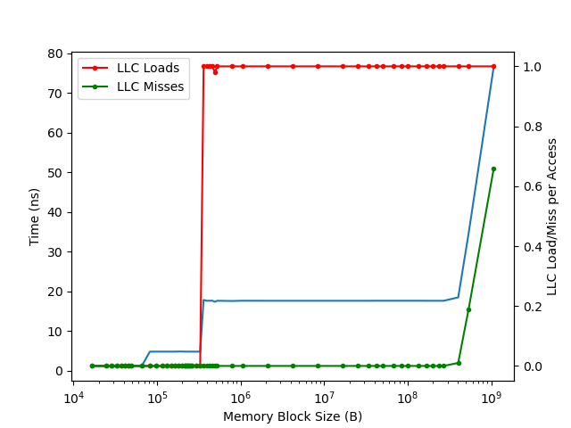

# 组装一台采用龙芯 3A6000 CPU 的主机

## 背景

最近买到了龙芯 3A6000 以及配套主板，在此记录我组装台式机的过程，以及在其上的体验。

<!-- more -->

## 购买

组装的第一步是购买各个配件，我买了如下的配件：

1. 主板 + CPU：Loongson-3A6000-7A2000-1w-V0.1-EVB（LS3A6000-7A2000-1w-EVB-V1.21），暂未正式上市
2. 内存：Kingston HyperX HX426C16FB3/8 8GB，169 元
3. 显卡：AMD RADEON RX550 4G 379 元
4. 无线网卡：Intel AX200 79 元
5. 硬盘：致态 TiPlus5000 Gen3 1TB，369 元
6. 机箱：爱国者 A15 ATX，100 元
7. 电源：爱国者 DK 系列 500W，149 元

除了主板和 CPU 以外总价一千出头。目前主板和 CPU 还没有正式上市，按照 3A5000 现在的价格的估计的话大概也是一千多，加起来整机不到三千。当然了，现在 3A6000 才刚出来，所以我买的价格也比较高，但自己组装也能省下来不少钱。

实际上这里电源买的偏大了，不过 400W 和 500W 也只差 20 块钱，就愉快地加价了。

### 内存兼容性

我测试的内存条：

1. Kingston HyperX [HX426C16FB3/8](https://www.kingston.com/dataSheets/HX426C16FB3_8.pdf)(KHX2666C16/8G) 8GB DDR4-2666(PnP) 1Rx8：支持
2. Kingston HyperX [KF432C16BB/8](https://www.kingston.com/dataSheets/KF432C16BB_8.pdf)(KF3200C16D4/8GX) 8GB DDR4-2400(JEDEC) 1Rx8：支持
3. 金百达（KingBank）长鑫颗粒 DDR4 3200MHz 16GB U-DIMM 1.35V CL 16：不支持
4. 紫光 SCC16GP02H1F1C-26V：不支持
5. 紫光 SCC32GP12H1F1C-26V: 不支持

网友表示在 3A6000 上可以工作的内存型号：

1. 三星 M393A4G43AB3-CWEGY 32GB 2Rx8 PC4-3200AA-RE3-12-R80 RDIMM
2. 紫光 [SCC16GU03H2F1C-32AA](https://www.unisemicon.com/uploadfile/2023/0228/20230228015641612.pdf) 16GB 1Rx8 PC4-3200U-22-22-22
3. 紫光 SCE08GU04APA-32 8GB 1Rx16 PC4-3200U-22-22-22
4. 紫光 SCE16GU03BPB-32 16GB 1Rx8 PC4-3200U-22-22-22

网友表示在 3A5000 上可以工作的内存型号：

1. 紫光 [SCC08GU03H3F1C-32AA](https://www.unisemicon.com/uploadfile/2023/0228/20230228015608788.pdf) 8G UDIMM PC4-3200
2. 紫光 [SCC16GU03H4F1C-32AA](https://www.unisemicon.com/uploadfile/2023/0228/20230228015735338.pdf) 16G UDIMM PC4-3200

注：兼容性随 UEFI 固件版本和硬件版本不同可能不同，因此读者遇到不同的兼容性情况也是可能的。我目前使用的 UEFI 固件版本是 Loongson-UDK2018-V4.0.05420-stable202302。

### 显卡兼容性

我测试的显卡：

1. AMD RX550：可用
2. AMD RX6400：不可用，见不到 BIOS 界面

在我这里主板上的 HDMI 不工作，只有独显 AMD RX550 的 HDMI 可以工作，不确定是否和 4K 显示器有关。另外有网友表示主板上的 VGA 可以工作。固件版本是 Loongson-UDK2018-V4.0.05420-stable202302。

UPDATE：更新固件到 Loongson-UDK2018-V4.0.05494-stable202305 以后，主板上的 HDMI 也工作了。

## Linux 发行版

目前查到的支持 LoongArch 的发行版有：

- AOSC OS: 有 LiveCD，但是还没有 DeployKit，可以用解压 base tarball 的方法安装
- LoongArchLinux：有安装 CD，可用
- Gentoo：没有安装 CD，需要借别的发行版的环境来安装
- Debian：没有官方安装 CD，有第三方的安装 CD
- UOS：没试过
- openEuler：没试过
- Loongnix：没试过
- Anolis OS：没试过

既然买的盘比较大，就预留了多个系统分区的空间，然后保留一个大的数据分区。目前装了 AOSC OS、LoongArchLinux、Debian、Gentoo 和 NixOS。

目前 Debian 还缺很多包，但是可以手动 bootstrap 起来。我目前用的是 AOSC OS 的 Kernel，其余的部分是在 Debian 中从源码开始编译。中间会遇到各种循环依赖，需要通过 DEB_BUILD_PROFILES 来打破循环，很多包需要手动处理，先把一些难处理的包去掉，然后之后再重新打包。

UPDATE: 现在已经有很多包可以用了。Revy 指出可以用 debootstrap 生成一个 rootfs：

```shell
debootstrap --no-check-gpg --arch=loong64 --variant=buildd --foreign --include=ca-certificates --extra-suites=unreleased unstable sid-loong64-sbuild http://mirror.sjtu.edu.cn/debian-ports
```

Gentoo 的话，按照官方的安装方法，只不过用 loongarch 的 stage3 tarball。目前遇到了一个小坑，就是 linux stable 6.4 内核遇到最新的 binutils 会有问题，表现是 Unsupport relocation type 65, please add its support(R_LARCH_B21)，这是因为缺了编译参数，导致 binutils 生成了 Linux 内核不支持的 relocation type。问题已经在 6.5 解决（[commit](https://github.com/torvalds/linux/commit/03c53eb90c0c61885b2175adf8675fb56df7f8db)）。可以用 sys-kernel/git-sources 来使用最新的 rc。

UPDATE: Linux 6.5 正式版出了，直接装 6.5 即可。

NixOS 的话，可以先在 x86 上生成一个 bootstrap tarball，然后在 LoongArch64 上用这个 bootstrap tarball，见 [Add loongarch64 bootstrap tarball](https://github.com/NixOS/nixpkgs/commit/88448caa371228f35c0a6c46f908c59e67a13475)。需要一些手动操作，但 bootstrap tarball 配好了以后，就可以正常用 nixpkgs 装东西了。如果要生成 NixOS 的安装镜像，可以用 nixos-generator：

```shell
git clone git@github.com:nix-community/nixos-generators
./nixos-generators/nixos-generate -I nixpkgs=/path/to/nixpkgs -f install-iso --system loongarch64-linux
```

如果想要进一步缩短 ISO 构建时间，可以修改 `nixos-generators/formats/install-iso.nix`，把 installation-cd-base 改成 installation-cd-minimal。也可以直接在已有的系统上装新的 NixOS：

```shell
nix build -L .#nixos-install-tools
```

这里面还有很多小的 trick，需要对 nixpkgs 做一些修改：<https://github.com/jiegec/nixpkgs/commits/loongarch64>。

## VSCode Remote

VSCode Remote Server 是闭源的，但是理论上可以用 lat 来对 nodejs 做二进制翻译。只需要魔改 `~/.vscode/extensions/ms-vscode-remote.remote-ssh-0.102.0/out/extension.js`（版本号可能不同），把里面对 x86_64 架构的判断，加上 loongarch64，也就是把 loongarch64 当成 x86_64 去处理，那么 VSCode Remote 就会下载 x86_64 的 binary 并运行，此时用 lat 就可以跑 server 了。

按照这个方法实践了一下：QEMU 还没支持 LASX 指令（有 [patch](https://patchew.org/search?q=project%3AQEMU+LASX) 但是还没有合并），所以跑的时候会 SIGILL。真机 3A6000 上会在 lat 里面失败，因为我用的是新世界发行版，和旧世界发行版的 syscall 不兼容。或许用旧世界发行版可以用 lat 正常运行。

UPDATE: 使用 LoongArchLinux 的新世界 lat 1.3.1，VSCode Remote Server 可以工作，但还有 BUG。

UPDATE: 使用 LoongArchLinux 的新世界 lat 1.4.3，VSCode Remote Server 可以正常工作，没有了之前的 BUG。

也尝试了用 qemu user 去运行 x86 的 nodejs，但是遇到了 page size 不匹配的问题：16KB != 4KB，也没跑起来。

另一个曲线救国的方法是，修改 extension.js 让 VSCode 认为是 AArch64，然后用 qemu-user 来跑。这次没有遇到 page size 的问题了：

```shell
sudo apt install qemu-aarch64-static
wget https://repo.aosc.io/debs/pool/stable/main/g/gcc-runtime_12.2.0-0_arm64.deb
wget https://repo.aosc.io/debs/pool/stable/main/g/glibc_2.36-4_arm64.deb
dpkg --extract gcc-runtime_12.2.0-0_arm64.deb /path/to/prefix
dpkg --extract glibc_2.36-4_arm64.deb /path/to/prefix

# add to shell init
export QEMU_LD_PREFIX=/path/to/prefix
```

这样有个优势也是劣势，就是 Extension 也会认为 Remote 是 AArch64，那么就会跑自带的 AArch64 的程序，但如果有原生的 LoongArch64 程序，那还是用后者更好。一个例子是 rust-analyzer，可以指定 native binary：

```json
{
	"rust-analyzer.server.path": "/usr/bin/rust-analyzer"
}
```

这样只有 vscode server 本身是用 qemu-aarch64-static 跑的，其他则没有影响。

此外，code-server 也是可以用的，安装 node v16 和 npm，然后运行 code-server 安装脚本即可。

## 容器

可以 podman 跑其他架构的容器，例如：

```shell
sudo podman run --arch x86_64 -it --rm debian:stable
sudo podman run --arch arm64 -it --rm debian:stable
```

只要这个 image 有对应架构的版本，并且提前配好 binfmt，注意 binfmt 的 flags，建议设置为 POCF，其中比较重要的是 F，不然 binfmt 会在容器里找 binfmt 的 executable，自然就找不到了，会报错 `exec container process (missing dynamic library?)`。

## Benchmark

推荐阅读：[华为 VS 龙芯 国产CPU架构初步探测、对比与分析](https://zhuanlan.zhihu.com/p/654721485)

### AOSC

在 AOSC 上跑一些测试软件的测试结果（冒号后多个数字为跑多次的结果），不一定准确：

- p7zip `7z -mmt1 b` 17.04 输出最后一个值：3681 3678 3680
- p7zip `7z -mmt4 b` 17.04 输出最后一个值：13998 13995 14038
- p7zip `7z -mmt8 b` 17.04 输出最后一个值：20585 20816 20407
- Coremark v1.01 单线程（`make`）: 21134 21164 21161
- Coremark v1.01 四线程（`make XCFLAGS="-DMULTITHREAD=4 -DUSE_PTHREAD"`）：83571 83629 83565
- Coremark v1.01 八线程（`make XCFLAGS="-DMULTITHREAD=8 -DUSE_PTHREAD"`）：113111 113143 113250

其中四线程的测试绑定到 `0,2,4,6` 核心。编译器不支持自动向量化，LSX/LASX 只有特定的汇编优化。

### 网友的评测

- <https://www.bilibili.com/video/BV1gr4y1o7P8/>

官方发布：<https://mp.weixin.qq.com/s/Lm_6varu0ovntPGfVzeGLw>

### Microbenchmark

下面是我用 microbenchmark 方法测到的一些微架构数据，不一定准确：

3A6000:

1. 主频：2500 MHz
2. L1 缓存命中 Load To Use：1.2ns，3 周期
3. L2 缓存命中 Load To Use：4.81ns，12 周期
4. L3 缓存命中 Load To Use：17.63ns，44 周期
    1. add.w/d: 4 per cycle, 1 cycle latency
    2. mul.w/d: 2 per cycle, 4 cycle latency
    3. fadd.s/d: 4 per cycle, 3 cycle latency
    4. fmul.s/d: 2 per cycle, 5 cycle latency
    5. fmadd.s/d: 2 per cycle, 5 cycle latency
    6. crc.w.b.w: 2 per cycle, 1 cycle latency
    7. crc.w.h.w: 2 per cycle, 1 cycle latency
    8. crc.w.w.w: 2 per cycle, 1 cycle latency
    9. crc.w.d.w: 2 per cycle, 1 cycle latency
    10. xvadd/vadd.d: 4 per cycle, 1 cycle latency
    11. xvmul/vmul.d: 2 per cycle, 4 cycle latency
    12. xvfadd/vfadd.d: 4 per cycle, 3 cycle latency
    13. xvfmul/vfmul.d: 2 per cycle, 5 cycle latency
5. 双精度浮点性能：
    1. 单核标量：2500 * 2 * 2 = 10 GFLOPS
    2. 单核向量：2500 * 2 * 2 * 4 = 40 GFLOPS
    3. 全核向量：4 * 40 = 160 GFLOPS

访存延迟与工作集大小的关系（使用 [jiegec/cpu-micro-benchmarks](https://github.com/jiegec/cpu-micro-benchmarks) 测试）：



主要分三段：

1. <64KB: 命中 L1D，Latency 是 1.2 ns，3 周期。64KB 与 L1D 容量 64 KB 一致。
2. <320KB: 命中 L2，Latency 是 4.8 ns，12 周期。320KB 等于 L1D 容量 64 KB 与 L2 容量 256 KB 总和，而不像很多微架构那样等于 L2 容量。
3. <256MB: 命中 L3，Latency 是 17.6 ns，44 周期。256MB 不等于 L3 容量 16 MB，和缓存替换策略或预取器行为有关。

3C5000:

1. 主频：2200 MHz
2. L1 缓存命中 Load To Use：1.82ns，4 周期
3. L2 缓存命中 Load To Use：6.37ns，14 周期
4. 指令吞吐/延迟：
    1. add.w/d: 4 per cycle, 1 cycle latency
    2. mul.w/d: 2 per cycle, 4 cycle latency
    3. fadd.s/d: 2 per cycle, 5 cycle latency
    4. fmul.s/d: 2 per cycle, 5 cycle latency
    5. fmadd.s/d: 2 per cycle, 5 cycle latency
    6. crc.w.b.w: 1/3.5 per cycle, 5 cycle latency
    7. crc.w.h.w: 1/4.5 per cycle, 7 cycle latency
    8. crc.w.w.w: 1/6.5 per cycle, 11 cycle latency
    9. crc.w.d.w: 1/10.5 per cycle, 19 cycle latency
    10. xvadd/vadd.d: 2 per cycle, 1 cycle latency
    11. xvmul/vmul.d: 2 per cycle, 4 cycle latency
    12. xvfadd/vfadd.d: 2 per cycle, 5 cycle latency
    13. xvfmul/vfmul.d: 2 per cycle, 5 cycle latency

对比：

| Inst latency & throughput | 3A6000 @ 2.5 GHz     | 3C5000 @ 2.2 GHz     | Kunpeng 920 @ 2.6 GHz |
|---------------------------|----------------------|----------------------|-----------------------|
| 64b int add               | 4 per cyc, 1 cyc lat | 4 per cyc, 1 cyc lat | 3 per cyc, 1 cyc lat  |
| 64b int mul               | 2 per cyc, 4 cyc lat | 2 per cyc, 4 cyc lat | 1 per cyc, 4 cyc lat  |
| 64b fp add                | 4 per cyc, 3 cyc lat | 2 per cyc, 5 cyc lat | 2 per cyc, 4 cyc lat  |
| 64b fp mul                | 2 per cyc, 5 cyc lat | 2 per cyc, 5 cyc lat | 2 per cyc, 5 cyc lat  |
| 128b vec 64b int add      | 4 per cyc, 1 cyc lat | 2 per cyc, 1 cyc lat | 2 per cyc, 2 cyc lat  |
| 128b vec 64b int mul      | 2 per cyc, 4 cyc lat | 2 per cyc, 4 cyc lat | N/A                   |
| 128b vec 64b fp add       | 4 per cyc, 3 cyc lat | 2 per cyc, 5 cyc lat | 1 per cyc, 4 cyc lat  |
| 128b vec 64b fp mul       | 2 per cyc, 5 cyc lat | 2 per cyc, 5 cyc lat | 1 per cyc, 5 cyc lat  |
| 256b vec 64b int add      | 4 per cyc, 1 cyc lat | 2 per cyc, 1 cyc lat | N/A                   |
| 256b vec 64b int mul      | 2 per cyc, 4 cyc lat | 2 per cyc, 4 cyc lat | N/A                   |
| 256b vec 64b fp add       | 4 per cyc, 3 cyc lat | 2 per cyc, 5 cyc lat | N/A                   |
| 256b vec 64b fp mul       | 2 per cyc, 5 cyc lat | 2 per cyc, 5 cyc lat | N/A                   |

参考：

- <https://www.7-cpu.com/cpu/Loongson_3A5000.html>
- <https://chipsandcheese.com/2023/04/09/loongsons-3a5000-chinas-best-shot/>
- <https://chipsandcheese.com/2023/02/26/loongsons-lsx-and-lasx-vector-extensions/>

## 已知问题

除了前面所述的内存条和显卡兼容性以外，还有以下已知问题：

- ~~AMD 显卡关屏久了以后，可能会 hang，怀疑是电源管理问题~~ 升级 6.5 内核后问题消失
- 固件的 PCIe Above 4G 功能不可用
- ~~固件的 ACPI PPTT 表内容有问题~~ 已在新版固件中修复
- ~~板载 HDMI 有问题~~ 已在新版固件中修复

