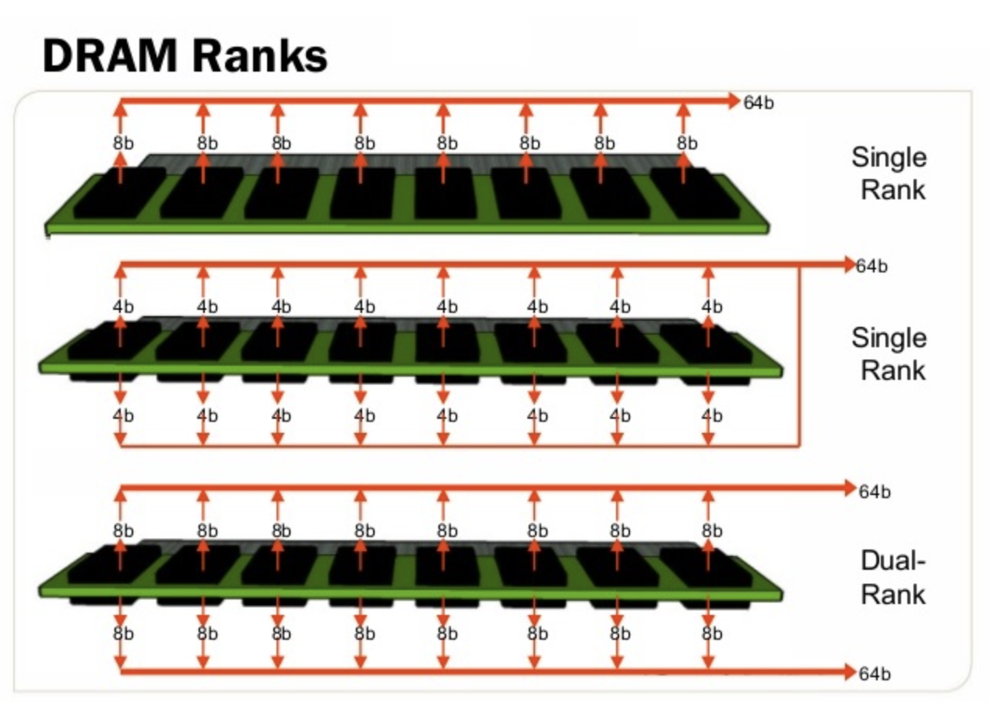

# DRAM 的拓扑和训练

本文的内容已经整合到[知识库](/kb/hardware/sdram.html)中。

## DRAM Training

DRAM 一直有一个比较麻烦的初始化过程，就是 DRAM Training，其中很重要的一步就是计算出各个数据线相对于时钟的偏移（skew）。这个偏移是怎么来的呢？

我们知道，对于 SRAM，如果想要更多的位宽，只需要把地址线和控制信号连接到多个 SRAM 上，然后把 SRAM 的数据信号并行连接到 FPGA 上就可以了，但是前提是要尽量保证等长，否则一样有偏移的问题。DRAM 也是采用类似的方法进行扩展的，但是 DRAM 通常需要并行连接很多个芯片，例如 8 个 x8 的芯片的合并成一个 64 位的 DDR SDRAM。此时数据线依然是并行连接，但是地址线和控制信号就出现了走线困难：很难在那么小的空间里，等长地把地址和控制信号分布到各个芯片上，而且还有信号完整性的问题。

<!-- more -->

## Fly-by topology

因此，实际上地址和控制信号是采用了串联的方式连接，也就是下图的右边的连接方式：


图源 [Versal ACAP PCB Design User Guide (UG863)](https://docs.xilinx.com/r/en-US/ug863-versal-pcb-design/Signals-and-Connections-for-DDR4-Interfaces)。

但是数据信号（DQ 和 DQS）依然是并行点对点连接到 DRAM 上的（上图左侧）。这就出现了问题：不同的 DRAM 芯片，数据和时钟的偏差不同，数据可能差不多时间到，但是时钟的延迟越来越大：

```wavedrom
{
  signal:
    [
      { name: "clock", wave: "p...."},
      { name: "data", wave: "01010"},
      { name: "clock_dram0", wave: "p....", phase: -0.1},
      { name: "clock_dram1", wave: "p....", phase: -0.2},
      { name: "clock_dram2", wave: "p....", phase: -0.3},
      { name: "clock_dram3", wave: "p....", phase: -0.4},
      { name: "clock_dram4", wave: "p....", phase: -0.5},
      { name: "clock_dram5", wave: "p....", phase: -0.6},
      { name: "clock_dram6", wave: "p....", phase: -0.7},
      { name: "clock_dram7", wave: "p....", phase: -0.8},
    ]
}
```

注：这里简化了，当成 SDR 来画。

不做任何处理的话，DRAM 采样得到的数据就不正确了。为了解决这个问题，就需要人为地在数据信号上也加上可变的延迟，保证时钟和数据同步，这样 DRAM 才可以实现正确的写入：

```wavedrom
{
  signal:
    [
      { name: "clock", wave: "p.p.."},
      { name: "data", wave: "01010"},
      { name: "clock_dram0", wave: "p.p..", phase: -0.1},
      { name: "data_dram0", wave: "01010", phase: -0.1},
      { name: "clock_dram1", wave: "p.p..", phase: -0.2},
      { name: "data_dram1", wave: "01010", phase: -0.2},
      { name: "clock_dram2", wave: "p.p..", phase: -0.3},
      { name: "data_dram2", wave: "01010", phase: -0.3},
      { name: "clock_dram3", wave: "p.p..", phase: -0.4},
      { name: "data_dram3", wave: "01010", phase: -0.4},
    ]
}
```

## Write Leveling

为了解决写入时，时钟和数据有偏移的问题，需要采用 Write Leveling 方法来解决。具体思路是这样的：如果 DRAM 以时钟信号去采样数据信号可以得到正确的结果，那反过来，如果认为数据信号是时钟信号，在数据信号的上升沿去采样时钟，应该也可以观测到稳定的结果。

所以 Write Leveling 的工作方式就是：

1. 设置 DRAM 进入 Write Leveling 模式，此时 DRAM 会使用 DQS 信号来采样 CK 信号，把结果输出到 DQ 上
2. DDR 控制器不断地修改 DQS 的输出延迟，然后统计 DQ 上的输出

示意图如下：

```wavedrom
{
  signal:
    [
      { name: "ck", wave: "p.p.."},
      { name: "dqs_0", wave: "010..", phase: -0.5},
      { name: "dq_0", wave: "0....", phase: -0.55},
      { name: "dqs_1", wave: "010..", phase: -0.7},
      { name: "dq_1", wave: "0....", phase: -0.75},
      { name: "dqs_2", wave: "010..", phase: -0.9},
      { name: "dq_2", wave: "01...", phase: -0.95},
      { name: "dqs_3", wave: "010..", phase: -1.1},
      { name: "dq_3", wave: "01...", phase: -1.15},
    ]
}
```

上图中，用不断增大的四种延迟的 `dqs` 对 `ck` 进行采样：用 `dqs_0` 和 `dqs_1` 采样得到了 0，用 `dqs_2` 和 `dqs_3` 采样得到了 1。把这些结果列出来，可能会得到类似下面的结果：

```
001111111111111111110000
```

也就是说，随着延迟增大，采样的数据从 0 变成 1，再从 1 变成 0。我们的目标是，让 `dqs` 和 `ck` 同步。在上图中，`dqs_2` 的上升沿和 `ck` 上升沿是最接近的，而刚好 `dqs_2` 也正好出现在采样 0 变成采样 1 的位置。这意味着，只要找到采样数据从 0 变成 1 的位置，就知道如何让 DQS 与 CK 同步了。

这样就完成了 Write Leveling 的步骤，实现了 DQS 与 CK 同步的目标，那么在写入数据的时候，DRAM 就可以得到正确的 DQS 信号了。

## Read Leveling

在上一步的 Write Leveling 当中，通过修改内存控制器的输出延迟，保证了 DRAM 可以得到同步的 DQS 和 CK 信号，解决了 Fly by topology 引入的延迟不一致的问题。但是，对于读操作，数据从 DRAM 输出，输入到内存控制器，又会引入一定的延迟。所以对读操作，也需要进行校准。

回顾 SRAM，当想要测试读取功能的时候，会首先写入一些数据，再读出来，判断读取的数据和之前写入的数据是否一致。DRAM 也是类似的：先向 MPR 写入一些伪随机数据，然后要求 DRAM 从 MPR 中读取数据，而不是从 memory cell 中读取数据；然后内存控制器一侧不断进行读取操作，在不同的延迟下，比较读取的数据与预期的随机数据是否一致。最后也会得到一个延迟的区间，在这个区间内可以读取出正确的结果。最后，把延迟设定在区间的中央位置。

## Clam Shell Topology

再回到拓扑的问题上来，实际上除了 Fly by topology，还有一种拓扑是 Clam shell topology：把 DRAM 分布在 PCB 的上面和下面，这样可以节省 PCB 的面积，但是走线就会比较困难：


图源 [Versal ACAP Programmable Network on Chip and Integrated Memory Controller LogiCORE IP Product Guide (PG313) ](https://docs.xilinx.com/r/en-US/pg313-network-on-chip/Clamshell-Topology).

直观地讲，两个芯片都放在 PCB 的正面，如果要连线的话，如果保证引脚顺序接近一致，就可以比较容易地连接，不会有很多交叉的地方。但如果一个在正面，另一个在背面，引脚的顺序就倒转过来了，连线的时候就比较困难。解决的办法是，修改引脚的顺序，把一些引脚的功能进行对调，使得走线更加简单：


图源 [Versal ACAP PCB Design User Guide (UG863)](https://docs.xilinx.com/r/en-US/ug863-versal-pcb-design/Utilizing-Address-Mirroring-to-Ease-Clamshell-Routing)

这里特意挑选了一些不影响特殊功能的引脚来交换，使得大部分功能，即使交换了引脚，也可以正常工作。但是，对于 Mode Register Set 操作，必须要内存控制器自己先内部交换位的顺序，才能保证在 DRAM 一侧得到正确的结果。

此外，Clam Shell Topology 的正面和背面各有一个 cs_n 片选信号，但是这和 Dual Rank 不同：Dual Rank 是正面和背面都有同样数量的 DRAM 芯片，共享地址信号、数据信号和控制信号，总线上同一时间只有一侧的 DRAM 芯片在使用，好处是内存容量翻倍，并且两个 rank 可以互相掩盖延迟；而 Clam Shell Topology 的两个 cs_n 是为了给 Mode Register Set 操作指定正面或背面，而其余的大部分操作，可以正面和背面同时使用，因为它们的数据信号并没有共享。



图源 [DIFFERENCE BETWEEN DUAL RANK AND SINGLE RANK RAM](https://blog.memory4less.com/2022/09/16/difference-between-dual-rank-and-single-rank-ram/)

## 背景

实际上，前面的整个研究过程，来自于我对 VCU128 LiteX 移植的观察：[VCU128 DDR4 memory calibration failure](https://github.com/litex-hub/litex-boards/issues/496)。我在配置 litedram 的时候，发现总是有一半的 DRAM 芯片无法使用，和 Datasheet 对照了以后，发现正好是 PCB 背面的那一半。接着，发现它是 Clam Shell Topology 方式来分布的，然后 Top 和 Bottom 各有一个 cs_n 信号，这一点在 UG1302 里是没有写的，在 xdc 里才可以找到：

```tcl
set_property PACKAGE_PIN BK48       [get_ports "PL_DDR4_BOT_CS_B"] ;# Bank  66 VCCO - DDR4_VDDQ_1V2 - IO_L7P_T1L_N0_QBC_AD13P_66
set_property IOSTANDARD  SSTL12_DCI [get_ports "PL_DDR4_BOT_CS_B"] ;# Bank  66 VCCO - DDR4_VDDQ_1V2 - IO_L7P_T1L_N0_QBC_AD13P_66
set_property PACKAGE_PIN BP49     [get_ports "PL_DDR4_CS_B"] ;# Bank  66 VCCO - DDR4_VDDQ_1V2 - IO_L1N_T0L_N1_DBC_66
set_property IOSTANDARD  SSTL12   [get_ports "PL_DDR4_CS_B"] ;# Bank  66 VCCO - DDR4_VDDQ_1V2 - IO_L1N_T0L_N1_DBC_66
```

所以 Xilinx 文档也是可能出错的，需要结合多个信息源来判断。这里有 xdc 和 schematic 可以参考，都可以发现这个结论。

沿着这个思路，我给 litedram 添加了 clam shell topology 的支持：<https://github.com/enjoy-digital/litedram/pull/332> 和 <https://github.com/enjoy-digital/litex/pull/1673>，实现方法：

1. 在校准阶段，把 Top 和 Bottom 两个 cs_n 暴露给软件，软件在 MRS 的时候，分两次写入，第一次原样写到 Top，第二次交换地址顺序，再写入 Bottom。
2. 正常工作阶段，把 Top 和 Bottom 的两个 cs_n 当成一个用，也就是当成 single rank dram。

## 训练代码

下面结合 litex 和 litedram 的代码，以及 DDR4 标准，来验证上面的观察。

### Write Leveling

Write Leveling 的核心函数是 `sdram_write_leveling_scan`，它的核心思路是：

第一步调用 `sdram_write_leveling_on` 打开 DRAM 的 Write Leveling 模式：

```c
  sdram_write_leveling_on();
```

循环每个 DRAM 芯片的每个 DQS 信号：

```c
for(i=0;i<SDRAM_PHY_MODULES;i++) {
  for (dq_line = 0; dq_line < DQ_COUNT; dq_line++) {
    /* 设置 DQS 初始延迟为 0 */
    sdram_leveling_action(i, dq_line, write_rst_delay);

    /* 循环 DQS 延迟 */
    for(j=0;j<err_ddrphy_wdly;j++) {
      int zero_count = 0;
      int one_count = 0;

      for (k=0; k<loops; k++) {
        /* 发送 DQS 序列：00000001 */
        ddrphy_wlevel_strobe_write(1);

        /* 统计 1 和 0 的个数 */
        if (buf[SDRAM_PHY_MODULES-1-i] != 0)
          one_count++;
        else
          zero_count++;
      }
      if (one_count > zero_count)
        /* DQS 采样到了 CK 的正半周期 */
        taps_scan[j] = 1;
      else
        /* DQS 采样到了 CK 的负半周期 */
        taps_scan[j] = 0;

      /* 每次循环增加一次 DQS 延迟 */
      sdram_leveling_action(i, dq_line, write_inc_delay);
    }

    /* 找到一个最长的连续 1 的序列 */
    one_window_active = 0;
    one_window_start = 0;
    one_window_count = 0;
    one_window_best_start = 0;
    one_window_best_count = -1;
    for(j=0;j<err_ddrphy_wdly+1;j++) {
      if (one_window_active) {
        if ((j == err_ddrphy_wdly) || (taps_scan[j] == 0)) {
          /* 结束了一段连续的 1 */
          one_window_active = 0;
          one_window_count = j - one_window_start;
          /* 记录最长的连续 1 的长度和位置 */
          if (one_window_count > one_window_best_count) {
            one_window_best_start = one_window_start;
            one_window_best_count = one_window_count;
          }
        }
      } else {
        /* 找到连续的 1 的开头 */
        if (j != err_ddrphy_wdly && taps_scan[j]) {
          one_window_active = 1;
          one_window_start = j;
        }
      }
    }

    /* 要找的延迟就是连续的 1 序列的开始位置 */
    delays[i] = one_window_best_start;
  }
}

sdram_write_leveling_off();
```

这样就实现了 Write Leveling 的全流程：

1. 设置 DRAM 进入 Write Leveling 模式，DRAM 用 DQS 对 CK 采样，结果输出到 DQ
2. 在不同的 DQS 延迟下，发送同样的 00000001 DQS 模式，观察 DQ 上的数据
3. 统计 DQ 上的 1 和 0 的个数，如果 1 更多，就认为当前 DQS 延迟下，DQS 采样到了 CK 的正半周期；反之如果 0 更多，就认为当前 DQS 延迟下，DQS 采样到了 CK 的负半周期
4. 在第三步的结果中，找到最长的连续的 1 序列，那么这个序列的开始，就对应了采样值从 0 到 1 的变化，此时 DQS 与 CK 基本同步
5. 最后设置 DRAM 退出 Write Leveling 模式

## 参考文档

- <https://www.systemverilog.io/design/ddr4-initialization-and-calibration/>
- <https://docs.xilinx.com/r/en-US/ug863-versal-pcb-design/Signals-and-Connections-for-DDR4-Interfaces>
- <https://docs.xilinx.com/r/en-US/pg353-versal-acap-soft-ddr4-mem-ip/Calibration-Overview>
- <https://docs.xilinx.com/r/en-US/pg313-network-on-chip/Clamshell-Topology>
- <https://docs.xilinx.com/r/en-US/ug863-versal-pcb-design/Utilizing-Address-Mirroring-to-Ease-Clamshell-Routing>
- <https://blog.memory4less.com/2022/09/16/difference-between-dual-rank-and-single-rank-ram/>
- <https://daffy1108.wordpress.com/2010/09/02/understanding-ddr3-write-leveling-and-read-leveling/>
