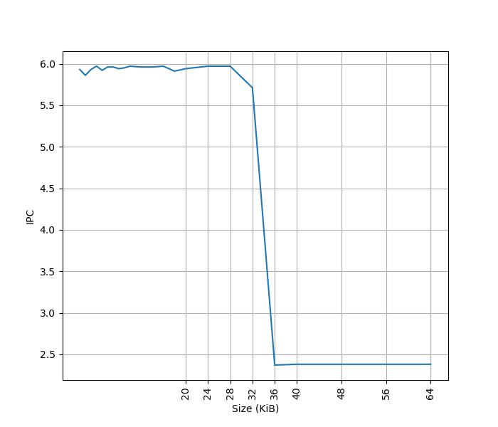
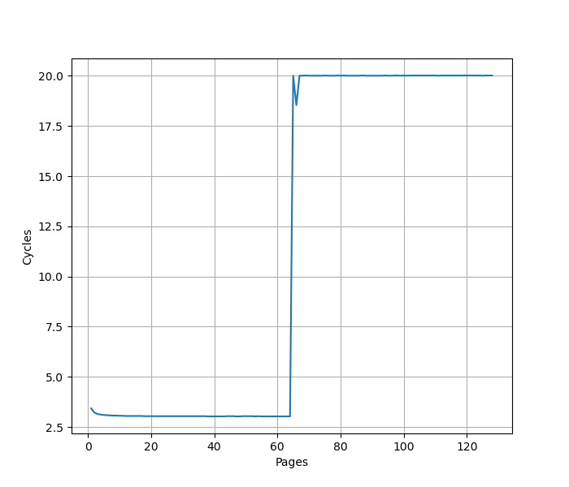
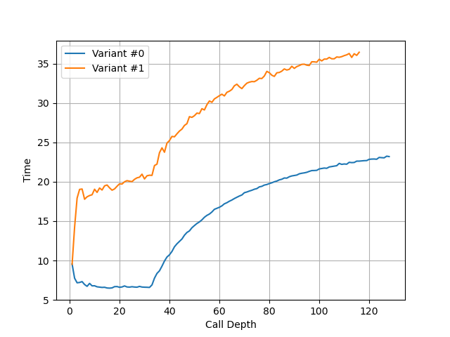
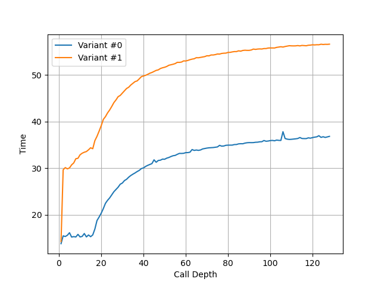
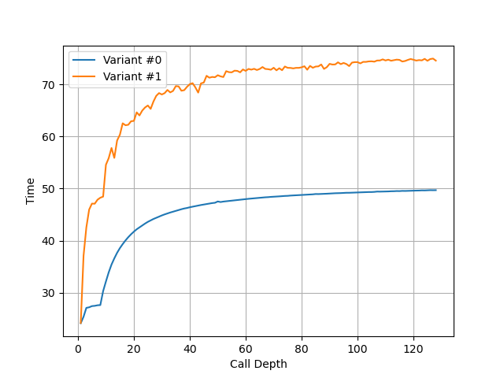
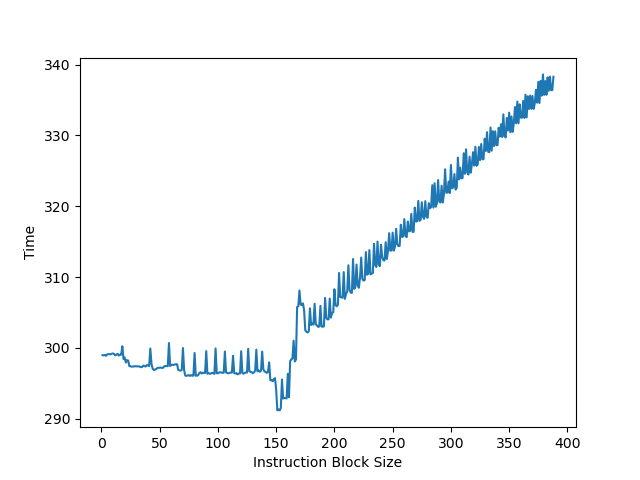
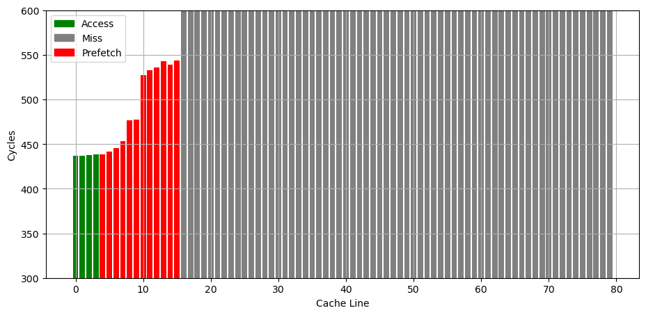
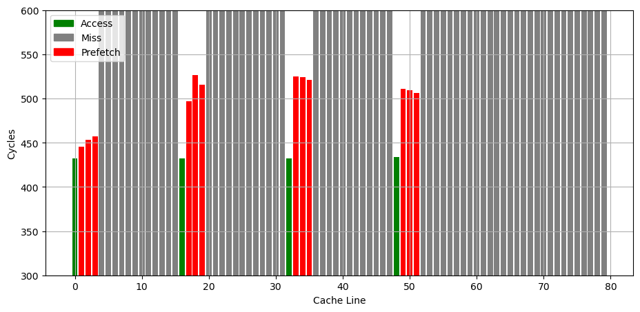

# IBM POWER8 微架构评测

## 背景

之前评测了很多 AMD64 和 ARM64 指令集的处理器，这次也来评测一下 PPC64LE 指令集的 IBM POWER8 微架构。

<!-- more -->

## 官方信息

IBM 关于 POWER8 微架构有如下公开信息：

- [IBM POWER8 processor core microarchitecture](https://research.ibm.com/publications/ibm-power8-processor-core-microarchitecture)

下面分各个模块分别记录官方提供的信息，以及实测的结果。官方信息与实测结果一致的数据会加粗。

## Benchmark

IBM POWER8 的性能测试结果见 [SPEC](../../../benchmark/index.md)。

## 前端

### L1 ICache

官方信息：**32 KB**, 8-way set associative

为了测试 L1 ICache 容量，构造一个具有巨大指令 footprint 的循环，由大量的 nop 和最后的分支指令组成。观察在不同 footprint 大小下的 IPC：

超出 L1 ICache 容量后，IPC 从 6 降低到了 2.4。其中 6 IPC 来自于，IBM POWER8 在 ST 模式下每周期可以发射 8 条指令，但其中分支指令最多两条，非分支指令最多六条，所以执行 NOP 指令的 IPC 只能达到 6。

### L1 ITLB (aka Instruction Effective to Real Address translation Table, IERAT)

官方信息：**64-entry**, fully associative

为了测试 L1 ITLB 的容量，构造 b 序列，每个 b 在一个单独的页（64KB 的页大小）中，观察 b 的性能：

可以看到明显的 64 pages 的拐点，对应了 64 entry 的 L1 ITLB。

### BTB (Branch Target Buffer)

官方信息：无 BTB，总是通过 3 周期延迟的 Fetch + Decode(Branch Scan) 来得到分支指令的目的地址，靠 SMT 来填补流水线的气泡。

实测也是如此，对于连续执行多个 b 指令的情况，每条 b 指令都需要 3 周期。

### Return Address Stack (aka Link Stack)

官方信息：32-entry(ST/SMT2)/16-entry(SMT4)/8-entry(SMT8) Link Stack per thread，也就是说总容量是 64，但每个线程只能用一部分

构造不同深度的调用链，测试每次调用花费的时间，得到如下测试结果：

可以看到 32 的拐点，对应的就是 ST 模式下 RAS 的大小。在同一个物理核上的其他三个逻辑核分别运行 stress，就测得 SMT4 模式下的 RAS 大小 16：

类似地，在其余七个逻辑核上分别运行 stress 负载，得到 SMT8 模式下的 RAS 大小为 8：

### CBP (Conditional Branch Predictor)

官方信息：16K-entry LBHT, 16K-entry GBHT, 16K-entry GSEL，使用 21-bit GHV 记录全局分支历史，GSEL 用来选择由 LBHT 还是 GBHT 提供预测（通过 2-bit 饱和计数器），LBHT 采用 PC 索引，GBHT 和 GSEL 采用 PC+GHV 的哈希索引；此外，还支持把 conditional branch to +8 也就是只跳过一条指令的分支指令改写为 predication

### IBP (Indirect Branch Predictor)

官方信息：256-entry local count cache, 512-entry global count cache，前者采用 PC 索引，后者采用 PC+GHV 的哈希索引，entry 内容是 30-bit 预测的目的地址加 2-bit 的 confidence（local count cache 的 entry 还有额外的 2-bit 饱和计数器用于选择 local 还是 global）

## Dispatch

官方信息：按 Group 来 Dispatch，ST 模式下每周期一个 Group，每个 Group 最多 8 条指令（最多 2 条分支，最多 6 条非分支，且第二条分支必须是最后一条指令）；SMT 模式下，每周期从两个线程各 Dispatch 一个 Group，每个 Group 最多 4 条指令（最多 1 条分支，3 条非分支）

## 后端

### ROB (aka Global Completion Table, GCT)

官方信息：28-entry，ST 模式下每个 entry 对应一个 Group；SMT 模式下每个 entry 对应两个来自同一个线程的 Group；所以最多容纳 `28*8=224` 条指令；Commit 的粒度是 Group，ST 模式下每周期 Commit 一个 Group，SMT 模式下每周期 Commit 两个 Group

把两个独立的 long latency pointer chasing load 放在循环的头和尾，中间用 NOP 填充，当 NOP 填满了 ROB，第二个 pointer chasing load 无法提前执行，导致性能下降。测试结果如下：

拐点大致在 168 附近，因为每 6 条 NOP 指令对应一个 Group，所以只能容纳 `28*6=168` 条指令。

### Register File

官方信息：一共可以有 106 个 Inflight 的 Rename，由 GPR（General Purpose Register）和 VSR（Vector and Scalar Register）共享；GPR 分为两组，每组 124-entry；VSR 分为两组，每组 144-entry；还有额外的两组 SAR（Software Architected Registers），一组用于 GPR，一组用于 VSR；CR（Condition Register）单独 Rename（32-entry mapper）到 64-entry Architected Register File；XER（fiXed-point Exception Register）Rename（30-entry mapper）到 32-entry Architected Register File；LR，CTR 和 TAR 单独 Rename（20-entry mapper）到 24-entry Architected Register File；FPSCR（Floating Point Status and Control Register）单独 Rename 到 28-entry buffer。

### Issue Queue

官方信息：15-entry Branch Issue Queue，8-entry Condition Register Queue，64-entry UniQueue 用于其他指令；没周期最多 Issue 10 条指令：1x Branch, 1x Condition Register Logical, 2x Fixed Point, 2x Load/Store/Fixed Point to LSU, 2x Load/Fixed Point to LU, 2x Vector-Scalar to VSU/DFU(Decimal Floating point Unit)/Crypto

### 执行单元

官方信息：2 个定点计算流水线（FX），2 个 Load/Store 流水线（LS/FX），2 个 Load 流水线（L/FX），4 个双精度浮点流水线（或 8 个单精度浮点流水线），2 个向量流水线（VMX），1 个密码学流水线（Crypto），1 个分支流水线（Branch），1 个条件寄存器流水线（CR），1 个十进制浮点数流水线，共 16 个；其中 2 个 Load/Store 流水线和 2 个 Load 流水线还能执行简单的定点计算

### Load Store Unit

官方信息：共有四个 Pipeline，L0/L1 仅 Load，LS0/LS1 可 Load/Store, 3 cycle load-to-use latency

#### Load/Store (Reorder) Queue

官方信息：40-entry（128 Virtual）Store Reorder queue，44-entry（128 Virtual）Load Reorder Queue

### L1 DTLB (aka primary Data Effective-to-Real Address Translation, DERAT)

官方信息：48-entry(ST)/96-entry(SMT), fully associative

### L2 DTLB (aka secondary Data Effective-to-Real Address Translation, DERAT)

官方信息：256-entry（ST 模式下全可见，SMT 模式下每个线程只有一半可见）, fully associative

### L3 TLB

官方信息：2048-entry, 4-way set associative, 4 concurrent page table walk

### L1 DCache

官方信息：64KB, 8-way set associative, 128B cache line, 4 read port, 1 write port，3 cycle load to use latency, store-through（写入会同时写 L1 DCache 和 L2），所以 store miss 不分配 cache line, 16 MSHR(aka Load Miss Queue)

#### Banking

官方信息：L1 DCache 由 16 个 macro 组成，每个 macro 是 16 个 bank，一共是 256 个 bank；sram 用的是 2R 或 1W，所以每个 bank 可以支持每周期 2R 或 1W

### Prefetcher

官方信息：16-entry Stream Prefetcher，可以跨 4KB/64KB 页边界，用虚拟地址预取，可以预取到 L1/L2/L3

参考 [Battling the Prefetcher: Exploring Coffee Lake (Part 1)](https://abertschi.ch/blog/2022/prefetching/) 的方式，研究预取器的行为：分配一片内存，把数据从缓存中 flush 掉，再按照特定的访存模式访问，触发预取器，最后测量访问每个缓存行的时间，从而得到预取器预取了哪些缓存行的信息。

首先是连续访问若干个 128B cacheline，观察哪些被预取了进来：

可以看到后面有 12 个 cacheline 都被预取了，但是预取到了不同的 cache 层次，距离越近的 4 个 cacheline 预取到 L1，更远的 2 个到 L2，其余的 6 个到 L3。

如果是访问了几个分立的缓存行，行为变成了 Next 3 Line：

