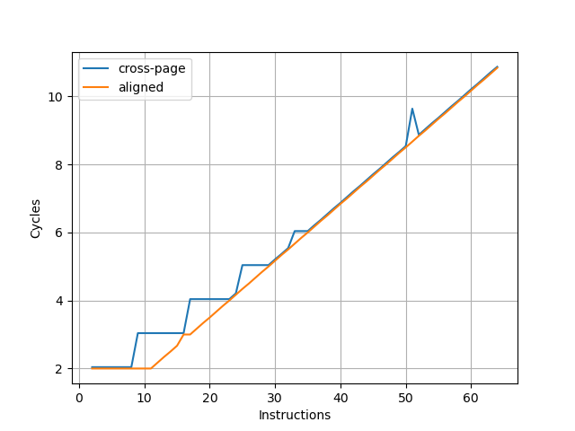
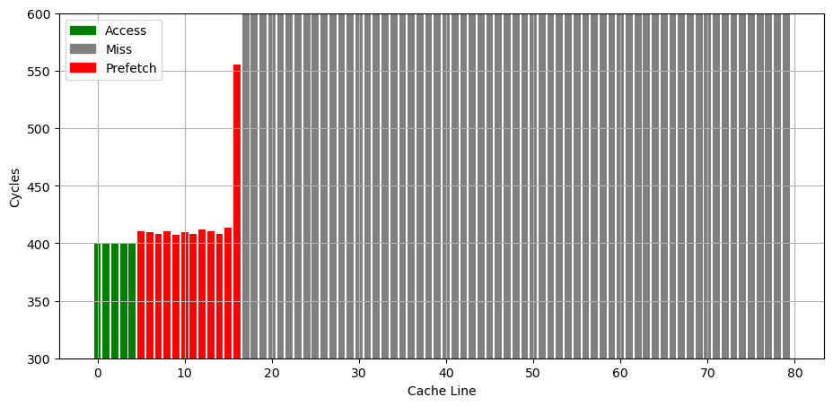
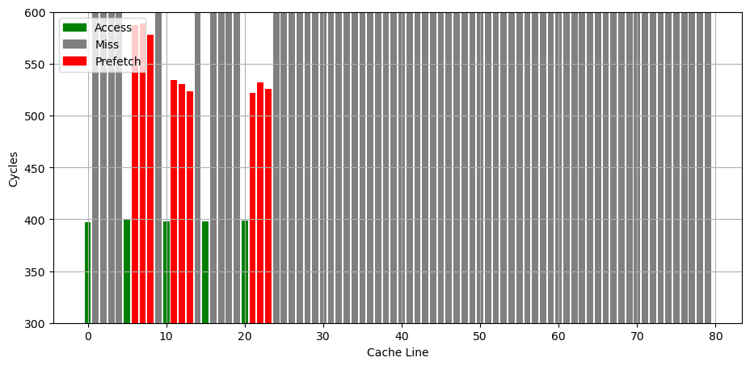

# IBM POWER9 微架构评测

## 背景

继 [IBM POWER8](./ibm-power8.md) 之后，也来评测一下后续的 IBM POWER9 微架构。IBM POWER9 有 SMT4 和 SMT8 两种版本，我只有 SMT4 版本的测试环境，下列所有评测都是针对 SMT4 版本进行测试。

<!-- more -->

## 官方信息

IBM 关于 POWER9 微架构有如下公开信息：

- [IBM POWER9 processor core](https://ieeexplore.ieee.org/document/8409955)
- [IBM Power9 Processor Architecture](https://ieeexplore.ieee.org/document/7924241)

下面分各个模块分别记录官方提供的信息，以及实测的结果。官方信息与实测结果一致的数据会加粗。

## Benchmark

IBM POWER9 的性能测试结果见 [SPEC](../../../benchmark/index.md)。

## 前端

### L1 ICache

官方信息：**32KB(SMT4)**/64KB(split into 2 regions, SMT8)

为了测试 L1 ICache 容量，构造一个具有巨大指令 footprint 的循环，由大量的 nop 和最后的分支指令组成。观察在不同 footprint 大小下的 IPC：

测试环境是 SMT4 Core，所以只有 32KB 的容量。超出 L1 ICache 容量后，IPC 从 6 降低到了 4.7。相比 POWER8，容量不变，超出 ICache 容量后的 IPC 提高了。

[测试过程详见测试代码](https://github.com/jiegec/cpu-micro-benchmarks/blob/master/src/fetch_bandwidth_gen.cpp)。

### 取指带宽

官方信息：32 bytes/cycle

为了测试实际的 Fetch 宽度，参考 [如何测量真正的取指带宽（I-fetch width） - JamesAslan](https://zhuanlan.zhihu.com/p/720136752) 构造了测试。

其原理是当 Fetch 要跨页的时候，由于两个相邻页可能映射到不同的物理地址，如果要支持单周期跨页取指，需要查询两次 ITLB，或者 ITLB 需要把相邻两个页的映射存在一起。这个场景一般比较少，处理器很少会针对这种特殊情况做优化，但也不是没有。经过测试，把循环放在两个页的边界上，发现 IBM POWER9 微架构遇到跨页的取指时确实会拆成两个周期来进行。

在此基础上，构造一个循环，循环的第一条指令放在第一个页的最后四个字节，其余指令放第二个页上，那么每次循环的取指时间，就是一个周期（读取第一个页内的指令）加上第二个页内指令需要 Fetch 的周期数，多的这一个周期就足以把 Fetch 宽度从后端限制中区分开，实验结果如下：

图中蓝线（cross-page）表示的就是上面所述的第一条指令放一个页，其余指令放第二个页的情况，横坐标是第二个页内的指令数，那么一次循环的指令数等于横坐标 +1。纵坐标是运行很多次循环的总 cycle 数除以循环次数，也就是平均每次循环耗费的周期数。可以看到每 8 条指令会多一个周期，因此 IBM POWER9 的前端取指宽度确实是 8 条指令即 32 字节。

为了确认这个瓶颈是由取指造成的，又构造了一组实验，把循环的所有指令都放到一个页中，这个时候 Fetch 不再成为瓶颈（图中 aligned），两个曲线的对比可以明确地得出上述结论。

随着指令数进一步增加，最终瓶颈在每周期执行的 NOP 指令数，因此两条线重合。

[测试过程详见测试代码](https://github.com/jiegec/cpu-micro-benchmarks/blob/master/src/if_width_gen.cpp)。

### L1 ITLB

为了测试 L1 ITLB 的容量，构造 b 序列，每个 b 在一个单独的页（64KB 的页大小）中，观察 b 的性能：

可以看到明显的 256 pages 的拐点，对应了 256 entry 的 L1 ITLB。CPI 从 3 升高到了 28。相比 POWER8 的 64-entry L1 ITLB 容量有所提升。

[测试过程详见测试代码](https://github.com/jiegec/cpu-micro-benchmarks/blob/master/src/itlb_size_lib.cpp)。

### BTB (aka Branch Target Address Calculator, BTAC)

官方信息：1 cycle latency

### Return Address Stack

构造不同深度的调用链，测试每次调用花费的时间，得到如下测试结果：

可以看到 64 的拐点，对应的就是 RAS 的大小。

[测试过程详见测试代码](https://github.com/jiegec/cpu-micro-benchmarks/blob/master/src/ras_size_gen.cpp)。

### CBP (Conditional Branch Predictor)

官方信息：BHT(3 cycle redirect) + TAGE(4 components, 5 cycle redirect), 256-bit LGHB(long global history vector)

## Dispatch

官方信息：6 instructions per SMT4, 12 instructions per SMT8

## 后端

### ROB (aka ICT)

官方信息：**256 entries** per SMT4 core

把两个独立的 long latency pointer chasing load 放在循环的头和尾，中间用 NOP 填充，当 NOP 填满了 ROB，第二个 pointer chasing load 无法提前执行，导致性能下降。测试结果如下：

拐点在 256 附近。相比 POWER8 的 `28*6=168` 有所提升

[测试过程详见测试代码](https://github.com/jiegec/cpu-micro-benchmarks/blob/master/src/rob_size_gen.cpp)。

### Issue Queue

官方信息：54 instructions per SMT4 core, 108 instructions per SMT8 core

### L1 DCache

官方信息：32KB(SMT4)/64KB(SMT8, split into two regions)

### L1 DTLB

用类似测 L1 DCache 的方法测试 L1 DTLB 容量，只不过这次 pointer chasing 链的指针分布在不同的 64KB page 上，使得 DTLB 成为瓶颈：

可以看到 256 Page 出现了明显的拐点，对应的就是 256 的 L1 DTLB 容量。没有超出 L1 DTLB 容量前，Load to use latency 是 4 cycle。L1 DTLB 容量相比 POWER8 的 48(ST)/96(SMT) 有所提升，和 POWER8 的 256-entry L2 DTLB 容量相同。

[测试过程详见测试代码](https://github.com/jiegec/cpu-micro-benchmarks/blob/master/src/dtlb_size.cpp)。

### L2 Cache

官方信息：8-way 512KB L2 cache

### L3 Cache

官方信息：20-way 10MB eDRAM L3 cache per core

### Prefetcher

参考 [Battling the Prefetcher: Exploring Coffee Lake (Part 1)](https://abertschi.ch/blog/2022/prefetching/) 的方式，研究预取器的行为：分配一片内存，把数据从缓存中 flush 掉，再按照特定的访存模式访问，触发预取器，最后测量访问每个缓存行的时间，从而得到预取器预取了哪些缓存行的信息。

首先是连续访问若干个 128B cacheline，观察哪些被预取了进来：

预取的行为相比 POWER8 更加激进：有更多的缓存行被预取到了更近的 L1（或者是 L2？）。

如果是访问了几个分立的缓存行，有时会表现出 Next 3 Line 的行为，但都是到 L3：

[测试过程详见测试代码](https://github.com/jiegec/cpu-micro-benchmarks/blob/master/src/prefetcher_cacheline.cpp)。
