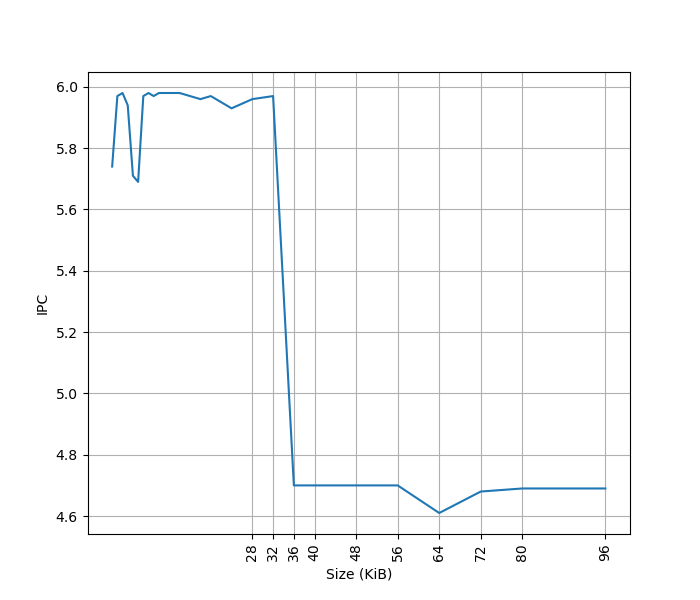
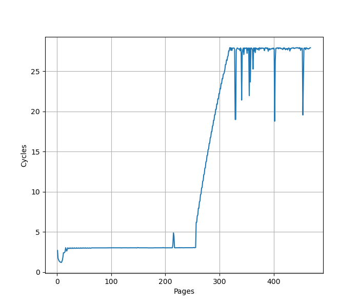
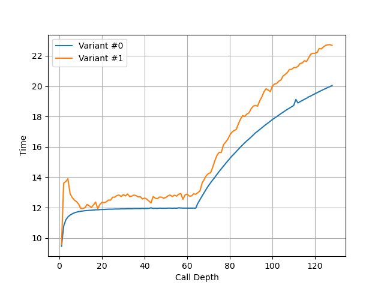
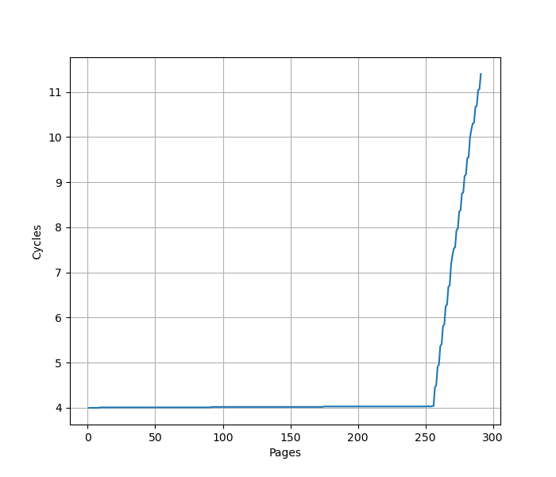

# IBM POWER9 微架构评测

## 背景

继 [IBM POWER8](./ibm-power8.md) 之后，也来评测一下后续的 IBM POWER9 微架构。IBM POWER9 有 SMT4 和 SMT8 两种版本，我只有 SMT4 版本的测试环境，下列所有评测都是针对 SMT4 版本进行测试。

<!-- more -->

## 官方信息

IBM 关于 POWER9 微架构有如下公开信息：

- [IBM POWER9 processor core](https://ieeexplore.ieee.org/document/8409955)
- [IBM Power9 Processor Architecture](https://ieeexplore.ieee.org/document/7924241)

下面分各个模块分别记录官方提供的信息，以及实测的结果。官方信息与实测结果一致的数据会加粗。

## Benchmark

IBM POWER9 的性能测试结果见 [SPEC](../../../benchmark/index.md)。

## 前端

### L1 ICache

官方信息：**32KB(SMT4)**/64KB(split into 2 regions, SMT8)

为了测试 L1 ICache 容量，构造一个具有巨大指令 footprint 的循环，由大量的 nop 和最后的分支指令组成。观察在不同 footprint 大小下的 IPC：

测试环境是 SMT4 Core，所以只有 32KB 的容量。超出 L1 ICache 容量后，IPC 从 6 降低到了 4.7。

### L1 ITLB

为了测试 L1 ITLB 的容量，构造 b 序列，每个 b 在一个单独的页（64KB 的页大小）中，观察 b 的性能：

可以看到明显的 256 pages 的拐点，对应了 256 entry 的 L1 ITLB。CPI 从 3 升高到了 28。

### BTB (aka Branch Target Address Calculator, BTAC)

官方信息：1 cycle latency

### Return Address Stack

构造不同深度的调用链，测试每次调用花费的时间，得到如下测试结果：

可以看到 64 的拐点，对应的就是 RAS 的大小。

### CBP (Conditional Branch Predictor)

官方信息：BHT(3 cycle redirect) + TAGE(4 components, 5 cycle redirect), 256-bit LGHB(long global history vector)

## Dispatch

官方信息：6 instructions per SMT4, 12 instructions per SMT8

## 后端

### ROB (aka ICT)

官方信息：**256 entries** per SMT4 core

把两个独立的 long latency pointer chasing load 放在循环的头和尾，中间用 NOP 填充，当 NOP 填满了 ROB，第二个 pointer chasing load 无法提前执行，导致性能下降。测试结果如下：

拐点在 256 附近。

### Issue Queue

官方信息：54 instructions per SMT4 core, 108 instructions per SMT8 core

### Load Store Unit

### L1 DCache

官方信息：32KB(SMT4)/64KB(SMT8, split into two regions)

### L1 DTLB

用类似测 L1 DCache 的方法测试 L1 DTLB 容量，只不过这次 pointer chasing 链的指针分布在不同的 64KB page 上，使得 DTLB 成为瓶颈：

可以看到 256 Page 出现了明显的拐点，对应的就是 256 的 L1 DTLB 容量。没有超出 L1 DTLB 容量前，Load to use latency 是 4 cycle。

### L2 TLB

### L2 Cache

官方信息：8-way 512KB L2 cache

### L3 Cache

官方信息：20-way 10MB eDRAM L3 cache per core

### Prefetcher
