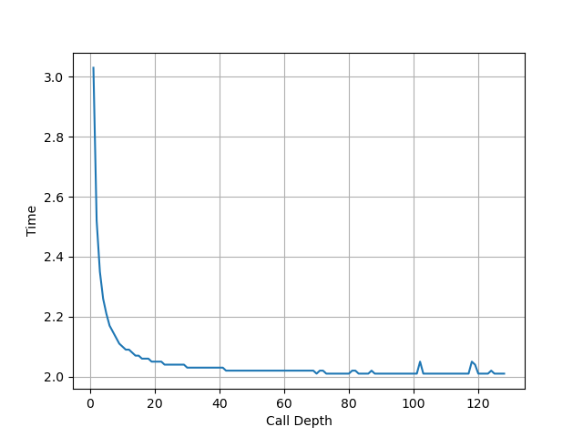
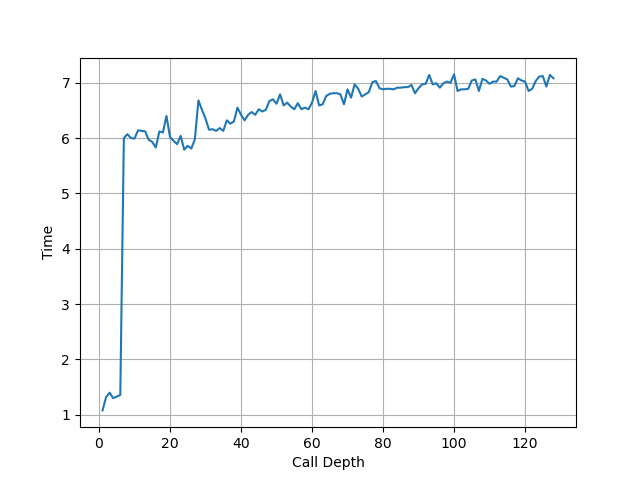

# Intel Gracemont 微架构评测

## 背景

[之前](./intel-golden-cove.md) 测试了 Intel Alder Lake 的 P 核微架构，这次就来测一下 Alder Lake 的 E 核微架构 Gracemont。

<!-- more -->

## 官方信息

Intel 关于 Gracemont 微架构有这些官方的信息：

- [Intel Alder Lake CPU Architectures](https://ieeexplore.ieee.org/document/9747991)
- [Alder Lake Architecture on Hot Chips 33](https://hc33.hotchips.org/assets/program/conference/day1/HC2021.C1.1%20Intel%20Efraim%20Rotem.pdf)
- [Intel 64 and IA-32 Architectures Optimization Reference Manual Volume 1](https://www.intel.com/content/www/us/en/content-details/671488/intel-64-and-ia-32-architectures-optimization-reference-manual-volume-1.html)

## 现有评测

网上已经有较多针对 Gracemont 微架构的评测和分析，建议阅读：

- [Gracemont: Revenge of the Atom Cores](https://chipsandcheese.com/2021/12/21/gracemont-revenge-of-the-atom-cores/)
- [Intel’s Gracemont Small Core Eclipses Last-Gen Big Core Performance](https://fuse.wikichip.org/news/6102/intels-gracemont-small-core-eclipses-last-gen-big-core-performance/)

下面分各个模块分别记录官方提供的信息，以及实测的结果。读者可以对照已有的第三方评测理解。官方信息与实测结果一致的数据会加粗。

## Benchmark

Intel Gracemont 的性能测试结果见 [SPEC](../../../benchmark/index.md)。

## 前端

### Fetch

官方信息：

- 2x 32B/cycle

Gracemont 的 Clustered Decode 架构比较特别，目前没有找到方法去证实它的 Fetch 带宽，后续如果找到了更好的方法，再测这个特性。

### Decode

官方信息：

- 2x 3-wide

Gracemont 的 Clustered Decode 架构比较特别，目前没有找到方法去确认它 2x 3-wide 的 Decode 带宽，后续如果找到了更好的方法，再测这个特性。

### L1 ICache

官方信息：

- **64KB**

为了测试 L1 ICache 容量，构造一个具有巨大指令 footprint 的循环，由大量的 4 字节 nop 和最后的分支指令组成。观察在不同 footprint 大小下的 IPC：


可以看到 footprint 在 64 KB 之前时可以达到 5 IPC，之后则降到 3.25 IPC，这里的 64 KB 就对应了 L1 ICache 的容量。

### L1 ITLB

官方信息：

- **64 entries**, fully associative

构造一系列的 jmp 指令，使得 jmp 指令分布在不同的 page 上，使得 ITLB 成为瓶颈：


可以看到 64 个 Page 出现了明显的拐点，对应的就是 64 的 L1 ITLB 容量。过了拐点后，每次 jmp 的时间延长到了 16 个周期左右，包括了 L2 TLB 到 L1 ITLB 的 refill 时间。

### Return Stack

用之前设计的 Return Stack 测试代码来测试 Gracemont，它的 call/ret 是成对的，也就是 ret 的返回地址不变，称这个版本为 A。此时发现不同调用深度下，都能做到 2 cycle 每 call/ret 对，没有观察到性能的下降，说明此时 Return Stack 并没有介入，应该是由 BTB 提供了预测。下面是 A 版本代码在 Gracemont 上的测试结果：



为了解决这个问题，修改代码，在函数里构造两个 call 去调用同一个函数，这样 ret 的返回地址就会变化了，称这个版本为 B。这时候跑出来的结果比较奇怪，周期数快速上升：


同样的 B 版本代码在 AMD Zen3 和 Apple Firestorm 的处理器上，可以观察到在符合预期的 Return Stack 大小处出现性能拐点，和 A 版本代码得到的结论一致。而 B 版本代码在 Golden Cove 上，会观察到在 6 的附近有一个性能下降如下图，但之前用 [A 版本代码测得的拐点为 20](./intel-golden-cove.md):



这个区别背后的原因还需要进一步的分析。下面是两个版本的汇编代码的对比：

```asm
# version A
func_n:
    call func_{n-1}
    ret

# version B, generate two alternating call sites
func_n:
    mov %rdi, %rsi
    and $1, %rsi
    je 2f

    call func_{n-1}
    jmp 3f

2:
    call func_{n-1}
    jmp 3f

3:
    ret

```

## 后端

### Rename

官方信息：

- **5-wide**

在先前测试 L1 ICache 容量的时候，观察到的最大的 IPC 就是 5，此时测得的瓶颈在于 Rename 宽度，对应 5-wide Rename。

### Execution Units

官方信息：

- 6 alu ports: 0/1/2/3/30/31
    - P0: ALU/SHIFT
    - P1: ALU/SHIFT/MUL/DIV
    - P2: ALU/SHIFT/MUL/DIV
    - P3: ALU/SHIFT
    - P30: JMP
    - P31: JMP
- 3 simd ports: 20/21/22
    - P20: SALU/SIMUL/FMUL/FADD/FDIV/AES/SHA
    - P21: SALU/FMUL/FADD/AES
    - P22: SALU
- 2 load ports: 10/11
- 2 store address ports: 12/13
- 2 store data ports: 8/9
- 2 simd store data ports: 28/29
- ports 10/11/12/13 shares a reservation station
- ports 8/9/30/31 shares a reservation station
- ports 28/29 shares a reservation station
- ports 20/21/22 shares a reservation station

实测各类指令的吞吐：

- NOP: 5 IPC
- ALU: 4 IPC

### LSU

官方信息：

- **2x 16B Load/cycle, 2x 16B Store/cycle**
- **Load latency 3-4 cycle**

#### Load Store 带宽

针对 Load Store 带宽，实测每个周期可以完成：

- 2x 128b Load
- 2x 128b Load + 2x 128b Store
- 2x 128b Store
- 1x 256b Load
- 1x 256b Load + 1x 256b Store
- 1x 256b Store

最大的读带宽是 32B/cyc，最大的写带宽是 32B/cyc，二者可以同时达到。

#### Store to Load Forwarding

官方信息：

- Loads that forward from stores can do so in the same load to use latency as cache hits for
cases where the store's address is known, and the store data is available.

经过实际测试，Gracemont 上如下的情况可以成功转发，对地址 x 的 Store 转发到对地址 y 的 Load 成功时 y-x 的取值范围：

| Store\Load | 8b Load | 16b Load | 32b Load | 64b Load |
|------------|---------|----------|----------|----------|
| 8b Store   | {0}     | {}       | {}       | {}       |
| 16b Store  | {0}     | {0}      | {}       | {}       |
| 32b Store  | {0}     | {0}      | {0}      | {}       |
| 64b Store  | {0}     | {0}      | {0,4}    | {0}      |

可以看到，Gracemont 在 Store 包含 Load 且地址相同时可以转发。特别地，针对 64b Store 到 32b Load 转发还允许 y-x=4。各种情况下的 CPI：

- 转发成功时，CPI 比较复杂，有的情况是介于 0.5 到 2 之间，有时候又是介于 2 到 4 之间，有时候是 6
- 重合但不能转发时，CPI 等于 11，特殊情况下还出现了 28.5

不支持多个 Store 对同一个 Load 的转发。跨缓存行时不能转发。

即使 Load 和 Store 不重合，但在一定情况下，也会出现 CPI 等于 11 的情况，例如：

- 对地址 3 的 16b Store 转发到地址 0 的 8b Load
- 对地址 1 的 64b Store 转发到地址 9/10/11 的 64b Load
- 对地址 0 的 8b Store 转发到地址 1/2/3 的 64b Load
- 对地址 0 的 8b Store 转发到地址 3 的 16b Load

在以上几种情况下，Load 和 Store 访问范围并不重合，但性能和访问范围重合且转发失败时相同（CPI 等于 11），由此猜测 Gracemont 判断是否重合是以对齐的 4B 为粒度，如果 Load 和 Store 访问了相同的对齐的 4B 块，即使不重合，一定情况下也可能会被当成重合的情况来处理，但由于实际上并没有重合，就没法转发，性能就比较差。

小结：Gracemont 的 Store to Load Forwarding：

- 1 ld + 1 st: 要求 st 完全包含 ld 且地址相同且不能跨缓存行；特别地，64b Store 到 32b Load 转发允许 y-x=4
- 1 ld + 2+ st: 不支持

#### Load to Use Latency

测试不同场景下的 Load to Use Latency：

- `mov 0(%rsi), %rsi`: 3 cycle，但在跨越 64B 缓存行边界时退化到 11 cycle
- `mov 8(%rsi), %rsi`: 3 cycle
- `mov 0(%rsp, %rsi, 8), %rsi`: 4 cycle
- `mov 0(%rsi, %rdx, 8), %rsi`: 4 cycle
- Load to ALU Latency: 4 cycle

### L1 DCache

官方信息：

- 32KB
- dual ported

### L1 DTLB

官方信息：

- 32 entries, fully associative

用类似测 L1 DCache 的方法测试 L1 DTLB 容量，只不过把 pointer chasing 链的指针分布在不同的 page 上，使得 DTLB 成为瓶颈。奇怪的是，虽然官方信息写的是 32-entry 的 L1 DTLB，但是实测它有 48-entry：


这个观察和 [Meteor Lake’s E-Cores: Crestmont Makes Incremental Progress](https://chipsandcheese.com/p/meteor-lakes-e-cores-crestmont-makes-incremental-progress) 是一致的，怀疑是 Intel 写错了数据。

### L2 TLB

官方信息：

- 4-way **2048** entries for 4K/2M pages
- fully associative 8 entries for 1GB pages
- 4 page walkers

使用类似 L1 DTLB 的方式去测试 L2 TLB，在 2048 附近观察到了拐点：


这个结果和官方数据是吻合的。

### L2 Cache

官方信息：

- 2MB/4MB Shared among 4 cores
- 64 B/cycle shared among 4 cores
- 17 cycle latency

### ReOrder Buffer

官方信息：

- **256 entries**
- 8 wide retirement

为了测试 ROB 的大小，设计了一个循环，循环开始和结束是长延迟的 long latency load。中间是若干条 NOP 指令，当 NOP 指令比较少时，循环的时候取决于 load 指令的时间；当 NOP 指令数量过多，填满了 ROB 以后，就会导致 ROB 无法保存循环末尾的 load 指令，性能出现下降。测试结果如下：


当 NOP 数量达到 256 时，性能开始急剧下滑，说明 Golden Cove 的 ROB 大小是 256。
