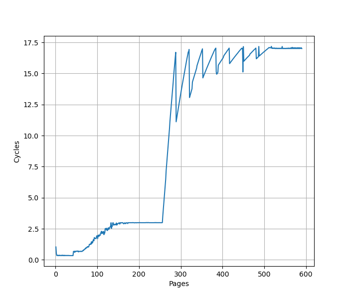
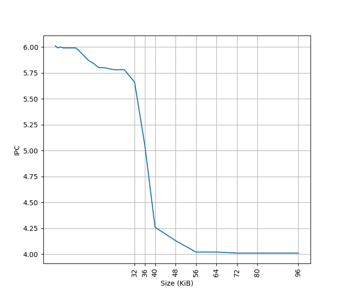
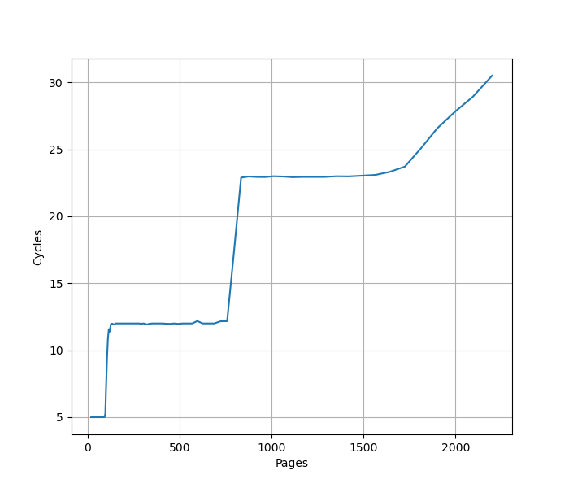
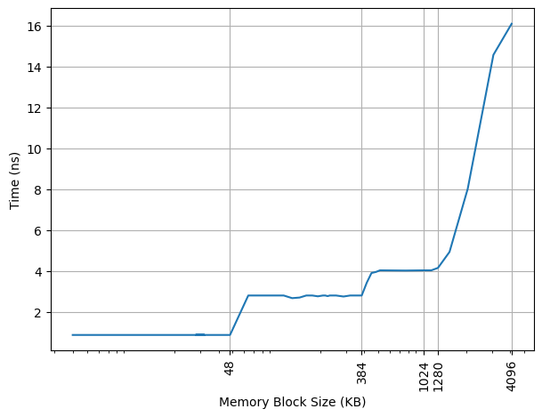
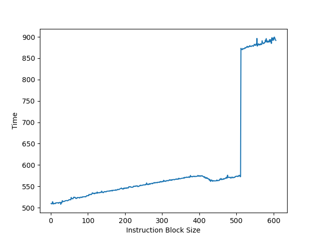

# Intel Golden Cove 微架构评测

## 背景

前段时间测试了 AMD/Apple/Qualcomm/ARM 的处理器的微架构，自然不能漏了 Intel。虽然 Intel 已经出了 Redwood Cove 和 Lion Cove，但手上没有设备，而且 Golden Cove 也是“相对比较成功”（“缩缸的是 Raptor Cove，和我 Golden Cove 有什么关系，虽然其实 Raptor Cove 是 Golden Cove Refresh”）的一代微架构，用在了 Alder Lake 和 Sapphire Rapids 上，因此就来分析它，后续有机会也会分析一下对应的 E 核架构 Gracemont。

<!-- more -->

## 官方信息

Intel 关于 Golden Cove 微架构有这些官方的信息：

- [Intel Alder Lake CPU Architectures](https://ieeexplore.ieee.org/document/9747991)
- [Alder Lake Architecture on Hot Chips 33](https://hc33.hotchips.org/assets/program/conference/day1/HC2021.C1.1%20Intel%20Efraim%20Rotem.pdf)
- [Sapphire Rapids on Hot Chips 33](https://hc33.hotchips.org/assets/program/conference/day1/HC2021.C1.4%20Intel%20Arijit.pdf)
- [Intel 64 and IA-32 Architectures Optimization Reference Manual Volume 1](https://www.intel.com/content/www/us/en/content-details/671488/intel-64-and-ia-32-architectures-optimization-reference-manual-volume-1.html)

## 现有评测

网上已经有较多针对 Golden Cove 微架构的评测和分析，建议阅读：

- [Popping the Hood on Golden Cove](https://chipsandcheese.com/2021/12/02/popping-the-hood-on-golden-cove/)
- [Golden Cove](https://en.wikipedia.org/wiki/Golden_Cove)
- [Golden Cove’s Vector Register File: Checking with Official (SPR) Data](https://chipsandcheese.com/2023/01/15/golden-coves-vector-register-file-checking-with-official-spr-data/)
- [4th Gen Intel Xeon Scalable Sapphire Rapids Leaps Forward](https://www.servethehome.com/4th-gen-intel-xeon-scalable-sapphire-rapids-leaps-forward/7/)
- [Intel Details Golden Cove: Next-Generation Big Core For Client and Server SoCs](https://fuse.wikichip.org/news/6111/intel-details-golden-cove-next-generation-big-core-for-client-and-server-socs/)
- [Sapphire Rapids: Golden Cove Hits Servers](https://chipsandcheese.com/2023/03/12/a-peek-at-sapphire-rapids/)
- [Golden Cove’s Lopsided Vector Register File](https://chipsandcheese.com/2022/12/25/golden-coves-lopsided-vector-register-file/)

下面分各个模块分别记录官方提供的信息，以及实测的结果。读者可以对照已有的第三方评测理解。官方信息与实测结果一致的数据会加粗。

## Benchmark

Intel Golden Cove 的性能测试结果见 [SPEC](../../../benchmark.md)。

## 前端

### Fetch

官方信息：

- Legacy decode pipeline fetch bandwidth is increased from 16 to 32 bytes/cycle

### Decode

官方信息：

- The number of decoders is increased from 4 to 6

### uOP Cache

官方信息：

- The micro-op cache size is increased to hold 4,000 micro-ops,
- and its bandwidth is increased to deliver up to 8 micro-ops per cycle.

### L1 ITLB

官方信息：

- the iTLBs is doubled to hold **256** entries for 4-KB pages and 32 entries for 2/4 million pages

构造一系列的 jmp 指令，使得 jmp 指令分布在不同的 page 上，使得 ITLB 成为瓶颈：

可以看到 256 个 Page 出现了明显的拐点，对应的就是 256 的 L1 ITLB 容量。注意要避免 ICache 和 BTB 的容量成为瓶颈，把 jmp 指令分布在不同的 Cache Line 和 BTB entry 上。

超过 256 个 Page 以后，如图有周期数突然下降后缓慢上升的情况（例如横坐标 288->289、320->321、352->353、384->385 等，以 32 为周期），背后的原理需要进一步分析。

扩大 jmp 指令的距离再测试：

- 如果每 2/4 个 page 放一条 jmp 指令，容量不变还是 256 个 Page
- 如果改成每 8 个 page 一条 jmp 指令，容量下降到 32 个 Page
- 每 16 个 page 一条 jmp，容量下降到 16 个 Page
- 每 32/64/128 个 page 一条 jmp 指令，容量是 8 个 Page

从这个结果来看，L1 ITLB 对于 4K 页应该是 32 Set 8 Way。

### L1 ICache

官方信息：

- **32KB**

为了测试 L1 ICache 容量，构造一个具有巨大指令 footprint 的循环，由大量的 4 字节 nop 和最后的分支指令组成。观察在不同 footprint 大小下的 IPC：

可以看到 footprint 在 32 KB 之前时可以达到 6 IPC，之后则降到 4 IPC，这里的 32 KB 就对应了 L1 ICache 的容量。

### Return Stack

构造不同深度的调用链，测试每次调用花费的平均时间，得到下面的图：

可以看到调用链深度为 20 时性能突然变差，因此 Return Stack 深度为 20。

## 后端

### Rename

官方信息：

- Rename/allocation width grows from 5 to 6 wide

### Execution Units

官方信息：

- The number of execution ports goes from 10 to 12
- five LEA units as well as five integer ALUs
- three-cycle fast adders, with two cycles bypass between back-to-back floating-point ADD operations
- five alu/simd ports: 0/1/5/6/10
    - P0: ALU/LEA/Shift/JMP/FMA/ALU/Shift/fpDIV
    - P1: ALU/LEA/Mul/iDIV/FMA/ALU/Shift/Shuffle/FADD
    - P5: ALU/LEA/MulHi/FMA512/ALU/AMX/Shuffle/FADD
    - P6: ALU/LEA/Shift/JMP
    - P10: ALU/LEA
- 3 load ports: 2/3/11
- 2 store address ports: 7/8
- 2 store data ports: 4/9

### LSU

官方信息：

- Port 11 provides a third load port with a dedicated address-generation unit
- Load 64Bx2 or **32Bx3** per cycle
- Store 64Bx2 or 32Bx3 per cycle
- The L1 load to use latency is **5** cycles

#### Load Store 带宽

针对 Load Store 带宽，实测每个周期可以完成：

- 3x 256b Load
- 2x 256b Load + 2x 256b Store
- 1x 256b Load + 2x 256b Store
- 2x 256b Store

因为测试环境是 Client 而非 Server，所以 AVX512 被屏蔽了，无法测试 AVX512 的读写带宽。此时最大的读带宽是 96B/cyc，最大的写带宽是 64B/cyc，二者不能同时达到。

#### Store to Load Forwarding

官方信息：

- Partial store forwarding allowing forwarding data from store to load also when only part of the load was covered by the store (in case the load's offset matches the store's offset)

经过实际测试，Golden Cove 上如下的情况可以成功转发，对地址 x 的 Store 转发到对地址 y 的 Load 成功时 y-x 的取值范围：

| Store\Load | 8b Load | 16b Load | 32b Load | 64b Load |
|------------|---------|----------|----------|----------|
| 8b Store   | {0}     | {}       | {}       | {}       |
| 16b Store  | [0,1]   | {0}      | {}       | {}       |
| 32b Store  | [0,3]   | [0,2]    | {0}      | {}       |
| 64b Store  | [0,7]   | [0,6]    | [0,4]    | {0}      |

可以看到，Golden Cove 在 Store 完全包含 Load 的情况下都可以转发，没有额外的对齐要求。但当 Load 和 Store 只有部分重合时，就无法转发，这和官方信息有所冲突。两个连续的 32 位的 Store 和一个 64 位的 Load 重合也不能转发。

比较有意思的是，在 y=x 且不跨越缓存行边界且满足下列要求的情况下，Store Forwarding 不会带来性能损失，就好像 Load Store 访问的是不同的没有 Overlap 的地址一样：

- 8b Store -> 8b Load
- 32b Store -> 8b Load
- 64b Store -> 8b Load
- 16b Store -> 16b Load
- 32b Store -> 32b Load
- 64b Store -> 32b Load

考虑到 y 必须等于 x，也就是地址要一样，并且没有带来性能损失，猜测 Golden Cove 使用了类似 Memory Renaming 的技术来实现这个效果。如果是连续两个对同一个地址的 Store 对一个 Load 的转发，效果和只有一个 Store 是一样的。

除了上述情况以外，Store Forwarding 成功时的延迟在 5 个周期，失败则要 19 个周期。

小结：Golden Cove 的 Store to Load Forwarding：

- 1 ld + 1 st: 要求 st 包含 ld，特别地，地址相同时，性能最好
- 1 ld + 2+ st: 不支持

### L1 DCache

官方信息：

- **48KB**

构造不同大小 footprint 的 pointer chasing 链，测试不同 footprint 下每条 load 指令耗费的时间：

可以看到 48KB 出现了明显的拐点，对应的就是 48KB 的 L1 DCache 容量。第二个拐点在 384KB，对应的是 L1 DTLB 的容量。

### L1 DTLB

官方信息：

- **96-entry** 6-way 4-KB-page TLB
- 32-entry 4-way 2-MB/4-MB-page TLB
- 8-entry 1-GB-page TLB for loads
- A 16-entry TLB for stores serves all page sizes

用类似测 L1 DCache 的方法测试 L1 DTLB 容量，只不过这次 pointer chasing 链的指针分布在不同的 page 上，使得 DTLB 成为瓶颈：

可以看到 96 Page 出现了明显的拐点，对应的就是 96 的 L1 DTLB 容量。没有超出 L1 DTLB 容量前，Load to use latency 是 5 cycle；超出 L1 DTLB 容量后，Load to use latency 是 12 cycle，说明 L1 DTLB miss 带来了 7 cycle 的损失。

### L2 TLB

官方信息：

- 2,048-entry second level TLB (STLB)
- 4 page table walkers

沿用之前测试 L1 DTLB 的方法，把规模扩大到 L2 Unified TLB 的范围，就可以测出来 L2 Unified TLB 的容量，下面是 Golden Cove 上的测试结果：

第一个拐点是 96 个 Page，对应 L1 DTLB，此时 CPI 从 5 提升到 12；第二个拐点是 768，对应 L1 DCache，此时 CPI 从 12 提升到 23；第三个拐点是 1600 左右，而没有到 2048，猜测有 QoS 限制了数据对 L2 TLB 的占用。

### L2 Cache

官方信息：

- 1.25MB(Client)/2MB(Server)
- 64 bytes/cycle
- 15 cycle latency

构造不同大小 footprint 的 pointer chasing 链，测试不同 footprint 下每条 load 指令耗费的时间：

- 第一个拐点在 48KB，对应 L1 DCache 的容量，CPI 从 5 提升到 16
- 第二个拐点在 384KB，对应 L1 DTLB 的容量，CPI 从 16 提升到 23
- 第三个拐点在 1280KB，对应 L2 Cache 的容量

### ReOrder Buffer

官方信息：

- **512-entry** reorder buffer
- 8 wide retirement

为了测试 ROB 的大小，设计了一个循环，循环开始和结束是长延迟的 long latency load。中间是若干条 NOP 指令，当 NOP 指令比较少时，循环的时候取决于 load 指令的时间；当 NOP 指令数量过多，填满了 ROB 以后，就会导致 ROB 无法保存循环末尾的 load 指令，性能出现下降。测试结果如下：

当 NOP 数量达到 512 时，性能开始急剧下滑，说明 Golden Cove 的 ROB 大小是 512。
