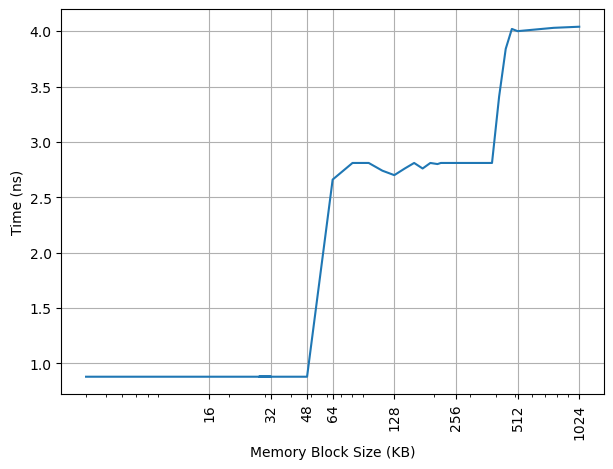
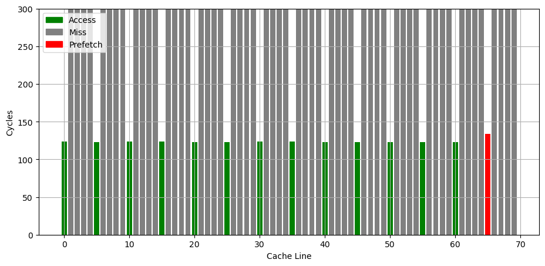
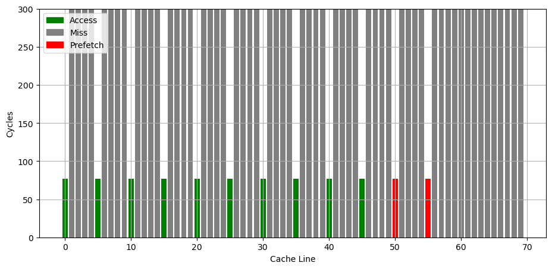

# Intel Golden Cove 微架构评测

## 背景

前段时间测试了 AMD/Apple/Qualcomm/ARM 的处理器的微架构，自然不能漏了 Intel。虽然 Intel 已经出了 Redwood Cove 和 Lion Cove，但手上没有设备，而且 Golden Cove 也是“相对比较成功”（“缩缸的是 Raptor Cove，和我 Golden Cove 有什么关系，虽然其实 Raptor Cove 是 Golden Cove Refresh”）的一代微架构，用在了 Alder Lake 和 Sapphire Rapids 上，因此就来分析它，后续有机会也会分析一下对应的 E 核架构 Gracemont。

<!-- more -->

## 官方信息

Intel 关于 Golden Cove 微架构有这些官方的信息：

- [Intel Alder Lake CPU Architectures](https://ieeexplore.ieee.org/document/9747991)
- [Alder Lake Architecture on Hot Chips 33](https://hc33.hotchips.org/assets/program/conference/day1/HC2021.C1.1%20Intel%20Efraim%20Rotem.pdf)
- [Sapphire Rapids on Hot Chips 33](https://hc33.hotchips.org/assets/program/conference/day1/HC2021.C1.4%20Intel%20Arijit.pdf)
- [Intel 64 and IA-32 Architectures Optimization Reference Manual Volume 1](https://www.intel.com/content/www/us/en/content-details/671488/intel-64-and-ia-32-architectures-optimization-reference-manual-volume-1.html)

## 现有评测

网上已经有较多针对 Golden Cove 微架构的评测和分析，建议阅读：

- [Popping the Hood on Golden Cove](https://chipsandcheese.com/2021/12/02/popping-the-hood-on-golden-cove/)
- [Golden Cove](https://en.wikipedia.org/wiki/Golden_Cove)
- [Golden Cove’s Vector Register File: Checking with Official (SPR) Data](https://chipsandcheese.com/2023/01/15/golden-coves-vector-register-file-checking-with-official-spr-data/)
- [4th Gen Intel Xeon Scalable Sapphire Rapids Leaps Forward](https://www.servethehome.com/4th-gen-intel-xeon-scalable-sapphire-rapids-leaps-forward/7/)
- [Intel Details Golden Cove: Next-Generation Big Core For Client and Server SoCs](https://fuse.wikichip.org/news/6111/intel-details-golden-cove-next-generation-big-core-for-client-and-server-socs/)
- [Sapphire Rapids: Golden Cove Hits Servers](https://chipsandcheese.com/2023/03/12/a-peek-at-sapphire-rapids/)
- [Golden Cove’s Lopsided Vector Register File](https://chipsandcheese.com/2022/12/25/golden-coves-lopsided-vector-register-file/)
- [Indirector: High-Precision Branch Target Injection Attacks Exploiting the Indirect Branch Predictor](https://indirector.cpusec.org/)

下面分各个模块分别记录官方提供的信息，以及实测的结果。读者可以对照已有的第三方评测理解。官方信息与实测结果一致的数据会加粗。

## Benchmark

Intel Golden Cove 的性能测试结果见 [SPEC](../../../benchmark.md)。

## 前端

### Fetch

官方信息：

- Legacy decode pipeline fetch bandwidth is increased from 16 to 32 bytes/cycle

### Decode

官方信息：

- The number of decoders is increased from 4 to 6

### DSB/uOP Cache

官方信息：

- The micro-op cache size is increased to hold 4,000 (注：应该是 4096) micro-ops,
- and its bandwidth is increased to deliver up to 8 micro-ops per cycle.

Intel 的 uOP(Micro-OP) Cache 称为 Decode Stream Buffer (DSB): `Decode Stream Buffer (DSB) is a Uop-cache that holds translations of previously fetched instructions that were decoded by the legacy x86 decode pipeline (MITE).`。

uOP Cache 的组织方式通常是组相连，每个 entry 保存了几条 uOP，这些 uOP 对应了原来指令流中连续的几条指令。

为了测试 uOP Cache 的大小，构造不同大小的循环，循环体是复制若干份的 `add %%rsi, %%rdx` 指令，最后是 `dec + jnz` 作为循环结尾，通过 [IDQ.DSB_UOPS](https://perfmon-events.intel.com/index.html?pltfrm=ahybrid.html&evnt=IDQ.DSB_UOPS) 性能计数器统计每次循环有多少个 uOP 来自于 DSB 也就是 uOP Cache，发现其最大值为 2800 左右，距离 4K 还有一定的距离。目前还没有找到一个可以稳定跑出 4K uOP 的指令模式，不知道遇到了什么瓶颈。

考虑到 taken branch 在典型的 uOP Cache 设计中会结束一个 entry，把循环体改成若干条 `jmp` 指令，并且每个 64B 缓存行只有一条 `jmp` 指令，此时每个 uOP entry 只记录一条 `jmp` 指令。观察到每次循环最多 512 个 uOP 来自 uOP Cache，那么 Golden Cove 的 uOP Cache 大概就是 512 个 entry。如果改成每 128B 缓存行只有一条 `jmp` 指令，uOP Cache 容量减少到 256 个 entry；继续增加间距，256B 间距对应 128 个 entry，512B 间距对应 64 个 entry，1024B 间距对应 32 个 entry，2048B 间距对应 16 个 entry，4096B 间距对应 8 个 entry，继续增大间距后，entry 数维持中 8 不再减少，意味着 Golden Cove 的 uOP Cache 是 8 Way 64 Set 一共 512 Entry，Index 是 PC[11:6]。

那么按照官方信息所说的 4K 容量，一共 512 个 Entry，那么每个 Entry 应该能够记录最多 8 个 uOP，这正好也对应上了 8 uOP 的吞吐。

根据前人在 Intel 比较老的微架构上的测试结果（见 [The microarchitecture of Intel, AMD, and VIA CPUs](https://agner.org/optimize/microarchitecture.pdf)）以及 Intel 的官方文档 Software Optimization Manual（这个文档把 uOP Cache 叫做 Decoded ICache），Intel 之前很多代微架构的 uOP Cache Entry 的构造条件是：

1. 每个 Entry 能记录的 uOP 个数有上限，最多 6 uOP/Entry
2. Entry 不能跨越 32B 边界，反过来，一个对齐的 32B 区间只能对应最多 3 个 Entry，结合第一条，就是对齐的 32B 块中不能超过 `3*6=18` 个 uOP（`The Decoded ICache can hold only up to 18 micro-ops per each 32 byte aligned memory chunk`）；如果指令跨了 32B 边界，它被算在后面那个 32B 里面
3. 指令需要完整地出现在一个 Entry 中：如果一条指令需要的空间太多，在当前 Entry 的剩余空间内放不下，就需要另起一个 Entry
4. 无条件跳转（或者被预测为要跳转）的指令会结束一个 Entry（`each unconditional branch is the last micro-op occupying a Decoded ICache Way`）
5. 比较大的立即数也会占用 uOP 空间，减少了实际能存放的 uOP 数量
6. 比较复杂的需要微码（Microcoded uops）的指令会占用一整个 Entry

下面来分析 Golden Cove 上这些构造条件是否有变化。参考 [I See Dead µops: Leaking Secrets via Intel/AMD Micro-Op Caches](https://ieeexplore.ieee.org/document/9499837) 的方法，构造了一个循环，循环体由 `4x 15-byte-nop + 1x 4-byte-nop` 组成，这样的 5 条指令填满了对齐的 64B。在 Golden Cove 上测试，发现依然可以用满 512 个 Entry，假如 Entry 不能跨越 32B 边界，那么这 5 条指令至少就要 2 个 Entry，但实际上只用了 1 个 Entry。这说明 Golden Cove 上 uOP Cache Entry 的第一条限制中，Entry 不能跨越的边界，从 32B 扩大到了 64B，毕竟每个 Entry 能存的 uOP 数量也增多了，如果继续限制 32B，每个 Entry 就很难存满 8 个 uOP 了。接下来测试对齐的 64B 内可以最多有多少个 entry。

把循环体改成每对齐的 64B 就有四条 jmp 指令，前一条 jmp 指令跳转到后一条 jmp 指令，模拟每 64B 有四个 Entry 的情况：

1. 第 1 个 jmp 放在 64B 内的 0B 偏移处，跳转到 64B 内 16B 偏移处
2. 第 2 个 jmp 放在 64B 内的 16B 偏移处，跳转到 64B 内 32B 偏移处
3. 第 3 个 jmp 放在 64B 内的 32B 偏移处，跳转到 64B 内 48B 偏移处
4. 第 4 个 jmp 放在 64B 内的 48B 偏移处，跳转到下一个 64B 的开头

测试发现这个情况下能达到 512 个 Entry。说明对齐的 64B 内至少可以存 4 个 Entry。

进一步测试，如果每对齐的 64B 有五条 jmp 指令，模拟每 64B 有五个 Entry 的情况：

1. 第 1 个 jmp 放在 64B 内的 0B 偏移处，跳转到 64B 内 8B 偏移处
2. 第 2 个 jmp 放在 64B 内的 8B 偏移处，跳转到 64B 内 16B 偏移处
3. 第 3 个 jmp 放在 64B 内的 16B 偏移处，跳转到 64B 内 24B 偏移处
4. 第 4 个 jmp 放在 64B 内的 24B 偏移处，跳转到 64B 内 32B 偏移处
5. 第 5 个 jmp 放在 64B 内的 32B 偏移处，跳转到下一个 64B 的开头

发现最高的 Entry 数只有 480 左右，不确定是遇到了什么限制，如果对齐的 64B 内不能存 5 个 Entry，也不应该得到 480 这个结果。

如果单独去测试每个对齐的 64B 能缓存多少个 uOP，比如每个对齐的 64B 里由若干条 nop 加最后一条跳到下一个 64B 开头的 jmp 指令组成，会发现当对齐的 64B 内的 uOP 个数从 36 个变成 37 个时，uOP Cache 命中率急剧下降。这意味着，每对齐的 64B 内依然不能存超过 36 个 uOP。这类似于原来的每对齐的 32B 内不能存超过 18 个 uOP，但粒度更粗，实际上更加宽松，比如对齐的 64B 内的前 32B 可以全是 NOP 指令，只要 64B 内总数不超过 36 就可以。但比较奇怪的是，36 uOP per 64B 不能整除 8 uOP/Entry，不像原来的 18 per 32B 可以整除 6 uOP/Entry。

### L1 ITLB

官方信息：

- the iTLBs is doubled to hold **256** entries for 4-KB pages and 32 entries for 2/4 million pages

构造一系列的 jmp 指令，使得 jmp 指令分布在不同的 page 上，使得 ITLB 成为瓶颈：

可以看到 256 个 Page 出现了明显的拐点，对应的就是 256 的 L1 ITLB 容量。注意要避免 ICache 和 BTB 的容量成为瓶颈，把 jmp 指令分布在不同的 Cache Line 和 BTB entry 上。

超过 256 个 Page 以后，如图有周期数突然下降后缓慢上升的情况（例如横坐标 288->289、320->321、352->353、384->385 等，以 32 为周期），背后的原理需要进一步分析。

扩大 jmp 指令的距离再测试：

- 如果每 2/4 个 page 放一条 jmp 指令，容量不变还是 256 个 Page
- 如果改成每 8 个 page 一条 jmp 指令，容量下降到 32 个 Page
- 每 16 个 page 一条 jmp，容量下降到 16 个 Page
- 每 32/64/128 个 page 一条 jmp 指令，容量是 8 个 Page

从这个结果来看，L1 ITLB 对于 4K 页应该是 32 Set 8 Way。

### L1 ICache

官方信息：

- **32KB**

为了测试 L1 ICache 容量，构造一个具有巨大指令 footprint 的循环，由大量的 4 字节 nop 和最后的分支指令组成。观察在不同 footprint 大小下的 IPC：

可以看到 footprint 在 32 KB 之前时可以达到 6 IPC，之后则降到 4 IPC，这里的 32 KB 就对应了 L1 ICache 的容量。

### Return Stack

构造不同深度的调用链，测试每次调用花费的平均时间，得到下面的图：

可以看到调用链深度为 20 时性能突然变差，因此 Return Stack 深度为 20。

### Instruction Decode Queue (IDQ) + Loop Stream Detector (LSD)

官方信息：

- The IDQ can hold 144 uops per logical processor in single thread mode, or 72 uops per thread when SMT is active.

Golden Cove 架构针对循环做了优化，Loop Stream Detector（简称 LSD）会检测当前指令流是否在一个循环当中，并且循环的 uop 不超出 Instruction Decode Queue(IDQ) 的容量，那么 LSD 会把 Legacy decode pipeline(MITE) 和 Decode stream buffer(DSB) 关掉，不再让 IDQ 的指令出队，而是直接在 IDQ 的内部循环提供指令，这个时候就节省了很多处理器前端的功耗。

为了测试 Instruction Decode Queue 的大小，构造不同大小的循环，循环体是复制若干份的 `inc %rsi` 指令，最后是 `dec + jnz` 作为循环结尾，通过 [LSD.UOPS](https://perfmon-events.intel.com/index.html?pltfrm=ahybrid.html&evnt=LSD.UOPS) 性能计数器统计每次循环有多少个 UOP 来自于 Loop Stream Detector 机制，发现其最大值为 144，说明 Golden Cove 的 Loop Stream Detector 可以识别最多 144 个 uop 的循环。此时每个循环要执行 145 条指令，最后的 `dec + jnz` 被融合成了一个 uop。

循环体中，如果用 `nop` 指令来填充，会得到 40 左右的小得多的容量，猜测是进入了低功耗模式。

### Conditional Branch Predictor

参考 [Half&Half: Demystifying Intel’s Directional Branch Predictors for Fast, Secure Partitioned Execution](https://cseweb.ucsd.edu/~dstefan/pubs/yavarzadeh:2023:half.pdf) 论文的方法，可以测出 Golden Cove 的分支预测器采用的历史更新方式为：

1. 使用 388 位的 Path History Register，每次执行 taken branch 时更新
2. 更新方式为：`PHRnew = (PHRold << 2) xor footprint`
3. footprint 共有 16 位，其中 B 代表分支指令的地址，T 代表分支跳转的目的地址：
    - footprint[0] = B[3] xor T[0]
    - footprint[1] = B[4] xor T[1]
    - footprint[2] = B[5]
    - footprint[3] = B[6]
    - footprint[4] = B[7]
    - footprint[5] = B[8]
    - footprint[6] = B[9]
    - footprint[7] = B[10]
    - footprint[8] = B[0] xor T[2]
    - footprint[9] = B[1] xor T[3]
    - footprint[10] = B[2] xor T[4]
    - footprint[11] = B[11] xor T[5]
    - footprint[12] = B[12]
    - footprint[13] = B[13]
    - footprint[14] = B[14]
    - footprint[15] = B[15]

这个结果和论文是一致的。

## 后端

### Rename

官方信息：

- Rename/allocation width grows from 5 to 6 wide

### Execution Units

官方信息：

- The number of execution ports goes from 10 to 12
- five LEA units as well as five integer ALUs
- three-cycle fast adders, with two cycles bypass between back-to-back floating-point ADD operations
- five alu/simd ports: 0/1/5/6/10
    - P0: ALU/LEA/Shift/JMP/FMA/ALU/Shift/fpDIV
    - P1: ALU/LEA/Mul/iDIV/FMA/ALU/Shift/Shuffle/FADD
    - P5: ALU/LEA/MulHi/FMA512/ALU/AMX/Shuffle/FADD
    - P6: ALU/LEA/Shift/JMP
    - P10: ALU/LEA
- 3 load ports: 2/3/11
- 2 store address ports: 7/8
- 2 store data ports: 4/9

### LSU

官方信息：

- Port 11 provides a third load port with a dedicated address-generation unit
- Load 64Bx2 or **32Bx3** per cycle
- Store 64Bx2 or 32Bx3 per cycle
- The L1 load to use latency is **5** cycles

#### Load Store 带宽

针对 Load Store 带宽，实测每个周期可以完成：

- 3x 256b Load
- 2x 256b Load + 2x 256b Store
- 1x 256b Load + 2x 256b Store
- 2x 256b Store

因为测试环境是 Client 而非 Server，所以 AVX512 被屏蔽了，无法测试 AVX512 的读写带宽。此时最大的读带宽是 96B/cyc，最大的写带宽是 64B/cyc，二者不能同时达到。

#### Store to Load Forwarding

官方信息：

- Partial store forwarding allowing forwarding data from store to load also when only part of the load was covered by the store (in case the load's offset matches the store's offset)

经过实际测试，Golden Cove 上如下的情况可以成功转发，对地址 x 的 Store 转发到对地址 y 的 Load 成功时 y-x 的取值范围：

| Store\Load | 8b Load | 16b Load | 32b Load | 64b Load |
|------------|---------|----------|----------|----------|
| 8b Store   | {0}     | {}       | {}       | {}       |
| 16b Store  | [0,1]   | {0}      | {}       | {}       |
| 32b Store  | [0,3]   | [0,2]    | {0}      | {}       |
| 64b Store  | [0,7]   | [0,6]    | [0,4]    | {0}      |

可以看到，Golden Cove 在 Store 完全包含 Load 的情况下都可以转发，没有额外的对齐要求。但当 Load 和 Store 只有部分重合时，就无法转发，这和官方信息有所冲突。两个连续的 32 位的 Store 和一个 64 位的 Load 重合也不能转发。

比较有意思的是，在 y=x 且不跨越缓存行边界且满足下列要求的情况下，Store Forwarding 不会带来性能损失，就好像 Load Store 访问的是不同的没有 Overlap 的地址一样：

- 8b Store -> 8b Load
- 32b Store -> 8b Load
- 64b Store -> 8b Load
- 16b Store -> 16b Load
- 32b Store -> 32b Load
- 64b Store -> 32b Load

考虑到 y 必须等于 x，也就是地址要一样，并且没有带来性能损失，猜测 Golden Cove 使用了类似 Memory Renaming 的技术来实现这个效果。如果是连续两个对同一个地址的 Store 对一个 Load 的转发，效果和只有一个 Store 是一样的。

除了上述情况以外，Store Forwarding 成功时的延迟在 5 个周期，失败则要 19 个周期。

小结：Golden Cove 的 Store to Load Forwarding：

- 1 ld + 1 st: 要求 st 包含 ld，特别地，地址相同时，性能最好
- 1 ld + 2+ st: 不支持

### L1 DCache

官方信息：

- **48KB**

构造不同大小 footprint 的 pointer chasing 链，测试不同 footprint 下每条 load 指令耗费的时间：

可以看到 48KB 出现了明显的拐点，对应的就是 48KB 的 L1 DCache 容量。第二个拐点在 384KB，对应的是 L1 DTLB 的容量。

### L1 DTLB

官方信息：

- **96-entry** 6-way 4-KB-page TLB
- 32-entry 4-way 2-MB/4-MB-page TLB
- 8-entry 1-GB-page TLB for loads
- A 16-entry TLB for stores serves all page sizes

用类似测 L1 DCache 的方法测试 L1 DTLB 容量，只不过这次 pointer chasing 链的指针分布在不同的 page 上，使得 DTLB 成为瓶颈：

可以看到 96 Page 出现了明显的拐点，对应的就是 96 的 L1 DTLB 容量。没有超出 L1 DTLB 容量前，Load to use latency 是 5 cycle；超出 L1 DTLB 容量后，Load to use latency 是 12 cycle，说明 L1 DTLB miss 带来了 7 cycle 的损失。

### L2 TLB

官方信息：

- 2,048-entry second level TLB (STLB)
- 4 page table walkers

沿用之前测试 L1 DTLB 的方法，把规模扩大到 L2 Unified TLB 的范围，就可以测出来 L2 Unified TLB 的容量，下面是 Golden Cove 上的测试结果：

第一个拐点是 96 个 Page，对应 L1 DTLB，此时 CPI 从 5 提升到 12；第二个拐点是 768，对应 L1 DCache，此时 CPI 从 12 提升到 23；第三个拐点是 1600 左右，而没有到 2048，猜测有 QoS 限制了数据对 L2 TLB 的占用。

### L2 Cache

官方信息：

- 1.25MB(Client)/2MB(Server)
- 64 bytes/cycle
- 15 cycle latency

构造不同大小 footprint 的 pointer chasing 链，测试不同 footprint 下每条 load 指令耗费的时间：

- 第一个拐点在 48KB，对应 L1 DCache 的容量，CPI 从 5 提升到 16
- 第二个拐点在 384KB，对应 L1 DTLB 的容量，CPI 从 16 提升到 23
- 第三个拐点在 1280KB，对应 L2 Cache 的容量

### Prefetcher

#### 官方信息

Intel Golden Cove 的处理器通过 MSR 1A4H 可以配置各个预取器（来源：Software Developers Manual，MSRs Supported by 12th and 13th Generation Intel® Core™ Processor P-core）：

- MSR_1A4H[0]: the L2 hardware prefetcher, which fetches additional lines of code or data into the L2 cache.
- MSR_1A4H[1]: the L2 adjacent cache line prefetcher, which fetches the cache line that comprises a cache line pair (128 bytes). 这和 AMD 的 Up/Down Prefetcher 应该是一个意思
- MSR_1A4H[5]: the L2 Adaptive Multipath Probability (AMP) prefetcher. 这个应该属于 Spatial Prefetcher
- MSR_1A4H[2]: the L1 data cache prefetcher, which fetches the next cache line into L1 data cache. 这个应该属于 Next Line Prefetcher
- MSR_1A4H[3]: the L1 data cache IP prefetcher, which uses sequential load history (based on instruction pointer of previous loads) to determine whether to prefetch additional lines.

#### 预取延迟

在 Golden Cove 上按 64B 的跳步进行访存，测量每次访存的延迟，得到如下结果：

可以观察到在 48KB 之内是 5 cycle latency，在 L2 Cache 范围内是 5-8 cycle latency。

如果通过 `wrmsr -p 0 0x1a4 0x8` 把 `DCU_IP_PREFETCHER_DISABLE` 设为 1，即关闭 L1 data cache IP prefetcher，再在 0 号核心上重新跑上面的测试，得到如下结果：

就可以看到 L2 Cache 的范围内的性能退化到了 16 Cycle，和随机 pointer chasing 一样。关闭其他的 prefetcher 则没有这个现象，说明正是 L1 data cache IP prefetcher 实现了针对 L1 的 Stride Prefetcher。

#### 预取距离

更进一步，参考 [Battling the Prefetcher: Exploring Coffee Lake (Part 1)](https://abertschi.ch/blog/2022/prefetching/) 的方式，研究 Stride 预取器的行为：分配一片内存，把数据从缓存中 flush 掉，再按照特定的访存模式访问，触发预取器，最后测量访问每个缓存行的时间，从而得到预取器预取了哪些缓存行的信息。

首先是只访问一个 cache line 的时候，可以看到，除了已经访问过的 cache line，其他 cache line 都出现了缓存缺失，说明此时预取器没有在工作：

接下来，按照固定的 stride 访问各个缓存行，发现当访问了五个 cache line 时，预取器会比较稳定地预取第六个 cache line：

继续增加访问次数，可以看到预取器总是会预取将要访问的下一个 cache line：

如果通过 `wrmsr -p 0 0x1a4 0x8` 把 `DCU_IP_PREFETCHER_DISABLE` 设为 1，即关闭 L1 data cache IP prefetcher，就会观察到上述 Stride 预取的行为消失，不会预取将要访问的下一个 cache line。

把相同的代码放到 Gracemont 上运行，会看到它的预取器会预取将要访问的未来两个 cache line：

可见不同微架构的预取器的策略是不同的。

### ReOrder Buffer

官方信息：

- **512-entry** reorder buffer
- 8 wide retirement

为了测试 ROB 的大小，设计了一个循环，循环开始和结束是长延迟的 long latency load。中间是若干条 NOP 指令，当 NOP 指令比较少时，循环的时候取决于 load 指令的时间；当 NOP 指令数量过多，填满了 ROB 以后，就会导致 ROB 无法保存循环末尾的 load 指令，性能出现下降。测试结果如下：

当 NOP 数量达到 512 时，性能开始急剧下滑，说明 Golden Cove 的 ROB 大小是 512。
