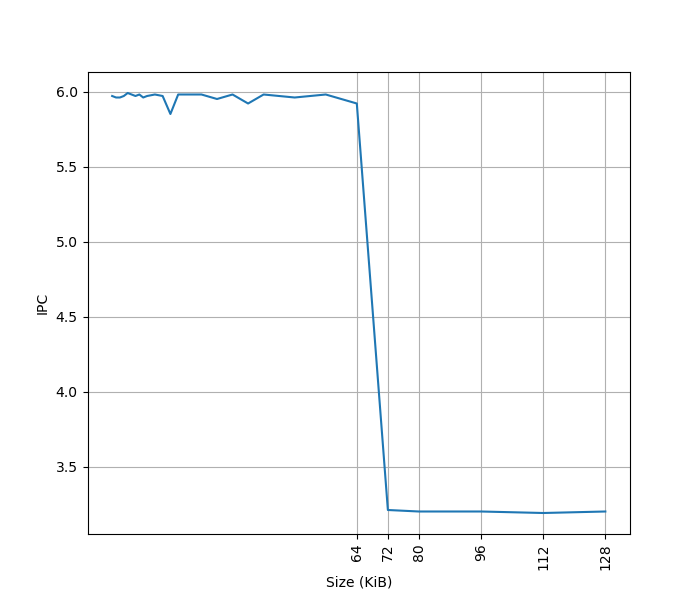
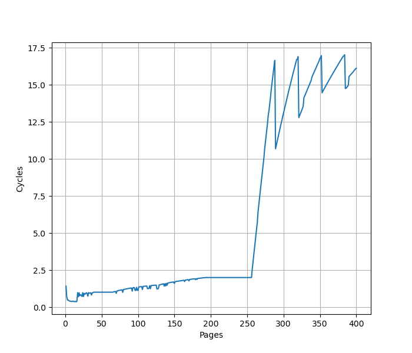
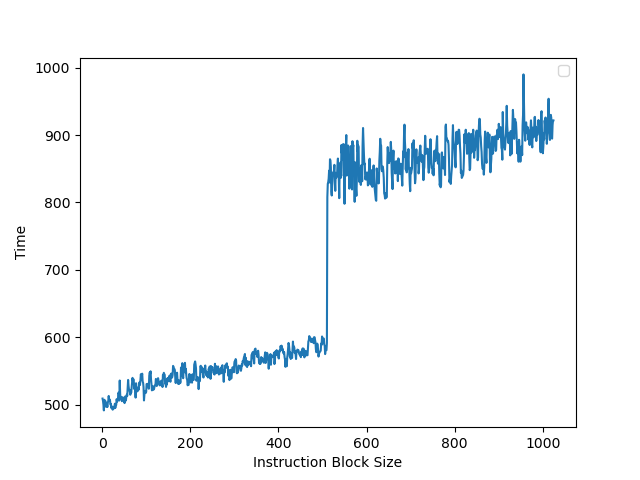

# Intel Redwood Cove 微架构评测

## 背景

之前我们测试了 Intel 的微架构 [Redwood Cove](./intel_golden_cove.md)，这次就来测一下 Redwood Cove，它被用到了 Meteor Lake 以及 Granite Rapids 上。这次就以阿里云 [g9i](https://help.aliyun.com/zh/ecs/user-guide/overview-of-instance-families#g9i) 实例的 Granite Rapids 机器来测试一下 Redwood Cove 微架构的各项指标。

<!-- more -->

## 官方信息

Intel 关于 Redwood Cove 微架构有这些官方的信息：

- [Intel® 64 and IA-32 Architectures Optimization Reference Manual Volume 1](https://www.intel.com/content/www/us/en/content-details/814198/intel-64-and-ia-32-architectures-optimization-reference-manual-volume-1.html)
- [Meteor Lake Architecture Overview](https://www.thefpsreview.com/wp-content/uploads/2023/10/Meteor-Lake-Architecture-Overview.pdf)

## 现有评测

网上已经有较多针对 Redwood Cove 微架构的评测和分析，建议阅读：

- [Intel’s Redwood Cove: Baby Steps are Still Steps](https://chipsandcheese.com/p/intels-redwood-cove-baby-steps-are-still-steps)
- [Intel Unveils Meteor Lake Architecture: Intel 4 Heralds the Disaggregated Future of Mobile CPUs](https://www.anandtech.com/show/20046/intel-unveils-meteor-lake-architecture-intel-4-heralds-the-disaggregated-future-of-mobile-cpus/2)

下面分各个模块分别记录官方提供的信息，以及实测的结果。读者可以对照已有的第三方评测理解。官方信息与实测结果一致的数据会加粗。

## Benchmark

Intel Redwood Cove 的性能测试结果见 [SPEC](../../../benchmark.md)。

## 前端

### L1 ICache

官方信息：

- Larger instruction cache: 32K→**64K**.

为了测试 L1 ICache 容量，构造一个具有巨大指令 footprint 的循环，由大量的 4 字节 nop 和最后的分支指令组成。观察在不同 footprint 大小下的 IPC：

可以看到 footprint 在 64 KB 之前时可以达到 6 IPC，之后则降到 3.2 IPC，这里的 64 KB 就对应了 L1 ICache 的容量。

### L1 ITLB

构造一系列的 jmp 指令，使得 jmp 指令分布在不同的 page 上，使得 ITLB 成为瓶颈：

可以看到 256 个 Page 出现了明显的拐点，对应的就是 256 的 L1 ITLB 容量。注意要避免 ICache 和 BTB 的容量成为瓶颈，把 jmp 指令分布在不同的 Cache Line 和 BTB entry 上。

超过 256 个 Page 以后，如图有周期数突然下降后缓慢上升的情况（例如横坐标 288->289、320->321、352->353、384->385 等，以 32 为周期），背后的原理需要进一步分析。

和 [Golden Cove](./intel_golden_cove.md) 是一样的。

### Instruction Decode Queue (IDQ) + Loop Stream Detector (LSD)

官方信息：

- Improved LSD coverage: the IDQ can hold **192** μops per logical processor in single-thread mode or 96 μops per thread when SMT is active.

为了测试 Instruction Decode Queue 的大小，构造不同大小的循环，循环体是复制若干份的 `inc %rsi` 指令，最后是 `dec + jnz` 作为循环结尾，通过 [LSD.UOPS](https://perfmon-events.intel.com/index.html?pltfrm=ahybrid.html&evnt=LSD.UOPS) 性能计数器统计每次循环有多少个 UOP 来自于 Loop Stream Detector 机制，发现其最大值为 191，说明 Redwood Cove 的 Loop Stream Detector 可以识别最多 191 个 uop 的循环。此时每个循环要执行 192 条指令，最后的 `dec + jnz` 被融合成了一个 uop。

循环体中，如果用 `nop` 指令来填充，会得到 39 左右的比 192 小得多的容量，猜测是进入了低功耗模式。

### Instruction Prefetch Instruction

官方信息：

- Code Software Prefetch x86 architecture extension (Granite Rapids only).
- PREFETCHIT0: (temporal code)—prefetch code into all levels of the cache hierarchy.
- PREFETCHIT1: (temporal code with respect to first level cache misses)—prefetch code into all but the first-level of the cache hierarchy.

### Conditional Branch Predictor

参考 [Half&Half: Demystifying Intel’s Directional Branch Predictors for Fast, Secure Partitioned Execution](https://cseweb.ucsd.edu/~dstefan/pubs/yavarzadeh:2023:half.pdf) 论文的方法，可以测出 Redwood Cove 的分支预测器采用的历史更新方式为：

1. 使用 388 位的 Path History Register，每次执行 taken branch 时更新
2. 更新方式为：`PHRnew = (PHRold << 2) xor footprint`
3. footprint 共有 16 位，其中 B 代表分支指令的地址，T 代表分支跳转的目的地址：
    - footprint[0] = B[3] xor T[0]
    - footprint[1] = B[4] xor T[1]
    - footprint[2] = B[5]
    - footprint[3] = B[6]
    - footprint[4] = B[7]
    - footprint[5] = B[8]
    - footprint[6] = B[9]
    - footprint[7] = B[10]
    - footprint[8] = B[0] xor T[2]
    - footprint[9] = B[1] xor T[3]
    - footprint[10] = B[2] xor T[4]
    - footprint[11] = B[11] xor T[5]
    - footprint[12] = B[12]
    - footprint[13] = B[13]
    - footprint[14] = B[14]
    - footprint[15] = B[15]

和 [Golden Cove](./intel_golden_cove.md) 是一样的。各厂商处理器的 PHR 更新规则见 [jiegec/cpu](https://jia.je/cpu/cbp.html)。

## 后端

### L1 DCache

构造不同大小 footprint 的 pointer chasing 链，测试不同 footprint 下每条 load 指令耗费的时间：

- 0KB-48KB: 5 cycle，对应 L1 DCache
- 48KB-384KB: 16 cycle，对应 L2 Cache，且命中了 L1 DTLB；说明 L1 miss L2 hit 带来了 11 cycle 的损失

### L1 DTLB

用类似测 L1 DCache 的方法测试 L1 DTLB 容量，只不过这次 pointer chasing 链的指针分布在不同的 page 上，使得 DTLB 成为瓶颈：

可以看到 96 Page 出现了明显的拐点，对应的就是 96 的 L1 DTLB 容量。没有超出 L1 DTLB 容量前，Load to use latency 是 5 cycle；超出 L1 DTLB 容量后，Load to use latency 是 12 cycle，说明 L1 DTLB miss 带来了 7 cycle 的损失。

### 执行单元

官方信息：

- EXE: 3-cycle Floating Point multiplication.

### LSU

#### Load Store 带宽

针对 Load Store 带宽，实测每个周期可以完成：

- 3x 256b Load
- 2x 256b Load + 2x 256b Store
- 1x 256b Load + 2x 256b Store
- 2x 256b Store
- 2x 512b Load
- 1x 512b Load + 1x 512b Store
- 1x 512b Store

#### Store to Load Forwarding

经过实际测试，Redwood Cove 上如下的情况可以成功转发，对地址 x 的 Store 转发到对地址 y 的 Load 成功时 y-x 的取值范围：

| Store\Load | 8b Load | 16b Load | 32b Load | 64b Load |
|------------|---------|----------|----------|----------|
| 8b Store   | {0}     | {}       | {}       | {}       |
| 16b Store  | [0,1]   | {0}      | {}       | {}       |
| 32b Store  | [0,3]   | [0,2]    | {0}      | {}       |
| 64b Store  | [0,7]   | [0,6]    | [0,4]    | {0}      |

可以看到，Redwood Cove 在 Store 完全包含 Load 的情况下都可以转发，没有额外的对齐要求。但当 Load 和 Store 只有部分重合时，就无法转发。两个连续的 32 位的 Store 和一个 64 位的 Load 重合也不能转发。

特别地，在 y=x 且不跨越缓存行边界且满足下列要求的情况下，Store Forwarding 不会或只带来很小的性能损失：

- 8b Store -> 8b Load
- 32b Store -> 8b Load
- 64b Store -> 8b Load
- 32b Store -> 32b Load
- 64b Store -> 32b Load
- 64b Store -> 64b Load

考虑到 y 必须等于 x，也就是地址要一样，猜测 Redwood Cove 使用了类似 Memory Renaming 的技术来实现这个效果。如果是连续两个对同一个地址的 Store 对一个 Load 的转发，效果和只有一个 Store 是一样的。

除了上述情况以外，Store Forwarding 成功时的延迟在 5 个周期，失败则要 19 个周期。

和 [Golden Cove](./intel_golden_cove.md) 是一样的。

小结：Redwood Cove 的 Store to Load Forwarding：

- 1 ld + 1 st: 要求 st 包含 ld，特别地，地址相同时，性能最好
- 1 ld + 2+ st: 不支持

### Prefetcher

官方信息：

- New HW data prefetcher to recognize and prefetch the “Array of Pointers” pattern.

Intel Redwood Cove 的处理器通过 MSR 1A4H 可以配置各个预取器（来源：Software Developers Manual，Additional MSRs Supported by the Intel® Core™ Ultra 7 Processors Supporting Performance Hybrid Architecture）：

- MSR_1A4H[0]: the L2 hardware prefetcher, which fetches additional lines of code or data into the L2 cache.
- MSR_1A4H[1]: the L2 adjacent cache line prefetcher, which fetches the cache line that comprises a cache line pair (128 bytes). 这和 AMD 的 Up/Down Prefetcher 应该是一个意思
- MSR_1A4H[2]: the L1 data cache prefetcher, which fetches the next cache line into L1 data cache. 这个应该属于 Next Line Prefetcher
- MSR_1A4H[3]: the L1 data cache IP prefetcher, which uses sequential load history (based on instruction pointer of previous loads) to determine whether to prefetch additional lines.
- MSR_1A4H[4]: Next page prefetcher，当访问快走到一个页的结尾的时候，从下一个页的开头开始 prefetch，提前进行可能的 TLB refill
- MSR_1A4H[5]: the L2 Adaptive Multipath Probability (AMP) prefetcher. 这个应该属于 Spatial Prefetcher
- MSR_1A4H[6]: LLC page prefetcher，类似 Next page prefetcher 的思路，但是把虚拟地址上连续的两个 4KB 的页，一共 8KB 的数据预取到 LLC 缓存上
- MSR_1A4H[7]: Array of pointers prefetcher，针对指针数组 `T *arr[]` 的场景进行预取
- MSR_1A4H[8]: Stream prefetch code fetch

### ReOrder Buffer

为了测试 ROB 的大小，设计了一个循环，循环开始和结束是长延迟的 long latency load。中间是若干条 NOP 指令，当 NOP 指令比较少时，循环的时候取决于 load 指令的时间；当 NOP 指令数量过多，填满了 ROB 以后，就会导致 ROB 无法保存循环末尾的 load 指令，性能出现下降。测试结果如下：

当 NOP 数量达到 512 时，性能开始急剧下滑，说明 Redwood Cove 的 ROB 大小是 512。
