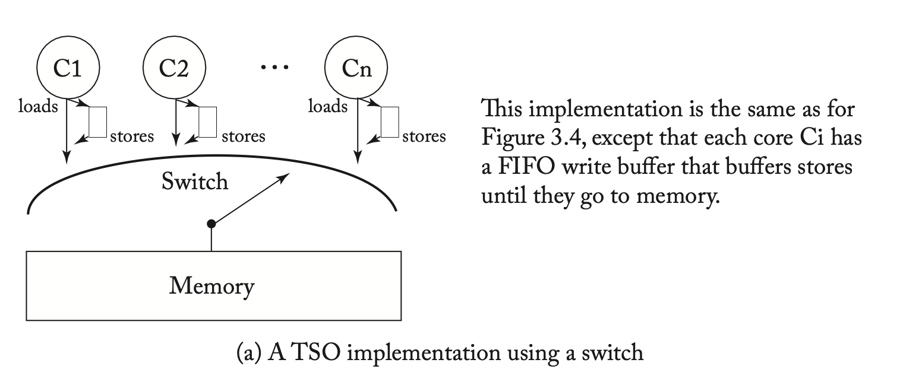
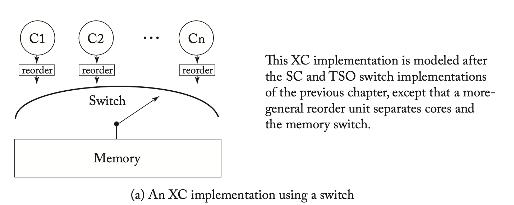
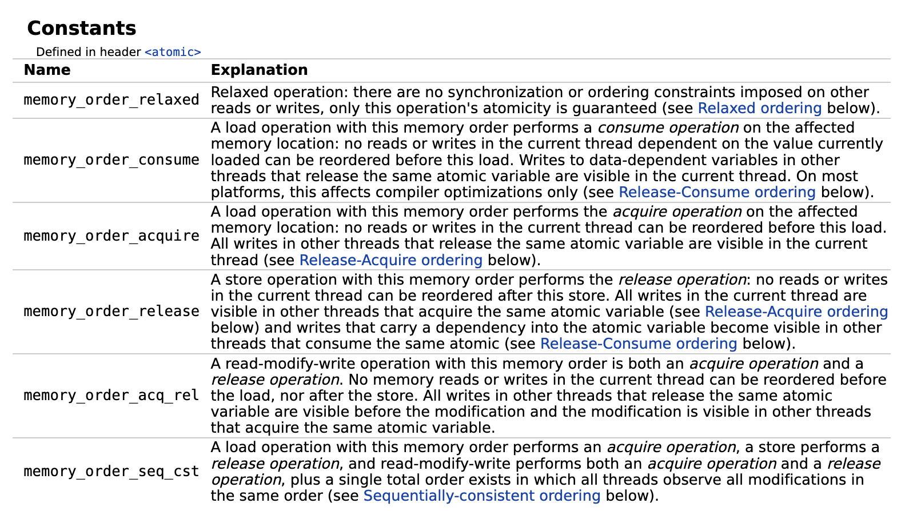

# 内存模型和内存序

## 背景

内存模型和内存序是一个贯穿软硬件实现的概念，你可以在 CPU 微架构，总线，到汇编指令，编译器和编程语言中看到它们。本文主要来探讨这些问题。

<!-- more -->

## 内存模型

对于处理器核心来说，如何实现访存指令，对性能的影响是十分显著的。最基础的硬件实现方法，就是串行地完成每一条 Load 和 Store 指令，每一条访存指令执行完，才能开始执行下一条访存指令。但如果正在执行的访存指令 A 遇到了缓存缺失，需要等待缓存的回填，由于硬件只实现了串行执行，在 A 之后未来要执行的访存指令 B 又必须等待 A 的完成，耗费的时间就会比较长。

但很多时候，B 指令并不依赖 A 指令，可能访问的是不同的内存地址，可能 B 要访问的数据就在缓存中，如果能够在 A 等待缓存回填的时间同时执行 B，性能可以得到提升。但并非所有的 B 都可以提前执行的，比如

- 从核内的视角来看，A 和 B 访问的内存范围有重合，那么它们的执行顺序就很重要：
    - 如果 A 是 Store 指令，B 是 Load 指令，B 在 A 之前执行，B 提早从 Cache 读取数据，得到的是 A 写入之前的结果，数据就错了。不过好在这可以通过 Store to Load Forwarding 解决，把 A 要写入的数据以及 Cache 中的数据拼接出，可以得到正确的 B 要读取的数据。
    - 如果 A 是 Load 指令，B 是 Store 指令，B 在 A 之前执行，提早向 Cache 写入数据，那么 A 都出来的就是 B 写入之后的结果，数据就错了。
    - 如果 A 和 B 都是 Store 指令，B 在 A 之前执行，那么最终内存中的值是 A 覆盖了 B，而不是预期的 B 覆盖了 A
- 从核外的视角来看，假如目前正在一个被锁保护的临界区，A 是对被保护的数据的修改，B 是释放锁，如果 B 在 A 之前执行，就会导致锁释放了，但还在修改被保护的数据的情况。

可能还有其他类似的场景，简单总结一下，决定访存的是否乱序，如何乱序，需要考虑：

- 从核内的视角来看，乱序执行不能修改程序的一样。实现乱序的性能，又要表现出类似串行的行为
- 从核间的视角来看，有一些指令不能乱序，否则会影响核间同步互斥的正确性

除了 CPU 核之间，如果一些外设（例如显卡，网卡）也要访问内存，那么 CPU 和外设之间，也可能有类似的顺序问题。

因此就需要明确规定硬件乱序执行的模式和边界，使得软件开发者一方面可以根据需要在软件中插入指令来阻止不期望发生的乱序，从而保证正确性；另一方面在大多数时间，硬件提供的乱序可以在保证正确性的情况下，提供更好的性能。

但这个模式和边界不是一天建成的。硬件厂商希望能够不断推出性能更好的新处理器，这些新处理器可能为了性能去做更多的优化，这些优化可能会涉及到更多的乱序情况，这时候兼容性就成了一个问题：旧软件假设了硬件不会做某种乱序，结果新硬件做了，那旧软件在新硬件上就会出现兼容性问题。于是软件开发者很希望有一个标准或者说模型出来，硬件保证按照这个模型实现乱序，软件按照这个模型来开发，这样软件硬件分别发展，也不会出错。

但硬件厂商对这个事情也扭扭捏捏，生怕今天做了什么规定，明天发现这个规定会浪费了一个巨大的性能提升机会，但竞争对手没有做这个承诺，竞争对手就得到了优势。但是不做承诺呢，软件生态又成了一个问题：在今年的处理器上写代码，只能保证在今年的处理器上可以正常跑，明年出了新的处理器，出现了不兼容的地方，又要重新改一遍，这会把软件开发者给赶跑的。在这种别扭的心态下，很长时间以来，硬件厂商对此都写的有些语焉不详，相关的争论在零几年都一直能看到。

不过好在现在是 2024 年，大多数处理器的内存模型和内存序都已经比较明确，虽然很多时候硬件厂商做的是比较宽松的保证，实际实现的时候会更加严格，例如声称 A 和 B 是允许乱序执行的，但实际上目前的所有硬件都没有这么做，软件也只能按照最保守的方式来做假设。但有总比没有好，可能也是硬件厂商研究了很多年，没发现什么可以继续优化的余地了，不如死了心把规矩给定下来，把软件生态给打好。

现在开始讲实际的内存模型和内存序。为什么这两个概念总是放在一起讲？什么是模型？什么是序？

CPU 核心的实现是很复杂的，不同代的 CPU 架构的实现也有很多不同，屏蔽这些微架构的细节，把它们对软件暴露出来的行为，抽象出一个统一的硬件模型，这个模型展现了硬件针对内存访问的工作方式，就是内存模型。根据内存模型，定义哪些情况下，哪些指令可以和哪些指令乱序，为了避免乱序，又可以添加哪些指令来避免乱序，这就是内存序。通过对硬件的建模，把复杂的微架构实现剥离出来，得到一个抽象的模型，以分布式系统的理论去研究它的行为。

### SC

下面来看一个简单的内存模型的例子：假如 CPU 不做任何的乱序，严格按照指令的顺序进行访存；从多核的角度来看，来自不同核心的访存都会到达内存子系统，每个访存都是原子的。那么最后在内存子系统上进行的访存序列，就是各个核心的程序的访存序列交错的结果。举个例子：

A 核心上的程序要进行 Read a（表示读取 a 地址的数据，下面简称 Ra）和 Write a 操作（表示把数据写入 a 地址，下面简称 Wa）；B 核心上的程序要进行 Read b 和 Write b 操作。由于每个核心内部不会对访存进行重排，所以这些访存操作在内存子系统上执行时，会保持它在程序里的执行顺序，这个叫做 program order。由于不同核心发起访存的时间不同，最后在内存子系统上执行的访存可能有这些情况：

- Ra Wa Rb Wb
- Ra Rb Wa Wb
- Ra Rb Wb Wa
- Rb Ra Wa Wb
- Rb Ra Wb Wa
- Rb Wb Ra Wa

可以看到，可能是先完成所有 A 核心上的访存，再完成 B 核心上的访存（Ra Wa Rb Wb），也可能反过来，先完成 B 核心上的访存，再完成 A 核心上的访存（Rb Wb Ra Wa），也可能两个核心的访存交错进行（例如 Ra Rb Wa Wb）。它们都满足一个条件：Ra 一定在 Wa 之前，Rb 一定在 Wb 之前，也就是说，Ra 一定在 Wa 之前的这种 program order 在内存子系统上的执行顺序 memory order 里也一定会保证。

这种内存模型就是 Sequential Consistency (简称 SC)，它的性质就是遵循 program order，从每个核心来看，代码怎么写的就怎么跑，不做重排，而来自不同核心的访存之间的顺序不做要求。下面是 SC 模型的图示（图源 [A Tutorial Introduction to the ARM and POWER Relaxed Memory Model](https://www.cl.cam.ac.uk/~pes20/ppc-supplemental/test7.pdf)）：


根据这个性质，我们就可以分析软件的行为，判断它是否可能出现特定的结果。下面举一个例子：

假如有两个线程，A 线程要给 B 线程传输数据，两个线程分别跑在两个核心上。为了传输数据，A 把数据放在内存地址 x 里，为了标记数据准备完成，另外在内存地址 y 放了一个标记，0 表示数据还没准备好，1 表示数据准备好了。那么 A 要传输数据的时候，要做的事情就是：

1. 初始化的时候，往 y 地址写入 0
2. 要传输数据时，先往 x 地址写入要传输的数据，再往 y 地址写入 1

另一边，B 线程要等待 A 线程发送的数据，那么它应该：

1. 读取 y 地址的内容，检查是否为 1
2. 如果是 1，说明传输的数据已经在 x 地址中了，再从 x 地址读取要传输的数据

现在问题来了：以上的写法，它可以正常工作吗？我当然可以去各个硬件平台上都测试测试，看看到底能不能工作。但是既然我们已经知道了硬件是按照一定的内存模型实现的，那我们可以尝试，是否可以从内存模型的角度来判断它到底是否可行。

这里我们采用反证法：如果上面的传输数据方法不可行，会出现什么样的结果？那就是 B 读取到了错误的数据，也就是 B 从 x 地址读取数据时，A 还没有来得及往 x 地址写入数据。这可能吗？我们来进行推导：

首先简化一下 A 线程做的操作：

1. 向 x 地址写入数据，不妨设这个数据是 1，也就是 `*x = 1`，记为 Wx1（W 表示 write，后面跟随地址以及写入的数据）
2. 向 y 地址写入 1，表示数据准备完成，也就是 `*y = 1`，记为 Wy1

接着是 B 线程做的操作，假设出现了错误情况，也就是在 `y = 1` 的时候，从 x 读取了错误的数据：

1. 从 y 地址读取数据，得到了 1，表示数据准备完成，也就是 `r1 = *y`，r1 等于 1，记为 Ry1（R 表示 read，后面跟随地址以及读取到的数据）
2. 从 x 地址读取数据，因为前面假设了读取了错误的数据，正确的数据是 1，不妨设错误的数据是 0，也就是 `r2 = *x`，r2 等于 0，记为 Rx0

接下来证明：在 SC 内存模型下，这种可能性不存在：

1. 在 SC 内存模型下，program order 得到保持，也就是 A 和 B 线程各自的执行顺序是保证的，可知 Wx1 必须出现在 Wy1 之前，Ry1 必须出现在 Rx0 之前，记作 Wx1 -> Wy1，Ry1 -> Rx0
2. 对于 x 地址来说，Wx1 写入了 1，Rx0 读出了 0，说明 Rx0 必须在 Wx1 之前执行，才可能读到 0，即 Rx0 -> Wx1；对于 y 地址来说，Wy1 写入了 1，Ry1 读出了 1，由于 y 地址的初始值是 0，说明 Ry1 必须在 Wy1 之后执行，才可能读到 0，即 Wy1 -> Ry1

这样我们就得到了四组顺序关系：

1. Wx1 -> Wy1
2. Wy1 -> Ry1
3. Ry1 -> Rx0
4. Rx0 -> Wx1

你会发现这四个操作的顺序关系出现了环，说明不存在一个执行序列，可以同时满足这四组顺序关系。也就说明 SC 内存模型下，不可能得到这个执行结果。通过内存模型，我可以从理论上证明这段代码在 SC 内存模型下是没有问题的，那么这段代码在所有实现了 SC 内存模型的处理器上可以正常工作。

### Litmus

像上面这种来自多线程编程的一个小片段，我们可以从内存模型的角度分析它可能的执行结果，也可以在实际的处理器上运行，这种小片段就叫做 Litmus test，上面看到的这个例子，其实是 Litmus test 当中的 Message Passing 测试（MP）。利用 [herd/herdtools7 on GitHub](https://github.com/herd/herdtools7) 工具，我们可以在电脑上实际去运行 Litmus test，观察它的实际运行结果。herdtools7 的安装流程：

1. 安装 OCaml 工具链（包括 opam），配置 opam
2. 用 opam 安装 herdtools7: `opam install herdtools7`

有了 herdtools7 以后，如果要执行上面的 Message Passing 测试，只需要按照运行如下的命令（以 x86 为例）：

```shell
diycross7 -arch X86 -name MP-X86 PodWW Rfe PodRR Fre
litmus7 MP-X86.litmus
```

它就会在 x86 机器上运行 MP 测试，运行 1000000 次后，发现没有出现前面所述的读出来 y 等于 1 但是 x 等于 0 的情况。那么上面出现的 `PodWW Rfe PodRR Fre` 是什么意思？我们首先来看看生成的 `MP-X86.litmus` 文件的内容：

```litmus
X86 MP-X86
"PodWW Rfe PodRR Fre"
Cycle=Rfe PodRR Fre PodWW
Generator=diycross7 (version 7.56+03)
Prefetch=0:x=F,0:y=W,1:y=F,1:x=T
Com=Rf Fr
Orig=PodWW Rfe PodRR Fre
{
}
 P0         | P1          ;
 MOV [x],$1 | MOV EAX,[y] ;
 MOV [y],$1 | MOV EBX,[x] ;
exists (1:EAX=1 /\ 1:EBX=0)
```

忽略开头的部分，直接从 P0 P1 这一行开始看：P0 和 P1 对应两个处理器核心，下面是在这两个核心上要运行的汇编指令：

- P0 上运行：
    - MOV [x], $1：往 x 地址写入 1，也就是前面说的 `*x = 1`, Wx1
    - MOV [y], $1：往 y 地址写入 1，也就是前面说的 `*y = 1`, Wy1
- P1 上运行：
    - MOV EAX, [y]：从 y 地址读取数据，保存在 EAX 寄存器，也就是前面说的 `r1 = *y`
    - MOV EBX, [x]：从 x 地址读取数据，保存在 EAX 寄存器，也就是前面说的 `r2 = *x`

正好就是 Message Passing 测试的内容，只不过用汇编完成了实现。最后，它提问：`exists (1:EAX=1 /\ 1:EBX=0)`，即是否存在一种可能，P1 的 EAX 寄存器（`1:EAX`）等于 1，同时（`/\` 表示逻辑与）P1 的 EBX 寄存器（`1:EBX`）等于 0？这就是上面提到的错误情况，y 等于 1 但是 x 等于 0。

接下来的 `litmus7 MP-X86.litmus` 命令就会在两个核心上运行这段汇编，并且统计最终的执行结果，发现：

```
Histogram (3 states)
500087:>1:EAX=0; 1:EBX=0;
1281  :>1:EAX=0; 1:EBX=1;
498632:>1:EAX=1; 1:EBX=1;
```

运行了 1000000 次，观察到 500087 次 y=1, x=0；1281 次 y=0, x=1；498632 次 y=1, x=1；没有观察到 y=1 && x=0。也就是没有找到反例。

那么 diycross7 命令是怎么生成这段汇编的呢？答案就在 `PodWW Rfe PodRR Fre` 参数当中。它描述的就是我们前面提到的四组顺序关系：

1. Wx1 -> Wy1: P0 上的 program order
2. Wy1 -> Ry1: memory 上的写后读
3. Ry1 -> Rx0: P1 上的 program order
4. Rx0 -> Wx1: memory 上的读后写

如果这四组顺序关系都得到保证，那么就不存在一个执行序列可以同时满足这四组顺序关系。在 diycross7 的语言里面，我们把这四组顺序关系描述出来：

1. Wx1 -> Wy1: P0 上的 program order，并且是两个 Write 之间的 program order，所以是 PodWW（Pod = program order，WW = write to write）
2. Wy1 -> Ry1: memory 上的写后读，并且分别在 P0 和 P1 上执行，所以是 Rfe（Rf = read from，后面的 read 的数据来自前面的 write，箭头从 W 指向 R，e = external，表示读和写在两个核上）
3. Ry1 -> Rx0: P1 上的 program order，并且是两个 Read 之间的 program order，所以是 PodRR（Pod = program order，RR = read to read）
4. Rx0 -> Wx1: memory 上的读后写，并且分别在 P1 和 P0 上执行，所以是 Fre（Fr = from read，读在前，写在后，箭头从 R 指向 W，e = external，表示读和写在两个核上）

于是我们就用 `PodWW Rfe PodRR Fre` 描述了这四组顺序关系，diycross7 工具就根据这四组顺序关系，生成了汇编程序，这个汇编程序会用到这些顺序关系，那么在处理器上执行，就可以判断在处理器的内存模型下，这个环是否可能打破，反例是否可能存在。通过这种描述方法，我们可以设计出各种各样的 Litmus test，测试和分析不同的代码在各种处理器的内存模型下，会有怎样的表现。

### Store Buffer

暂时先不讲内存模型，先讲讲处理器在访存上的一个重要的优化：Store Buffer。对于乱序执行处理器来说，预测执行是有限度的，因为如果预测错误了，需要回滚到正确的状态，这也意味着，有副作用的指令不能简单地预测执行：例如在一段操作系统内核的代码里，需要根据用户的输入决定电脑要关机还是重启：

```c
if (shutdown) {
    do_shutdown();
} else {
    do_reboot();
}
```

假如处理器实现了分支预测，预测 `shutdown == true`，接着预测执行了 `do_shutdown`，如果处理器真的预测执行了关机操作，那么电脑就直接关机了，都没有来得及确认是不是要关机。例如实际上可能 `shutdown == false`，应该执行的是 `do_reboot`，本来是重启的，却变成了关机。所以预测执行遇到这种带有副作用（side effect）的指令，需要单独处理。

一个简单的办法就是要求所有带有副作用的指令顺序执行，只有前面的所有指令执行完了，有副作用的指令才可以执行，因为此时不可能回滚到更早的指令了。但是有副作用的指令很多，通常认为 Store 指令都有副作用，如果考虑到侧信道攻击和安全性，可能连 Load 指令都有副作用，因为它会改变 Cache 的状态；如果要访问外设，那么 Load 和 Store 都有副作用。在乱序处理器上，就是只允许有副作用的指令在 Reorder Buffer（ROB）头部，才可以执行。但如果遇到了缓存缺失，这个时间就会很长，一直堵住 ROB，影响性能。

为了解决这个问题，针对写入内存的 Store 指令，虽然它有副作用，但通常认为缓存写入是不会失败的，所以不用担心写入失败的问题，所以可以把这些 Store 指令放在一个队列里面，这个队列称为 Store Buffer。从 ROB 提交的 Store 指令会放到 Store Buffer 里面，此时可以认为 Store 指令完成了提交，Store 指令从 ROB 中删除，不再堵塞后面的其他指令。Store Buffer 队列里的 Store 指令会按顺序把数据写入缓存，这时候再遇到缓存缺失，影响也比较小。

当然了，由于 Store Buffer 里的数据还没写入缓存，缓存里的数据不一定是最新的，所以后续 Load 指令读取数据时，不仅要从缓存中读取，还要查询 Store Buffer，如果缓存和 Store Buffer 都有数据，要以 Store Buffer 为准。这样实现以后，从单线程程序的角度来看，行为没有变化。但是多线程程序就遇到了一个新问题：

- A 核心向 x 地址写入 1，从 y 地址读取数据
- B 核心向 y 地址写入 1，从 x 地址读取数据
- A 核心从 y 地址读取数据，因为 A 没有写入 y 地址，所以 A 从缓存中读取 y 地址的数据；同时 B 核心从 x 地址读取数据，同理 B 也从缓存中读取 x 地址的数据
- 两个核心写入数据的指令进入了各自核心的 Store Buffer，但是还没写入缓存；因此 A 和 B 从缓存中读取的数据都是 0

用程序来表达，就是：

A 核心：

- Wx1: *x = 1
- Ry0: r1 = *y

B 核心：

- Wy1: *y = 1
- Rx0: r2 = *x

你可能会想，这怎么可能？明明两边都是先写后读，怎么结果却好像是先读后写？如果我们继续按照 SC 模型的规定来寻找顺序关系：

- program order: Wx1 -> Ry0, Wy1 -> Rx0
- coherence：Ry0 -> Wy1，Rx0 -> Wx1

出现了环：Wx1 -> Ry0 -> Wy1 -> Rx0 -> Wx1，说明这个结果在 SC 模型下不可能成立。但如果我们在 x86 机器上真的跑一下这个测试：

```shell
diycross7 -arch X86 -name SB-X86 PodWR Fre PodWR Fre
litmus7 SB-X86.litmus
```

这里的 `PodWR Fre PodWR Fre` 是这么来的：

- Wx1 -> Ry0: PodWR, program order, write to read
- Ry0 -> Wy1: Fre, from-read, external
- Wy1 -> Rx0: PodWR, program order, write to read
- Rx0 -> Wx1: Fre, from-read, external

diycross7 命令生成了下面的汇编：

```asm
 P0          | P1          ;
 MOV [x],$1  | MOV [y],$1  ;
 MOV EAX,[y] | MOV EAX,[x] ;
exists (0:EAX=0 /\ 1:EAX=0)
```

运行 litmus7 得到如下的结果：

```
Histogram (4 states)
540   *>0:EAX=0; 1:EAX=0;
499697:>0:EAX=1; 1:EAX=0;
499760:>0:EAX=0; 1:EAX=1;
3     :>0:EAX=1; 1:EAX=1;
Ok
```

你会发现在 x86 机器上真的出现了这个结果：从 x 和 y 读出来的数据都是 0。这就说明 x86 机器实现的并不是 SC 的内存模型。在 SC 模型下，这段代码的四个顺序关系成环，使得不存在 x 和 y 读出来都为 0 的情况；现在确实观察到了读出来 x 和 y 都为 0 的情况，说明这个环被断开了，有的边不再成立。

回想前面提到的 Store Buffer 的硬件实现，问题出现在，x 和 y 处于不同的地址，A 核心读取 y 时，直接通过缓存读取数据，此时从缓存的视角来看，先看到了 A 核心读取 y，后看到了 A 核心写入了 x，这和指令的顺序不同。也就是 PodWR（Program order write to read）这条边不再成立了，这种情况下，从核外的视角看，程序的先 Store 后 Load，可能被重排为先 Load 后 Store。这也说明 x86 的处理器做了 Store Buffer 的硬件实现。在优化性能的同时，也切实改变了内存模型。

### X86-TSO

依托 Store Buffer，我们可以构建出一个新的内存模型：在每个核心和内存子系统之间，多了一个 Store Buffer，Store 指令会先进入 Store Buffer，再进入内存子系统。当 Load 指令和 Store Buffer 中的 Store 指令有数据相关时，会从 Store Buffer 中取数据，如果不相关，或者不完全相关（例如只有一部分重合），则会从内存子系统中取数据，此时从内存子系统的角度来看，就发生了 Load 提前于 Store 执行的重排。这个模型被称为 [X86-TSO](https://dl.acm.org/doi/10.1145/1785414.1785443)（图源 [A Primer on Memory Consistency and Cache Coherence, Second Edition](https://link.springer.com/book/10.1007/978-3-031-01764-3)）：



需要注意的是，X86-TSO 模型是在 [2010 年的论文 x86-TSO: a rigorous and usable programmer's model for x86 multiprocessors](https://dl.acm.org/doi/10.1145/1785414.1785443)中由学术界对现有 x86 处理器的内存模型的总结，但 Intel 和 AMD 在他们的文档中没有直接采用这个模型，而是给出了各种各样的规则。但实践中，可以认为 x86 处理器用的就是这个模型，从各自 litmus 测试中，也没有发现理论和实际不一致的地方。

这里的 TSO 的全称是 Total Store Order，意思是针对 Store 指令（只有离开 Store Buffer 进入缓存的才算），有一个全局的顺序。内存子系统会处理来自不同核心的 Store，但会保证 Store 有一个先后顺序，并且所有核心会看到同一个顺序。这个概念有些时候还会被称为 Multi-copy Atomic，字面意思是当一个 Store 被其他核心看到时，所有核心都会“同时”看到，不会说一部分核先看到，另一部分核后看到。

从 TSO 的字面意思来说，并没有提到 Load 可以被重排到 Store 之前，是 X86 的 TSO 实现了这种重排。不过平常也不会专门去区分这件事情，提到 TSO，大家想到的都是 X86 的 TSO，也就是 X86-TSO 模型。

总结一下，X86-TSO 模型的规定就是如下几点：

- Total Store Order：所有核心会观察到相同的全局的 Store 顺序
- Load 可以被重排到 Store 之前
- Load 会从 Store Buffer 和缓存两个地方取数据

对比 SC 和 X86-TSO 模型：

- X86-TSO 模型允许 Load 被重排到 Store 之前
- Store Buffer 测试下，SC 禁止重排，X86-TSO 允许重排
- Message Passing 测试下，SC 和 X86-TSO 都禁止重排

### Weak/Relaxed Memory Model

在 X86 以外的指令集架构，经常可以看到另外一种内存模型，一般称为 Weak Memory Model 或者 Relaxed Memory Model。怎么个 Weak 法呢？就是硬件想重排就重排，当然了，是在保证核内视角正确的前提下。回想前面 SC 模型和 X86-TSO 模型，它们对于 Load 和 Store 之间重排的要求是：

- 先 Load 后 Load：SC 和 X86-TSO 不允许重排
- 先 Load 后 Store：SC 和 X86-TSO 不允许重排
- 先 Store 后 Load：SC 不允许重排，X86-TSO 允许重排
- 先 Store 后 Store：SC 和 X86-TSO 不允许重排

既然 Weak 了，那就自由到底：全都允许重排。如果用户不想重排，那再加合适的 fence 或 barrier 指令，阻止不想要的重排。在这个内存模型下，每个核心可以在向内存子系统读写前，对自己的读写进行重排（图源 [A Primer on Memory Consistency and Cache Coherence, Second Edition](https://link.springer.com/book/10.1007/978-3-031-01764-3)）：



这意味着什么呢？前面出现过 Message Passing 的例子，结论是 MP 测试的情况在 SC 和 X86-TSO 场景下都被禁止。但如果我们在一个具有 Weak Memory Model 的机器上运行：

```shell
# P0:
# 1. Wx1
# 2. Wy1
# P1:
# 1. Ry1
# 2. Rx0
# orders:
# Wx1 -> Wy1: PodWW
# Wy1 -> Ry1: Rfe
# Ry1 -> Rx0: PodRR
# Rx0 -> Wx1: Fre
diycross7 -arch AArch64 -name MP-AArch64 PodWW Rfe PodRR Fre
litmus7 MP-AArch64.litmus # MP = Message Passing
```

会发现虽然概率比较低，但确实会出现 y=1，x=0 的情况：

```
Histogram (4 states)
500000:>1:X1=0; 1:X3=0;
1     *>1:X1=1; 1:X3=0;
1     :>1:X1=0; 1:X3=1;
499998:>1:X1=1; 1:X3=1;
```

既然在实际的 ARM 机器上测出来这种情况，说明 PodWW 或者 PodRR 至少有一个出现了重排，打破了环。

更进一步，SC 和 X86-TSO 都要求有 Total Store Order（Multi-copy Atomic）：所有核心会看到统一的 Store 顺序。有要求，就可以舍弃，部分 Weak Memory Model 也不要求这一点，这个时候，内存模型就好像每个核心都有自己的一份内存，这些内存之间会互相传播 Store 以保证缓存一致性，但是有的核心可能先看到，有的核心可能后看到（图源 [A Tutorial Introduction to the ARM and POWER Relaxed Memory Model](https://www.cl.cam.ac.uk/~pes20/ppc-supplemental/test7.pdf)）：


这一点可以在 IRIW（全称 Independent Read of Independent Write；准确地说，为了排除 PodRR 重排的情况，要用 IRIW+addrs 或者加 barrier）Litmus 测试中看到。简单来说，IRIW 测试中，有两个核心负责写入，两个核心负责读，如果这两个核心观察到了不同的写入顺序，说明没有 Total Store Order（Multi-copy Atomic）：写入传播到不同核心的顺序可能打乱。

## 内存序

### 指令集

既然 X86-TSO 已经出现了一种可能的重排情况：Load 被重排到 Store 之前，假如我们不希望出现这种重排，怎么办？各个指令集都提供了一些 fence 或者 barrier 指令，可以阻止各种类型的重排。以 x86 为例：

- sfence: store fence，保证 sfence 之前的 store 都完成（globally visible，得写到缓存里才算）之后，才开始 sfence 之后的 store
- lfence: load fence，保证 lfence 之前的 load 都完成（globally visible）之后，才开始 lfence 之后的 load
- mfence: memory fence, 保证 mfence 之前的 load 和 store 都完成（globally visible）之后，才开始 mfence 之后的 load 和 store

这其中常用的其实就是 mfence：前面提到 X86-TSO 允许 Load 被重排到 Store 之前，为了阻止这一点，lfence 和 sfence 都不够，因为 lfence 管的是 Load 被重排到 Load 之前，sfence 管的是 Store 被重排到 Store 之前。mfence 则可以：在 Store 后面紧挨着一条 mfence 指令，那么 mfence 之后的 Load 指令就无法被重排到 Store 之前：

1. store
2. mfence
3. load

所以如果要在 x86 上运行按照 SC 内存模型编写的程序，为了保证正确性，需要在每个 Store 后面加一条 mfence 指令。

再来看看对于 ARMv8 这种具有 Weak/Relaxed Memory Model 的架构，指令集提供了哪些指令来避免重排：

- DMB：相当于 x86 的 mfence，保证 DMB 后的 Load 和 Store 不会重排到 DMB 之前，DMB 前的 Load 和 Store 也不会重排到 DMB 之后
- Load Acquire：对 Load 指令添加 Acquire 语义，保证 Load Acquire 之后的 Load/Store 不会被重排到 Load  Acquire 之前
- Store Release：对 Release 指令添加 Release 语义，保证 Store Release 之前的 Load/Store 不会被重排到 Store Release 之后

看到 Acquire 和 Release，你可能会觉得这个说法有点熟悉：在锁里面，获得锁可以说 Lock 或者说 Acquire；释放锁可以说 Unlock 或者说 Release。事实上，Load Acquire 和 Store Release 正好就可以用在 Lock 和 Unlock 的场合：

```c
lock(); // Load Acquire
y = x + 1;
unlock(); // Store Release
```

在临界区中读取 x，肯定希望是在持有锁的前提下进行 Load，也就是说 Load x 不能被重排到 `lock()` 之前，也不能被重排到 `unlock()` 之后；同理在临界区中写入 y，肯定也是希望在持有锁的前提下进行 Store，也就是说 Store y 不能被重排到 `lock()` 之前或 `unlock()` 之后。为了避免这个重排，在一头一尾分别加上 Acquire 和 Release 标记，就可以保证临界区内的 Load/Store 都是在持有锁的情况下进行。

除了锁以外，这个模式也可以用来实现正确的 Message Passing，原来的 Message Passing 实现是：

P0:

1. *x = 1
2. *y = 1

P1:

1. r1 = *y
2. r2 = *x

这里会有 Store-Store 重排以及 Load-Load 重排的风险，加上 Load Acquire 和 Store Release 以后：

P0:

1. *x = 1
2. *y = 1 (Store Release)

P1:

1. r1 = *y (Load Acquire)
2. r2 = *x

这样就避免了重排，P1 可以观察到正确的结果。

此外，Acquire 和 Release 标记也可以添加到原子指令上，毕竟原子指令其实就是 Load + Store。相比 Fence，Acquire 和 Release 是单向的，只影响前面的指令，或者只影响后面的指令，而 Fence 通常是两个方向都阻止，不许前面的排到后面，也不许后面的排到前面。

### 软件

从上面的分析可见，不同的处理器和指令集使用了不同的内存模型，提供了不同的指令来控制乱序重排，但是对于软件开发者来说，会希望尽量用一套通用的 API 来控制乱序重排，可以兼容各种指令集，不用去记忆每个处理器用的是什么内存模型，不用去知道哪些指令可以用来解决哪些重排。

这个 API 在很多编程语言中都有，C 的 stdatomic.h，C++ 的 std::memory_order，Rust 的 std::sync::atomic::Ordering 等等。它们对各种处理器的内存序进行了进一步的抽象，并且在编译的时候，由编译器或标准库把这些抽象的内存序翻译成实际的指令。以 C++ 的抽象为例，有如下几种内存序（图源 [cppreference](https://en.cppreference.com/w/cpp/atomic/memory_order)）：



其中比较重要的 acquire 和 release，其实就是上面提到的 Load Acquire 和 Store Release。最后的 seq_cst，就对应了 Sequential Consistency（SC）模型，要模拟 SC 模型的行为。

由于 C++ 可以被编译到不同的指令集架构，所以这些 memory order 在编译的时候，会变成对应的指令，也可能由于内存模型保证了不出现对应的乱序，不需要生成额外的指令。以 X86 为例子：

- Load Acquire：防止 Load 之后的 Load/Store 指令被重排到 Load 之前，因为 X86-TSO 阻止了 Load-Load 和 Load-Store（先 Load 后 Store）重排，所以不需要额外的指令
- Store Release：防止 Store 之前的 Load/Store 指令被重排到 Store 之后，因为 X86-TSO 阻止了 Load-Store 和 Store-Store 重排，所以不需要额外的指令

完整的对应关系，建议阅读 [C/C++11 mappings to processors](https://www.cl.cam.ac.uk/~pes20/cpp/cpp0xmappings.html)。

## 参考文献

- [A Tutorial Introduction to the ARM and POWER Relaxed Memory Model](https://www.cl.cam.ac.uk/~pes20/ppc-supplemental/test7.pdf)
- [A Better x86 Memory Model: x86-TSO](https://www.cl.cam.ac.uk/~pes20/weakmemory/x86tso-paper.tphols.pdf)
- [Hardware Memory Models - Russ Cox](https://research.swtch.com/hwmm)
- [herd/herdtools7 on GitHub](https://github.com/herd/herdtools7)
- [A Primer on Memory Consistency and Cache Coherence, Second Edition](https://link.springer.com/book/10.1007/978-3-031-01764-3)
- [How to generate litmus tests automatically with the diy7 tool](https://community.arm.com/arm-community-blogs/b/architectures-and-processors-blog/posts/generate-litmus-tests-automatically-diy7-tool)
