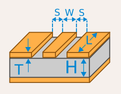

# PCB 笔记

记录一下在学习画板子过程中学到的心得。

## 工具

目前使用过 [KiCad](https://kicad.org/) 和 [lceda](https://lceda.cn/)：

- KiCad: 开源软件，跨平台。
- lceda：在线编辑，不需要安装，和 lcsc 有深度集成。

项目 [jiegec/HT42B534USB2UART](https://github.com/jiegec/HT42B534USB2UART) 采用的是 KiCad 5 编写的。目前正在做的另一个项目采用 lceda

## 流程

1. 选择所需要使用的芯片，查找芯片的 datasheet。
2. 寻找采用了芯片的一些设计，特别是看 schematic。
3. 按照 datasheet 里面推荐的电路，或者是其他人的设计，画自己需要的 schematic。
4. 设置好各个元件的 footprint，然后转到 PCB 设计。
5. 在 PCB 里面布线，生成 Gerber 等文件。
6. 把 Gerber 给到生产商（比如 jlc），交付生产。
7. 如果是自己焊接，则需要购买元件，比如从 lcsc 购买。
8. 收到 PCB 和元件后，自己按照 BOM 和 schematic 焊接各个元件。

## 笔记

1. 对于一些连接很多元件的信号，比如 GND，可以留作铺铜解决。也就是说，先不管 GND，把其他所有的信号都接好以后，再在顶层铺铜；如果还是有没有连接上的 GND，可以通过过孔（Via）走到底层，在底层再铺一层铜。
2. 对于外部供电的 VCC 和 GND，在 KiCad 中需要用 PWR_FLAG 标记一下。
3. 在 KiCad 中设计 PCB 前，要把生产商的工艺参数设置好，不然画了也要重画。
4. lceda 在选择元件的时候，可以直接从 lcsc 里选择，这样可以保证封装和商品可以对得上，不需要手动进行匹配。
5. 如果要用 jlc 的 SMT 贴片，先在 [SMT 元件列表](https://www.jlc.com/portal/smtComponentList.html) 里搜索所需要的元件；推荐用基本库，如果用其他库，则要加钱；选好元件以后，用元件编号去 lceda 里搜索并添加到 schematic。
6. 对于涉及模拟信号的设计，比如音频，需要特别注意模拟信号的电和地都是单独的：`AVCC` 和 `AGND`。所以要特别注意 datasheet 里面不同的地的表示方法。最后，再用磁珠把 `VCC` 和 `AVCC`、`GND` 和 `AGND` 分别连接起来就可以了。可以参考 [DE2 板子中第 19 页的音频部分设计](https://wiki.bu.ost.ch/infoportal/_media/fpga/cyclone_iv/de2_115_schematic.pdf) 和 [Staying well grounded](https://www.analog.com/en/analog-dialogue/articles/staying-well-grounded.html)。
7. 在 schematic 里经常会出现在电源附近的电容，那么，在 PCB 中，也尽量把这些电容放在对应的电源的旁边。
8. 耳机插座里面，一般分三种组成部件：Tip，Ring，Sleeve。只有两段的是 TS，三段的是 TRS，四段的是 TRRS。TS 是单声道，T 是声音，S 是地。TRS 是双声道，T 是左声道（或者单声道），R 是右声道，S 是地。TRRS 则是双声道加录音。一般来说，LINE IN 是双声道，MIC IN 是单声道，它们的阻抗也不同；LINE OUT 和 HEADPHONE OUT 都是双声道，但 HEADPHONE OUT 经过了额外的放大器。
9. 遇到一个 SPI 协议没有 `SPI_MISO` 引脚的芯片，可能说明它是 write-only 的。
10. 手焊的基本元件，一般用 0603 加一些 Padding 的封装；SMT 的话，则建议用 0402 封装。
11. I2C 的信号线一般需要加一个几 K 欧姆的上拉电阻到 VCC。

JLC SMT 的基础库不需要换料费，如何寻找[基础库](https://www.jlcsmt.com/lcsc/basic)中的元件：

1. 电阻品牌是 UNI-ROYAL，型号命名规则是：
    1. 封装：0603/0402
    2. 功率：WA/WG/W8
    3. 误差：F(1%)
    4. 阻值：三位整数 + 一位 exp（J 表示 -1，K 表示 -2，L 表示 -3），例如 2002 表示 `200*10^2=20k`，1003 表示 `100*10^3=100k`，3300 表示 `330*10^0=330`，330J 表示 `330*10^-1=33`，330K 表示 `330*10^-2=3.3`
    例子：要找 0402 封装的 10k 欧电阻，搜索 0402WGF1003；要找 0603 封装的 33 欧电阻，搜索 0603WAF330。
2. 电容品牌有风华/三星/国巨，三星的电容型号命名规则是：
    1. 封装：05(0402)/10(0603)
    2. 字母：A/B/C
    3. 电容：两位整数 + 一位 exp，单位是 pF，例如 105 表示 `10*10^5pF=10^6pF=1uF`，104 表示 `10*10^4pF=10^5pF=0.1uF`
    例子：要找 0402 封装的 100nF 电容，搜索 CL05B104；要找 0603 封装的 1uF 电容，搜索 CL10A105。也可以只搜电容的数字部分，可以找到更多品牌。

## 阻抗匹配

在传输线上，如果出现阻抗变化，就会导致信号出现反射，质量变差。因此，需要保证传输线的两端和传输线整个过程的阻抗一致。

阻抗设置为多少，一般要看协议的规定。确定好协议定义的阻抗以后，需要查看信号两端的芯片内部的阻抗，如果和协议不一致，需要额外添加电阻，并且电阻要尽量放在接近芯片的位置上。由于传输线在 PCB 上，所以和 PCB 厂商的工艺有关，需要去厂商的阻抗计算器上进行计算，例如 [jlc 阻抗计算器](https://tools.jlc.com/jlcTools/index.html#/impedanceCalculatenew)。涉及到的参数有：

1. 板子层数：PCB 层数，最简单的正反面就是 2 层
2. 成品厚度：整个 PCB 加起来的厚度，例如 1.6mm
3. 内层铜厚：夹在内部的 PCB 的铜的厚度，例如 0.5 oz，就是 1.37/2=0.685 mil
4. 外层铜厚：PCB 上下暴露在外面的两层的铜的厚度，常见 1 oz=1.37 mil
5. 需求阻抗：协议所要求的阻抗，例如单端 50 欧姆（SDIO），差分 90 欧姆（USB）
6. 阻抗模式：传输线的连接方式，见下（图源 KiCad）
    1. 单端阻抗（Microstrip Line）：一根线传输信号，地线在另一个平面，图中上面的长方形就是传输线，底部就是地平面
    
    2. 差分阻抗（Coupled Microstrip Line）：差分线传输信号，地线在另一个平面，图中上方两个长方形就是差分传输线，底部是地平面
    
    3. 共面单端：一根线传输信号，周围就是地平面
    
    
    4. 共面差分：差分线传输信号，周围就是地平面
7. 阻抗层：传输线所在的层
8. 参考层：地线所在的层

由于双层 PCB 的两层铜之间距离比较远（例如 57.68 mil），如果采用单端阻抗，那么需要比较大的线宽，例如用 jlc 阻抗计算器，50 欧姆阻抗需要 106.68 mil 的线宽。如果采用四层 PCB，最上面两层之间距离缩小了很多（例如 7.99 mil），此时即使用单端阻抗，用 jlc 计算得出只需要 13.2 mil 的线宽。所以双层 PCB 更适合使用共面单端的方式，此时传输线和地线放在了同一个平面，距离比较小，就不需要那么大的线宽。

这里的单位：1 mil = 0.0254 mm，1 inch = 1000 mil = 0.0254 m，1 oz = 1.37 mil = 0.0348 mm