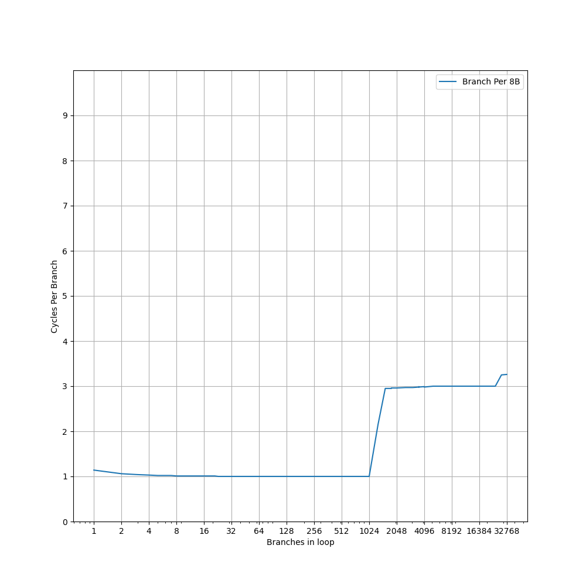
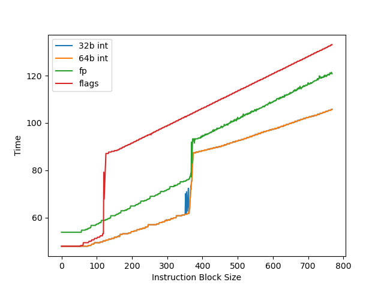
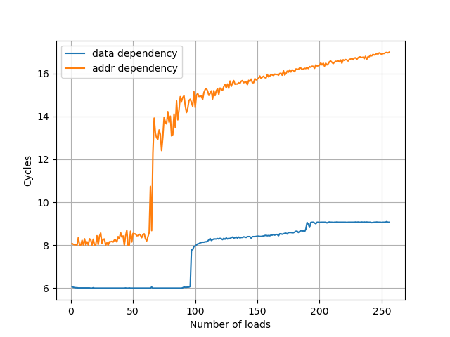
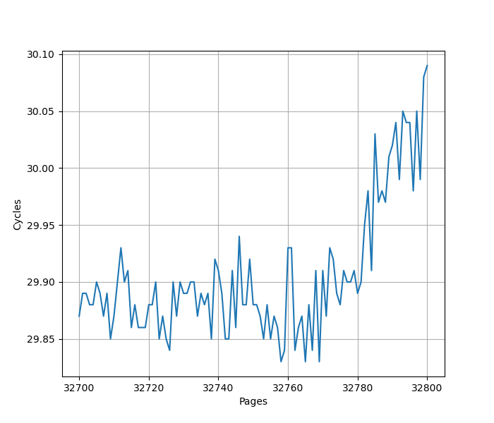
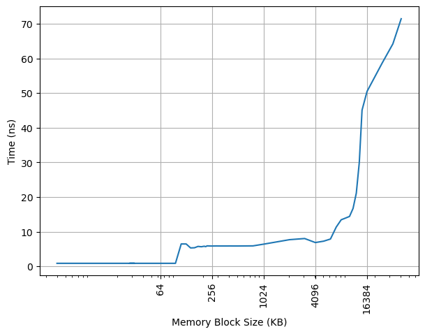
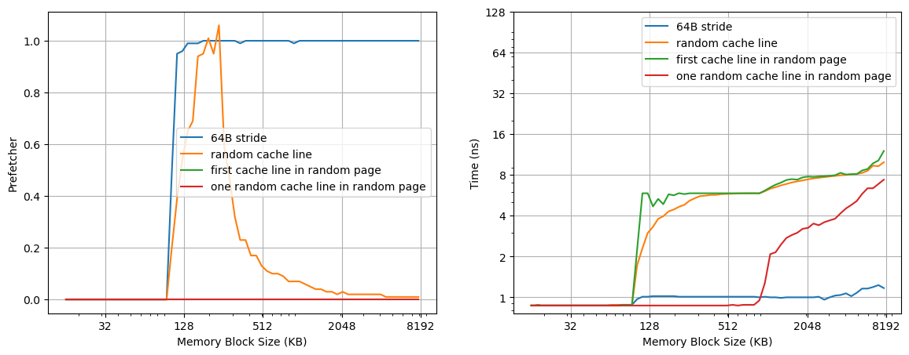

# Qualcomm Oryon 微架构评测

## 背景

最近借到一台 Surface Laptop 7 可以拿来折腾，它用的是高通 Snapdragon X Elite 处理器，借此机会测试一下这个微架构在各个方面的表现。

<!-- more -->

## 官方信息

高通关于 Oryon 微架构有两个 slides，内容可以在以下的链接中看到：

- [The Qualcomm Snapdragon X Architecture Deep Dive: Getting To Know Oryon and Adreno X1 - Anandtech](https://www.anandtech.com/show/21445/qualcomm-snapdragon-x-architecture-deep-dive/2)
- [Hot Chips 2024: Qualcomm’s Oryon Core](https://hc2024.hotchips.org/assets/program/conference/day1/25_HC2024.Qualcomm.GWilliams.pdf)
- [Hot Chips 2024: Qualcomm’s Oryon Core - Chips and Cheese](https://chipsandcheese.com/2024/08/26/hot-chips-2024-qualcomms-oryon-core/)

两次内容大体一致，Hot Chips 2024 的内容更加详细，但也出现了一些前后矛盾的地方。

## 现有评测

网上已经有较多针对 Oryon 微架构的评测和分析，建议阅读：

- [高通 X Elite Oryon 微架构评测：走走停停](https://zhuanlan.zhihu.com/p/704707254)
- [Qualcomm’s Oryon Core: A Long Time in the Making](https://chipsandcheese.com/2024/07/09/qualcomms-oryon-core-a-long-time-in-the-making/)
- [Qualcomm’s Oryon LLVM Patches](https://chipsandcheese.com/2024/05/15/qualcomms-oryon-llvm-patches/)
- [高通自研 PC 芯片 X Elite 实测：真能干翻苹果英特尔？](https://www.bilibili.com/video/BV1Ue41197Qb/)
- [太贵了，它没你想的那么美好！高通骁龙 X Elite 78-100 笔记本详细评测](https://www.bilibili.com/video/BV1z1421r7dZ/)
- [Snapdragon X Elite](https://www.qualcomm.com/products/mobile/snapdragon/laptops-and-tablets/snapdragon-x-elite)
- [Qualcomm Oryon CPU](https://www.qualcomm.com/products/technology/processors/oryon)

下面分各个模块分别记录官方提供的信息，以及实测的结果。读者可以对照已有的第三方评测理解。官方信息与实测结果一致的数据会加粗。

## Benchmark

Qualcomm Oryon 的性能测试结果见 [SPEC](../../../benchmark/index.md)。

## 环境准备

Surface Laptop 7 预装的是 Windows on ARM，并不适合进行测试。因此，我在它上面自己装了一个裸机的 Linux 系统，目前网上已经有比较多相关的教程以及安装镜像了。

## 前端

### 取指

官方信息：取指可以达到每周期最多 **16** 指令

为了测试实际的 Fetch 宽度，参考 [如何测量真正的取指带宽（I-fetch width） - JamesAslan](https://zhuanlan.zhihu.com/p/720136752) 构造了测试。

其原理是当 Fetch 要跨页的时候，由于两个相邻页可能映射到不同的物理地址，如果要支持单周期跨页取指，需要查询两次 ITLB，或者 ITLB 需要把相邻两个页的映射存在一起。这个场景一般比较少，处理器很少会针对这种特殊情况做优化，但也不是没有。经过测试，把循环放在两个页的边界上，发现 Oryon 微架构遇到跨页的取指时确实会拆成两个周期来进行。在此基础上，构造一个循环，循环的第一条指令放在第一个页的最后四个字节，其余指令放第二个页上，那么每次循环的取指时间，就是一个周期（读取第一个页内的指令）加上第二个页内指令需要 Fetch 的周期数，多的这一个周期就足以把 Fetch 宽度从后端限制中区分开，实验结果如下：


图中蓝线（cross-page）表示的就是上面所述的第一条指令放一个页，其余指令放第二个页的情况，横坐标是第二个页内的指令数，那么一次循环的指令数等于横坐标 +1。纵坐标是运行很多次循环的总 cycle 数除以循环次数，也就是平均每次循环耗费的周期数。可以看到每 16 条指令会多一个周期，因此 Oryon 的前端取指宽度确实是 16 条指令。

为了确认这个瓶颈是由取指造成的，又构造了一组实验，把循环的所有指令都放到一个页中，这个时候 Fetch 不再成为瓶颈（图中 aligned），两个曲线的对比可以明确地得出上述结论。

### L1 ICache

官方信息：**192KB** **6-way** L1 ICache

为了测试 L1 ICache 容量，构造一个具有巨大指令 footprint 的循环，由大量的 nop 和最后的分支指令组成。观察在不同 footprint 大小下的 IPC：


可以看到 footprint 在 192 KB 之前时可以达到 8 IPC，之后则快速降到 2 IPC，这里的 192 KB 就对应了 L1 ICache 的容量。虽然 Fetch 可以每周期 16 条指令，也就是一条 64B 的缓存行，由于后端的限制，只能观察到 8 的 IPC。

### L1 ITLB

官方信息：**256-entry** **8-way** L1 ITLB，支持 4KB 和 64KB 的页表大小

构造一系列的 B 指令，使得 B 指令分布在不同的 page 上，使得 ITLB 成为瓶颈：


可以看到 256 Page 出现了明显的拐点，对应的就是 256 的 L1 ITLB 容量。注意要避免 ICache 和 BTB 的容量成为瓶颈，把 B 指令分布在不同的 Cache Line 和 BTB entry 上。

如果每两个 page 放一条 B 指令，容量减小到 128 Page；进一步把 B 指令放得更加稀疏，最终在每 32 个 page 放一条 B 指令时，容量减到 8 Page，之后不再减小。说明 L1 ITLB 是 32 Set 8 Way，Index 是 PC[16:12]。这是页表大小为 4KB 的情况，64KB 没有测试，预计是类似的。

### Decode

官方信息：8 inst/cycle decoded

### Return Stack

官方信息：**50-entry** return stack

构造不同深度的调用链，测试每次调用花费的平均时间，得到下面的图：


可以看到调用链深度为 50 时性能突然变差，因此 Return Stack 深度为 50。

### Branch Predictor

官方信息：80KB Conditional Predictor, 40KB Indirect Predictor

### BTB

官方信息：**2K+** entry BTB

构造大量的无条件分支指令（B 指令），BTB 需要记录这些指令的目的地址，那么如果分支数量超过了 BTB 的容量，性能会出现明显下降。当把大量 B 指令紧密放置，也就是每 4 字节一条 B 指令时：


可见在 2048 个分支之内可以达到 1 的 CPI，超过 2048 个分支，出现了 3 CPI 的平台，一直延续到 32768 个分支或更多。超出 BTB 容量以后，分支预测时，无法从 BTB 中得到哪些指令是分支指令的信息，只能等到取指甚至译码后才能后知后觉地发现这是一条分支指令，这样就出现了性能损失，出现了 3 CPI 的情况。

降低分支指令的密度，在 B 指令之间插入 NOP 指令，使得每 8 个字节有一条 B 指令，得到如下结果：



可以看到 CPI=1 的拐点前移到 1024 个分支，同时 CPI=3 的平台也出现了新的拐点，在 16384 和 32768 之间。拐点的前移，意味着 BTB 采用了组相连的结构，当 B 指令的 PC 的部分低位总是为 0 时，组相连的 Index 可能无法取到所有的 Set，导致表现出来的 BTB 容量只有部分 Set，例如此处容量减半，说明只有一半的 Set 被用到了。

出现新的拐点，对应的是指令 footprint 超出 L1 ICache 的情况：L1 ICache 是 192KB，按照每 8 字节一个 B 指令计算，最多可以存放 24576 条 B 指令，这个值正好处在 16384 和 32768 之间，和拐点吻合。

如果进一步降低 B 指令的密度，使得它的低若干位都等于 0，最终 CPI=1 的拐点定格在 2 条分支，CPI=3/3.5 的拐点定格在 6 条分支。根据这个信息，认为 BTB 是 1024 Set 2 Way 的结构，Index 是 PC[11:2]；同时也侧面佐证了 192KB L1 ICache 是 512 Set 6 Way，Index 是 PC[14:6]。不过考虑到 Oryon 支持跨 64B 边界访存，实际的 L1 ICache 大概率是分 bank 的，这样才能在保持单读口的情况下，一个周期从连续的两个 Cache Line 中取指令。

小结：BTB 容量为 2048 项，采用 2 路组相连方式，当所有分支命中 BTB 时，可以达到 1 CPI；如果超出了 BTB 容量，但没有超出 L1 ICache 容量，可以达到 3 CPI。

### Branch Mispredict Latency

官方信息：13 cycle Branch Mispredict Latency

### Conditional Branch Predictor

参考 [Dissecting Conditional Branch Predictors of Apple Firestorm and Qualcomm Oryon for Software Optimization and Architectural Analysis](https://arxiv.org/abs/2411.13900) 论文的方法，可以测出 Oryon 的分支预测器采用的历史更新方式为：

1. 使用 100 位的 Path History Register for Target(PHRT) 以及 32 位的 Path History Register for Branch(PHRB)，每次执行 taken branch 时更新
2. 更新方式为：`PHRTnew = (PHRTold << 1) xor T[31:2], PHRBnew = (PHRBold << 1) xor B[5:2]`，其中 B 代表分支指令的地址，T 代表分支跳转的目的地址

各厂商处理器的 PHR 更新规则见 [jiegec/cpu](https://jia.je/cpu/cbp.html)。

## 后端

### 物理寄存器堆

官方信息：400+ registers Integer pool, 400+ registers Vector pool

为了测试物理寄存器堆的大小，一般会用两个依赖链很长的操作放在开头和结尾，中间填入若干个无关的指令，并且用这些指令来耗费物理寄存器堆。测试结果见下图：



- 32b/64b int：测试 32/64 位整数寄存器的数量，拐点在 362-374
- fp：测试浮点寄存器的数量，拐点在 362-372
- flags：测试 NZCV 寄存器的数量，拐点在 119-126

可见整数和浮点数都能提供大约 360+ 个寄存器用于乱序执行，加上用于保存架构寄存器的至少 32 个寄存器，加起来和高通宣称的 400+ 是比较一致的。整数和浮点个数测出来一样，可能是这两个寄存器堆大小一样，也可能是整数和浮点放同一个寄存器堆中。经过混合整数和浮点指令测试，认为这两个寄存器堆并不共享，只是数量差不多。

NZCV 重命名则比整数寄存器少得多，只有 120+，也是考虑到 ARMv8 指令集大部分指令不像 X86 那样会修改 NZCV。

### Reservation Stations

官方信息：

- IXU 6-wide 64-bit, each with 20 entry queue
- VXU 4-wide 128-bit, each with 48 entry queue
- LSU 4-wide 128-bit, each with 16 entry queue (注：Hot Chips 上的 Slides 写的是四个 64-entry，出现了不一致)

### 执行单元

官方信息：

- Up to **6** ALU/cycle
- Up to **2** Branch/cycle
- Up to **2** multiply/MLA per cycle

在循环中重复下列指令多次，测量 CPI，得到如下结果：

- `add x0, x0, 1`：CPI = 6.0，说明可以 6 ALU/cycle
- `cbnz xzr, target;target:`：CPI = 2.0，说明可以 2 Branch/cycle，注意这里是 not taken 分支
- `mul x0, x1, x2`：CPI = 2.0，说明可以 2 Multiply/cycle

### Reorder Buffer

官方信息：

- Retirement 8 uOps/cycle
- Reorder Buffer is 650+ uOps

为了测试 ROB 的大小，设计了一个循环，循环开始是 8 条串行的 fsqrt 指令，每条指令需要 13 个周期，由于数据依赖，一共需要 8*13=104 个周期完成。之后是若干条 NOP 指令，当 NOP 指令比较少时，循环的时候取决于 fsqrt 指令的时间，一次循环大约需要 104 个周期；当 NOP 指令数量过多，填满了 ROB 以后，就会导致 ROB 无法保存下一次循环的 fsqrt 指令，性能出现下降。测试结果如下：


当 NOP 数量达到 676 时，性能开始急剧下滑，而执行 676 条 NOP 只需要 676/8=84.5 个周期，小于 104 个周期，说明瓶颈不在执行 NOP 上，而是因为 ROB 被填满，导致后续的 fsqrt 指令无法及时执行。因此认为 Oryon 的 ROB 大小在 680+。

没有观察到类似 Firestorm 的 Coalesced ROB 的设计。

### Load Store Unit + L1 DCache

官方信息：

- **96KB** 6-way L1 DCache
- **224-entry** **7-way** L1 DTLB, supports 4KB and 64KB translation granules
- Up to 4 Load-Store operations per cycle
- 192 entry Load Queue, 56 entry Store Queue
- Full 64B/cycle for both fills and evictions to L2 cache

#### L1 DCache 容量

构造不同大小 footprint 的 pointer chasing 链，测试不同 footprint 下每条 load 指令耗费的时间：


可以看到 96KB 出现了明显的拐点，对应的就是 96KB 的 L1 DCache 容量。

#### L1 DTLB 容量

用类似的方法测试 L1 DTLB 容量，只不过这次 pointer chasing 链的指针分布在不同的 page 上，使得 DTLB 成为瓶颈：


可以看到 224 Page 出现了明显的拐点，对应的就是 224 的 L1 DTLB 容量。从每个 page 一个指针改成每 32 page 一个指针并注意对齐尽量保证 Index 为 0，此时 L1 DTLB 容量降为 7，说明 L1 DTLB 是 7 路组相连结构，32 个 Set，Index 位是 VA[16:12]，这些页被映射到了相同的 Set 当中：


横座标为 8，也就是有 8 个页时，此时这 8 个页都映射到同一个 set 当中，有四分之一的概率会出现 L1 DTLB miss，此时 load latency 是 11 cycle，剩下四分之三的概率 L1 DTLB hit，load latency 是 3 cycle，加权平均下来得到 `11*1/4+3*3/4=5`，符合预期。这个四分之一对应了某种替换策略。从横座标为 9 开始，则所有访问都出现 L1 DTLB miss，延迟降低到 11 cycle，这代表了 L1 DTLB miss，L2 Unified TLB hit 的延迟。

命中 L1 DTLB 时每条 Load 指令是 3 cycle，意味着高通实现了 3 cycle 的 pointer chasing load to use latency，这个特性在苹果，Exynos M-series 和 Intel 的 E-core 中也可以看到，针对这个优化的讨论，详见 [浅谈乱序执行 CPU（二：访存）](./brief-into-ooo-2.md) 的 Load Pipeline 小节。在其他场景下，依然是 4 cycle 的 load to use latency。

#### Load/Store 带宽

针对 Load Store 带宽，实测每个周期可以完成：

- 4x 128b Load
- 3x 128b Load + 1x 128b Store
- 2x 128b Load + 2x 128b Store
- 1x 128b Load + 2x 128b Store
- 2x 128b Store

如果把每条指令的访存位宽从 128b 改成 256b，读写带宽不变，指令吞吐减半。也就是说最大的读带宽是 64B/cyc，最大的写带宽是 32B/cyc，二者不能同时达到。

不太确定的是高通官方的表述里 `Up to 4 Load-Store operations per cycle` 对于 4 Store ops per cycle 以什么方式成立，因为从 IPC 来看，只能达到 2 Store Per Cycle。

一种猜想是，它每周期可以给四条 Store 指令计算地址，但只能维持每周期执行两条 Store 指令的吞吐，这样的好处是可以更快地计算出 Store 的地址。这一点，在 [Intel 关于 Skymont 的采访](https://old.chipsandcheese.com/2025/10/09/interviewing-intels-chief-architect-of-x86-cores-at-intel-tech-tour-2025/) 中也有提到：

```
George Cozma: So sort of an interesting quirk that I noticed about Skymont is
that it has four store ports and three load ports. Why the four store ports?
Usually you see more load ports than store ports. Why more store ports in this
case?

Stephen Robinson: Yeah. So let’s, let’s break it down into address generation
versus execution. So, when you have three load execution ports, you need three
load address generators. And so that’s there. On the store side, we have four
store address generation units. But we only sustain two stores into the data
cache.

So we have a little bit of asymmetry on the store side. So you’re right. Why on
earth do we have more store address units than store ports? The answer is, we
have hazards between loads and stores. And sometimes loads get blocked on stores
because we don’t know the store address because we’re all out of order. So by
increasing the store address bandwidth, that reduces the latency to resolving
unknown stores.

So basically we get performance by just spending more time and effort generating
store addresses so that loads don’t end up blocking.
```

#### L1 DCache 分 Bank

考虑到 L1 DCache 需要单周期支持 4 条 Load 指令，如果要用单读口的 SRAM，一般的做法是设计 4 个 Bank，每个 Bank 对应一组 SRAM。为了测试 Bank 的粒度，使用不同跨步（Stride）的 Load，观察 IPC：

- Stride=1B/2B/4B/8B/16B/32B/64B 时 IPC=4
- Stride=128B 时 IPC=2
- Stride=256B 时 IPC=1

当多个 Load 访问同一个 Cache Line 时，这些 Load 可以同时进行，极限情况下用 4 条 128b Load 可以做到一个周期把整个 64B Cache Line 都读出来；Stride=128B 时，IPC 砍半，说明只有一半的 Bank 得到了利用，进一步 Stride=256B 时，IPC=1，说明只有一个 Bank 被用上。

那么 L1 DCache 的组织方式应该是 4 个 Bank，Bank Index 对应 PA[7:6]，也就是连续的四个 64B Cache Line 会被映射到四个 Bank 上。当多个 Load 被映射到同一个 Bank 且访问的不是同一个 Cache Line 时，会出现性能损失。

这里讨论的是缓存行级别的 Bank，实际上通常缓存行内部也会进行 Bank 划分，但主要是为了功耗，比如从一个 64B 缓存行里读取 8B 数据，不需要把整个 64B 都读出来。

#### VIPT

在 4KB page 的情况下，96KB 6-way 的 L1 DCache 不满足 VIPT 的 Index 全在页内偏移的条件（详见 [VIPT 与缓存大小和页表大小的关系](./vipt-l1-cache-page-size.md)），此时要么改用 PIPT，要么在 VIPT 的基础上处理 alias 的问题。为了测试这一点，参考 [浅谈现代处理器实现超大 L1 Cache 的方式](https://blog.cyyself.name/why-the-big-l1-cache-is-so-hard/) 的测试方法，用 shm 构造出两个 4KB 虚拟页映射到同一个物理页的情况，然后在两个虚拟页之间 copy，发现相比在同一个虚拟页内 copy 有显著的性能下降，并且产生了大量的 L1 DCache Refill：

```
copy from aliased page = 8407465601 cycles, 321782134 refills
baseline = 1239053083 cycles, 20 refills
slowdown = 6.79x
```

因此猜测 L1 DCache 采用的是 VIPT，并做了针对 alias 的正确性处理。如果是 PIPT，那么 L1 DCache 会发现这两个页对应的是相同的物理地址，性能不会下降，也不需要频繁的 refill。

#### Memory Dependency Predictor

为了预测执行 Load，需要保证 Load 和之前的 Store 访问的内存没有 Overlap，那么就需要有一个预测器来预测 Load 和 Store 之前在内存上的依赖。参考 [Store-to-Load Forwarding and Memory Disambiguation in x86 Processors](https://blog.stuffedcow.net/2014/01/x86-memory-disambiguation/) 的方法，构造两个指令模式，分别在地址和数据上有依赖：

- 数据依赖，地址无依赖：`str x3, [x1]` 和 `ldr x3, [x2]`
- 地址依赖，数据无依赖：`str x2, [x1]` 和 `ldr x1, [x2]`

初始化时，`x1` 和 `x2` 指向同一个地址，重复如上的指令模式，观察到多少条 `ldr` 指令时会出现性能下降：



有意思的是，两种模式出现了不同的阈值，地址依赖的阈值是 64，而数据依赖的阈值是 96。

#### Store to Load Forwarding

经过实际测试，如下的情况可以成功转发：

对地址 x 的 Store 转发到对地址 y 的 Load 成功时 y-x 的取值范围：

| Store\Load | 8b Load | 16b Load | 32b Load | 64b Load |
|------------|---------|----------|----------|----------|
| 8b Store   | {0}     | [-1,0]   | [-3,0]   | [-7,0]   |
| 16b Store  | [0,1]   | [-1,1]   | [-3,1]   | [-7,1]   |
| 32b Store  | [0,3]   | [-1,3]   | [-3,3]   | [-7,3]   |
| 64b Store  | [0,7]   | [-1,7]   | [-3,7]   | [-7,7]   |

从上表可以看到，所有 Store 和 Load Overlap 的情况，无论地址偏移，都能成功转发，不过代价是如果 Load 或 Store 跨越 64B 缓存行的边界时就会转发失败，毕竟在只有部分覆盖的情况下，剩下的部分需要从缓存中读取。[Apple Firestorm](./apple-m1.md) 和 Qualcomm Oryon 比较类似，所有 Overlap 情况下都可以成功转发，但即使是跨越 64B 缓存行也可以成功转发，只需要多花费一个周期。

一个 Load 需要转发两个 Store 的数据的情况比较奇怪：对地址 x 的 32b Store 和对地址 x+4 的 32b Store 转发到对地址 y 的 64b Load，要求 x%4==0，不跨越 64B 缓存行，对 y-x 除了 Overlap 以外没有额外的要求。Apple Firestorm 则没有 x%4==0 这个局限性，但在跨越 64B 缓存行时也不能转发。

但 64b Load 就不支持从 4 个 16b Store 转发了，8 个 8b Store 也不支持。Apple Firestorm 则都支持，相比从单个 Store 转发多 1-4 个周期。

由此看出 Oryon 和 [Zen 5](./amd-zen5.md) 以及 [Neoverse V2](./arm-neoverse-v2.md) 在设计思路上的不同：Oryon 追求 Load 和 Store 的自由组合，允许只有一部分覆盖，也无所谓地址偏移是多少，但也牺牲了跨 64B 缓存行时的性能。此外，Oryon 针对一个 Load 转发两个 Store 的情况的支持比较特别，要求 Store 地址对齐到 4B。

成功转发时 9 cycle，有 Overlap 但转发失败时 17-23 cycle，跨缓存行时要 40+ cycle。

小结：Qualcomm Oryon 的 Store to Load Forwarding：

- 1 ld + 1 st: 要求不跨越 64B 边界
- 1 ld + 2 st: 要求 ld 对齐到 4B 边界且不跨越 64B 边界
- 1 ld + 4 st: 不支持

#### Load to use latency

Oryon 的 Load to use latency 针对 pointer chasing 场景做了优化，在下列的场景下可以达到 3 cycle:

- `ldr x0, [x0]`: load 结果转发到基地址，无偏移
- `ldr x0, [x0, 8]`：load 结果转发到基地址，有立即数偏移
- `ldr x0, [x0, x1]`：load 结果转发到基地址，有寄存器偏移
- `ldp x0, x1, [x0]`：load pair 的第一个目的寄存器转发到基地址，无偏移

在下列场景下 Load to use latency 则是 4 cycle：

- load 的目的寄存器作为 alu 的源寄存器（下称 load to alu latency）
- `ldr x0, [sp, x0, lsl #3]`：load 结果转发到 index

在下列场景下 Load to use latency 则是 5 cycle：

- `ldp x1, x0, [x0]`：load pair 的第二个目的寄存器转发到基地址，无偏移

比较奇怪的是 `ldr x0, [x0]` 在跨越 8B 边界时的行为，load to load latency 退化为 6 cycle，load to alu latency 则是 4 cycle。Apple Firestorm 则没有这个问题，在跨越 8B 边界甚至 64B 边界时，实现了 4 cycle load to load latency 和 4 cycle load to alu latency。

#### Virtual Address UTag/Way-Predictor

Linear Address UTag/Way-Predictor 是 AMD 的叫法，但使用相同的测试方法，也可以在 Qualcomm Oryon 上观察到类似的现象，猜想它也用了类似的基于虚拟地址的 UTag/Way Predictor 方案，并测出来它的 UTag 也有 8 bit：

- VA[14] xor VA[22] xor VA[30] xor VA[38] xor VA[46]
- VA[15] xor VA[23] xor VA[31] xor VA[39] xor VA[47]
- VA[16] xor VA[24] xor VA[32] xor VA[40]
- VA[17] xor VA[25] xor VA[33] xor VA[41]
- VA[18] xor VA[26] xor VA[34] xor VA[42]
- VA[19] xor VA[27] xor VA[35] xor VA[43]
- VA[20] xor VA[28] xor VA[36] xor VA[44]
- VA[21] xor VA[29] xor VA[37] xor VA[45]

一共有 8 bit，由 VA[47:14] 折叠而来，和 Apple M1 一样。

除了 UTag 可能冲突以外，如果 VA[13:12] 出现了 VIPT 导致的 alias，也会出现性能下降。

### MMU

官方信息：

- 4KB and 64KB translation granules
- 1 cycle access for L1 ITLB & L1 DTLB
- Unified L2 TLB, **8-way** >8K entry

#### L2 TLB

沿用之前测试 L1 DTLB 的方法，把规模扩大到 L2 Unified TLB 的范围，就可以测出来 L2 Unified TLB 的容量，下面是 Oryon 上的测试结果：



可以看到拐点是 32768 个 Page 附近，说明 Oryon 的 L2 TLB 容量是 32768 项。我们也可以把测试范围扩大，看到完整的图像：


第一个拐点是 224 * 4 KB = 896 KB，对应 L1 DTLB，此时访存延迟是 3 cycle；第二个拐点是 32768 * 4 KB = 131072 KB，对应 L2 TLB，此时访存延迟是 29.5 cycle，这个时候对 Cache 的占用是 32768 * 64 = 2 MB，已经超过了 L1 DCache 容量，所以这个延迟包括了 L1 DCache miss 的延迟，如果去掉官方宣称的 17 cycle 的 L1 DCache miss 延迟，就得到 29.5 - 17 = 12.5 cycle。

由于 Oryon 的 L2 TLB 很大，很容易遇到数据缓存容量的瓶颈，因此把指针的跨度调大，使得等效 L2 TLB 容量变小，但数据缓存容量不变，可以测试去掉缓存缺失延迟后的性能：

- 如果每 512 个页一个指针，L2 TLB 拐点在 64，L2 TLB 缺失时 CPI 不太稳定，怀疑有预取
- 如果每 1024 个页一个指针，L2 TLB 拐点在 32，L2 TLB 缺失时 CPI 为 55-57
- 如果每 2048 个页一个指针，L2 TLB 拐点在 16，L2 TLB 缺失时 CPI 为 53-57
- 如果每 4096 个页一个指针，L2 TLB 拐点在 8，L2 TLB 缺失时 CPI 为 59-67
- 如果每 8192 个页一个指针，L2 TLB 拐点依然在 8，L2 TLB 缺失时 CPI 为 59-71
- 观察到命中 L1 DTLB 时 CPI 是 3，命中 L2 TLB 时 CPI 是 11（每 1024 个页一个指针时例外，CPI 从 11 缓慢下降到 14.5），此时 L1 数据缓存缺失率为 0，延迟都来自于 L1 DTLB miss

认为 Oryon 的 L2 TLB 是 8 Way，4096 Set，那就是 32768 个 entry，Index 是 VA[23:12]。但官方声称的是 `>8K`，这个表述比较耐人寻味，可能是 8K 个 entry，每个 entry 最多记录四个页的映射关系。

命中 L2 TLB 的时间有长有短，说明它的 entry 不是等同的，随着访问范围变大，即使都命中，延迟也会上升。

### L2 Cache

官方信息：

- 每 4 个核心组成一个 Cluster，Cluster 内的核心共享一个 12MB 12-way L2 Cache
- MOESI
- **17** cycle latency for L1 miss to L2 hit

构造不同大小 footprint 的 pointer chasing 链，测试不同 footprint 下每条 load 指令耗费的时间：



第一个拐点在 96KB，对应 L1 DCache 的容量，之后延迟在 18-22 周期之间波动，中间一段比较稳定在 20 cycle，这对应了 3 cycle load to load latency + 17 cycle l1 miss penalty。

延迟超过 6MB 以后延迟快速上升，对此有两种猜测：

1. L2 Cache 并非所有容量都可以在差不多的时间内访问，离核心近的更快，离核心远的较慢
2. 为了防止某个核心对 L2 Cache 的占用太大，导致同一个 Cluster 内其他核心分不到 L2 缓存，进行 QoS，限制每个核心能够占用的 L2 Cache 容量

为了进一步验证以上的猜测，除了周期数以外，也测试了不同 footprint 下 L2D_CACHE_REFILL 事件的次数，发现：

1. footprint 在 8MB 范围内时，L2D_CACHE_REFILL 约等于 0，意味着此时数据都命中了 L2 Cache，但当 footprint 达到 8MB 时，访问延迟已经增加到 45 个周期，这符合第一点猜测，即使都命中 L2 Cache，也有快慢之分
2. footprint 达到 12 MB 时，每次访存的平均 L2D_CACHE_REFILL 约等于 0.23，假如一个核心可以用满整个 L2 Cache，此时应当没有这么高的缺失率，这符合第二点猜测

因此可能上述两个猜测都是对的，当然了，也不排除还有别的解释。

### Prefetcher

为了测试预取器的行为，可以构造不同的 footprint 和不同访存模式的 pointer chasing 链，观察它的性能以及预取器介入次数的性能计数器。涉及到的访存模式如下：

- 64B stride：按照固定的 stride 访存，地址模式是 0B -> 64B -> 128B -> ...
- random cache line：把 64B cache line 打乱顺序，每个 cache line 轮流读取一次
- first cache line in random page：把 4K 大小的 page 打乱顺序，每个 page 轮流读取一次，读取的是各个页内的第一个 64B cache line；只读取每个页的第一个 64B cache line 是为了达到类似 L1 DCache 的容量用满的效果
- one random cache line in random page：把 4K 大小的 page 打乱顺序，每个 page 轮流读取一次，读取的是各个页内的随机但固定位置的一个 64B cache line

注：上述的打乱顺序，只是在构建 pointer chasing 链时打乱，因此在访存过程中，不会再调整访存顺序。

同时统计每次访存花费的时间以及 `0x8154, L1D_CACHE_HWPRF, Level 1 data cache hardware prefetch` 性能计数器的结果，得到测试结果如下：



- 64B stride：可以看到在超出 96KB 的 L1 DCache 容量以后，访存延迟略微增加到 1ns，同时每次访存对对应一次硬件预取，此时主要是 Stride Prefetcher 在起作用
- random cache line：可以看到在超出 L1 DCache 容量后，访存延迟大幅上升，但并没有直接降低到 L2 Cache 的访问延迟，同时也可以看到预取的比例急剧上升；说明即使是随机的访问模式，预取器可以记录下部分访存过程，从而降低了缓存缺失率，此时主要是 Region/Spatial Prefetcher 在起作用
- first cache line in random page：可以看到在超出 L1 DCache 容量后，访存延迟快速降低到 L2 Cache 的访问延迟，同时硬件预取器并没有工作；说明硬件没有针对 L1 DCache 实现 Temporal Prefetcher
- one random cache line in random page：此时实际的缓存容量只有横座标的 `64/4096` 倍，所以这个时候测得的性能拐点 896KB 实际上对应的是 L1 DTLB 的容量

### Memory

官方信息：

- 6MB System Level Cache, 26-29ns latency, 135GB/s bandwidth in each direction
- LPDDR5x DRAM, 8448 MT/s, 8 channel of 16 bits, 135GB/s bandwidth, 102-104ns latency

通过 dmidecode，可以看到 Surface Laptop 7 的内存型号：

```
Handle 0x0004, DMI type 17, 92 bytes
Memory Device
        Total Width: 16 bits
        Data Width: 16 bits
        Size: 32 GB
        Form Factor: TSOP
        Locator: Top - on board
        Bank Locator: Bank 0
        Type: LPDDR5
        Speed: 8448 MT/s
        Manufacturer: Hynix
        Part Number: H58G66BK8BX067
        Configured Memory Speed: 8448 MT/s
        Minimum Voltage: 0.348 V
        Maximum Voltage: 0.856 V
        Configured Voltage: 0.8 V
```
