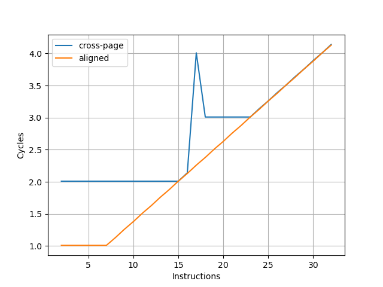
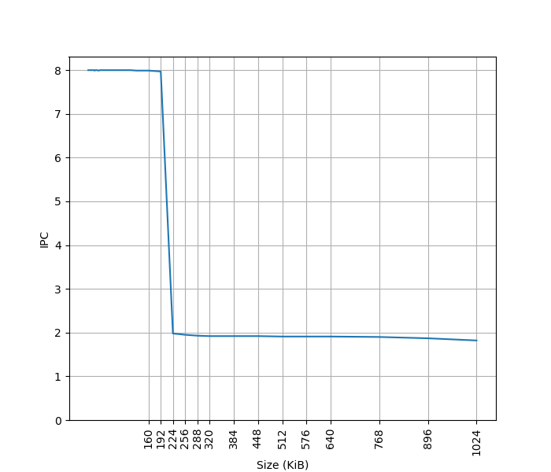
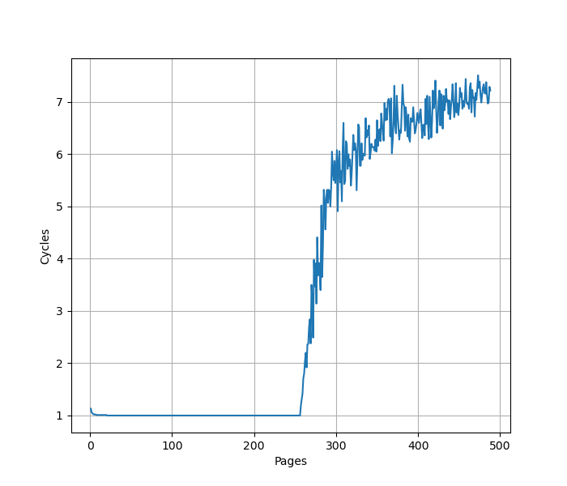
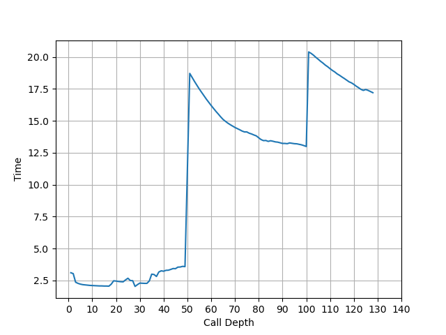
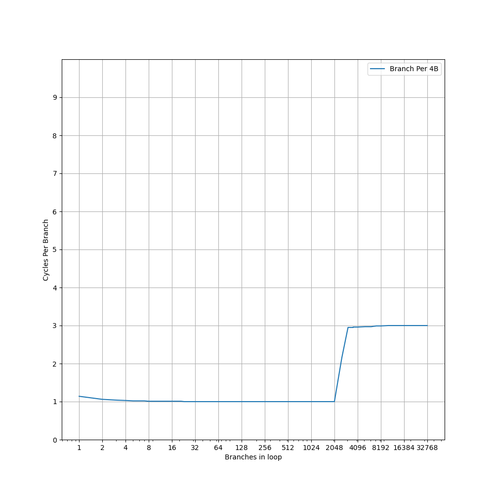
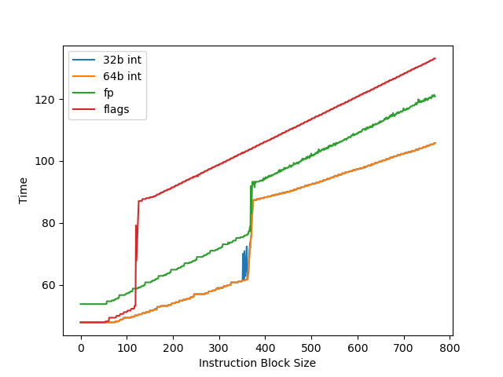
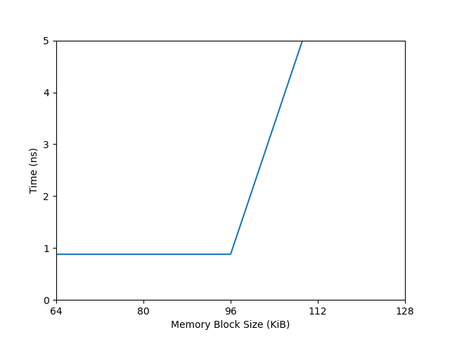
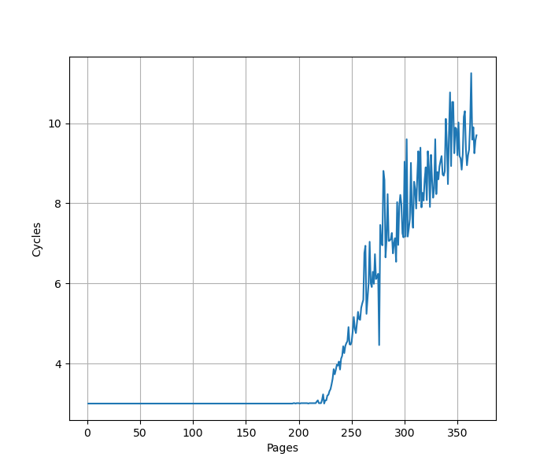
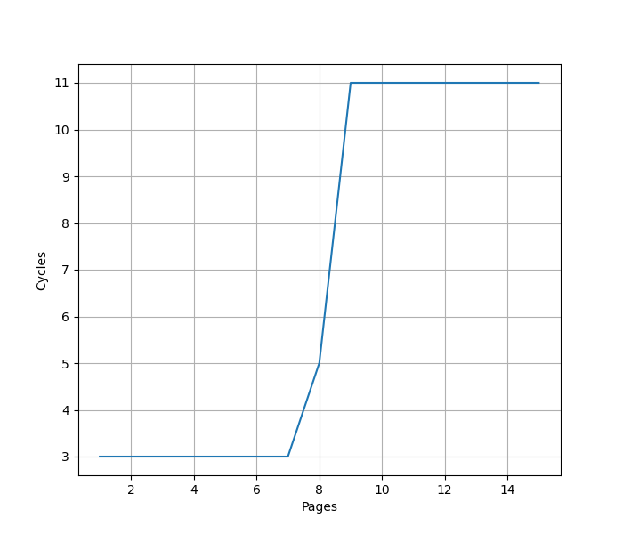
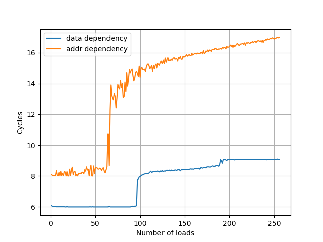

# Qualcomm Oryon 微架构评测

## 背景

最近借到一台 Surface Laptop 7 可以拿来折腾，它用的是高通 Snapdragon X Elite 处理器，借此机会测试一下这个微架构在各个方面的表现。

<!-- more -->

## 官方信息

高通关于 Oryon 微架构有两个 slides，内容可以在以下的链接中看到：

- [The Qualcomm Snapdragon X Architecture Deep Dive: Getting To Know Oryon and Adreno X1 - Anandtech](https://www.anandtech.com/show/21445/qualcomm-snapdragon-x-architecture-deep-dive/2)
- [Hot Chips 2024: Qualcomm’s Oryon Core - Chips and Cheese](https://chipsandcheese.com/2024/08/26/hot-chips-2024-qualcomms-oryon-core/)

两次内容大体一致，Hot Chips 2024 的内容更加详细，但也出现了一些前后矛盾的地方。

## 现有评测

网上已经有较多针对 Oryon 微架构的评测和分析，建议阅读：

- [高通 X Elite Oryon 微架构评测：走走停停](https://zhuanlan.zhihu.com/p/704707254)
- [Qualcomm’s Oryon Core: A Long Time in the Making](https://chipsandcheese.com/2024/07/09/qualcomms-oryon-core-a-long-time-in-the-making/)
- [Qualcomm’s Oryon LLVM Patches](https://chipsandcheese.com/2024/05/15/qualcomms-oryon-llvm-patches/)
- [高通自研 PC 芯片 X Elite 实测：真能干翻苹果英特尔？](https://www.bilibili.com/video/BV1Ue41197Qb/)
- [太贵了，它没你想的那么美好！高通骁龙 X Elite 78-100 笔记本详细评测](https://www.bilibili.com/video/BV1z1421r7dZ/)
- [Snapdragon X Elite](https://www.qualcomm.com/products/mobile/snapdragon/laptops-and-tablets/snapdragon-x-elite)
- [Qualcomm Oryon CPU](https://www.qualcomm.com/products/technology/processors/oryon)

下面分各个模块分别记录官方提供的信息，以及实测的结果。读者可以对照已有的第三方评测理解。官方信息与实测结果一致的数据会加粗。

## Benchmark

Qualcomm Oryon 的性能测试结果见 [SPEC](../../../benchmark.md)。

## 前端

### 取指

官方信息：取指可以达到每周期最多 **16** 指令

为了测试实际的 Fetch 宽度，参考 [如何测量真正的取指带宽（I-fetch width） - JamesAslan](https://zhuanlan.zhihu.com/p/720136752) 构造了测试。

其原理是当 Fetch 要跨页的时候，由于两个相邻页可能映射到不同的物理地址，如果要支持单周期跨页取指，需要查询两次 ITLB，或者 ITLB 需要把相邻两个页的映射存在一起。这个场景一般比较少，处理器很少会针对这种特殊情况做优化，但也不是没有。经过测试，把循环放在两个页的边界上，发现 Oryon 微架构遇到跨页的取指时确实会拆成两个周期来进行。在此基础上，构造一个循环，循环的第一条指令放在第一个页的最后四个字节，其余指令放第二个页上，那么每次循环的取指时间，就是一个周期（读取第一个页内的指令）加上第二个页内指令需要 Fetch 的周期数，多的这一个周期就足以把 Fetch 宽度从后端限制中区分开，实验结果如下：



图中蓝线表示的就是上面所述的第一条指令放一个页，其余指令放第二个页的情况，可以看到每 16 条指令会多一个周期，因此 Oryon 的前端取指宽度确实是 16 条指令。

为了确认这个瓶颈是由取指造成的，又构造了一组实验，把循环的所有指令都放到一个页中，这个时候 Fetch 不再成为瓶颈（图中 aligned），两个曲线的对比可以明确地得出上述结论。

### L1 ICache

官方信息：**192KB** **6-way** L1 ICache

为了测试 L1 ICache 容量，构造一个具有巨大指令 footprint 的循环，由大量的 nop 和最后的分支指令组成。观察在不同 footprint 大小下的 IPC：



可以看到 footprint 在 192 KB 之前时可以达到 8 IPC，之后则快速降到 2 IPC，这里的 192 KB 就对应了 L1 ICache 的容量。虽然 Fetch 可以每周期 16 条指令，也就是一条 64B 的缓存行，由于后端的限制，只能观察到 8 的 IPC。

### L1 ITLB

官方信息：**256-entry** **8-way** L1 ITLB，支持 4KB 和 64KB 的页表大小

构造一系列的 B 指令，使得 B 指令分布在不同的 page 上，使得 ITLB 成为瓶颈：



可以看到 256 Page 出现了明显的拐点，对应的就是 256 的 L1 ITLB 容量。注意要避免 ICache 和 BTB 的容量成为瓶颈，把 B 指令分布在不同的 Cache Line 和 BTB entry 上。

如果每两个 page 放一条 B 指令，容量减小到 128 Page；进一步把 B 指令放得更加稀疏，最终在每 32 个 page 放一条 B 指令时，容量减到 8 Page，之后不再减小。说明 L1 ITLB 是 32 Set 8 Way，Index 是 PC[16:12]。这是页表大小为 4KB 的情况，64KB 没有测试，预计是类似的。

### Decode

官方信息：8 inst/cycle decoded

### Return Stack

官方信息：**50-entry** return stack

构造不同深度的调用链，测试每次调用花费的平均时间，得到下面的图：



可以看到调用链深度为 50 时性能突然变差，因此 Return Stack 深度为 50。

### Branch Predictor

官方信息：80KB Conditional Predictor, 40KB Indirect Predictor

### BTB

官方信息：**2K+** entry BTB

构造大量的无条件分支指令（B 指令），BTB 需要记录这些指令的目的地址，那么如果分支数量超过了 BTB 的容量，性能会出现明显下降。当把大量 B 指令紧密放置，也就是每 4 字节一条 B 指令时：



可见在 2048 个分支之内可以达到 1 的 CPI，超过 2048 个分支，出现了 3 CPI 的平台，一直延续到 32768 个分支或更多。超出 BTB 容量以后，分支预测时，无法从 BTB 中得到哪些指令是分支指令的信息，只能等到取指甚至译码后才能后知后觉地发现这是一条分支指令，这样就出现了性能损失，出现了 3 CPI 的情况。

降低分支指令的密度，在 B 指令之间插入 NOP 指令，使得每 8 个字节有一条 B 指令，得到如下结果：


可以看到 CPI=1 的拐点前移到 1024 个分支，同时 CPI=3 的平台也出现了新的拐点，在 16384 和 32768 之间。拐点的前移，意味着 BTB 采用了组相连的结构，当 B 指令的 PC 的部分低位总是为 0 时，组相连的 Index 可能无法取到所有的 Set，导致表现出来的 BTB 容量只有部分 Set，例如此处容量减半，说明只有一半的 Set 被用到了。

出现新的拐点，对应的是指令 footprint 超出 L1 ICache 的情况：L1 ICache 是 192KB，按照每 8 字节一个 B 指令计算，最多可以存放 24576 条 B 指令，这个值正好处在 16384 和 32768 之间，和拐点吻合。

如果进一步降低 B 指令的密度，使得它的低若干位都等于 0，最终 CPI=1 的拐点定格在 2 条分支，CPI=3/3.5 的拐点定格在 6 条分支。根据这个信息，认为 BTB 是 1024 Set 2 Way 的结构，Index 是 PC[11:2]；同时也侧面佐证了 192KB L1 ICache 是 512 Set 6 Way，Index 是 PC[14:6]。不过考虑到 Oryon 支持跨 64B 边界访存，实际的 L1 ICache 大概率是分 bank 的，这样才能在保持单读口的情况下，一个周期从连续的两个 Cache Line 中取指令。

小结：BTB 容量为 2048 项，采用 2 路组相连方式，当所有分支命中 BTB 时，可以达到 1 CPI；如果超出了 BTB 容量，但没有超出 L1 ICache 容量，可以达到 3 CPI。

### Branch Mispredict Latency

官方信息：13 cycle Branch Mispredict Latency

## 后端

### 物理寄存器堆

官方信息：400+ registers Integer pool, 400+ registers Vector pool

为了测试物理寄存器堆的大小，一般会用两个依赖链很长的操作放在开头和结尾，中间填入若干个无关的指令，并且用这些指令来耗费物理寄存器堆。测试结果见下图：



- 32b/64b int：测试 32/64 位整数寄存器的数量，拐点在 362-374
- fp：测试浮点寄存器的数量，拐点在 362-372
- flags：测试 NZCV 寄存器的数量，拐点在 119-126

可见整数和浮点数都能提供大约 360+ 个寄存器用于乱序执行，加上用于保存架构寄存器的至少 32 个寄存器，加起来和高通宣称的 400+ 是比较一致的。整数和浮点个数测出来一样，可能是这两个寄存器堆大小一样，也可能是整数和浮点放同一个寄存器堆中。经过混合整数和浮点指令测试，认为这两个寄存器堆并不共享。

NZCV 重命名则比整数寄存器少得多，只有 120+，也是考虑到 ARMv8 指令集大部分指令不像 X86 那样会修改 NZCV。

### Reservation Stations

官方信息：

- IXU 6-wide 64-bit, each with 20 entry queue
- VXU 4-wide 128-bit, each with 48 entry queue
- LSU 4-wide 128-bit, each with 16 entry queue (注：Hot Chips 上的 Slides 写的是四个 64-entry，出现了不一致)

### 执行单元

官方信息：

- Up to **6** ALU/cycle
- Up to **2** Branch/cycle
- Up to **2** multiply/MLA per cycle

在循环中重复下列指令多次，测量 CPI，得到如下结果：

- `add x0, x0, 1`：CPI = 6.0，说明可以 6 ALU/cycle
- `cbnz xzr, target;target:`：CPI = 2.0，说明可以 2 Branch/cycle，注意这里是 not taken 分支
- `mul x0, x1, x2`：CPI = 2.0，说明可以 2 Multiply/cycle

### Reorder Buffer

官方信息：

- Retirement 8 uOps/cycle
- Reorder Buffer is 650+ uOps

为了测试 ROB 的大小，设计了一个循环，循环开始是 8 条串行的 fsqrt 指令，每条指令需要 13 个周期，由于数据依赖，一共需要 8*13=104 个周期完成。之后是若干条 NOP 指令，当 NOP 指令比较少时，循环的时候取决于 fsqrt 指令的时间，一次循环大约需要 104 个周期；当 NOP 指令数量过多，填满了 ROB 以后，就会导致 ROB 无法保存下一次循环的 fsqrt 指令，性能出现下降。测试结果如下：


当 NOP 数量达到 676 时，性能开始急剧下滑，而执行 676 条 NOP 只需要 676/8=84.5 个周期，小于 104 个周期，说明瓶颈不在执行 NOP 上，而是因为 ROB 被填满，导致后续的 fsqrt 指令无法及时执行。因此认为 Oryon 的 ROB 大小在 680+。

没有观察到类似 Firestorm 的 Coalesced ROB 的设计。

### Load Store Unit + L1 DCache

官方信息：

- **96KB** 6-way L1 DCache
- **224-entry** **7-way** L1 DTLB, supports 4KB and 64KB translation granules
- Up to 4 Load-Store operations per cycle
- 192 entry Load Queue, 56 entry Store Queue
- Full 64B/cycle for both fills and evictions to L2 cache

#### L1 DCache 容量

构造不同大小 footprint 的 pointer chasing 链，测试不同 footprint 下每条 load 指令耗费的时间：



可以看到 96KB 出现了明显的拐点，对应的就是 96KB 的 L1 DCache 容量。

#### L1 DTLB 容量

用类似的方法测试 L1 DTLB 容量，只不过这次 pointer chasing 链的指针分布在不同的 page 上，使得 DTLB 成为瓶颈：



可以看到 224 Page 出现了明显的拐点，对应的就是 224 的 L1 DTLB 容量。从每个 page 一个指针改成每 32 page 一个指针并注意对齐尽量保证 Index 为 0，此时 L1 DTLB 容量降为 7，说明 L1 DTLB 是 7 路组相连结构，32 个 Set，Index 位是 VA[16:12]，这些页被映射到了相同的 Set 当中：



命中 L1 DTLB 时每条 Load 指令是 3 cycle，意味着高通实现了 3 cycle 的 pointer chasing load to use latency，这个特性在苹果，Exynos M-series 和 Intel 的 E-core 中也可以看到，针对这个优化的讨论，详见 [浅谈乱序执行 CPU（二：访存）](./brief-into-ooo-2.md) 的 Load Pipeline 小节。在其他场景下，依然是 4 cycle 的 load to use latency。

#### Load/Store 带宽

针对 Load Store 带宽，实测每个周期可以完成：

- 4x 128b Load
- 3x 128b Load + 1x 128b Store
- 2x 128b Load + 2x 128b Store
- 1x 128b Load + 2x 128b Store
- 2x 128b Store

如果把每条指令的访存位宽从 128b 改成 256b，读写带宽不变，指令吞吐减半。也就是说最大的读带宽是 64B/cyc，最大的写带宽是 32B/cyc，二者不能同时达到。

不太确定的是高通官方的表述里 `Up to 4 Load-Store operations per cycle` 对于 4 Store ops per cycle 以什么方式成立，因为从 IPC 来看，只能达到 2 Store Per Cycle。

#### L1 DCache 分 Bank

考虑到 L1 DCache 需要单周期支持 4 条 Load 指令，如果要用单读口的 SRAM，一般的做法是设计 4 个 Bank，每个 Bank 对应一组 SRAM。为了测试 Bank 的粒度，使用不同跨步（Stride）的 Load，观察 IPC：

- Stride=1B/2B/4B/8B/16B/32B/64B 时 IPC=4
- Stride=128B 时 IPC=2
- Stride=256B 时 IPC=1

当多个 Load 访问同一个 Cache Line 时，这些 Load 可以同时进行，极限情况下用 4 条 128b Load 可以做到一个周期把整个 64B Cache Line 都读出来；Stride=128B 时，IPC 砍半，说明只有一半的 Bank 得到了利用，进一步 Stride=256B 时，IPC=1，说明只有一个 Bank 被用上。那么 L1 DCache 的组织方式应该是 4 个 Bank，Bank Index 对应 PA[7:6]，也就是连续的四个 64B Cache Line 会被映射到四个 Bank 上。当多个 Load 被映射到同一个 Bank 且访问的不是同一个 Cache Line 时，会出现性能损失。

#### VIPT

在 4KB page 的情况下，96KB 6-way 的 L1 DCache 不满足 VIPT 的 Index 全在页内偏移的条件（详见 [VIPT 与缓存大小和页表大小的关系](./vipt-l1-cache-page-size.md)），此时要么改用 PIPT，要么在 VIPT 的基础上处理 alias 的问题。为了测试这一点，参考 [浅谈现代处理器实现超大 L1 Cache 的方式](https://blog.cyyself.name/why-the-big-l1-cache-is-so-hard/) 的测试方法，用 shm 构造出两个 4KB 虚拟页映射到同一个物理页的情况，然后在两个虚拟页之间 copy，发现相比在同一个虚拟页内 copy 有显著的性能下降，并且产生了大量的 L1 DCache Refill：

```
copy from aliased page = 8407465601 cycles, 321782134 refills
baseline = 1239053083 cycles, 20 refills
slowdown = 6.79x
```

因此猜测 L1 DCache 采用的是 VIPT，并做了针对 alias 的正确性处理。如果是 PIPT，那么 L1 DCache 会发现这两个页对应的是相同的物理地址，性能不会下降，也不需要频繁的 refill。

#### Memory Dependency Predictor

为了预测执行 Load，需要保证 Load 和之前的 Store 访问的内存没有 Overlap，那么就需要有一个预测器来预测 Load 和 Store 之前在内存上的依赖。参考 [Store-to-Load Forwarding and Memory Disambiguation in x86 Processors](https://blog.stuffedcow.net/2014/01/x86-memory-disambiguation/) 的方法，构造两个指令模式，分别在地址和数据上有依赖：

- 数据依赖，地址无依赖：`str x3, [x1]` 和 `ldr x3, [x2]`
- 地址依赖，数据无依赖：`str x2, [x1]` 和 `ldr x1, [x2]`

初始化时，`x1` 和 `x2` 指向同一个地址，重复如上的指令模式，观察到多少条 `ldr` 指令时会出现性能下降：



有意思的是，两种模式出现了不同的阈值，地址依赖的阈值是 64，而数据依赖的阈值是 96。

### MMU

官方信息：

- 4KB and 64KB translation granules
- 1 cycle access for L1 ITLB & L1 DTLB
- Unified L2 TLB, 8-way >8K entry

### L2 Cache

官方信息：

- 12MB 12-way L2 Cache
- MOESI
- 17 cycle latency for L1 miss to L2 hit

### Memory

官方信息：

- 6MB System Level Cache, 26-29ns latency, 135GB/s bandwidth in each direction
- LPDDR5x DRAM, 8448 MT/s, 8 channel of 16 bits, 135GB/s bandwidth, 102-104ns latency
