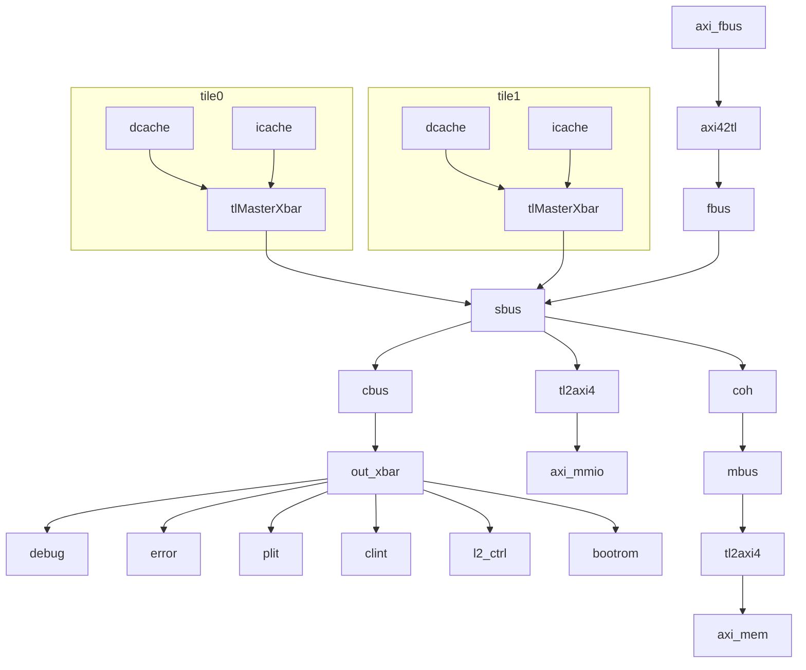

# 分析 Rocket Chip 中 Diplomacy 系统

## 背景

Rocket Chip 大量使用了 Diplomacy 系统来组织它的总线、中断和时钟网络。因此，如果想要对 Rocket Chip 进行定制，那么必须要对 Rocket Chip 中 Diplomacy 系统的使用有充分的了解，而这方面的文档比较欠缺。本文是对 Rocket Chip 中 Diplomacy 系统的使用的分析。阅读本文前，建议阅读先前的 [分析 Diplomacy 系统](./diplomacy.md) 文章，对 Diplomacy 系统的设计和内部实现获得一定的了解。

<!-- more -->

## Rocket Chip 总线结构概要

Rocket Chip 主要有以下几个总线：

1. sbus: System Bus
2. mbus: Memory Bus
3. cbus: Control Bus
4. pbus: Periphery Bus
5. fbus: Frontend Bus

图示可以见参考文档中的链接，不过链接中的结构和实际的有一些区别。目前的 Rocket Chip 的总线结构大致是这样：

```
fbus -> sbus -> mbus
tile --/    \-> cbus -> pbus
```

主要是 pbus 的位置从连接 sbus 移动到了连接 cbus。

根据配置不同，总线结构也不同，例如在有 coh(coherence manager) 的时候，是：

```
fbus -> sbus -> coh -> mbus
tile --/    \-> cbus -> pbus
```

## 深入分析 Rocket Chip 总线结构

下面是一个双核 Rocket Chip 的 GraphML 导出来用 yED 绘制的架构图：


接下来深入分析图中的各个连接关系以及对应的代码。

### TileLink 和 AXI 总线

这个图比较复杂，混合了多个 Diplomacy 网络，首先是总线的部分，包括 TileLink 和 AXI：

1. 两个 Tile，对应一个双核的系统；每个 Tile 内部有一个 dcache 和 icache，连接到一个 tlMasterXbar 上，再通过 coupler_from_rockettile 连接到 fixer 再到 system_bus_xbar
2. 从 system_bus_xbar 分出来三路 Slave：
    1. 第一路是 cbus，通过 out_xbar，连接到多个 slave：debug，error device，plic，clint，l2 control，bootrom
    2. 第二路是 mmio，通过 tl2axi4，转成 AXI4 连接到外部的 MMIO 外设
    3. 第三路是 coh，连接到 InclusiveCache，再连接到 mbus，通过 tl2axi4，转成 AXI4 连接到外部的内存
3. system_bus_xbar 除了每个 tile 对应一个 master 以外，还有一个 master：fbus，它从外部的 AXI4 进来，通过 axi42tl 转换，接到 fbus，提供一个有缓存一致性的 AXI 访问接口，用于 DMA

简化后的结构如图：



那么这些连接关系在代码中是怎么搭建的呢：

1. 首先是 tile 内部，dcache 和 icache 分别通过一个 widget 连到一个 tlMasterXbar 上：

    ```scala
    class Frontend(val icacheParams: ICacheParams, tileId: Int)(implicit p: Parameters) extends LazyModule {
      lazy val module = new FrontendModule(this)
      // icache resides in frontend
      val icache = LazyModule(new ICache(icacheParams, tileId))
      val masterNode = icache.masterNode
      val slaveNode = icache.slaveNode
      val resetVectorSinkNode = BundleBridgeSink[UInt](Some(() => UInt(masterNode.edges.out.head.bundle.addressBits.W)))
    }

    trait HasICacheFrontend extends CanHavePTW { this: BaseTile =>
      val frontend = LazyModule(new Frontend(tileParams.icache.get, tileId))
      // tlMasterXbar.node <-- TLWidthWidget <-- frontend.masterNode(i.e. icache.masterNode)
      tlMasterXbar.node := TLWidthWidget(tileParams.icache.get.rowBits/8) := frontend.masterNode
    }

    trait HasHellaCache { this: BaseTile =>
      lazy val dcache: HellaCache = LazyModule(p(BuildHellaCache)(this)(p))
      tlMasterXbar.node := TLWidthWidget(tileParams.dcache.get.rowBits/8) := dcache.node
    }
    ```
2. 其次是每个 tile 的 tlMasterXbar 连接到 coupler_from_rockettile，再连到 sbus(system_bus_xbar)

    ```scala
    // in HasTiles.scala
    /** Connect the port where the tile is the master to a TileLink interconnect. */
    def connectMasterPorts(domain: TilePRCIDomain[TileType], context: Attachable): Unit = {
      implicit val p = context.p
      // crossingParams.master.where defaults to SBUS, see below
      // so dataBus is system_bus_xbar
      val dataBus = context.locateTLBusWrapper(crossingParams.master.where)
      // coupler_from_rockettile (val baseName = "rockettile" in RocketTileParams)
      dataBus.coupleFrom(tileParams.baseName) { bus =>
        // crossMasterPort is defined below
        bus :=* crossingParams.master.injectNode(context) :=* domain.crossMasterPort(crossingParams.crossingType)
      }
    }

    // in HierarchicalElementPRCIDomain.scala
    def crossMasterPort(crossingType: ClockCrossingType): TLOutwardNode = {
      val tlMasterResetXing = this { DisableMonitors { implicit p =>
        element { element.makeMasterBoundaryBuffers(crossingType) } :=*
          // masterNode is defined below
          element_reset_domain.crossTLOut(element.masterNode)
      } }
      val tlMasterClockXing = this.crossOut(tlMasterResetXing)
      tlMasterClockXing(crossingType)
    }

    // in RocketTile.scala
    tlOtherMastersNode := tlMasterXbar.node
    masterNode :=* tlOtherMastersNode

    // crossingParams defaults to RocketCrossingParams()
    // in RocketSubsystem.scala
    case class RocketCrossingParams(
      crossingType: ClockCrossingType = SynchronousCrossing(),
      master: HierarchicalElementPortParamsLike = HierarchicalElementMasterPortParams(),
      slave: HierarchicalElementSlavePortParams = HierarchicalElementSlavePortParams(),
      mmioBaseAddressPrefixWhere: TLBusWrapperLocation = CBUS,
      resetCrossingType: ResetCrossingType = NoResetCrossing(),
      forceSeparateClockReset: Boolean = false
    ) extends HierarchicalElementCrossingParamsLike

    // default crossingParams.master.where is SBUS(System Bus)
    case class HierarchicalElementMasterPortParams(
      buffers: Int = 0,
      cork: Option[Boolean] = None,
      where: TLBusWrapperLocation = SBUS
    ) extends HierarchicalElementPortParamsLike {
      def injectNode(context: Attachable)(implicit p: Parameters): TLNode = {
        (TLBuffer.chainNode(buffers) :=* cork.map { u => TLCacheCork(unsafe = u) } .getOrElse { TLTempNode() })
      }
    }
    ```

3. 接着是 sbus 连接到 coh，coh 连接到 mbus：

    ```scala
    // in BusTopology.scala
    /** Parameterization of a topology containing a banked coherence manager and a bus for attaching memory devices. */
    case class CoherentBusTopologyParams(
      mbus: MemoryBusParams,
      coherence: BankedCoherenceParams,
      sbusToMbusXType: ClockCrossingType = NoCrossing,
      driveMBusClockFromSBus: Boolean = true
    ) extends TLBusWrapperTopology(
      // instantiate mbus and coherence manager
      instantiations = (if (coherence.nBanks == 0) Nil else List(
        (MBUS, mbus),
        (COH, CoherenceManagerWrapperParams(mbus.blockBytes, mbus.beatBytes, coherence.nBanks, COH.name)(coherence.coherenceManager)))),
      connections = if (coherence.nBanks == 0) Nil else List(
        // (master, slave, parameters)
        // coh := sbus
        (SBUS, COH,   TLBusWrapperConnection(driveClockFromMaster = Some(true), nodeBinding = BIND_STAR)()),
        // mbus := coh
        (COH,  MBUS,  TLBusWrapperConnection.crossTo(
          xType = sbusToMbusXType,
          driveClockFromMaster = if (driveMBusClockFromSBus) Some(true) else None,
          nodeBinding = BIND_QUERY))
      )
    )

    // in BusWrapper.scala
    class TLBusWrapperTopology(
      val instantiations: Seq[(Location[TLBusWrapper], TLBusWrapperInstantiationLike)],
      val connections: Seq[(Location[TLBusWrapper], Location[TLBusWrapper], TLBusWrapperConnectionLike)]
    ) extends CanInstantiateWithinContextThatHasTileLinkLocations
      with CanConnectWithinContextThatHasTileLinkLocations
    {
      def instantiate(context: HasTileLinkLocations)(implicit p: Parameters): Unit = {
        instantiations.foreach { case (loc, params) => context { params.instantiate(context, loc) } }
      }
      def connect(context: HasTileLinkLocations)(implicit p: Parameters): Unit = {
        connections.foreach { case (master, slave, params) => context { params.connect(context, master, slave) } }
      }
    }
    ```

4. 为了让 Rocket Chip 可以访问外部的 AXI MMIO 设备，在 sbus 下面添加了 tl 到 axi 的一条路径：

    ```scala
    /** Adds a AXI4 port to the system intended to master an MMIO device bus */
    trait CanHaveMasterAXI4MMIOPort { this: BaseSubsystem =>
      private val mmioPortParamsOpt = p(ExtBus)
      private val portName = "mmio_port_axi4"
      private val device = new SimpleBus(portName.kebab, Nil)

      val mmioAXI4Node = AXI4SlaveNode(
        mmioPortParamsOpt.map(params =>
          AXI4SlavePortParameters(
            slaves = Seq(AXI4SlaveParameters(
              address       = AddressSet.misaligned(params.base, params.size),
              resources     = device.ranges,
              executable    = params.executable,
              supportsWrite = TransferSizes(1, params.maxXferBytes),
              supportsRead  = TransferSizes(1, params.maxXferBytes))),
            beatBytes = params.beatBytes)).toSeq)

      // in BaseSubsystem.scala:
      // def viewpointBus: TLBusWrapper = tlBusWrapperLocationMap(p(TLManagerViewpointLocated(location)))
      // case class TLManagerViewpointLocated(where: HierarchicalLocation) extends Field[Location[TLBusWrapper]](SBUS)
      // so viewpointBus points to sbus by default
      mmioPortParamsOpt.map { params =>
        viewpointBus.coupleTo(s"port_named_$portName") {
          (mmioAXI4Node
            := AXI4Buffer()
            := AXI4UserYanker()
            := AXI4Deinterleaver(viewpointBus.blockBytes)
            := AXI4IdIndexer(params.idBits)
            := TLToAXI4()
            := TLWidthWidget(viewpointBus.beatBytes)
            := _)
        }
      }

      val mmio_axi4 = InModuleBody { mmioAXI4Node.makeIOs() }
    }
    ```

5. 类似地，为了让 Rocket Chip 可以访问外部的 AXI Memory，在 mbus 下面添加了 tl 到 axi 的一条路径：

    ```scala
    /** Adds a port to the system intended to master an AXI4 DRAM controller. */
    trait CanHaveMasterAXI4MemPort { this: BaseSubsystem =>
      private val memPortParamsOpt = p(ExtMem)
      private val portName = "axi4"
      private val device = new MemoryDevice
      private val idBits = memPortParamsOpt.map(_.master.idBits).getOrElse(1)
      private val mbus = tlBusWrapperLocationMap.get(MBUS).getOrElse(viewpointBus)

      val memAXI4Node = AXI4SlaveNode(memPortParamsOpt.map({ case MemoryPortParams(memPortParams, nMemoryChannels, _) =>
        Seq.tabulate(nMemoryChannels) { channel =>
          val base = AddressSet.misaligned(memPortParams.base, memPortParams.size)
          val filter = AddressSet(channel * mbus.blockBytes, ~((nMemoryChannels-1) * mbus.blockBytes))

          AXI4SlavePortParameters(
            slaves = Seq(AXI4SlaveParameters(
              address       = base.flatMap(_.intersect(filter)),
              resources     = device.reg,
              regionType    = RegionType.UNCACHED, // cacheable
              executable    = true,
              supportsWrite = TransferSizes(1, mbus.blockBytes),
              supportsRead  = TransferSizes(1, mbus.blockBytes),
              interleavedId = Some(0))), // slave does not interleave read responses
            beatBytes = memPortParams.beatBytes)
        }
      }).toList.flatten)

      for (i <- 0 until memAXI4Node.portParams.size) {
        val mem_bypass_xbar = mbus { TLXbar() }

        // Create an incoherent alias for the AXI4 memory
        memPortParamsOpt.foreach(memPortParams => {
          memPortParams.incohBase.foreach(incohBase => {
            val cohRegion = AddressSet(0, incohBase-1)
            val incohRegion = AddressSet(incohBase, incohBase-1)
            val replicator = tlBusWrapperLocationMap(p(TLManagerViewpointLocated(location))) {
              val replicator = LazyModule(new RegionReplicator(ReplicatedRegion(cohRegion, cohRegion.widen(incohBase))))
              val prefixSource = BundleBridgeSource[UInt](() => UInt(1.W))
              replicator.prefix := prefixSource
              // prefix is unused for TL uncached, so this is ok
              InModuleBody { prefixSource.bundle := 0.U(1.W) }
              replicator
            }
            viewpointBus.coupleTo(s"memory_controller_bypass_port_named_$portName") {
              (mbus.crossIn(mem_bypass_xbar)(ValName("bus_xing"))(p(SbusToMbusXTypeKey))
                := TLWidthWidget(viewpointBus.beatBytes)
                := replicator.node
                := TLFilter(TLFilter.mSubtract(cohRegion))
                := TLFilter(TLFilter.mResourceRemover)
                := _
              )
            }
          })
        })

        mbus.coupleTo(s"memory_controller_port_named_$portName") {
          (memAXI4Node
            := AXI4UserYanker()
            := AXI4IdIndexer(idBits)
            := TLToAXI4()
            := TLWidthWidget(mbus.beatBytes)
            := mem_bypass_xbar
            := _
          )
        }
      }

      val mem_axi4 = InModuleBody { memAXI4Node.makeIOs() }
    }
    ```

6. 类似地，为了让外部的 AXI Master 可以访问一致的内存，在 fbus 上面添加了从 axi 到 tl 的一条路径，而 fbus 是连到 sbus 上的：

    ```scala
    /** Adds an AXI4 port to the system intended to be a slave on an MMIO device bus */
    trait CanHaveSlaveAXI4Port { this: BaseSubsystem =>
      private val slavePortParamsOpt = p(ExtIn)
      private val portName = "slave_port_axi4"
      private val fifoBits = 1
      private val fbus = tlBusWrapperLocationMap.get(FBUS).getOrElse(viewpointBus)

      val l2FrontendAXI4Node = AXI4MasterNode(
        slavePortParamsOpt.map(params =>
          AXI4MasterPortParameters(
            masters = Seq(AXI4MasterParameters(
              name = portName.kebab,
              id   = IdRange(0, 1 << params.idBits))))).toSeq)

      slavePortParamsOpt.map { params =>
        fbus.coupleFrom(s"port_named_$portName") {
          ( _
            := TLBuffer(BufferParams.default)
            := TLFIFOFixer(TLFIFOFixer.all)
            := TLWidthWidget(params.beatBytes)
            := AXI4ToTL()
            := AXI4UserYanker(Some(1 << (params.sourceBits - fifoBits - 1)))
            := AXI4Fragmenter()
            := AXI4IdIndexer(fifoBits)
            := l2FrontendAXI4Node )
        }
      }

      val l2_frontend_bus_axi4 = InModuleBody { l2FrontendAXI4Node.makeIOs() }
    }

    case class HierarchicalBusTopologyParams(
      pbus: PeripheryBusParams,
      fbus: FrontBusParams,
      cbus: PeripheryBusParams,
      xTypes: SubsystemCrossingParams,
      driveClocksFromSBus: Boolean = true
    ) extends TLBusWrapperTopology(
      instantiations = List(
        (PBUS, pbus),
        (FBUS, fbus),
        (CBUS, cbus)),
      connections = List(
        // (master, slave, params)
        // cbus := sbus
        (SBUS, CBUS, TLBusWrapperConnection  .crossTo(xTypes.sbusToCbusXType, if (driveClocksFromSBus) Some(true) else None)),
        // pbus := cbus
        (CBUS, PBUS, TLBusWrapperConnection  .crossTo(xTypes.cbusToPbusXType, if (driveClocksFromSBus) Some(true) else None)),
        // sbus := fbus
        (FBUS, SBUS, TLBusWrapperConnection.crossFrom(xTypes.fbusToSbusXType, if (driveClocksFromSBus) Some(false) else None)))
    )
    ```

7. 上一段代码中，在 sbus 的下游挂载了 cbus，在 cbus 下游挂载了 pbus；那么 debug/plic/clint 等设备都是挂载在 cbus 下的：

    ```scala
    // in HasPeripheryDebug of Periphery.scala
    // default to cbus
    private lazy val tlbus = locateTLBusWrapper(p(ExportDebug).slaveWhere)
    val tlDM = LazyModule(new TLDebugModule(tlbus.beatBytes))
    tlDM.node := tlbus.coupleTo("debug"){ TLFragmenter(tlbus.beatBytes, tlbus.blockBytes, nameSuffix = Some("Debug")) := TLBuffer() := _ }

    // in CanHavePeripheryCLINT of CLINT.scala
    // default to cbus
    val tlbus = locateTLBusWrapper(p(CLINTAttachKey).slaveWhere)
    val clintDomainWrapper = tlbus.generateSynchronousDomain("CLINT").suggestName("clint_domain")
    val clint = clintDomainWrapper { LazyModule(new CLINT(params, tlbus.beatBytes)) }
    clintDomainWrapper { clint.node := tlbus.coupleTo("clint") { TLFragmenter(tlbus, Some("CLINT")) := _ } }

    // in CanHavePeripheryPLIC of Pli.scala
    // default to cbus
    val tlbus = locateTLBusWrapper(p(PLICAttachKey).slaveWhere)
    val plicDomainWrapper = tlbus.generateSynchronousDomain("PLIC").suggestName("plic_domain")
    val plic = plicDomainWrapper { LazyModule(new TLPLIC(params, tlbus.beatBytes)) }
    plicDomainWrapper { plic.node := tlbus.coupleTo("plic") { TLFragmenter(tlbus, Some("PLIC")) := _ } }
    plicDomainWrapper { plic.intnode :=* ibus.toPLIC }
    ```

至此就把前面提到的 Rocket Chip 的总线结构在源码中的对应关系都找到了。

### 中断

TODO

### 时钟

TODO

## TileLink Widgets

Rocket Chip 中用 Diplomacy 实现 TileLink 总线的连接。涉及到的相关结构如下：

1. TLBundle：代表 TileLink 总线的接口，根据 TLBundleParameters 例化
2. TLMasterPortParameters：信息 TileLink Master 的信息，从 Upstream 向 Downstream 传递
3. TLSlavePortParameters：信息 TileLink Slave 的信息，从 Downstream 向 Upstream 传递
4. TLEdgeOut：记录 Outward 边，也就是 Master 侧的 TileLink 的信息
5. TLEdgeIn：记录 Inward 边，也就是 Slave 侧的 TileLink 的信息
6. TLImp: `extends NodeImp[TLMasterPortParameters, TLSlavePortParameters, TLEdgeOut, TLEdgeIn, TLBundle]`，基于这个类型来导出各种类型的 TileLink Node
7. TLXBar：TileLink 的 Crossbar，生成一个继承 NexusNode 的 TLNexusNode，它的信息传递方式是，把下游的各个 Slave 信息拼起来传给上游，使得 Master 可以看到所有 Slave 的信息；把上游的各个 Master 信息拼起来传给下游，使得 Slave 可以看到所有 Master 的信息
8. TLToAXI4：生成一个继承 AdapterNode 的 TLToAXI4Node，把 TileLink Master 转成 AXI4 Master，把上游的 TileLink Master 信息转换为 AXI Master 传递给下游，把下游的 AXI Slave 信息转换为 TileLink Slave 传递给上游

## 参考文档

- [TileLink and Diplomacy Reference](https://chipyard.readthedocs.io/en/latest/TileLink-Diplomacy-Reference/index.html)
- [Rocket Chip - Memory System](https://chipyard.readthedocs.io/en/latest/Generators/Rocket-Chip.html#memory-system)
- [chipsalliance/diplomacy](https://github.com/chipsalliance/diplomacy)
