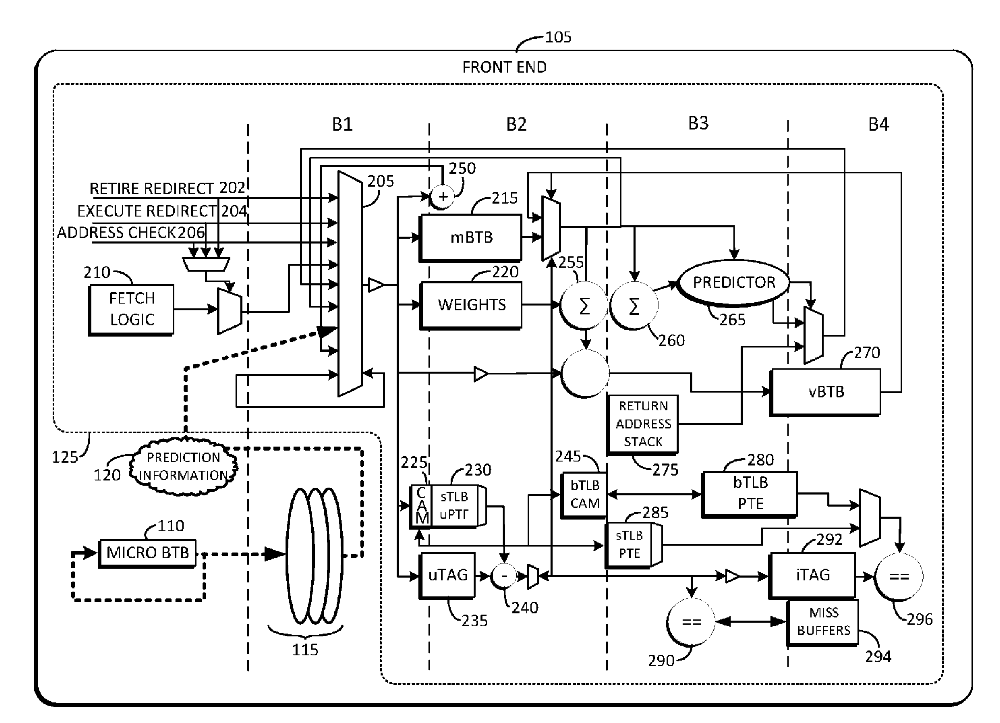
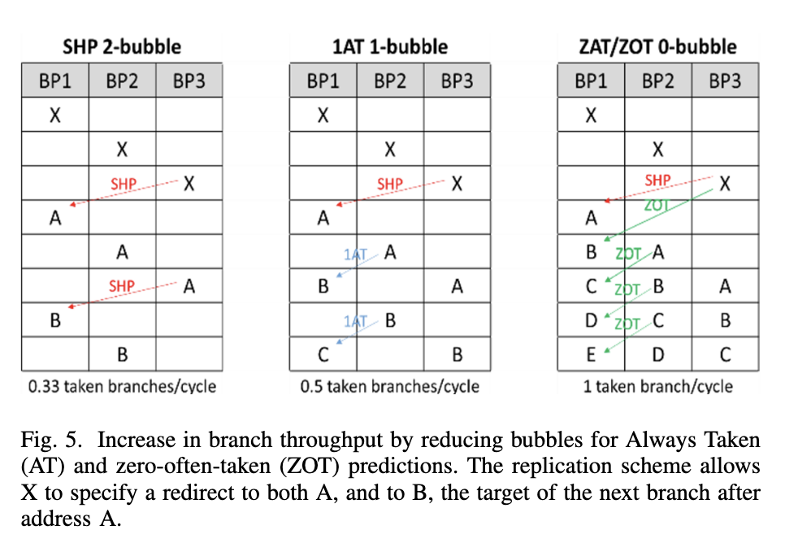
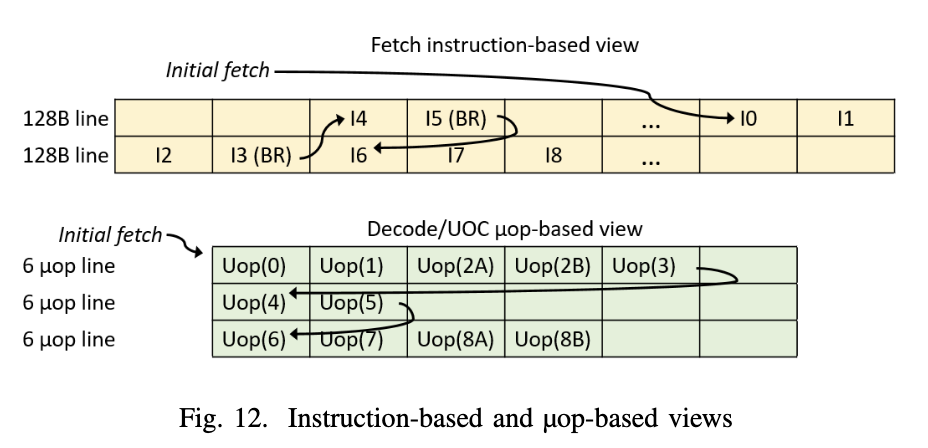

# 三星 Exynos CPU 微架构学习笔记

## 背景

ISCA 2020 的一篇文章 [Evolution of the Samsung Exynos CPU Microarchitecture](https://ieeexplore.ieee.org/document/9138988) 非常详细地解析了三星 Exynos 自研 CPU 微架构的演进历史。本文是对这篇论文的学习和整理的笔记。

<!-- more -->

## 分支预测器

文章 Chapter IV 讲述了 Exynos 系列微架构的分支预测器实现。Exynos 微架构用的是 [Scaled Hashed Perceptron](https://ieeexplore.ieee.org/document/903263) 分支方向预测器，这个分支预测器的提出者 Daniel A. Jiménez 也在这篇论文的作者列表中。现在采用基于 Perceptron 的分支预测器的处理器不多，AMD 的 Zen 1 用了，Zen 2 是 Perceptron 加 TAGE，Zen 3 以后就只有 TAGE 了。

除了方向预测器，还需要有 BTB 来识别分支以及记录分支的目的地址。为了性能，每个周期都要预测至少一个分支，所以一般会有一个 0-bubble 的 BTB，在这里叫 uBTB（microBTB，用 u 代替希腊字母 μ）。但也因为时序的限制，不会做的太大。为了支持有更大的容量，通常还会有更大的，延迟也更长的 BTB，在这里叫 mBTB（Main BTB），最大的是 L2 BTB，还有后面会讲到处理边界情况的 vBTB。同理，分支预测器也有容量和延迟的双重考虑，设置不同大小和容量的分支预测器，也可能会分多级，和 0-bubble uBTB 配对的 LHP（Local History Perception）以及 1-2 bubble mBTB 配对的完整的 SHP（Scaled Hashed Perception）。此外还有 RAS（Return Address Stack）负责函数返回地址的预测。

首先从 Exynos 最早的分支预测器设计开始。一开始设计的时候，就考虑到要支持 2 prediction/clock 的场景，前提是第一个分支是 not taken 的。例如有两条分支指令，第一条是条件分支指令，如果第一条分支 taken，那就以第一条分支的结果为准；如果第一条分支 not taken，那就应该以第二条分支的结果为准。这样可以在比较低的开销的前提下，一个周期预测两条分支指令，提高分支预测的性能，如果不做这个优化的话，需要先预测第一条分支，预测完，再去预测第二条分支。论文中指出，对于这种需要预测 2 个分支的场景，有 60% 的情况是第一条分支 taken，24% 情况是第一条分支 not taken 并且第二条分支 taken，两个都 not taken 的情况占 16%。那么后 40% 的情况就可以得到性能提升。这个优化还是挺常见的，例如[香山南湖架构](https://raw.githubusercontent.com/OpenXiangShan/XiangShan-doc/main/slides/20220825-RVSC-%E9%A6%99%E5%B1%B1%E5%A4%84%E7%90%86%E5%99%A8%E5%89%8D%E7%AB%AF%E5%8F%96%E6%8C%87%E6%9E%B6%E6%9E%84%E6%BC%94%E8%BF%9B.pdf)做了这个优化，而且虽然可以 2 predictions/cycle，但实际上只有一个 Fetch Packet，也最多 1 taken prediction/cycle。

SHP，也就是那个最大的 Perceptron 预测器，包含了 8 个表，每个表有 1024 个权重，每个 BTB 表项还给每个分支记录了一个 bias。预测的时候，根据 GHR（根据分支 taken/not taken 历史）和 PHR（根据 taken branch 地址）以及分支的 PC 经过哈希，得到 table 的 index，根据 index 去访问权重。把从 8 个表里读出来的权重加起来，再加上 bias 的两倍，得到最早的计算结果，如果是非负数，则预测为 taken；负数则预测为 not taken。

知道分支的实际跳转方向后，如果预测错误了，或者预测对了，但是计算结果太接近 0，就需要更新 weight。更新时，会更新参与到计算的来自各个表的 weight，如果是 taken，那就增加 weight；如果是 not taken，就减少 weight。Exynos M1 采用了 165 位的 GHR，也就是最近 165 条条件分支的跳转方向，以及 80 位的 PHR，每个 taken branch 会向 PHR 贡献 3 个 bit（B[4:2]），但是没说移位多少。这样就构成了一个 Perceptron 预测器。

特别地，针对总是跳转的分支，例如无条件跳转分支，或者总是跳转的条件分支，就不用更新 SHP 了，他们只需要在 BTB 中标记一下即可，避免污染 SHP，干扰其他分支的预测。类似的思路也挺常见的，AMD 的做法是，对于从来没有跳转过的条件分支指令，不分配 BTB 表项，并且预测为不跳转；当条件分支了跳转第一次，那就会在 BTB 中分配表项，标记为 always taken，表示预测为总是跳转；当条件分支跳转和不跳转各至少一次，才启用分支方向预测器。

接下来是 BTB。mBTB，也就是上面提到的有 1-2 bubble 的略微大一些的 BTB，可以给 128B 大小的 cacheline 保存 8 条分支指令。统计数据表示，平均每 5 条指令有一条是分支指令，那么 128B 在 4 字节定长指令的情况下，可以存 32 条指令，估算得到大约有 6-7 条分支指令，所以设计了可以存 8 条。但也有可能分支密度很高，128B 全是分支指令，那就会有 32 条分支指令了。

为了解决这个问题，设计了 vBTB（virtual indexed BTB），可以把 128B 的 cacheline 里超过 8 个 branch 的多余部分保存下来，当然了，会有额外的开销。

比较特别的是，没有设计单独的例如 ITTAGE 那样的 Indirect Predictor，而是采用了叫做 VPC（Virtual PC）的方案，它的思路是，复用方向预测器和 BTB 的能力，把一条 Indirect Branch 映射为多条 Conditional Branch，每个 Conditional Branch 的 Target 对应一个可能的 Indirect Branch Target，这个 Target 就存在 BTB 当中。预测的时候，按照顺序遍历每个虚拟的 Conditional Branch，如果预测为 taken，那就跳转到这个虚拟的分支的目的地址；如果预测为 not taken，那就遍历到下一个虚拟的分支。如果所有的虚拟条件分支都被预测为不跳转，那就需要等到后端计算出实际的目的地址，再跳转。对于每个 Indirect Branch，这样的虚拟条件分支最多生成 16 个。

这些虚拟的条件分支既然要利用 BTB 的空间，自然也会抢占 128B cacheline 最多 8 条分支的限制，多余的分支或者 Indirect Branch 生成的虚拟条件分支也会溢出到 vBTB 内。这种设计还是第一次见。

由于这个初始的分支预测器设计只有一个 main BTB，需要 2 bubble 才能出一个 taken branch，在 taken branch 很密集的时候，就需要三个周期一个 taken branch 了，这性能肯定不够好。所以 Exynos M1 引入了 0-bubble 的 uBTB，容量比较小，好处是快，一般这种 0-bubble BTB 也可以叫做 Next Line Predictor，预测下一个周期的 Fetch 地址。

为了实现 0-bubble 的 uBTB，Exynos M1 用了一个基于图的结构来记录分支之间的跳转关系，配合一个记录分支局部历史的 Hashed Perceptron 算法来预测方向。这个预测算法也是第一次见，在三星的专利 [High performance zero bubble conditional branch prediction using micro branch target buffer ](https://patents.google.com/patent/US20170068539A1/en) 中提出，大题思路其实就是把基本块学习出来，找到分支之间 taken 和 not taken 的关系，以每个分支为一个结点，如果一个分支 taken 以后会到另一个分支，那就在这两个分支对应的结点之间连一条 taken 的有向边，类似地，not taken 也会连 not taken 的有向边。

有了图以后，就可以直接从图中知道下一个会到达的分支在哪里，即使这个分支可能距离很远；而常规的 BTB 设计里，则是拿到地址以后，用地址去寻找匹配的 BTB entry，这个过程中可能会扫描到一些不存在分支指令的代码块。这里也支持前面说的连续两个分支同时预测的情况，在同一个周期内预测两个分支，如果第一个分支不跳，就用第二个分支的结果，在树上转移。为了省电，当 uBTB 预测准确率较高，图记录了最近执行的所有分支，那么 uBTB 就可以火力全开，保持 0-bubble 的预测，这个预测在后面的流水线中会被 mBTB 和 SHP 进行进一步的确认。如果准确率特别高，认为 mBTB 和 SHP 大概率也会得到相同的预测结果，就会进一步停止 mBTB 和 SHP 的使用，降低功耗，这时候就要靠后端的 Branch Unit 来检查预测是否正确。

这就是 Exynos M1 和 M2 的分支预测器设计。上面的专利[High performance zero bubble conditional branch prediction using micro branch target buffer](https://patents.google.com/patent/US20170068539A1/en)还给出了前端的流水线各级的功能：

这个图中没有绘制 uBTB 内部的结构，uBTB 负责给出初始的预测，到 B1 阶段，从 B1 开始，会经过两条流水线，上面的流水线是 mBTB + SHP 负责更精确的预测，下面的流水线是查询 ITLB + 读取 ICache。上面说 2-bubble 的 mBTB，实际上就是从 B1 得到 Fetch Window，B2 读取 mBTB 和 SHP 的权重，等到 B3 完成之后才可以计算出结果，判断是 taken 还是 not taken，如果预测的结果和 uBTB 预测不一致，就需要刷流水，从 B1 重新开始：B1 B2 B3 B1 B2 B3，三个周期一个 taken branch。

图中也可以看到 vBTB 在 B4，所以如果一个 cacheline 有超过 8 个 branch，那么在预测这些溢出到 vBTB 中的分支时，需要额外的两个周期：B1 B2 B3 B4 B3，五个周期一个 taken branch。

Exynos M3 继续改进了分支预测器。首先是 uBTB 的图的容量翻倍，添加了针对无条件分支的容量。为了加速总是跳转的条件分支指令，当 mBTB 检测到总是跳转的条件分支指令时，提前一个周期得到结果，也就是上图中 B3 到 B1 的连线，没有经过权重计算，直接刷 B1：B1 B2 B1 B2，两个周期一个 taken branch，1-bubble，在论文里叫做 1AT（1-bubble Always Taken）。Exynos M3 还翻倍了 SHP 的行的个数，也翻倍了 L2 BTB 容量。

Exynos M4 继续翻倍了 L2 BTB 容量，减少了 L2 BTB refill 到 mBTB 的延迟，带宽翻倍。这个优化主要是针对分支比较多，mBTB 存不下的程序。

Exynos M5 增加了 Empty Line Optimization 优化：检测没有分支的缓存行，如果确认缓存行没有分支，那就不用预测里面的分支了，可以节省功耗。

为了进一步优化 taken branch 的吞吐，在 mBTB 中记录分支的目的地址时，不仅记录在分支本身所在的 mBTB entry 中，还要记录在这条分支的前序分支的 mBTB entry 中：例如 A 跳转到 B，B 跳转到 C，经典的实现是用 A 的地址查询 B，用 B 的地址查询 C；而 Exynos M5 的设计是，可以用 A 查询 B 和 C。不过这里要求 B 的跳转是 always-taken 或者 often-taken，因为并没有对第二条分支做预测，而是预测它一定会跳。通过这样的方法，可以在 2-bubble 的预测器的实现下，实现 1 taken branch/cycle 的吞吐，等效于一个 0-bubble 的预测器。下面是论文中对 mBTB 从 2-bubble 到 1-bubble 最终到 0-bubble 的变化的对比图：

最左边的 SHP 2-bubble 就是最初的实现，它需要在 B3 得到分支是 taken 还是 not taken 的信息，如果和之前预测的不一样，那就需要 flush 掉流水线，B1 重新从正确的地址开始，然后重复这个过程，由于每次都需要到 B3 才能得到正确的地址，所以三个周期一个 taken branch。

中间是改进的 1AT 1-bubble 实现，它在 mBTB 中记录了这个分支是否是 Always Taken。因为 mBTB 在 B2 中读取，所以这个信息在 B2 就可以得知，例如图中 A 分支到达 B2 时，检测到它是 Always Taken，下个周期的 B1 直接就从正确的地址 B 开始，同理 B 到达 B2 时，又发现它是 Always Taken，下一个周期的 B1 又从 C 开始，所以两周期一个 taken branch，前提是分支是 Always Taken，通过避免分支预测来减少一个周期的 bubble。

右边是最后的 ZAT/ZOT 0-bubble 实现，它在 mBTB 中记录了后续两个分支的地址，例如 X 在 mBTB 中记录了 A 和 B 的地址。当 B3 发现 X 要跳转的时候，刷流水线，在接下来的两个周期里分别给 B1 提供了 A 和 B 的地址。当 A 到达 B2 时，A 在 mBTB 里记录了 B 和 C 的地址，于是把 C 的地址转发到下一个周期的 B1，依此类推，B2 的 B 得到了 D 的地址，B2 的 C 得到了 E 的地址，这样实现了每个周期一个 taken branch。通过记录两跳的地址和避免分支预测（把 Always Taken 和 Often Taken 都预测为 Taken），两个周期给出两个地址，减少两个周期的 bubble。

这时候就相当于有两个 0-bubble 预测器了，mBTB 有 0-bubble 能力，uBTB 也有，所以 Exynos M5 减少了 uBTB 的容量，换取更大的 mBTB 的预测器容量：SHP 的表数量翻倍，GHR 历史长度增加。

虽然 mBTB 在特定情况下可以做到 0-bubble，但是如果总是需要纠正预测错误，就会回退到三个周期一条分支的性能。为了解决这个问题，Exynos M5 引入了 Mispredict Recovery Buffer（MRB）：针对比较难预测的分支，记录它后续最可能执行的三次 fetch 的地址，如果命中了 MRB，那就直接从 MRB 中按顺序用三个周期把这三次 fetch 的地址放到 B1，然后流水线去验证这三个 fetch 地址是否正确，节省了重复的 B3 到 B1 的重定向时间。这个思路有点像大模型的推测生成：用比较短的时间预测（在这里是直接用 MRB 记下来了）出一个本来是串行的过程的结果，然后再用流水线或者并行的方式去验证结果是否正确。利用的性质都是，串行生成慢，但是验证结果却比较快。

Exynos M6 扩大了 mBTB 容量，针对间接跳转指令做了更多的优化，主要是考虑应用程序会出现一个间接跳转会跳转到上百个不同的目的地址这种模式，之前的 VPC 方法是 O(n) 的，n 是可能的目的地址的个数，n 小的时候比较好，n 大了就很慢了。

Exynos M6 的办法是，针对这些目的地址特别多的间接跳转指令，设计单独的存储，不去占用 vBTB 的空间，这个空间是 Indirect target storage，采用 4 路组相连，一共 256 个 set。经常出现的目的地址还是和之前一样，放在 mBTB 中，但是对于剩下的目的地址，则是放到 Indirect target storage 中，根据最近的 indirect branch target 计算出 Index 和 Tag，去 Indirect target storage 中寻找，其实这个就和 ITTAGE 里的一个 table 有点类似了。

最后论文总结了 Exynos 从 M1 到 M6 的各级分支预测器的存储面积开销，基本每一代都有所增加，既有 MPKI 的减少（M6 相比 M1 在 SPECint2006 上 MPKI 减少 25.6%），又有预测性能的提升。

## 分支预测安全

有意思的，论文也提到了分支预测的安全问题，主要是避免跨上下文的分支预测器注入攻击。核心思路是，给每个上下文生成一个随机数（`CONTEXT_HASH`），然后把随机数异或到 BTB 保存的目的地址里面去，在从 BTB 读出来目的地址使用之前，要再次异或同一个随机数。那么如果是读取了来自同一个上下文的 BTB entry，通过两次异或可以得到正确的原始数据；如果是读取了来自不同上下文的 BTB entry，由于随机数不同，最后会得到随机的数据。当然了，前提是这些随机数不能被攻击者得到，对软件是不可见的。

## uOP Cache

Exynos M1 到 M4 没有 uOP Cache，所有指令都需要经过取指和译码，得到 uOP。从 Exynos M5 开始引入了 uOP Cache，会缓存译码后的 uOP。Exynos M5 的 uOP Cache 最多可以保存 384 个 uOP，每个 entry 可以保存 6 个 uOP，一个周期提供一个 entry。一个 uOP Cache Entry 中的 uOP 来自连续的指令，以分支指令作为结尾。下面是论文给出的一个例子：

这段指令的入口在第一个缓存行的最后，从 I0 开始，执行 I0 I1 I2 I3，I3 是一条分支指令，因此 uOP 的 entry 到此结束，记录了 I0-I3 译码后的 uOP，这里 I2 指令被译码成了两条 uOP，于是这个 entry 就是 U0 U1 U2A U2B U3 这五个 uOP。I3 跳转到了 I4，I4 紧接着又是一条分支指令 I5，所以 uOP 的 entry 到这里结束，记录 I4 和 I5 译码后的 uOP：U4 和 U5。后面依此类推。

那么什么时候 uOP Cache 启用呢？论文中提到了一个状态机：

1. FilterMode：当 uBTB 在学习分支之间的关系时，也在检查这段代码能否放到 uOP Cache 里，如果可以的话，转移到 BuildMode
2. BuildMode：开始把译码得到的 uOP 保存到 uOP Cache 内部，同时和 uBTB 学习到的图进行比对，当图中大部分的边对应的指令都已经被 uOP Cache 学习到，说明 uOP Cache 已经捕捉了大部分需要的指令，进入 FetchMode
3. FetchMode：指令缓存和译码部件被关闭，节省功耗，所有指令都从 uOP Cache 提供；此时如果 uBTB 的准确率很高，mBTB 也可以关掉，进一步节省功耗。当 uOP Cache 命中率降低，切换回 FilterMode

这种设计还是比较常见的，uOP Cache 和 Decoder 不会同时工作，而是二选一，根据 uOP Cache 的命中率来决定谁来工作。然后进一步为了避免 uOP Cache 填充的功耗，如果 uBTB 发现这些代码放不下 uOP Cache 中，就不填充 uOP Cache 了，这就是 FilterMode 的设计的意义。

## L1 数据预取

L1 数据预取器会检测不同的 stride，在虚拟地址上，跟踪访存的历史，为了方便识别访存的序列，由于访存是可以乱序执行的，它会进行重排，使得访存模式的识别看到就是程序的顺序。为了验证预取是否正确，在预取的同时，也会把这些预取的地址记录下来，放在 Confirmation Queue 中，和未来的 load 地址做比对。如果预取器和未来的 load 匹配的比例很高，说明预取器很准确，可以继续让他预取。如果准确率较低，为了避免浪费内存带宽，就会停止预取。

除了 strided 访存模式，Exynos M3 还引入了 Spatial Memory Stream 预取器，它会跟踪一个区间的第一次 cache miss 和后续的 miss，当再次遇到第一次 cache miss 的地址时，预取后续可能会出现 miss 的地址。

## L2/L3 缓存

为了减少数据的重复，L3 缓存和 L1/L2 是 exclusive 的关系，数据是互斥的，要么存在 L3 里，要么存在 L1/L2 里，要么都不存。

Exynos M4 针对 L2 缓存引入了 Buddy Prefetcher：如果一个缓存行缺失了，那就把它相邻的下一个缓存行也预取进来。

## 访存延迟

Exynos 系列的 load to use latency 通常情况下是 4 cycle，但针对 load to load 的情况，也就是前一个 load 的结果，作为后一个 load 的基地址的情况，从 Exynos M4 开始可以做到 3 cycle 的 load to use latency，这在论文中叫做 cascading load。这个 4 cycle 减到 3 cycle 的特性在苹果，高通和 Intel（E-core）的 CPU 中都有看到。

## 小结

虽然 Exynos 系列微架构的芯片没有新的演进了，但是也非常感谢这些作者慷慨地介绍了他们这些年优化微架构的努力，提供了很多有价值的信息。从作者信息也可以看到，当时开发 Exynos 的团队成员，在团队解散以后，去的基本也是有自研核的公司：Sifive，Centaur，ARM，AMD，Nuvia。

由于本人对 DCache 以及 Prefetch 部分缺乏深入了解，所以这部分的介绍比较少，有兴趣的读者建议参考原文。

