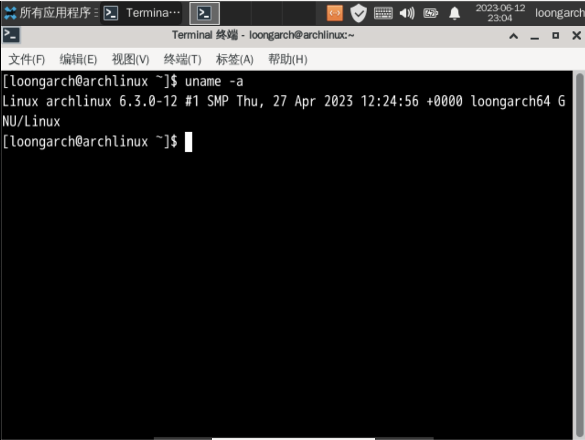

# LoongArch 初尝试

## 背景

最近应龙芯要求把监控程序移植到了 LoongArch 32 Reduced 架构上，趁此机会体验了一下 LoongArch 相关的软件和系统。

<!-- more -->

## 在 QEMU 中运行 LoongArch Arch Linux

主页：https://github.com/loongarchlinux

环境：Debian Bookworm

QEMU 启动流程，参考[官方文档](https://mirrors.wsyu.edu.cn/loongarch/archlinux/images/README.html)：

```shell
wget https://mirrors.wsyu.edu.cn/loongarch/archlinux/images/archlinux-xfce4-2023.05.10-loong64.qcow2.zst
zstd -d archlinux-xfce4-2023.05.10-loong64.qcow2.zst
wget https://mirrors.wsyu.edu.cn/loongarch/archlinux/images/QEMU_EFI_7.2.fd
```

然后就可以启动 QEMU 7.2.2 了：

```shell
qemu-system-loongarch64 \
    -m 4G \
    -cpu la464-loongarch-cpu \
    -machine virt \
    -smp 4 \
    -bios ./QEMU_EFI_7.2.fd \
    -serial stdio \
    -device virtio-gpu-pci \
    -net nic -net user \
    -device nec-usb-xhci,id=xhci,addr=0x1b \
    -device usb-tablet,id=tablet,bus=xhci.0,port=1 \
    -device usb-kbd,id=keyboard,bus=xhci.0,port=2 \
    -hda archlinux-xfce4-2023.05.10-loong64.qcow2
```

启动后，可以正常看到 Xfce4 的界面，用 loongarch:loongarch 登录：



如果不想用 UI，可以先在虚拟机里启动 SSHD，再打开 SSH 转发：

```shell
# in vm
sudo systemctl enable --now sshd
# in host
qemu-system-loongarch64 \
    -m 4G \
    -cpu la464-loongarch-cpu \
    -machine virt \
    -smp 4 \
    -bios ./QEMU_EFI_7.2.fd \
    -nographic \
    -device virtio-net,netdev=net0 \
    -netdev user,id=net0,hostfwd=tcp::4444-:22 \
    -hda archlinux-xfce4-2023.05.10-loong64.qcow2
```

然后就可以通过 SSH 访问 LoongArch 虚拟机了：

```shell
$ ssh loongarch@localhost -p 4444
loongarch@localhost's password:
[loongarch@archlinux ~]$ uname -a
Linux archlinux 6.3.0-12 #1 SMP Thu, 27 Apr 2023 12:24:56 +0000 loongarch64 GNU/Linux
```

## LoongArch 架构

LoongArch 分为三个版本：

1. LoongArch 32 Reduced：精简版本，系统和用户态都是 32 位
2. LoongArch 32：系统和用户态都是 32 位
3. LoongArch 64：系统是 64 位，用户态可以是 32 位，也可以是 64 位

目前上游工具链支持的是 LoongArch 64。

龙芯杯采用的是 LoongArch 32 Reduced 版本，相比 LoongArch 32 的区别有：

1. 删掉了部分算术指令
2. 删掉了位操作指令
3. 删除了边界检查访存指令
4. 删除了 Atomic 原子指令，只保留了 LL+SC
5. 删除了部分浮点运算指令
6. 删除了 IOCSR 访问指令
7. 删除了软件页表遍历指令
8. TLB Refill 异常的相关 CSR（ERA/BADV/PRMD/EHI/ELO0/ELO1/SAVE）不再单独提供一份，而是和其他异常共用
9. 去掉了 STLB，只保留了 MTLB
10. 去掉了部分 CSR
11. 直接映射配置窗口数量砍到了两个
12. 删除了 RAS，PMU，Watchpoint 和硬件调试功能

从用户态来看，主要是差了一些运算指令，需要编译器注意生成的指令范围。内核态上删减的比较多。

## LoongArch 32 Reduced

龙芯提供了一些 LoongArch 32 Reduced 的工具链：

1. GCC + Binutils：[loongarch32r-linux-gnusf-2022-05-20-x86.tar.gz
](https://gitee.com/loongson-edu/la32r-toolchains/releases/download/v0.0.2/loongarch32r-linux-gnusf-2022-05-20-x86.tar.gz)，有源码。
2. GDB：[loongarch32r-linux-gnusf-gdb-x86](https://gitee.com/loongson-edu/la32r-toolchains/releases/download/v0.0.2/loongarch32r-linux-gnusf-gdb-x86)，依赖的动态库较多，建议起一个 CentOS Docker。没有找到源码。
3. QEMU：[qemu-system-loongarch32_centos_x86_64](https://gitee.com/loongson-edu/la32r-QEMU/releases/download/v0.0.1-alpha/qemu-system-loongarch32_centos_x86_64)，依赖的动态库较多，建议克隆下来自己编译：`mkdir build; cd build; ../configure --target-list=loongarch32-softmmu --disable-werror --enable-debug`

在 [la32r-QEMU](https://gitee.com/loongson-edu/la32r-QEMU) 中运行 [la32r-Linux](https://gitee.com/loongson-edu/la32r-Linux/)：

```shell
wget https://gitee.com/loongson-edu/la32r-Linux/releases/download/v0.2/vmlinux
qemu-system-loongarch32 -m 4G -kernel vmlinux -M ls3a5k32 -nographic
loongson32_init: num_nodes 1
loongson32_init: node 0 mem 0x100000000
[    0.000000] Linux version 5.14.0-rc2-g32a8c74db8fc-dirty (mengfanrui@5.5) (loongarch32r-linux-gnusf-gcc (GCC) 8.3.0, GNU ld (GNU Binutils) 2.31.1.20190122) #26 PREEMPT Tue May 31 13:46:54 CST 2022
[    0.000000] Standard 32-bit Loongson Processor probed
[    0.000000] the link is empty!
[    0.000000] Scan bootparam failed
[    0.000000] printk: bootconsole [early0] enabled
[    0.000000] Can't find EFI system table.
[    0.000000] start_pfn=0x0, end_pfn=0x8000, num_physpages:0x8000
[    0.000000] The BIOS Version: (null)
[    0.000000] Initrd not found or empty - disabling initrd
[    0.000000] CPU0 revision is: 00004200 (Loongson-32bit)
[    0.000000] Primary instruction cache 8kB, 2-way, VIPT, linesize 16 bytes.
[    0.000000] Primary data cache 8kB, 2-way, VIPT, no aliases, linesize 16 bytes
[    0.000000] Zone ranges:
[    0.000000]   DMA32    [mem 0x0000000000000000-0x00000000ffffffff]
[    0.000000]   Normal   empty
[    0.000000] Movable zone start for each node
[    0.000000] Early memory node ranges
[    0.000000]   node   0: [mem 0x0000000000000000-0x0000000007ffffff]
[    0.000000] Initmem setup node 0 [mem 0x0000000000000000-0x0000000007ffffff]
[    0.000000] eentry = 0xa0210000,tlbrentry = 0xa0201000
[    0.000000] Built 1 zonelists, mobility grouping on.  Total pages: 32480
[    0.000000] Kernel command line: earlycon
[    0.000000] Dentry cache hash table entries: 16384 (order: 4, 65536 bytes, linear)
[    0.000000] Inode-cache hash table entries: 8192 (order: 3, 32768 bytes, linear)
[    0.000000] mem auto-init: stack:off, heap alloc:off, heap free:off
[    0.000000] Memory: 117732K/131072K available (4926K kernel code, 1114K rwdata, 944K rodata, 2480K init, 473K bss, 13340K reserved, 0K cma-reserved)
[    0.000000] SLUB: HWalign=64, Order=0-3, MinObjects=0, CPUs=1, Nodes=1
[    0.000000] rcu: Preemptible hierarchical RCU implementation.
[    0.000000] rcu:     RCU event tracing is enabled.
[    0.000000]  Trampoline variant of Tasks RCU enabled.
[    0.000000]  Tracing variant of Tasks RCU enabled.
[    0.000000] rcu: RCU calculated value of scheduler-enlistment delay is 25 jiffies.
[    0.000000] NR_IRQS: 320
[    0.000000] ------------[ cut here ]------------
[    0.000000] WARNING: CPU: 0 PID: 0 at kernel/time/clockevents.c:38 cev_delta2ns.isra.15+0x17c/0x1c8
[    0.000000] CPU: 0 PID: 0 Comm: swapper Not tainted 5.14.0-rc2-g32a8c74db8fc-dirty #26
[    0.000000] Stack :
[    0.000000] Call Trace:
[    0.000000]
[    0.000000]
[    0.000000] random: get_random_bytes called from print_oops_end_marker+0x30/0x68 with crng_init=0
[    0.000000] ---[ end trace a8581308883ff14d ]---
[    0.000000] Constant clock event device register
[    0.000000] clocksource: Constant: mask: 0xffffffffffffffff max_cycles: 0xffffffffffffffff, max_idle_ns: 9007199254740991 ns
[    0.000000] Constant clock source device register
[    0.752000] Console: colour dummy device 80x25
[    0.816000] printk: console [tty0] enabled
[    0.856000] printk: bootconsole [early0] disabled
[    0.000000] Linux version 5.14.0-rc2-g32a8c74db8fc-dirty (mengfanrui@5.5) (loongarch32r-linux-gnusf-gcc (GCC) 8.3.0, GNU ld (GNU Binutils) 2.31.1.20190122) #26 PREEMPT Tue May 31 13:46:54 CST 2022
[    0.000000] Standard 32-bit Loongson Processor probed
[    0.000000] the link is empty!
[    0.000000] Scan bootparam failed
[    0.000000] printk: bootconsole [early0] enabled
[    0.000000] Can't find EFI system table.
[    0.000000] start_pfn=0x0, end_pfn=0x8000, num_physpages:0x8000
[    0.000000] The BIOS Version: (null)
[    0.000000] Initrd not found or empty - disabling initrd
[    0.000000] CPU0 revision is: 00004200 (Loongson-32bit)
[    0.000000] Primary instruction cache 8kB, 2-way, VIPT, linesize 16 bytes.
[    0.000000] Primary data cache 8kB, 2-way, VIPT, no aliases, linesize 16 bytes
[    0.000000] Zone ranges:
[    0.000000]   DMA32    [mem 0x0000000000000000-0x00000000ffffffff]
[    0.000000]   Normal   empty
[    0.000000] Movable zone start for each node
[    0.000000] Early memory node ranges
[    0.000000]   node   0: [mem 0x0000000000000000-0x0000000007ffffff]
[    0.000000] Initmem setup node 0 [mem 0x0000000000000000-0x0000000007ffffff]
[    0.000000] eentry = 0xa0210000,tlbrentry = 0xa0201000
[    0.000000] Built 1 zonelists, mobility grouping on.  Total pages: 32480
[    0.000000] Kernel command line: earlycon
[    0.000000] Dentry cache hash table entries: 16384 (order: 4, 65536 bytes, linear)
[    0.000000] Inode-cache hash table entries: 8192 (order: 3, 32768 bytes, linear)
[    0.000000] mem auto-init: stack:off, heap alloc:off, heap free:off
[    0.000000] Memory: 117732K/131072K available (4926K kernel code, 1114K rwdata, 944K rodata, 2480K init, 473K bss, 13340K reserved, 0K cma-reserved)
[    0.000000] SLUB: HWalign=64, Order=0-3, MinObjects=0, CPUs=1, Nodes=1
[    0.000000] rcu: Preemptible hierarchical RCU implementation.
[    0.000000] rcu:     RCU event tracing is enabled.
[    0.000000]  Trampoline variant of Tasks RCU enabled.
[    0.000000]  Tracing variant of Tasks RCU enabled.
[    0.000000] rcu: RCU calculated value of scheduler-enlistment delay is 25 jiffies.
[    0.000000] NR_IRQS: 320
[    0.000000] ------------[ cut here ]------------
[    0.000000] WARNING: CPU: 0 PID: 0 at kernel/time/clockevents.c:38 cev_delta2ns.isra.15+0x17c/0x1c8
[    0.000000] CPU: 0 PID: 0 Comm: swapper Not tainted 5.14.0-rc2-g32a8c74db8fc-dirty #26
[    0.000000] Stack :
[    0.000000] Call Trace:
[    0.000000]
[    0.000000]
[    0.000000] random: get_random_bytes called from print_oops_end_marker+0x30/0x68 with crng_init=0
[    0.000000] ---[ end trace a8581308883ff14d ]---
[    0.000000] Constant clock event device register
[    0.000000] clocksource: Constant: mask: 0xffffffffffffffff max_cycles: 0xffffffffffffffff, max_idle_ns: 9007199254740991 ns
[    0.000000] Constant clock source device register
[    0.752000] Console: colour dummy device 80x25
[    0.816000] printk: console [tty0] enabled
[    0.856000] printk: bootconsole [early0] disabled
[    1.024000] random: fast init done
[    1.240000] Calibrating delay loop... 0.65 BogoMIPS (lpj=1312)
[    1.444000] pid_max: default: 32768 minimum: 301
[    1.860000] Mount-cache hash table entries: 1024 (order: 0, 4096 bytes, linear)
[    1.868000] Mountpoint-cache hash table entries: 1024 (order: 0, 4096 bytes, linear)
[   10.740000] rcu: Hierarchical SRCU implementation.
[   13.408000] devtmpfs: initialized
[   15.948000] clocksource: jiffies: mask: 0xffffffff max_cycles: 0xffffffff, max_idle_ns: 7645041785100000 ns
[   15.980000] futex hash table entries: 256 (order: -1, 3072 bytes, linear)
[   16.948000] NET: Registered PF_NETLINK/PF_ROUTE protocol family
[   28.832000] pps_core: LinuxPPS API ver. 1 registered
[   28.840000] pps_core: Software ver. 5.3.6 - Copyright 2005-2007 Rodolfo Giometti <giometti@linux.it>
[   32.492000] clocksource: Switched to clocksource Constant
[   32.492000] FS-Cache: Loaded
[   32.492000] NET: Registered PF_INET protocol family
[   32.492000] IP idents hash table entries: 2048 (order: 2, 16384 bytes, linear)
[   32.492000] tcp_listen_portaddr_hash hash table entries: 512 (order: 0, 4096 bytes, linear)
[   32.492000] TCP established hash table entries: 1024 (order: 0, 4096 bytes, linear)
[   32.492000] TCP bind hash table entries: 1024 (order: 0, 4096 bytes, linear)
[   32.492000] TCP: Hash tables configured (established 1024 bind 1024)
[   32.492000] UDP hash table entries: 256 (order: 0, 4096 bytes, linear)
[   32.492000] UDP-Lite hash table entries: 256 (order: 0, 4096 bytes, linear)
[   32.492000] NET: Registered PF_UNIX/PF_LOCAL protocol family
[   32.492000] workingset: timestamp_bits=14 max_order=15 bucket_order=1
[   32.492000] IPMI message handler: version 39.2
[   32.492000] ipmi device interface
[   32.492000] ipmi_si: IPMI System Interface driver
[   32.492000] ipmi_si: Unable to find any System Interface(s)
[   32.492000] Serial: 8250/16550 driver, 16 ports, IRQ sharing enabled
[   32.492000] 1fe001e0.serial: ttyS0 at MMIO 0x1fe001e0 (irq = 18, base_baud = 2062500) is a 16550A
[   32.492000] printk: console [ttyS0] enabled
[   32.492000] ls1a-nand driver initializing
[   32.492000] ls1a_nand : mtd struct base address is a102b800
[   32.492000] info->data_buff===================0x81130000
[   32.492000] nand: No NAND device found
[   32.492000] ls1a-nand 1fe78000.nand: failed to scan nand
[   32.492000] ITC MAC 10/100M Fast Ethernet Adapter driver 1.0 init
[   32.492000] libphy: Fixed MDIO Bus: probed
[   32.492000] mousedev: PS/2 mouse device common for all mice
[   32.492000] IR MCE Keyboard/mouse protocol handler initialized
[   32.492000] hid: raw HID events driver (C) Jiri Kosina
[   32.492000] NET: Registered PF_INET6 protocol family
[   32.492000] random: crng init done
[   32.492000] Segment Routing with IPv6
[   32.492000] sit: IPv6, IPv4 and MPLS over IPv4 tunneling driver
[   32.492000] Warning: unable to open an initial console.
[   32.492000] Freeing unused kernel image (initmem) memory: 2480K
[   32.492000] This architecture does not have kernel memory protection.
[   32.492000] Run /init as init process

Processing /etc/profile... Done

/ #
```

我在 la32r-QEMU 的基础上，把 LoongArch 32 Reduced 的支持部分移植到了 QEMU 8.0.0 上：<https://github.com/jiegec/qemu/commits/la32r-8.0.0>。

### 用 crosstool-ng 自己编译一个 LoongArch 32 Reduced 工具链

虽然龙芯给了编译好的交叉编译工具链，但还是想自己用 crosstool-ng 编译一个。完成的 crosstool-ng 配置见 [jiegec/crosstool-ng loongarch32r](https://github.com/jiegec/crosstool-ng/tree/loongarch32r)，这里记录一下折腾的过程。

第一步是设置龙芯提供的源码，然后把 target 设置为 loongarch32r-unknown-linux-gnu：

```ini
CT_ARCH_ARCH="loongarch32r"
CT_ARCH_SUFFIX="r"

# vendor sources
CT_LINUX_SRC_DEVEL=y
CT_LINUX_DEVEL_URL="https://gitee.com/loongson-edu/la32r-Linux.git"
CT_BINUTILS_SRC_DEVEL=y
CT_BINUTILS_DEVEL_URL="https://gitee.com/loongson-edu/la32r_binutils.git"
CT_GLIBC_SRC_DEVEL=y
CT_GLIBC_DEVEL_URL="https://gitee.com/loongson-edu/la32r_glibc-2.28"
CT_GCC_SRC_DEVEL=y
CT_GCC_DEVEL_URL="https://gitee.com/loongson-edu/la32r_gcc-8.3.0.git"

# no gdb available
CT_DEBUG_GDB=n
```

不知道为啥，龙芯没有提供 LoongArch 32 Reduced 的 gdb 源码，开源的 binutils 不包括 gdb 的部分。

```bash
# Compute LoongArch-specific values

CT_DoArchTupleValues() {
    CT_TARGET_ARCH="loongarch${CT_ARCH_BITNESS}${CT_ARCH_SUFFIX}"
}
```

这样配置以后开始编译，会出现下面的错误：

```shell
[ERROR]      ../sysdeps/unix/sysv/linux/loongarch/init-first.c:57: error: visibility attribute not supported in this configuration; ignored [-Werror=attributes]
```

这是因为 crosstool-ng 开启了 `-Werror`，添加以下设置关闭它：

```ini
# disable -Werror
CT_GLIBC_ENABLE_WERROR=n
```

这时候出现了新的错误：

```shell
[ALL  ]      dl-fxstatat64.c:(.text+0x4f5c): undefined reference to `rtld_errno'
[ALL  ]      /home/jiegec/ct-ng/.build/loongarch32r-unknown-linux-gnu/buildtools/lib/gcc/loongarch32r-unknown-linux-gnu/8.3.0/../.
./../../loongarch32r-unknown-linux-gnu/bin/ld: dl-fxstatat64.c:(.text+0x4f60): undefined reference to `rtld_errno'
[ALL  ]      /home/jiegec/ct-ng/.build/loongarch32r-unknown-linux-gnu/buildtools/lib/gcc/loongarch32r-unknown-linux-gnu/8.3.0/../../../../loongarch32r-unknown-linux-gnu/bin/ld: /home/jiegec/ct-ng/.build/loongarch32r-unknown-linux-gnu/build/build-libc/multilib/elf/librtld.os:dl-fxstatat64.c:(.text+0x4f60): more undefined references to `rtld_errno' follow
[ERROR]      collect2: error: ld returned 1 exit status
```

阅读代码，可以发现 `rtld_errno` 定义在 `csu/errno.c` 中：

```c
#if RTLD_PRIVATE_ERRNO

/* Code compiled for rtld refers only to this name.  */
int rtld_errno attribute_hidden;

#endif
```

寻找 `RTLD_PRIVATE_ERRNO` 的定义：

```c
#if IS_IN (rtld)
# define RTLD_PRIVATE_ERRNO 1
#else
# define RTLD_PRIVATE_ERRNO 0
#endif
```

而 `IS_IN (rtld)` 的定义是：

```c
/* Use `#if IS_IN (module)` to detect what component is being compiled.  */
#define PASTE_NAME1(a,b) a##b
#define PASTE_NAME(a,b)  PASTE_NAME1 (a,b)
#define IN_MODULE        PASTE_NAME (MODULE_, MODULE_NAME)
#define IS_IN(lib)       (IN_MODULE == MODULE_##lib)
```

简单来说，`IS_IN (rtld)` 就是判断 `MODULE_NAME == rtld`，而这个是通过编译选项传入的，例如：

```shell
[ALL  ]      loongarch32r-unknown-linux-gnu-gcc  -g -O2 -U_FORTIFY_SOURCE   -march=loongarch32r         errno.c -c -std=gnu11 -fgnu89-inline  -Wall -Wundef -Wwrite-strings -fmerge-all-constants -fno-stack-protector -frounding-math -Wstrict-prototypes -Wold-style-definition -fmath-errno    -fno-stack-protector -DSTACK_PROTECTOR_LEVEL=0   -ftls-model=initial-exec      -I../include -I/home/jiegec/ct-ng/.build/loongarch32r-unknown-linux-gnu/build/build-libc/multilib/csu  -I/home/jiegec/ct-ng/.build/loongarch32r-unknown-linux-gnu/build/build-libc/multilib  -I../sysdeps/unix/sysv/linux/loongarch/ilp32  -I../sysdeps/unix/sysv/linux/loongarch  -I../sysdeps/loongarch/nptl  -I../sysdeps/unix/sysv/linux/generic/wordsize-32  -I../sysdeps/unix/sysv/linux/generic  -I../sysdeps/unix/sysv/linux/include -I../sysdeps/unix/sysv/linux  -I../sysdeps/nptl  -I../sysdeps/pthread  -I../sysdeps/gnu  -I../sysdeps/unix/inet  -I../sysdeps/unix/sysv  -I../sysdeps/unix  -I../sysdeps/posix  -I../sysdeps/loongarch/ilp32  -I../sysdeps/loongarch  -I../sysdeps/init_array  -I../sysdeps/ieee754/ldbl-128  -I../sysdeps/ieee754/dbl-64  -I../sysdeps/ieee754/flt-32  -I../sysdeps/wordsize-32  -I../sysdeps/ieee754  -I../sysdeps/generic  -I.. -I../libio -I. -nostdinc -isystem /home/jiegec/ct-ng/.build/loongarch32r-unknown-linux-gnu/buildtools/lib/gcc/loongarch32r-unknown-linux-gnu/8.3.0/include -isystem /home/jiegec/ct-ng/.build/loongarch32r-unknown-linux-gnu/buildtools/lib/gcc/loongarch32r-unknown-linux-gnu/8.3.0/include-fixed -isystem /home/jiegec/x-tools/loongarch32r-unknown-linux-gnu/loongarch32r-unknown-linux-gnu/sysroot/usr/include -D_LIBC_REENTRANT -include /home/jiegec/ct-ng/.build/loongarch32r-unknown-linux-gnu/build/build-libc/multilib/libc-modules.h -DMODULE_NAME=libc -include ../include/libc-symbols.h       -DTOP_NAMESPACE=glibc -o /home/jiegec/ct-ng/.build/loongarch32r-unknown-linux-gnu/build/build-libc/multilib/csu/errno.o -MD -MP -MF /home/jiegec/ct-ng/.build/loongarch32r-unknown-linux-gnu/build/build-libc/multilib/csu/errno.o.dt -MT /home/jiegec/ct-ng/.build/loongarch32r-unknown-linux-gnu/build/build-libc/multilib/csu/errno.o
```

可以看到，中间是 `-DMODULE_NAME=libc`，而不是 `-DMODULE_NAME=rtld`，所以没有这个符号。

那么接下来要找，什么情况下会编译 `-DMODULE_NAME=rtld` 的 `csu/errno.c`。正好之前有交叉编译到其他 target 的交叉工具链，因此去看了一下，对应 `-DMODULE_NAME=rtld` 的应该是 `csu/rtld-errno.os`，它应该出现在 `rtld-modules` 中：

```shell
[ALL  ]      make subdir=csu -C ../csu ..=../ objdir=/home/jiegec/ct-ng/.build/loongarch32r-unknown-linux-gnu/build/build-libc/multilib -f Makefile -f ../elf/rtld-Rules rtld-all rtld-modules='rtld-check_fds.os rtld-sysdep.os'
```

但实际上并没有，所以继续看 `rtld-modules` 从哪里来，继续翻日志：

```shell
[ALL  ]      LC_ALL=C sed -n 's@^/home/jiegec/ct-ng/.build/loongarch32r-unknown-linux-gnu/build/build-libc/multilib/([^(]*)(([^)]*.os)) *.*$@1 2@p'     /home/jiegec/ct-ng/.build/loongarch32r-unknown-linux-gnu/build/build-libc/multilib/elf/librtld.map | while read lib file; do   case $lib in   libc_pic.a)     LC_ALL=C fgrep -l /$file    /home/jiegec/ct-ng/.build/loongarch32r-unknown-linux-gnu/build/build-libc/multilib/stamp.os /home/jiegec/ct-ng/.build/loongarch32r-unknown-linux-gnu/build/build-libc/multilib/*/stamp.os |     LC_ALL=C     sed 's@^/home/jiegec/ct-ng/.build/loongarch32r-unknown-linux-gnu/build/build-libc/multilib/([^/]*)/stamp.os$@rtld-1'" +=$file@"    ;;   */*.a)     echo rtld-${lib%%/*} += $file ;;   *) echo "Wasn't expecting $lib($file)" >&2; exit 1 ;;   esac; done > /home/jiegec/ct-ng/.build/loongarch32r-unknown-linux-gnu/build/build-libc/multilib/elf/librtld.mkT                  [ALL  ]      echo rtld-subdirs = `LC_ALL=C sed 's/^rtld-([^ ]*).*$/1/' /home/jiegec/ct-ng/.build/loongarch32r-unknown-linux-gnu/bu
ild/build-libc/multilib/elf/librtld.mkT                    | LC_ALL=C sort -u` >> /home/jiegec/ct-ng/.build/loongarch32r-unknown-linux-gnu/build/build-libc/multilib/elf/librtld.mkT 
```

可以看到它是从 `librtld.map` 中解析依赖关系，然后生成 `rtld-modules`。查看 `librtld.map`：

```shell
Archive member included to satisfy reference by file (symbol)

/home/jiegec/ct-ng/.build/loongarch32r-unknown-linux-gnu/build/build-libc/multilib/libc_pic.a(check_fds.os)
                              /home/jiegec/ct-ng/.build/loongarch32r-unknown-linux-gnu/build/build-libc/multilib/elf/dl-allobjs.os (__libc_check_standard_fds)
/home/jiegec/ct-ng/.build/loongarch32r-unknown-linux-gnu/build/build-libc/multilib/libc_pic.a(setjmp.os)
                              /home/jiegec/ct-ng/.build/loongarch32r-unknown-linux-gnu/build/build-libc/multilib/elf/dl-allobjs.os (__sigsetjmp)
```

确实没有出现 errno.os。找一份正常的编译工具链，应该是这样的输出：

```shell
Archive member included to satisfy reference by file (symbol)

/home/jiegec/ct-ng/.build/riscv64-unknown-linux-gnu/build/build-libc/multilib/libc_pic.a(check_fds.os)
                              /home/jiegec/ct-ng/.build/riscv64-unknown-linux-gnu/build/build-libc/multilib/elf/dl-allobjs.os (__libc_check_standard_fds)
/home/jiegec/ct-ng/.build/riscv64-unknown-linux-gnu/build/build-libc/multilib/libc_pic.a(errno.os)
                              /home/jiegec/ct-ng/.build/riscv64-unknown-linux-gnu/build/build-libc/multilib/libc_pic.a(check_fds.os) (__libc_errno)
/home/jiegec/ct-ng/.build/riscv64-unknown-linux-gnu/build/build-libc/multilib/libc_pic.a(setjmp.os)
                              /home/jiegec/ct-ng/.build/riscv64-unknown-linux-gnu/build/build-libc/multilib/elf/dl-allobjs.os (__sigsetjmp)
```

可以看到，这里就有了 `errno.os`，并且符号是 `__libc_errno`。此时去看 `errno.os` 的符号表：

```shell
SYMBOL TABLE:
00000000 g     O .data  00000010 __emutls_v.errno
```

而引用 errno 的其他 object 的符号表：

```shell
SYMBOL TABLE:
00000000         *UND*  00000000 __emutls_v.__libc_errno
```

可以看到差了一个 `__libc_` 前缀。对应的 `errno.c` 源码：

```c
__thread int errno;
extern __thread int __libc_errno __attribute__ ((alias ("errno")))
  attribute_hidden;
```

可以看到，按理说应该是两个符号，后者是一个 alias。但实际生成符号的时候，没有了后者。此时对比一下另一个交叉编译工具链的源码，发现它没有 __emutls_v 的前缀，符号也是正确的，因此在 crosstool-ng 中打开 TLS：

```ini
# target supports tls
# fix glibc undefined rtld_errno
CT_CC_GCC_CONFIG_TLS=y
```

重新编译，这个问题就解决了，要么是龙芯提供的实现有问题，要么就是 alias 和 TLS 冲突，这里没有深究，不确定是什么问题。

遇到的下一个问题是，找不到 `crti.o`：

```shell
[ALL  ]    /home/jiegec/x-tools/loongarch32r-unknown-linux-gnu/loongarch32r-unknown-linux-gnu/bin/ld: cannot find crti.o: No such file or directory
[ERROR]    collect2: error: ld returned 1 exit status                                                                             [E
```

把命令抄下来，添加 --verbose 参数，会发现是因为 LIBRARY_ROOT 缺少 sysroot 下面的 usr/lib 路径，而它期望的路径是 sysrooot 下面的 lib32/sf 路径，所以出现这个问题。解决方法是，打开 MULTILIB 模式：

```ini
# fix gcc crt1.o not found
CT_MULTILIB=y
```

到这里就解决了所有工具链方面的问题了，剩下是一两个 crosstool-ng 的小问题，在命令后面添加 `|| true` 以后绕过了。

## 虚实地址映射

LoongArch 有两种虚实地址映射方法：

1. 直接地址翻译模式（CSR.CRMD.DA=1，CSR.CRMD.PG=0），此时物理地址等于虚拟地址，如果虚拟地址位数更多，则截断高位。
2. 映射地址翻译模式（CSR.CRMD.DA=0，CSR.CRMD.PG=1），此时按照顺序进行下面的翻译：
    1. 直接映射模式：CSR.DMW 定义了四个（LA32R 只有两个）窗口，这些窗口内的虚拟地址与物理地址是平移的关系。
    2. 页表映射模式：如果没有匹配上直接映射模式，则会查询 TLB。虽说是页表映射模式，但依然是 MIPS 传统的 TLB 做法。

相比 MIPS 来讲，LoongArch 的地址映射还是容易理解一些。

从复位中出来的时候，CSR.CRMD.DA=1，CSR.CRMD.PG=0，意味着是直接地址翻译模式。PC 是 0x1C000000，由于是直接地址翻译模式，所以物理地址也是 0x1C000000。

在遇到 TLB Refill 异常的时候，处理器会跳到 CSR.TLBRENTRY 的地址，同时进入直接地址翻译模式（CSR.CRMD.DA=1，CSR.CRMD.PG=0），意味着虚拟地址直接对应物理地址，所以此时需要做好相应的准备。LoongArch 提供了 lddir 和 ldpte 指令来加快页表到 TLB 项目的查询性能，例如下面是 [EDK2 的 TLB Refill 异常处理函数](https://github.com/tianocore/edk2-platforms/blob/4c3e742e931538a1ee6cb3b571b1281e7fba2564/Platform/Loongson/LoongArchQemuPkg/Library/MmuLib/Mmu.S#L37)：

```asm
ASM_PFX(HandleTlbRefill):
  csrwr T0, LOONGARCH_CSR_TLBRSAVE
  csrrd T0, LOONGARCH_CSR_PGD
  lddir T0, T0, 3   #Put pud BaseAddress into T0
  lddir T0, T0, 2   #Put pmd BaseAddress into T0
  lddir T0, T0, 1   #Put pte BaseAddress into T0
  ldpte T0, 0
  ldpte T0, 1
  tlbfill
  csrrd T0, LOONGARCH_CSR_TLBRSAVE
  ertn
```

比较有意思的是，csrwr 指令会把旧的 CSR 值写回到通用寄存器里，所以看起来名字是 write，其实是 swap。为了方便查表，还给用户态和内核态分别一个页表基地址：CSR.PGDL，CSR.PGDH，根据异常的高位判断要选择哪一个页表基地址。

## 内核支持

CPU：

- SMT: [6.5](https://github.com/torvalds/linux/commit/f6f0c9a74a48448583c3cb0f3f067bc3fe0f13c6)
- LSX/LASX: [6.5](https://github.com/torvalds/linux/commit/616500232e632dba8b03981eeccadacf2fbf1c30)
- CRC32 加速：[6.4](https://github.com/torvalds/linux/commit/2f1648220214d18168e55920c21014e71c2d5bbc)

| 功能     | 3A5000                                                                                         | 3A6000                                                                                         |
|----------|------------------------------------------------------------------------------------------------|------------------------------------------------------------------------------------------------|
| SMT      | N/A                                                                                            | [6.5](https://github.com/torvalds/linux/commit/f6f0c9a74a48448583c3cb0f3f067bc3fe0f13c6)       |
| LSX/LASX | [6.5](https://github.com/torvalds/linux/commit/616500232e632dba8b03981eeccadacf2fbf1c30)       | [6.5](https://github.com/torvalds/linux/commit/616500232e632dba8b03981eeccadacf2fbf1c30)       |
| LBT      | [WIP](https://github.com/loongarchlinux/linux/commit/833b4e93b2f9a86522e7ae1f92ba05812cb3a382) | [WIP](https://github.com/loongarchlinux/linux/commit/833b4e93b2f9a86522e7ae1f92ba05812cb3a382) |

桥片：

- RTC(LOON0001): RTC_DRV_LOONGSON [6.5](https://github.com/torvalds/linux/commit/1b733a9ebc3d8011ca66ec6ff17f55a440358794)
- GPIO(LOON0002): GPIO_LOONGSON_64BIT [6.4](https://github.com/torvalds/linux/commit/7944d3b7fe86067509751473aa917fdfd662d92c)
- I2C(LOON0004): I2C_LS2X [6.3](https://github.com/torvalds/linux/commit/015e61f0bffd46600496e50d3b2298f51f6b11a8)
- GMAC(0014:7a03): [5.14](https://github.com/torvalds/linux/commit/30bba69d7db40e732d6c0aa6d4890c60d717e314)
- GNET(0014:7a13): [WIP](https://github.com/loongarchlinux/linux/commit/2a948c4b7bc5cc2689e2d0edfe83b4980b81b9ad)
- EHCI(0014:7a14): ok
- OHCI(0014:7a24): ok
- XHCI(0014:7a34): ok
- GPU1(0014:7a15): ?
- GPU2(0014:7a25): ?
- Display Controller 1(0014:7a06): [WIP](https://github.com/loongarchlinux/linux/commit/80451b416383082c715d60c6689fda71b5159634)
- Display Controller 2(0014:7a36): [WIP](https://github.com/loongarchlinux/linux/commit/80451b416383082c715d60c6689fda71b5159634)
- HD-Audio(0014:7a07): [6.5](https://github.com/torvalds/linux/commit/28bd137a3c8e105587ba8c55b68ef43b519b270f)
- AC97(0014:7a17): ?
- I2S(0014:7a27): ?
- SATA(0014:7a[01]8): ok
- PCIE(0014:7a[0-6]9): ok
- SPI1(0014:7a0b): [WIP](https://github.com/loongarchlinux/linux/commit/be0359f602ec7d5c99c4c65ce1ee6ee0f7d1a7ec)
- SPI2(0014:7a1b): [WIP](https://github.com/loongarchlinux/linux/commit/be0359f602ec7d5c99c4c65ce1ee6ee0f7d1a7ec)
- LPC(0014:7a0c): ?

| 功能                | 7A1000                                                                                         | 7A2000                                                                                         |
|---------------------|------------------------------------------------------------------------------------------------|------------------------------------------------------------------------------------------------|
| RTC(LOON0001)       | [6.5](https://github.com/torvalds/linux/commit/1b733a9ebc3d8011ca66ec6ff17f55a440358794)       | [6.5](https://github.com/torvalds/linux/commit/1b733a9ebc3d8011ca66ec6ff17f55a440358794)       |
| GPIO(LOON0002)      | [6.4](https://github.com/torvalds/linux/commit/7944d3b7fe86067509751473aa917fdfd662d92c)       | [6.4](https://github.com/torvalds/linux/commit/7944d3b7fe86067509751473aa917fdfd662d92c)       |
| I2C(LOON0004)       | [6.3](https://github.com/torvalds/linux/commit/015e61f0bffd46600496e50d3b2298f51f6b11a8)       | [6.3](https://github.com/torvalds/linux/commit/015e61f0bffd46600496e50d3b2298f51f6b11a8)       |
| GMAC(0014:7a03)     | [5.14](https://github.com/torvalds/linux/commit/30bba69d7db40e732d6c0aa6d4890c60d717e314)      | N/A                                                                                            |
| GNET(0014:7a13)     | N/A                                                                                            | [WIP](https://github.com/loongarchlinux/linux/commit/2a948c4b7bc5cc2689e2d0edfe83b4980b81b9ad) |
| EHCI(0014:7a14)     | OK                                                                                             | OK                                                                                             |
| OHCI(0014:7a24)     | OK                                                                                             | OK                                                                                             |
| XHCI(0014:7a34)     | N/A                                                                                            | OK                                                                                             |
| GPU1(0014:7a15)     | ?                                                                                              | N/A                                                                                            |
| GPU2(0014:7a25)     | N/A                                                                                            | ?                                                                                              |
| DC1(0014:7a06)      | [WIP](https://github.com/loongarchlinux/linux/commit/80451b416383082c715d60c6689fda71b5159634) | N/A                                                                                            |
| DC2(0014:7a36)      | N/A                                                                                            | [WIP](https://github.com/loongarchlinux/linux/commit/80451b416383082c715d60c6689fda71b5159634) |
| HDA(0014:7a07)      | [6.5](https://github.com/torvalds/linux/commit/28bd137a3c8e105587ba8c55b68ef43b519b270f)       | [6.5](https://github.com/torvalds/linux/commit/28bd137a3c8e105587ba8c55b68ef43b519b270f)       |
| AC97(0014:7a17)     | ?                                                                                              | N/A                                                                                            |
| I2S(0014:7a27)      | N/A                                                                                            | ?                                                                                              |
| SATA(0014:7a[01]8)  | OK                                                                                             | OK                                                                                             |
| PCIE(0014:7a[0-6]9) | OK                                                                                             | OK                                                                                             |
| SPI1(0014:7a0b)     | [WIP](https://github.com/loongarchlinux/linux/commit/be0359f602ec7d5c99c4c65ce1ee6ee0f7d1a7ec) | N/A                                                                                            |
| SPI2(0014:7a1b)     | N/A                                                                                            | [WIP](https://github.com/loongarchlinux/linux/commit/be0359f602ec7d5c99c4c65ce1ee6ee0f7d1a7ec) |
| LPC(0014:7a0c)      | ?                                                                                              | ?                                                                                              |

PCIe device id:

- CONF: 7a10, `linux/drivers/pci/controller/pci-loongson.c`
- APB: 7a02, `linux/drivers/pci/controller/pci-loongson.c`
- GMAC: 7a03, `linux/drivers/pci/controller/pci-loongson.c`
- GNET: 7a13, `linux/drivers/pci/controller/pci-loongson.c`
- DWC2: 7a04, `linux/drivers/usb/dwc2/params.c`
- EHCI: 7a14
- OHCI: 7a24
- XHCI: 7a34
- GPU1: 7a15
- GPU2: 7a25
- DC1: 7a06, `linux/arch/loongarch/pci/pci.c`, `linux/drivers/pci/controller/pci-loongson.c`
- DC2: 7a36, `linux/arch/loongarch/pci/pci.c`, `linux/drivers/pci/controller/pci-loongson.c`
- HDA: 7a07, `linux/include/linux/pci_ids.h`
- AC97: 7a17
- I2S: 7a27, `linux/sound/soc/loongson/loongson_i2s_pci.c`
- HDMI: 7a37, `linux/include/linux/pci_ids.h`, `linux/drivers/pci/controller/pci-loongson.c`
- AHCI: 7a[01]8, `linux/drivers/pci/controller/pci-loongson.c`
- SPI: 7a[01]b, `linux/drivers/spi/spi-loongson-pci.c`
- LPC: 7a0c, `linux/drivers/pci/controller/pci-loongson.c`
- RIO: 7a1d
- DMA: 7a0f
- IOMMU: 7a1f

## LSX/LASX 相关进展

- GCC：WIP [Add Loongson SX/ASX instruction support to LoongArch target.](https://patchwork.ozlabs.org/project/gcc/list/?series=370124&state=%2A&archive=both)
- LLVM:
    - 18 [[LoongArch] Add LASX intrinsic support](https://github.com/llvm/llvm-project/commit/691f0d00b84f6ecaf8e341ef38256e939cca6b1e)
    - 18 [[LoongArch] Add LSX intrinsic support](https://github.com/llvm/llvm-project/commit/53141b2fcfa20616970833e6513537d211116c05)
    - 17 [[LoongArch] Support InlineAsm for LSX and LASX](https://github.com/llvm/llvm-project/commit/d25c79dc70008b835312e5cc7ef48b199fda3165)
    - 17 [[LoongArch] Add definition for LASX instructions](https://github.com/llvm/llvm-project/commit/f3d18b9dc6f73755b58df5f06fcae992322aeaed)
    - 17 [[LoongArch] Add definition for LSX instructions](https://github.com/llvm/llvm-project/commit/1aa3b64ed2781f064a40b0f9bd196a1265f50b3c)
- Binutils:
    - 2.41 [LoongArch: Add LSX and LASX instructions support](https://sourceware.org/pipermail/binutils/2023-June/127990.html)
- Glibc:
    - 2.39 [String acceleration](https://sourceware.org/pipermail/libc-alpha/2023-August/150671.html)
- Linux:
    - 6.5 [LoongArch: Add vector extensions support](https://github.com/torvalds/linux/commit/616500232e632dba8b03981eeccadacf2fbf1c30)
    - 6.6 [LoongArch: Add SIMD-optimized XOR routines](https://lore.kernel.org/linux-raid/20230801081335.523097-1-kernel@xen0n.name/)
- OpenBLAS:
    - 0.3.24 [LoongArch64: Add sgemm_kernel](https://github.com/xianyi/OpenBLAS/pull/4200)
    - 0.3.24 [LoongArch64: Update dgemm kernel](https://github.com/xianyi/OpenBLAS/pull/4158)
    - 0.3.24 [LoongArch64: Add dgemv_t_8_lasx.S and dgemv_n_8_lasx.S](https://github.com/xianyi/OpenBLAS/pull/4153)
    - 0.3.20 [loongarch64: Optimize dgemm_kernel](https://github.com/xianyi/OpenBLAS/pull/3491)
- OpenJPEG:
    - WIP [Add loongarch 256-bit LASX SIMD optimization](https://github.com/uclouvain/openjpeg/pull/1458)
- x264:
    - WIP [loongarch: support LoongArch LSX and LASX optimization](https://code.videolan.org/videolan/x264/-/merge_requests/124)
- OpenH264:
    - [add simd optimizations and fix for loongarch](https://github.com/cisco/openh264/pull/3649)
    - [Add LoongArch SIMD.](https://github.com/cisco/openh264/pull/3587)
- OpenSSL:
    - 3.1.0 [Add vpaes-loongarch64.pl module.](https://github.com/openssl/openssl/commit/ef917549f5867d269d359155ff67b8ccb5e66a76)
- PCRE2:
    - WIP [jit: Add LoongArch SX 128 bit SIMD Support.](https://github.com/PCRE2Project/pcre2/pull/290)
- libjpeg-turbo:
    - WIP [LoongArch64 LSX and LASX SIMD implementation.](https://github.com/libjpeg-turbo/libjpeg-turbo/pull/689)

## 未来产品

来源：http://roadshow.sseinfo.com/roadshowIndex.do?id=14977

- 3B7000 是 8 个大核，是对 3B6000 的工艺升级。
- 3C6000 预计还有 2-3 个月设计完成，2023 年流片。
- 3B6000 预计 2024 H2 流片，3B6000 处理器核准备在 3A6000 的 LA664 基础上再优化一轮，8 核，内存接口准备升级到 DDR5。3B6000 是 8 核 16 线程。
- 2K3000 预计 2024 H1 流片，集成 8 个 LA364 处理器核，内置自研 GPGPU，是单片 SOC 解决方案。
- 3A6000 处理器四季度开发布会，整机企业同步发布整机产品。
- 2P0500 打印机芯片已经研制成功，该芯片及打印机产品将在今年四季度与 3A6000 同步发布。
- 改进型 7A2000 与原 7A2000 兼容，预计比 3A6000 晚 3-6 月上市。
- 独立显卡 2025 年上市，支持通用计算和 AI 计算的加速功能。
- 新 ABI（新世界）内核的 Loongnix 的操作系统随开源 Debian 一起上线，最近花了很多功夫实现老 ABI（老世界）系统的应用在新 ABI 系统上兼容。
