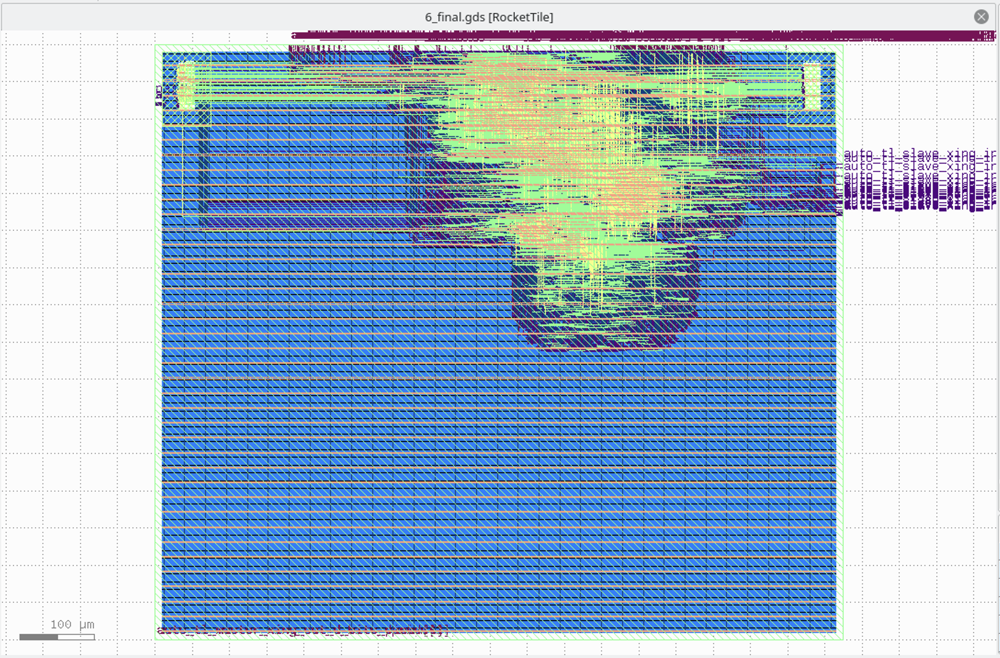

# OpenROAD Flow 初尝试

## 背景

最近在尝试接触一些芯片前后端的知识。正好有现成的开源工具链 OpenROAD 来做这个事情，借此机会来学习一下整个流程。

## 尝试过程

首先 clone 仓库 OpenROAD-flow-scripts，然后运行：`./build_openroad.sh`，脚本会克隆一些仓库，自动进行编译。

编译中会找不到一些库，比如可能需要安装这些依赖：`liblemon-dev libeigen3-dev libreadline-dev swig`，此外运行的时候还需要 `klayout` 依赖。

如果遇到解决 cmake 找不到 LEMON 的问题，这是一个 [BUG](https://lemon.cs.elte.hu/trac/lemon/ticket/628)，可以运行下面的命令解决：

```shell
cd /usr/lib/x86_64-linux-gnu/cmake/lemon
cp lemonConfig.cmake LEMONConfig.cmake
```

编译后整个目录大概有 4.8G，输出的二进制目录是 133M。

如果要跑一下样例里的 nangate45 工艺的 gcd 例子，运行：

```
cd flow
make DESIGN_CONFIG=./designs/nangate45/gcd/config.mk
```

## 分析 GCD 测例

这个测例的代码提供了这样一个接口：

```verilog
module gcd
(
  input  wire clk,
  input  wire [  31:0] req_msg,
  output wire req_rdy,
  input  wire req_val,
  input  wire reset,
  output wire [  15:0] resp_msg,
  input  wire resp_rdy,
  output wire resp_val
);
endmodule
```

从名字可以推断出，外部通过 req 发送请求到 GCD 模块，然后模块计算出 GCD 后再返回结果。

根据日志可以看到，从 verilog 到最终的 gds 文件，经过了这些步骤：

1. 第一步用 yosys 综合（1_1_yosys），把 verilog 代码转化为网表，网表中的单元就是形如 `NAND2_X1` `DFF_X1` 等这样由工艺库定义的一些单元。
2. 第二步进行 floorplan（2_1_floorplan），规划出芯片的大小，逻辑放在哪个位置，输入输出引脚放在什么位置（2_2_floorplan_io），还要考虑 SRAM 等宏或者 IP（2_4_mplace），电源网络 PDN（2_6_floorplan_pdn）
3. 第三步是 Placement，就是把前面得到的一些 cell 放到芯片上的 (x,y) 坐标上
4. 第四步是 Clock Tree Synthesis（4_1_cts），简称 CTS，生成时钟树
5. 第五步是进行路由连线，OpenROAD 有两个路由：FastRoute（5_1_fastroute）和 TritonRoute（5_2_TritonRoute）
6. 第六步输出结果到 gds 文件（6_1_merge）。

这些步骤可以在仓库的 `flow/Makefile` 里面看得比较清晰，英文版摘抄如下：

1. SYNTHESIS
    1. Run Synthesis using yosys
2. FLOORPLAN
    1. Translate verilog to def
    2. IO Placement (random)
    3. Timing Driven Mixed Size Placement (tdms)
    4. Macro Placement
    5. Tapcell and Welltie insertion
    6. PDN generation
3. PLACE
    1. Global placement without placed IOs, timing-driven, and routability-driven
    2. IO placement (non-random)
    3. Global placement with placed IOs, timing-driven, and routability-driven
    4. Resizing & Buffering
    5. Detail placement
4. CTS(Clock Tree Synthesis)
    1. Run TritonCTS
    2. Filler cell insertion
5. ROUTING
    1. Run global route (FastRoute)
    2. Run detailed route (TritonRoute)

最后生成的 gds，用 KLayout 打开，可以看到这个样子：


日志里可以看到，预测的总功耗是 1.71 mW，面积占用是 703 um^2。

还跑了一下其他样例设计的 gds，比如 ibex：


日志里可以看到，预测的总功耗是 10.1 mW，面积占用是 32176 um^2。

还有 tiny rocket：



日志里可以看到，预测的总功耗是 36.8 mW，面积占用是 52786 um^2。

## 工艺库常见术语

- slvt/lvt/rvt/hvt: super-low/low/regular/high V threshold 前者速度快：阈值电压低，同时漏电流大
- ss/tt/ff: slow-slow/typical-typical/fast-fast 后者速度快：电压高，温度低，比如 SS（0.99V 125C）TT（1.10V 25C）FF（1.21V -40C）；有时候还会看到 ssg，可以理解为 ss 的比较精确的版本，因此没有那么悲观，延迟比 SS 低一些，详见 [STA | ssg 跟 ss corner 的区别——谬误更正版](https://cloud.tencent.com/developer/article/1598417)
- c + 数字：表示的是 channel length，c40 表示 40nm，数字越大速度越慢，能耗越低
- 数字+track：表示的是 track height，sc12 表示 12-track，数字越大速度越快

ARM 的文档 [Choosing the physical IP libraries](https://developer.arm.com/documentation/102738/0100/Choosing-the-physical-IP-libraries) 描述了 Channel length, Track height, Voltage threshold 等不同的选择。

综合来说，如果要更低的延迟，选择低 vt，小 c 和大 track，反之如果要更低的能耗，选择高 vt，大 c 和 小 track。

## CCS v.s. NLDM

由于物理的特性比较复杂，工艺库里描述的也只是一个大致的模型，刻画了这些 cell 的特性，那么自然可以选取不同的模型。NLDM（上面举的例子就是 NLDM），CCS 就是常见的两个模型，相比之下，CCS 更精确，同时参数更多。更精确的还有直接用 SPICE 描述的电路。详细的对比可以看下面的参考文档。

## 参考文档

- [GETTING STARTED WITH OPENROAD APP – PART 1](https://theopenroadproject.org/2019/12/11/getting-started-with-openroad-app-part-1/)
- [Advanced ASIC Chip Synthesis Using Synopsys® Design Compiler™ Physical Compiler™ and PrimeTime®](https://link.springer.com/book/10.1007/b117024)
- [Comparing NLDM And CCS delay models](https://www.paripath.com/blog/characterization-blog/comparing-nldm-and-ccs-delay-models)
- [Introduction to Liberty : CCS, ECSM and NDLM](https://chitlesh.ch/wordpress/liberty-ccs-ecsm-or-ndlm/)
- [STA 概念：一文了解 NLDM 与 CCS](https://blog.csdn.net/graymount/article/details/106010388)