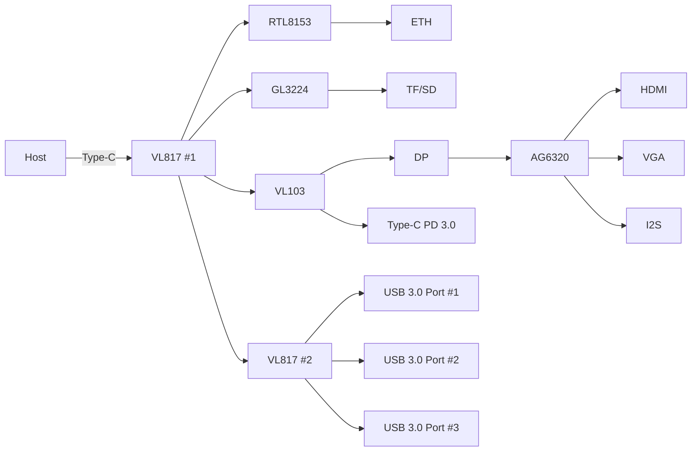
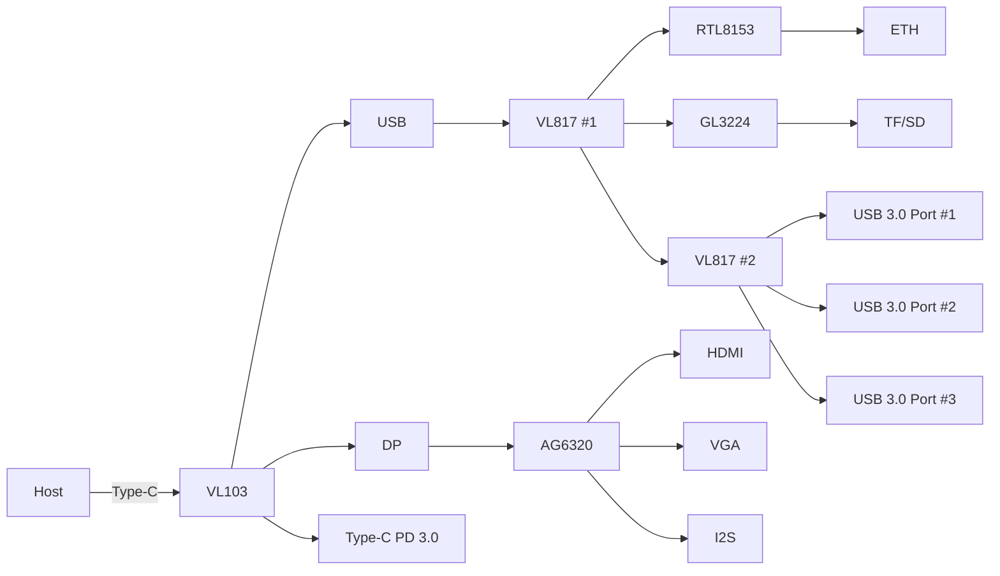
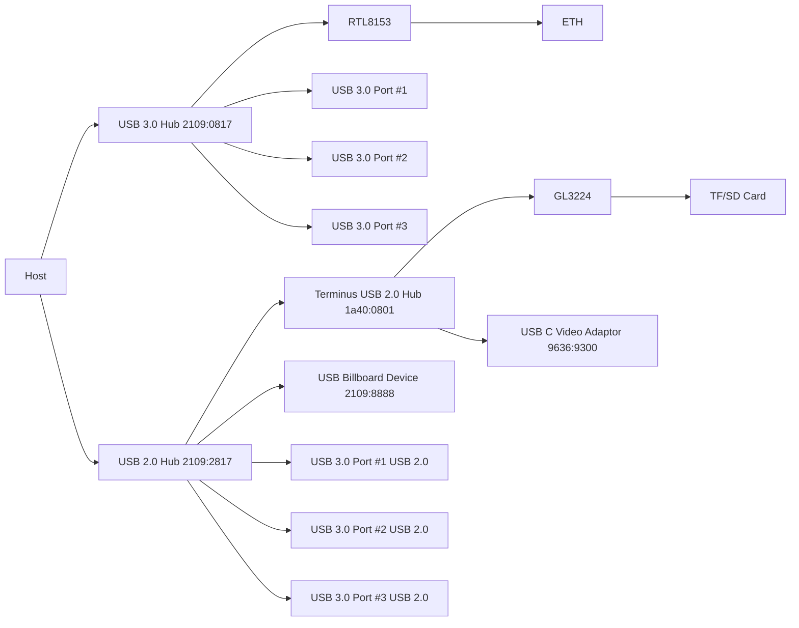
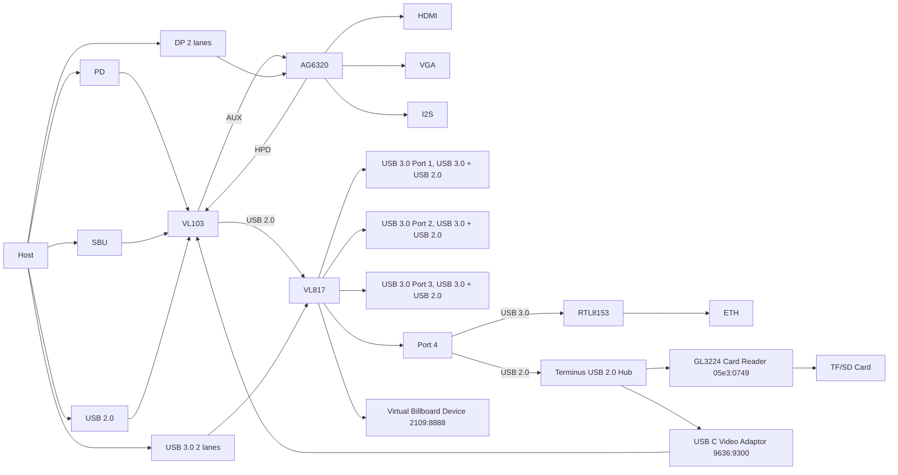
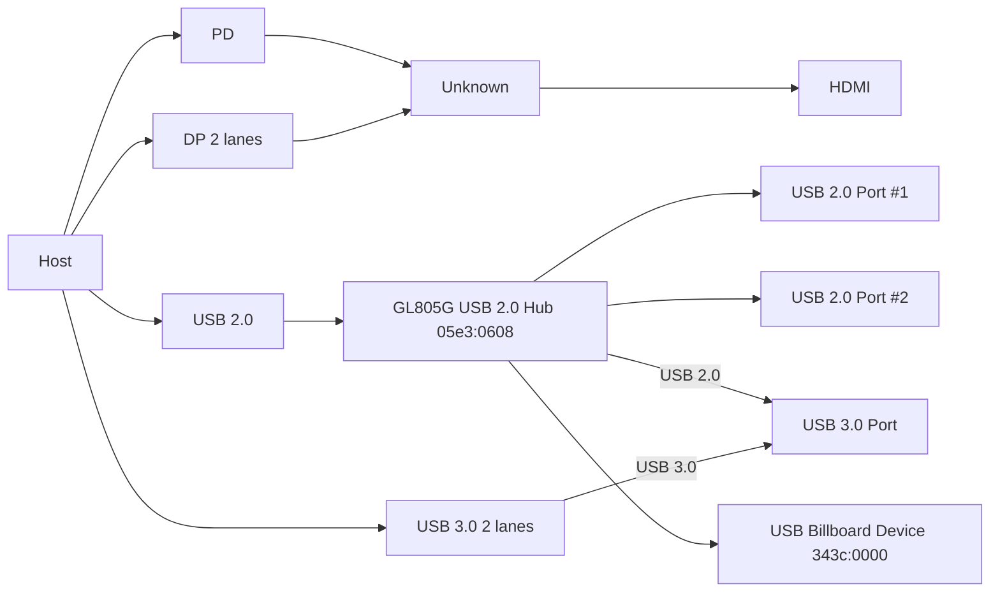

# 探究一个 USB Type-C 拓展坞的硬件实现

## 背景

最近在高强度使用 HDMI 和 DP 做视频输出，但在使用的时候遇到了各种细节问题，所以就研究整个链路上到底发生了哪些事情，在这个过程中，研究了一下手上的 Biaze KZ11 这款 Type-C 拓展坞，看看它内部有哪些芯片，又是怎样实现拓展坞的功能的。

<!-- more -->

## 拓展坞基本信息

首先介绍一下这款拓展坞的基本信息，从购买页面可以看到：

- 接口上，有三个 USB 3.0（5 Gbps），一个 TF/SD 读卡槽，一个 HDMI，一个 VGA，一个 3.5mm TRS 音频输出，一个千兆以太网口，还有一个 Type-C PD 供电
- 采用了 RTL8153、GL3224、VL103、VL817、AG6320 芯片
- HDMI 最高支持 4K 30Hz，VGA 最高支持 1080P 60Hz

当然，本博客并不是购物推荐，只是因为恰好手上有这么一个拓展坞，并且把它用的芯片给了出来，所以才方便了我做分析。

## 初步分析

既然给出了芯片型号，我就去调查了一下，这些芯片都是做什么的：

- [RTL8153](https://www.olimex.com/Products/USB-Modules/Ethernet/USB-GIGABIT/resources/rtl8153.pdf)：USB 3.0 的千兆以太网控制器
- [GL3224](https://datasheet.lcsc.com/datasheet/pdf/5c4f88684f5251afc47f0c71b7afbb47.pdf?productCode=C157357)：USB 3.2 Gen 1 的读卡器，用于 TF/SD 卡读取
- [VL103](http://www.usbtech.net/upload/portal/20210128/5fd1d287e44435e7296e05398fa0210c.pdf)：Type-C DP Alt-Mode 和 PD 3.0 控制器
- [VL817](https://datasheet.lcsc.com/datasheet/pdf/2c50386e71e0024e256f1a4e608872ad.pdf?productCode=C29780427)：USB 3.1 Gen 1 (5Gbps) 的 Hub，最多接四个下游设备
- [AG6320](https://img.jdzj.com/UserDocument/mallpic/QQ1659747718/dn/zl8535.pdf)：把 DP 转化为 HDMI 或者 VGA 信号，同时音频通过 I2S 接口输出，DP 运行在 5.40 Gbps HBR2 速率下，两个 lane 带宽一共是 10.80 Gbps，考虑编码损失还有 `10.80*8/10=8.64` Gbps，所以最高 4K 30Hz 4:4:4 8bpc，它需要的带宽是 `3840*2160*30*24=5.97` Gbps，算上消隐区就是 `4400*2250*30*24=7.13` Gbps

于是我就想，既然 Type-C 拓展坞连电脑只有一个 Type-C，这个 Type-C 只能连一个设备，而下游有这么多设备：RTL8153，GL3224、VL103，都需要接到 USB 总线上，需要 VL817 来拓展，此外还有三个额外的 USB 口，那就至少有六个设备了，一个 VL817 不够，那就得级联一下：

这里我觉得，既然 AG6320 输入是 DP，然后 VL103 是 DP Alt-mode 芯片，那就应该 AG6320 的输入来自于 VL103，就画出了上面的拓扑。看起来很合理，但实际上有问题：

- VL817 是数据的 Hub，它能支持 PD 3.0 的高功率吗？
- VL817 #2 只有三个下游设备，理论上可以再来一个 USB 3.0 Port，为啥只用了三个？

所以这个拓扑肯定不对，PD 芯片应该是直接接到电脑侧的，其他都是传数据的芯片，不需要也不应该接那么高功率的电源。这就给出了第二版拓扑：

但这依然很奇怪：VL817 #1 和 VL817 #2 各有一个 Port 是空的，这不是浪费了吗？说明这个拓扑依然不对。

## USB 拓扑分析

上面都是从芯片的功能来硬推，推不出来合理的拓扑，那就说明我对芯片的功能的理解还是有所欠缺。那就从电脑这边来看，USB 总线上是个什么拓扑：

首先，我能看到有一个 USB 3.0 的 Hub（2109:0817），下面出现的设备是：

- RTL8153 网卡
- USB 3.0 端口 #1
- USB 3.0 端口 #2
- USB 3.0 端口 #3

这意味着，RTL8153 网卡是和三个 USB 3.0 端口挂在同一个 Hub 下的，猜测就是 VL817。此外，还有一个 USB 2.0 的 Hub（2109:2817），下面出现的设备是：

- 另一个 USB 2.0 的 Hub（Terminus，1a40:0801，推测是 [FE8.1 芯片](https://www.terminus.com.tw/en/product/series_one/fe_8_1.html)）
- USB Billboard Device（2109:8888）
- USB 3.0 端口 #1 的 USB 2.0
- USB 3.0 端口 #2 的 USB 2.0
- USB 3.0 端口 #3 的 USB 2.0

这个 Terminus 的 USB 2.0 Hub 下面，又挂载了两个设备：

- GL3224 读卡器
- USB C Video Adaptor（9636:9300），另一个 USB Billboard Device

把这个 USB 总线拓扑画出来，就是：

这个信息量很大，推翻了很多之前的分析：VL817 下游就是三个 USB 3.0，外加一个 RTL8153。然后 GL3224 是通过一个额外的 Terminus USB 2.0 Hub 接进来的，即使 GL3224 本身是一个 USB 3.2 Gen 1 的读卡器。同时为啥这个 USB 2.0 Hub 下面出现了五个设备？这个 USB Billboard Device 和 USB C Video Adaptor 又是哪来的？为啥要多加一个 Terminus USB 2.0 Hub？

## 推倒重来

这说明一开始认为的“Type-C 只能连到一个芯片上，再分到不同的芯片”的假设是错误的。实际上，Type-C 是可以同时连到多个芯片上的：

- USB 2.0 的 D+/D-，用于 USB 2.0 总线
- USB 3.0 的四个差分对，可以两个差分对用于 USB 3.0 总线，另外两个差分对用于 DP
- SBU 信号用于 DP 的 AUX
- 电源和 CC，用于 USB PD

也就是说，实际上，Host 通过一个 Type-C 端口，同时接到了 VL103、VL817 和 AG6320 上！也就是说，AG6320 并不是接到 VL103，而是直接从 Type-C 取走了两个差分对，来做 DP 输入，只是 SBU(AUX) 信号是先进入 VL103，再接到 AG6320，此外为了实现热插拔，AG6320 给出了 HPD 信号给 VL103；VL103 也不负责 USB 3.0，它只是负责电源、CC 协商和 DP Alt-mode，同时还透传了 USB 2.0；VL817 虽然是 USB 3.0 Hub，但它其实就是一个 USB 3.0 Hub 和一个 USB 2.0 Hub，输出是四个 USB 3.0 和四个 USB 2.0。这已经基本解释了大部分问题，还差最后一点：

VL817 只有四个端口，那么，它 USB 3.0 Hub 下四个设备、USB 2.0 Hub 下五个设备都是怎么来的呢？

注意到外接的 USB 3.0 端口，它也是 3.0 和 2.0 兼具的，而且得是同一个 Port，所以 VL817 前三个 Port 就是 USB 3.0 和 2.0 同时连到外接 USB 端口上。那只剩下一个 Port 了，这个 Port 上又需要接 RTL8153，又需要接 Terminus USB 2.0 Hub，此外还有一个 USB 2.0 的 Billboard 2109:8888 设备，这哪接的下来？

答案是：最后一个 Port，把 3.0 部分和 2.0 部分分开：3.0 接 RTL8153，2.0 接 Terminus USB 2.0 Hub。实际上，从 USB 总线枚举上来看，这两个设备对应的 Port ID 是一样的。而那个 2109:8888 Billboard 设备，只是 VL817 自己虚拟出来的设备，并没有实体。

至于 USB C Video Adaptor 9636:9300 是怎么来的，其实就是 DP Alt-mode 的要求：VL103 同时也是一个 USB 2.0 Device，这个 Device 就是这个 USB C Video Adaptor，给 Host 汇报 Alt-mode 的一些信息。因为有这个 USB C Video Adaptor 和 GL3224 都需要接到 VL817 最后一个 USB 2.0 端口上，放不下，才又引入了一个 Terminus USB 2.0 Hub。

至此，完整的硬件拓扑就比较清楚了：

这样，VL817 的四个端口，无论是 USB 3.0 还是 USB 2.0，都物尽其用了，刚好把三个 USB 3.0 端口都用满了。多出来的 Terminus USB 2.0 Hub 的用途也解释清楚了。

## 附录：分析绿联 CM478-15495

顺带也分析了一下 [绿联 CM478-15495](https://www.lulian.cn/product/1432.html) 拓展坞的配置，它的参数如下：

- 接口上，支持 USB3.0+USB2.0*2+PD+HDMI
- HDMI: 4K 30Hz, 1080P 120Hz
- PD 3.0 100W

分析了一下 USB 拓扑，发现它的 USB 3.0 设备是直接通到电脑上的，没有经过 Hub；而它有一个 Genesys Logic 05e3:0608 的 4 口 USB 2.0 Hub（根据网上信息，猜测是 [GL850G](https://www.mouser.com/datasheet/2/306/Olimex_GL850G-3198672.pdf)），下面连了四个设备：

- DP Alt-mode 的 Billboard Device 343c:0000
- USB 2.0 端口 #1
- USB 2.0 端口 #2
- USB 3.0 端口的 USB 2.0

那么 DP 则又是直接从 Type-C 拿走了两个差分对，然后 USB 3.0 端口是接了另外两个差分对。可见这又是一个物尽其用的例子。推测 CM478-15495 一种可能的拓扑：

实际上，因为 CM478-15495 的 USB 3.0 端口是直接接到了电脑上，没有像 KZ11 那样过了一个 USB 3.1 Gen 1 的 VL817 Hub，实际速率可以达到 10 Gbps，也就是 USB 3.1 Gen 2。同一个设备，插到 KZ11 的 USB 3.0 口上，就只有 5 Gbps 的速率了。

## 附录：分析飞利浦 SWR1607L/93

参数：

- 3xUSB 3.0 5Gbps，其中两个是 Type-C，一个是 Type-A
- USB PD 100W
- HDMI 4K60Hz

在系统里看到的是两个 Hub：

- USB 3.1 Hub 05e3:0626 5Gbps
- USB 2.1 Hub 05e3:0610 480Mbps

目测又是 Genesys Logic 的 4 口 Hub，根据网上信息，猜测是 [GL3523](https://file.elecfans.com/web2/M00/70/41/poYBAGNKskWAA6yCABIBqv_sYz0403.pdf)，四口 USB 3.1 Gen 1 的 Hub。

考虑到它只有 5Gbps，那么应该又是 Type-C 的两个 lane 通过 4 口 Hub 接出了三个 USB 3.0，剩下一个本来怀疑是留给 DP Alt-mode 的 Billboard Device，但实际上无论是否插 HDMI，都没有这个设备出现。Hub 的 Port 4 对应 USB 3.0 Type-C 口，Port 3 对应 Type-C 旁边的 USB 3.0 Type-A 口，Port 2 则是最后一个离 Type-C 口最远的 USB 3.0 Type-C 口。

另外两个 lane 则是给了 DP Alt-mode，这里的 HDMI 能跑到 4K 60Hz 4:4:4 8bpc，说明它的 DP 跑在了更高的速率：在 macOS 里看，它的 DP 运行在 8.10 Gbps (HBR3) 速率上，这样两个 lane 的总带宽就是 16.20 Gbps，考虑编码损失还有 `16.2*8/10=12.96` Gbps，足够 4K 60Hz 4:4:4 的 `3840*2160*60*24=11.94` Gbps 带宽，算上消隐区（需要消隐区比较少的时序），也就是 `4000*2205*60*24=12.70` Gbps。

有意思的是，如果我直接用 Type-C 连显示器，那么它就可以用四个 lane 传 5.40 Gbps (HBR2) 速率，这样总速率达到了 21.60 Gbps，考虑编码损失还有 `21.60*8/10=17.28` Gbps，甚至可以 4K 75 Hz 4:4:4 8bpc，毕竟它只需要 `3840*2160*75*24=14.9` Gbps 带宽，算上消隐区，也就是 `4000*2205*75*24=15.88` Gbps。

也做了一个小实验，如果把显示器通过 Type-C 接到飞利浦 SWR1607L/93 的 USB 3.0 Type-C 口上，显示输出就不工作了，因为这个口过了一个 Hub，这个 Hub 不支持 DP Alt-mode。

## 附录：其他常用拓展坞芯片

- [AX88179](https://static.chipdip.ru/lib/923/DOC000923116.pdf): USB 3.0 to 1000M Ethernet Controller
- [VL822](http://www.usbtech.net/upload/portal/20210129/273a4e5ddf8b65a319765aa6eb529a1d.pdf): USB 3.1 Gen 2 10Gbps 4-Port Hub Controller
- [SW2505](https://www.tctek.cn/wp-content/uploads/2025/10/SW2505_Brief_V0.2-%E8%A7%84%E6%A0%BC%E4%B9%A6_compressed.pdf): USB PD Controller
