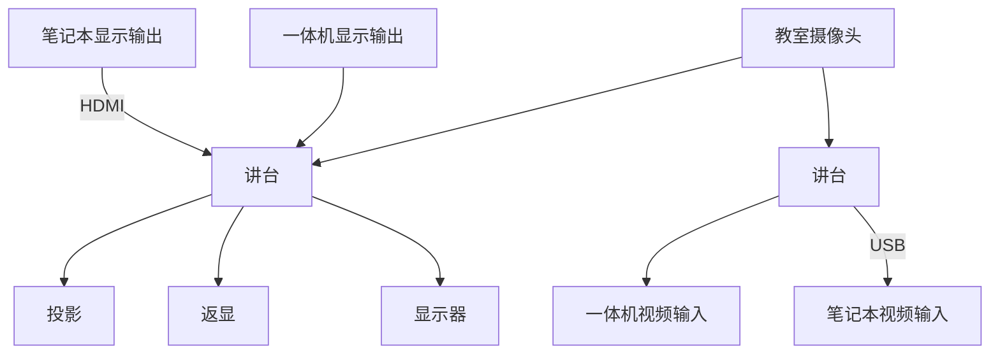
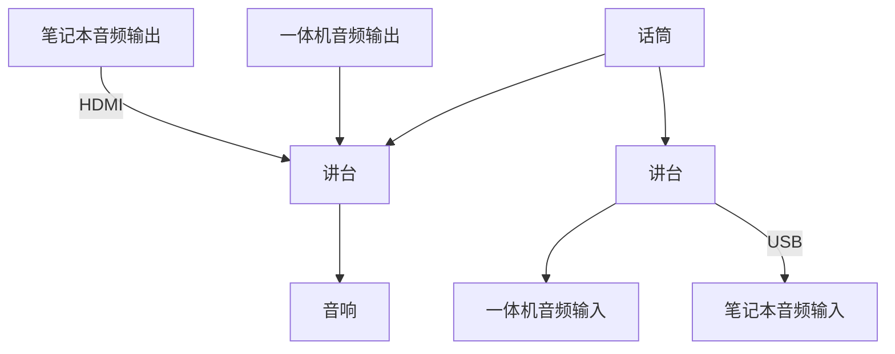
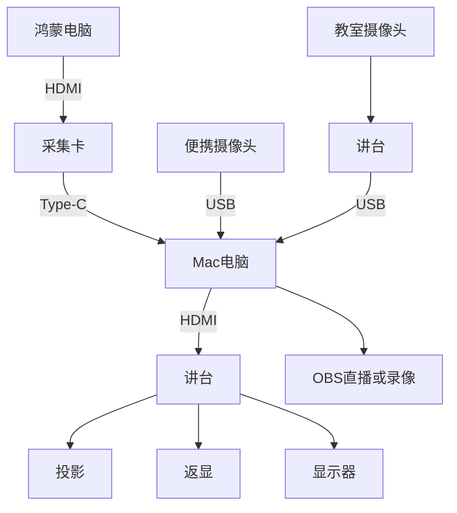
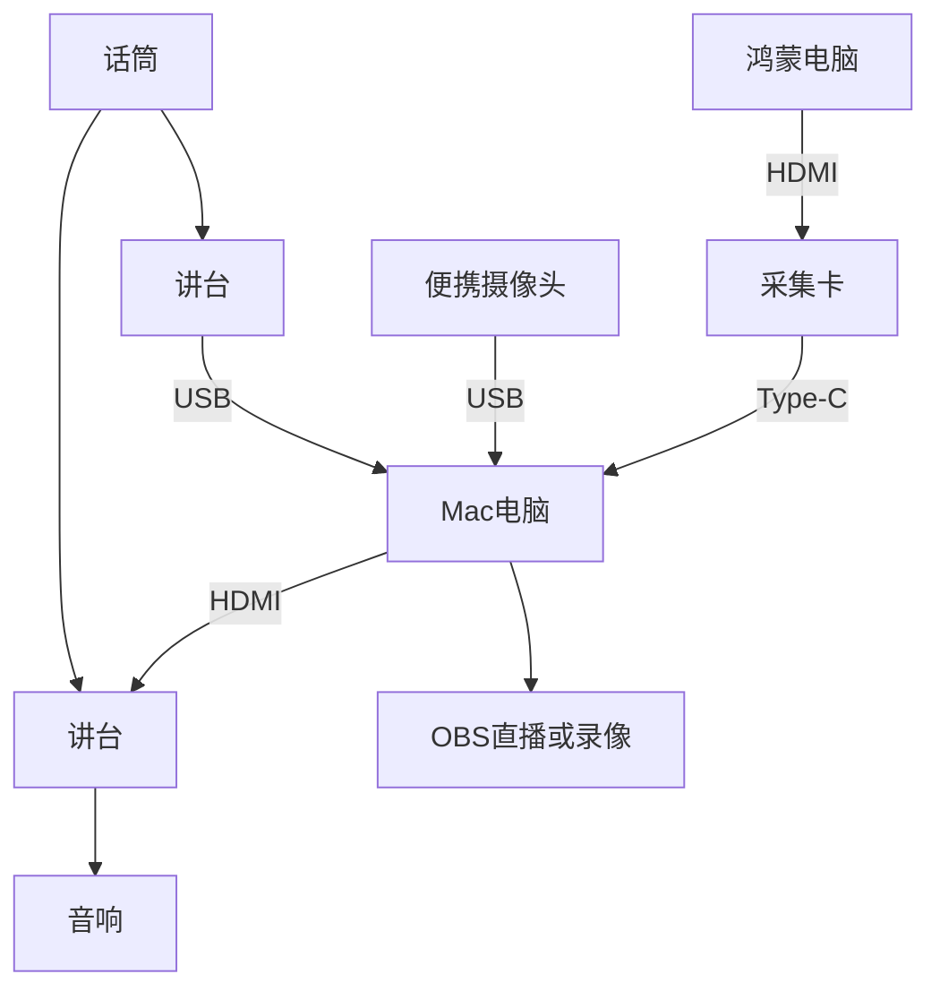
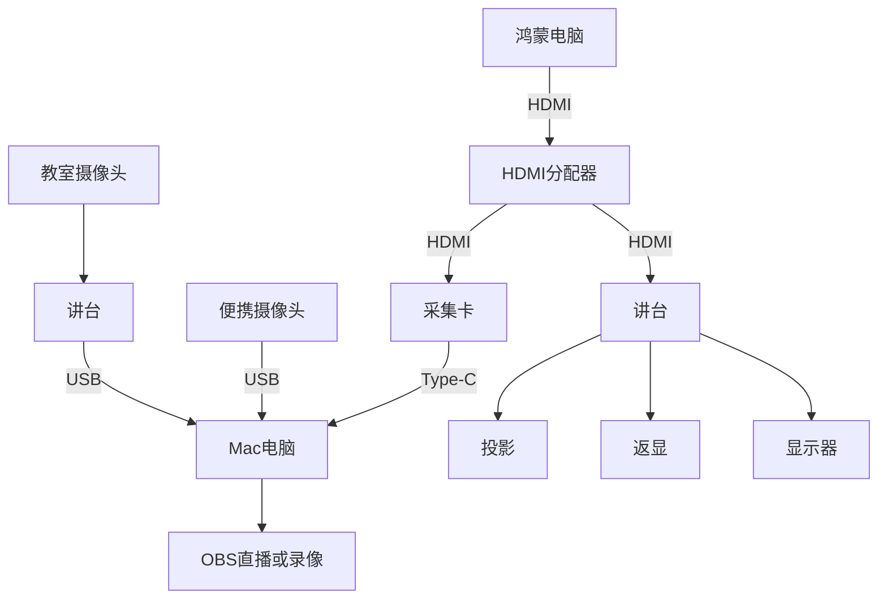
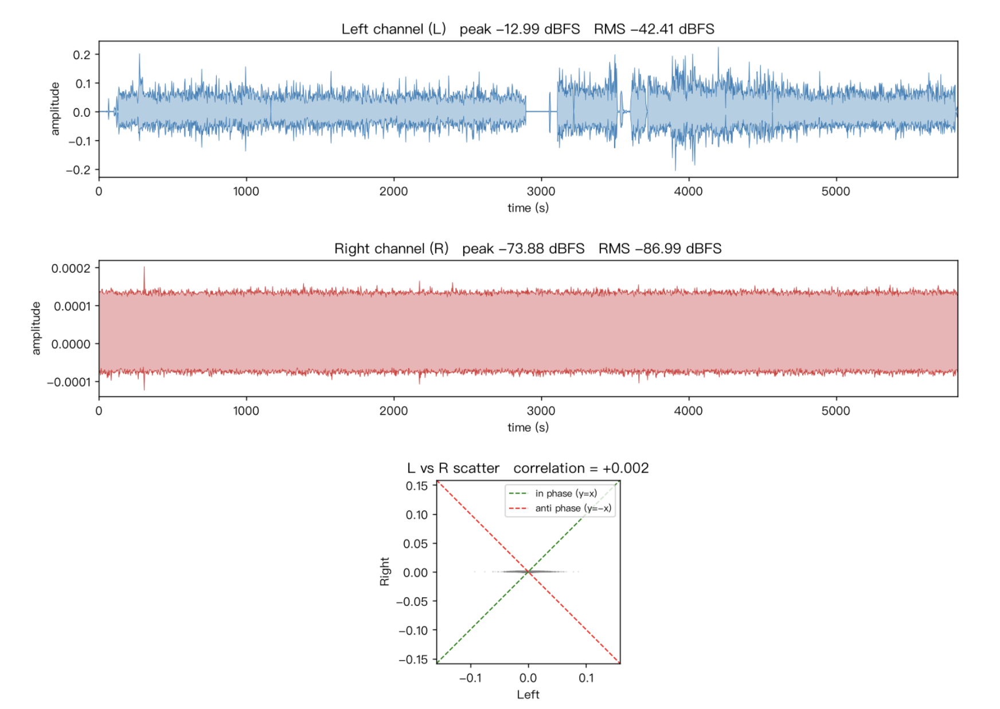
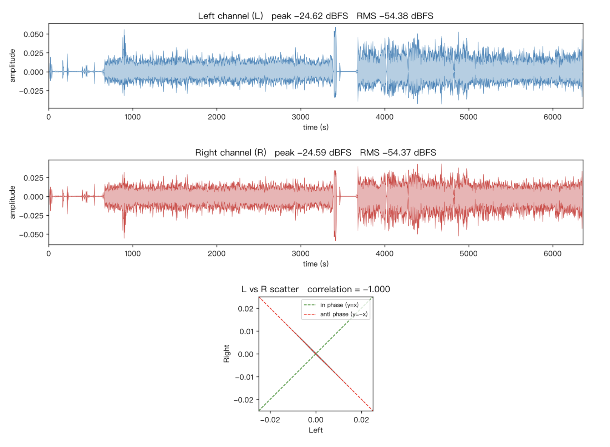

# 清华教室的音视频路由

## 背景

今天在设计上课要用的各类设备的音视频路由，借此机会梳理一下教室里现有的音视频路由，并给出一种可行的方案。

<!-- more -->

## 教室环境

教室里原本就有的音视频路由大致如下。先看教师侧：

- 一体机的视频和音频输出
- 通过 HDMI，接入笔记本的视频和音频输出
- 话筒的音频输出
- 教室里的摄像头，通常有板书、近景、远景、学生视角

这些音视频信号经过一个可在讲台上操控的导播台（下称「讲台」，实际设备未必位于讲台内部），可以输出到以下位置：

- 教室的音响
- 投影、返现、学生头上的显示器
- 一体机的音视频输入
- 通过 USB，笔记本的音视频输入

画成路由图大致如下。先是视频：

其次是音频：

## 针对上课需求的设计

回到我的课程。我希望能在多个信号源之间方便地切换，包括 Mac 笔记本、鸿蒙电脑，以及一台便携摄像头。讲台自带的导播功能不足以支撑这么复杂的切换，手上又没有 ATEM Blackmagic 导播台（怀念以前学生节的日子），于是打算用 OBS 做软件导播，在 Mac 笔记本上运行。

那么音视频路由该如何设计？下面是我最终采用的路由方式，先是视频：

音频：

这样，Mac 上的 OBS 就能获得来自鸿蒙电脑、Mac 自身屏幕、教室摄像头和话筒的音视频输入；再通过 OBS 的 Projector 把画面输出到扩展屏，经由讲台投到教室的各种投影和显示器上，音频也从音响放出来。之后要录像或直播，直接使用 OBS 自带的功能即可。

### 基于 HDMI 分配器的候选方案

另一个候选方案是，用 HDMI 分配器，让展示用的鸿蒙电脑的内容通过分配器一分为二，一份连到讲台投出来，另一份通过采集卡进入 Mac 电脑的 OBS，这个时候的视频拓扑变为：

这种设计把 OBS 放到了旁路，避免了采集卡可能出现的一些问题（后文有提），缺点是投出来的内容只能来自于鸿蒙电脑，不能通过 OBS 二次加工。

## 设备选型

采集卡用的是绿联的 [UG307-95348 4K60Hz MS2130S 视频采集卡](https://www.lulian.cn/product/1537.html)，USB 名称是 UGREEN 95348，VID 0x2b89，PID 0x5348。

便携摄像头用的是绿联 [CM717-25442 2K USB 400W 像素摄像头](https://www.lulian.cn/product/1815.html)，USB 名称是 UGREEN Camera 2K，VID 0x0c45，PID 0x636f；以及绿联 CM831-65381 4K USB 800W 像素摄像头，USB 名称是 UGREEN Camera 4K，VID 0xeba4，PID 0x6579。

仅供参考，不构成购买建议。

## 遇到的实际问题

在使用绿联 UG307-95348 采集卡的过程中，还遇到并修复了一些清晰度和颜色的问题，具体的修复方法见 [修复绿联 UG307-95348 HDMI 采集卡清晰度与颜色问题](../hardware/fix-ugreen-95348.md)。

实际使用中还踩到了音频方面的一些坑，而且都和立体声有关。

第一个坑：其中一个教室录出来的音频虽然标称是双声道，但实际上只有左声道有声音，右声道几乎是静音的。

第二个坑：另一个教室录出来的音频同样是双声道，但右声道是左声道的反相，两个声道一旦叠加就会互相抵消。

上面两张图都是用 [stereo_check.py](./stereo_check.py) 脚本绘制的。

此外，上课途中遇到过突发的，采集卡采集的视频内容出现闪屏和黑屏，不确定是采集卡的问题，还是 HDMI 线的问题。下课之后又无法复现了，不知道是不是和温度有关。
