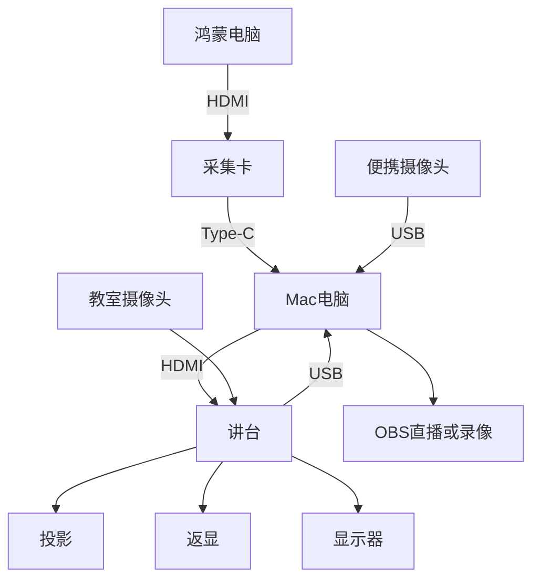
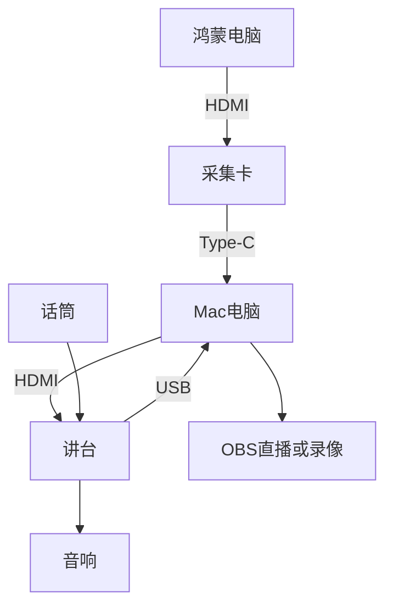

# 清华教室的音视频路由

## 背景

今天在设计上课要用的各种设备的音视频路由，借此机会总结一下教室环境里现有的音视频路由，并且给出一种可行的路由方案。

<!-- more -->

## 教室环境

教室本身就有的音视频路由大概是这样的，首先是教师侧：

- 一体机的视频和音频输出
- 通过 HDMI，接入笔记本的视频和音频输出
- 话筒的音频输出
- 教室里的摄像头，通常有板书、近景、远景、学生视角

这些音视频，通过一个可以在讲台上操控的导播台（下面简称它为讲台，虽然实际设备不一定在讲台内部），可以输出到这些地方：

- 教室的音响
- 投影、返现、学生头上的显示器
- 一体机的音视频输入
- 通过 USB，笔记本的音视频输入

绘制出来，大概是这样的路由，首先是视频：


其次是音频：


## 针对上课需求的设计

回到课程，我的目标是能够方便地在多个来源切换，包括 Mac 笔记本和鸿蒙电脑，外加便捷摄像头。考虑到讲台自带的导播功能不支持这么复杂的切换功能，手上又没有 ATEM Blackmagic 导播台（怀念以前学生节的日子），就打算用 OBS 来做软件导播，在 Mac 笔记本上运行 OBS。

那么，这个音视频的路由怎么设计呢？这是最终的路由方式，首先是视频：



音频：



这样就可以在 Mac 电脑的 OBS 上，得到来自鸿蒙电脑、Mac 自己的显示器、教室摄像头和话筒的音视频输入，通过 OBS 的 Projector 把显示输出到扩展屏，通过讲台展示到教室的各种投影和显示器上，音频也能从音响里放出来。后续要做录像或者是直播都可以直接用 OBS 自己的功能来完成。

采集卡用的是绿联的 [UG307-95348 4K60Hz MS2130S 视频采集卡](https://www.lulian.cn/product/1537.html)，USB 名称是 UGREEN 95348，VID 0x2b89，PID 0x5348。便携摄像头用的是绿联 [CM717-25442 2K USB 400W 像素摄像头](https://www.lulian.cn/product/1815.html)，USB 名称是 UGREEN Camera 2K，VID 0x0c45，PID 0x636f。仅供参考，不构成购买建议。

用 macOS 上 OBS 设置采集卡输入的时候，需要关闭 Use Preset 选项，选择 `3840x2160 (16:9) - 30, 60 FPS - CS 709 - NV12 (420v)`，而不是 `3840x2160 (16:9) - 30 FPS - CS 709 - NV12 (420v)`，后者明显会更糊，即使从名字看起来好像只有帧率的区别。如果勾选了 Use Preset，分辨率用的是 `3820x2160`，就会和上面第二种 4K 选项一样，有一些糊。

通过下面 swift 脚本的测试，打印采集卡的各种信息，发现这个有 60 FPS 的版本是经过 MJPEG 压缩的，从 dmb1 可以看出：

```shell
$ swift list_formats.swift
  3840x2160  420v  fps=30.0..30.0  dur=33333..33333us
      ext CVImageBufferColorPrimaries = ITU_R_709_2
      ext CVImageBufferTransferFunction = SMPTE_240M_1995
      ext CVImageBufferYCbCrMatrix = ITU_R_709_2
  3840x2160  420v  fps=60.0..60.0  dur=16667..16667us  fps=30.0..30.0  dur=33333..33333us
      ext CVImageBufferColorPrimaries = ITU_R_709_2
      ext CVImageBufferTransferFunction = SMPTE_240M_1995
      ext CVImageBufferYCbCrMatrix = ITU_R_709_2
      ext com.apple.cmio.format_extension.decompressed_from_format_type = 1684890161 (dmb1)
$ cat list_formats.swift
import AVFoundation
import CoreMedia

func fourcc(_ v: FourCharCode) -> String {
  let b: [UInt8] = [
    UInt8((v >> 24) & 255), UInt8((v >> 16) & 255),
    UInt8((v >> 8) & 255), UInt8(v & 255),
  ]
  let s = String(bytes: b, encoding: .ascii) ?? "?"
  return s.allSatisfy { $0.isLetter || $0.isNumber } ? s : String(format: "0x%08x", v)
}

let session = AVCaptureDevice.DiscoverySession(
  deviceTypes: [.external],
  mediaType: .video,
  position: .unspecified)

for d in session.devices {
  print("DEVICE \(d.localizedName) [\(d.uniqueID)]")
  print("  model=\(d.modelID)  manufacturer=\(d.manufacturer)")

  for f in d.formats {
    let dim = CMVideoFormatDescriptionGetDimensions(f.formatDescription)
    let sub = CMFormatDescriptionGetMediaSubType(f.formatDescription)

    var line = "  \(dim.width)x\(dim.height)  \(fourcc(sub))"
    for r in f.videoSupportedFrameRateRanges {
      line += String(
        format: "  fps=%.1f..%.1f  dur=%.0f..%.0fus",
        r.minFrameRate, r.maxFrameRate,
        CMTimeGetSeconds(r.minFrameDuration) * 1e6,
        CMTimeGetSeconds(r.maxFrameDuration) * 1e6)
    }
    print(line)

    if let ext = CMFormatDescriptionGetExtensions(f.formatDescription) as? [String: Any] {
      for k in ext.keys.sorted() {
        var v = "\(ext[k]!)"
        // decode fourcc-valued extensions such as
        //   com.apple.cmio.format_extension.decompressed_from_format_type
        if k.contains("format_type"), let n = ext[k] as? NSNumber {
          v = "\(n.uint32Value) (\(fourcc(n.uint32Value)))"
        }
        print("      ext \(k) = \(v)")

      }
    }
  }
}
```
