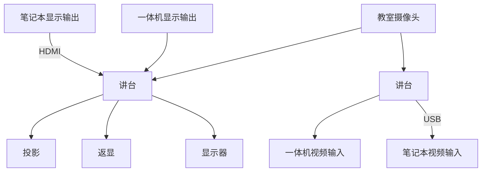
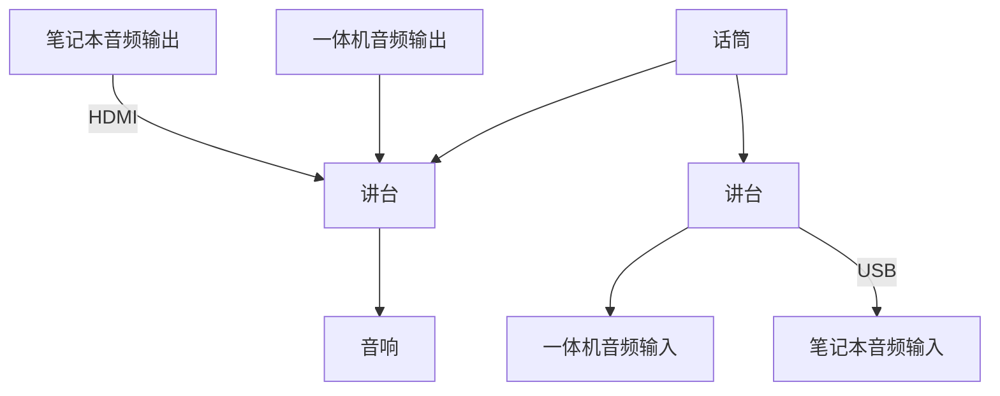
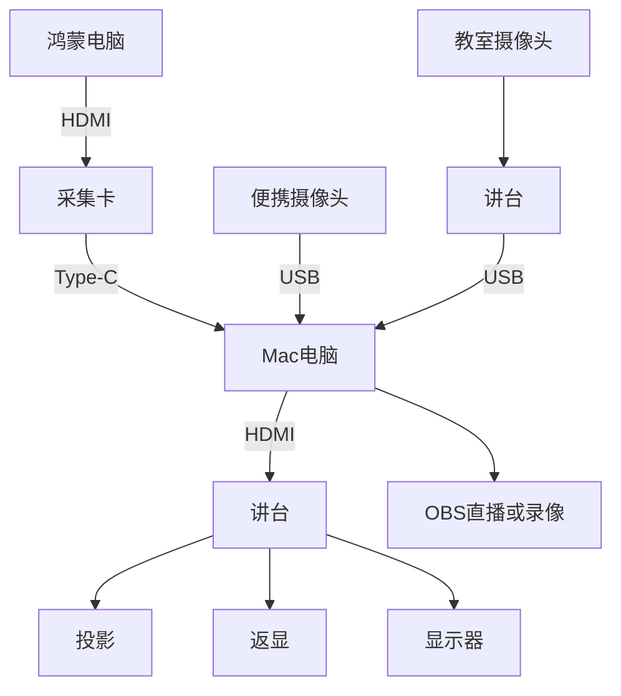
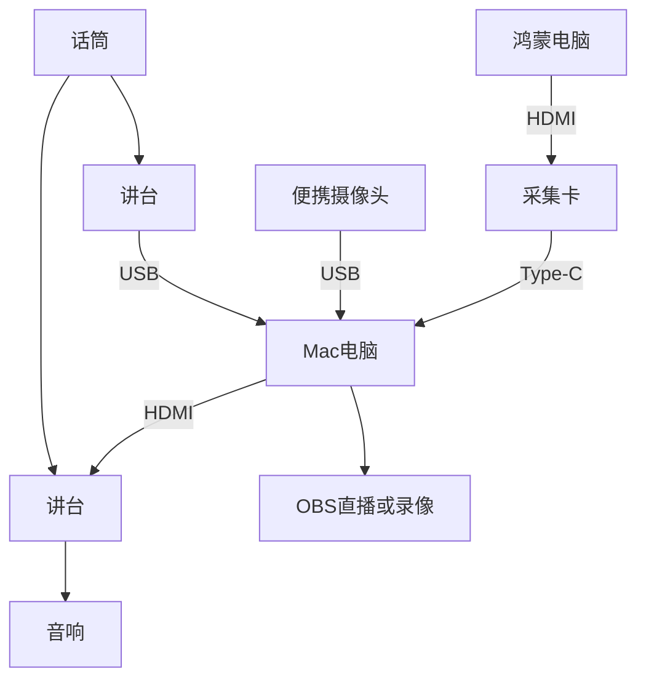
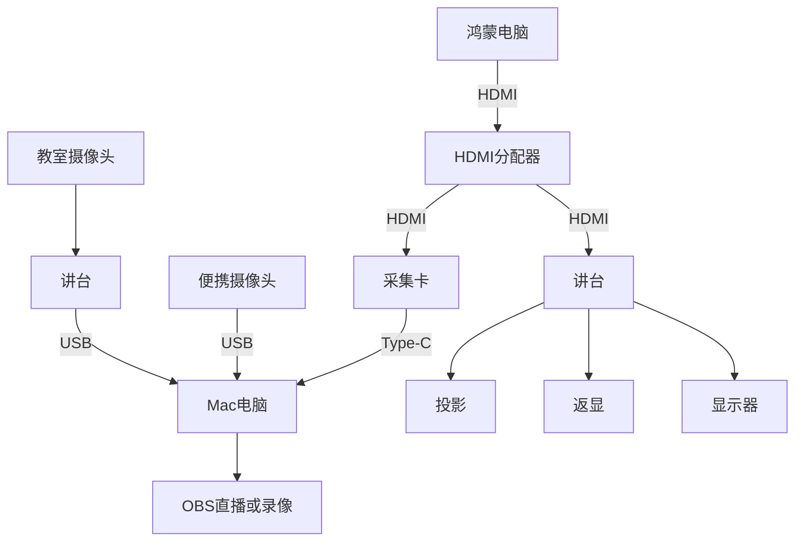

# 清华教室的音视频路由

## 背景

最近在设计上课所用设备的音视频路由，借此机会梳理一下教室里现有的音视频路由，并记录一种可行的方案。

<!-- more -->

## 教室环境

教室里原有的音视频路由大致如下。先看信号源：

- 一体机的视频和音频输出
- 通过 HDMI 接入的笔记本视频和音频输出
- 话筒的音频输出
- 教室里的摄像头，通常有板书、近景、远景、学生视角

这些信号经过一个可在讲台上操控的导播台（下称「讲台」，实际设备未必位于讲台内部），可以输出到以下位置：

- 教室的音响
- 投影、返显以及学生头顶的显示器
- 一体机的音视频输入
- 通过 USB 接入的笔记本音视频输入

画成路由图大致如下。视频部分：

音频部分：

## 针对上课需求的设计

回到我的课程。我希望能在多个信号源之间方便地切换，包括 Mac 笔记本、鸿蒙电脑以及一台便携摄像头。讲台自带的导播功能不足以支撑这么复杂的切换，手上又没有 ATEM Mini 导播台（怀念以前学生节的日子），于是打算在 Mac 笔记本上用 OBS 做软件导播。

那么音视频路由该如何设计？下面是我最终采用的路由方式。视频部分：

音频部分：

这样，Mac 上的 OBS 就能获得来自鸿蒙电脑、Mac 自身屏幕、教室摄像头和话筒的音视频输入；再通过 OBS 的 Projector 把画面输出到扩展屏，经由讲台投到教室的各种投影和显示器上，音频则从音响放出来。之后要录像或直播，直接使用 OBS 自带的功能即可。

### 基于 HDMI 分配器的候选方案

另一个候选方案是使用 HDMI 分配器：把展示用的鸿蒙电脑信号一分为二，一份直连讲台投出，另一份经采集卡进入 Mac 电脑的 OBS。此时视频拓扑变为：

这种设计把 OBS 放到了旁路，避开了采集卡可能出现的一些问题（后文会提到）；缺点是投出来的内容只能来自鸿蒙电脑，无法通过 OBS 二次加工。

## 设备选型

采集卡用的是绿联的 [UG307-95348 4K60Hz MS2130S 视频采集卡](https://www.lulian.cn/product/1537.html)，USB 名称是 UGREEN 95348，VID 0x2b89，PID 0x5348。

便携摄像头用的是：

- 绿联 [CM717-25442 2K USB 400W 像素摄像头](https://www.lulian.cn/product/1815.html)，USB 名称是 UGREEN Camera 2K，VID 0x0c45，PID 0x636f；
- 绿联 CM831-65381 4K USB 800W 像素摄像头，USB 名称是 UGREEN Camera 4K，VID 0xeba4，PID 0x6579。

HDMI 分配器用的是绿联的 [AP502-55493 4K60Hz 一进二出 HDMI 分配器](https://www.lulian.cn/product/1527.html)。输入 5V1A，支持一路 HDMI 输入，两路 HDMI 输出。从 EDID 来看，采用的是 [IT6664](https://www.ite.com.tw/tw/product/cate1/IT6664) 方案，可以通过拨码切换不同的模式：

- 1上2上（默认）：根据视频输出，决定输入看到的 EDID，设备显示 ITE-6664
- 1上2下：强制 1080P60Hz，设备显示 UGREEN-FHD
- 1下2上：强制 4K60Hz，设备显示 UGREEN-UHD
- 1下2下：复制 OUT1 设备的 EDID，如果没有 OUT1，则 fallback 到 1080P60Hz

仅供参考，不构成购买建议。

## 遇到的实际问题

在使用绿联 UG307-95348 采集卡的过程中，还遇到并修复了一些清晰度和颜色问题，具体方法见 [修复绿联 UG307-95348 HDMI 采集卡清晰度与颜色问题](../hardware/fix-ugreen-95348.md)。

音频方面也踩到了一些坑，而且都和立体声有关。

第一个坑：某个教室录出来的音频虽然标称双声道，但实际上只有左声道有声音，右声道几乎静音。

第二个坑：另一个教室录出来的音频同样是双声道，但右声道是左声道的反相，两个声道一旦叠加就会互相抵消。

上面两张图都是用 [stereo_check.py](./stereo_check.py) 绘制的。

此外，上课途中还遇到过突发情况：采集卡采集的视频出现闪屏和黑屏，不确定是采集卡的问题还是 HDMI 线的问题。下课后又无法复现，不知道是否和温度有关。
