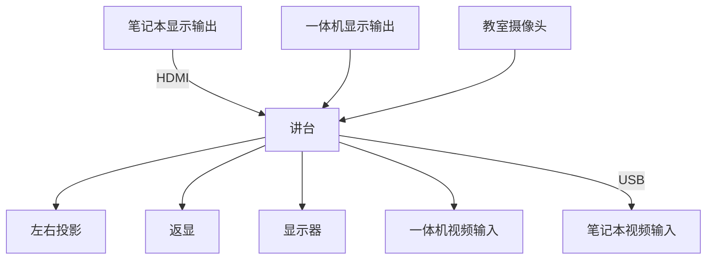
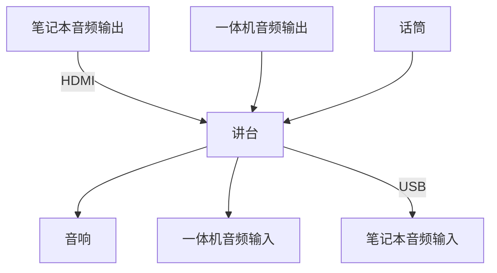
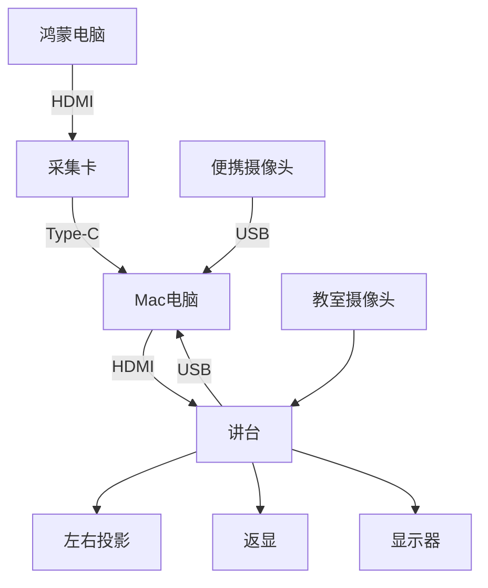
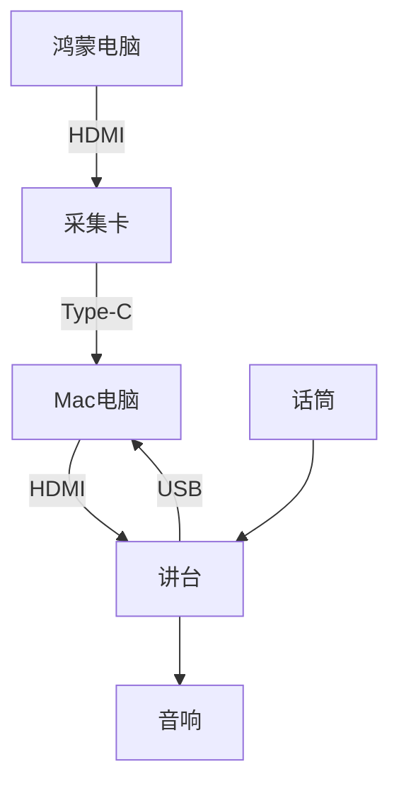

# 清华教室的音视频路由

## 背景

今天在设计上课要用的各种设备的音视频路由，借此机会总结一下教室环境里现有的音视频路由，并且给出一种可行的路由方案。

<!-- more -->

## 教室环境

教室本身就有的音视频路由大概是这样的，首先是教师侧：

- 一体机的视频和音频输出
- 通过 HDMI，接入笔记本的视频和音频输出
- 话筒的音频输出
- 教室里的摄像头，通常有板书、近景、远景、学生视角

这些音视频，通过一个可以在桌面上操控的导播台，可以输出到这些地方：

- 教室的音响
- 左右投屏、返现、学生头上的显示器
- 一体机的音视频输入
- 通过 USB，笔记本的音视频输入

绘制出来，大概是这样的路由，首先是视频：

其次是音频：

## 针对上课需求的设计

回到课程，我的目标是能够方便地在多个来源切换，包括 Mac 笔记本和鸿蒙电脑，外加便捷摄像头。考虑到讲台自带的导播功能不支持这么复杂的切换功能，手上又没有 ATEM Blackmagic 导播台（怀念以前学生节的日子），就打算用 OBS 来做软件导播，在 Mac 笔记本上运行 OBS。

那么，这个音视频的路由怎么设计呢？这是最终的路由方式，首先是视频：

音频：

这样就可以在 Mac 电脑的 OBS 上，得到来自鸿蒙电脑、Mac 自己的显示器、教室摄像头的音视频输入，通过 OBS 的 Projector 把显示输出到扩展屏，通过讲台展示到教室的各种投影和显示器上。后续要做录像或者是直播都可以直接用 OBS 自己的功能来完成。
