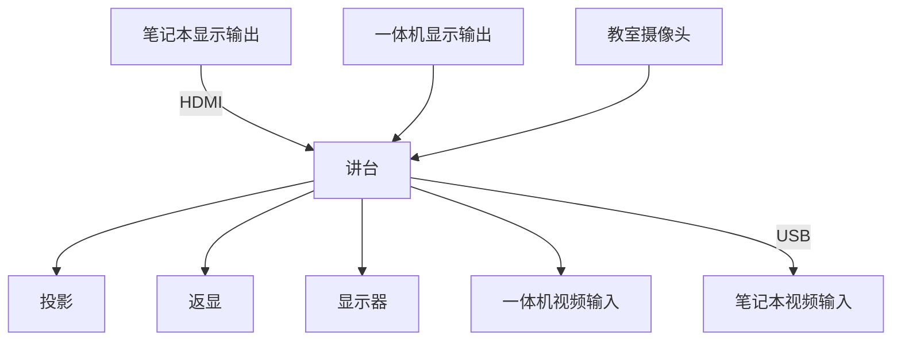
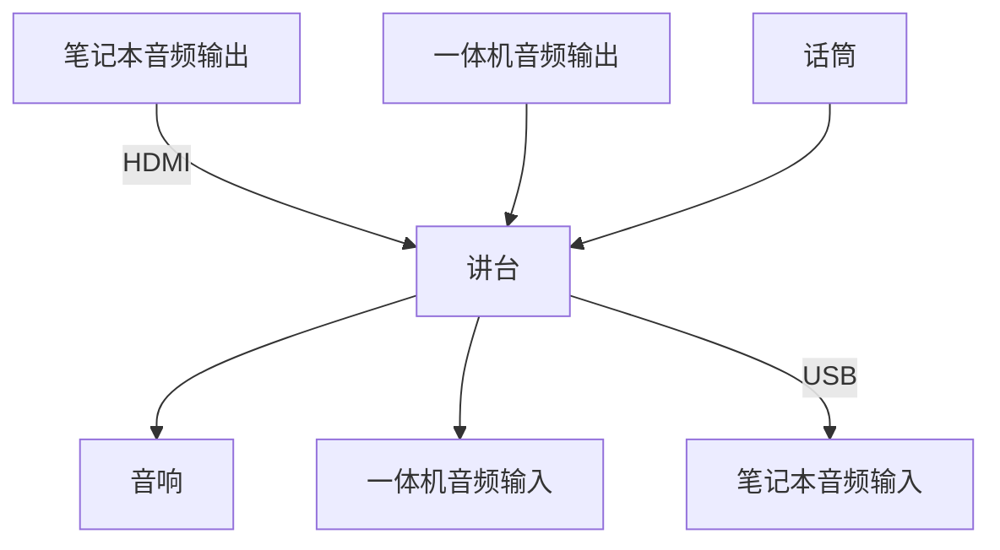
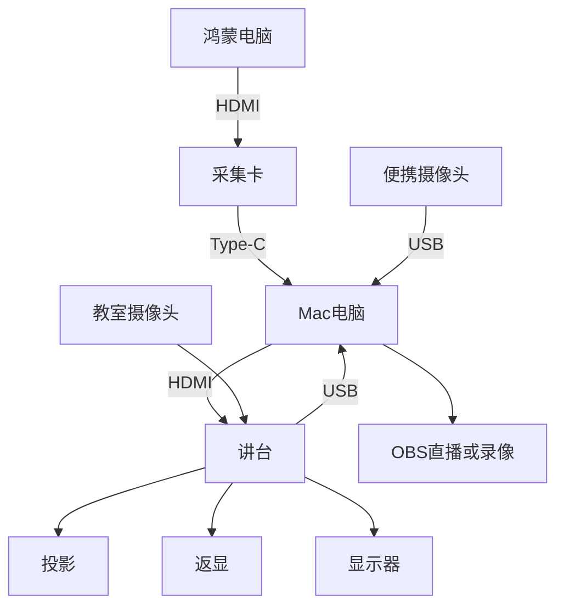
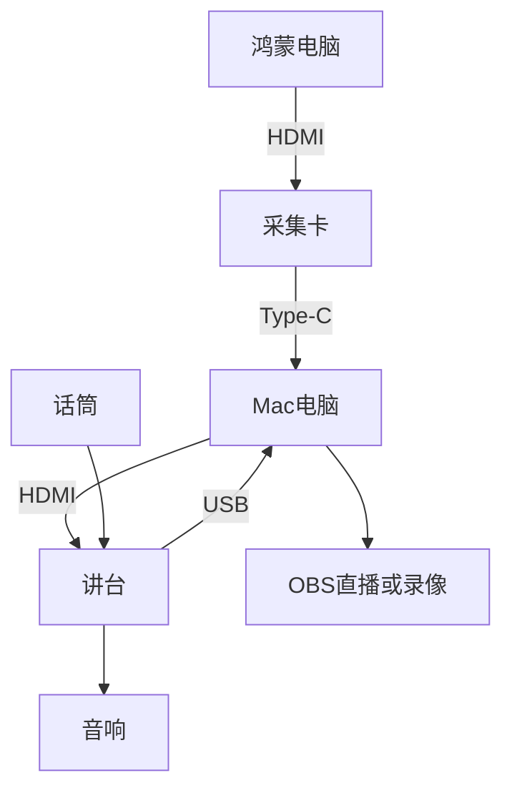

# 清华教室的音视频路由

## 背景

今天在设计上课要用的各类设备的音视频路由，借此机会梳理一下教室里现有的音视频路由，并给出一种可行的方案。

<!-- more -->

## 教室环境

教室里原本就有的音视频路由大致如下。先看教师侧：

- 一体机的视频和音频输出
- 通过 HDMI，接入笔记本的视频和音频输出
- 话筒的音频输出
- 教室里的摄像头，通常有板书、近景、远景、学生视角

这些音视频信号经过一个可在讲台上操控的导播台（下称「讲台」，实际设备未必位于讲台内部），可以输出到以下位置：

- 教室的音响
- 投影、返现、学生头上的显示器
- 一体机的音视频输入
- 通过 USB，笔记本的音视频输入

画成路由图大致如下。先是视频：



其次是音频：



## 针对上课需求的设计

回到我的课程。我希望能在多个信号源之间方便地切换，包括 Mac 笔记本、鸿蒙电脑，以及一台便携摄像头。讲台自带的导播功能不足以支撑这么复杂的切换，手上又没有 ATEM Blackmagic 导播台（怀念以前学生节的日子），于是打算用 OBS 做软件导播，在 Mac 笔记本上运行。

那么音视频路由该如何设计？下面是我最终采用的路由方式，先是视频：



音频：



这样，Mac 上的 OBS 就能获得来自鸿蒙电脑、Mac 自身屏幕、教室摄像头和话筒的音视频输入；再通过 OBS 的 Projector 把画面输出到扩展屏，经由讲台投到教室的各种投影和显示器上，音频也从音响放出来。之后要录像或直播，直接使用 OBS 自带的功能即可。

采集卡用的是绿联的 [UG307-95348 4K60Hz MS2130S 视频采集卡](https://www.lulian.cn/product/1537.html)，USB 名称是 UGREEN 95348，VID 0x2b89，PID 0x5348。便携摄像头用的是绿联 [CM717-25442 2K USB 400W 像素摄像头](https://www.lulian.cn/product/1815.html)，USB 名称是 UGREEN Camera 2K，VID 0x0c45，PID 0x636f。仅供参考，不构成购买建议。

在 macOS 上为 OBS 设置采集卡输入时，需要关闭 Use Preset 选项，选择 `3840x2160 (16:9) - 30, 60 FPS - CS 709 - NV12 (420v)`，而不是 `3840x2160 (16:9) - 30 FPS - CS 709 - NV12 (420v)`。后者明显更糊，尽管从名称上看似乎只差一个帧率。如果勾选了 Use Preset，分辨率选 `3820x2160`，效果和上面第二种 4K 选项一样，也有些糊。

用下面这个 Swift 脚本打印采集卡的各种信息，可以发现 60 FPS 的那个版本经过了 MJPEG 压缩，从 dmb1 字段即可看出：

```shell
$ swift list_formats.swift
  3840x2160  420v  fps=30.0..30.0  dur=33333..33333us
      ext CVImageBufferColorPrimaries = ITU_R_709_2
      ext CVImageBufferTransferFunction = SMPTE_240M_1995
      ext CVImageBufferYCbCrMatrix = ITU_R_709_2
  3840x2160  420v  fps=60.0..60.0  dur=16667..16667us  fps=30.0..30.0  dur=33333..33333us
      ext CVImageBufferColorPrimaries = ITU_R_709_2
      ext CVImageBufferTransferFunction = SMPTE_240M_1995
      ext CVImageBufferYCbCrMatrix = ITU_R_709_2
      ext com.apple.cmio.format_extension.decompressed_from_format_type = 1684890161 (dmb1)
$ cat list_formats.swift
import AVFoundation
import CoreMedia

func fourcc(_ v: FourCharCode) -> String {
  let b: [UInt8] = [
    UInt8((v >> 24) & 255), UInt8((v >> 16) & 255),
    UInt8((v >> 8) & 255), UInt8(v & 255),
  ]
  let s = String(bytes: b, encoding: .ascii) ?? "?"
  return s.allSatisfy { $0.isLetter || $0.isNumber } ? s : String(format: "0x%08x", v)
}

let session = AVCaptureDevice.DiscoverySession(
  deviceTypes: [.external],
  mediaType: .video,
  position: .unspecified)

for d in session.devices {
  print("DEVICE \(d.localizedName) [\(d.uniqueID)]")
  print("  model=\(d.modelID)  manufacturer=\(d.manufacturer)")

  for f in d.formats {
    let dim = CMVideoFormatDescriptionGetDimensions(f.formatDescription)
    let sub = CMFormatDescriptionGetMediaSubType(f.formatDescription)

    var line = "  \(dim.width)x\(dim.height)  \(fourcc(sub))"
    for r in f.videoSupportedFrameRateRanges {
      line += String(
        format: "  fps=%.1f..%.1f  dur=%.0f..%.0fus",
        r.minFrameRate, r.maxFrameRate,
        CMTimeGetSeconds(r.minFrameDuration) * 1e6,
        CMTimeGetSeconds(r.maxFrameDuration) * 1e6)
    }
    print(line)

    if let ext = CMFormatDescriptionGetExtensions(f.formatDescription) as? [String: Any] {
      for k in ext.keys.sorted() {
        var v = "\(ext[k]!)"
        // decode fourcc-valued extensions such as
        //   com.apple.cmio.format_extension.decompressed_from_format_type
        if k.contains("format_type"), let n = ext[k] as? NSNumber {
          v = "\(n.uint32Value) (\(fourcc(n.uint32Value)))"
        }
        print("      ext \(k) = \(v)")

      }
    }
  }
}
```

## 颜色问题

不过还遗留了一个问题：采集卡采到的鸿蒙电脑画面颜色不对。在鸿蒙电脑上打开 [Lagom 白饱和测试图](http://www.lagom.nl/lcd-test/zhs_white.php)，采集到的 RGB 与预期对不上，大致关系如下：

- 原来 200 -> 显示 219
- 原来 244 -> 显示 255

用 ffmpeg 观察后发现，采集卡实际给出的是 204；由于这是 limited range（16-235）下的 204，转换到 full range 后就是 `(204 - 16) / 219 * 255 = 219`。若把鸿蒙电脑直接接到显示器上，显示则正常。

深入研究后，我找到了一些通过设置 MS2130S 寄存器来改变其行为的方法（参考 [steve-m/hsdaoh](https://github.com/steve-m/hsdaoh/blob/master/src/libhsdaoh.c)）。在 AI 的帮助下定位到了问题：只要关闭 MS2130S 自带的 luma processing（即把寄存器 0xfc8e 从原来的 0x00 改为 0x11），颜色就会恢复正常。下面这个小工具可以在 OBS 开始录制后运行，用来 toggle luma processing，从而实时看到颜色变化：

```c++
/*
 * ugreen_fix_toggle - minimal hidapi-only tool for the UGREEN 95348
 *                     (MS2130S, 2b89:5348).
 *
 * Reads a video-processing register and toggles it:
 *   0x00 -> 0x11   (disable the chip's luma processing / fix the 200->219 lift)
 *   0x11 -> 0x00   (re-enable it / reproduce the bug)
 *
 * Default register is 0xfc8e (confirmed to be the luma-processing register).
 * Pass another address as the first argument if needed, e.g.
 *   ./ugreen_fix_toggle 0xfc80
 *
 * build (macOS/homebrew, hidapi only):
 *   cc -O2 -I/opt/homebrew/include/hidapi ugreen_fix_toggle.c \
 *      -L/opt/homebrew/lib -lhidapi -o ugreen_fix_toggle
 */
#include <hidapi.h>
#include <stdint.h>
#include <stdio.h>
#include <stdlib.h>
#include <string.h>

#define VID 0x2b89
#define PID 0x5348
#define DEFAULT_REG 0xfc8e

static hid_device *h;

/* MS2130S vendor HID feature report:
 *   [0x01, 0xb6, addrH, addrL, val, 0, 0, 0, 0]  write
 *   [0x01, 0xb5, addrH, addrL, 0, 0, 0, 0, 0]    read request
 * GET_REPORT returns 64 bytes; the value is byte 4. */
static int reg_write(uint16_t addr, uint8_t val) {
  unsigned char buf[9] = {0x01, 0xb6, addr >> 8, addr & 0xff, val, 0, 0, 0, 0};
  return hid_send_feature_report(h, buf, sizeof(buf));
}

static int reg_read(uint16_t addr, uint8_t *val) {
  unsigned char cmd[9] = {0x01, 0xb5, addr >> 8, addr & 0xff, 0, 0, 0, 0, 0};
  unsigned char rsp[64];

  if (hid_send_feature_report(h, cmd, sizeof(cmd)) < 0)
    return -1;
  memset(rsp, 0, sizeof(rsp));
  rsp[0] = 0x01;
  if (hid_get_feature_report(h, rsp, sizeof(rsp)) < 0)
    return -1;
  *val = rsp[4];
  return 0;
}

int main(int argc, char **argv) {
  uint16_t addr = DEFAULT_REG;
  uint8_t cur, next;

  if (argc > 1)
    addr = (uint16_t)strtoul(argv[1], NULL, 0);

  if (hid_init() < 0) {
    fprintf(stderr, "hid_init failed\n");
    return 1;
  }
  h = hid_open(VID, PID, NULL);
  if (!h) {
    fprintf(stderr, "UGREEN %04x:%04x not found (is it plugged in?)\n", VID,
            PID);
    return 1;
  }

  if (reg_read(addr, &cur) < 0) {
    fprintf(stderr, "register read failed: %ls\n", hid_error(h));
    hid_close(h);
    return 1;
  }

  if (cur == 0x00) {
    next = 0x11;
  } else if (cur == 0x11) {
    next = 0x00;
  } else {
    fprintf(stderr, "%04x = 0x%02x (unexpected, not touching)\n", addr, cur);
    hid_close(h);
    return 2;
  }

  if (reg_write(addr, next) < 0) {
    fprintf(stderr, "register write failed: %ls\n", hid_error(h));
    hid_close(h);
    return 1;
  }

  printf("%04x: 0x%02x -> 0x%02x\n", addr, cur, next);
  printf("(0x11 = luma processing disabled = fix on; 0x00 = default/bug)\n");

  hid_close(h);
  hid_exit();
  return 0;
}
```

编译和运行：

```shell
$ brew install hidapi
$ cc -O2 -I/opt/homebrew/include/hidapi ugreen_fix_toggle.c -L/opt/homebrew/lib -lhidapi -o ugreen_fix_toggle
# 此时是有问题的状态
$ ./ugreen_fix_toggle
fc8e: 0x00 -> 0x11
(0x11 = luma processing disabled = fix on; 0x00 = default/bug)
# toggle 以后，颜色问题修复
$ ./ugreen_fix_toggle
fc8e: 0x11 -> 0x00
(0x11 = luma processing disabled = fix on; 0x00 = default/bug)
# 再次 toggle，颜色问题重新出现
```

修复后，200 变成 199，244 变成 243。虽然仍有很小的偏差，但可以认为问题已经解决。

不过每次开始采集后都要重新跑一次这个工具，还是有点麻烦。一个可能一劳永逸的办法是参考 [steve-m/ms2130_patcher](https://github.com/steve-m/ms2130_patcher/blob/master/ms2130_patch.c)，给固件打补丁，让硬件往 0xfc8e 寄存器写入 0x11 而不是 0x00。
