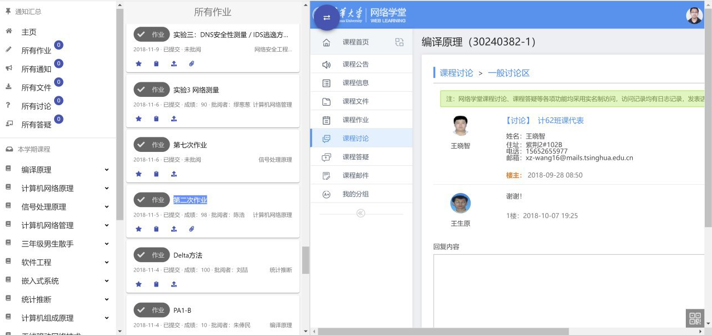

# 预告 Learn-Project 4.0 版

不知道大家听没听说过 Google Chrome 有个插件，叫做 Learn Project，是一个网络学堂的改良前端。不过，随着网络学堂的不断更（xia）新（gao），它已经不再适用于现在的版本。于是，哈利橙（[@Harry-Chen](https://github.com/Harry-Chen)）决定利用寒假时间，在今天（2.17）之前完成 Learn Project 4.0 的开发。为什么叫 4.0 呢，因为哈利橙课程的 GPA 众数是 4.0。这个版本采用先进的 React 框架编写（Vue 塞高），使用了 Material Ui 作为界面框架（这我觉得可以），目前的一个参考图（图源哈利橙）：

看那满眼的高分数，希望 Learn Project 4.0 能在 flag 倒下之前完成。

