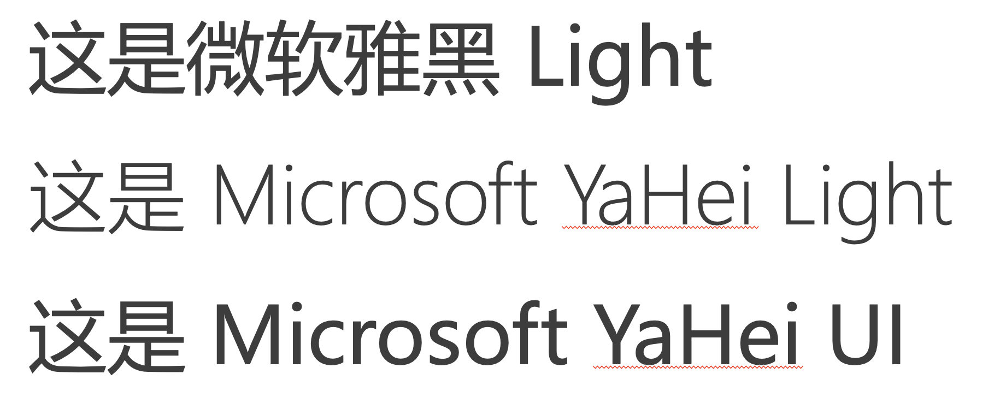
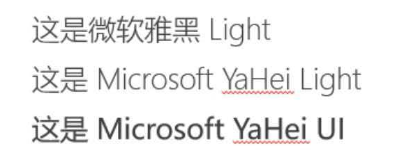

# 记录一次在 macOS 上与微软雅黑字体的搏斗

## 背景

最近在做 PPT，用了一个在 Windows 上制作的 PPT 模板，它用到了 `微软雅黑 Light` 字体，在 macOS 上显示不正常，因此做了一些细致的研究和排查，找到了原因和解决方案。

<!-- more -->

## 搏斗过程

遇到的问题是这样的：在 macOS 上做了一个 PPT，放到 Windows 或者鸿蒙的 WPS 上显示，发现字体渲染并不一致。如果在 macOS 上保存 PPT 的时候选择内嵌字体，它也会提示“微软雅黑 Light”字体不存在。说明 macOS 上并没有找到正确的字体，fallback 到了其他字体来显示。然后在 Windows 上找到了正确的字体，导致了效果的不同。

但实际上，macOS 上的 Office，是附带了微软雅黑的字体文件的：

```shell
> ls /Applications/Microsoft\ PowerPoint.app/Contents/Resources/DFonts/msyh*.ttc
'/Applications/Microsoft PowerPoint.app/Contents/Resources/DFonts/msyh.ttc'*
'/Applications/Microsoft PowerPoint.app/Contents/Resources/DFonts/msyhbd.ttc'*
'/Applications/Microsoft PowerPoint.app/Contents/Resources/DFonts/msyhl.ttc'*
```

对应了微软雅黑的不同的字重，其中 msyhl 就是对应了 Light。也就是说，虽然 macOS 没有字体，但 PowerPoint 自带了，理应正常支持。

然后，用 Python 探索了一下这些字体里的各种信息，发现了一些端倪：

```
────────────────────────────────────────────────────────────────────────────────────────────────────────────
■ face #1/2   Microsoft YaHei Light / Regular / MicrosoftYaHeiLight
────────────────────────────────────────────────────────────────────────────────────────────────────────────
  #   platform   enc language         nameID 含义                 len   off    文本
  1   Windows(3) 1   英文(en)         1      Family               42    250    Microsoft YaHei Light
  2   Windows(3) 1   英文(en)         2      Subfamily            14    292    Regular
  17  Windows(3) 1   简体中文(zh-Hans) 1      Family               20    2220   微软雅黑 Light
  18  Windows(3) 1   简体中文(zh-Hans) 2      Subfamily            14    292    Regular
```

这是微软雅黑 Light 的 name table，它的字体名称有英文和中文两个版本。如果我把字体改成 Microsoft YaHei Light，它就可以正常找到字体，说明我的英文 macOS 上的 PowerPoint 没有正确匹配字体的中文名。

我做了一个测试的 PPT，三行字，第一行是微软雅黑 Light 字体，第二行是 Microsoft YaHei Light 字体，第三是 Microsoft YaHei UI 字体。能明显看出第一行字体有问题，和第三行一样，而第二行字体是正确的：



后两行正确匹配了字体，所以渲染没问题。而同样的文件，放到 Windows PowerPoint 里打开，可以看到正确的显示结果：



前两个字体是同一个，和第三个不同，这是预期结果。

因此最后的解决办法就是：把模板里的字体，从微软雅黑 Light，改成 Microsoft YaHei Light。这样就可以在 macOS 和 Windows 上都能正常显示了。

至于鸿蒙 WPS 怎么办：从虚拟机 Windows 里复制 msyh*.ttc 字体，安装到鸿蒙里，就可以正常显示了。
