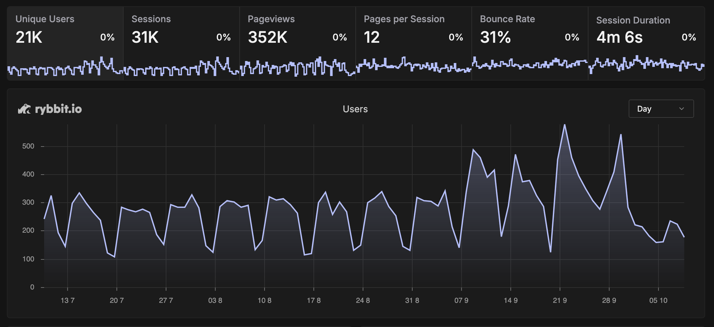

# 本博客近三个月来的访问数据观察

## 写在前面

这个博客自 2014 年更新至今，已走过近十一个年头，累计发布了四百多篇文章。出于好奇，我一直想了解哪些内容更受读者欢迎。五年前，我曾配置过 Google Analytics，但使用体验并不理想，于是转而自行部署了 [rybbit](https://github.com/rybbit-io/rybbit/) 实例来收集访问数据。如今三个月过去，是时候与大家分享一些有趣的发现。

P.S. 如果你对数据收集有所顾虑，可以屏蔽对应的 analytics 脚本。

<!-- more -->

## 数据总览与趋势

首先来看这三个月内的整体访问情况与趋势：

访问量比我的预期要高一些。虽然这些年写了不少内容，但并没有刻意宣传，主要依赖搜索引擎推荐和读者的订阅与转发。从时间趋势上可以看出两个明显特点：

1. 工作日访问量显著高于周末，通常为周末的两到三倍；
2. 开学后工作日的访问量比暑假期间又高出一倍，但周末依然低迷。

由此推测，学生读者占比较高。结合国庆假期访问量的下降来看，国内读者仍是主力。下面是各国家与地区的访问分布：

值得一提的是，也有不少海外读者访问，看来近年来有意识地撰写英文内容确实产生了效果。

以 UTC+8 时区为基准，从访问时间分布中可以看出大家的作息习惯：

尽管大家可能习惯熬夜，但深夜阅读博客的并不多，多数访问集中在工作时间。

接下来是基于 User Agent 的统计。首先是浏览器分布：

不出所料，Chrome 及基于 Chromium 内核的浏览器占据主流，Firefox 和 Safari 占比不高。我本人目前也在使用 Firefox，希望它能持续发展，避免 Chrome 一家独大。

操作系统分布如下：

Windows 占比最高，macOS 次之。考虑到博客内容主要涉及计算机技术，这也大致反映了相关从业人员的偏好。

以下是访问次数较多的几篇文章：

- [ACPI 学习笔记](../hardware/acpi-notes.md): 886 次
- [NVIDIA 驱动和 CUDA 版本信息速查](../software/nvidia-cuda.md): 835 次
- [在 QEMU 中运行 OpenBMC](../system/openbmc-qemu.md): 725 次
- [SPEC CPU 2006 性能测试](./spec-cpu-2006.md): 520 次
- [MIFARE Classic 上配置 NDEF](../hardware/mifare-classic-ndef.md): 464 次

这个排名有些出乎我的意料。这几篇文章在撰写时并未特别考虑入门读者的理解难度或内容的丰富性。或许是因为它们涉及的领域资料较少，因此在相关关键词搜索中容易被找到。这一点在 Google Search Console 中也得到了印证：

相比之下，一些精心准备的文章阅读量并不高，可能是因为所在领域已有较多优质内容，新文章难以脱颖而出。这也说明文章质量与阅读量之间并非简单的正比关系。

我还注意到一些重度用户，他们不仅阅读多篇文章，且停留时间较长：

- 未知用户一：阅读了分支预测、乱序执行、CPU 微架构分析等文章，推测可能是刚开始研究 CPU 微架构的同行；
- 未知用户二：浏览了 wishbone、乱序执行相关内容，猜测是学习清华计算机组成原理课程的学生；
- 未知用户三：从华为相关文章进入，随后浏览了其他内容，可能是搜索华为内容进入博客后，被其他文章吸引的读者；
- 未知用户四：阅读了 ARM/Samsung/Intel 等处理器微架构分析文章，又一位同行，但有一定基础，更加关注业界。

类似的例子还有不少，在此不一一列举。尽管 CPU 相关文章的阅读量不及软件类内容，但能得到这么多同行的关注，确实令人欣慰——毕竟这本身就是一个小众领域，不能奢求过高的阅读量。

通过这次数据分析，我收获了不少有趣的观察。未来可能会不定期更新类似内容，看看随着时间推移，是否会有新的发现。

最后，如果你对访问数据的收集感到不适，可以直接屏蔽 analytics 脚本（或许你的浏览器插件已经这样做了）。根据 rybbit 的官方说明，其信息收集方法较为尊重用户隐私，我也没有对代码进行任何修改，不放心的读者可以阅读 [rybbit](https://github.com/rybbit-io/rybbit) 的源码来审计。
