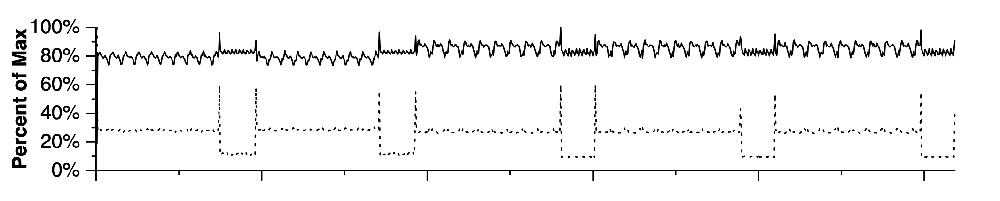
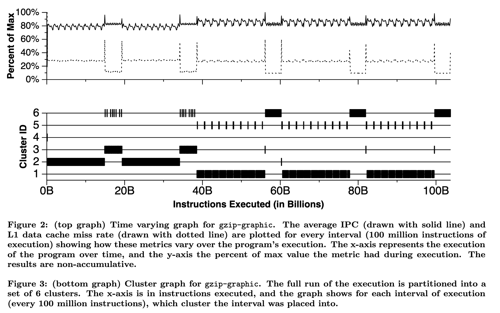

# 如何进行条件分支预测器实验

## 背景

最近针对各种条件分支预测器（Conditional Branch Predictor）做了在各种 benchmark 上的实验，在此记录一下做这个实验的流程。

<!-- more -->

## 流程

说到做条件分支预测器实验，到底是做什么呢？其实就是针对未来的处理器中的条件分支预测器的设计，在提前准备好的一些 benchmark 上进行模拟，观察它的预测准确性。既然是未来的处理器，那么硬件肯定是没有的，如果直接用 RTL 去实现新的预测器，再用 RTL 仿真，结果固然准确，但这还是太复杂并且太慢了。所以在前期的时候，首先会构建一个单独的条件分支预测器的实验环境，在只考虑条件分支指令、不考虑其他指令的情况下，单纯来观察预测的效果，从而可以实现比较快速的设计迭代。

为了达成这个目的，需要：

1. 提前准备好一些 benchmark，提取出这个 benchmark 中所涉及到的条件分支 trace，以及条件分支预测器所需要的其他信息
2. 为了进一步缩短模拟的时间和 trace 的大小，利用 SimPoint 等技术来减少要模拟的指令条数
3. 搭建一个条件分支预测器模拟器，在上一步提取出来的 trace 中模拟条件分支预测器的执行，从而得到结果

下面按照这个顺序，分别来讨论一下这个流程。

## benchmark 准备

比较常见的 benchmark 就是 SPEC INT 2017，当然现在很多论文也会自己去寻找一些其他的 benchmark，不同的 benchmark 它的程序的特性也是不一样的，未来也可能会有新的 benchmark 出来，所以有必要了解从 benchmark 到 trace 的过程。选好了 benchmark 以后，我们需要思考怎么去生成一个 trace：为了减少后续模拟的负担，我们需要从 benchmark 中提取条件分支的执行历史，作为 groundtruth，喂给条件分支预测器，这样才能知道每次预测是否准确。当然了，网上已经有很多现成的 trace，比如 CBP Championship 比赛也都有提供自己的 benchmark trace（P.S. 2025 年的 CBP Championship 正在火热进行中），但读完本文，你应该可以尝试自己完成这个从 benchmark 到 trace 的过程。

那么第一个问题就是，怎么获取 benchmark 中分支指令执行的信息呢？首先来看一组数据，在 amd64 上，用 `-O3` 编译 SPEC INT 2017 的 benchmark，一共 10 个子 benchmark，加起来运行的指令数大约是 1.6e13 条，其中有大约 2.9e12 条分支指令（包括了有条件和无条件），这个数量是非常巨大的，无论是保存这些执行信息的性能开销，还是需要的存储空间，都是比较巨大的。

考虑到条件分支预测器只需要分支指令的信息，所以只考虑 2.9e12 条分支指令的部分，而不去考虑完整的 1.6e13 条指令，首先可以减少一个数量级。接着，考虑每个分支指令需要记录哪些信息：

1. 知道每一条分支指令的地址、每一条直接分支指令的目的地址
2. 对于执行的每一条条件分支指令，要记录它跳转与否
3. 对于执行的每一条间接分支指令，需要记录它跳转的目的地址

其中第一点，由于条件分支指令本身是不变的（不考虑 JIT），所以只需要存一份就行。而 SPEC INT 2017 所有程序的分支指令加起来大概只有 5e4 的量级，相比 1.6e13 的执行的分支指令数可以忽略不计。第三点，由于间接分支指令通常也是比较少的，而且同一条间接分支指令的目的地址通常来说不会特别多，也有压缩的空间。那么最主要的空间来自于：

1. 虽然条件分支指令数量不多，但是执行的条件分支指令次数很多，每一次执行的可能是不同的条件分支指令，如果要记录当前这次执行的是哪一条条件分支指令，那么这个指令的地址或者一个 id 所占用的空间会很大；如果不记录当前执行的是哪一条分支分支指令，就需要在后续处理的时候，结合可执行程序的汇编来推断，当前执行的是哪一条条件分支指令
2. 其次就是要记录条件分支跳转与否，这一个的开销相对会小一些，只需要一个 bit

由此可以推导出不同的 trace 记录方式：

第一种方式是，遇到条件分支指令时，只记录跳转（Taken）还是不跳转（Not Taken），这种方式保存的数据量最小（平均每个分支只需要比 1 bit 略多的空间），但是后续需要结合汇编，恢复出执行的过程，更进一步还可以压缩那些 return 的目的地址等于对应的 call 指令的下一条指令的地址的情况（Indirect Transfer Compression for Returns）。Intel PT 采用的是这种方法。

第二种方式是，遇到条件分支指令时，不仅记录跳转与否，还记录它执行的是哪一条分支指令。这种方式保存的数据量稍多，假如要支持 5e4 条不同的条件分支指令，为了保存这个 id，就需要 16 位。类似地，也可以只记录跳转了的条件分支指令，那么那些没有跳转的条件分支指令，就需要后续结合汇编或者完整的条件分支指令表来恢复出来。CBP Championship 的 trace 采用的是这种方法。

第一种方法明显空间会更小，以 1.6e13 条执行的分支指令数，大概需要 2TB 的磁盘空间；第二种方法，同样的分支指令数，就需要大概 30TB 的磁盘空间。当然了，第二种方法存的数据可以经过无损压缩进一步缩小空间，实测压缩后大概是每分支 0.16 字节，只比第一种方法大概每分支 0.14 字节略大。

在评估条件分支预测器的时候，除了知道分支本身，还需要知道执行的指令数，用于计算 MPKI 等，这个可以通过 PMU 单独统计出来，或者直接根据控制流推算出执行的指令数，例如在等长指令的 ISA 上直接用地址差除以指令长度来计算指令数，在变长指令的 ISA 上 Parse ELF 去解析控制流经过的指令：

1. 解析 ELF，用反汇编器得到每条指令的地址，从小到大排序放到数组中
2. 对于每个分支地址和目的地址，查询它对应的指令在指令数组中的下标，记录下来
3. 统计指令数时，每遇到一个跳转的分支，就用当前跳转的分支的分支地址在指令数组中的下标，减去上一个跳转的分支的目的地址在指令数组中的下标，加上一，累加到指令数中

此外，如果分支预测器需要知道分支指令的 fallthrough 地址（例如 Path History Register），且使用的是变长指令集，还需要记录分支指令的长度。这些需求实现起来都并不复杂，也只需要占用很小的空间。

TB 级别的规模，无论是保存这些数据，还是生成这些数据，或者更进一步在这些数据上模拟条件分支预测器，都会带来很大的负担。因此，需要一个办法来减少要模拟的 trace 长度。

## SimPoint

[SimPoint](https://cseweb.ucsd.edu/~calder/papers/ASPLOS-02-SimPoint.pdf) 是解决这个问题的一个很重要的方法：它观察到了一个很重要的现象，就是这些 benchmark 其实大多数时候是在重复做相同的事情，只不过涉及到的数据不同。这也很好理解，因为很多程序里面都是循环，而循环是很有规律的，我们可以预期程序的行为在时间尺度上也会有一定的周期性。下面是 SimPoint 论文中的一个图，它记录了 gzip-graphic benchmark 的 IPC（每周期指令数，图中的实线）和 L1 数据缓存缺失率（图中的虚线）随着执行过程的变化：

可以看到比较明显的周期性，而涉及到周期性，就会想到利用周期的性质：如果在一个周期上评估它的 IPC 或者分支预测器的准确率，然后外推到其他的周期，是不是大大缩小了执行时间？SimPoint 利用这个思想，设计了如下的步骤：

1. 首先把整个执行过程按照执行的指令数切分成很多个 slice
2. 接着对 slice 进行聚类，使得每一个类内的 slice 的行为类似，这个类就叫做一个 phase
3. 之后做实验的时候，只需要对每个 phase 内的一个 slice 进行实验，评估出它的 IPC 或者其他性能指标，再按照 phase 内的 slice 数量加权平均，就可以得到完整执行过程的性能指标了

这里比较核心的步骤，就是怎么对 slice 聚类？SimPoint 论文采用了机器学习的方法：针对每个 slice，统计它在不同 Basic Block 内执行的时间的比例，把这个统计数据记为 Basic Block Vector；那么聚类，就是针对那些 Basic Block Vector 相近的 Slice，进行 K-Means 算法。

由于 K-Means 算法执行的时候，需要首先知道聚出来多少个类，所以 SimPoint 枚举了若干个不同的类的个数，对每个 K-Means 聚类结果进行打分：BIC（Bayesian Information Criterion），根据打分找到一个聚类效果足够好，但是类又不是特别多的结果。

进一步为了提升聚类的性能，SimPoint 还进行了一次降维操作，把很长的 Basic Block Vector 线性映射到一个比较小的 15 维的向量上。

SimPoint 论文中展示了聚类的效果，还是很可观的：

完成聚类以后，SimPoint 的输出就是若干个 phase，每一个类对应一个 phase，每个 phase 包括：

1. 权重：权重就是这个类中 slice 的个数
2. 代表这个 phase 的一个 slice 的信息，例如它是从第几条指令开始到第几条指令

完成 SimPoint 算法后，得到的 trace 长度大大减小，例如一段原始的长为 1e10 条指令的 trace，以 3e7 条指令为一个 slice，聚类以后，只剩下 10 个 phase，那么需要模拟和保存的 trace 长度只剩下了 3e8 条指令。

回顾前面提到的完整的 SPEC INT 2017 的量级：1.6e13 条执行的分支指令数，经过 SimPoint 处理后，可能只需要 1e11 条指令，这就是一个比较好处理的大小了，以单核每秒模拟 1e7 条分支指令的速度，完整跑一次条件分支预测器实验，可能只需要几个小时的时间，再加上多核，可以进一步缩短到几十分钟。

## trace 抓取

刚才讨论了很多 trace 的大小以及如何用 SimPoint 压缩空间，那么这个 trace 到底怎么抓取呢？主要有两种方法：

1. 基于硬件已有的 trace，比如 [Intel PT](./linux-perf-pmu.md)，但需要注意，Intel PT 是可能丢失历史的，虽然比例比较小；为了避免丢失历史，建议设置 `sysctl kernel.perf_event_paranoid=-1`（或者用 root 权限来运行 `perf record`，即绕过 `mlock limit after perf_event_mlock_kb` 的限制） 来扩大 Intel PT 使用的 buffer 大小，从 32KB 扩大到 1MB（参考 [pt_perf](https://github.com/mysqlperformance/pt_perf)），在大小核机器上还要绑定到一个大核上
2. 基于软件的 Binary Instrumentation，即针对分支指令插桩，比如 Pin、DynamoRIO 甚至 QEMU

第一种方法性能是最好的，运行开销比较小，耗费 1.4x 的时间，但是后续处理也比较费劲一些，此外比较依赖平台，ARM 上虽然也有 SPE，但是支持的平台比较少。其他平台就不好说了。

第二种方法性能会差一些，大概会有 30-50x 的性能开销，但是一天一夜也能够把 SPEC INT 2017 跑完。实现的时候，需要注意在遇到分支的时候，首先把信息保存在内存的 buffer 中，buffer 满了再写盘；此外，为了减少磁盘空间以及写盘所耗费的 I/O 时间，可以在内存中一边生成数据一边压缩，直接把压缩好的数据写入到文件中。

实践中，可以先用 Intel PT 抓取 trace，再把 trace 转换为第二种格式，最终的抓取+转换的性能开销大概是 15x。大致算法如下：

1. 遍历程序中所有的分支，按照地址从小到大保存起来在数组当中，针对那些直接分支，提前计算好从它的目的地址开始遇到的第一个分支在数组的下标
2. 解析 perf.data 中的 Intel PT packet，提取出其中的 TNT 和 TIP packet，从程序的 entrypoint 开始，沿着 Intel PT 的 trace 重建控制流：条件分支从 TNT packet 获取方向，间接分支从 TIP packet 获取目的地址，
3. 如果分支跳转了，就根据目的地址找到从目的地址开始遇到的下一个分支（二分查找）；如果没有跳转，就直接访问数组的下一个分支
4. 注意 RET compression 的处理：维护 call stack，如果遇到 return 的时候刚好在 TNT packet 中，且对应的 bit 是 Taken，则从 call stack 取出目的地址；一个优化是 call stack 不仅记录地址，还记录从这个地址开始遇到的下一个分支在数组的下标
5. 重建控制流的同时，输出第二种格式的 trace，在内存中完成流式压缩

## 条件分支预测器模拟

在完成了前面的大部分步骤以后，最终就是搭建一个条件分支预测器的模拟器了。其实这一点倒是并不复杂，例如 CBP Championship 或者 ChampSim 都有现成的框架，它们也都提供了一些经典的分支预测器的实现代码，例如 TAGE-SC-L。在它们的基础上进行开发，就可以评估各种条件分支预测器的预测效果了。

实际上，除了条件分支预测器，还有很多其他的实验也可以用类似的方法构建 trace 然后运行。但条件分支预测器有个比较好的特点：它需要的状态比较简单，通常拿之前一段指令做预热即可，不需要 checkpoint；而如果要完整模拟整个处理器的执行，通常需要得到系统的整个状态，比如内存和寄存器，才能继续执行，这时候就可能需要提前把 slice 开始的状态保存下来（checkpoint），或者用一个简单的不精确的模拟器快速计算出 slice 开始的状态（fast forwarding）。
