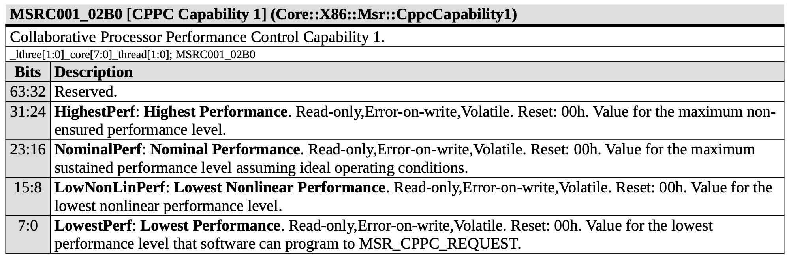
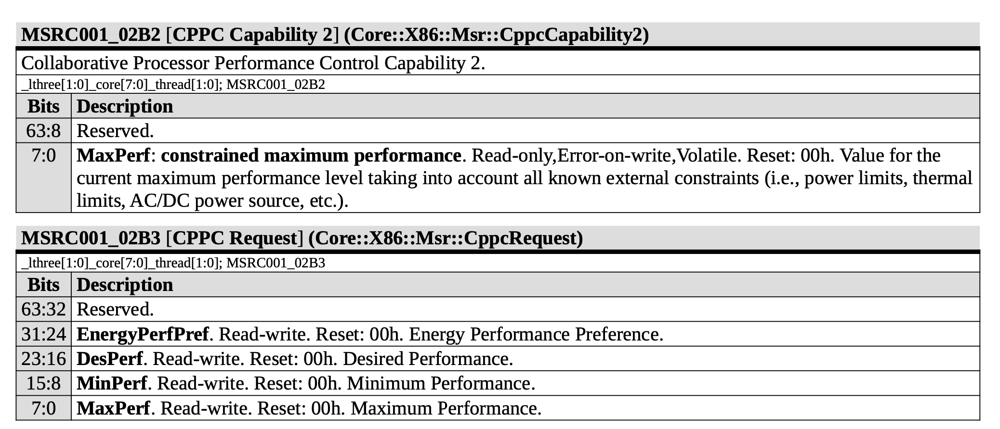

# Linux 大小核的调度算法探究

## 背景

最近看到一些关于 Linux 大小核调度算法的一些博客，考虑到大小核目前已经比较常见了，因此做一些现状的探究。

<!-- more -->

## 现象

### Intel

首先可以做一下实验，用 `stress --cpu N` 启动 N 个计算负载，看看这些线程都会被分配到哪些核上。在 Intel Core i9-14900K 上实验，这个 CPU 是 8P+16E，8P 对应 0-15 核，超线程的核的 ID 是连号的，16E 对应 16-31 核，观察到下面的结果：

- `N=1` 时，主要调度到 12-15 核里其中一个，这对应的是 8P 中的最后 2P
- `N=2` 时，主要调度到 12-13 核里其中一个，以及 14-15 核里其中一个，同样也是 8P 中的最后 2P，每个 P 上分配一个任务
- `N=3` 时，在 `N=2` 的基础上，在 0-11 核里再调度一个
- `N=4..=8` 时，在 `N=2` 的基础上，在 0-11 核里调度剩下的任务，但不会分配到一个 P 核的两个逻辑核上
- `N=9..=24` 时，在 `N=8` 的基础上，在 16-31 核里调度剩下的任务
- `N=25..=32` 时，在 `N=24` 的基础上，把任务分配到 P 核的第二个逻辑核上

可见在调度时，按照如下的优先级：

1. 最后 2 个 P 核
2. 其余 6 个 P 核
3. E 核
4. P 核的超线程

可见 P 核内部也有优先级不同，最后 2 个 P 核具有更高的优先级，而它们的 Boost 频率确实也更高：

```shell
$ cat /sys/devices/system/cpu/cpufreq/policy0/scaling_max_freq
5700000
$ cat /sys/devices/system/cpu/cpufreq/policy12/scaling_max_freq
6000000
```

6 个 P 核的最大频率设定为 5.7 GHz，2 个 P 核的最大频率设定为 6.0 GHz。因此这两个 6.0 GHz 的 P 核会被优先调度。此时再来看 [Intel® Core™ i9 processor 14900K Spec](https://www.intel.com/content/www/us/en/products/sku/236773/intel-core-i9-processor-14900k-36m-cache-up-to-6-00-ghz/specifications.html):

- Max Turbo Frequency: 6 GHz
- Intel® Thermal Velocity Boost Frequency: 6 GHz
- Intel® Turbo Boost Max Technology 3.0 Frequency: 5.8 GHz
- Performance-core Max Turbo Frequency: 5.6 GHz
- Performance-core Base Frequency: 3.2 GHz

可以看到，官方宣传的最高 Turbo 频率是 6 GHz，但实际上只有两个 P 核可以达到。

### AMD

在 AMD Ryzen 9 9950X 上进行类似的实验，这个 CPU 有 16 个核，0 核和 16 核对应一个物理核，其他依此类推，0-7 是一个 CCD，8-15 是另一个 CCD，得到的结果如下：

- `N=1` 时，主要调度到 4，9 和 20 核里其中一个
- `N=2` 时，主要调度到 0 和 16 核里其中一个，9 和 25 核里其中一个
- `N=3` 时，在 `N=2` 的基础上，调度到 4 和 20 核里其中一个
- `N=4` 时，在 `N=3` 的基础上，调度到 11 和 27 核里其中一个
- `N=5` 时，在 `N=4` 的基础上，调度到 5 和 21 核里其中一个
- `N=6` 时，在 `N=5` 的基础上，调度到 8 和 24 核里其中一个
- `N=7` 时，在 `N=6` 的基础上，调度到 3 和 19 核里其中一个
- `N=8` 时，在 `N=7` 的基础上，调度到 10 和 26 核里其中一个

查看它们的 `scaling_max_freq`，会发现都是相同的 5.752 GHz。查看它们的 `amd_pstate_prefcore_ranking`，发现取值和逻辑核的映射关系：

- 236: 0,4,16,20
- 231: 5,21
- 226: 3,19
- 221: 1,17
- 216: 2,18
- 211: 7,23
- 206: 6,22
- 201: 9,25
- 196: 11,27
- 191: 8,24
- 186: 10,26
- 181: 12,28
- 176: 13,29
- 171: 15,31
- 166: 14,30

按理说值越大的，越应该先被调度，应该按 0->4->5->3 的顺序分配，但实际上观察的结果并不是这样。寻找规律，发现它先从第一个 CCD 找到分数最高的，再从第二个 CCD 找，再回到第一个 CCD 找分数第二高的，依此类推：

1. 找第一个 CCD 分数最高的核：0
2. 找第二个 CCD 分数最高的核：9
3. 找第一个 CCD 分数第二高的核：4
4. 找第二个 CCD 分数第二高的核：11
5. 找第一个 CCD 分数第三高的核：5
6. 找第二个 CCD 分数第三高的核：8
7. 找第一个 CCD 分数第四高的核：3
8. 找第二个 CCD 分数第四高的核：10

说明它的逻辑是，轮流从两个 CCD 中取出一个分数尽量高的核去分配负载。

### Qualcomm

最后再看一下 Qualcomm X1E80100 平台，这个平台有三个 Cluster：0-3，4-7 和 8-11 是三个 Cluster。其中后两个 Cluster 的每个 Cluster 可以支持其中一个核心从 3.4 GHz Boost 到 4.0 GHz，加起来就是最多两个核心 Boost 到 4.0 GHz。打上 [cpufreq](https://patchew.org/linux/20240612124056.39230-1-quic._5Fsibis@quicinc.com/) 的补丁后，内核通过 scmi 接口得到了这些信息：

```shell
$ cat /sys/devices/system/cpu/cpufreq/policy*/scaling_max_freq
3417600
4012800
4012800
```

但实际调度起来，各个核心乱跑，而 3.4 GHz 距离 4.0 GHz 差距不小，性能差接近 15%，可见目前 Linux 内核并没有很好地适配，目前还是需要手动绑核。高通目前还提交了 [memlat govenor](https://patchwork.kernel.org/project/linux-arm-msm/list/?series=867688&state=*) 补丁来对 LLC/DDR 来进行 DVFS，但对这个问题应该没有改进。

## 分析

接下来就要进入到 Linux 源码，找到 Linux 是如何处理这些调度优先级的，这些优先级是谁确定的，又是怎么传递到 Linux 内核，又是怎么参与到调度的呢？

### Intel ITMT

首先来看一下 Intel 的补丁：[Support Intel Turbo Boost Max Technology 3.0](https://lore.kernel.org/lkml/cover.1479844244.git.tim.c.chen@linux.intel.com/)，这个 patch 做了这些事情：

1. [PATCH v8 8/8](https://lore.kernel.org/lkml/0998b98943bcdec7d1ddd4ff27358da555ea8e92.1479844244.git.tim.c.chen@linux.intel.com/): 读取 ACPI 的 CPPC 信息，得到每个核心的 highest_perf，根据 highest_perf，设置逻辑核的调度优先级：`sched_set_itmt_core_prio(cppc_perf.highest_perf, cpu);`
2. [PATCH v8 1/8](https://lore.kernel.org/lkml/0e73ae12737dfaafa46c07066cc7c5d3f1675e46.1479844244.git.tim.c.chen@linux.intel.com/): 修改调度器，让它尊重 arch_asym_cpu_priority 函数计算出来的优先级，而不是按照核心编号从小到大
3. [PATCH v8 3/8](https://lore.kernel.org/lkml/cd401ccdff88f88c8349314febdc25d51f7c48f7.1479844244.git.tim.c.chen@linux.intel.com/): 实现 arch_asym_cpu_priority，如果一个物理核对应 n 个逻辑核，那么第一个逻辑核的优先级乘以 n/1，第二个逻辑核的优先级乘以 n/2，依次类推。

简而言之，从 ACPI 中获取 CPPC 信息，把 CPPC 的 Highest Perf 设置为对应物理核的优先级，再根据物理核的优先级计算每个逻辑核的优先级，如果是 2-SMT，那就是第一个逻辑核的优先级翻倍，第二个逻辑核的优先级不变。但这个方法有局限性，就是要求 E 核的优先级介于 P 核的两个优先级之间，设置起来比较别扭。后来针对 SMT 的处理被集成到了调度器当中，因此从 itmt 的视角来看，不需要针对 SMT 进行特殊处理，SMT 的核设置为同一个优先级即可：[x86/sched/itmt: Give all SMT siblings of a core the same priority](https://github.com/torvalds/linux/commit/046a5a95c3b0425cfe79e43021d8ee90c1c4f8c9)。

在 Intel i9-14900K 平台上，无论大小核，Highest Perf 都等于 255，此时无法通过 Highest Perf 来区分核心的体质，此时会触发下面的[代码](https://github.com/torvalds/linux/blob/c2ee9f594da826bea183ed14f2cc029c719bf4da/drivers/cpufreq/intel_pstate.c#L363-L371)：

```cpp
/*
 * If CPPC is not available, fall back to MSR_HWP_CAPABILITIES bits [8:0].
 *
 * Also, on some systems with overclocking enabled, CPPC.highest_perf is
 * hardcoded to 0xff, so CPPC.highest_perf cannot be used to enable ITMT.
 * Fall back to MSR_HWP_CAPABILITIES then too.
 */
if (ret || cppc_perf.highest_perf == CPPC_MAX_PERF)
	cppc_perf.highest_perf = HWP_HIGHEST_PERF(READ_ONCE(all_cpu_data[cpu]->hwp_cap_cached));
```

查看各个核心上 MSR_HWP_CAPABILITIES MSR 记录的 Highest Perf 值：

```shell
for i in $(seq 0 31); do sudo turbostat -c $i -n 1 2 --interval 1 2>&1 | grep MSR_HWP_CAPABILITIES; done
```

发现后两个 P 核的 highest perf 是 77，其他 P 核的 highest perf 是 73，E 核的 highest perf 是 44。因此 Linux 的调度策略就出来了：先是后两个 P 核，再是其他 P 核，然后是 E 核，最后是 SMT 出来的逻辑核。

### ACPI CPPC

接下来，查看 ACPI 的 CPPC 信息保存了什么。[CPPC](https://uefi.org/specs/ACPI/6.5/08_Processor_Configuration_and_Control.html?highlight=cppc#collaborative-processor-performance-control) 全称是 Collaborative Processor Performance Control，是对已有的 P State 的改进，原来的 P State 是分立的几个配置，可选项比较少，CPPC 对性能做了抽象，每个核心可以有 Highest Performance，Nominal Performance，Lowest Nonlinear Performance 和 Lowest Performance 这几个值，性能可以在这些值之间浮动。简单来说，Highest 对应单核 Boost 到的最高性能，Nominal 对应全核能达到的性能，Lowest 对应最低频下的性能，Lowest Nonlinear 代表性能功耗比线性的界限，往下性能核功耗是线性的，往上性能功耗比会下降。OS 可以设定想要的性能范围：Minimum 和 Maximum Perf，也可以指定一个想要的性能 Desired Performance。当然了，硬件也不一定能够达到 Highest Perf，当前能保证达到的最高性能叫做 Guaranteed Perf。此外还有 Energy Performance Preference (EPP)，OS 告诉硬件，我想要能效还是性能。

简单来说，硬件告诉 OS 五个值：Highest Perf，Nominal Perf，Lowest Nonlinear Perf，Lowest Perf 和 Guaranteed Perf，OS 通过三个值告诉硬件，我想要什么样的性能：Min Perf，Max Perf，Desired Perf，以及性能和功耗哪个更看重：EPP。

### AMD CPPC

在 AMD 平台上，CPPC 的这些性能值既可以通过 ACPI 获取，又可以通过 MSR 来读写（来源：[Processor Programming Reference (PPR) for AMD Family 1Ah Model 24h, Revision B0 Processors](https://www.amd.com/content/dam/amd/en/documents/processor-tech-docs/software-optimization-guides/57254-PUB_3.00.zip)）：





通过比对 `/sys/devices/system/cpu/cpu*/acpi_cppc/highest_perf` 和 `/sys/devices/system/cpu/cpu*/cpufreq/amd_pstate_prefcore_ranking`，我们会发现它们是一样的，说明 amd-pstate 驱动做的事情和 itmt 类似，根据 ACPI 的 Highest Perf 信息（或者从 MSR 0xC001_02B0 读出 Highest Perf），设置 Preferred Core Ranking 以及调度器的优先级。阅读代码，可以看到它确实是这么做的：

1. 初始化中，设置优先级为 `highest_perf`：[`sched_set_itmt_core_prio((int)READ_ONCE(cpudata->highest_perf), cpudata->cpu);`](https://github.com/torvalds/linux/blob/c2ee9f594da826bea183ed14f2cc029c719bf4da/drivers/cpufreq/amd-pstate.c#L796)
2. 设置 `prefcore_ranking` 为 `highest_perf`: [`WRITE_ONCE(cpudata->prefcore_ranking, cppc_perf.highest_perf)`](https://github.com/torvalds/linux/blob/c2ee9f594da826bea183ed14f2cc029c719bf4da/drivers/cpufreq/amd-pstate.c#L402)
3. 运行过程中，如果发现 `highest_perf` 出现变化，也更新到调度器的优先级当中：[`sched_set_itmt_core_prio((int)cur_high, cpu);`](https://github.com/torvalds/linux/blob/master/drivers/cpufreq/amd-pstate.c#L822)

剩下的就和 Intel 一样了。至于为什么调度器轮流从两个 CCD 取优先级最高的核心调度，应该是调度器考虑了这些核心的拓扑，进行了负载均衡，尽量保证每个 CCD 上的负载相当。

而我们知道 Linux 的 cpufreq 设置了不同的 governor，例如 performance 和 powersave。那么它们是怎么映射到 Min/Max/Desired Perf 的呢？通过阅读代码，可以发现：

1. powersave 对应的配置是：Min Perf 设置为 Lowest/Lowest Nonlinear Perf，Max Perf 设置为 Highest/Nominal Perf
2. performance 对应的配置是：Min Perf 和 Max Perf 都设置为 Highest/Nominal Perf

如果启用 boost（`echo 1 > /sys/devices/system/cpu/cpufreq/policy0/boost`），那就把 Max Perf 设置到 Highest Perf；如果不启用 Boost，就设置到 Nominal Perf。

下面给出几个例子，其中 Highest Perf 为 166，Nominal Perf 为 124，Lowest Perf 为 18：

1. performance + boost=1：Min = 166, Max = 166
2. performance + boost=0: Min = 124, Max = 124
3. powersave + boost=1：Min = 18, Max = 166
4. powersave + boost=0: Min = 18, Max = 124

### Qualcomm

arm64 架构没有实现 arch_asym_cpu_priority 函数，因此用的不是上述 Intel/AMD 的机制，而是在 Device Tree 中用 [capacity-dmips-mhz](https://www.kernel.org/doc/Documentation/devicetree/bindings/arm/cpu-capacity.txt) 标记每个核心的性能，但是 X Elite 的 DTS 没有记录这个信息，因此 Linux 内核也就无法合理地调度了。因此一个可能的解决办法是，给后两个 Cluster 的一个核设置更高的 capacity-dmips-mhz，其他的核心都设置成一样，目前还没有进行实际的尝试。但其实通常来说，对于同一个核来说，提高频率以后，DMIPS/MHz 反而是下降的，内核用 DMIPS/MHz 这个指标，主要是用来区分大小核，而不是用来判断有没有 Boost。

## 小结

针对不同核心的不同性能以及 SMT，Linux 的调度器需要知道各个逻辑核心的调度优先级。在 Intel/AMD 平台上，这个信息目前主要是通过 CPPC 的 Highest Perf 来获取，也可能 Fallback 到 MSR_HWP_CAPABILITIES 上。在 ARM64 平台上，则需要 DTS 标记各核心的性能。

## 参考

- [谈谈 Linux 与 ITMT 调度器与多簇处理器](https://blog.hjc.im/thoughts-on-linux-preferred-cores-and-multi-ccx.html)
- [Intel CPU 上面的 Linux 大小核调度问题](https://zhiwei-lii.github.io/intel-cpu%E4%B8%8A%E9%9D%A2%E7%9A%84linux%E5%A4%A7%E5%B0%8F%E6%A0%B8%E8%B0%83%E5%BA%A6%E9%97%AE%E9%A2%98/)
