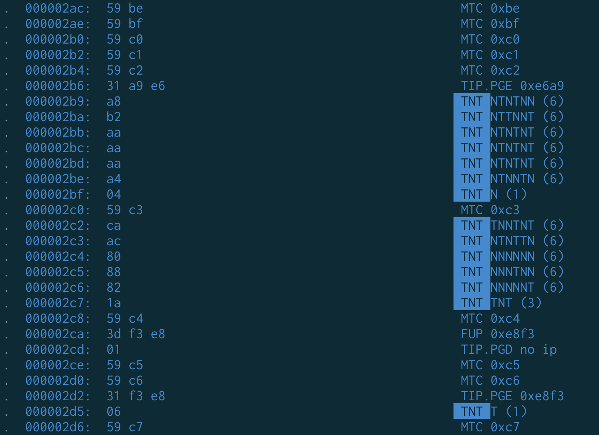
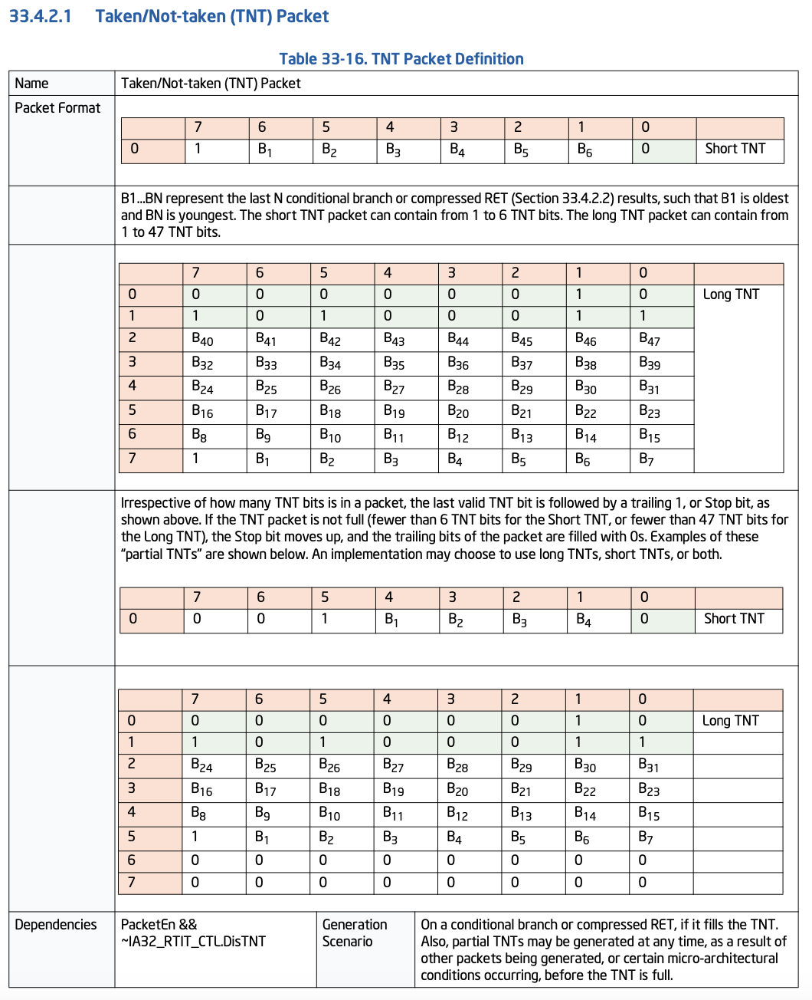
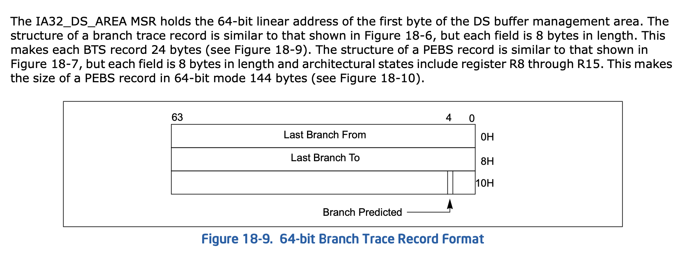

# Linux 的性能分析（Perf）实现探究

## 背景

最近使用 Linux 的性能分析功能比较多，但是很少去探究背后的原理，例如硬件的 PMU 是怎么配置的，每个进程乃至每个线程级别的 PMU 是怎么采样的。这篇博客尝试探究这背后的原理。

<!-- more -->

## PMU

### 硬件

支撑性能分析的背后是硬件提供的机制，最常用的就是性能计数器：硬件会提供一些可以配置的性能计数器，在对应的硬件事件触发是，更新这些计数器，然后再由程序读取计数器的值并统计。下面以 ARMv8 为例，分析一下硬件提供的性能计数的接口：

1. Cycle 计数器：Cycle Counter Register(PMCCNTR_EL0) 和 Cycle Count Filter Register(PMCCFILTR_EL0)，其中后者控制前者在什么特权态下会进行计数
2. 最多 31 个通用性能计数器：
    1. 该性能计数器记录的硬件事件以及计数的条件：PMEVTYPER<n>_EL0，n 取 0 到 31
    2. 该性能计数器当前的值：PMEVCNTR<n>_EL0，n 取 0 到 31
3. 控制 Cycle 计数器和通用性能计数器的状态：PMCNTENCLR_EL0/PMCNTENSET_EL0/PMCR_EL0
4. 各计数器是否溢出：PMOVSCLR_EL0/PMOVSSET_EL0
5. 当计数器溢出时，PMU 会拉起中断，针对这些中断的配置：PMINTENCLR_EL1/PMINTENSET_EL1

注：实际上，由于经常会对指令数进行采样，ARM v9.4/8.9 允许硬件实现一个额外的指令计数器，和 Cycle 计数器类似。

如果想要在用户态频繁地读取性能计数器（cap_user_rdpmc），避免频繁进入内核的开销，也可以在用户态中直接读取性能计数器 PMCCNTR_EL0/PMEVCNTR<n>_EL0：内核在 PMUSERENR_EL0 中进行相应的权限配置即可。v3.9 或更高版本的 PMU 实现允许按照每个 counter 的粒度来控制用户态是否允许访问（PMUACR）。

LoongArch 也是类似的，其接口更简单：它只有通用性能计数器，有如下的 csr 来配置各个性能计数器：

1. 性能计数器的值：perfcntr<n>
2. 性能计数器的配置：perfctrl<n>，有如下字段：
    1. EVENT: 事件编号
    2. PLV{0,1,2,3}: 特权态过滤，对应四个特权态下是否采样
    3. IE：是否启用溢出中断
3. misc.rpcntl3：允许用户态程序读取性能计数器

### 内核驱动

在 Linux 内核中，负责控制 ARMv8 性能计数接口的代码在 [arm_pmuv3.c](https://github.com/torvalds/linux/blob/master/drivers/perf/arm_pmuv3.c) 当中。根据这个硬件接口，可以预想到，如果要对一段程序观察它在某个计数器上的取值，需要：

1. 分配一个性能计数器，可能是 Cycle 计数器或者通用性能计数器：对应 [armv8pmu_get_event_idx](https://github.com/torvalds/linux/blob/7cb1b466315004af98f6ba6c2546bb713ca3c237/drivers/perf/arm_pmuv3.c#L938) 函数，先分配 Cycle 计数器，再从剩下的通用性能计数器中找到一个空闲的
2. 配置并启用该性能计数器，对应 [armv8pmu_enable_event](https://github.com/torvalds/linux/blob/7cb1b466315004af98f6ba6c2546bb713ca3c237/drivers/perf/arm_pmuv3.c#L796) 函数：
    1. 把事件类型写入到 PMEVTYPER<n>_EL0 中，对应 [armv8pmu_write_event_type](https://github.com/torvalds/linux/blob/7cb1b466315004af98f6ba6c2546bb713ca3c237/drivers/perf/arm_pmuv3.c#L629) 函数
    2. 启用事件对应的溢出中断，写入 PMINTENSET_EL1，对应 [armv8pmu_enable_event_irq](https://github.com/torvalds/linux/blob/7cb1b466315004af98f6ba6c2546bb713ca3c237/drivers/perf/arm_pmuv3.c#L714) 函数
    3. 事件开始计数，写入 PMCNTENSET_EL0，对应 [armv8pmu_enable_event_counter](https://github.com/torvalds/linux/blob/7cb1b466315004af98f6ba6c2546bb713ca3c237/drivers/perf/arm_pmuv3.c#L675) 函数
3. 在程序开始前，从 PMEVCNTR<n>_EL0 读取一次计数器的当前取值，对应 [armv8pmu_read_counter](https://github.com/torvalds/linux/blob/7cb1b466315004af98f6ba6c2546bb713ca3c237/drivers/perf/arm_pmuv3.c#L566) 函数
4. 在程序结束时，再读取一次计数器的当前取值，和程序开始时的值求差
5. 为了解决溢出的问题：配置中断，在溢出时会进入中断处理代码，统计溢出次数，计入差值的高位，对应 [armv8pmu_handle_irq](https://github.com/torvalds/linux/blob/7cb1b466315004af98f6ba6c2546bb713ca3c237/drivers/perf/arm_pmuv3.c#L840) 函数

### Perf 子系统

除了由单独的架构相关的内核驱动负责配置硬件以外，还需要由 Perf 子系统来处理来自用户的 perf 使用。具体地，内核驱动会注册一个 `struct pmu` 给 Perf 子系统，实现这些函数：

```c
// Fully disable/enable this PMU
void (*pmu_enable)		(struct pmu *pmu); /* optional */
void (*pmu_disable)		(struct pmu *pmu); /* optional */
// Try and initialize the event for this PMU.
int (*event_init)		(struct perf_event *event);
// Adds/Removes a counter to/from the PMU
int  (*add)			(struct perf_event *event, int flags);
void (*del)			(struct perf_event *event, int flags);
// Starts/Stops a counter present on the PMU.
void (*start)			(struct perf_event *event, int flags);
void (*stop)			(struct perf_event *event, int flags);
// Updates the counter value of the event.
void (*read)			(struct perf_event *event);
```

可见在内核里，PMU 计数器的抽象是 `struct perf_event`，这个是架构无关的，根据用户态程序通过 `perf_event_open` 构造出来的；内核驱动就会根据这个 `struct perf_event` 去进行实际的硬件计数器的配置。例如用户程序在 `struct perf_event_attr` 里设置 `exclude_kernel = 1`，就会传到 `struct perf_event` 当中，最后在相应的内核驱动中，变成硬件性能计数器配置里，计数时忽略内核所在特权态的配置。

TODO: sampling

TODO: cap_user_rdpmc

TODO: thread/process context switch

### 虚拟化

在虚拟化场景下，依然希望虚拟机内的 OS 可以有性能计数器可以用，同时宿主机上也可能希望获取虚拟机的性能计数器信息。

一种方法是以纯软件的方法去实现性能计数器，比如 [QEMU 的 TCG 模式](https://github.com/qemu/qemu/blob/1cf9bc6eba7506ab6d9de635f224259225f63466/target/arm/helper.c#L996)，可以模拟出一个以固定频率运行的处理器的 Cycle 计数器，但实际上就是拿时间除以频率，是假的性能计数器；此外还能模拟出 Instruction 计数器，因为 QEMU 在做指令翻译的时候，可以顺带记录下执行的指令数；而微架构相关的性能计数器就没法靠这个来实现了。

另一种方法则是在硬件虚拟化的基础上，让虚拟机享受到性能计数器。不过为了安全性，宿主机可以获取虚拟机的性能计数器，但反过来，虚拟机的性能计数器不应该得到宿主机的信息。

目前 LoongArch KVM 已经支持性能计数器的虚拟化，下面来看它是怎么做的：

1. 给宿主机（host）维护一份性能计数器的上下文，用 [kvm_save_host_pmu](https://github.com/torvalds/linux/blob/7cb1b466315004af98f6ba6c2546bb713ca3c237/arch/loongarch/kvm/vcpu.c#L35) 保存，用 [kvm_restore_host_pmu](https://github.com/torvalds/linux/blob/7cb1b466315004af98f6ba6c2546bb713ca3c237/arch/loongarch/kvm/vcpu.c#L50) 恢复
2. 再给每个虚拟机（guest）维护一份性能计数器的上下文，此时为了访问虚拟机的 csr，要访问 gcsr(guest csr)：用 [kvm_save_guest_pmu](https://github.com/torvalds/linux/blob/7cb1b466315004af98f6ba6c2546bb713ca3c237/arch/loongarch/kvm/vcpu.c#L66) 保存，用 [kvm_restore_guest_pmu](https://github.com/torvalds/linux/blob/7cb1b466315004af98f6ba6c2546bb713ca3c237/arch/loongarch/kvm/vcpu.c#L80)
3. 当虚拟机（guest）因为各种原因回到了 VMM，就要进行[上下文切换](https://github.com/torvalds/linux/blob/7cb1b466315004af98f6ba6c2546bb713ca3c237/arch/loongarch/kvm/vcpu.c#L94)，保存虚拟机的性能计数器，恢复宿主机的性能计数器；同理，进入虚拟机时，再次进行[上下文切换](https://github.com/torvalds/linux/blob/7cb1b466315004af98f6ba6c2546bb713ca3c237/arch/loongarch/kvm/vcpu.c#L113)，保存宿主机的性能计数器，恢复虚拟机的性能计数器


## Intel PT

Intel PT 是 Intel 平台上跟踪指令流的机制，它可以记录这些信息：

1. 页表的修改
2. 时钟周期
3. 分支跳转
4. 功耗状态变化

perf 工具也是支持用 Intel PT 进行跟踪的：[perf-intel-pt(1) — Linux manual page](https://www.man7.org/linux/man-pages/man1/perf-intel-pt.1.html)，下面的命令用 Intel PT 跟踪一条命令的执行过程，并显示出它生成的跟踪信息：

```shell
perf record -e intel_pt//u ls
# itrace: instruction trace
# i: instructions events
# y: cycles events
# b: branches events
# x: transactions events
# w: ptwrite events
# p: power events
# e: error events
perf script --itrace=iybxwpe
```

比如写一个循环 10 次的代码：

```cpp
int main() {
  for (int i = 0; i < 10; i++) {
  }
}
```

对应的汇编：

```asm
0000000000001129 <main>:
    1129:       55                      push   %rbp
    112a:       48 89 e5                mov    %rsp,%rbp
    112d:       c7 45 fc 00 00 00 00    movl   $0x0,-0x4(%rbp)
    1134:       eb 04                   jmp    113a <main+0x11>
    1136:       83 45 fc 01             addl   $0x1,-0x4(%rbp)
    113a:       83 7d fc 09             cmpl   $0x9,-0x4(%rbp)
    113e:       7e f6                   jle    1136 <main+0xd>
    1140:       b8 00 00 00 00          mov    $0x0,%eax
    1145:       5d                      pop    %rbp
    1146:       c3                      ret
```

按照上述方法，可以看到它生成了各个分支跳转的信息：

```log
test1 3772291 [006] 1693209.504363:          1     branches:u:      7311943d6248 __libc_start_call_main+0x78 (/usr/lib/x86_64-linux-gnu/libc.so.6) =>     5b4f1df51129 main+0x0 (/home/jiegec/test1)
test1 3772291 [006] 1693209.504363:          1     branches:u:      5b4f1df51134 main+0xb (/home/jiegec/test1) =>     5b4f1df5113a main+0x11 (/home/jiegec/test1)
test1 3772291 [006] 1693209.504363:          1     branches:u:      5b4f1df5113e main+0x15 (/home/jiegec/test1) =>     5b4f1df51136 main+0xd (/home/jiegec/test1)
test1 3772291 [006] 1693209.504363:          1     branches:u:      5b4f1df5113e main+0x15 (/home/jiegec/test1) =>     5b4f1df51136 main+0xd (/home/jiegec/test1)
test1 3772291 [006] 1693209.504363:          1     branches:u:      5b4f1df5113e main+0x15 (/home/jiegec/test1) =>     5b4f1df51136 main+0xd (/home/jiegec/test1)
test1 3772291 [006] 1693209.504363:          1     branches:u:      5b4f1df5113e main+0x15 (/home/jiegec/test1) =>     5b4f1df51136 main+0xd (/home/jiegec/test1)
test1 3772291 [006] 1693209.504363:          1     branches:u:      5b4f1df5113e main+0x15 (/home/jiegec/test1) =>     5b4f1df51136 main+0xd (/home/jiegec/test1)
test1 3772291 [006] 1693209.504363:          1     branches:u:      5b4f1df5113e main+0x15 (/home/jiegec/test1) =>     5b4f1df51136 main+0xd (/home/jiegec/test1)
test1 3772291 [006] 1693209.504363:          1     branches:u:      5b4f1df5113e main+0x15 (/home/jiegec/test1) =>     5b4f1df51136 main+0xd (/home/jiegec/test1)
test1 3772291 [006] 1693209.504363:          1     branches:u:      5b4f1df5113e main+0x15 (/home/jiegec/test1) =>     5b4f1df51136 main+0xd (/home/jiegec/test1)
test1 3772291 [006] 1693209.504363:          1     branches:u:      5b4f1df5113e main+0x15 (/home/jiegec/test1) =>     5b4f1df51136 main+0xd (/home/jiegec/test1)
test1 3772291 [006] 1693209.504363:          1     branches:u:      5b4f1df5113e main+0x15 (/home/jiegec/test1) =>     5b4f1df51136 main+0xd (/home/jiegec/test1)
test1 3772291 [006] 1693209.504363:          1     branches:u:      5b4f1df51146 main+0x1d (/home/jiegec/test1) =>     7311943d624a __libc_start_call_main+0x7a (/usr/lib/x86_64-linux-gnu/libc.so.6)
```

通过这个信息，就可以还原出程序执行了哪些代码：

1. __libc_start_call_main 调用 main 函数，到入口 0x1129(main+0x0)
2. 从 0x1134(main+0xb) 跳转到 0x113a(main+0x11)
2. 循环 10 次：0x113e(main+0x15) 跳转到 0x1136(main+0xd)
3. 最终 在 0x1146(main+0x1d) return 回到 __libc_start_call_main 函数

如果要看 Intel PT 到底生成了什么数据，可以用 `perf script -D` 显示。例如要记录分支跳转还是不跳转的历史，用的是如下的 TNT(Taken/Not Taken) packet：



TNT packet 的定义在 [Intel® 64 and IA-32 Architectures Software Developer Manuals](https://www.intel.com/content/www/us/en/developer/articles/technical/intel-sdm.html) 中给出：



由于 Intel PT 的数据量很大，它和 SPE 类似，也是在内存中保存 trace 信息。

## Intel LBR

Intel LBR(Last Branch Record) 机制记录了处理器最近若干次控制流转移，比如 taken branch。它记录的数量很小，信息直接保存在 MSR 当中，而不是像前面的 SPE 和 Intel PT 那样，需要在内存中记录信息。

LBR 在 perf 中，主要用来跟踪 call stack：设置 LBR，只记录 call 指令，并且打开 call-stack 模式，那么 LBR 记录的就是当前的 call stack，perf 可以利用这个信息来找到当前函数的调用链，虽然有长度限制。除了 lbr 以外，perf 还支持利用 fp(frame pointer) 或 dwarf(调试信息) 来[寻找调用链](https://man7.org/linux/man-pages/man1/perf-record.1.html)：

```
--call-graph
    Setup and enable call-graph (stack chain/backtrace)
    recording, implies -g. Default is "fp" (for user space).

    Valid options are "fp" (frame pointer), "dwarf" (DWARF's CFI -
    Call Frame Information) or "lbr" (Hardware Last Branch Record
    facility).
```

和 Intel PT 相比，它记录的信息较少，但实现上也更简单，开销更小。而且 LBR 只会记录跳转的分支，不会记录没跳转的分支，此外就是记录的分支数有上限。

## Intel BTS

较早的 Intel 处理器没有实现 Intel PT，但考虑到 LBR 记录的历史长度限制，基于 LBR 做了一个把 LBR 信息保存到内存里的技术，叫做 Branch Trace Store。perf 也支持[基于 BTS](https://github.com/torvalds/linux/blob/master/tools/perf/Documentation/intel-bts.txt) 来记录分支历史：

```shell
# record
sudo perf record --per-thread -e intel_bts//u ls
# display trace
sudo perf script
# dump raw data
sudo perf script -D
```

BTS 每个 entry 占用 24 字节，包括 8 字节的 Last Branch From 和 8 字节的 Last Branch To，还有 8 字节记录了分支预测正确还是错误（图源 [Intel® 64 and IA-32 Architectures Software Developer Manuals](https://www.intel.com/content/www/us/en/developer/articles/technical/intel-sdm.html)）：



和 LBR 一样，BTS 只记录跳转的分支，不记录没跳转的分支。

## Intel PEBS

Intel PEBS(Processor Event Based Sampling) 是一种硬件的采样方法，顾名思义，当处理器触发某些事件时，自动进行一次采样。这个事件，实际上就是某个性能计数器溢出。本来，性能计数器溢出的时候，应该触发中断，让内核维护性能计数器的真实值（例如硬件实现了 32 位计数器，但内核维护的是 64 位）；但在 PEBS 中，这个性能计数器的溢出事件被用来触发硬件的采样：计数溢出的时候，会捕捉当前的处理器状态（PC、访存地址和延迟、通用寄存器和浮点寄存器的值、时钟周期计数和 LBR 信息），把状态写入到内存中的缓冲区，并自动把性能计数器设为指定的复位值。当内存中的缓冲区满的时候，才会触发中断，让内核来处理 PEBS 生成的数据，并分配新的空间。

和基于软件的采样相比，PEBS 可以精细地根据性能计数器来决定采样的频率，例如每 1000 条指令采样一次，每 1000 个周期采样一次，甚至每 1000 次缓存缺失采样一次。具体做法是，把对应的性能计数器的复位值设置为最大值减 1000，那么每次溢出触发 PEBS 采样以后，性能计数器会被设置为最大值减 1000，等性能计数器增加 1000 以后，再次溢出，触发 PEBS 采样，如此循环。

## ARMv8 BRBE

ARMv8 平台定义了 BRBE(Branch Record Buffer Extension)，它和 Intel LBR 类似，也是在 System Register 中记录最近若干条跳转的分支的信息。它会记录 taken branch 的这些信息：

1. 源地址
2. 目的地址
3. 距离上一次 taken branch 的周期数
4. 分支类型
5. 特权态（EL）
6. 分支预测结果

不跳转的条件分支指令就不记录。和 LBR 类似，它也支持根据分支类型过滤，因此也可以用于 call graph 的抓取。

## ARMv8 SPE

ARMv8 平台定义了 SPE(Statistical Profiling Extension)，它的做法是基于采样的：硬件上每过一段时间，采样一个操作，比如正在执行的指令；采样得到的操作的详细信息会写入到内存当中，由内核驱动准备好的一段空间。空间满的时候，会发中断通知内核并让内核重新分配空间。

`perf record` 在默认参数下的工作原理和 SPE 有点像，都是定时打断程序并采样，但 `perf record` 是基于软件的方式，而 SPE 是硬件采样，同时可以提供更多的微架构信息（延迟，访存地址，是否命中 TLB，分支跳转与否等等）。

SPE 的内核驱动实现在 [arm_spe_pmu.c](https://github.com/torvalds/linux/blob/f92f4749861b06fed908d336b4dee1326003291b/drivers/perf/arm_spe_pmu.c#L754) 当中；它做的事情是，在内存中分配好缓冲区，启动 SPE，并且在 SPE 触发中断时，进行缓冲区的维护；同时缓冲区中的数据会通过 [perf ring buffer (aka perf aux)](https://docs.kernel.org/userspace-api/perf_ring_buffer.html) 传递给用户态的程序，具体数据的解析是由用户态的程序完成的。如果用 perf 工具，那么这个解析和展示的工作就是由 perf 完成的。

SPE 和 Intel PEBS 比较类似，不过它没有和性能计数器耦合起来，它就是数指令数。

## 参考

- [Arm Architecture Reference Manual for A-profile architecture](https://developer.arm.com/documentation/ddi0487/latest/)
- [LoongArch Reference Manual Volume 1: Basic Architecture](https://loongson.github.io/LoongArch-Documentation/LoongArch-Vol1-EN.html)

