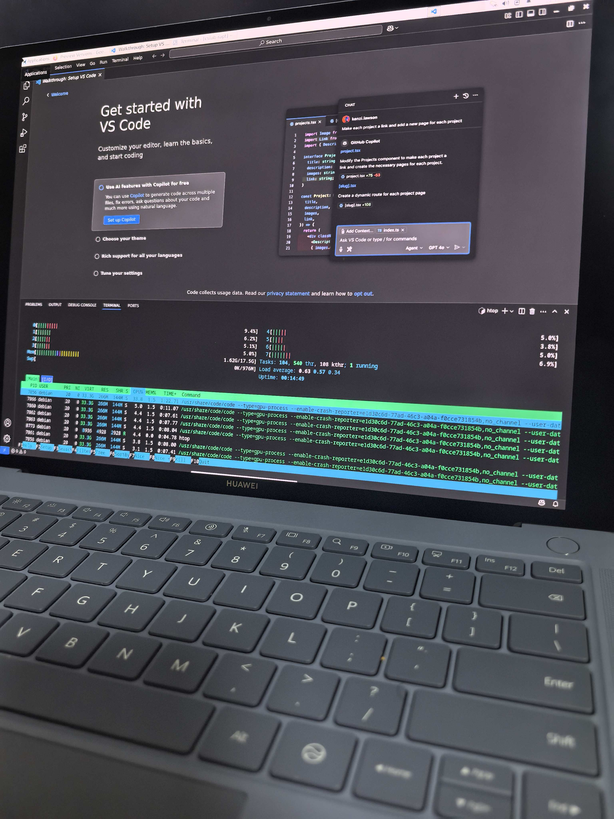

# 在鸿蒙电脑上的虚拟机内启动 Linux

## 背景

最近在研究鸿蒙电脑，群友 [@Fearyncess](https://github.com/Fearyncess) 摸索出了，如何在鸿蒙电脑上的虚拟机内启动 Linux，而不是 Windows。在此做个复现并记录。

<!-- more -->

## 方法

目前鸿蒙的应用市场上有两家虚拟机，我用 Oseasy 虚拟机，但是理论上铠大师也是可以的。

首先需要在 U 盘上，把一个 UEFI arm64 的 Linux 安装盘写进去。我用的是 Ventoy + Debian Installer，理论上直接写例如 Debian 发行版的安装 ISO 也是可以的。

然后把 U 盘插到鸿蒙电脑上，打开 Windows 虚拟机，直通到虚拟机里面，保证虚拟机里面可以看到 U 盘。

接着，进入 Windows 磁盘管理，缩小 Windows 的 NTFS 分区，留出空间。注意 Windows 启动的时候会自动 growpart，所以装 Debian 前，不要回到 Windows。装好以后，可以继续用 Windows。

接着，重启 Windows，同时按住 Escape，进入 OVMF 的界面，然后选择 Boot Manager，从 U 盘启动，然后就进入 Ventoy 的界面了。

剩下的就是正常的 Linux 安装过程了，分区的时候，注意保留 Windows 已有的 NTFS，可以和 Windows 用同一个 ESP 分区。网络的话，配置静态 IP 是 172.16.100.2，默认网关是 172.16.100.1 即可。重启以后，在 grub 界面，修改 linux 配置，在 cmdline 一栏添加 `modprobe.blacklist=vmwgfx`，这样就能启动了。内核版本是 Debian Bookworm 的 6.1。6.12 的版本会起不来。

最终效果：



## 附录

Geekbench 6 测试结果：

- 6 核：[Windows Single-Core 1436, Multi-Core 5296](https://browser.geekbench.com/v6/cpu/12309313) [Linux Single-Core 1500, Multi-Core 5699](https://browser.geekbench.com/v6/cpu/12373700)
- 8 核：[Windows Single-Core 1462, Multi-Core 7043](https://browser.geekbench.com/v6/cpu/12309427) [Linux Single-Core 1489, Multi-Core 6076](https://browser.geekbench.com/v6/cpu/12373488) [Linux Single-Core 1503, Multi-Core 6289](https://browser.geekbench.com/v6/cpu/12373797)

如果没有 blacklist 的话，vmwgfx 驱动的报错：

```log
vmwgfx 0000:00:04.0: [drm] FIFO at 0x0000000020000000 size is 2048 kiB
vmwgfx 0000:00:04.0: [drm] VRAM at 0x0000000010000000 size is 262144 kiB
vmwgfx 0000:00:04.0: [drm] *ERROR* Unsupported SVGA ID 0xffffffff on chipset 0x405
vmwgfx: probe of 0000:00:04.0 failed with error -38
```

blacklist vmwgfx 后用的是 efifb：

```log
[    0.465898] pci 0000:00:04.0: BAR 1: assigned to efifb
[    1.197638] efifb: probing for efifb
[    1.197705] efifb: framebuffer at 0x10000000, using 7500k, total 7500k
[    1.197708] efifb: mode is 1600x1200x32, linelength=6400, pages=1
[    1.197711] efifb: scrolling: redraw
[    1.197712] efifb: Truecolor: size=8:8:8:8, shift=24:16:8:0
```
